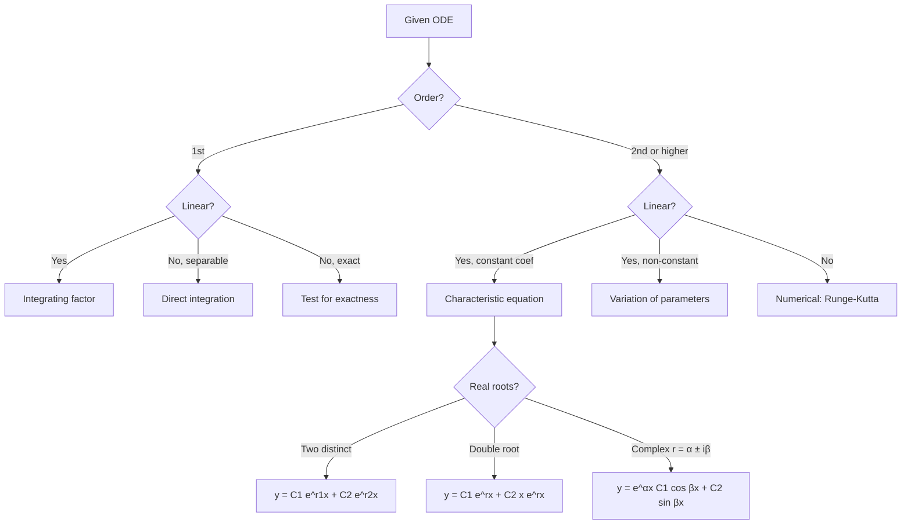
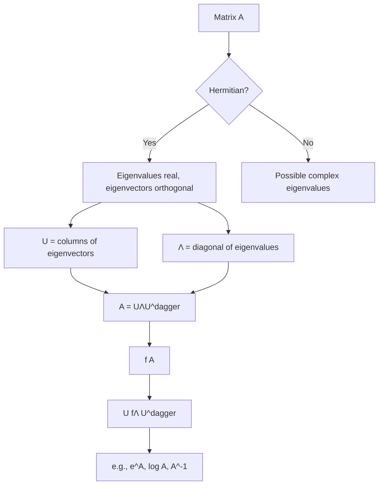
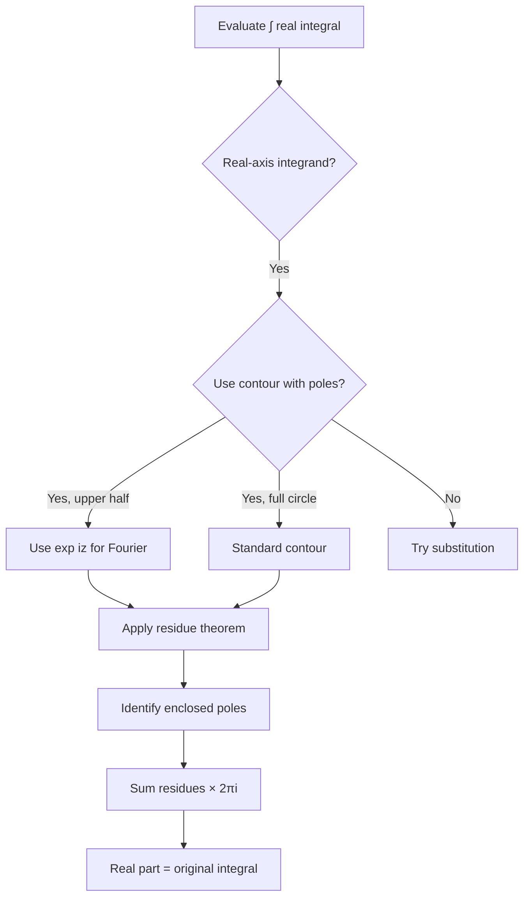
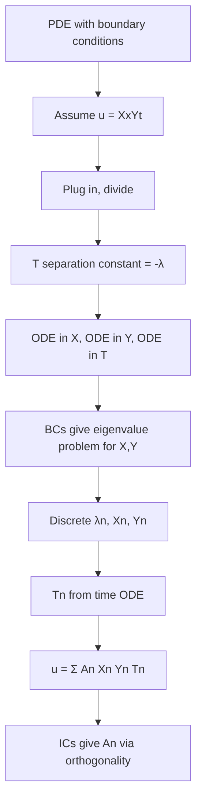
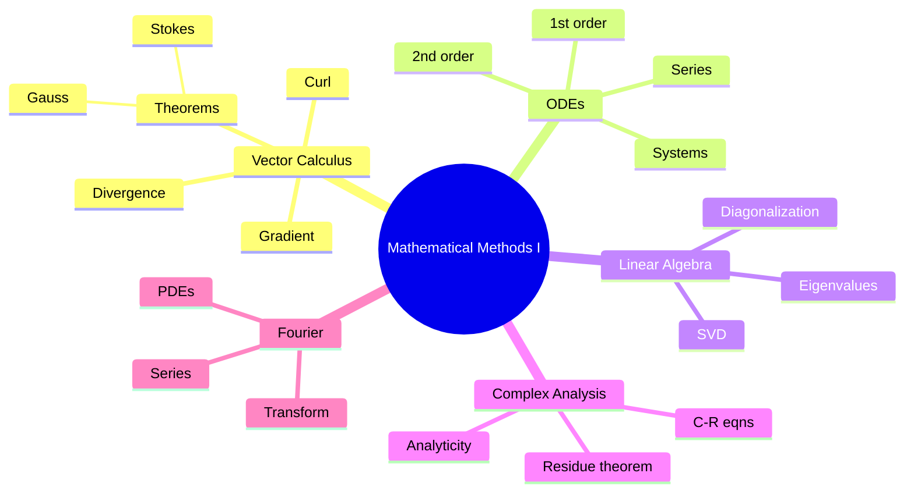
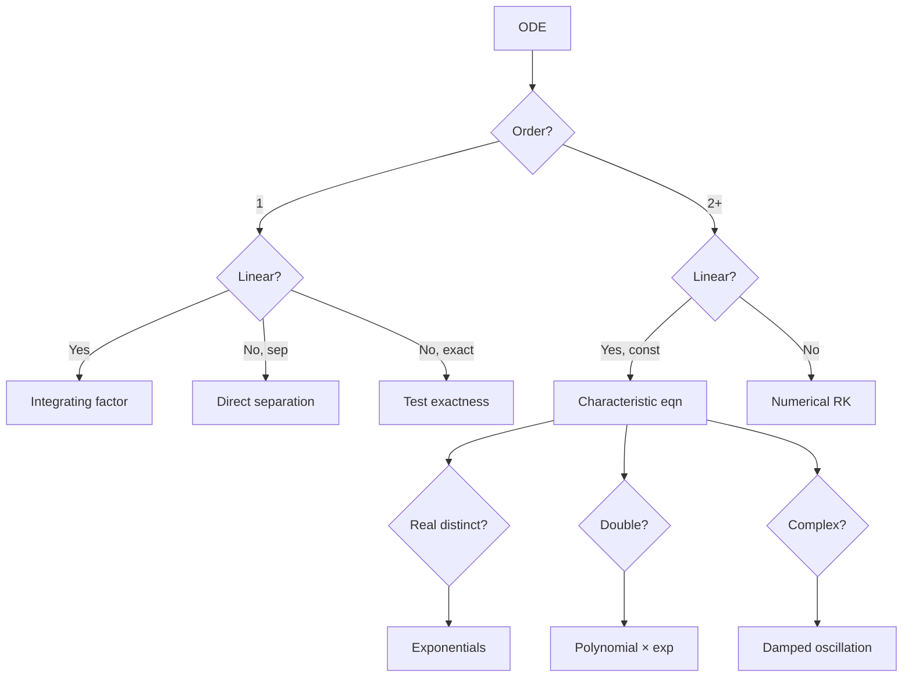
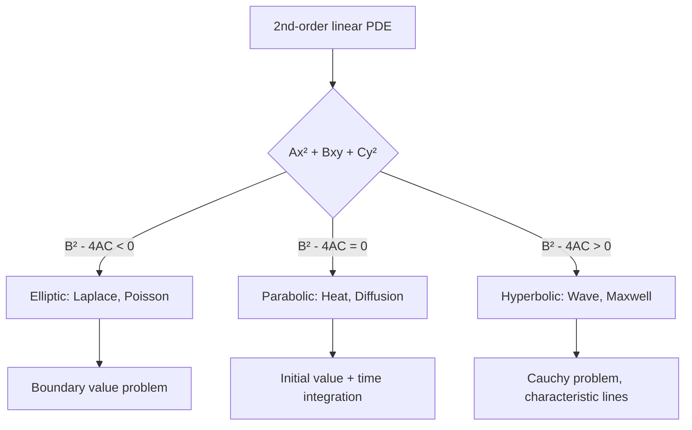
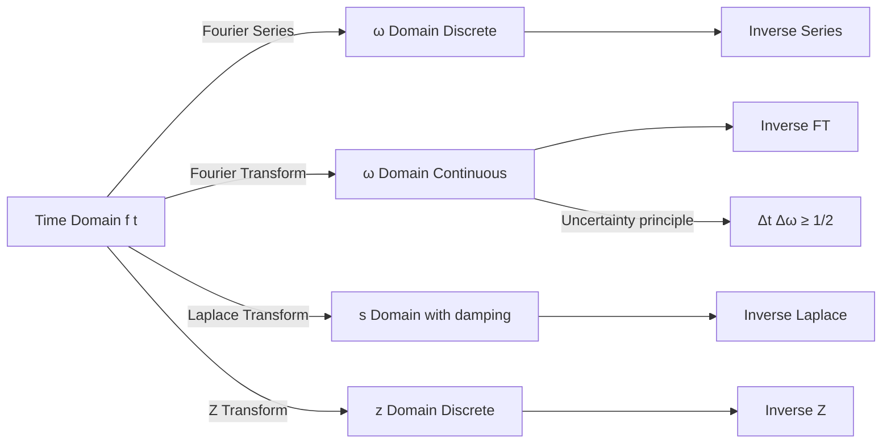
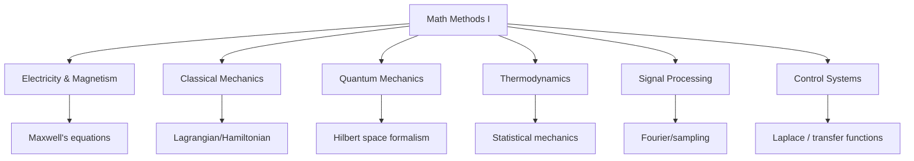

# PHYS 2124 — Mathematical Methods I
> **Phase 1 BSc Foundation | HKUST PHYS 2124 | Vector Calculus, ODEs, Linear Algebra, Complex Analysis**  
> **Bilingual 深度自學檔案 · 中英對照**

---

## 📚 Course Information

- **Code:** PHYS 2124
- **Name:** Mathematical Methods I
- **Phase:** 1 (BSc Foundation)
- **Target Duration:** 2 months (Month 1-2)
- **Difficulty:** ⭐⭐⭐
- **Format version:** v2.0 (full deep-dive)

---

## 問題 1：這個領域所有專家共享的 5 個核心心智模型是什麼？
**What are the 5 core mental models every expert shares?**

| # | Mental Model | 心智模型 | Engineering Analogy | 工程類比 |
|---|---|---|---|---|
| 1 | **Operators transform objects** | 算子把物件變化 | Linear map: $A: V \to W$ | 線性映射 |
| 2 | **Symmetry = conservation** | 對稱 = 守恆 | Noether's theorem (preview) | Noether 定理 (預習) |
| 3 | **Local approximation via Taylor series** | 局部以 Taylor 級數近似 | Linearization around operating point | 在工作點線性化 |
| 4 | **ODEs describe evolution; PDEs describe fields** | ODE 描述演化; PDE 描述場 | RC circuit vs heat diffusion | RC 電路 vs 熱擴散 |
| 5 | **Fourier space diagonalizes translation-invariant operators** | Fourier 空間對角化平移不變算子 | Convolution ↔ multiplication | 卷積 ↔ 乘法 |

---

## 問題 2：這個領域的專家在哪 3 個地方存在根本分歧？各方最強的論點是什麼？
**What are the 3 fundamental disagreements + strongest arguments?**

1. **Rigor-first vs physics-first**  
   - Rigor (Rudin, Spivak): Build from $\epsilon$-$\delta$ foundations; slow but unshakeable.  
   - Physics-first (Boas, Mary Boas tradition): Start from physical examples, formalize later.  
   - 嚴格派: 從 $\epsilon$-$\delta$ 建立, 慢但穩。  
   - 物理派: 從物理例子出發, 之後形式化。

2. **Abstract algebra vs computational recipes**  
   - Abstract: Group theory, Hilbert spaces, distributions.  
   - Recipes: "How to solve a second-order linear ODE in 30 seconds".  
   - 抽象派: 群論、Hilbert 空間、distribution。  
   - 配方派: 「30 秒解二階線性 ODE」。

3. **Complex analysis = essential vs nice-to-have**  
   - Essential (most theorists): Contour integration is unavoidable for integrals & residues.  
   - Nice-to-have (most applied): Numerical methods can do the same integrals.  
   - 必要派: 圍道積分對 integral 同 residue 無可避免。  
   - 可選派: 數值方法可以做到同樣效果。

---

## 問題 3：生成 10 個能區分深度理解與死背知識的問題
**Generate 10 questions that distinguish deep understanding from memorization**

1. 為什麼 gradient 喺 Cartesian coordinates 係 $(\partial_x, \partial_y, \partial_z)$，但喺 spherical 係 $(\partial_r, \frac{1}{r}\partial_\theta, \frac{1}{r\sin\theta}\partial_\phi)$？**What's the geometric reason?**
2. 給定一條 conservative force field $\vec F = -\nabla V$，解釋為什麼 closed-loop work 必為零。**Why is closed-loop work zero?**
3. 解釋「distributional」derivative of $|x|$ at $x=0$ 點解係 $\text{sgn}(x)$ 而非 undefined。**Why is the derivative a sign function?**
4. 給定 $y'' + 2y' + 5y = 0$，點解 characteristic equation $r^2+2r+5=0$ 嘅 complex roots $r=-1\pm 2i$ 係 underdamped 嘅 signature？**What does this tell you physically?**
5. 為什麼 Fourier transform 喺 $L^2$ 上係 unitary — 呢個對 quantum mechanics 至關重要？**Why does this matter for QM?**
6. 解釋 Cauchy-Riemann equations 點樣 enforce analyticity, 同 佢哋對 field theory 嘅 connection。**What is the connection?**
7. 給定一條 eigenvalue problem $A\vec v = \lambda \vec v$，點解 $\lambda$ 係 real only if $A$ 係 Hermitian — 對 observable 嘅 QM 應用有何啟示？**What's the QM link?**
8. 為什麼 Green's function $G(\vec r, \vec r')$ 嘅 symmetry $G(\vec r,\vec r') = G(\vec r',\vec r)$ 反映 time-reversal invariance？**Why this symmetry?**
9. 解釋 Laplace transform $F(s) = \int_0^\infty f(t)e^{-st}dt$ 點樣 convert ODE → algebraic equation。**How does it transform problems?**
10. 為什麼 Sturm-Liouville theory 嘅 orthogonal eigenfunctions 係 so useful for series solutions of PDEs？**Why so important for PDE series solutions?**

---

## 深入 1：Vector Calculus — gradient, divergence, curl
**Deep Dive I: Vector Calculus — gradient, divergence, curl**

### 1.1 Bilingual 概念對照

| English | 中英對照 | Physical meaning | 物理意義 |
|---|---|---|---|
| Gradient | 梯度 $\nabla f$ | Steepest ascent direction + rate | 最陡上升方向 + 速率 |
| Divergence | 散度 $\nabla \cdot \vec F$ | Source/sink density at point | 點嘅源/匯密度 |
| Curl | 旋度 $\nabla \times \vec F$ | Local rotation axis + rate | 局部旋轉軸 + 速率 |
| Laplacian | Laplacian $\nabla^2 f$ | Curvature (2nd derivative) | 曲率 (二階導數) |

### 1.2 Derivations

**Gradient from directional derivative:**
$$D_{\hat u} f = \lim_{h \to 0} \frac{f(\vec r + h\hat u) - f(\vec r)}{h} = \hat u \cdot \nabla f$$
So the maximum is along $\nabla f$, and $|\nabla f|$ is the maximum rate.

**Divergence theorem (Gauss's theorem):**
$$\int_V \nabla \cdot \vec F \, dV = \oint_{\partial V} \vec F \cdot d\vec A$$
Apply to box $\Delta x \Delta y \Delta z$ to derive component form $\partial_x F_x + \partial_y F_y + \partial_z F_z$.

**Stokes' theorem:**
$$\int_S (\nabla \times \vec F) \cdot d\vec A = \oint_{\partial S} \vec F \cdot d\vec \ell$$

### 1.3 Decision flow

```mermaid
graph TD
    A[Given vector field problem] --> B{Need local or global info?}
    B -->|Local: at a point| C[Use differential operators]
    B -->|Global: integrated| D[Use integral theorems]
    C --> E{Conservative?}
    E -->|Yes| F[∇ × F = 0, F = -∇φ]
    E -->|No| G[∇ × F ≠ 0, has rotation]
    D --> H{Surface integral of curl?}
    D --> I{Volume integral of div?}
    H --> J[Apply Stokes: ∫∫(∇×F)·dA = ∮F·dl]
    I --> K[Apply Gauss: ∫∇·F dV = ∮F·dA]
```

### 1.4 Engineering applications
- E&M: $\vec E = -\nabla V$, $\nabla \cdot \vec E = \rho/\epsilon_0$ → Gauss's law derivation
- Fluid: $\nabla \cdot \vec v = 0$ (incompressible); $\nabla \times \vec v = 2\vec\omega$ (vorticity)
- Heat: $\nabla^2 T = 0$ (steady state), $\nabla^2 T = -\dot q/k$ (with source)

---

## 深入 2：ODE Solution Techniques
**Deep Dive II: ODE Solution Techniques**

### 2.1 Bilingual classification

| ODE type | ODE 類型 | Method | 解法 |
|---|---|---|---|
| 1st order linear | 一階線性 | Integrating factor $e^{\int P dx}$ | 積分因子 |
| 1st order separable | 一階可分離 | $\int dy/g(y) = \int h(x)dx$ | 直接積分 |
| 2nd order linear homogeneous | 二階線性齊次 | Characteristic equation | 特徵方程 |
| 2nd order linear inhomogeneous | 二階線性非齊次 | Undetermined coefficients / Variation of parameters | 待定係數 / 變分法 |
| Series solution | 級數解 | Frobenius method | Frobenius 法 |

### 2.2 Characteristic equation worked example
$$y'' + 2y' + 5y = 0 \implies r^2 + 2r + 5 = 0 \implies r = -1 \pm 2i$$
$$y(t) = e^{-t}(C_1 \cos 2t + C_2 \sin 2t)$$
This is **underdamped oscillation** (decaying harmonic).

### 2.3 Decision tree



### 2.4 Engineering applications
- RC circuit: $RC \dot V + V = V_{in}$ → 1st order linear
- Mass-spring-damper: $m\ddot x + c\dot x + kx = F(t)$ → 2nd order linear
- Pendulum (small angle): same as mass-spring
- Quantum harmonic oscillator: same equation, different constants ($\hbar$)

---

## 深入 3：Linear Algebra — Eigenvalues & Spectral Theorem
**Deep Dive III: Linear Algebra — Eigenvalues & Spectral Theorem**

### 3.1 Bilingual concepts

| Concept | 中英對照 | Meaning | 物理意義 |
|---|---|---|---|
| Eigenvalue | 特徵值 $\lambda$ | $A\vec v = \lambda \vec v$ | 算子嘅不變因子 |
| Eigenvector | 特徵向量 $\vec v$ | Direction preserved by $A$ | 被 $A$ 保留嘅方向 |
| Spectrum | 譜 $\{\lambda_i\}$ | All eigenvalues | 所有特徵值 |
| Spectral theorem | 譜定理 | $A = U\Lambda U^{-1}$ if diagonalizable | 可對角化表示 |
| Hermitian | Hermitian 矩陣 | $A^\dagger = A$ | 自伴 (QM observables) |

### 3.2 Derivation: $A\vec v = \lambda\vec v$
$$\det(A - \lambda I) = 0 \implies \text{characteristic polynomial}$$
For $2 \times 2$: $\lambda^2 - \text{tr}(A)\lambda + \det(A) = 0$

### 3.3 Diagonalization process



### 3.4 Engineering applications
- QM: Observables are Hermitian, eigenvalues = measurement outcomes
- Vibrations: Modal analysis — diagonalize $M^{-1}K$
- PCA: Eigenvectors of covariance matrix = principal directions
- Google PageRank: Eigenvector of $A$ with $\lambda = 1$

---

## 深入 4：Complex Analysis Essentials
**Deep Dive IV: Complex Analysis Essentials**

### 4.1 Bilingual concepts

| Concept | 中英對照 | Definition | 物理意義 |
|---|---|---|---|
| Analytic | 解析 | Holomorphic in open set | 在開集全純 |
| Cauchy-Riemann | C-R 方程 | $u_x = v_y$, $u_y = -v_x$ | 可微嘅必要充分條件 |
| Contour integral | 圍道積分 | $\oint_\gamma f(z) dz$ | 沿封閉路徑 |
| Residue | 留數 | Coefficient of $(z-z_0)^{-1}$ | 喺極點嘅係數 |
| Pole | 極點 | Singularity of type $(z-z_0)^{-n}$ | 類型 $(z-z_0)^{-n}$ 嘅奇點 |

### 4.2 Cauchy's integral formula
$$f(a) = \frac{1}{2\pi i} \oint_\gamma \frac{f(z)}{z-a} dz$$
**Direct consequence:** contour integrals of analytic functions depend only on enclosed poles.

### 4.3 Residue theorem
$$\oint_\gamma f(z) dz = 2\pi i \sum_k \text{Res}_{z=z_k} f(z)$$
where sum is over poles inside $\gamma$.

### 4.4 Decision flow for contour integration



### 4.5 Engineering applications
- Signal processing: Inverse Laplace via Bromwich integral
- E&M: 2D potential problems via complex potentials
- QM: Scattering amplitudes (Feynman diagrams as complex integrals)
- Control: Nyquist criterion via contour integration

---

## 深入 5：Fourier Analysis & PDEs
**Deep Dive V: Fourier Analysis & PDEs**

### 5.1 Bilingual concepts

| Series/Transform | 中英對照 | Domain | 物理意義 |
|---|---|---|---|
| Fourier series | Fourier 級數 | Periodic $f: [0, L]$ | 週期函數分解 |
| Fourier transform | Fourier 變換 | $L^1(\mathbb R)$ | 全實軸分解 |
| Laplace transform | Laplace 變換 | $f: [0,\infty)$ | 帶初始條件 |
| Discrete FT (DFT) | 離散 FT | Sampled data | 數位訊號 |

### 5.2 Fourier transform pair
$$\hat f(\omega) = \int_{-\infty}^\infty f(t) e^{-i\omega t} dt, \quad f(t) = \frac{1}{2\pi} \int \hat f(\omega) e^{i\omega t} d\omega$$

### 5.3 PDE classification
| Type | 特徵 | Example | Engineering |
|---|---|---|---|
| Elliptic | $B^2 - 4AC < 0$ | Laplace/Poisson | Steady state |
| Parabolic | $B^2 - 4AC = 0$ | Heat equation | Diffusion |
| Hyperbolic | $B^2 - 4AC > 0$ | Wave equation | Oscillation |

### 5.4 Separation of variables flow



### 5.5 Engineering applications
- Heat equation: $\partial_t T = \alpha \nabla^2 T$ — chip thermal design
- Wave equation: $\partial_t^2 u = c^2 \nabla^2 u$ — acoustics, structures
- Laplace's: $\nabla^2 \phi = 0$ — electrostatics, fluid potential flow
- Schrödinger: $i\hbar \partial_t \psi = -\frac{\hbar^2}{2m} \nabla^2 \psi + V\psi$

---

## 自測 1：解釋 gradient 嘅 coordinate-covariant nature
**Self-Test 1: Explain gradient's coordinate-covariant nature**

**Answer / 解答:**  
The gradient is a **covector** (1-form), not a vector. Under coordinate transformation $x^i \to \tilde x^i(x)$, it transforms as $\tilde\partial_i = (\partial x^j/\partial \tilde x^i)\partial_j$. This is why $\nabla f$ in spherical coordinates is $(\partial_r f, \frac{1}{r}\partial_\theta f, \frac{1}{r\sin\theta}\partial_\phi f)$ — the angular components have $1/r$ factors from the Jacobian.

**Engineering implication:** In CFD, the gradient must be computed covariantly; failing to do so gives wrong boundary layer predictions.

---

## 自測 2：When does curl of a 2D vector field vanish?
**Self-Test 2: When does curl of a 2D vector field vanish?**

**Answer / 解答:**  
$\nabla \times \vec F = 0$ for $\vec F = (F_x, F_y)$ means $\partial_x F_y - \partial_y F_x = 0$. This is exact iff $\vec F = \nabla \phi$ for some scalar potential.  
**Test:** $\oint_\gamma \vec F \cdot d\vec \ell = 0$ for all closed $\gamma$ (Poincaré lemma for simply connected domains).

**Engineering implication:** Conservative fields = no energy loss in closed cycles. Irrotational flow allows Bernoulli.

---

## 自測 3：Characteristic equation with repeated complex roots
**Self-Test 3: Characteristic equation with repeated complex roots**

**Answer / 解答:**  
$r^2 - 2\alpha r + (\alpha^2 + \beta^2) = 0 \implies r = \alpha \pm i\beta$.  
Solution: $y = e^{\alpha t}(C_1 \cos\beta t + C_2 \sin\beta t)$.  
If $\alpha = 0$: pure oscillation. If $\alpha < 0$: damped. If $\alpha > 0$: unstable.

**Engineering implication:** Resonance avoidance requires $\omega_{driving} \neq \omega_{natural} = \beta$.

---

## 自測 4：Why Hermitian matrices have real eigenvalues
**Self-Test 4: Why Hermitian matrices have real eigenvalues**

**Answer / 解答:**  
If $A^\dagger = A$ and $A\vec v = \lambda \vec v$, then  
$\lambda \langle \vec v|\vec v\rangle = \langle \vec v|A|\vec v\rangle = \langle A\vec v|\vec v\rangle = \lambda^* \langle \vec v|\vec v\rangle$  
$\implies \lambda = \lambda^* \implies \lambda \in \mathbb R$.

**Engineering implication:** QM observables (energy, momentum, position) are Hermitian → real measurements. No probability of "imaginary energy".

---

## 自測 5：Evaluate $\int_{-\infty}^\infty \frac{dx}{1+x^2}$ using residues
**Self-Test 5: Evaluate $\int_{-\infty}^\infty \frac{dx}{1+x^2}$ using residues**

**Answer / 解答:**  
Pole at $z = i$ inside upper half-plane. Residue = $\lim_{z\to i}(z-i)/(1+z^2) = 1/(2i)$.  
$\int = 2\pi i \cdot (1/2i) = \pi$.

**Engineering implication:** Many Fourier transforms reduce to similar residues — Bromwich inversion for Laplace.

---

## 自測 6：Heat equation 1D infinite domain
**Self-Test 6: Heat equation 1D infinite domain**

**Answer / 解答:**  
$\partial_t u = \alpha \partial_x^2 u$, $u(x,0) = \delta(x)$ (point source).  
Solution: $u(x,t) = \frac{1}{\sqrt{4\pi \alpha t}} e^{-x^2/(4\alpha t)}$ (Gaussian spreading).

**Engineering implication:** Heat from a chip spreads as Gaussian; thermal time constant $\tau \sim L^2/\alpha$.

---

## 自測 7：Why does DFT give $N$ complex amplitudes for $N$ real samples?
**Self-Test 7: Why does DFT give $N$ complex amplitudes for $N$ real samples?**

**Answer / 解答:**  
For real input, DFT has conjugate symmetry: $X_{N-k} = X_k^*$. So only $N/2 + 1$ independent real values. The other $N/2 - 1$ are determined.

**Engineering implication:** Real FFT (rFFT) in NumPy exploits this — saves ~2× memory.

---

## 自測 8：Laplace transform of $\sin(\omega t)$
**Self-Test 8: Laplace transform of $\sin(\omega t)$**

**Answer / 解答:**  
$\mathcal L[\sin\omega t] = \int_0^\infty \sin(\omega t) e^{-st} dt = \frac{\omega}{s^2 + \omega^2}$, Re$(s) > 0$.

**Engineering implication:** Control systems: $H(s) = \omega/(s^2 + \omega^2)$ is a 2nd-order underdamped transfer function.

---

## 自測 9：Why separation of variables works for linear PDEs
**Self-Test 9: Why separation of variables works for linear PDEs**

**Answer / 解答:**  
Linear PDE: $Lu = 0$ where $L$ is a linear differential operator. If $L$ separates into $L = L_x + L_y + L_t$, then eigenfunctions $X_n(x)Y_n(y)T_n(t)$ can be superposed linearly to satisfy boundary conditions.  

**Engineering implication:** Modal superposition in structural dynamics = exactly this principle.

---

## 自測 10：Why Taylor series truncation at 1st order = linearization
**Self-Test 10: Why Taylor series truncation at 1st order = linearization**

**Answer / 解答:**  
$f(x + \delta) \approx f(x) + f'(x) \delta + O(\delta^2)$. Truncation at linear term gives $f(x_0) + J(x_0)\delta$ where $J$ is Jacobian. The dynamics $\dot x = f(x)$ becomes $\dot{\delta x} = J \delta x$ — a linear system.  

**Engineering implication:** Control design around operating point uses exactly this linearization; stability = eigenvalues of $J$ have negative real parts.

---

## 📊 Diagram 1: Math Methods Mind Map


## 📊 Diagram 2: ODE Method Selection


## 📊 Diagram 3: PDE Classification Flowchart


## 📊 Diagram 4: Fourier Analysis Family


## 📊 Diagram 5: Engineering Application Map


---

## 深度總結 Deep Insights Summary

1. **All physics is differential equations** — every other course (CM, EM, QM, Thermo) reduces to a PDE/ODE whose solution requires Math Methods.  
   **所有物理都係微分方程** — 其他課程 (力學、電磁、量子、熱力) 都化為 PDE/ODE, 而 Math Methods 係佢哋嘅解法基礎。

2. **Operators generalize numbers** — eigenvalues of operators give observable quantities; eigenfunctions give modes. This unifies QM, vibrations, PDEs.  
   **算子推廣咗數字** — 算子嘅特徵值係可觀測量, 特徵函數係模態; 統一咗量子、振動、PDE。

3. **Fourier is the most powerful tool** — transforms diagonalize translation-invariant operators, turning convolution into multiplication. Mastery of Fourier = mastery of linear systems.  
   **Fourier 係最強工具** — Fourier 變換對角化平移不變算子, 卷積變乘法。掌握 Fourier = 掌握線性系統。

4. **Symmetry → conservation → structure** — every conservation law (energy, momentum, charge) comes from a symmetry. Math Methods teaches the language of symmetry (group theory preview).  
   **對稱 → 守恆 → 結構** — 每個守恆定律 (能量、動量、電荷) 都嚟自對稱。Math Methods 教你對稱嘅語言。

5. **Numerical ≠ analytical** — most engineering problems need numerical methods (RK, FEM, FFT), but knowing the analytical solution tells you which numerical errors are bugs vs physics.  
   **數值 ≠ 解析** — 大多工程問題需要數值方法, 但知道解析解可以分辨數值誤差係 bug 定物理。

---

**自學建議**  
- 與 18.03 MIT OCW 配對, 對應 Strang 嘅 linear algebra lectures。  
- 必讀：Boas "Mathematical Methods in the Physical Sciences" 3rd ed.  
- 工具：SymPy (symbolic), NumPy/SciPy (numerical), Mathematica/Maple (commercial)。  
- 產出：用 SymPy 自動解一條你 derive 嘅物理問題嘅 ODE, 同 analytical solution 對比。
