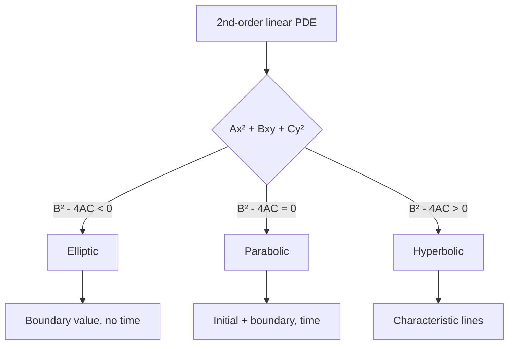
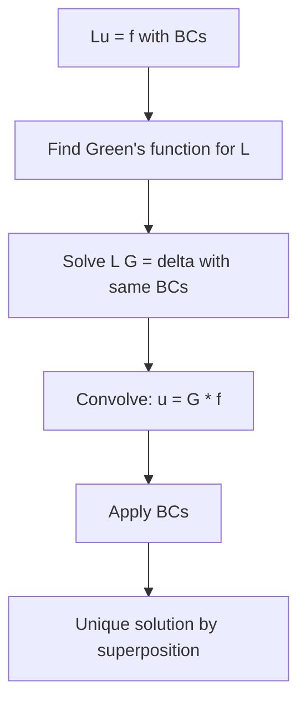
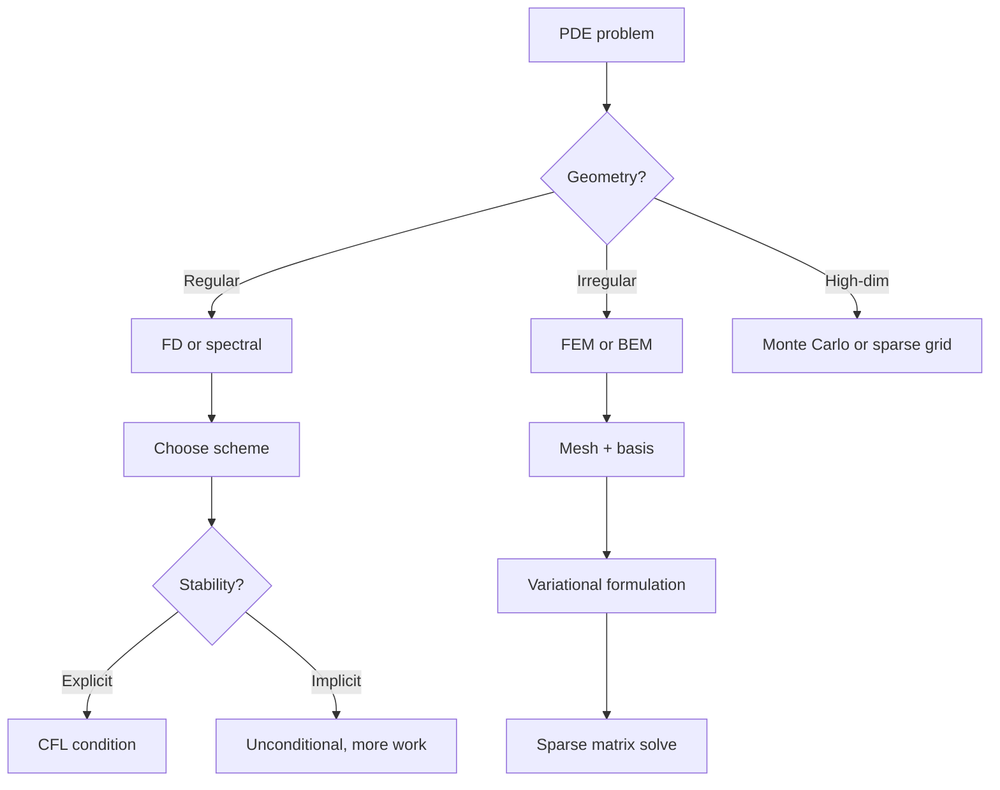
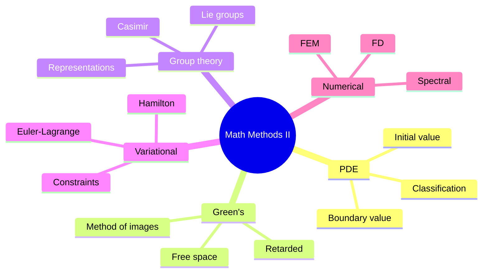
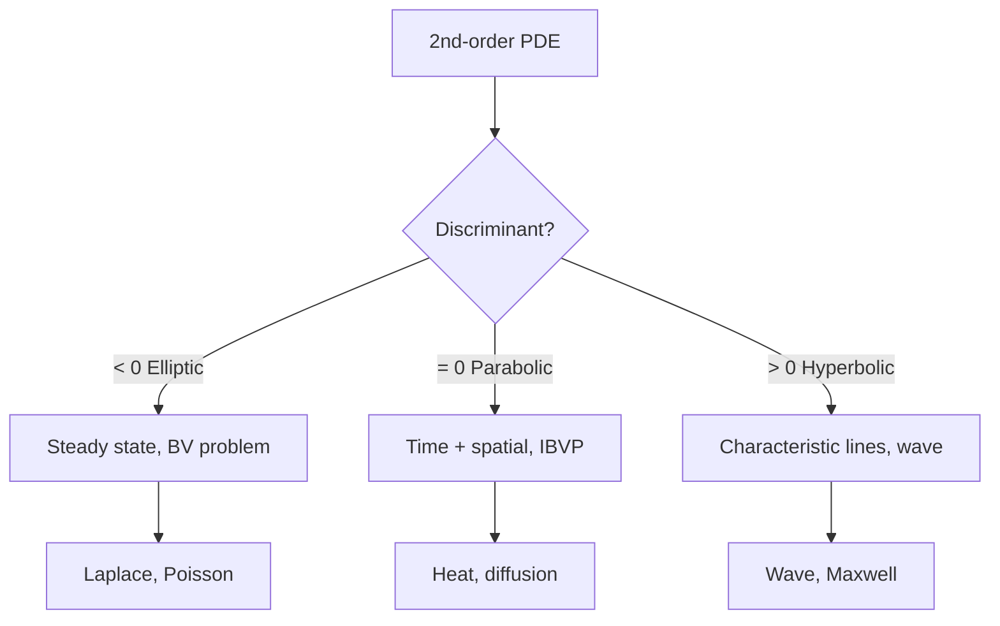
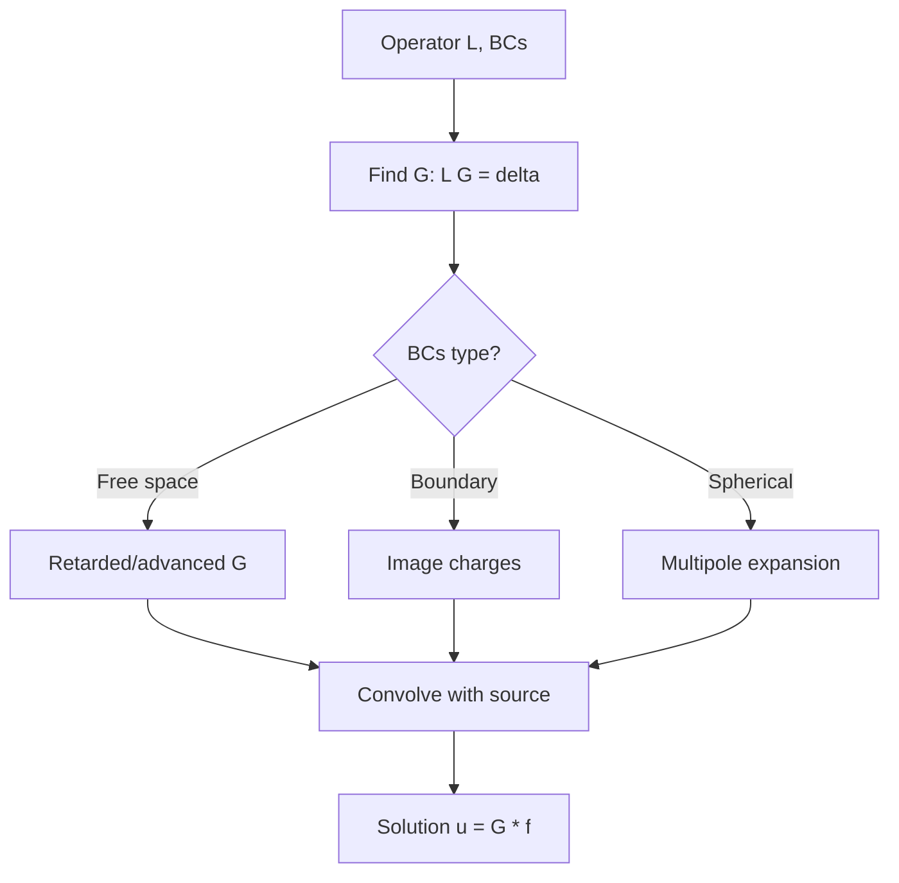
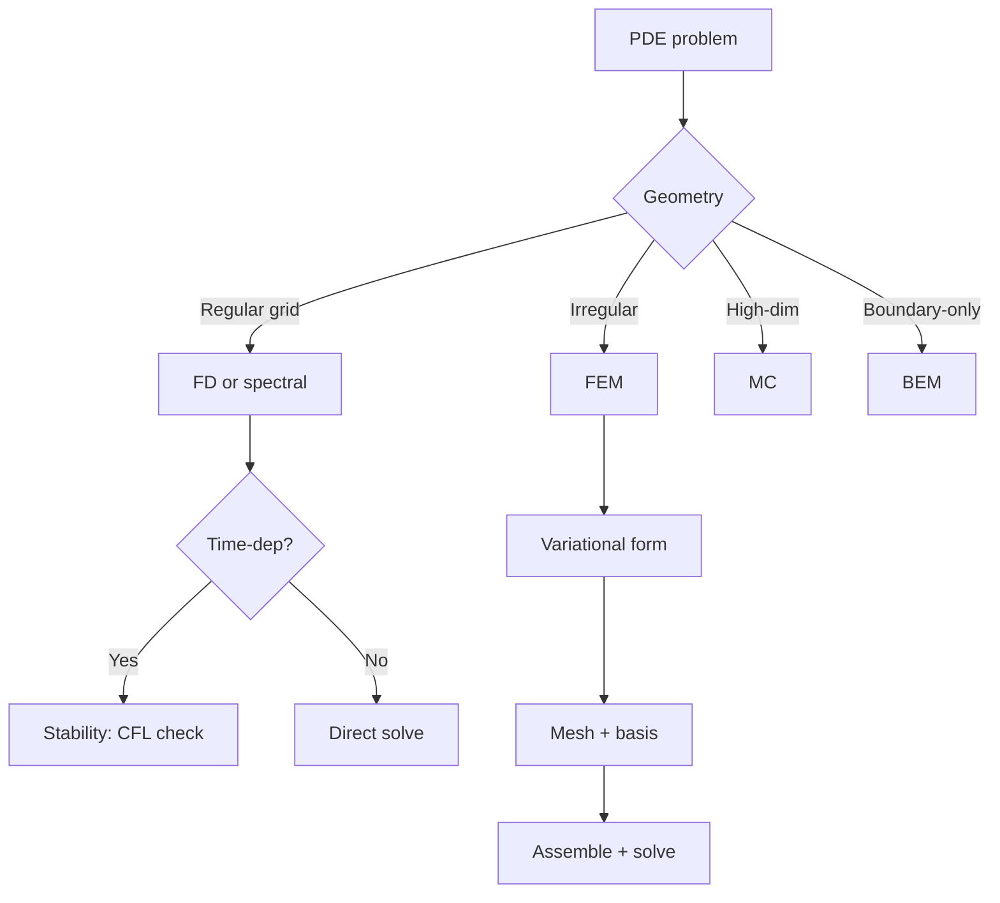

# PHYS 3031 — Mathematical Methods II
> **Phase 1 BSc Core | HKUST PHYS 3031 | PDEs, Complex Analysis, Group Theory, Numerical Methods**  
> **Bilingual 深度自學檔案 · 中英對照**

---

## 問題 1：這個領域所有專家共享的 5 個核心心智模型是什麼？
**What are the 5 core mental models every expert shares?**

| # | Mental Model | 心智模型 | Engineering Analogy | 工程類比 |
|---|---|---|---|---|
| 1 | **PDEs are field equations** | PDE 係場方程 | Laplace, Poisson, wave, heat | 各類場 |
| 2 | **Green's function = propagator** | Green 函數 = 傳播子 | Response to point source | 點源響應 |
| 3 | **Symmetry → group theory** | 對稱 → 群論 | SO(3), SU(2), SU(3) | 連續群 |
| 4 | **Variational calculus** | 變分法 | $\delta S = 0$ = Euler-Lagrange | 最小作用量 |
| 5 | **Numerical = discrete approximation** | 數值 = 離散近似 | FD, FE, spectral | 有限差分/有限元 |

---

## 問題 2：這個領域的專家在哪 3 個地方存在根本分歧？各方最強的論點是什麼？

1. **Analytical vs numerical** — closed form vs simulation, exact vs approximate
2. **Real analysis vs complex analysis** — Sommerfeld vs classical PDE traditions
3. **Group theory first vs as-needed** — physics intuition vs abstract symmetry

---

## 問題 3：10 個深度問題
1. 為什麼 $\nabla^2$ 喺不同 coordinate 系統有唔同 form (Cartesian vs spherical vs cylindrical)?
2. 解釋 Green's function $G(\vec r, \vec r')$ 點樣 solve $\nabla^2 \phi = -\rho/\epsilon_0$。
3. 給定 SO(3), 點解 $L = 2$ representation 有 5-dim, $L = 1$ 有 3-dim?
4. 為什麼 Euler-Lagrange $\frac{d}{dt}\frac{\partial L}{\partial \dot q} = \frac{\partial L}{\partial q}$ 從 $\delta S = 0$ derive 出嚟?
5. 解釋 spectral method 點樣用 Fourier series 將 PDE 化為 ODE。
6. 為什麼有限差分對 convection-dominated 唔 stable (CFL condition)?
7. 給定 Dirichlet + Neumann BCs, uniqueness theorem 點樣 guarantee 唯一解?
8. 為什麼 spherical harmonics $Y_l^m$ 係 Laplace equation 嘅 angular solution?
9. 解釋 separation of variables 對 Laplace 喺 Cartesian 嘅 general solution 結構。
10. 為什麼有限元 method 適合 irregular geometry, 而 finite difference 適合 regular grids?

---

## 深入 1：PDE Classification & Canonical Forms
**Deep Dive I: PDE Classification**

### 1.1 Bilingual classification

| Type | 類型 | Discriminant | Canonical form | Example |
|---|---|---|---|---|
| Elliptic | 橢圓 | $B^2 - 4AC < 0$ | $\nabla^2 u = 0$ | Laplace |
| Parabolic | 拋物 | $B^2 - 4AC = 0$ | $\partial_t u = \alpha \nabla^2 u$ | Heat |
| Hyperbolic | 雙曲 | $B^2 - 4AC > 0$ | $\partial_t^2 u = c^2 \nabla^2 u$ | Wave |

### 1.2 Decision flow



### 1.3 Engineering applications
- Heat (chip thermal): parabolic, finite difference Crank-Nicolson
- Wave (acoustics): hyperbolic, FDTD method
- Laplace (electrostatics): elliptic, FEM, BEM

---

## 深入 2：Green's Function Method
**Deep Dive II: Green's Function Method**

### 2.1 Bilingual concepts

| Concept | 中英對照 | Math | 物理意義 |
|---|---|---|---|
| Green's function | Green 函數 | $L G(\vec r, \vec r') = \delta(\vec r - \vec r')$ | Operator inverse |
| Linear operator | 線性算子 | $L u = f$ | Acts on $u$ |
| Dirichlet/Neumann | 邊界條件 | $u = g$ or $\partial u = h$ | Boundary value |
| Convolution | 卷積 | $u = G * f$ | Response superposition |

### 2.2 Free-space Green's functions
- $\nabla^2 G = -4\pi \delta$: $G = 1/r$
- $(1/c^2 \partial_t^2 - \nabla^2)G = \delta$: retarded $G = \delta(t - r/c)/(4\pi r)$
- $(\partial_t - D \nabla^2)G = \delta$: heat $G = e^{-r^2/(4Dt)}/(4\pi D t)^{3/2}$

### 2.3 Method flow



### 2.4 Engineering applications
- Antenna radiation: $G$ = retarded Green's, $E = \int \rho G$
- Diffusion problems: $G$ for heat equation gives analytic solution
- Quantum scattering: $G$ in Lippmann-Schwinger equation

---

## 深入 3：Group Theory Basics
**Deep Dive III: Group Theory for Physics**

### 3.1 Bilingual concepts

| Group | 群 | Dim | Generators | Example |
|---|---|---|---|---|
| SO(2) | 平面旋轉 | 1 | $J_z$ | Rotations in plane |
| SO(3) | 3D 旋轉 | 3 | $J_x, J_y, J_z$ | Spatial rotations |
| SU(2) | 2x2 幺正 | 3 | Pauli matrices | Spin-1/2 |
| SU(3) | 3x3 幺正 | 8 | Gell-Mann | Quark color |

### 3.2 Casimir operators & representations
- SO(3): $\vec J^2$, eigenvalues $j(j+1)\hbar^2$
- SU(2): same as SO(3) — accidental isomorphism
- SU(3): $C_1, C_2$ for irreps, dim labeled by $(p, q)$

### 3.3 Selection rules
Transitions allowed if dipole operator's irrep is in product of initial ⊗ final.

### 3.4 Engineering applications
- Crystallography: 230 space groups
- Particle physics: SU(3)×SU(2)×U(1) standard model
- Molecular spectroscopy: point group symmetry

---

## 深入 4：Variational Calculus
**Deep Dive IV: Variational Calculus**

### 4.1 Bilingual concepts

| Concept | 中英對照 | Math | 物理意義 |
|---|---|---|---|
| Functional | 泛函 | $J[y] = \int F(y, y', x) dx$ | Function of function |
| Euler-Lagrange | Euler-Lagrange | $\partial_y F - d/dx \partial_{y'} F = 0$ | Stationary condition |
| Natural BC | 自然邊界 | $\partial_{y'} F = 0$ at boundary | Open end |
| Multiple functions | 多函數 | Each satisfies EL | 推廣容易 |

### 4.2 Derivation
$\delta J = \int (\partial_y F \delta y + \partial_{y'} F \delta y') dx = \int (\partial_y F - d/dx \partial_{y'} F)\delta y \, dx + [\partial_{y'} F \delta y]_{\text{boundary}}$
Setting $\delta J = 0$ for all $\delta y$ with $\delta y = 0$ at endpoints:
$\partial_y F - d/dx \partial_{y'} F = 0$.

### 4.3 Engineering applications
- FEM: minimizing energy functional $\int (\nabla u)^2 - 2uf \, dV$
- Geodesics: shortest path functional
- Optimal control: Pontryagin's principle

---

## 深入 5：Numerical Methods for PDEs
**Deep Dive V: Numerical Methods for PDEs**

### 5.1 Bilingual comparison

| Method | 方法 | Pros | Cons | Best for |
|---|---|---|---|---|
| Finite difference (FD) | 有限差分 | Simple, fast | Regular grid | Heat, wave |
| Finite element (FEM) | 有限元 | Irregular geom | Complex | Structural |
| Spectral | 譜方法 | Exponential accuracy | Periodic | Smooth solutions |
| Boundary element (BEM) | 邊界元 | Reduces dim | Singular kernel | Laplace |
| Monte Carlo | 蒙地卡羅 | High-dim | Slow | Multi-dim integrals |

### 5.2 Method flow



### 5.3 Engineering applications
- CFD: Navier-Stokes FEM/FVM
- Structural: FEM for elasticity
- Electromagnetics: FDTD (Yee algorithm)
- Finance: MC for option pricing

---

## 自測 1：$\nabla^2$ in spherical
**Answer:** $\nabla^2 f = \frac{1}{r^2}\partial_r(r^2 \partial_r f) + \frac{1}{r^2\sin\theta}\partial_\theta(\sin\theta \partial_\theta f) + \frac{1}{r^2\sin^2\theta}\partial_\phi^2 f$.  
**Engineering:** Earth magnetic field, atomic orbitals.

## 自測 2：Green's for 1D Poisson
**Answer:** $-d^2G/dx^2 = \delta(x)$ → $G(x, x') = (1/2)|x - x'|$.  
**Engineering:** Beam on elastic foundation.

## 自測 3：SO(3) Casimir
**Answer:** $\vec J^2 = J_x^2 + J_y^2 + J_z^2$ commutes with all $J_i$, eigenvalue $j(j+1)\hbar^2$.  
**Engineering:** Atomic spectroscopy, angular momentum coupling.

## 自測 4：Euler-Lagrange for shortest path
**Answer:** $L = \sqrt{1 + y'^2}$, $y''/(1 + y'^2)^{3/2} = 0$ → straight line.  
**Engineering:** Geodesic, brachistochrone.

## 自測 5：FD stability (CFL)
**Answer:** $\Delta t < \Delta x / c$ for wave equation explicit.  
**Engineering:** Time step in CFD/FDTD.

## 自測 6：Separation of variables Laplace
**Answer:** $u = X(x)Y(y)$, leads to ODEs with separation constant $-k^2$, $X = A\cos kx + B\sin kx$.  
**Engineering:** Steady-state heat, electrostatics.

## 自測 7：FEM weak form
**Answer:** $\int \nabla u \cdot \nabla v \, dV = \int fv \, dV$ for test $v$. Galerkin.  
**Engineering:** FEA software (COMSOL, ANSYS).

## 自測 8：Eigenvalues of $-\nabla^2$ in box
**Answer:** $\lambda_{mnl} = \pi^2(m^2 + n^2 + l^2)/L^2$, eigenfunctions sines.  
**Engineering:** Waveguide modes, cavity resonators.

## 自測 9：Crank-Nicolson
**Answer:** Implicit 2nd-order in time, unconditionally stable, $(u^{n+1} - u^n)/\Delta t = (D/2)(\nabla^2 u^{n+1} + \nabla^2 u^n)$.  
**Engineering:** Stable heat equation solver.

## 自測 10：Conformal mapping Laplace
**Answer:** $w = f(z)$ analytic maps Laplace eqn to Laplace eqn. Schwarz-Christoffel.  
**Engineering:** Aerofoil design, electrostatics.

---

## 📊 Diagram 1: Mathematical Methods II Map


## 📊 Diagram 2: PDE Type Decision


## 📊 Diagram 3: Green's Function Construction


## 📊 Diagram 4: Group Theory Hierarchy
```mermaid
graph TD
    G[Groups] --> L[Lie groups]
    L --> AB[A: Abelian]
    L --> NAB[NA: Non-Abelian]
    AB --> U1[U(1) phase]
    NAB --> SO3[SO(3) rotation]
    SO3 --> SU2[SU(2) double cover]
    SU2 --> SU3[SU(3) color]
    L --> DIS[Discrete: Z2, S3, Oh]
    DIS --> CRY[Crystal point groups 32]
    CRY --> SPACE[Space groups 230]
```

## 📊 Diagram 5: Numerical Method Selection


---

## 深度總結 Deep Insights

1. **PDEs unify physics** — Maxwell, Schrödinger, heat, wave all PDEs; methods transfer across domains.
2. **Green's function = operator inverse** — solves linear PDE by superposition of point-source responses.
3. **Symmetry determines physics** — group theory classifies states, predicts selection rules, finds degeneracies.
4. **Variational principle unifies math/physics** — same Euler-Lagrange equation governs geodesics, optics, mechanics, field theory.
5. **Numerical choice matters** — FD/FEM/spectral/MC each have sweet spots; wrong choice = wasted compute.

---

**自學建議** — 配對 Mary Boas + Riley/Hobson + Arfken。MIT OCW 18.303 linear PDE。
