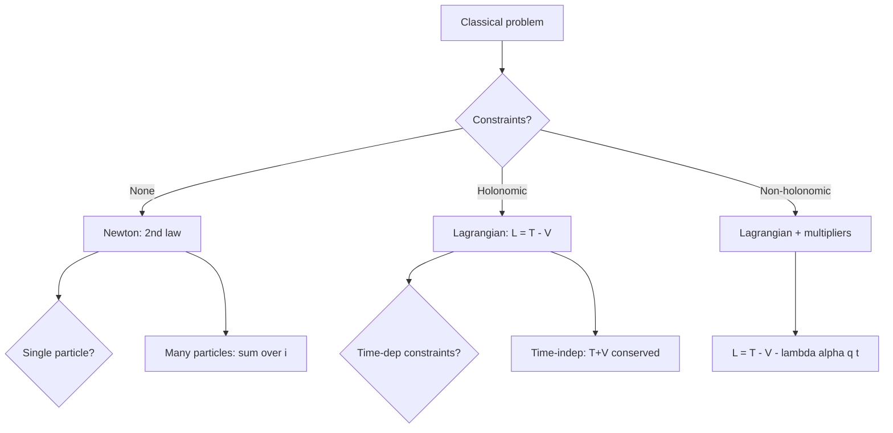
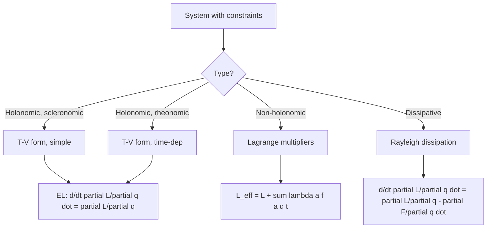
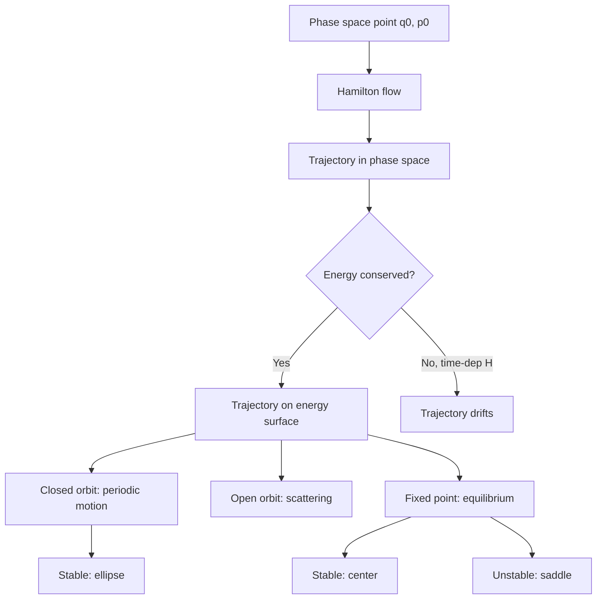
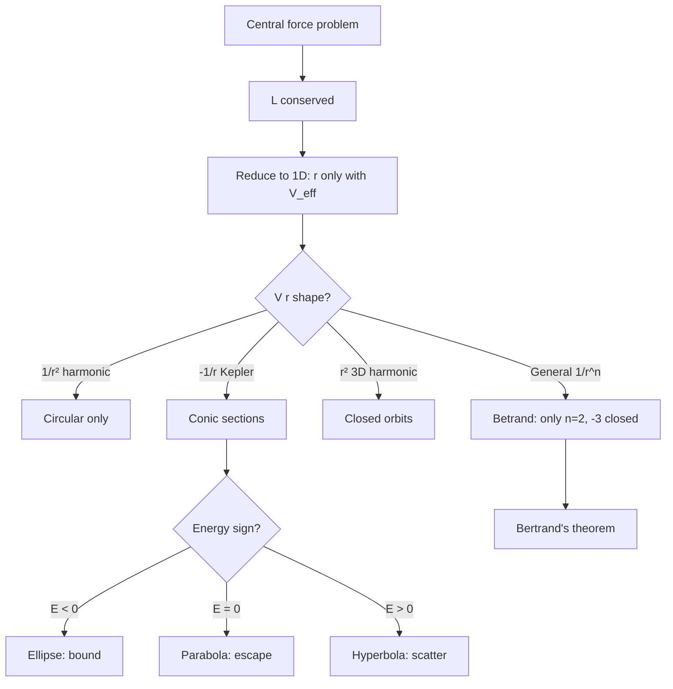
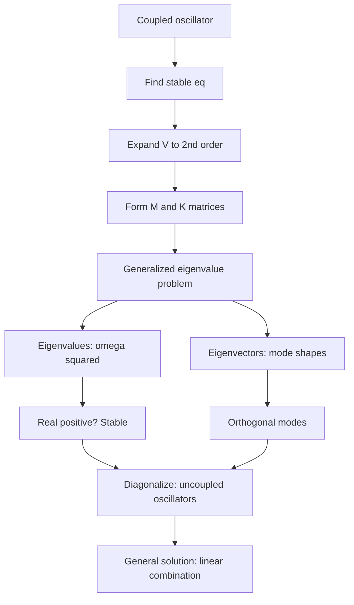
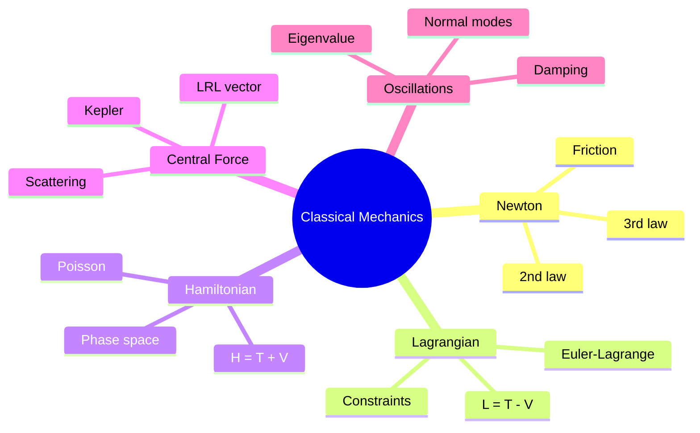
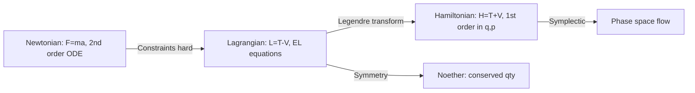
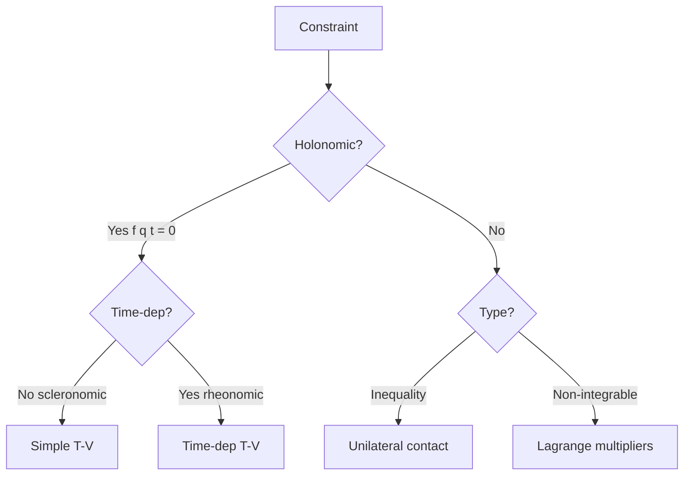
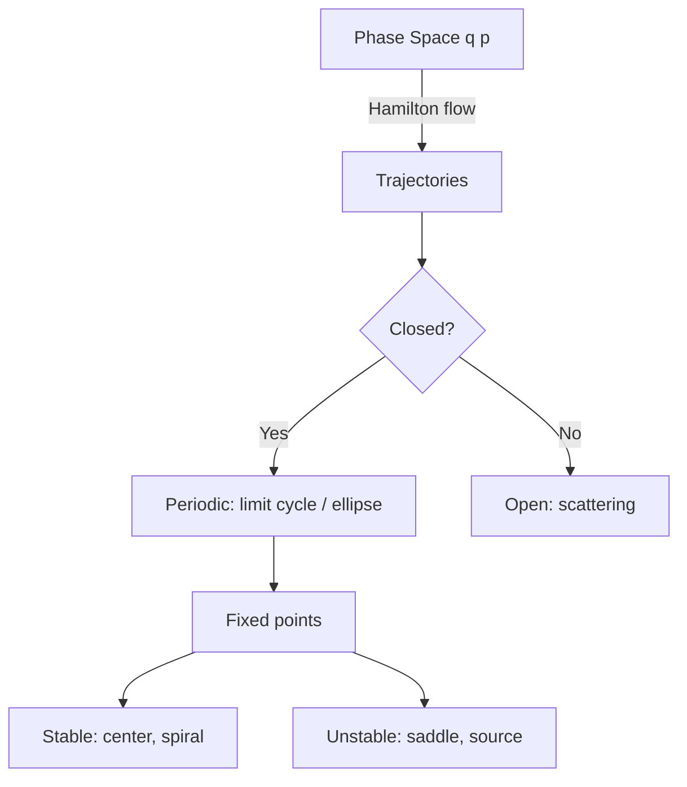
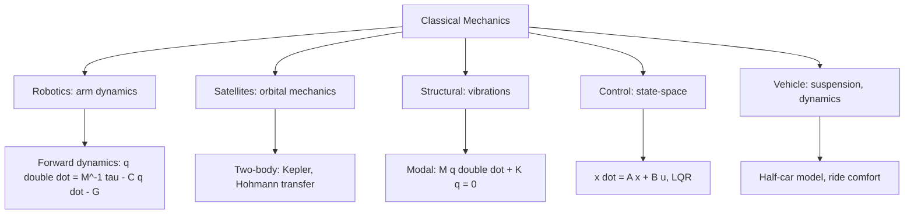

# PHYS 3032 — Classical Mechanics
> **Phase 1 BSc Core | HKUST PHYS 3032 | Newtonian, Lagrangian, Hamiltonian Mechanics**  
> **Bilingual 深度自學檔案 · 中英對照**

---

## 📚 Course Information

- **Code:** PHYS 3032
- **Name:** Classical Mechanics
- **University:** HKUST
- **Department:** Physics
- **Term:** Fall 2025-2026
- **Phase:** 1 (BSc Foundation)
- **Credits:** 3
- **Difficulty:** ⭐⭐⭐⭐
- **Format version:** v2.0 (full deep-dive)

---

## 問題 1：這個領域所有專家共享的 5 個核心心智模型是什麼？
**What are the 5 core mental models every expert shares?**

| # | Mental Model | 心智模型 | Engineering Analogy | 工程類比 |
|---|---|---|---|---|
| 1 | **Newton's 2nd + 3rd laws** | 牛二 + 牛三定律 | $\sum F = ma$, action-reaction | $\sum F = ma$, 作用反作用 |
| 2 | **Energy conservation** | 能量守恆 | $K + U = $ const for isolated | 孤立系統 $K + U$ 常數 |
| 3 | **Lagrangian = $L = T - V$** | Lagrangian 形式 | Stationary action principle | 最小作用量原理 |
| 4 | **Hamiltonian = $H = T + V$** | Hamiltonian 形式 | Phase space $(q, p)$ | 相空間演化 |
| 5 | **Symmetry → conserved quantity** | 對稱 → 守恆量 | Noether's theorem | Noether 定理 |

---

## 問題 2：這個領域的專家在哪 3 個地方存在根本分歧？各方最強的論點是什麼？
**What are the 3 fundamental disagreements + strongest arguments?**

1. **Newtonian vs Lagrangian vs Hamiltonian**  
   - Newtonian: Forces, vectors, intuitive.  
   - Lagrangian: Energy, generalized coords, handles constraints elegantly.  
   - Hamiltonian: Phase space, symplectic, foundation for QM.  
   - 牛頓派: 力、向量、直覺。  
   - Lagrangian 派: 能量、廣義座標、優雅處理約束。  
   - Hamiltonian 派: 相空間、辛結構、QM 基礎。

2. **Determinism vs statistical mechanics**  
   - Deterministic: Given initial conditions, future is fixed.  
   - Statistical: Macroscopic behavior from microscopic statistics.  
   - 決定論: 給定初始條件, 將來已定。  
   - 統計派: 宏觀行為嚟自微觀統計。

3. **Absolute vs relative space and time**  
   - Newtonian: Absolute space & time.  
   - Leibniz/Mach: Only relative motion matters.  
   - 牛頓: 絕對空間時間。  
   - 萊布尼茨/Mach: 只有相對運動有意義。

---

## 問題 3：生成 10 個能區分深度理解與死背知識的問題
**Generate 10 questions that distinguish deep understanding from memorization**

1. 為什麼 Lagrangian $L = T - V$ 而唔係 $T + V$? 解釋 kinetic 與 potential 喺 Euler-Lagrange 方程入面嘅 sign convention。  
   **Why $L = T - V$ and not $T + V$?**
2. 給定 double pendulum, 為什麼 generalized coordinates $(θ_1, θ_2)$ 比 Cartesian $(x_1, y_1, x_2, y_2)$ 更 elegant?  
   **Why generalized coords for double pendulum?**
3. 解釋 canonical transformation 點樣 preserve Hamilton's equations, 同 active/passive 嘅 distinction。  
   **Explain canonical transformations.**
4. 給定一個 central force $V(r) = -\frac{k}{r}$, 為什麼 effective potential $V_{eff}(r) = \frac{L^2}{2mr^2} - \frac{k}{r}$ 有 centrifugal barrier?  
   **Why centrifugal barrier?**
5. 為什麼 Poisson bracket $\{q_i, p_j\} = \delta_{ij}$ 係 canonical 嘅 essential structure, 同 QM 嘅 $[\hat q, \hat p] = i\hbar$ 有何對應?  
   **What's the QM link?**
6. 給定 Kepler orbit, derive the orbit equation $\frac{1}{r} = \frac{mk}{L^2}(1 + e\cos\theta)$ 從 Lagrangian。  
   **Derive Kepler orbit from Lagrangian.**
7. 為什麼 Hamilton-Jacobi 方程 $H(q, \partial S/\partial q, t) = \partial S/\partial t$ 係 classical mechanics 嘅 "wave equation", 同 QM 嘅 Schrödinger 有何關係?  
   **HJ and Schrödinger connection?**
8. 給定一個 3-particle system, 為什麼 CM motion separates, reducing to 2-body problem? 解釋 reduced mass $\mu$。  
   **Why reduced mass?**
9. 解釋為什麼 rigid body rotation 有 $T = \frac{1}{2}\vec\omega \cdot \mathbf I \cdot \vec\omega$ with inertia tensor $\mathbf I$。  
   **Derive rigid body KE.**
10. 為什麼 Noether theorem guarantee 每個 continuous symmetry has a conserved quantity? 舉 4 個 example。  
    **Why Noether guarantees this?**

---

## 深入 1：Newton's Laws and Conservation
**Deep Dive I: Newton's Laws and Conservation**

### 1.1 Bilingual laws table

| Law | Newton's Form | Lagrangian Form | 工程應用 |
|---|---|---|---|
| 1st (inertia) | $\sum F = 0 \implies \vec v = $ const | $\delta S = 0$, free particle path is straight | 慣性導航 |
| 2nd (F=ma) | $\vec F = m\vec a$ | $\frac{d}{dt}\frac{\partial L}{\partial \dot q} = \frac{\partial L}{\partial q}$ | 車輛動態 |
| 3rd (action-reaction) | $\vec F_{12} = -\vec F_{21}$ | Internal forces cancel in action | 反作用輪 |

### 1.2 Derivation of 2nd from Lagrangian
Action $S = \int L \, dt$, $L = T - V = \frac{1}{2}m\dot x^2 - V(x)$.
$\delta S = 0$ requires: $\frac{\partial L}{\partial x} - \frac{d}{dt}\frac{\partial L}{\partial \dot x} = 0$
$\implies -V'(x) - m\ddot x = 0 \implies m\ddot x = -V'(x) = F(x)$ ✓

### 1.3 Decision flow

### 1.4 Engineering applications
- Rocket equation: $m\dot v = -\dot m v_e - mg$ (variable mass)
- Gyroscope: $\vec\tau = \frac{d\vec L}{dt}$, precession $\Omega = \tau/(L\omega)$
- Coupled oscillators: matrix methods (modular mechanics → vibrations)

---

## 深入 2：Lagrangian Mechanics & Constraints
**Deep Dive II: Lagrangian Mechanics & Constraints**

### 2.1 Bilingual concepts

| Concept | 中英對照 | Math | 物理意義 |
|---|---|---|---|
| Generalized coord | 廣義座標 | $q_i$ | Independent DOF |
| Holonomic constraint | 完整約束 | $f(q_1, \ldots, q_n, t) = 0$ | Path-independent |
| Non-holonomic | 非完整約束 | Inequality or non-integrable | Velocity-dependent |
| Configuration space | 構型空間 | $\mathbb R^n$ manifold | System state space |
| Virtual work | 虛功 | $\delta W = \sum F_i \delta q_i$ | Infinitesimal work |

### 2.2 Euler-Lagrange equation derivation
$S[q] = \int_{t_1}^{t_2} L(q, \dot q, t) dt$. Variation $\delta q(t)$ with $\delta q(t_1) = \delta q(t_2) = 0$:
$$\delta S = \int \left(\frac{\partial L}{\partial q}\delta q + \frac{\partial L}{\partial \dot q}\delta\dot q\right)dt = \int \left(\frac{\partial L}{\partial q} - \frac{d}{dt}\frac{\partial L}{\partial \dot q}\right)\delta q \, dt$$
Setting to 0 for all $\delta q$: $\frac{d}{dt}\frac{\partial L}{\partial \dot q} = \frac{\partial L}{\partial q}$.

### 2.3 Example: simple pendulum
$T = \frac{1}{2}mL^2\dot\theta^2$, $V = -mgL\cos\theta$ (taking $V=0$ at bottom).
$L = \frac{1}{2}mL^2\dot\theta^2 + mgL\cos\theta$
$\frac{\partial L}{\partial \dot\theta} = mL^2\dot\theta$, $\frac{d}{dt} = mL^2\ddot\theta$
$\frac{\partial L}{\partial \theta} = -mgL\sin\theta$
$\implies \ddot\theta + (g/L)\sin\theta = 0$. Small angle: $\ddot\theta + (g/L)\theta = 0$, $\omega = \sqrt{g/L}$.

### 2.4 Constraints flow

### 2.5 Engineering applications
- Pendulum clocks: Lagrangian gives $\omega$ for design
- Robot arms: $L = T - V$ with multi-DOF
- Vibration isolation: $L$ formulation of 2-DOF system

---

## 深入 3：Hamiltonian Mechanics & Phase Space
**Deep Dive III: Hamiltonian Mechanics & Phase Space**

### 3.1 Bilingual concepts

| Concept | 中英對照 | Math | 物理意義 |
|---|---|---|---|
| Canonical momentum | 正則動量 | $p_i = \partial L/\partial \dot q_i$ | Conjugate to $q_i$ |
| Hamiltonian | Hamiltonian | $H = \sum p_i \dot q_i - L$ | Energy in $(q,p)$ coords |
| Phase space | 相空間 | $(q_1, \ldots, q_n, p_1, \ldots, p_n) \in \mathbb R^{2n}$ | All possible states |
| Hamilton's eqs | Hamilton 方程 | $\dot q_i = \partial H/\partial p_i$, $\dot p_i = -\partial H/\partial q_i$ | 1st-order ODEs |
| Symplectic | 辛幾何 | $\det(\text{Jacobian}) = 1$ | Area-preserving |

### 3.2 Legendre transform: $L \to H$
$H = p\dot q - L$ where $p = \partial L/\partial \dot q$.
For free particle: $L = \frac{1}{2}m\dot q^2 \implies p = m\dot q \implies H = \frac{p^2}{2m}$.

### 3.3 Hamilton's equations
$\dot q = \partial H/\partial p$, $\dot p = -\partial H/\partial q$.
For 1D harmonic: $H = p^2/(2m) + \frac{1}{2}kq^2$.
$\dot q = p/m$, $\dot p = -kq \implies \ddot q = -(k/m)q$ ✓

### 3.4 Phase space structure

### 3.5 Engineering applications
- Accelerators: $H = \sqrt{p^2 c^2 + m^2 c^4}$ for betatron oscillations
- Astronomy: Kepler orbits in $(r, p_r, \theta, L)$ phase space
- Control: Hamiltonian formulation for nonlinear control design

---

## 深入 4：Central Force & Kepler Problem
**Deep Dive IV: Central Force & Kepler Problem**

### 4.1 Bilingual concepts

| Concept | 中英對照 | Math | 物理意義 |
|---|---|---|---|
| Central force | 中心力 | $\vec F = f(r)\hat r$ | Radial only |
| Angular momentum | 角動量 | $\vec L = \vec r \times \vec p$, const | Conservation |
| Effective potential | 有效位勢 | $V_{eff}(r) = V(r) + \frac{L^2}{2\mu r^2}$ | 1D radial problem |
| Centrifugal barrier | 離心勢壘 | $L^2/(2\mu r^2)$ | Repels particle from $r=0$ |
| Kepler problem | Kepler 問題 | $V(r) = -k/r$ | Gravitation, Coulomb |
| Laplace-Runge-Lenz | LRL 向量 | $\vec A = \vec p \times \vec L - mk\hat r$ | Hidden symmetry |

### 4.2 Orbit equation derivation
LRL vector $\vec A$ is conserved for Kepler. Show $\vec A \cdot \vec L = 0$ → $\vec A$ in orbital plane.
From $\dot{\vec A} = 0$: $\vec A \cdot \vec r = mkr - L^2$, divide by $mrL^2$: $1/r = (mk/L^2)(1 + e\cos\theta)$, with $e = A/(mk)$.

### 4.3 Effective potential for Kepler
$V_{eff}(r) = -\frac{k}{r} + \frac{L^2}{2\mu r^2}$. Minimum at $r_0 = L^2/(\mu k)$ (circular orbit). Bound orbit requires $E < 0$.

### 4.4 Decision flow

### 4.5 Engineering applications
- GPS: Kepler orbits + relativistic corrections
- Rutherford scattering: hyperbolic orbits, cross-section $\propto 1/\sin^4(\theta/2)$
- Hydrogen atom: Coulomb = Kepler, quantum analog

---

## 深入 5：Small Oscillations & Normal Modes
**Deep Dive V: Small Oscillations & Normal Modes**

### 5.1 Bilingual concepts

| Concept | 中英對照 | Math | 物理意義 |
|---|---|---|---|
| Stable equilibrium | 穩定平衡 | $\partial V/\partial q_i = 0$, Hessian positive definite | Quadratic approx |
| Normal mode | 簡正模 | $\vec q(t) = \vec a \cos(\omega t - \phi)$ | All coords oscillate at same freq |
| Eigenfrequency | 本徵頻率 | Solutions of $\det(K - \omega^2 M) = 0$ | Natural freqs |
| Mode shape | 模態形狀 | Eigenvector $\vec a$ of $K\vec a = \omega^2 M\vec a$ | Relative amplitudes |

### 5.2 Worked example: 2 coupled pendula
Two pendula of mass $m$, length $L$, connected by spring $k$.
$T = \frac{1}{2}mL^2(\dot\theta_1^2 + \dot\theta_2^2)$
$V = \frac{1}{2}mL^2(g/L)(\theta_1^2 + \theta_2^2) + \frac{1}{2}kL^2(\theta_1 - \theta_2)^2$
Stiffness matrix $K = \begin{pmatrix} mg/L + kL^2 & -kL^2 \\ -kL^2 & mg/L + kL^2 \end{pmatrix}$, $M = mL^2 I$.
Eigenvalues: $\omega_1^2 = g/L$ (symmetric mode), $\omega_2^2 = g/L + 2kL^2/m$ (antisymmetric).

### 5.3 Modal analysis flow

### 5.4 Engineering applications
- Earthquake engineering: Building mode shapes, modal superposition
- MEMS: Resonator frequencies, mode shape design
- Molecular vibrations: Normal modes of polyatomic molecules (CO₂ has 3)

---

## 自測 1：Action-reaction in rocket
**Self-Test 1: Action-reaction in rocket**

**Answer / 解答:**  
Rocket ejects mass at velocity $v_e$ relative to rocket. Momentum conservation:  
$mdv = -v_{rel} dm$ (where $v_{rel} = v_e - v$).  
Tsiolkovsky: $\Delta v = v_e \ln(m_0/m_f)$.  
**Key insight:** 3rd law in variable-mass system is internal to system; external is gravity + drag.

**Engineering implication:** Falcon 9 upper stage $\Delta v \approx 9.4$ km/s, requires staging.

---

## 自測 2：Double pendulum Lagrangian
**Self-Test 2: Double pendulum Lagrangian**

**Answer / 解答:**  
$T = \frac{1}{2}m_1 L_1^2 \dot\theta_1^2 + \frac{1}{2}m_2[L_1^2\dot\theta_1^2 + L_2^2\dot\theta_2^2 + 2L_1 L_2 \dot\theta_1\dot\theta_2\cos(\theta_1-\theta_2)]$  
$V = -(m_1+m_2)gL_1\cos\theta_1 - m_2 gL_2\cos\theta_2$  
EOMs: coupled, nonlinear, chaotic for large amplitudes.

**Engineering implication:** Crane double-pendulum dynamics; chaos in double pendulum limits crane control.

---

## 自測 3：Why angular momentum is conserved in central force
**Self-Test 3: Why angular momentum is conserved in central force**

**Answer / 解答:**  
$\vec\tau = \vec r \times \vec F = \vec r \times f(r)\hat r = 0$ (cross product of parallel vectors).  
So $d\vec L/dt = \vec\tau = 0$, $\vec L$ conserved. Geometric: motion confined to a plane perpendicular to $\vec L$.

**Engineering implication:** Conservation in orbital mechanics simplifies satellite tracking.

---

## 自測 4：Reduced mass in 2-body problem
**Self-Test 4: Reduced mass in 2-body problem**

**Answer / 解答:**  
$\mu = m_1 m_2/(m_1 + m_2)$. From CM frame transformation: relative motion $\vec r = \vec r_1 - \vec r_2$ follows $V(r)$ with mass $\mu$, while CM moves at constant velocity.  
**Hydrogen atom:** $\mu = m_e m_p / (m_e + m_p) \approx m_e$ (proton much heavier).

**Engineering implication:** Atomic physics, molecular spectroscopy, neutron-proton scattering.

---

## 自測 5：Poisson bracket and QM commutator
**Self-Test 5: Poisson bracket and QM commutator**

**Answer / 解答:**  
$\{f, g\} = \sum_i (\partial f/\partial q_i \partial g/\partial p_i - \partial f/\partial p_i \partial g/\partial q_i)$.  
For canonical: $\{q_i, p_j\} = \delta_{ij}$.  
QM: $\{,\}_{PB} \to (1/i\hbar)[,]$ in operator form.  
Classical limit: $\hbar \to 0$, commutator $\to 0$ → commutation.

**Engineering implication:** Bridge between classical and quantum; semiclassical WKB approximation.

---

## 自測 6：Kepler's 3rd law from LRL
**Self-Test 6: Kepler's 3rd law from LRL**

**Answer / 解答:**  
Circular orbit: $mv^2/r = GMm/r^2 \implies v^2 = GM/r$. Period $T = 2\pi r/v$.  
$T^2 = 4\pi^2 r^3/(GM)$ ⟹ $T^2 \propto a^3$ (for ellipse, $a$ = semi-major axis).

**Engineering implication:** GPS orbital period (~12 hr for semi-synchronous); exoplanet detection (transit timing).

---

## 自測 7：Phase space area conservation (Liouville)
**Self-Test 7: Phase space area conservation (Liouville)**

**Answer / 解答:**  
Liouville: $d\rho/dt = 0$ along flow. Geometric: $\nabla \cdot \vec v_{phase} = \partial \dot q/\partial q + \partial \dot p/\partial p = \partial^2 H/\partial q \partial p - \partial^2 H/\partial p \partial q = 0$.  
So phase space volume conserved — incompressible flow.

**Engineering implication:** Statistical mechanics foundation; beam dynamics in accelerators.

---

## 自測 8：Stability of Lagrange points
**Self-Test 8: Stability of Lagrange points**

**Answer / 解答:**  
L4, L5 (equilateral): stable for $\mu < \mu_{crit} = (1 - \sqrt{23/27})/2 \approx 0.0385$ (Sun-Jupiter system satisfies).  
L1, L2, L3: unstable (saddle points).  
**Troy asteroids** at Sun-Jupiter L4/L5.

**Engineering implication:** JWST at Sun-Earth L2; SOHO at L1.

---

## 自測 9：Why small oscillations linearize
**Self-Test 9: Why small oscillations linearize**

**Answer / 解答:**  
Taylor expand $V(q) = V(q_0) + V'(q_0)(q-q_0) + \frac{1}{2}V''(q_0)(q-q_0)^2 + \ldots$.  
At stable eq, $V'(q_0) = 0$. So $V \approx \frac{1}{2}k(q-q_0)^2$, harmonic. EOM: $m\ddot\eta + k\eta = 0$.

**Engineering implication:** Bridge between nonlinear dynamics and linear control theory.

---

## 自測 10：Inertia tensor for a cube
**Self-Test 10: Inertia tensor for a cube**

**Answer / 解答:**  
For solid cube of side $a$, mass $M$, about CM:  
$I_{xx} = I_{yy} = I_{zz} = M(a^2 + a^2)/12 = Ma^2/6$.  
Off-diagonal: 0 (by symmetry). Eigenvalues: all $= Ma^2/6$ (isotropic).

**Engineering implication:** Satellite attitude dynamics; spinning spacecraft stability.

---

## 📊 Diagram 1: Classical Mechanics Tree

## 📊 Diagram 2: Newton → Lagrangian → Hamiltonian

## 📊 Diagram 3: Constraint Classification

## 📊 Diagram 4: Phase Space Structure

## 📊 Diagram 5: Engineering Applications

---

## 深度總結 Deep Insights Summary

1. **Lagrangian formulation transcends coordinates** — by using generalized coordinates, complex constraints (double pendulum, rigid body) become tractable; the equations have the same form regardless of coordinate choice.  
   **Lagrangian 形式超越座標** — 用廣義座標, 複雜約束變得可處理; 方程形式同座標選擇無關。

2. **Hamiltonian reveals deep QM structure** — Poisson brackets become commutators ($[,]_{PB} \to \frac{1}{i\hbar}[,]$), phase space becomes Hilbert space. Classical mechanics is the $\hbar \to 0$ limit of QM.  
   **Hamiltonian 揭示深層 QM 結構** — Poisson 括號變為對易子 ($[,]_{PB} \to \frac{1}{i\hbar}[,]$), 相空間變 Hilbert 空間。古典力學係 QM 嘅 $\hbar \to 0$ 極限。

3. **Symmetry is the deepest principle** — every continuous symmetry of $L$ gives a conserved quantity. Energy, momentum, angular momentum, charge all from symmetries. This unifies all of physics.  
   **對稱係最深刻嘅原理** — $L$ 嘅每個連續對稱都對應一個守恆量。能量、動量、角動量、電荷都嚟自對稱。統一咗所有物理。

4. **Small oscillations = linearization = solvable** — most nonlinear systems are intractable analytically, but near stable equilibrium they reduce to linear coupled oscillators, fully solvable by eigenvalue methods. This is the foundation of all engineering vibrations.  
   **小振動 = 線性化 = 可解** — 大多非線性系統解析上唔可解, 但喺穩定平衡附近化為線性耦合振子, 完全可解。呢個係所有工程振動嘅基礎。

5. **Constraints are the hardest part** — knowing what NOT to integrate is often harder than integrating. Lagrangian multipliers and D'Alembert's principle let us handle constraints without explicitly solving them.  
   **約束係最難嘅部分** — 知道乜嘢唔需要積分, 往往比積分本身更難。Lagrange 乘子同 D'Alembert 原理令我可以處理約束而唔需要顯式解佢哋。

---

**自學建議**  
- 必讀：Taylor "Classical Mechanics" (best for self-study) + Goldstein "Classical Mechanics" (classical reference).  
- 配對：MIT OCW 8.01 + 8.02 by Walter Lewin + Deepto Chakrabarty。  
- 工具：SymPy mechanics module, Mathematica。  
- 產出：完整 Lagrangian → Hamiltonian → Hamilton's equations pipeline for 1 個新問題 (e.g., spherical pendulum)。
