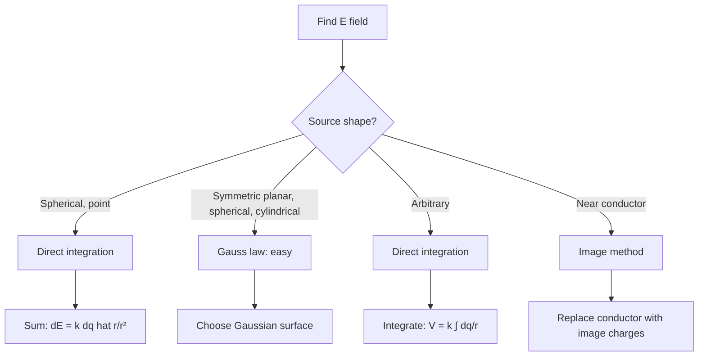
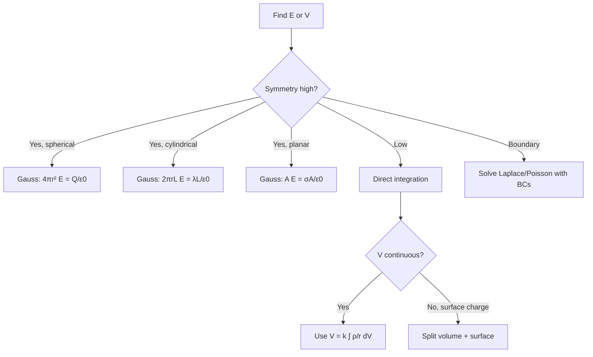
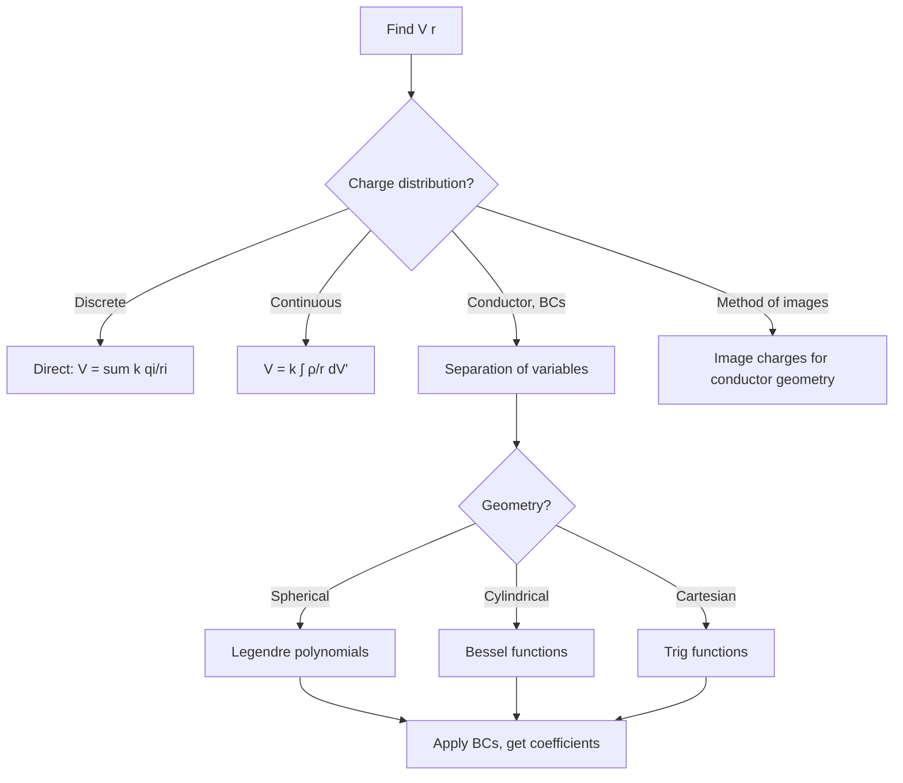
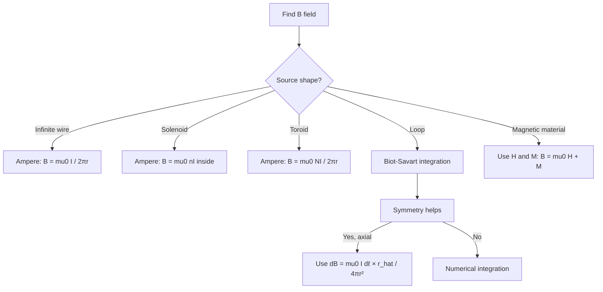
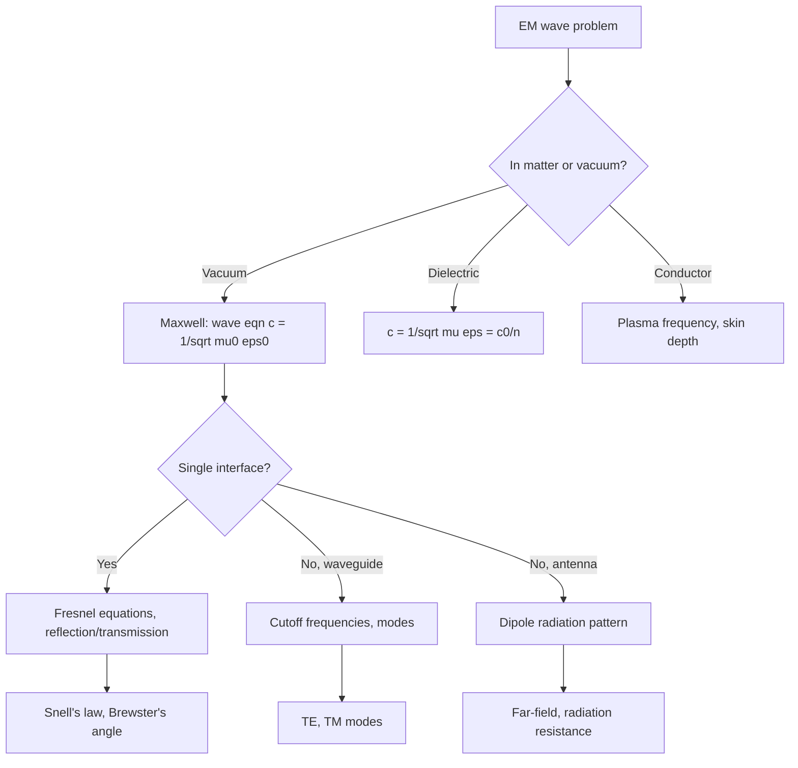
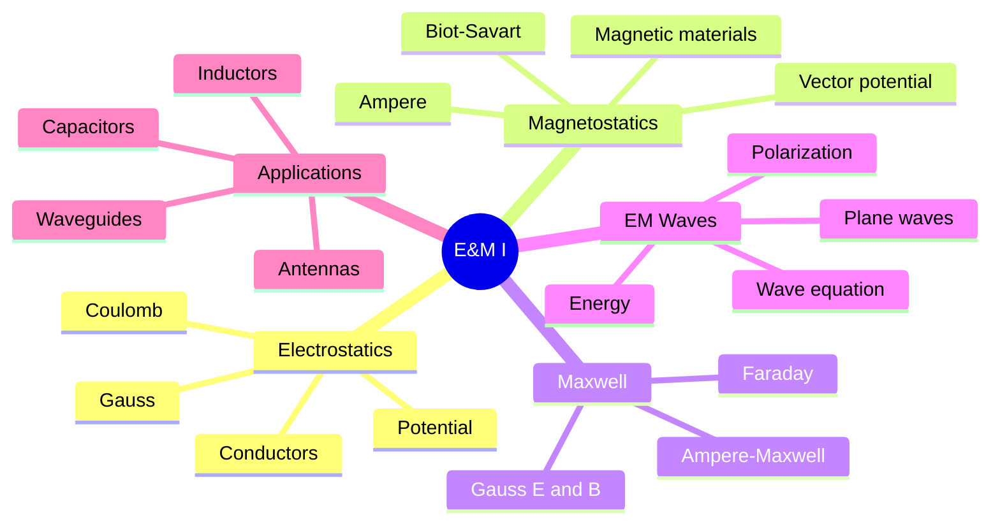
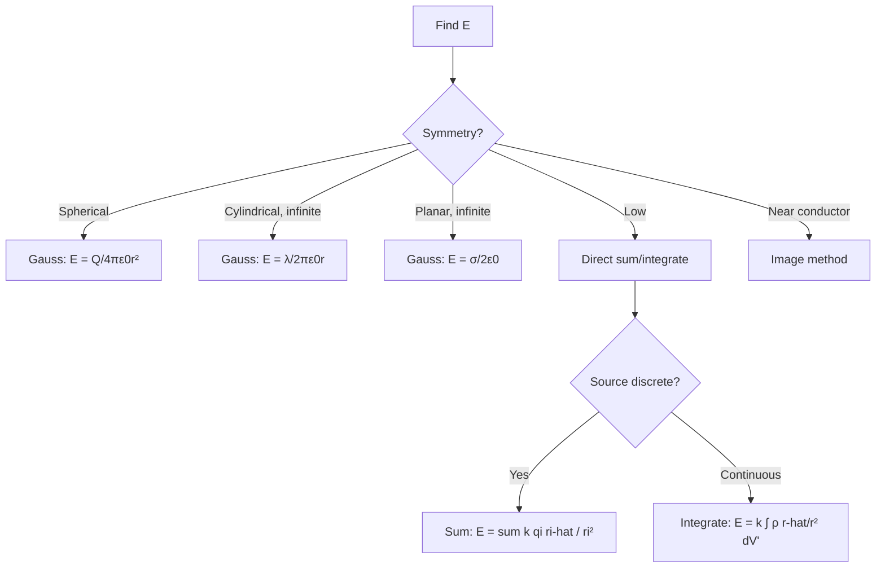
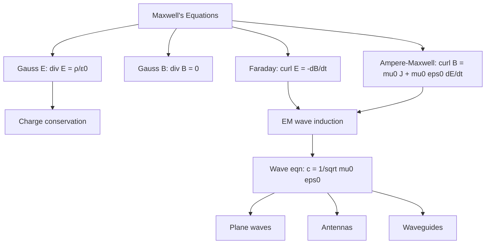
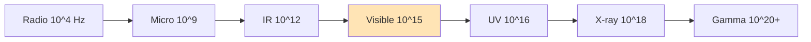
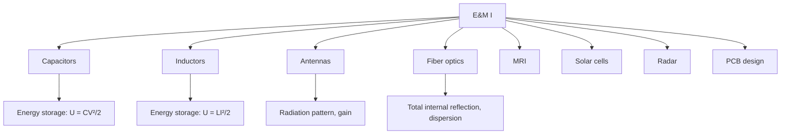

# PHYS 3033 — Electricity and Magnetism I
> **Phase 1 BSc Core | HKUST PHYS 3033 | Electrostatics, Magnetostatics, Maxwell's Equations**  
> **Bilingual 深度自學檔案 · 中英對照**

---

## 📚 Course Information

- **Code:** PHYS 3033
- **Name:** Electricity and Magnetism I
- **University:** HKUST
- **Department:** Physics
- **Term:** Fall 2025-2026
- **Phase:** 1 (BSc Foundation)
- **Credits:** 3
- **Difficulty:** ⭐⭐⭐⭐
- **Format version:** v2.0 (full deep-dive)

---

## 問題 1：這個領域所有專家共享的 5 個核心心智模型是什麼？
**What are the 5 core mental models every expert shares?**

| # | Mental Model | 心智模型 | Engineering Analogy | 工程類比 |
|---|---|---|---|---|
| 1 | **Fields are physical** | 場係物理實在 | $\vec E, \vec B$ carry energy & momentum | 帶能量動量 |
| 2 | **Gauss's law: sources create flux** | Gauss 定律: 源產生通量 | $\oint \vec E \cdot d\vec A = Q/\epsilon_0$ | 通量正比源 |
| 3 | **Faraday: changing flux → EMF** | Faraday: 通量變化 → EMF | $\oint \vec E \cdot d\vec\ell = -d\Phi_B/dt$ | 感應電動勢 |
| 4 | **Ampère-Maxwell: current → curl** | Ampère-Maxwell: 電流 → 旋度 | $\oint \vec B \cdot d\vec\ell = \mu_0 I + \mu_0\epsilon_0 d\Phi_E/dt$ | 環流正比電流 |
| 5 | **EM waves = coupled E & B** | 電磁波 = 耦合 E 同 B | $\vec E \perp \vec B \perp \vec k$, $c = 1/\sqrt{\mu_0\epsilon_0}$ | 光 = 電磁波 |

---

## 問題 2：這個領域的專家在哪 3 個地方存在根本分歧？各方最強的論點是什麼？
**What are the 3 fundamental disagreements + strongest arguments?**

1. **Action-at-distance vs field theory**  
   - Action-at-distance (Newton, Coulomb): Instantaneous force.  
   - Field (Faraday, Maxwell): Mediated by field; finite speed $c$.  
   - 超距作用: 瞬時力。  
   - 場論: 場媒介, 有限速度 $c$。

2. **Ether vs relativity**  
   - Ether: Mechanical medium for EM waves.  
   - Relativity: No ether, $c$ is invariant, time dilation, length contraction.  
   - 以太: 電磁波嘅機械媒介。  
   - 相對論: 無以太, $c$ 不變, 時間膨脹, 長度收縮。

3. **Classical vs quantum EM**  
   - Classical: Maxwell's equations suffice.  
   - Quantum: Photons, QED, vacuum fluctuations.  
   - 古典: Maxwell 方程足夠。  
   - 量子: 光子、QED、真空漲落。

---

## 問題 3：生成 10 個能區分深度理解與死背知識的問題
**Generate 10 questions that distinguish deep understanding from memorization**

1. 為什麼 Coulomb 嘅 $1/r^2$ 對 Gauss 定律嘅 flux conservation 係 crucial? 點解 $1/r^n$ with $n \neq 2$ 會破壞?  
   **Why does $1/r^2$ matter for flux conservation?**
2. 給定一條 line charge $\lambda$, derive $\vec E$ 用 Gauss 定律 vs 直接 integration. 比較兩個方法嘅 elegance。  
   **Line charge via Gauss vs direct.**
3. 為什麼 Stokes' theorem 喺 Faraday 定律入面 connect line integral 同 flux derivative?  
   **Why Stokes connects these?**
4. 解釋為什麼 displacement current $\epsilon_0 d\vec E/dt$ 對 Maxwell 方程嘅 consistency 必要 (charge conservation)。  
   **Why displacement current needed?**
5. 給定 point charge 接近 conductor, 為什麼 image charge 喺 $-q$ at mirrored position work? 解釋 uniqueness theorem。  
   **Why image method works.**
6. 為什麼 plane wave solution $\vec E = E_0 e^{i(kz - \omega t)}$ 滿足 Maxwell 喺 vacuum, 同 $c = \omega/k$?  
   **Why this satisfies Maxwell?**
7. 解釋為什麼 dielectric 內部嘅 $\vec D = \epsilon \vec E$ 而非 $\vec E$ 自身, 同 polarization $\vec P$ 嘅 role。  
   **Why $\vec D$ introduced?**
8. 給定一條 solenoid, 為什麼 external $\vec B \approx 0$ 但 internal 係 uniform $\mu_0 nI$?  
   **Why solenoid fields?**
9. 為什麼 magnetic monopole 從未發現, 但 Dirac 證明佢嘅存在會 explain charge quantization?  
   **Why monopoles imply charge quantization?**
10. 給定一個 accelerating charge, 解釋為什麼佢 radiate (Larmor formula), 同 static charge 唔 radiate。  
    **Why accelerating charge radiates.**

---

## 深入 1：Coulomb's Law & Electric Field
**Deep Dive I: Coulomb's Law & Electric Field**

### 1.1 Bilingual concepts

| Concept | 中英對照 | Math | 物理意義 |
|---|---|---|---|
| Coulomb's law | 庫侖定律 | $\vec F = kq_1 q_2 \hat r/r^2$ | 點電荷之間力 |
| Electric field | 電場 | $\vec E = \vec F/q$ | 單位電荷受力 |
| Superposition | 疊加原理 | $\vec E_{tot} = \sum \vec E_i$ | 線性疊加 |
| Continuous charge | 連續電荷 | $\vec E = \frac{1}{4\pi\epsilon_0}\int \frac{\rho \hat r}{r^2}dV$ | 對分佈積分 |

### 1.2 Derivation: field of line charge
Linear charge density $\lambda$ on infinite line. By symmetry, $\vec E$ radial, magnitude depends only on $r$.  
Gauss's law with cylindrical surface radius $r$, length $L$:  
$\oint \vec E \cdot d\vec A = E(r) \cdot 2\pi r L = \lambda L/\epsilon_0$  
$\implies E(r) = \frac{\lambda}{2\pi\epsilon_0 r}$, radial outward.

### 1.3 Decision flow

### 1.4 Engineering applications
- Capacitors: $E = \sigma/\epsilon_0$ between plates, $C = \epsilon_0 A/d$
- Lightning rods: Sharp points concentrate field, ionizing air
- Photocopier: Corona discharge from wires

---

## 深入 2：Gauss's Law & Divergence Theorem
**Deep Dive II: Gauss's Law & Divergence Theorem**

### 2.1 Bilingual concepts

| Concept | 中英對照 | Integral form | Differential form |
|---|---|---|---|
| Gauss's law | Gauss 定律 | $\oint \vec E \cdot d\vec A = Q_{enc}/\epsilon_0$ | $\nabla \cdot \vec E = \rho/\epsilon_0$ |
| Divergence | 散度 | — | $\nabla \cdot \vec F = \partial_x F_x + ...$ |
| Solenoidal | 無源場 | $\oint \vec B \cdot d\vec A = 0$ | $\nabla \cdot \vec B = 0$ (no monopoles) |
| Poisson equation | Poisson 方程 | — | $\nabla^2 V = -\rho/\epsilon_0$ |
| Laplace equation | Laplace 方程 | — | $\nabla^2 V = 0$ (no charge) |

### 2.2 Derivation: Gauss from Coulomb
Point charge at origin. Flux through sphere radius $r$: $\oint \vec E \cdot d\vec A = (kq/r^2) \cdot 4\pi r^2 = q/\epsilon_0$.  
For arbitrary surface, $\oint \vec E \cdot d\vec A$ depends only on enclosed charge (by divergence theorem).

### 2.3 Why $1/r^2$?
Flux through sphere $\propto E \cdot A = (kq/r^2)(4\pi r^2) = $ const.  
If $F \propto 1/r^n$, flux $\propto 1/r^{n-2}$ — only $n=2$ gives const. (Other laws: gravity $1/r^2$ also Gauss-law-friendly; strong/weak at femtometer scale don't conserve flux.)

### 2.4 Method selection

### 2.5 Engineering applications
- Coaxial cable: $E(r) = \lambda/(2\pi\epsilon_0 r)$ for $r$ between conductors
- Spherical capacitor: $E(r) = Q/(4\pi\epsilon_0 r^2)$
- Faraday cage: $\vec E = 0$ inside closed conductor

---

## 深入 3：Electric Potential & Boundary Value Problems
**Deep Dive III: Electric Potential & Boundary Value Problems**

### 3.1 Bilingual concepts

| Concept | 中英對照 | Math | 物理意義 |
|---|---|---|---|
| Potential | 電勢 | $V(\vec r) = -\int_\infty^{\vec r} \vec E \cdot d\vec\ell$ | 單位電荷 PE |
| Equipotential | 等勢面 | $\vec E \cdot \hat n = -\partial V/\partial n$ | 垂直於 $\vec E$ |
| Work-energy | 功能定理 | $W = q\Delta V$ | 電荷喺電場做功 |
| Poisson | Poisson 方程 | $\nabla^2 V = -\rho/\epsilon_0$ | Volume charge |
| Uniqueness | 唯一性定理 | BCs uniquely determine V | Boundary value problem |

### 3.2 Derivation of Poisson
$\vec E = -\nabla V$, take divergence: $\nabla \cdot \vec E = -\nabla^2 V = \rho/\epsilon_0$ (Gauss). Rearrange: $\nabla^2 V = -\rho/\epsilon_0$.

### 3.3 Boundary conditions
- $V$ continuous across surface (else infinite $\vec E$)
- $\partial V/\partial n$ has jump $\sigma/\epsilon_0$ (Gauss)
- $V \to 0$ at $\infty$ (or specified value)

### 3.4 Separation of variables in spherical/cylindrical
For Laplace in spherical: $V(r,\theta) = \sum_l (A_l r^l + B_l/r^{l+1}) P_l(\cos\theta)$.  
For Laplace in cylindrical: $V(r,\phi) = \sum_n (A_n r^n + B_n/r^n)(C_n \cos n\phi + D_n \sin n\phi)$.

### 3.5 Method flow

### 3.6 Engineering applications
- Field-effect transistors: Gate potential controls channel
- Cathode ray tubes: $V$ accelerates electrons
- Electrostatic precipitators: $V$ charges particles for capture

---

## 深入 4：Magnetostatics & Biot-Savart
**Deep Dive IV: Magnetostatics & Biot-Savart**

### 4.1 Bilingual concepts

| Concept | 中英對照 | Math | 物理意義 |
|---|---|---|---|
| Biot-Savart | Biot-Savart 定律 | $d\vec B = \frac{\mu_0}{4\pi} \frac{I d\vec\ell \times \hat r}{r^2}$ | Current element 產生 B |
| Ampère's law | 安培定律 | $\oint \vec B \cdot d\vec\ell = \mu_0 I_{enc}$ | 環流正比電流 |
| Lorentz force | Lorentz 力 | $\vec F = q\vec v \times \vec B$ | 電荷受力 |
| Magnetic dipole | 磁偶極 | $\vec\mu = I A \hat n$ | 環電流效應 |
| Vector potential | 向量勢 | $\vec B = \nabla \times \vec A$ | B 嘅源 |

### 4.2 Derivation: B field of infinite wire
By symmetry, $\vec B$ circular around wire. Ampère's law with circle radius $r$:  
$B(r) \cdot 2\pi r = \mu_0 I \implies B(r) = \frac{\mu_0 I}{2\pi r}$, $\hat\phi$ direction.

### 4.3 Decision flow

### 4.4 Engineering applications
- MRI: $B \approx 1.5$ T from superconducting coils
- Electric motors: Lorentz force on current-carrying wire in B
- Mass spectrometers: $qv \times B$ for ion separation

---

## 深入 5：Maxwell's Equations & EM Waves
**Deep Dive V: Maxwell's Equations & EM Waves**

### 5.1 Bilingual Maxwell's equations

| Law | Integral form | 微分形式 | Physical meaning |
|---|---|---|---|
| Gauss-E | $\oint \vec E \cdot d\vec A = Q/\epsilon_0$ | $\nabla \cdot \vec E = \rho/\epsilon_0$ | Charge creates E flux |
| Gauss-B | $\oint \vec B \cdot d\vec A = 0$ | $\nabla \cdot \vec B = 0$ | No magnetic monopoles |
| Faraday | $\oint \vec E \cdot d\vec\ell = -d\Phi_B/dt$ | $\nabla \times \vec E = -\partial \vec B/\partial t$ | Changing B creates E |
| Ampère-Maxwell | $\oint \vec B \cdot d\vec\ell = \mu_0 I + \mu_0\epsilon_0 d\Phi_E/dt$ | $\nabla \times \vec B = \mu_0 \vec J + \mu_0\epsilon_0 \partial\vec E/\partial t$ | Current + changing E creates B |

### 5.2 Derivation of EM wave equation (vacuum)
$\nabla \times \vec E = -\partial \vec B/\partial t$, take curl: $\nabla \times (\nabla \times \vec E) = -\partial(\nabla \times \vec B)/\partial t = -\mu_0\epsilon_0 \partial^2 \vec E/\partial t^2$.  
Use vector identity: $\nabla \times (\nabla \times \vec E) = \nabla(\nabla \cdot \vec E) - \nabla^2 \vec E = -\nabla^2 \vec E$ (since $\nabla \cdot \vec E = 0$ in vacuum).  
$\implies \nabla^2 \vec E = \mu_0\epsilon_0 \partial^2 \vec E/\partial t^2$.  
This is wave equation with $c = 1/\sqrt{\mu_0\epsilon_0}$.

### 5.3 Plane wave solution
$\vec E = E_0 \hat x \cos(kz - \omega t)$, $\vec B = B_0 \hat y \cos(kz - \omega t)$.
$c = \omega/k$, $B_0 = E_0/c$, $\vec E \perp \vec B \perp \vec k$.

### 5.4 Energy flow (Poynting vector)
$\vec S = \frac{1}{\mu_0}\vec E \times \vec B$ (W/m², energy flux).  
Time-averaged for plane wave: $\langle S \rangle = E_0^2/(2\mu_0 c)$.

### 5.5 Method flow

### 5.6 Engineering applications
- Fiber optics: Total internal reflection, low-loss transmission
- Radar: Reflection from targets, Doppler for velocity
- Microwave oven: $f = 2.45$ GHz, water absorption
- WiFi/5G: Antenna design, propagation, multipath

---

## 自測 1：Why flux from point charge is constant
**Self-Test 1: Why flux from point charge is constant**

**Answer / 解答:**  
$1/r^2$ field, $4\pi r^2$ area → $r$ cancels. Spherical symmetry → all radial. So any closed surface gives same flux = $Q/\epsilon_0$.

**Engineering implication:** Flux through any Gaussian surface depends only on enclosed charge — solid angle argument.

---

## 自測 2：Capacitor with dielectric
**Self-Test 2: Capacitor with dielectric**

**Answer / 解答:**  
Dielectric reduces $E$ by factor $1/\kappa$ (polarization opposes applied field). So $C = \kappa\epsilon_0 A/d$, energy $U = \frac{1}{2}CV^2$ smaller.

**Engineering implication:** Higher-density capacitors (ceramic class 2: $\kappa \sim 10^4$).

---

## 自測 3：Image charge for grounded sphere
**Self-Test 3: Image charge for grounded sphere**

**Answer / 解答:**  
Point charge $q$ at distance $d$ from grounded sphere radius $R$. Image charge $q' = -qR/d$ at distance $d' = R^2/d$ inside.  
Uniqueness theorem: $\nabla^2 V = 0$ outside, $V=0$ on sphere → same solution as if image were there.

**Engineering implication:** Lightning rod + ground sphere model; classic problem in electrostatics.

---

## 自測 4：Why displacement current needed
**Self-Test 4: Why displacement current needed**

**Answer / 解答:**  
Capacitor charging: conduction current flows in wires, but NO current between plates. Without displacement current $\epsilon_0 dE/dt$, Ampère's law would be inconsistent.  
$\epsilon_0 d\Phi_E/dt$ preserves $\nabla \cdot \vec J = -\partial\rho/\partial t$ (charge conservation).

**Engineering implication:** Antenna radiation; high-frequency circuits.

---

## 自測 5：Solenoid B field
**Self-Test 5: Solenoid B field**

**Answer / 解答:**  
Ampère's law with rectangular loop, one side inside, one outside:  
Inside: $B \cdot L = \mu_0 n L I \implies B = \mu_0 n I$ (uniform).  
Outside: $B = 0$ (assumes long solenoid, no flux leakage).  
Energy density $u = B^2/(2\mu_0)$.

**Engineering implication:** MRI magnets, particle accelerator dipoles.

---

## 自測 6：Skin depth in conductor
**Self-Test 6: Skin depth in conductor**

**Answer / 解答:**  
EM wave in conductor: $\vec E = E_0 e^{-x/\delta} e^{i\omega t}$ where $\delta = \sqrt{2/(\mu\omega\sigma)}$.  
For Cu at 60 Hz: $\delta \approx 8$ mm. At 1 GHz: $\delta \approx 2 \mu m$.  

**Engineering implication:** Why high-frequency circuits need careful conductor design (Litz wire, hollow tubes).

---

## 自測 7：Snell's law from Fermat
**Self-Test 7: Snell's law from Fermat**

**Answer / 解答:**  
Fermat: light path minimizes time $t = \int n ds/c$. Variation: $n_1 \sin\theta_1 = n_2 \sin\theta_2$.  
Equivalent: wave-vector tangents continuous at interface.

**Engineering implication:** Lens design, fiber optic coupling, anti-reflection coatings.

---

## 自測 8：Why light is transverse
**Self-Test 8: Why light is transverse**

**Answer / 解答:**  
$\nabla \cdot \vec E = 0$ in vacuum → $\vec k \cdot \vec E_0 = 0$. So $\vec E \perp \vec k$. Similarly $\vec B \perp \vec k$. Plus $\vec E \perp \vec B$ from Maxwell.  
Only 2 independent polarizations.

**Engineering implication:** Polarization filters, LCD displays, optical communication.

---

## 自測 9：Brewster's angle
**Self-Test 9: Brewster's angle**

**Answer / 解答:**  
At $\theta_B = \arctan(n_2/n_1)$, reflected and refracted rays are perpendicular. Reflected light is fully polarized.  
Derived from setting $r_p = 0$ in Fresnel equations.

**Engineering implication:** Laser-line polarizers, glare-reducing sunglasses, photography filters.

---

## 自測 10：Poynting vector in DC circuit
**Self-Test 10: Poynting vector in DC circuit**

**Answer / 解答:**  
Inside wire: $\vec E$ along wire (drives current). $\vec B$ circular around wire. $\vec S = \vec E \times \vec B / \mu_0$ points radially INTO wire — energy flows from field outside into wire (not along wire!).  
Resistive dissipation = surface integral of $S$ on wire surface.

**Engineering implication:** Deep insight — energy in EM field, not in electrons; basis of antenna theory.

---

## 📊 Diagram 1: EM Concept Tree

## 📊 Diagram 2: E Field Method Selection

## 📊 Diagram 3: Maxwell's Equations Network

## 📊 Diagram 4: EM Spectrum

## 📊 Diagram 5: Engineering EM Applications

---

## 深度總結 Deep Insights Summary

1. **Fields are the primary reality, not charges** — in modern E&M, fields are the fundamental objects; charges and currents are sources/sinks. Energy and momentum live in the field, not in particles.  
   **場係主要實在, 唔係電荷** — 喺現代 E&M, 場係基本物件; 電荷同電流係源匯。能量動量住喺場, 唔住喺粒子。

2. **Symmetry → Gauss/Ampère simplicity** — high-symmetry charge distributions make Gauss's law trivially solvable. Without symmetry, you integrate directly. The 1/r² force is uniquely compatible with flux conservation.  
   **對稱 → Gauss/Ampère 簡化** — 高對稱電荷分佈令 Gauss 定律可直接解。冇對稱就要直接積分。$1/r^2$ 力係唯一同通量守恆相容嘅。

3. **Displacement current = EM wave** — Maxwell's addition of $\epsilon_0 dE/dt$ to Ampère's law is what makes EM waves possible. Without it, charge conservation would be violated in capacitor circuits.  
   **位移電流 = 電磁波** — Maxwell 將 $\epsilon_0 dE/dt$ 加入安培定律, 令電磁波可能。冇咗佢, 電容器電路會違反電荷守恆。

4. **c is universal** — the speed of EM waves $c = 1/\sqrt{\mu_0 \epsilon_0}$ appears in Maxwell, has nothing to do with mechanics. Einstein elevated this to a postulate of relativity.  
   **c 係普適** — 電磁波速度 $c = 1/\sqrt{\mu_0 \epsilon_0}$ 出現喺 Maxwell, 同力學無關。愛因斯坦將此提升為相對論嘅假設。

5. **Poynting vector in DC is a teaching gem** — energy in a wire flows from outside field INTO the wire, not along it. This counterintuitive result reveals the field-centric view of EM.  
   **直流 Poynting 向量係教學瑰寶** — 導線入面嘅能量係由外部場流入, 而非沿線流動。呢個反直覺結果揭示咗以場為中心嘅 EM 觀。

---

**自學建議**  
- 必讀：Griffiths "Introduction to Electrodynamics" 4th ed. Ch. 1-7.  
- 配對：MIT OCW 8.02 by Walter Lewin (含完整示範)。  
- 工具：SymPy (analytical), FEniCS (FEM for Poisson/Laplace)。  
- 產出：用 SymPy derive 一個新 geometry 嘅電場, 然後用 FEM 數值驗證。
