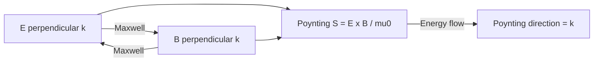
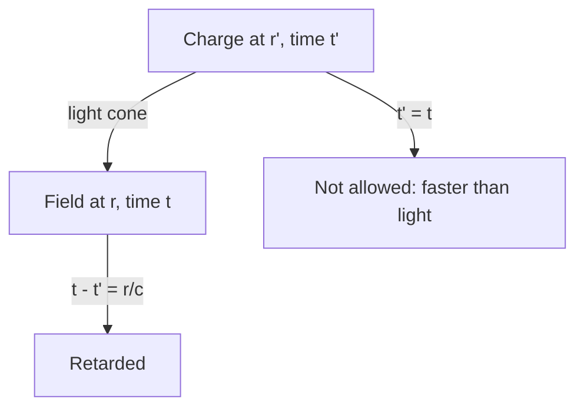
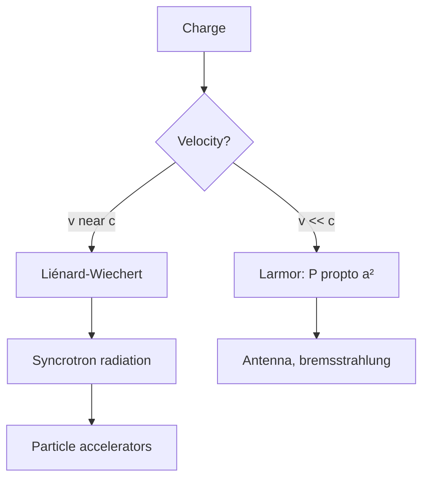
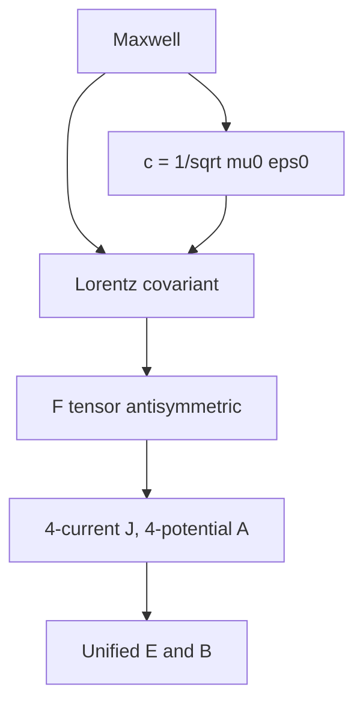
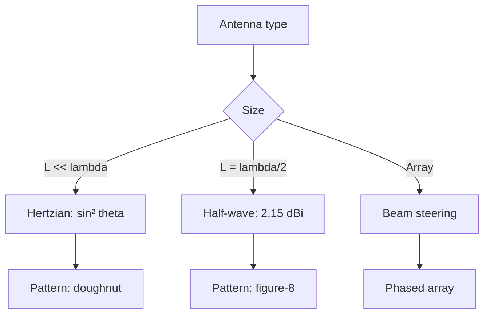
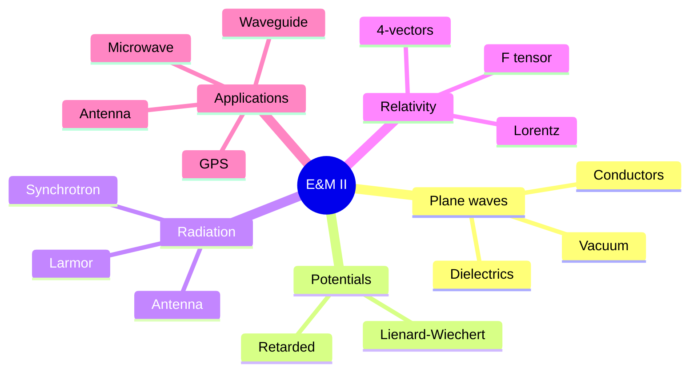
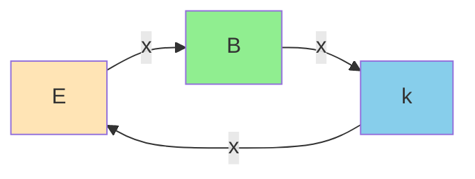
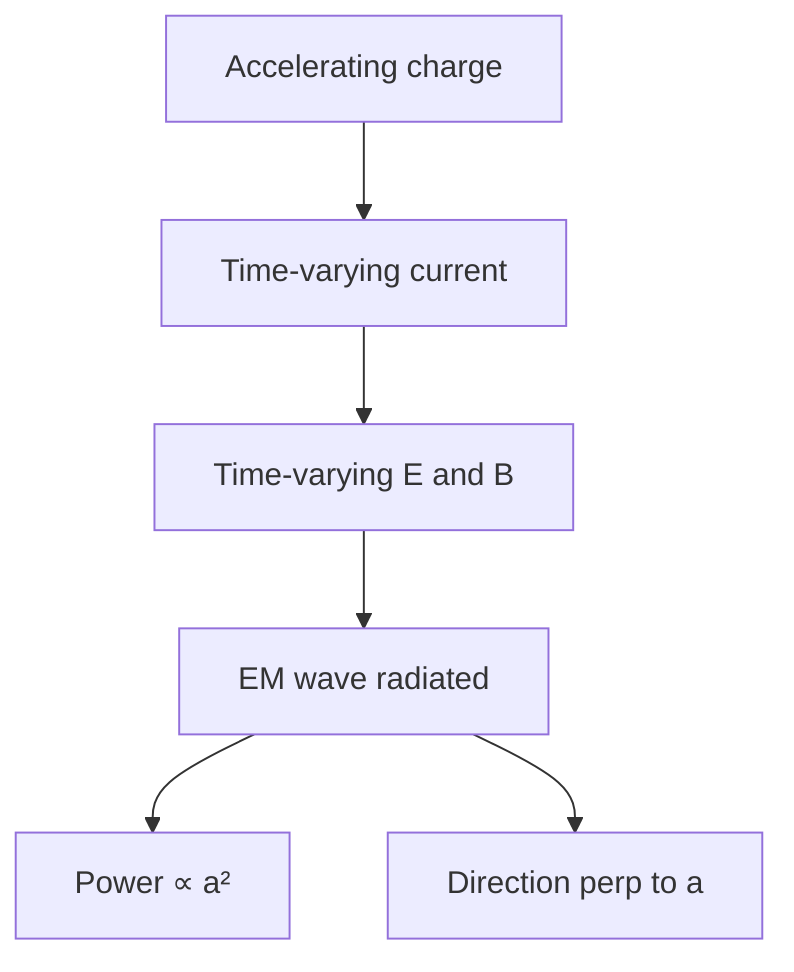
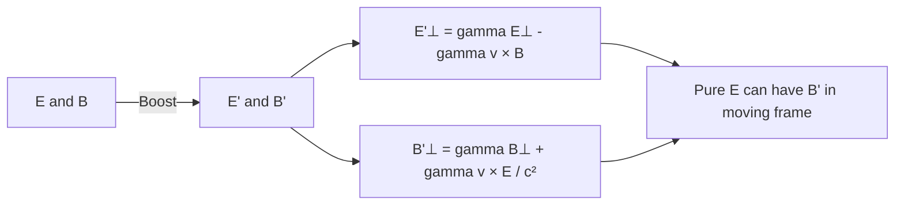
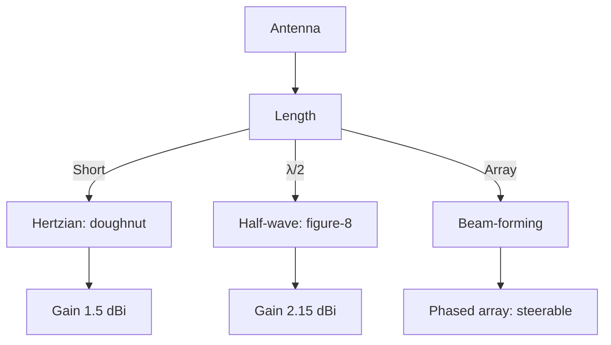

# PHYS 3034 — Electricity and Magnetism II
> **Phase 1 BSc Core | HKUST PHYS 3034 | EM Waves, Radiation, Relativity**  
> **Bilingual 深度自學檔案 · 中英對照**

---

## 問題 1：5 個核心心智模型
**What are the 5 core mental models?**

1. **Maxwell's equations are complete classical EM** — all EM phenomena follow from 4 equations in vacuum
2. **EM waves carry energy & momentum** — Poynting vector $S$, radiation pressure
3. **Retarded potentials** — fields propagate at finite speed $c$
4. **Radiation from accelerating charges** — Larmor formula, antenna theory
5. **Special relativity** — E&M is intrinsically relativistic (E & B unify)

---

## 問題 2：3 個根本分歧
1. **Action-at-distance vs field theory** — Coulomb instant vs Faraday fields
2. **Ether vs no ether** — Lorentz vs Einstein
3. **Classical vs quantum EM** — Maxwell vs QED

---

## 問題 3：10 個深度問題
1. 為什麼 plane wave solution $\vec E \perp \vec B \perp \vec k$?
2. Derive Poynting vector $\vec S = \vec E \times \vec B/\mu_0$ from energy conservation.
3. 給定 accelerating charge, derive Larmor formula $P = q^2 a^2 / (6\pi\epsilon_0 c^3)$。
4. 為什麼 retarded time $t_r = t - r/c$?
5. 解釋為什麼 moving charge 產生 magnetic field 喺 EM wave 入面係 electric 同 magnetic 嘅 unified view。
6. 給定 dipole antenna, derive radiation pattern $P \propto \sin^2\theta$。
7. 為什麼 $c = 1/\sqrt{\mu_0\epsilon_0}$ 暗示 E 同 B 係 unified field?
8. 給定 plane wave in conductor, derive skin depth $\delta = \sqrt{2/(\mu\omega\sigma)}$。
9. 為什麼 reflection coefficient $R = ((n-1)/(n+1))^2$ for normal incidence?
10. 解釋 Lorentz transformation 對 Maxwell 方程嘅 covariance。

---

## 深入 1：Plane Waves in Vacuum
**Deep Dive I**

Wave eqn: $\nabla^2 \vec E = \mu_0\epsilon_0 \partial_t^2 \vec E$. Solution $\vec E = \vec E_0 e^{i(\vec k \cdot \vec r - \omega t)}$ with $\omega = c|\vec k|$, $c = 1/\sqrt{\mu_0\epsilon_0}$.

**Engineering:** Microwave, fiber optics, lasers, radar.

---

## 深入 2：Retarded Potentials
**Deep Dive II**

For time-dependent sources, potentials depend on source at retarded time: $V(\vec r, t) = \frac{1}{4\pi\epsilon_0}\int \frac{\rho(\vec r', t_r)}{|\vec r - \vec r'|} dV'$ with $t_r = t - |\vec r - \vec r'|/c$.

**Engineering:** Antenna design, EM compatibility.

---

## 深入 3：Radiation from Accelerating Charges
**Deep Dive III**

Larmor: $P = \frac{q^2 a^2}{6\pi\epsilon_0 c^3}$ for non-relativistic.
Relativistic (Liénard): $P = \frac{q^2\gamma^6}{6\pi\epsilon_0 c^3}(a^2 - |\vec v \times \vec a|^2/c^2)$.

**Engineering:** Synchrotron light sources, particle physics.

---

## 深入 4：Special Relativity & EM
**Deep Dive IV**

Einstein 1905: $c$ is invariant. Maxwell equations covariant under Lorentz. $E$ and $B$ parts of electromagnetic field tensor $F^{\mu\nu}$.

**Engineering:** GPS time dilation, particle accelerators.

---

## 深入 5：Antenna Theory
**Deep Dive V**

Hertzian dipole: short current element, far-field $E_\theta \propto \sin\theta / r$. Half-wave dipole: $L = \lambda/2$, gain 2.15 dBi.

**Engineering:** Cell towers, WiFi, radar, satellite.

---

## 自測 1：Poynting inside wire
**Answer:** $\vec E$ along, $\vec B$ circumferential. $\vec S$ points radially INTO wire.  
**Engineering:** Energy flows from outside field into wire.

## 自測 2：Larmor limit
**Answer:** Classical electron radius $r_e = e^2/(4\pi\epsilon_0 m_e c^2) = 2.8$ fm. Radiation reaction limits $a$.  
**Engineering:** Limits particle accelerator design.

## 自測 3：Far-field $1/r$ vs near-field $1/r^2, 1/r^3$
**Answer:** Radiation zone $\propto 1/r$, induction $\propto 1/r^2$, electrostatic $\propto 1/r^3$.  
**Engineering:** Antenna pattern region, near-field coupling.

## 自測 4：Snell's law from Fermat
**Answer:** Minimize time → $n_1 \sin\theta_1 = n_2 \sin\theta_2$.  
**Engineering:** Lens design, fiber optics.

## 自測 5：Why no monopole
**Answer:** $\nabla \cdot \vec B = 0$, $F^{\mu\nu}$ antisymmetric. No magnetic charge.  
**Engineering:** Maxwell's equations structure; Dirac monopole would explain charge quantization.

## 自測 6：Energy density EM wave
**Answer:** $u = \frac{1}{2}(\epsilon_0 E^2 + B^2/\mu_0)$, time-averaged $\langle u \rangle = \epsilon_0 E_0^2/2$ for plane wave.  
**Engineering:** Solar irradiance, laser intensity.

## 自測 7：Fresnel equations
**Answer:** $r_s, r_p, t_s, t_p$ at interface, from BCs. Brewster angle $\theta_B = \arctan(n_2/n_1)$.  
**Engineering:** AR coatings, polarizers.

## 自測 8：Lorentz force on charge
**Answer:** $\vec F = q(\vec E + \vec v \times \vec B)$, from 4-force $f^\mu = q F^{\mu\nu} u_\nu / m$.  
**Engineering:** Mass spectrometer, cyclotron, Hall effect.

## 自測 9：Why $E = cB$ in wave
**Answer:** From Maxwell: $|\nabla \times \vec E| = |\partial \vec B/\partial t| \implies kE = \omega B \implies E = cB$.  
**Engineering:** EM wave detector design.

## 自測 10：Why retarded not advanced
**Answer:** Causality: effect after cause. Microscopic reversibility allows advanced; macroscopic 2nd law selects retarded (Boltzmann-like).  
**Engineering:** Antenna design, EM compatibility, radar.

---

## 📊 Diagram 1: EM II Concept Map

## 📊 Diagram 2: EM Wave Structure

## 📊 Diagram 3: Radiation Mechanism

## 📊 Diagram 4: Lorentz Transformation of E, B

## 📊 Diagram 5: Antenna Patterns

---

## 深度總結 Deep Insights

1. **EM waves unify E and B** — they're two faces of one tensor.
2. **Radiation = accelerating charge** — all EM radiation comes from $a \neq 0$.
3. **Retarded potentials respect causality** — no information faster than light.
4. **E&M is intrinsically relativistic** — prefigured by Maxwell, formalized by Einstein.
5. **Antennas are practical Larmor** — turning electronics into radiation.

---

**自學建議** — Griffiths Ch. 8-12. MIT OCW 8.07.
