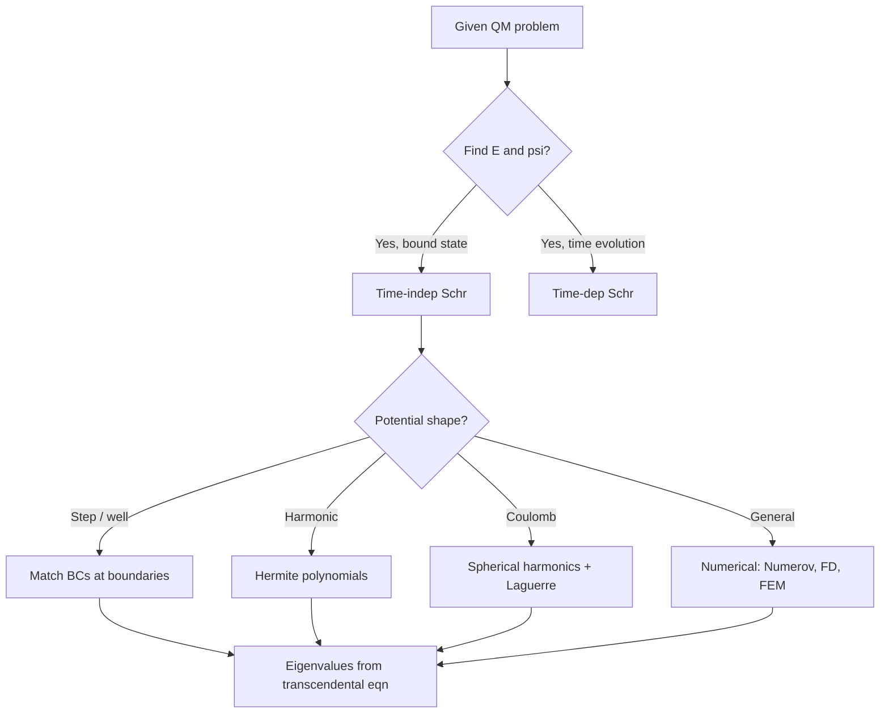
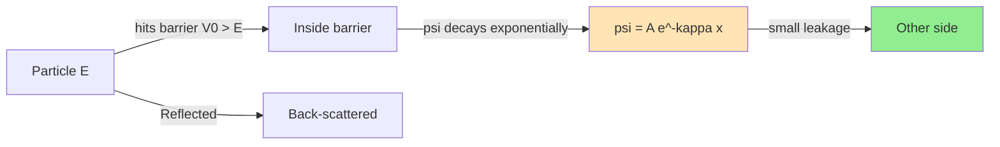
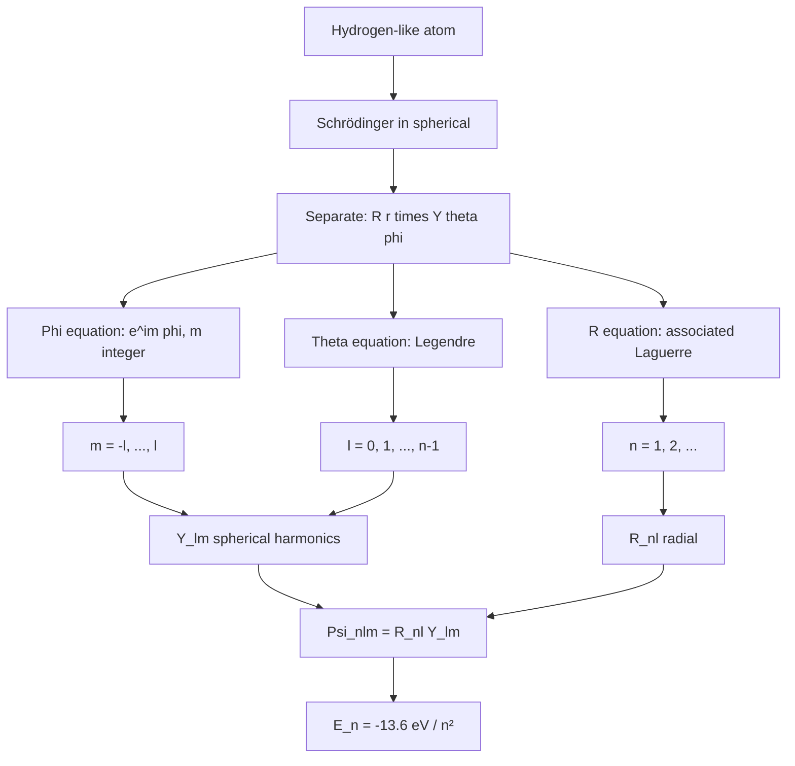
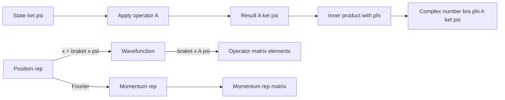
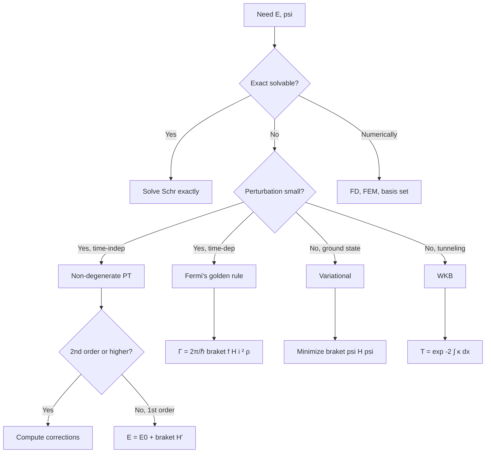
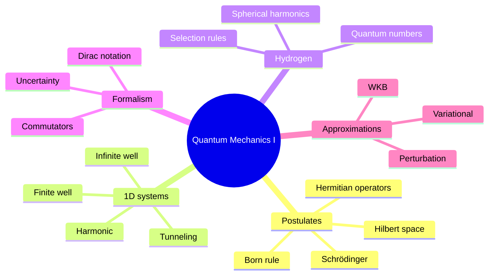
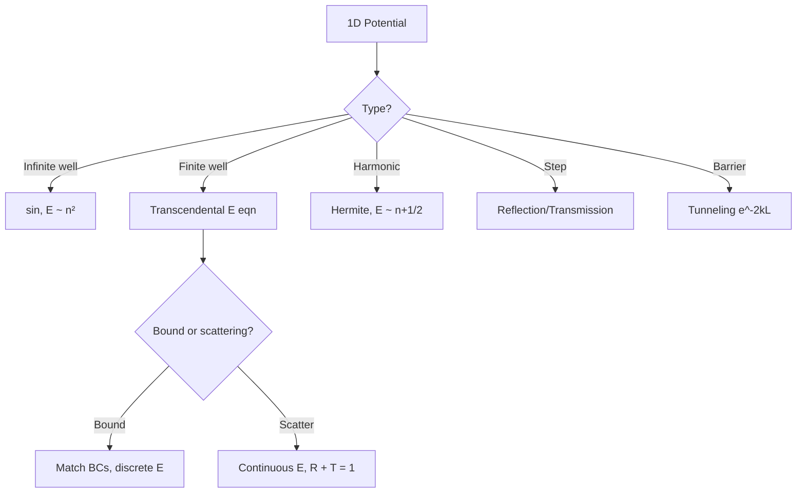
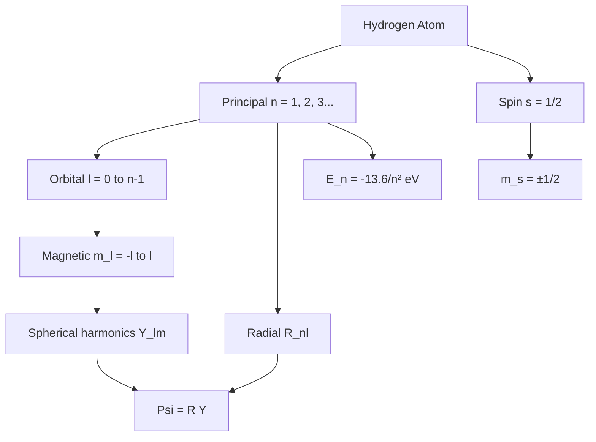
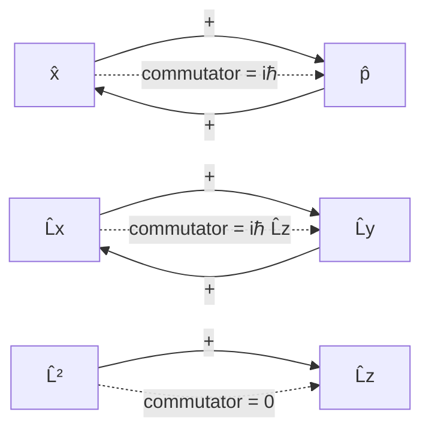
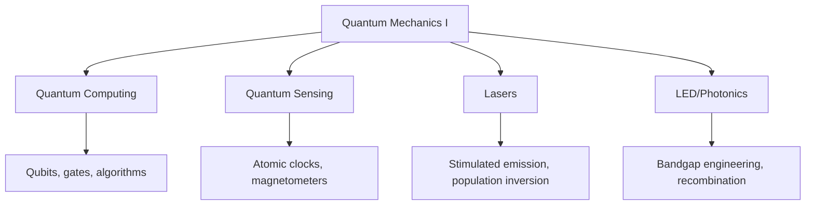

# PHYS 3036 — Quantum Mechanics I
> **Phase 1 BSc Core | HKUST PHYS 3036 | Schrödinger Equation, Quantum Systems, Mathematical Formalism**  
> **Bilingual 深度自學檔案 · 中英對照**

---

## 📚 Course Information

- **Code:** PHYS 3036
- **Name:** Quantum Mechanics I
- **University:** HKUST
- **Department:** Physics
- **Term:** Spring 2025-2026
- **Phase:** 1 (BSc Foundation)
- **Credits:** 3
- **Difficulty:** ⭐⭐⭐⭐⭐
- **Format version:** v2.0 (full deep-dive)

---

## 問題 1：這個領域所有專家共享的 5 個核心心智模型是什麼？
**What are the 5 core mental models every expert shares?**

| # | Mental Model | 心智模型 | Engineering Analogy | 工程類比 |
|---|---|---|---|---|
| 1 | **State is a vector in Hilbert space** | 態係 Hilbert 空間嘅向量 | $|\psi\rangle$ fully describes the system | 完全描述系統 |
| 2 | **Observables are Hermitian operators** | 可觀測量係 Hermitian 算子 | $A^\dagger = A \implies$ real eigenvalues | 實特徵值 |
| 3 | **Measurement collapses the wavefunction** | 量度導致波函數塌縮 | Probability $P = |\langle a|\psi\rangle|^2$ | 概率幅 |
| 4 | **Time evolution is unitary** | 時間演化係幺正 | $U(t) = e^{-iHt/\hbar}$ preserves norm | 保持範數 |
| 5 | **Symmetry = conservation (Noether)** | 對稱 = 守恆 (Noether) | $[H, Q] = 0 \implies Q$ conserved | $Q$ 守恆 |

---

## 問題 2：這個領域的專家在哪 3 個地方存在根本分歧？各方最強的論點是什麼？
**What are the 3 fundamental disagreements + strongest arguments?**

1. **Copenhagen vs Many-Worlds (interpretation)**  
   - Copenhagen (Bohr, Heisenberg): Wavefunction collapse is real; classical-quantum boundary.  
   - Many-Worlds (Everett): All outcomes occur in branching universes; no collapse.  
   - 哥本哈根: 波函數塌縮係真實; 經典-量子有邊界。  
   - 多世界: 所有結果喺分支宇宙都發生; 無塌縮。

2. **Hidden variables vs $\psi$-epistemic**  
   - Bohmian: Particles have definite positions; $\psi$ guides them.  
   - $\psi$-epistemic: $\psi$ is knowledge, not reality (speculative).  
   - Bohm: 粒子有確定位置; $\psi$ 引導佢哋。  
   - $\psi$-epistemic: $\psi$ 係知識, 唔係實在 (推測性)。

3. **QFT-first vs QM-first teaching**  
   - QM-first (most undergrads): Schrödinger first, fields later.  
   - QFT-first (some theorists): Fields are fundamental; particles are excitations.  
   - 量子力學先: 先 Schrödinger, 之後場論。  
   - 場論先: 場係基礎; 粒子係激發。

---

## 問題 3：生成 10 個能區分深度理解與死背知識的問題
**Generate 10 questions that distinguish deep understanding from memorization**

1. 為什麼 $\psi$ 必須係 continuous + single-valued + square-integrable? 解釋每個條件嘅物理原因。  
   **Why must $\psi$ satisfy these 3 conditions?**
2. 給定一個 particle in a 1D infinite square well, 為什麼 $E_n \propto n^2$ 而非 $n$? 點解呢個關係體現 quantum confinement?  
   **Why does this reflect confinement?**
3. 解釋為什麼 $[\hat x, \hat p] = i\hbar$ 喺 classical limit ($\hbar \to 0$) 變得 trivial, 意味住 classical correspondence.  
   **Why does this give classical correspondence?**
4. 給定 $\hat H = \frac{\hat p^2}{2m} + V(\hat x)$, derive $\frac{d}{dt}\langle \hat A \rangle = \frac{i}{\hbar}\langle [\hat H, \hat A]\rangle + \langle \frac{\partial \hat A}{\partial t}\rangle$ (Ehrenfest theorem).  
   **Derive Ehrenfest theorem.**
5. 為什麼 hydrogen atom 嘅 ground state energy 係 $-13.6$ eV, 同 $m_e$ 同 $\epsilon_0$ 嘅關係?  
   **What's the relationship?**
6. 給定 $\hat L_z$ in spherical coordinates, 點解 eigenfunctions 係 $e^{im\phi}$ 而 $m$ 必須係 integer?  
   **Why must $m$ be integer?**
7. 為什麼 spin-1/2 particles 唔可以 have orbital angular momentum $l = 0$ in identical pair (exchange antisymmetry)?  
   **Why no $l=0$ for identical fermions?**
8. 給定 $\psi(x) = A e^{-x^2/(2a^2)}$, 計算 $\Delta x$ 同 $\Delta p$, 證明 $\Delta x \Delta p \geq \hbar/2$.  
   **Prove the uncertainty principle for this wavefunction.**
9. 解釋為什麼 quantum tunneling probability $T \propto e^{-2\kappa L}$ 喺 STM (scanning tunneling microscope) 應用中係 exponentially sensitive to gap.  
   **Why exponentially sensitive in STM?**
10. 為什麼 time-independent perturbation theory 對 degenerate states 需要 diagonalization 喺 degenerate subspace?  
    **Why diagonalize in degenerate subspace?**

---

## 深入 1：Postulates of Quantum Mechanics
**Deep Dive I: Postulates of Quantum Mechanics**

### 1.1 Bilingual postulate table

| # | Postulate (EN) | 公設 (中) | Mathematical form | 數學形式 |
|---|---|---|---|---|
| 1 | State is ray in Hilbert space | 態係 Hilbert 空間嘅射線 | $|\psi\rangle \in \mathcal H$ | $\|\psi\| = 1$ |
| 2 | Observables = Hermitian operators | 可觀測量 = Hermitian 算子 | $\hat O^\dagger = \hat O$ | 實特徵值 |
| 3 | Born rule | Born 規則 | $P(a) = |\langle a|\psi\rangle|^2$ | 概率 = 幅模平方 |
| 4 | Collapse on measurement | 量度後塌縮 | $|\psi\rangle \to |a\rangle$ | 投影到本徵態 |
| 5 | Time evolution = Schrödinger | 時間演化 = Schrödinger | $i\hbar \partial_t |\psi\rangle = \hat H |\psi\rangle$ | 幺正演化 |
| 6 | Identical particles | 全同粒子 | Symmetric (bosons) / Antisymmetric (fermions) | 對稱/反對稱 |

### 1.2 Derivation of time-independent Schrödinger equation
Assume $|\psi(t)\rangle = |\phi\rangle e^{-iEt/\hbar}$. Substituting into time-dependent:
$$i\hbar \cdot (-iE/\hbar) |\phi\rangle e^{-iEt/\hbar} = \hat H |\phi\rangle e^{-iEt/\hbar}$$
$$\implies \hat H |\phi\rangle = E|\phi\rangle$$
This is the eigenvalue equation — time-independent Schrödinger.

### 1.3 Decision flow

### 1.4 Engineering applications
- Quantum dots: 3D infinite well, $E \propto 1/L^2$ → tunable color
- Tunnel diode: $T \propto e^{-2\kappa L}$ → exponential I-V
- NMR/MRI: Spin-1/2 in B-field, Larmor precession

---

## 深入 2：1D Potentials — Infinite Well, Finite Well, Harmonic
**Deep Dive II: 1D Potentials**

### 2.1 Bilingual comparison

| System | 系統 | Energy | Eigenstate | 物理意義 |
|---|---|---|---|---|
| Infinite well $V=0$ for $0<x<L$ | 無限深方阱 | $E_n = \frac{n^2\pi^2\hbar^2}{2mL^2}$ | $\sin(n\pi x/L)$ | Confinement quantization |
| Finite well depth $V_0$ | 有限深方阱 | Transcendental | $\sin/\exp$ hybrid | Bound + scattering |
| Harmonic $V = \frac{1}{2}m\omega^2 x^2$ | 諧振子 | $E_n = (n+\frac{1}{2})\hbar\omega$ | Hermite $\times$ Gaussian | Zero-point energy |
| Free particle $V=0$ | 自由粒子 | Continuous | Plane wave $e^{ikx}$ | $k = \sqrt{2mE}/\hbar$ |

### 2.2 Zero-point energy derivation (harmonic)
For ground state $\psi_0(x) = (\frac{m\omega}{\pi\hbar})^{1/4} e^{-m\omega x^2/(2\hbar)}$:
$$\langle T \rangle = \langle V \rangle = \frac{1}{4}\hbar\omega \implies E_0 = \frac{1}{2}\hbar\omega$$
Virial theorem for harmonic: $\langle T \rangle = \langle V \rangle$, giving non-zero ground state.

### 2.3 Tunneling picture

### 2.4 Engineering applications
- STM: Tunneling current $I \propto e^{-2\kappa L}$ → atomic resolution
- Quantum well laser: 1D confinement → discrete energy levels
- Flash memory: Tunneling through oxide → write/erase

---

## 深入 3：Hydrogen Atom & Angular Momentum
**Deep Dive III: Hydrogen Atom & Angular Momentum**

### 3.1 Bilingual concepts

| Quantum number | 量子數 | Range | Physical meaning | 物理意義 |
|---|---|---|---|---|
| $n$ (principal) | 主量子數 | $1, 2, 3, \ldots$ | Energy + size | 能量 + 大小 |
| $l$ (orbital) | 角量子數 | $0, 1, \ldots, n-1$ | Shape (s, p, d, f) | 形狀 |
| $m_l$ (magnetic) | 磁量子數 | $-l, \ldots, +l$ | Orientation | 方向 |
| $s$ (spin) | 自旋量子數 | $\frac{1}{2}$ for electron | Intrinsic angular momentum | 內禀角動量 |
| $m_s$ (spin-z) | 自旋-z 量子數 | $\pm\frac{1}{2}$ | Spin orientation | 自旋方向 |

### 3.2 Energy derivation
Schrödinger for Coulomb $V(r) = -e^2/(4\pi\epsilon_0 r)$:
$$E_n = -\frac{m_e e^4}{2(4\pi\epsilon_0)^2\hbar^2} \cdot \frac{1}{n^2} = -\frac{13.6 \text{ eV}}{n^2}$$

The $1/n^2$ comes from balance: smaller $n$ → smaller orbit → stronger KE (uncertainty principle) → larger $|E|$.

### 3.3 Angular momentum ladder operators
$$\hat L_\pm = \hat L_x \pm i \hat L_y, \quad [\hat L_z, \hat L_\pm] = \pm\hbar \hat L_\pm$$
$$\hat L_\pm |l, m\rangle = \hbar\sqrt{l(l+1) - m(m \pm 1)}|l, m \pm 1\rangle$$

### 3.4 Selection rules
Electric dipole transitions: $\Delta l = \pm 1, \Delta m = 0, \pm 1$. Why? Photon carries angular momentum $\hbar$.

### 3.5 Decision flow for H-atom

### 3.6 Engineering applications
- Atomic clocks: Cs-133 hyperfine transition at 9.2 GHz
- LED color tuning: GaN/InGaN bandgap engineering
- Stellar spectroscopy: Identify elements from H-atom lines

---

## 深入 4：Mathematical Formalism — Bras, Kets, Operators
**Deep Dive IV: Mathematical Formalism**

### 4.1 Bilingual Dirac notation

| Object | 中英 | Meaning | 物理意義 |
|---|---|---|---|
| $|\psi\rangle$ (ket) | 右矢 | State vector | 態向量 |
| $\langle\psi|$ (bra) | 左矢 | Dual vector (conjugate transpose) | 對偶向量 |
| $\langle\phi\|\psi\rangle$ (bracket) | 內積 | Inner product (complex number) | 內積 (複數) |
| $\|\psi\|^2 = \langle\psi\|\psi\rangle$ | 範數 | Norm squared = 1 (normalization) | 範數平方 = 1 |
| $\hat A\|\psi\rangle$ | 算子作用 | Linear transformation on state | 線性變換 |

### 4.2 Why Hermitian?
$\hat O^\dagger = \hat O$ guarantees:
- Real eigenvalues: $\lambda \in \mathbb R$ (measurement outcomes)
- Orthogonal eigenvectors: $\langle m|n\rangle = \delta_{mn}$ (distinct outcomes)
- Spectral theorem: diagonalizable

### 4.3 Commutator and uncertainty
$$[\hat A, \hat B] = \hat A \hat B - \hat B \hat A$$
$$\Delta A \cdot \Delta B \geq \frac{1}{2}|\langle [\hat A, \hat B] \rangle|$$
For $[\hat x, \hat p] = i\hbar$: $\Delta x \Delta p \geq \hbar/2$.

### 4.4 Operators flow

### 4.5 Engineering applications
- Qubit: 2-level system, operators = Pauli matrices $\sigma_x, \sigma_y, \sigma_z$
- Density matrix $\rho = \sum_i p_i |\psi_i\rangle\langle\psi_i|$ for mixed states
- NMR Hamiltonian: $\hat H = -\gamma \vec B \cdot \vec S$ for spin-1/2 in field

---

## 深入 5：Approximation Methods — Perturbation & Variational
**Deep Dive V: Approximation Methods**

### 5.1 Bilingual comparison

| Method | 方法 | When to use | 適用情境 | Difficulty |
|---|---|---|---|---|
| Time-indep perturbation | 時間無關微擾 | Small perturbation $H' \ll H_0$ | Stark, Zeeman effects | ⭐⭐ |
| Time-dep perturbation | 時間有關微擾 | Time-varying perturbation $H'(t)$ | Absorption, emission | ⭐⭐⭐ |
| Variational principle | 變分法 | Find ground state energy | Bound state, no closed form | ⭐⭐ |
| WKB approximation | WKB 近似 | Slowly varying potential | Tunneling, alpha decay | ⭐⭐⭐ |
| Sudden approximation | 突然近似 | Sudden change in Hamiltonian | Sudden quench | ⭐ |

### 5.2 Perturbation theory formulas
First-order energy: $E_n^{(1)} = \langle n^{(0)}|H'|n^{(0)}\rangle$

First-order wavefunction: $|n^{(1)}\rangle = \sum_{m\neq n} \frac{\langle m^{(0)}|H'|n^{(0)}\rangle}{E_n^{(0)} - E_m^{(0)}} |m^{(0)}\rangle$

Second-order energy: $E_n^{(2)} = \sum_{m\neq n} \frac{|\langle m^{(0)}|H'|n^{(0)}\rangle|^2}{E_n^{(0)} - E_m^{(0)}}$

### 5.3 Variational principle
For trial $|\tilde\psi\rangle$ normalized: $E_0 \leq \langle\tilde\psi|H|\tilde\psi\rangle$
Tight bound = good trial; usually Gaussian for harmonic, hydrogenic for H-atom.

### 5.4 Method selection flow

### 5.5 Engineering applications
- Stark effect: Electric field shifts atomic energy levels (touchscreens, atomic clocks)
- Zeeman effect: Magnetic field splits levels (NMR, MRI)
- Tunnel diode: WKB approximation for transmission

---

## 自測 1：Probability current in 1D
**Self-Test 1: Probability current in 1D**

**Answer / 解答:**  
$j(x,t) = \frac{\hbar}{m} \text{Im}(\psi^* \partial_x \psi)$. Derivation: continuity equation from Schr.  
For plane wave $\psi = Ae^{ikx}$: $j = \frac{\hbar k}{m}|A|^2 = v |A|^2$ (velocity × density).

**Engineering implication:** Scanning tunneling microscope current = $j$ in tip-sample gap.

---

## 自測 2：Why $E_0 > 0$ for harmonic oscillator
**Self-Test 2: Why $E_0 > 0$ for harmonic oscillator**

**Answer / 解答:**  
Uncertainty principle: $\Delta x \Delta p \geq \hbar/2$. If $E_0 = 0$, both $\Delta x = 0$ and $\Delta p = 0$, contradiction. The zero-point energy $\frac{1}{2}\hbar\omega$ saturates the bound.

**Engineering implication:** Casimir effect, helium superfluidity, quantum cryptography all rely on zero-point.

---

## 自測 3：Photoelectric effect confirms photon picture
**Self-Test 3: Photoelectric effect confirms photon picture**

**Answer / 解答:**  
Einstein 1905: $KE_{max} = h\nu - W$ (work function). $E$ depends on frequency only, not intensity. Threshold: $h\nu > W$ to emit electron. Confirms $E = h\nu$ quantization.

**Engineering implication:** Photomultiplier tubes, solar cells — photon energy = bandgap for max efficiency.

---

## 自測 4：Hydrogen $2p \to 1s$ transition
**Self-Test 4: Hydrogen $2p \to 1s$ transition**

**Answer / 解答:**  
$\Delta E = E_2 - E_1 = 13.6(1 - 1/4) = 10.2$ eV. Wavelength $\lambda = hc/\Delta E = 121.6$ nm (Lyman-$\alpha$, UV). Selection rule: $\Delta l = -1$ ✓.

**Engineering implication:** UV sources for spectroscopy, sterilization, photolithography.

---

## 自測 5：Commutator $[\hat L_x, \hat L_y] = i\hbar \hat L_z$
**Self-Test 5: Commutator $[\hat L_x, \hat L_y] = i\hbar \hat L_z$**

**Answer / 解答:**  
Direct computation: $[-i\hbar(y\partial_z - z\partial_y), -i\hbar(z\partial_x - x\partial_z)]$. Apply to test function $f$. Cross terms: $-i\hbar \cdot i\hbar[y\partial_x \cdot f - x\partial_y \cdot f] = i\hbar \hat L_z f$.

**Engineering implication:** Non-commutativity of rotations → no simultaneous eigenstates of $L_x, L_y, L_z$ → only $L^2, L_z$ simultaneously.

---

## 自測 6：Why tunneling probability decreases exponentially
**Self-Test 6: Why tunneling probability decreases exponentially**

**Answer / 解答:**  
Inside barrier: $\psi'' = \kappa^2 \psi$ where $\kappa = \sqrt{2m(V-E)}/\hbar$. Solution $\psi = Ae^{-\kappa x}$ decays exponentially. After barrier of width $L$: amplitude $\propto e^{-\kappa L}$, probability $\propto e^{-2\kappa L}$.

**Engineering implication:** STM resolution = sub-Å; Esaki diode (tunnel diode); flash memory.

---

## 自測 7：Eigenvalues of Pauli matrices
**Self-Test 7: Eigenvalues of Pauli matrices**

**Answer / 解答:**  
$\sigma_x, \sigma_y, \sigma_z$ all have eigenvalues $\pm 1$ (since $\sigma_i^2 = I$). Eigenvectors of $\sigma_z$: $|0\rangle = (1, 0)^T$ ($+1$), $|1\rangle = (0, 1)^T$ ($-1$).

**Engineering implication:** Qubit basis states — any 2-level quantum system can be a qubit.

---

## 自測 8：Stark effect for hydrogen n=2
**Self-Test 8: Stark effect for hydrogen n=2**

**Answer / 解答:**  
Linear Stark effect for hydrogen due to degenerate n=2 levels (2s, 2p). Mixing via $H' = eEz$. Eigenvalues shift: $\Delta E = \pm 3ea_0 E$ (linear in field). Different from quadratic Stark in non-degenerate atoms.

**Engineering implication:** Quantum control of atoms in optical tweezers, Rydberg atom quantum simulators.

---

## 自測 9：Born rule normalization
**Self-Test 9: Born rule normalization**

**Answer / 解答:**  
$P = |\langle a|\psi\rangle|^2 = |c_a|^2$ where $c_a = \langle a|\psi\rangle$. Sum over all eigenstates: $\sum_a |c_a|^2 = \langle\psi|\sum_a |a\rangle\langle a||\psi\rangle = \langle\psi|\psi\rangle = 1$. So probabilities sum to 1.

**Engineering implication:** Born-Oppenheimer approximation in molecular physics; quantum measurement theory.

---

## 自測 10：Variational method ground state bound
**Self-Test 10: Variational method ground state bound**

**Answer / 解答:**  
For any trial $|\tilde\psi\rangle = \sum_n c_n |n\rangle$ (orthonormal basis of $H$):
$\langle\tilde\psi|H|\tilde\psi\rangle = \sum_n |c_n|^2 E_n \geq E_0 \sum_n |c_n|^2 = E_0$ (since $E_n \geq E_0$).
Tight bound when trial ≈ ground state.

**Engineering implication:** Basis-set quantum chemistry (STO-3G, 6-31G, cc-pVTZ).

---

## 📊 Diagram 1: QM Concept Map

## 📊 Diagram 2: 1D Potential Decision Tree

## 📊 Diagram 3: Hydrogen Atom Structure

## 📊 Diagram 4: Commutator Algebra

## 📊 Diagram 5: Engineering Quantum Applications

---

## 深度總結 Deep Insights Summary

1. **Measurement is information, not reality** — In QM, the wavefunction is a catalog of probabilities; "collapse" is our knowledge updating upon measurement. The math is deterministic; the interpretation is epistemological.  
   **量度係信息, 唔係實在** — 喺 QM, 波函數係概率目錄; 「塌縮」係我哋知識嘅更新。數學係決定性嘅; 解釋係認識論嘅。

2. **Symmetry underlies all conservation laws** — Energy conservation follows from time translation symmetry; momentum from space translation; angular momentum from rotation. QM formalizes this via Noether's theorem.  
   **對稱係所有守恆定律嘅基礎** — 能量守恆嚟自時間平移; 動量嚟自空間平移; 角動量嚟自轉動。QM 通過 Noether 定理將呢個形式化。

3. **Eigenvalues are the only measurable reality** — In QM, the wavefunction itself is unobservable; only $|c_n|^2$ from spectral decomposition is. This is why we measure spectra, not $\psi$.  
   **特徵值係唯一可量度嘅實在** — 喺 QM, 波函數本身係不可觀測; 只有譜分解嘅 $|c_n|^2$ 係。所以我哋量度光譜, 而非 $\psi$。

4. **Tunneling breaks classical intuition, enables modern tech** — STM, flash memory, tunnel diodes all exploit $T \propto e^{-2\kappa L}$. This is the most counterintuitive prediction of QM, now ubiquitous.  
   **穿隧打破古典直覺, 實現現代科技** — STM、快閃記憶體、隧道二極管都利用 $T \propto e^{-2\kappa L}$。呢個係 QM 最反直覺嘅預測, 而家無處不在。

5. **Approximation methods matter more than exact solutions** — Most real systems (He atom, H₂⁺, multi-electron) have no closed form. PT, variational, WKB are how real physics is done.  
   **近似方法比精確解更重要** — 大多數真實系統 (He 原子、H₂⁺、多電子) 冇閉式解。微擾、變分、WKB 係做真物理嘅方法。

---

**自學建議**  
- 必讀：Griffiths "Introduction to Quantum Mechanics" 2nd ed. Ch. 1-4 (本科) + 6 (H-atom).  
- 配對：MIT OCW 8.04 lectures by Allan Adams。  
- 工具：QuTiP (quantum toolbox in Python), SymPy (symbolic QM)。  
- 產出：用 QuTiP 模擬一個 2-level system in time-dependent field (Rabi oscillation)。
