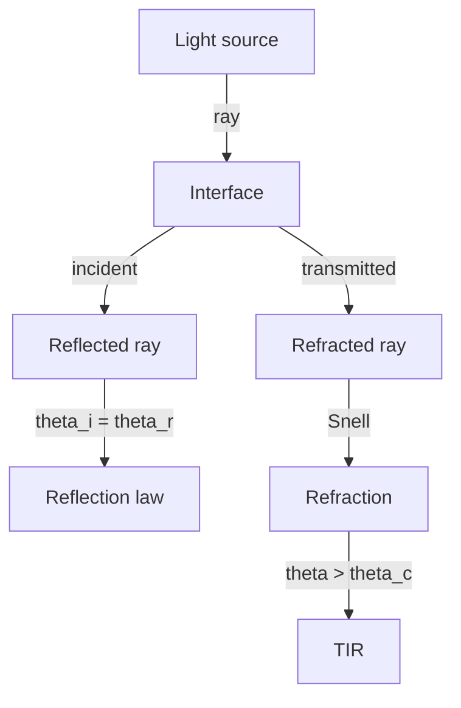
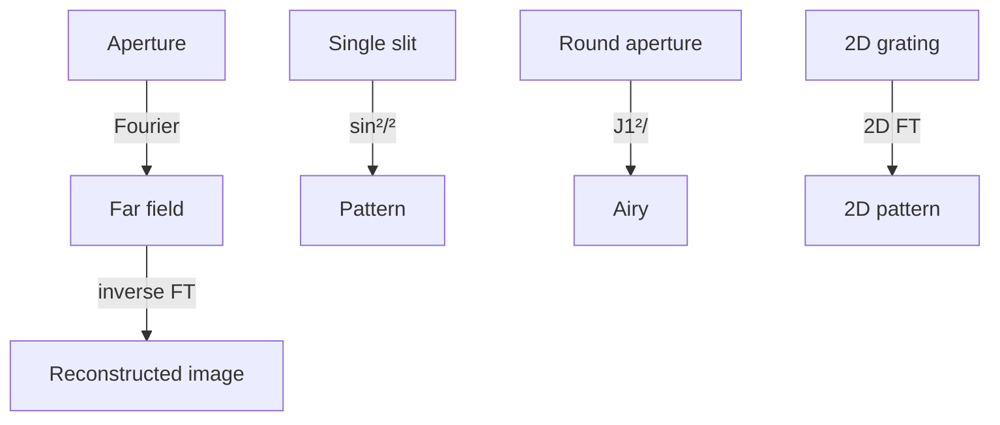
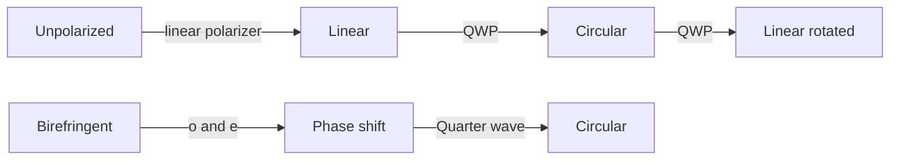
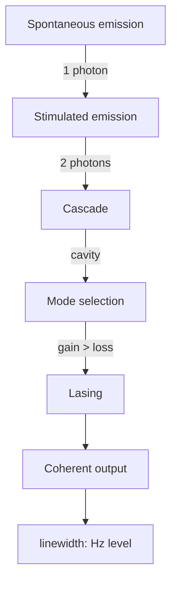
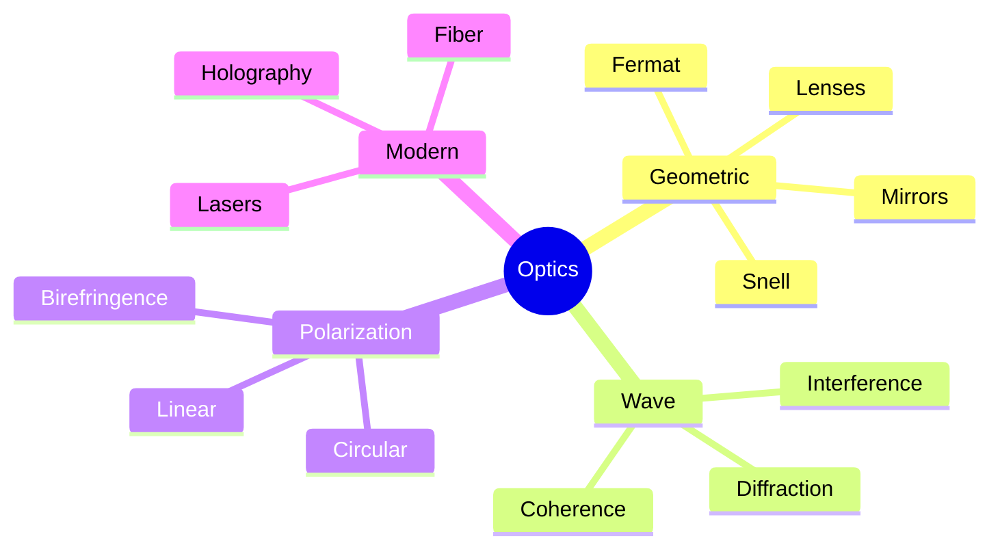
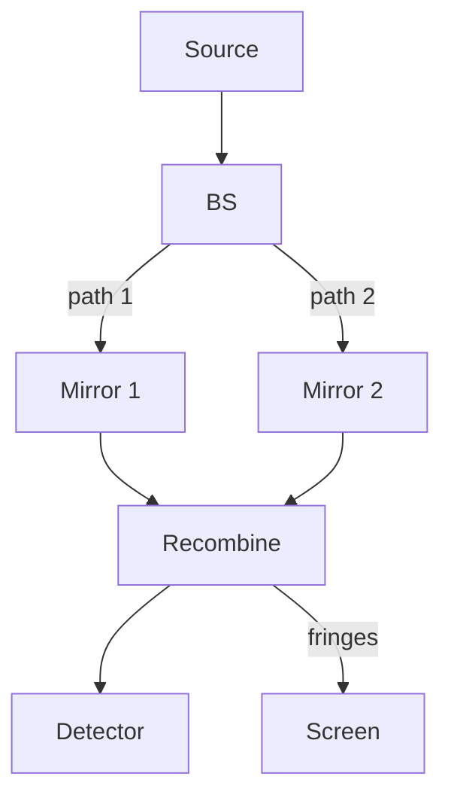
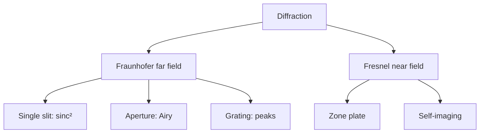
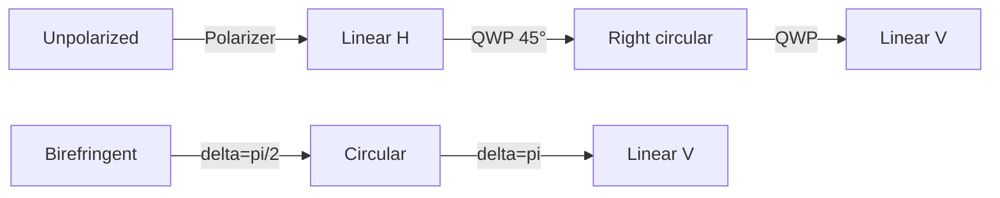
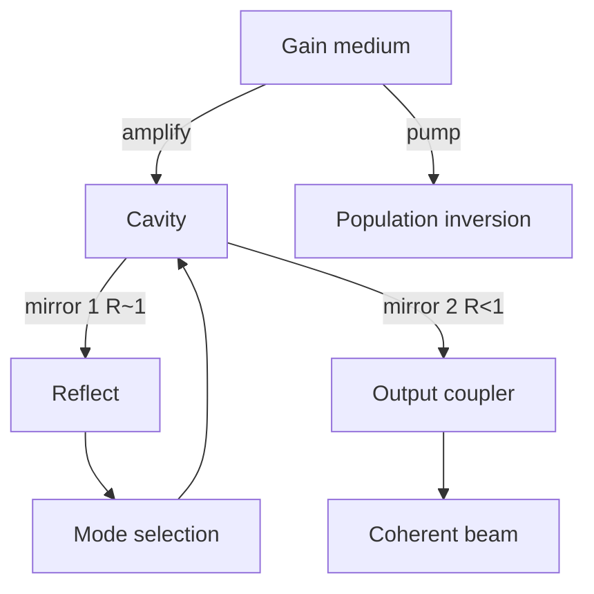

# PHYS 3038 — Optics
> **Phase 1 BSc Core | HKUST PHYS 3038 | Geometric, Wave, Modern Optics**  
> **Bilingual 深度自學檔案 · 中英對照**

---

## 問題 1：5 個核心心智模型

1. **Huygens-Fresnel principle** — 每點都係 secondary wavelet, total field = sum
2. **Fermat's principle** — light takes extremal path ($\delta t = 0$)
3. **Interference = superposition** — coherent waves add: $I = I_1 + I_2 + 2\sqrt{I_1 I_2}\cos\delta$
4. **Diffraction = Fourier optics** — aperture = Fourier transform of field
5. **Polarization** — transverse wave with 2D state (Jones/Stokes vector)

---

## 問題 2：3 個根本分歧
1. **Newton corpuscles vs Huygens waves** — particle vs wave (solved by QM duality)
2. **Ether vs relativity** — needed medium vs no medium
3. **Geometric vs wave optics** — ray vs field

---

## 問題 3：10 個深度問題
1. 為什麼 thin lens formula $1/s + 1/s' = 1/f$?
2. Derive double-slit fringe spacing $\Delta y = \lambda L/d$.
3. 給定 single slit, derive diffraction pattern $I(\theta) = I_0 (\sin\beta/\beta)^2$, $\beta = (\pi a/\lambda)\sin\theta$。
4. 為什麼 diffraction grating 解析度 $R = mN$, with $N$ 為 slits?
5. 給定 NA, derive diffraction limit $\Delta x = 0.61\lambda/NA$ (Airy disk).
6. 為什麼 quarter-wave plate 將 linear → circular polarization?
7. 解釋為什麼 coherence length 對干涉重要。
8. 給定 birefringent crystal, derive ordinary/extraordinary indices。
9. 為什麼 laser 嘅 linewidth 極窄 (Hz-level)?
10. 解釋 confocal microscopy 點樣 sub-diffraction imaging 通過 pinhole rejection。

---

## 深入 1：Geometric Optics
**Deep Dive I**

Fermat: $\delta \int n \, ds = 0$. Snell's law $n_1 \sin\theta_1 = n_2 \sin\theta_2$, total internal reflection at $\theta_c = \arcsin(n_2/n_1)$.



**Engineering:** Lens design, fiber optics, AR/VR.

---

## 深入 2：Interference
**Deep Dive II**

Two-beam interference: $I = 4I_0 \cos^2(\delta/2)$, $\delta = (2\pi/\lambda)\Delta$. Michelson, Mach-Zehnder, Sagnac interferometers.

```mermaid
flowchart TD
    A[Coherent source] -->|beam splitter| B1[Path 1]
    A -->|beam splitter| B2[Path 2]
    B1 --> C[Recombine]
    B2 --> C
    C --> D[Fringe pattern]
    D --> E{Path difference?}
    E -->|m lambda| F[Bright]
    E -->|(m+1/2) lambda| G[Dark]
```

**Engineering:** LIGO, fiber sensors, spectroscopy.

---

## 深入 3：Diffraction & Fourier Optics
**Deep Dive III**

Fraunhofer: field in focal plane = Fourier transform of aperture field. $U(x', y') \propto \mathcal{F}\{U(x, y)\}$.



**Engineering:** Telescope resolution, lithography, holography.

---

## 深入 4：Polarization
**Deep Dive IV**

Jones vector for fully polarized: $\vec E = (E_x e^{i\phi_x}, E_y e^{i\phi_y})^T$. Stokes: $(I, Q, U, V)$ for partial.



**Engineering:** LCD displays, optical isolators, polarimetry.

---

## 深入 5：Coherence & Lasers
**Deep Dive V**

Temporal coherence: $\tau_c$, $l_c = c\tau_c$. Spatial: $A_c \propto \lambda^2/(\Delta\theta)^2$. Laser: stimulated emission, cavity modes.



**Engineering:** Telecom, lidar, spectroscopy, surgery.

---

## 自測 1：Lens formula
**Answer:** $1/s + 1/s' = 1/f$ from matrix optics or Gaussian lens formula.  
**Engineering:** Camera, microscope design.

## 自測 2：Double-slit spacing
**Answer:** $\Delta y = \lambda L/d$, $d$ slit separation.  
**Engineering:** Wavelength measurement, Young's experiment.

## 自測 3：Airy disk
**Answer:** First zero at $\theta = 1.22\lambda/D$, $D$ aperture.  
**Engineering:** Telescope resolution, microscope NA.

## 自測 4：Quarter-wave plate
**Answer:** Phase shift $\pi/2$ between fast/slow axes.  
**Engineering:** Circular polarizer, optical isolator.

## 自測 5：Coherence length
**Answer:** $l_c = c/\Delta\nu$, $\Delta\nu$ linewidth. For laser: km; for LED: $\mu$m.  
**Engineering:** Interferometry design.

## 自測 6：Fermat's principle
**Answer:** Extremal optical path: $\delta \int n \, ds = 0$.  
**Engineering:** Lens design, GRIN optics.

## 自測 7：Diffraction grating
**Answer:** $d\sin\theta_m = m\lambda$, $R = mN$.  
**Engineering:** Spectrometer, monochromator.

## 自測 8：Numerical aperture
**Answer:** $NA = n\sin\theta$, $\Delta x = 0.61\lambda/NA$.  
**Engineering:** Confocal, two-photon microscopy.

## 自測 9：Optical activity
**Answer:** Rotation $\alpha = [\alpha] c l$, specific rotation.  
**Engineering:** Sugar concentration, chirality.

## 自測 10：Holography
**Answer:** Record interference of object + reference beam, reconstruct with reference.  
**Engineering:** 3D imaging, security, data storage.

---

## 📊 Diagram 1: Optics Tree


## 📊 Diagram 2: Interference Setup


## 📊 Diagram 3: Diffraction Types


## 📊 Diagram 4: Polarization States


## 📊 Diagram 5: Laser Cavity


---

## 深度總結 Deep Insights

1. **Light is EM wave** — Maxwell's prediction, Hertz's confirmation.
2. **Fermat unifies geometric & wave** — extremal principle = path of constructive interference.
3. **Diffraction = Fourier transform** — spatial frequency domain.
4. **Coherence distinguishes laser from LED** — temporal + spatial.
5. **Polarization = 2D state** — Jones, Stokes, Poincaré sphere.

---

**自學建議** — Hecht "Optics" + Born & Wolf. MIT OCW 8.03.
