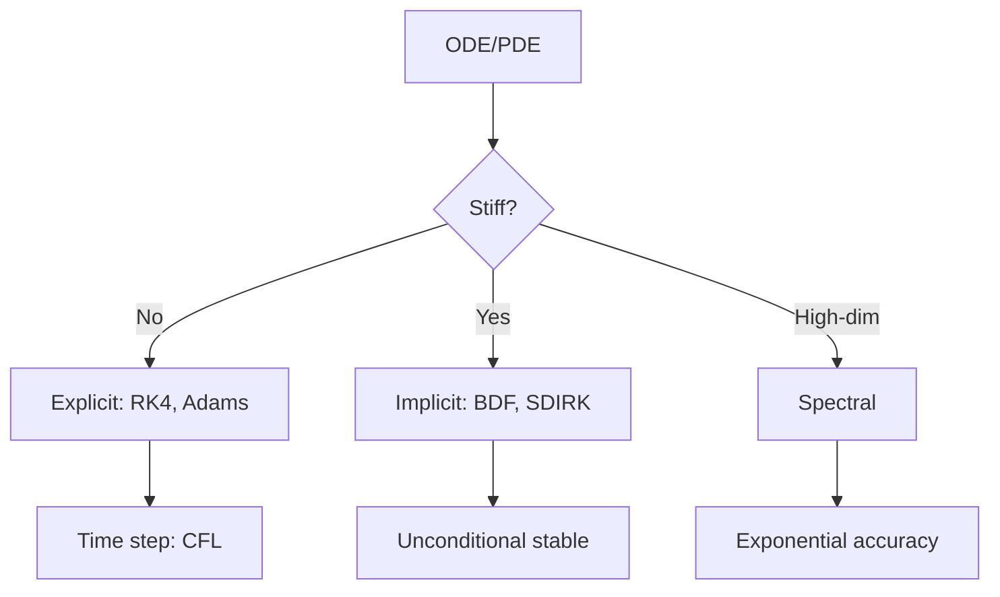
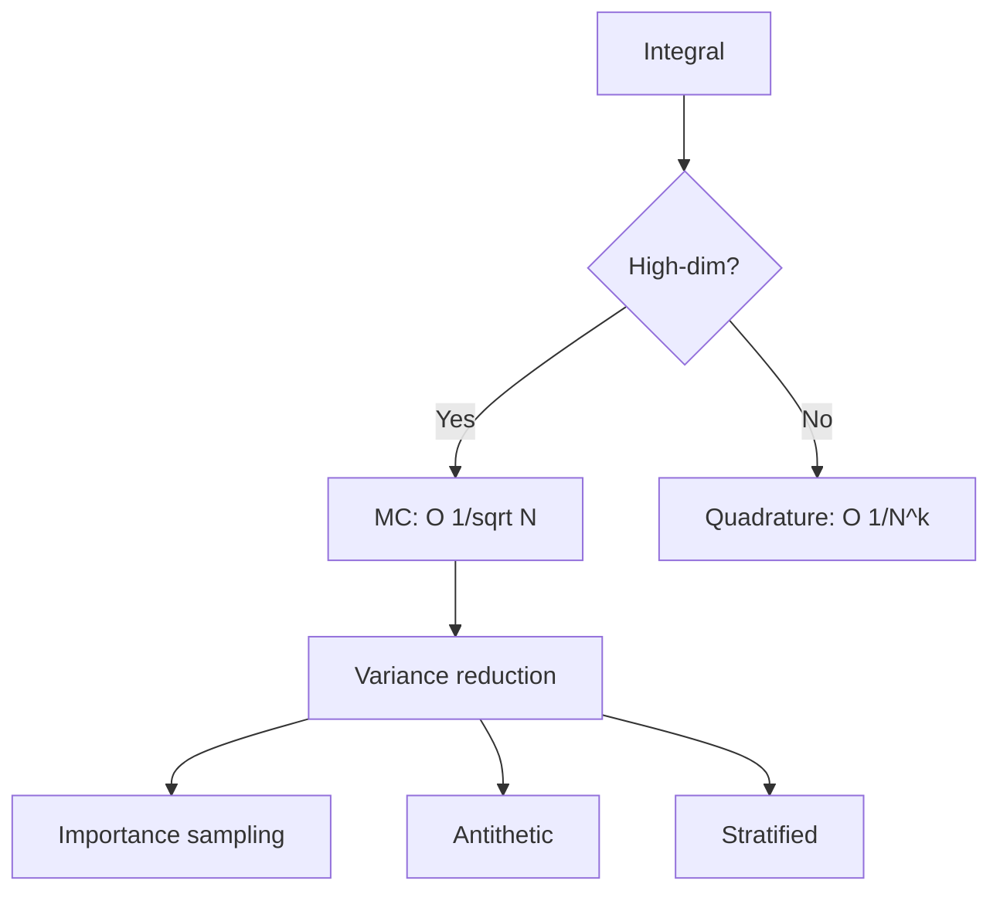
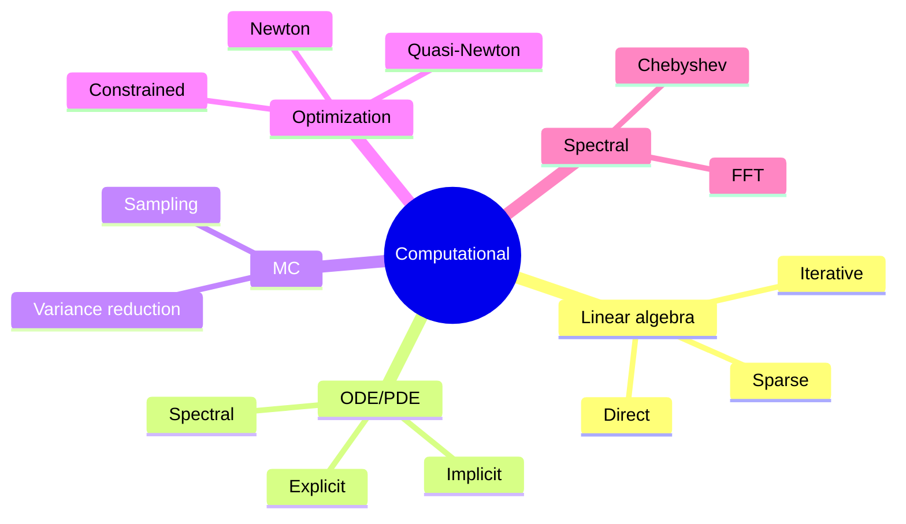
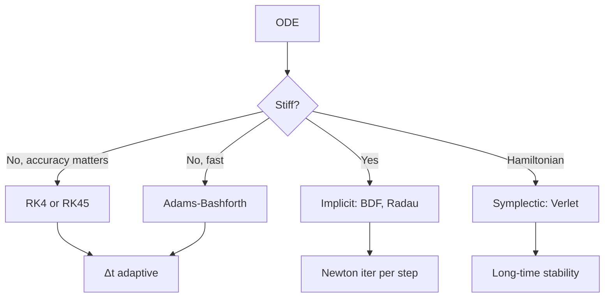
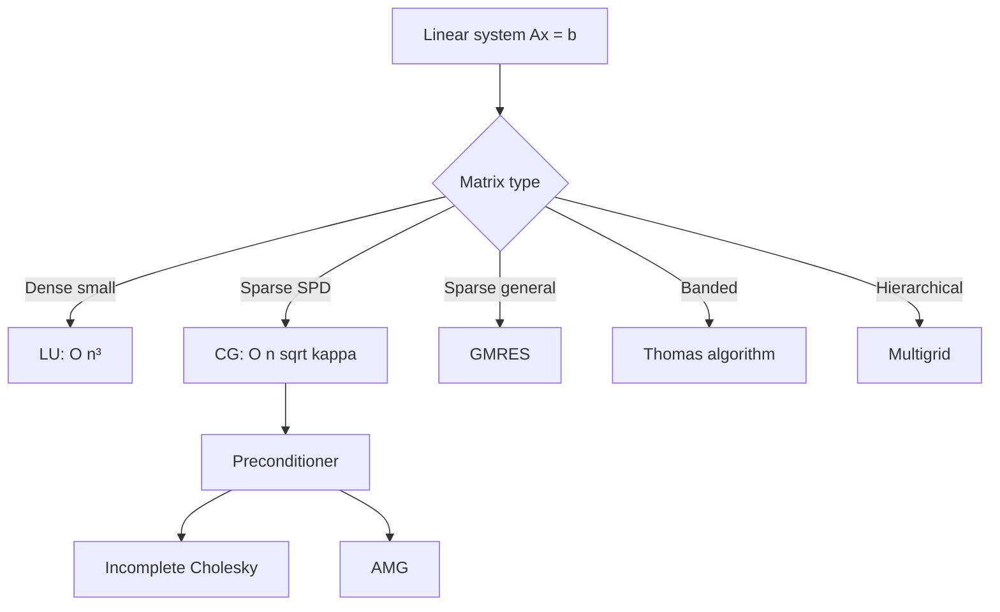
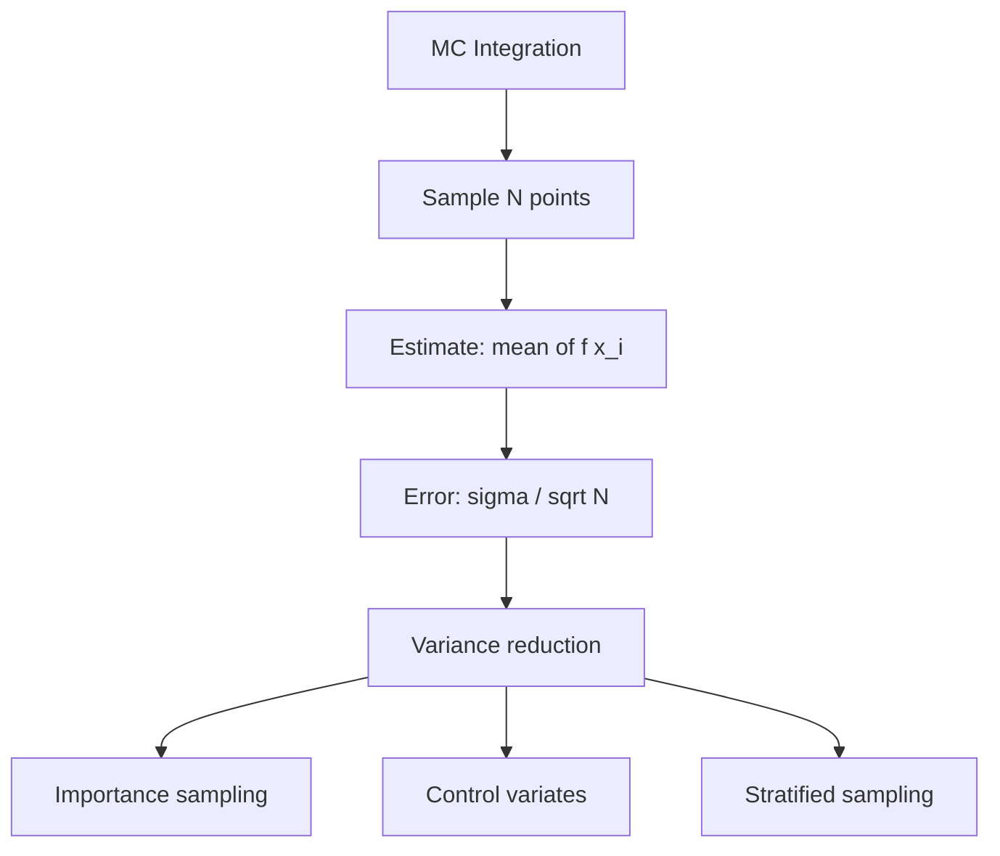
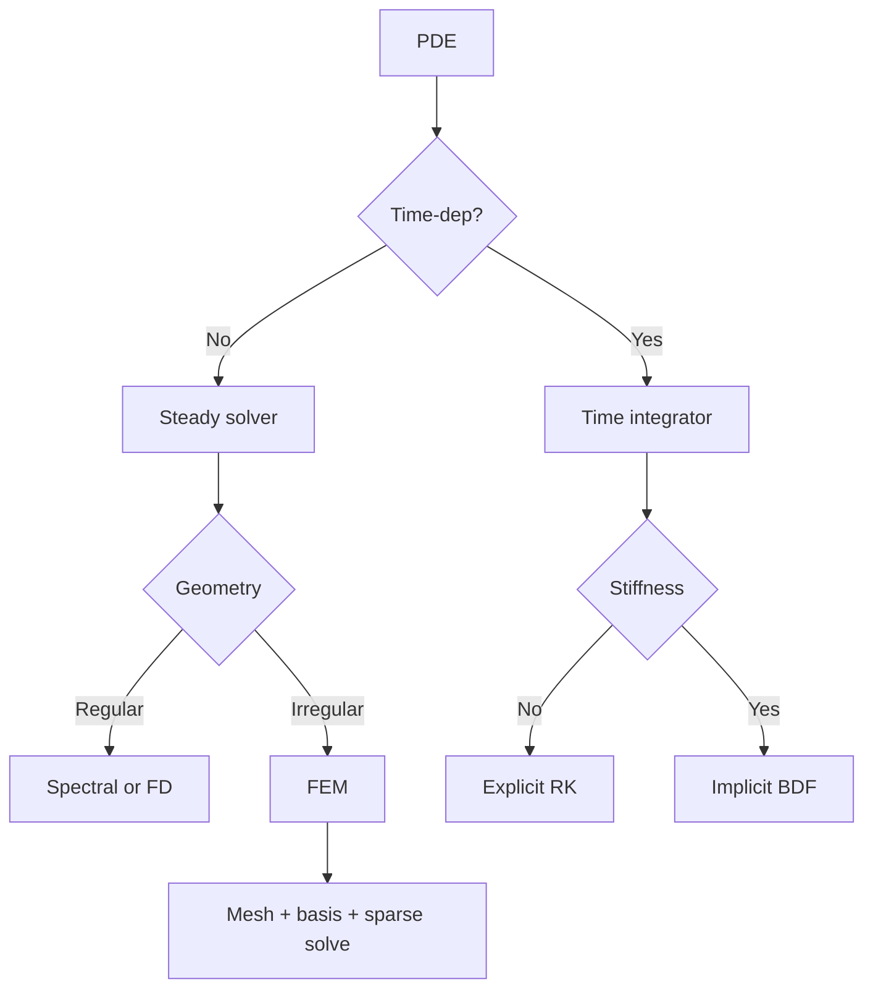

# PHYS 3142 — Computational Methods
> **Phase 1 BSc Core | HKUST PHYS 3142 | Numerical Analysis, Simulation, Scientific Computing**  
> **Bilingual 深度自學檔案 · 中英對照**

---

## 問題 1：5 個核心心智模型

1. **Discretization** — continuous → discrete (FD, FE, spectral)
2. **Error analysis** — round-off, truncation, convergence order
3. **Linear algebra = backbone** — solve $A\vec x = \vec b$, eigenvalues, SVD
4. **ODE/PDE integrators** — explicit/implicit, stability, CFL
5. **Monte Carlo = sampling** — high-dim integration via random points

---

## 問題 2：3 個根本分歧
1. **Analytical vs numerical** — exact closed form vs approximate computation
2. **High-order vs low-order methods** — spectral vs finite difference
3. **Deterministic vs stochastic** — Newton's method vs MCMC

---

## 問題 3：10 個深度問題
1. 為什麼 Euler method 對 stiff ODE unstable, 而 implicit Euler stable?
2. 給定 $f(x) = e^x$, derive Taylor series truncation error 對 different orders.
3. 解釋為什麼 Gauss elimination $O(n^3)$ 但 Conjugate Gradient $O(n)$ for sparse SPD。
4. 給定 PDE $\partial_t u = D \nabla^2 u$, derive stability condition for explicit FTCS。
5. 為什麼 Monte Carlo error $\propto 1/\sqrt N$ independent of dimension?
6. 解釋為什麼 Newton's method quadratic convergence near root, but fails far away。
7. 給定 Richardson extrapolation, 解釋點樣 提升 accuracy 一個 order。
8. 為什麼 finite difference for advection 對 high Pé unstable (Godunov theorem)?
9. 解釋 Krylov subspace methods (CG, GMRES) 對 large sparse systems 嘅 role。
10. 給定 stiff system $y' = -1000y$, derive implicit Euler stability。

---

## 深入 1：Numerical ODE/PDE
**Deep Dive I**

**Engineering:** Orbit propagation, chemical kinetics, climate.

---

## 深入 2：Linear Algebra Solvers
**Deep Dive II**

| Method | Use | Complexity |
|---|---|---|
| Direct (LU) | Dense | $O(n^3)$ |
| Iterative (CG) | Sparse SPD | $O(n \sqrt{\kappa})$ |
| GMRES | Sparse general | $O(n^2)$ per iter |
| Multigrid | PDEs | $O(n)$ |

**Engineering:** FEA, structural, CFD, circuit.

---

## 深入 3：Monte Carlo
**Deep Dive III**

For $I = \int f(x) dx$, sample $N$ points: $I \approx (V/N) \sum f(x_i)$, error $\sigma/\sqrt N$.

**Engineering:** Finance, particle transport, statistical mechanics.

---

## 深入 4：Root Finding & Optimization
**Deep Dive IV**

Newton: $x_{n+1} = x_n - f(x_n)/f'(x_n)$, quadratic convergence. BFGS: quasi-Newton for high-dim.

**Engineering:** Engineering design, ML training, control.

---

## 深入 5：FFT & Spectral Methods
**Deep Dive V**

FFT: $O(N \log N)$ vs DFT $O(N^2)$. Spectral methods: $u(x) = \sum \hat u_k e^{ikx}$, exact for smooth solutions.

**Engineering:** Signal processing, PDE solver, audio/video.

---

## 自測 1：Euler stability
**Answer:** $y' = \lambda y$, explicit Euler stable if $\Delta t |\lambda| < 2$.  
**Engineering:** ODE integrator choice.

## 自測 2：CG convergence
**Answer:** CG converges in $\sqrt{\kappa(A)}$ iterations for SPD $A$.  
**Engineering:** Preconditioned CG for FEA.

## 自測 3：MC error
**Answer:** $\sigma = \sigma_f / \sqrt N$, independent of dimension.  
**Engineering:** High-dim finance, QFT.

## 自測 4：Newton convergence
**Answer:** Quadratic: $|x_{n+1} - x^*| \leq C |x_n - x^*|^2$.  
**Engineering:** Root finding, optimization.

## 自測 5：FTCS stability
**Answer:** $D \Delta t / \Delta x^2 \leq 0.5$ for stability.  
**Engineering:** Heat equation solver.

## 自測 6：Bisection
**Answer:** Halve interval each step, $O(\log(b-a)/\epsilon)$ for $\epsilon$ tolerance.  
**Engineering:** Robust root finding.

## 自測 7：Trapezoidal vs Simpson
**Answer:** Trapezoidal: $O(h^2)$, Simpson: $O(h^4)$.  
**Engineering:** Quadrature choice.

## 自測 8：SVD for least squares
**Answer:** $A = U\Sigma V^T$, $x = V \Sigma^{-1} U^T b$ for min $\|Ax - b\|$.  
**Engineering:** Linear regression, PCA, image compression.

## 自測 9：Stiff system detection
**Answer:** Eigenvalues span many orders: max/min > 1000.  
**Engineering:** Choose implicit integrator.

## 自測 10：Spectral accuracy
**Answer:** $N$-term Fourier: error $\propto e^{-cN}$ for smooth, $\propto N^{-k}$ for $C^k$.  
**Engineering:** Spectral element methods.

---

## 📊 Diagram 1: Computational Methods Map

## 📊 Diagram 2: ODE Integrator Choice

## 📊 Diagram 3: Linear Algebra Solver Tree

## 📊 Diagram 4: MC Convergence

## 📊 Diagram 5: PDE Solver Selection

---

## 深度總結 Deep Insights

1. **Numerical analysis is about error** — round-off, truncation, discretization all matter.
2. **Stability vs accuracy trade-off** — implicit methods stable but expensive.
3. **Linear algebra is everywhere** — sparse direct/iterative are workhorses.
4. **MC beats quadrature in high-D** — curse of dimensionality broken.
5. **Spectral methods win for smooth** — exponential vs polynomial accuracy.

---

**自學建議** — Numerical Recipes + Trefethen spectral methods. MIT OCW 18.330.
