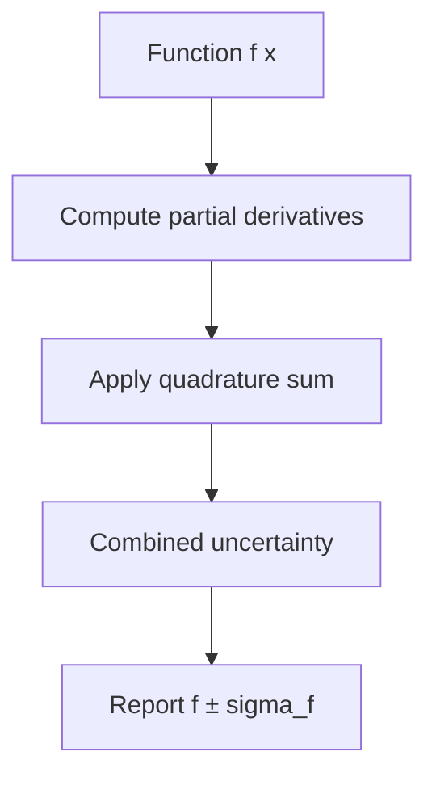
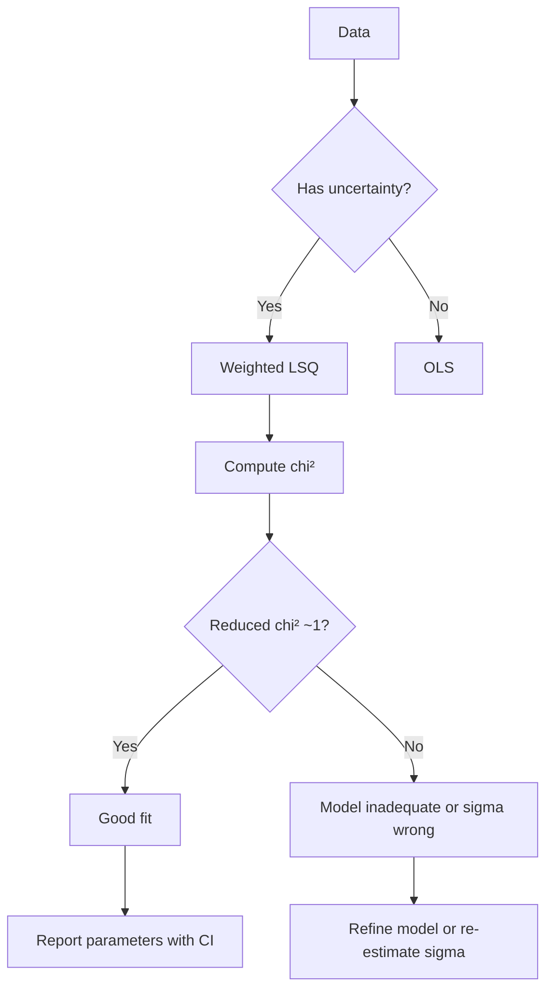
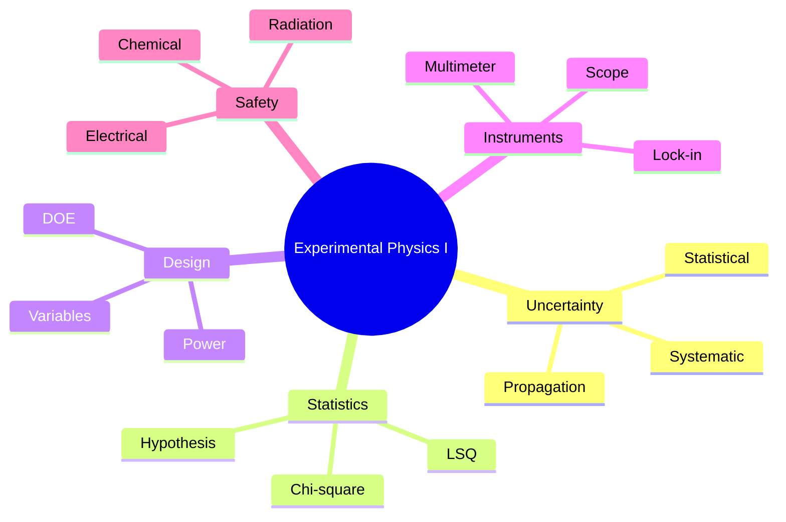
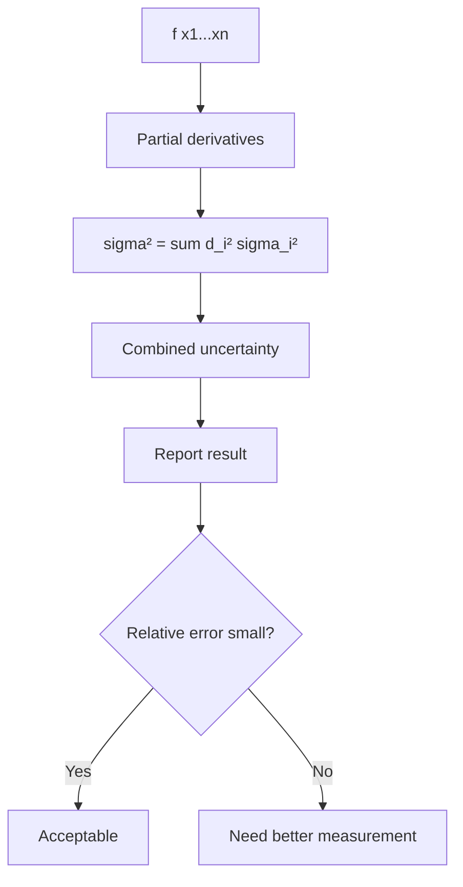
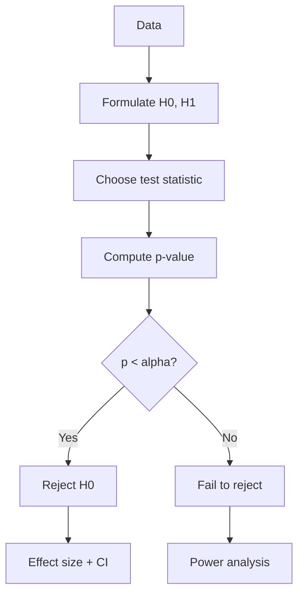
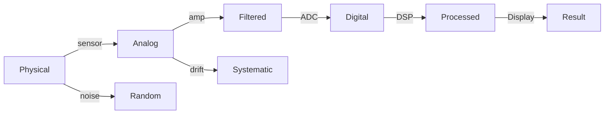
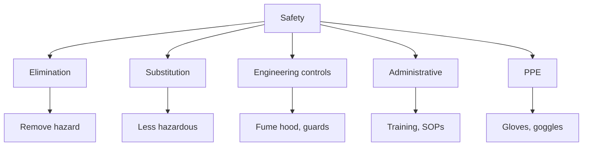

# PHYS 3152 — Experimental Physics I
> **Phase 1 BSc Core | HKUST PHYS 3152 | Measurement, Uncertainty, Data Analysis, Lab Skills**  
> **Bilingual 深度自學檔案 · 中英對照**

---

## 問題 1：5 個核心心智模型

1. **All measurements have uncertainty** — never a single value, always $\pm$
2. **Systematic vs random errors** — bias vs scatter
3. **Statistics = signal + noise** — distinguish via repeated measurements
4. **Calibration = anchor** — known reference ties to SI units
5. **Documentation = reproducibility** — every step recorded

---

## 問題 2：3 個根本分歧
1. **Frequentist vs Bayesian** — p-values vs posterior
2. **Single measurement vs repeated** — information theory
3. **Heuristic vs rigorous** — engineering judgment vs formal statistics

---

## 問題 3：10 個深度問題
1. 為什麼 $N$ 個 measurements 嘅 mean error $\sigma/\sqrt N$ 而唔係 $\sigma/N$?
2. 給定 histogram, derive Poisson distribution 對 low-count data。
3. 為什麼 least-squares fitting minimize $\chi^2$ 對 Gaussian noise?
4. 解釋為什麼 systematic errors 唔 reduce with averaging。
5. 給定兩個 uncertainties $\sigma_1, \sigma_2$, derive $\sigma_{sum} = \sqrt{\sigma_1^2 + \sigma_2^2}$。
6. 為什麼 5σ threshold for particle discovery?
7. 解釋為什麼 weighted mean 嘅 weight $\propto 1/\sigma^2$。
8. 給定 calibration data, derive linear regression 嘅 slope + uncertainty。
9. 為什麼 lab notebook 必須 pen-on-paper (or signed PDF)?
10. 解釋 4-wire measurement 點樣 eliminate lead resistance。

---

## 深入 1：Uncertainty Propagation
**Deep Dive I**

For $f(x_1, ..., x_n)$ with uncertainties $\sigma_i$: $\sigma_f^2 = \sum (\partial f/\partial x_i)^2 \sigma_i^2$.

**Engineering:** Metrology, manufacturing tolerance, scientific measurement.

---

## 深入 2：Statistical Methods
**Deep Dive II**

$\chi^2$ test: $\chi^2 = \sum (y_i - f(x_i))^2/\sigma_i^2$. Reduced $\chi^2 \approx 1$ for good fit.

**Engineering:** Calibration, model validation, hypothesis test.

---

## 深入 3：Experimental Design
**Deep Dive III**

DOE: control variables, randomization, replication. Power analysis: detect effect of size $d$ with power $1-\beta$ requires $n = (z_\alpha + z_\beta)^2 \sigma^2 / d^2$ per group.

**Engineering:** A/B testing, clinical trials, scientific experiments.

---

## 深入 4：Instrumentation
**Deep Dive IV**

Voltmeter, oscilloscope, lock-in amplifier, spectrum analyzer. SNR: $20\log_{10}(V_s/V_n)$ dB.

**Engineering:** Sensor design, signal conditioning, data acquisition.

---

## 深入 5：Lab Safety & Documentation
**Deep Dive V**

Electrical (high voltage, capacitor discharge), chemical (fume hood, MSDS), mechanical (rotating equipment, pressure), radiation (dosimetry).

**Engineering:** All lab and field work.

---

## 自測 1：Mean error
**Answer:** $\sigma_{\bar x} = \sigma/\sqrt N$ from CLT.  
**Engineering:** Survey, quality control.

## 自測 2：Why $\chi^2$
**Answer:** MLE for Gaussian noise.  
**Engineering:** Curve fitting, spectroscopy.

## 自測 3：Why 5σ
**Answer:** Gaussian tail, $p \sim 10^{-7}$ for one-sided, controls false discovery.  
**Engineering:** Particle physics (e.g., Higgs).

## 自測 4：Systematic error
**Answer:** Bias, doesn't average down. Calibration error, mis-zero.  
**Engineering:** Avoid via calibration.

## 自測 5：4-wire
**Answer:** Separate current and voltage leads, lead $R$ doesn't enter measurement.  
**Engineering:** Precision resistance, RTD, strain gauge.

## 自測 6：Lock-in
**Answer:** Phase-sensitive detection, recovers signal at known $f$ from noise.  
**Engineering:** Weak spectroscopy (e.g., AFM).

## 自測 7：Sampling theorem
**Answer:** Sample at $f_s > 2 f_{max}$ to avoid aliasing.  
**Engineering:** ADC, audio, video.

## 自測 8：FFT
**Answer:** $O(N \log N)$ DFT, reveals frequency content.  
**Engineering:** Vibration analysis, audio.

## 自測 9：Grounding
**Answer:** Star ground, avoid ground loops (50/60 Hz interference).  
**Engineering:** Audio, instrumentation.

## 自測 10：Notebook
**Answer:** Legal record, signed, dated, error-correction protocol.  
**Engineering:** Patent defense, scientific integrity.

---

## 📊 Diagram 1: Experimental Physics Map

## 📊 Diagram 2: Error Propagation

## 📊 Diagram 3: Hypothesis Test

## 📊 Diagram 4: Instrument Signal Chain

## 📊 Diagram 5: Lab Safety Hierarchy

---

## 深度總結 Deep Insights

1. **Uncertainty is fundamental** — single number, no error, is meaningless.
2. **Statistics separates signal from noise** — repeated measurement + analysis.
3. **Calibration is everything** — trace to SI.
4. **Systematic > random** — must identify and remove.
5. **Documentation = reproducibility** — the "write it down" rule.

---

**自學建議** — Taylor "An Introduction to Error Analysis". Bevington & Robinson.
