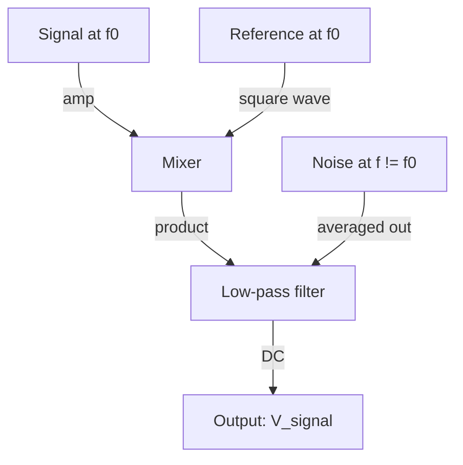
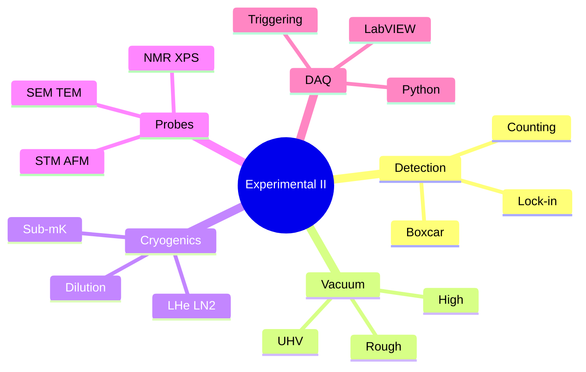
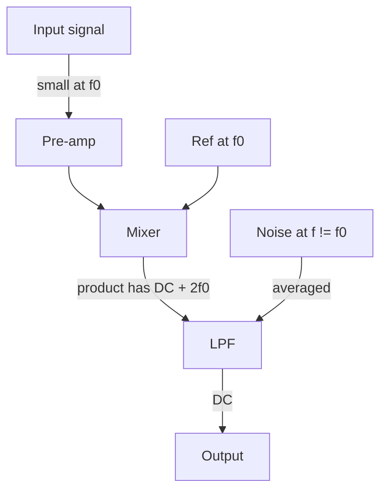
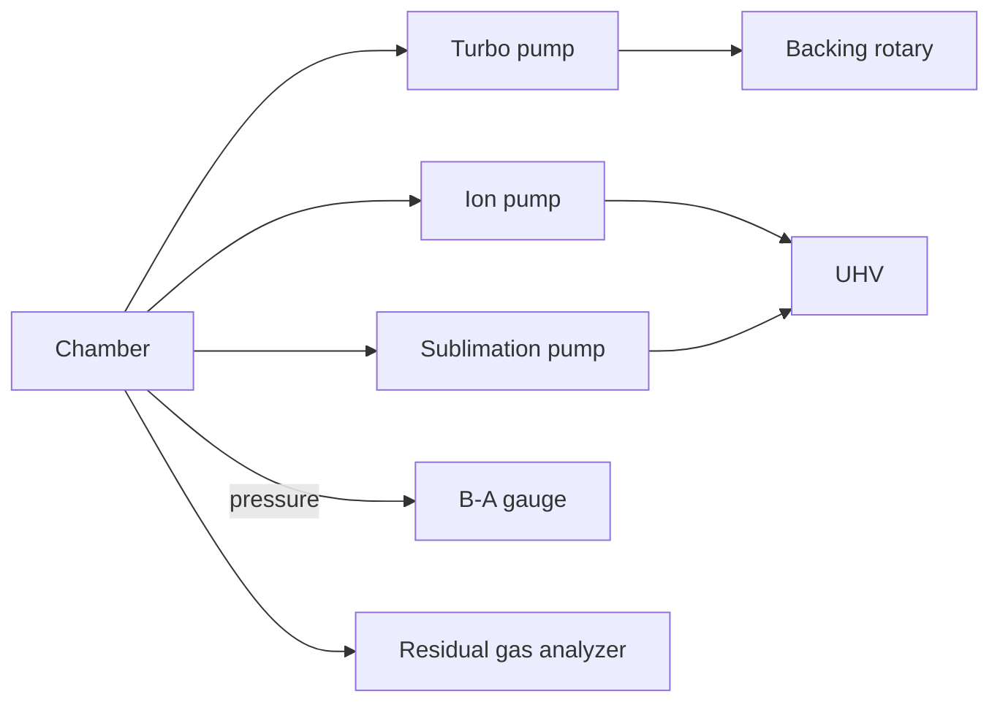
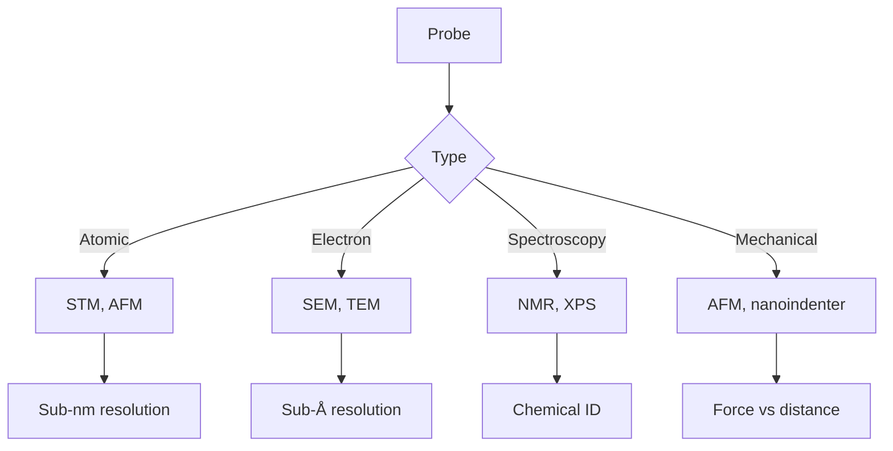

# PHYS 3153 — Experimental Physics II
> **Phase 1 BSc Core | HKUST PHYS 3153 | Advanced Lab, Modern Experiments, Data Acquisition**  
> **Bilingual 深度自學檔案 · 中英對照**

---

## 問題 1：5 個核心心智模型

1. **Lock-in detection** — phase-sensitive at known frequency
2. **Vacuum technology** — turbomolecular, ion pumps, ultra-high vacuum
3. **Cryogenics** — liquid He/N₂, dilution refrigerators
4. **Data acquisition** — LabVIEW, Python, real-time
5. **Modern physics experiments** — STM, AFM, NMR, muon spin rotation

---

## 問題 2：3 個根本分歧
1. **Analog vs digital** — old analog scopes vs modern digitizers
2. **Closed vs open source** — LabVIEW vs Python
3. **Macroscopic vs microscopic probes** — bulk vs atomic resolution

---

## 問題 3：10 個深度問題
1. 給定 SR830 lock-in, derive SNR improvement over wideband detection.
2. 為什麼 cryopumping 對 UHV effective than sorption?
3. 給定 STM, derive tunneling current $I \propto e^{-2\kappa L}$ relationship to gap.
4. 為什麼 AFM cantilevers have $Q \sim 10^3$ in air but $10^5$ in vacuum?
5. 解釋 NMR 嘅 Larmor frequency $\omega = \gamma B_0$ derivation.
6. 給定 Mössbauer spectrum, derive isomer shift 對 chemical state。
7. 為什麼 dilution refrigerator 達到 mK while pumped He-4 只能到 ~1K?
8. 解釋 why quadrupole mass spectrometer 嘅 resolution limited。
9. 給定 lab setup, design Python DAQ pipeline with real-time plotting。
10. 為什麼 Faraday cage + ground loop 重要 for low-noise measurement?

---

## 深入 1：Lock-in Amplifier
**Deep Dive I**

Mix signal with reference at $\omega_{ref}$, low-pass filter. Output $\propto$ signal amplitude at $\omega_{ref}$.

**Engineering:** Weak spectroscopy, STM, AFM.

---

## 深入 2：Vacuum Technology
**Deep Dive II**

| Regime | Pressure (Torr) | Pump |
|---|---|---|
| Rough | $10^{-3}$ | Rotary, scroll |
| High vacuum | $10^{-6}$ | Turbomolecular, diffusion |
| UHV | $10^{-10}$ | Ion, NEG, TSP |

**Engineering:** Semiconductor, particle physics, surface science.

---

## 深入 3：Cryogenics
**Deep Dive III**

LHe at 4.2 K, LHe-4 pumped to 1 K, dilution refrigerator to 10 mK. Specific heat, thermal conductivity, Kapitza resistance at low T.

**Engineering:** Superconducting magnets, quantum computing, astrophysics detectors.

---

## 深入 4：Modern Probes
**Deep Dive IV**

STM (atomic), AFM (mechanical), SEM (electron), TEM (atomic + diffraction), NMR (chemical), XPS (surface composition).

**Engineering:** Materials science, biology, nanotechnology.

---

## 深入 5：Data Acquisition
**Deep Dive V**

Python + NumPy + PyDAQmx + matplotlib, or LabVIEW. Real-time streaming, triggering, file formats (HDF5, NetCDF).

**Engineering:** Experiment automation, industry 4.0, IoT.

---

## 自測 1：Lock-in SNR
**Answer:** $SNR_{out} = SNR_{in} \sqrt{f_{BW, in}/f_{LPF}}$.  
**Engineering:** Sensitive detection.

## 自測 2：Turbomolecular pump
**Answer:** $N_2$ pumping speed, compression ratio $\sim 10^9$ for H₂.  
**Engineering:** UHV design.

## 自測 3：STM resolution
**Answer:** Atomic, limited by tip sharpness + vibration isolation.  
**Engineering:** Atomic-resolution imaging.

## 自測 4：Dilution refrigerator
**Answer:** He-3/He-4 phase separation, osmotic cooling to mK.  
**Engineering:** Quantum computer base temperature.

## 自測 5：Larmor frequency
**Answer:** $\omega = \gamma B_0$, $\gamma$ gyromagnetic ratio.  
**Engineering:** NMR, MRI, atomic clocks.

## 自測 6：AFM cantilever
**Answer:** $f_0 = (1/2\pi)\sqrt{k/m}$, Q from material + environment.  
**Engineering:** AFM design, force sensing.

## 自測 7：XPS binding energy
**Answer:** $E_B = h\nu - E_{kinetic} - \phi$, identifies elements.  
**Engineering:** Surface chemistry.

## 自測 8：Mass spec resolution
**Answer:** $m/\Delta m$ for adjacent peaks. Quadrupole: 1000; FT-ICR: $10^6$.  
**Engineering:** Chemistry, isotope analysis.

## 自測 9：DAQ rate
**Answer:** Nyquist: $f_s > 2 f_{max}$, plus headroom.  
**Engineering:** Sampling design.

## 自測 10：Faraday cage
**Answer:** Closed conductor, $\vec E = 0$ inside, blocks EM interference.  
**Engineering:** EMI shielding, sensitive measurement.

---

## 📊 Diagram 1: Experimental Physics II Map

## 📊 Diagram 2: Lock-in Detection

## 📊 Diagram 3: Vacuum System

## 📊 Diagram 4: Cryogenic Stages

```mermaid
graph TD
    A[Room T 300K] -->|LHe| B[4.2K]
    B -->|pumped| C[1.5K]
    C -->|dilution| D[10 mK]
    D -->|nuclear demag| E[uK]
    style B fill:#87ceeb
    style C fill:#4682b4
    style D fill:#1e3a8a
    style E fill:#000033
```

## 📊 Diagram 5: Probe Comparison

---

## 深度總結 Deep Insights

1. **Lock-in = phase detection** — extract signal at known frequency.
2. **UHV = clean surface** — pressure × time = monolayers.
3. **Dilution = mK** — quantum-limited measurements require.
4. **Modern probes = atomic resolution** — STM, AFM, TEM.
5. **DAQ = automation** — Python + LabVIEW, real-time.

---

**自學建議** — Dunlap "Experimental Physics" + Melissinos. Various lab manuals.
