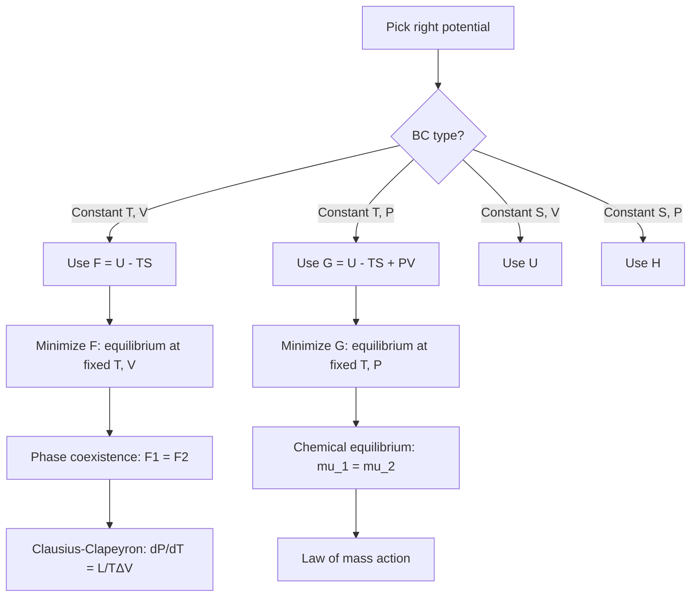
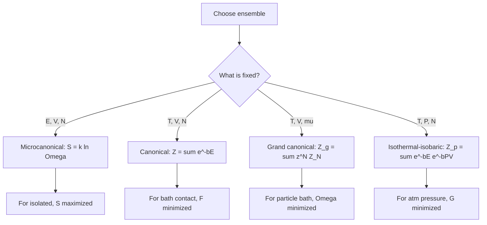
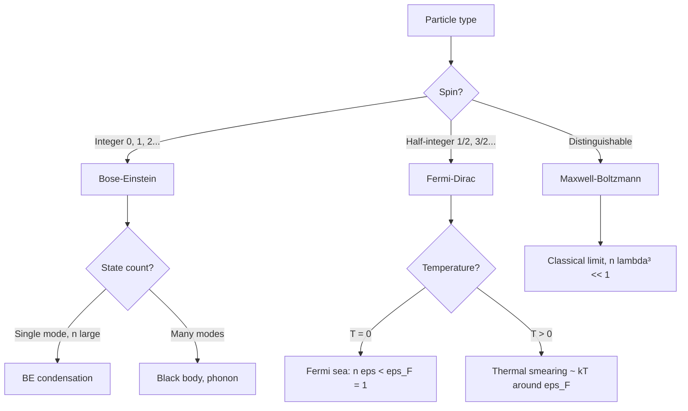
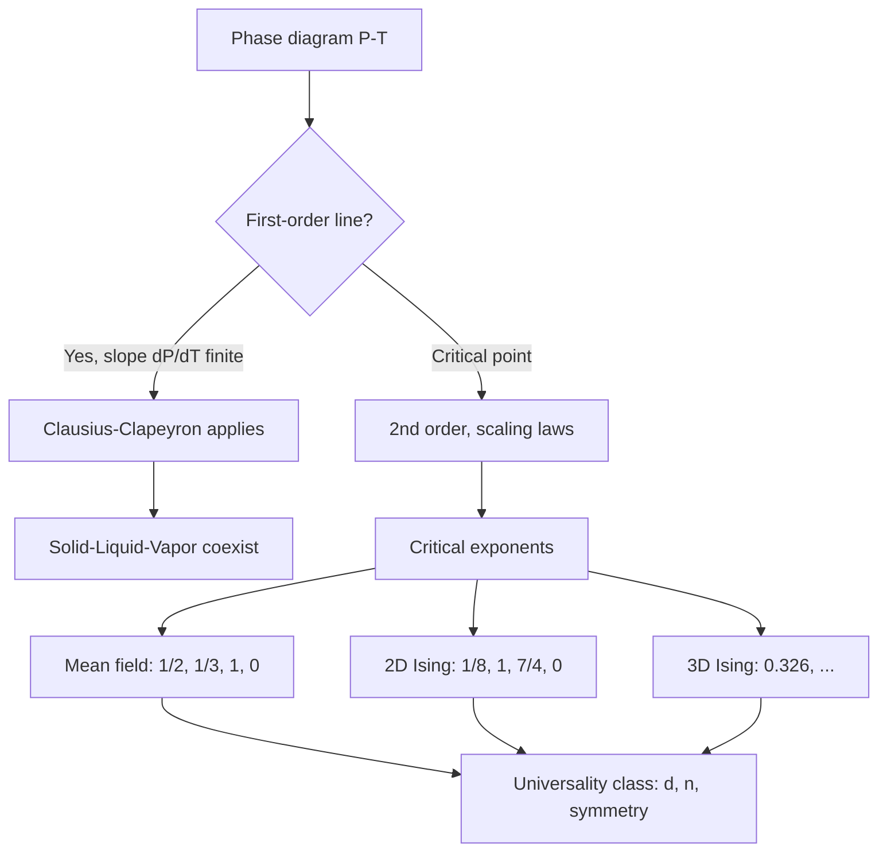
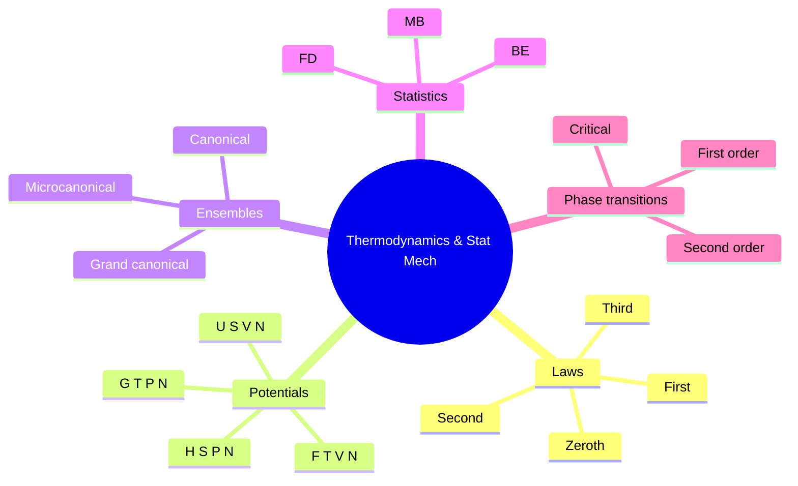
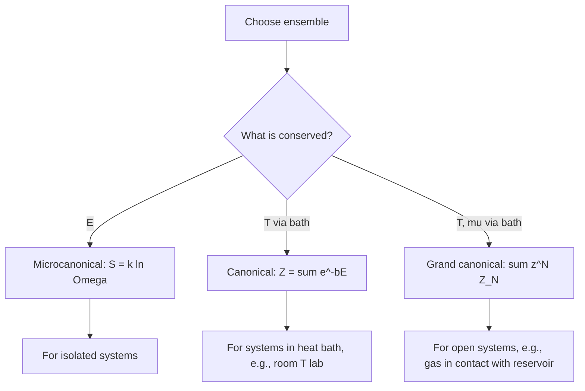
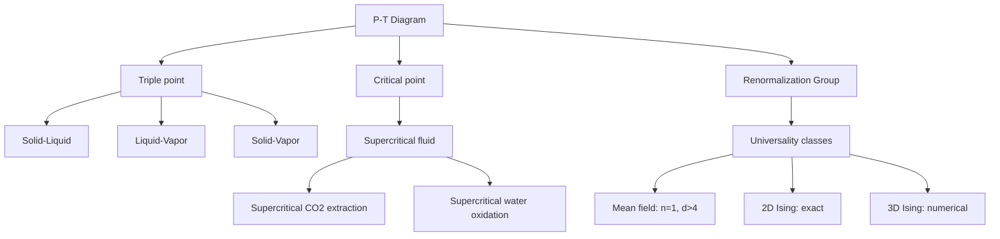

# PHYS 4050 — Thermodynamics & Statistical Physics
> **Phase 1 BSc Core | HKUST PHYS 4050 | Classical Thermodynamics, Statistical Mechanics**  
> **Bilingual 深度自學檔案 · 中英對照**

---

## 📚 Course Information

- **Code:** PHYS 4050
- **Name:** Thermodynamics and Statistical Physics
- **University:** HKUST
- **Department:** Physics
- **Term:** Spring 2025-2026
- **Phase:** 1 (BSc Foundation)
- **Credits:** 3
- **Difficulty:** ⭐⭐⭐⭐
- **Format version:** v2.0 (full deep-dive)

---

## 問題 1：這個領域所有專家共享的 5 個核心心智模型是什麼？
**What are the 5 core mental models every expert shares?**

| # | Mental Model | 心智模型 | Engineering Analogy | 工程類比 |
|---|---|---|---|---|
| 1 | **Energy is conserved (1st law)** | 能量守恆 (第一定律) | $dU = \delta Q - \delta W$ | $dU = \delta Q - \delta W$ |
| 2 | **Entropy always increases (2nd law)** | 熵總係增加 (第二定律) | $dS \geq \delta Q/T$ | $dS \geq \delta Q/T$ |
| 3 | **Temperature = $\partial U/\partial S$** | 溫度 = 能量對熵嘅偏導 | $1/T = \partial S/\partial U$ | 熱力學共軛 |
| 4 | **Boltzmann: $S = k_B \ln \Omega$** | Boltzmann 熵公式 | Microstate counting | 微觀態計數 |
| 5 | **Partition function = everything** | 配分函數 = 一切 | $Z = \sum e^{-\beta E_i}$ | 所有熱力學量 |

---

## 問題 2：這個領域的專家在哪 3 個地方存在根本分歧？各方最強的論點是什麼？
**What are the 3 fundamental disagreements + strongest arguments?**

1. **Phenomenological vs statistical**  
   - Phenomenological (Clausius, Kelvin): $dS \geq \delta Q/T$ as a law.  
   - Statistical (Boltzmann, Gibbs): $S = k_B \ln \Omega$, derived from microstates.  
   - 唯象派: $dS \geq \delta Q/T$ 係定律。  
   - 統計派: $S = k_B \ln \Omega$, 由微觀態推導。

2. **Equilibrium only vs non-equilibrium**  
   - Equilibrium thermodynamics: Time-independent, well-defined $T, P, V$.  
   - Non-equilibrium: Time-dependent, fluxes, Onsager relations.  
   - 平衡熱力: 時間無關, 有明確 $T, P, V$。  
   - 非平衡: 時間有關, 通量, Onsager 關係。

3. **Maxwell-Boltzmann vs Bose-Einstein vs Fermi-Dirac**  
   - MB: Distinguishable particles, classical limit.  
   - BE: Indistinguishable bosons, photon, He-4.  
   - FD: Indistinguishable fermions, electrons, Pauli exclusion.  
   - MB: 可分辨粒子, 古典極限。  
   - BE: 不可分辨玻色子, 光子, He-4。  
   - FD: 不可分辨費米子, 電子, 包利不相容。

---

## 問題 3：生成 10 個能區分深度理解與死背知識的問題
**Generate 10 questions that distinguish deep understanding from memorization**

1. 為什麼 $dS \geq \delta Q/T$ 係 inequality 而 equality? 什麼條件下取 equality?  
   **Why inequality and when equality?**
2. 給定 Carnot engine, 為什麼 $\eta_{Carnot} = 1 - T_c/T_h$ 係 upper bound on any heat engine?  
   **Why is Carnot the upper bound?**
3. 解釋為什麼 $S = k_B \ln \Omega$ 喺 mixing two gases 嘅 Gibbs paradox 解決中至關重要?  
   **Why solves Gibbs paradox?**
4. 給定 partition function $Z$, 解釋為什麼 $\ln Z$ 嘅 Legendre transform 給 thermodynamic potentials。  
   **Why $\ln Z$ gives everything?**
5. 為什麼 Maxwell-Boltzmann distribution $f(v) \propto e^{-mv^2/(2k_BT)}$ 係 universal across classical systems?  
   **Why MB is universal?**
6. 解釋為什麼 2nd law 唔 conflict with time-reversal invariance of microscopic laws? (Loschmidt paradox)  
   **How does 2nd law avoid Loschmidt paradox?**
7. 給定 quantum harmonic oscillator, derive $\langle E \rangle = \frac{\hbar\omega}{2} + \frac{\hbar\omega}{e^{\beta\hbar\omega}-1}$. 點解 zero-point energy contribute?  
   **Derive quantum oscillator energy.**
8. 為什麼 Fermi gas 喺 low $T$ 嘅 $C_V \propto T$ 而 classical ideal gas 係 $C_V = $ const?  
   **Why Fermi gas $C_V \propto T$?**
9. 解釋為什麼 phase transition 喺 Ehrenfest classification 用連續性 of derivatives of free energy.  
   **Why Ehrenfest classification?**
10. 給定 Ising model, 為什麼 1D has no phase transition but 2D does? (Peierls argument)  
    **Why 1D no PT, 2D yes?**

---

## 深入 1：First & Second Laws
**Deep Dive I: First & Second Laws of Thermodynamics**

### 1.1 Bilingual laws table

| Law | Form (EN) | 形式 (中) | Mathematical | 工程應用 |
|---|---|---|---|---|
| 0th | Thermal equilibrium | 熱平衡 | $T_A = T_B = T_C$ transitive | 溫度計校準 |
| 1st | Energy conservation | 能量守恆 | $dU = \delta Q - \delta W$ | Engine analysis |
| 2nd | Entropy non-decrease | 熵非減 | $dS \geq \delta Q/T$ | Refrigerator COP |
| 3rd | Absolute zero unattainable | 絕對零度不可達 | $S \to k_B \ln g$ as $T \to 0$ | Quantum limits |

### 1.2 Why $dS \geq \delta Q/T$?
- $dS_{total} = dS_{system} + dS_{surroundings} \geq 0$ for isolated system
- For reversible: $dS = \delta Q/T$; for irreversible: $dS > \delta Q/T$
- Carathéodory: $dS$ is an integrating factor for $\delta Q$ → exact differential

### 1.3 Carnot cycle
4 reversible steps: isothermal expansion (Q_h from hot), adiabatic expansion, isothermal compression (Q_c to cold), adiabatic compression.
$\eta = W/Q_h = 1 - T_c/T_h$.
Any other engine: $\eta \leq \eta_{Carnot}$ (Kelvin-Planck statement).

### 1.4 Decision flow

```mermaid
graph TD
    A[Thermo problem] --> B{Equilibrium?}
    B -->|Yes, single T, P| C[Use equations of state]
    B -->|Cyclic| D[Apply 2nd law: integral = 0 reversible]
    B -->|Non-equilibrium| E[Entropy generation: S_gen = S_total]
    C --> F[Process?}
    F -->|Isothermal| G[ΔU = 0, Q = W]
    F -->|Adiabatic| H[Q = 0, ΔU = -W]
    F -->|Isobaric| I[Q = ΔH, W = P ΔV]
    F -->|Isochoric| J[Q = ΔU, W = 0]
    D --> K[Identify reservoirs + work]
    E --> L[Use flux equations, Onsager]
```

### 1.5 Engineering applications
- Steam turbine: Rankine cycle (modified Carnot with phase change)
- Refrigerator: COP = Q_c/W = T_c/(T_h - T_c)
- Heat pump: COP = Q_h/W

---

## 深入 2：Thermodynamic Potentials
**Deep Dive II: Thermodynamic Potentials**

### 2.1 Bilingual potentials table

| Potential | 勢 | Natural variables | Legendre transform of $U$ |
|---|---|---|---|
| Internal energy $U$ | 內能 | $S, V, N$ | Base |
| Enthalpy $H$ | 焓 | $S, P, N$ | $H = U + PV$ |
| Helmholtz $F$ | Helmholtz 自由能 | $T, V, N$ | $F = U - TS$ |
| Gibbs $G$ | Gibbs 自由能 | $T, P, N$ | $G = U - TS + PV$ |
| Grand potential $\Omega$ | 巨勢 | $T, V, \mu$ | $\Omega = U - TS - \mu N$ |

### 2.2 Maxwell relations from Gibbs
$dG = -S dT + V dP + \mu dN$.
Mixed partials equal: $\partial^2 G/\partial T \partial P = \partial^2 G/\partial P \partial T$.
$\implies -(\partial S/\partial P)_T = (\partial V/\partial T)_P$. (Maxwell relation)

### 2.3 Why these potentials?
- $U$ used for isolated system ($\delta S \geq 0$).
- $F$ used for $T, V$ fixed (e.g., chemistry at constant T).
- $G$ used for $T, P$ fixed (most chemistry, phase equilibrium).
- $H$ used for $P$ fixed flow processes.

### 2.4 Method flow



### 2.5 Engineering applications
- Chemical equilibrium: $\Delta G = -RT \ln K_{eq}$
- Phase diagrams: Clausius-Clapeyron for vapor pressure
- Battery voltage: $\Delta G = -nFE$

---

## 深入 3：Statistical Mechanics Foundations
**Deep Dive III: Statistical Mechanics Foundations**

### 3.1 Bilingual concepts

| Concept | 中英對照 | Math | 物理意義 |
|---|---|---|---|
| Microstate | 微觀態 | Specific $(q_i, p_i)$ for all particles | Full phase-space point |
| Macrostate | 宏觀態 | Specified by $(T, P, V, N)$ | Bulk properties |
| Ensemble | 系綜 | Distribution over microstates | Statistical ensemble |
| Microcanonical | 微正則 | Fixed $E, V, N$ | Isolated |
| Canonical | 正則 | Fixed $T, V, N$ (heat bath) | Heat reservoir |
| Grand canonical | 巨正則 | Fixed $T, V, \mu$ | Particle reservoir |

### 3.2 Boltzmann entropy derivation
For isolated system, all microstates with same $(E, V, N)$ equally likely.  
Number of microstates $\Omega(E, V, N)$: $S = k_B \ln \Omega$ (fundamental postulate).  
For two independent systems: $S_{12} = S_1 + S_2 \implies \Omega_{12} = \Omega_1 \Omega_2$ (multiplicative).

### 3.3 Partition function: $Z = \sum_i e^{-\beta E_i}$
$\beta = 1/(k_B T)$. From $Z$:  
$\langle E \rangle = -\partial \ln Z/\partial \beta$  
$F = -k_B T \ln Z$  
$S = k_B(\ln Z + \beta \langle E \rangle)$  
$C_V = k_B \beta^2 \partial^2 \ln Z/\partial \beta^2$

### 3.4 Ensemble choice flow



### 3.5 Engineering applications
- Ideal gas: $Z = (V/\lambda^3)^N/N!$, recovers $PV = Nk_BT$
- Solid: Einstein model → $C_V = 3Nk_B (\theta_E/T)^2 e^{\theta_E/T}/(e^{\theta_E/T}-1)^2$
- Black body: photon gas, $u \propto T^4$ (Stefan-Boltzmann)

---

## 深入 4：Quantum Statistics
**Deep Dive IV: Quantum Statistics**

### 4.1 Bilingual distribution table

| Distribution | 分佈 | $n(\epsilon)$ | Pauli | 適用 |
|---|---|---|---|---|
| Maxwell-Boltzmann | MB | $e^{-\beta\epsilon}$ / Z₁ | No | Classical distinguishable |
| Bose-Einstein | BE | $1/(e^{\beta(\epsilon-\mu)} - 1)$ | No | Bosons |
| Fermi-Dirac | FD | $1/(e^{\beta(\epsilon-\mu)} + 1)$ | Yes (exclusion) | Fermions |

### 4.2 Derivation: FD from grand canonical
For single-particle state $i$ with energy $\epsilon_i$: occupation $n_i = 0$ or $1$.  
$\langle n_i \rangle = \frac{\sum_{n=0}^1 n e^{-\beta n(\epsilon_i - \mu)}}{\sum_{n=0}^1 e^{-\beta n(\epsilon_i - \mu)}} = \frac{e^{-\beta(\epsilon_i-\mu)}}{1 + e^{-\beta(\epsilon_i-\mu)}} = \frac{1}{e^{\beta(\epsilon_i-\mu)}+1}$. ✓

### 4.3 BE condensation
For bosons: $\mu < 0$ (no chemical potential constraint). When $\mu \to 0$, macroscopic occupation of ground state at low $T$ (BEC). Critical temp: $T_c = 2\pi\hbar^2/(mk_B) (n/\zeta(3/2))^{2/3}$.

### 4.4 Fermi gas at $T = 0$
All states below Fermi energy $\epsilon_F$ filled, above empty. $\epsilon_F = \hbar^2 (3\pi^2 n)^{2/3}/(2m)$.  
Low-$T$ specific heat: $C_V = (\pi^2/2) N k_B (T/T_F)$.

### 4.5 Comparison flow



### 4.6 Engineering applications
- Laser: BE statistics + stimulated emission
- White dwarf: FD pressure supports against gravity
- Solar cell: BE photon statistics, FD electron statistics

---

## 深入 5：Phase Transitions & Critical Phenomena
**Deep Dive V: Phase Transitions & Critical Phenomena**

### 5.1 Bilingual Ehrenfest classification

| Order | 階 | Discontinuity | Example | 例子 |
|---|---|---|---|---|
| 1st | 一階 | $\rho, S, V$ discontinuous (latent heat $L$) | Boiling, melting | 沸騰、熔化 |
| 2nd | 二階 | $C_P, \kappa_T$ discontinuous | Superconductor, $\lambda$-transition | 超導、$\lambda$ 轉變 |
| Higher | 高階 | Higher derivatives | — | — |

### 5.2 Clausius-Clapeyron
For 1st-order transition: $dP/dT = L/(T \Delta V)$.  
Derived from $G_1(T,P) = G_2(T,P)$ along coexistence curve.
Integrate: $P(T) = P_0 \exp(L/(R)(1/T_0 - 1/T))$ (ideal gas).

### 5.3 Critical exponents
Near $T_c$: $\xi \sim |t|^{-\nu}$, $C \sim |t|^{-\alpha}$, $M \sim |t|^{\beta}$, $\chi \sim |t|^{-\gamma}$ (magnetic), $t = (T-T_c)/T_c$.  
Universality: depends only on symmetry + dimension (e.g., 2D Ising exact: $\nu = 1$).

### 5.4 Mean-field vs renormalization group
- Mean-field (Landau, van der Waals): $\phi^4$ theory, exact in $d = 4$ dimensions.
- RG (Wilson 1971, Nobel 1982): Scale invariance, fixed points, universality classes.
- 1D Ising: no PT (Peierls); 2D Ising: exact PT (Onsager 1944).

### 5.5 Phase diagram flow



### 5.6 Engineering applications
- Refrigeration: $L$ at phase change enables high $Q$ per unit mass
- Material design: Critical point affects processing windows
- Superconductors: 2nd-order transition, $T_c$ tunable

---

## 自測 1：Why Carnot is the upper bound
**Self-Test 1: Why Carnot is the upper bound**

**Answer / 解答:**  
Suppose engine X more efficient than Carnot. Run X forward (work output), run Carnot refrigerator (work input). Combined: net work from single reservoir, violating Kelvin-Planck statement of 2nd law. Contradiction. ∴ Carnot is upper bound.

**Engineering implication:** Real engines (Otto, Diesel, Rankine) all below Carnot. Improvement = reducing irreversibility, not just $T_c/T_h$ ratio.

---

## 自測 2：Gibbs paradox resolution
**Self-Test 2: Gibbs paradox resolution**

**Answer / 解答:**  
Two chambers of same gas: $S$ should not change when partition removed. MB gives $\Delta S = Nk_B \ln 2$ (wrong!).  
Resolution: divide $\Omega$ by $N!$ for indistinguishability → $S = Nk_B [\ln(V/N\lambda^3) + 5/2]$ → no change for same gas.

**Engineering implication:** $N!$ factor in partition function (Sackur-Tetrode); explains why mixing entropy ≠ 0 for different gases.

---

## 自測 3：Microcanonical → Canonical via heat bath
**Self-Test 3: Microcanonical → Canonical via heat bath**

**Answer / 解答:**  
System + bath = isolated microcanonical. System has $\Omega_S(E_S)$, bath has $\Omega_B(E - E_S)$.  
Total $\Omega_{tot} = \Omega_S \Omega_B \propto \Omega_S e^{S_B(E - E_S)/k_B}$.  
Expand $S_B(E - E_S) \approx S_B(E) - E_S/T$, get Boltzmann: $P(E_S) \propto \Omega_S e^{-E_S/(k_BT)}$.

**Engineering implication:** Justifies canonical ensemble; thermal contact = bath = $T$.

---

## 自測 4：Why MB → classical, FD/BE → quantum
**Self-Test 4: Why MB → classical, FD/BE → quantum**

**Answer / 解答:**  
MB requires $n\lambda^3 \ll 1$ (low density, high $T$): $\lambda = h/\sqrt{2\pi m k_B T}$ de Broglie wavelength << interparticle distance.  
FD/BE: $n\lambda^3 \geq 1$: wavefunctions overlap, indistinguishability matters.

**Engineering implication:** He-4 liquid (quantum) vs hot air (classical).

---

## 自測 5：Black-body spectrum from BE
**Self-Test 5: Black-body spectrum from BE statistics**

**Answer / 解答:**  
Photon gas (bosons, $\mu = 0$). Modes in cavity: $g(\omega) d\omega = V\omega^2/(\pi^2 c^3) d\omega$.  
$\langle n(\omega) \rangle = 1/(e^{\beta\hbar\omega} - 1)$.  
Energy density $u(\omega) = \hbar\omega \cdot g(\omega) \cdot \langle n\rangle = \frac{\hbar\omega^3}{\pi^2 c^3} \cdot \frac{1}{e^{\beta\hbar\omega}-1}$.

**Engineering implication:** Solar cells (tune bandgap to peak), incandescent bulbs, CMB.

---

## 自測 6：Specific heat of Fermi gas
**Self-Test 6: Specific heat of Fermi gas at low T**

**Answer / 解答:**  
Only particles within $\sim k_BT$ of $\epsilon_F$ can be excited. Fraction $\sim T/T_F$.  
Each gets $\sim k_B T$ energy. $C_V \sim N k_B (T/T_F) \propto T$ (linear).  
Classical: equipartition → all particles, $C_V = (3/2)Nk_B$ (constant).

**Engineering implication:** Why electrons in metals contribute little to $C_V$ (dominated by phonons $\propto T^3$ at low T).

---

## 自測 7：Einstein vs Debye model for solids
**Self-Test 7: Einstein vs Debye model for solids**

**Answer / 解答:**  
Einstein: All atoms oscillate at same $\omega_E$. $C_V = 3Nk_B (\theta_E/T)^2 e^{\theta_E/T}/(e^{\theta_E/T}-1)^2$.  
At low $T$: $C_V \propto e^{-\theta_E/T}$ (fails — should be $T^3$).  
Debye: Spectrum of modes up to $\omega_D$. $C_V \propto (T/\theta_D)^3$ at low T. ✓

**Engineering implication:** Why Debye model is standard for thermal conductivity, specific heat.

---

## 自測 8：Why 1D Ising has no PT
**Self-Test 8: Why 1D Ising has no PT**

**Answer / 解答:**  
Peierls argument: at any $T > 0$, a domain wall has finite energy cost $\sim 2J$, but entropy $k_B \ln N$ (N possible positions). For $T > 0$, $\Delta F = 2J - k_B T \ln N < 0$ for large $N$. Domain walls proliferate, destroying order.

**Engineering implication:** No finite-T order in 1D with short-range interactions (Mermin-Wagner theorem).

---

## 自測 9：Maxwell construction
**Self-Test 9: Maxwell construction (van der Waals)**

**Answer / 解答:**  
vdW equation has unstable region $\partial P/\partial V|_T > 0$. Real system: phase coexistence, flat $P$ vs $V$.  
Maxwell equal-area rule: $\int_{V_1}^{V_2} (P_{vdW} - P_{coex}) dV = 0$.  
This sets $T < T_c$ coexistence; $T > T_c$: supercritical fluid, no coexistence.

**Engineering implication:** Critical point of CO₂ ($T_c = 304$ K, $P_c = 73$ atm) — supercritical extraction.

---

## 自測 10：Bose-Einstein condensate
**Self-Test 10: Bose-Einstein condensate**

**Answer / 解答:**  
For bosons, $\mu < 0$ (no exclusion). At $T = T_c$, $\mu \to 0$, ground state gets macroscopic occupation $N_0 \sim N$.  
Below $T_c$: $N_0/N = 1 - (T/T_c)^{3/2}$.  
Realized 1995 (Cornell, Wieman, Cornell — Nobel 2001) in dilute Rb-87 at $\sim 100$ nK.

**Engineering implication:** Ultra-cold atom physics, quantum simulators, atom lasers.

---

## 📊 Diagram 1: Thermo Concept Tree


## 📊 Diagram 2: Ensemble Selection


## 📊 Diagram 3: Maxwell Relations Network
```mermaid
graph TD
    U[U: dU = TdS - PdV + mu dN] --> H
    H[H = U + PV: dH = TdS + VdP + mu dN] --> F
    H --> G
    F[F = U - TS: dF = -SdT - PdV + mu dN] --> G
    G[G = U - TS + PV: dG = -SdT + VdP + mu dN]
    
    F --> M1[(dS/dV)T = (dP/dT)V]
    G --> M2[-(dS/dP)T = (dV/dT)P]
    H --> M3[(dS/dP)H = -(dV/dT)P]
    U --> M4[(dT/dV)U = -(dP/dS)V]
```

## 📊 Diagram 4: Statistics Decision Tree
```mermaid
flowchart TD
    A[Particle system] --> B{Identical?}
    B -->|Yes, bosons| C[BE: n = 1/(e^b eps-mu -1)]
    B -->|Yes, fermions| D[FD: n = 1/(e^b eps-mu +1)]
    B -->|No| E[MB: n propto e^-b eps]
    C --> F{Confinement}
    C -->|Low T| G[BEC: macroscopic ground state]
    C -->|High T| H[Classical limit]
    D --> I{Density}
    D -->|Low T, high n| J[Degenerate: Fermi sea]
    D -->|High T| H
    G --> K[BEC achieved 1995]
    J --> L[White dwarf, metal]
```

## 📊 Diagram 5: Phase Diagram & Critical Phenomena


---

## 深度總結 Deep Insights Summary

1. **Entropy is more fundamental than energy** — while energy is conserved, entropy increases, defining the arrow of time. The 2nd law is what makes the universe a "history" rather than a "state".  
   **熵比能量更基本** — 能量守恆, 但熵增加, 定義咗時間之箭。第二定律令宇宙係「歷史」而唔係「狀態」。

2. **Partition function is the mother of all thermal quantities** — once you have $Z$, all thermodynamic observables follow by differentiation. This unifies the subject.  
   **配分函數係所有熱力學嘅母函數** — 一旦有 $Z$, 所有熱力學量都通過微分得到。統一咗呢個學科。

3. **Boltzmann $S = k_B \ln \Omega$ bridges micro and macro** — the entropy of a macrostate is just the log of how many microstates realize it. This explains why $S$ is extensive, why it increases, why mixing works.  
   **Boltzmann $S = k_B \ln \Omega$ 連接微觀同宏觀** — 宏觀態嘅熵就係實現佢嘅微觀態數嘅對數。解釋咗 $S$ 為何廣延, 為何增加, 為何 mixing 有效。

4. **Phase transitions = singularities of $Z$** — in the thermodynamic limit, $Z$ becomes non-analytic at phase transitions. Fluctuations diverge, correlation length $\xi \to \infty$. This is what makes critical phenomena universal.  
   **相變 = $Z$ 嘅奇異點** — 喺熱力學極限, $Z$ 喺相變點變非解析。漲落發散, 相關長度 $\xi \to \infty$。呢個令臨界現象普適。

5. **Quantum statistics = symmetry of wavefunction** — bosons (symmetric) vs fermions (antisymmetric) is the deepest divide in nature. BEC and Fermi pressure both come from this one fact.  
   **量子統計 = 波函數嘅對稱性** — 玻色子 (對稱) 同費米子 (反對稱) 係自然界最深嘅分別。BEC 同費米壓力都嚟自呢一個事實。

---

**自學建議**  
- 必讀：Pathria "Statistical Mechanics" 3rd ed. + Schroeder "An Introduction to Thermal Physics"。  
- 配對：MIT OCW 8.333 (Statistical Mechanics I) by Leonid Mirny。  
- 工具：NumPy (MB distributions), QuTiP (quantum statistics), Matplotlib (P-V diagrams)。  
- 產出：寫一個 Monte Carlo Ising 2D 模擬, 觀察 phase transition。
