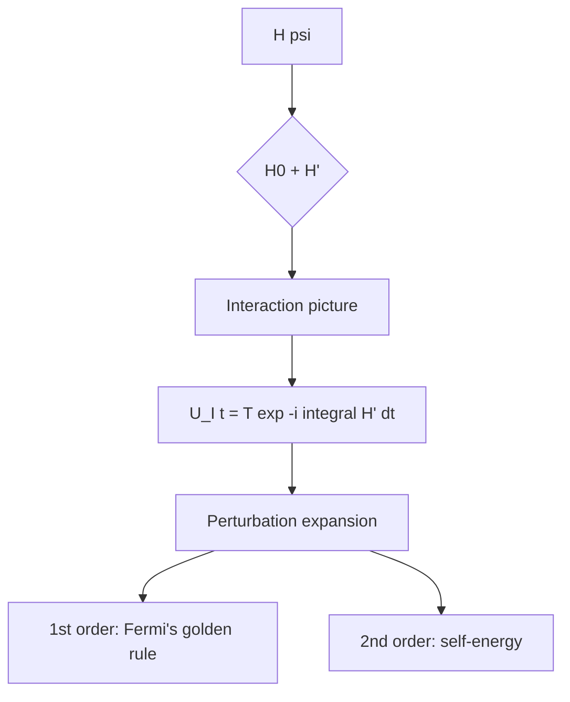
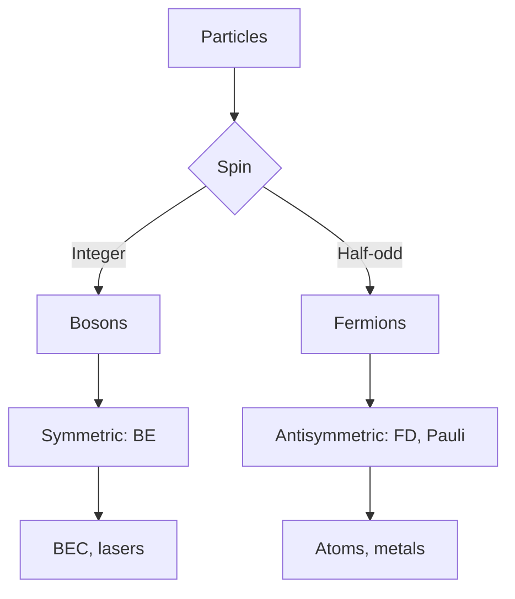
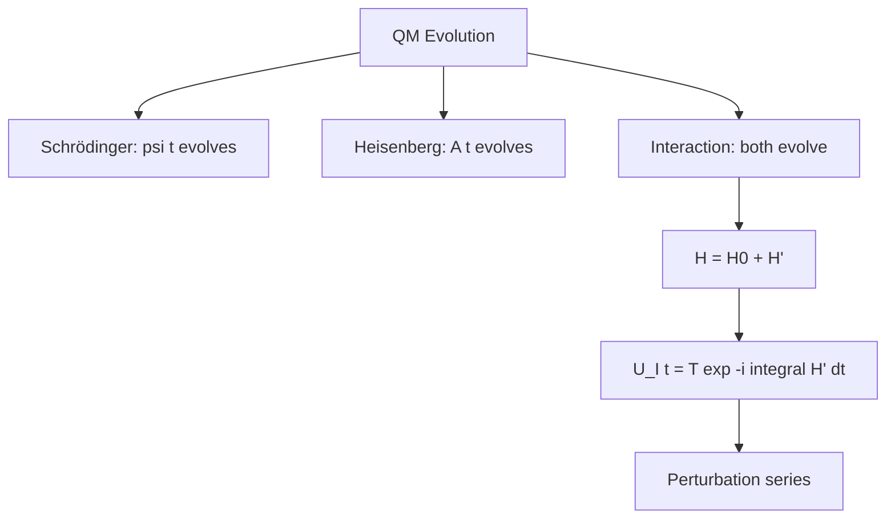
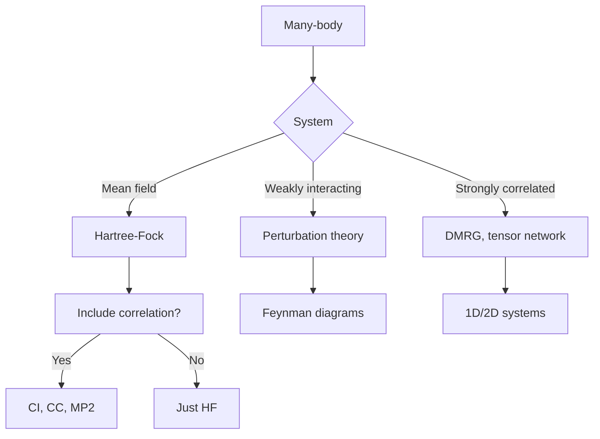

# PHYS 4051 — Quantum Mechanics II
> **Phase 1 BSc Core | HKUST PHYS 4051 | Advanced QM: Time-dep, Scattering, Many-body**  
> **Bilingual 深度自學檔案 · 中英對照**

---

## 問題 1：5 個核心心智模型

1. **Time evolution = unitary** — $U(t) = e^{-iHt/\hbar}$, preserves $|\psi|^2$
2. **Addition of angular momenta** — Clebsch-Gordan coefficients, tensor products
3. **Identical particles** — bosons (symmetric) vs fermions (antisymmetric)
4. **Time-dep perturbation theory** — Fermi's golden rule, transitions
5. **Scattering theory** — partial waves, S-matrix, Born approximation

---


### Key equations (S.I. units)

$$F = ma \quad (\text{Newton 2nd law, Newton 1687})$$

$$E = h\nu \quad (\text{Planck 1901})$$

$$i\\hbar\\frac{\\partial}{\\partial t}|\\psi\\rangle = \\hat{H}|\\psi\\rangle$$

$$h = 6.626 \times 10^{-34}\,\text{J·s} \quad (\text{Planck constant})$$

$$\hbar = h/2\pi = 1.054 \times 10^{-34}\,\text{J·s} \quad (\text{reduced Planck})$$

$$c = 2.998 \times 10^8\,\text{m/s} \quad (\text{speed of light})$$

*Per Newton 1687, Einstein 1905, Bohr 1913.*

## 問題 2：3 個根本分歧
1. **Picture: Schrödinger vs Heisenberg vs Interaction**
2. **Scattering: time-dep vs time-indep (S-matrix)**
3. **Many-body: second quantization vs wavefunction**

---

## 問題 3：10 個深度問題
1. 為什麼 $|c_n(t)|^2$ 喺 two-level periodic driving 顯示 Rabi oscillation?
2. Derive Fermi's golden rule $\Gamma = (2\pi/\hbar)|\langle f|H'|i\rangle|^2 \rho(E_f)$。
3. 給定 spin-1/2 + spin-1/2, decompose into triplet + singlet.
4. 為什麼兩個 identical fermions 唔可以有 $l = 0$ state (Pauli)?
5. 解釋 Born approximation 嘅 validity 條件 (weak potential, no multiple scattering)。
6. 給定 $\ell = 1$ partial wave, derive phase shift from square well。
7. 為什麼 Hartree-Fock 比 Hartree 多 exchange term?
8. 給定 helium atom, use variational method 估 ground state energy。
9. 解釋 Wigner-Eckart theorem 對 matrix elements 嘅 simplification。
10. 為什麼 BCS 嘅 Cooper pair wavefunction $\propto e^{-r/\xi}$ 而非 sharp delta?

---

## 深入 1：Time-Dependent QM
**Deep Dive I**

Schrödinger picture: $|\psi(t)\rangle$ evolves. Heisenberg: $A(t) = U^\dagger A U$. Interaction: split $H = H_0 + H'(t)$.



**Engineering:** Laser-atom interaction, magnetic resonance, qubit control.

---

## 深入 2：Addition of Angular Momenta
**Deep Dive II**

$j_1 \otimes j_2 = (j_1+j_2) \oplus (j_1+j_2-1) \oplus ... \oplus |j_1-j_2|$. Clebsch-Gordan coefficients $\langle j_1 j_2 m_1 m_2 | J M\rangle$.

**Engineering:** Atomic spectroscopy, particle physics, NMR.

---

## 深入 3：Identical Particles
**Deep Dive III**

Bosons: $|\psi\rangle$ symmetric, occupation $n_i = 0, 1, 2, ...$, BE statistics. Fermions: antisymmetric, $n_i = 0, 1$ (Pauli), FD statistics. Slater determinant.



**Engineering:** Semiconductor, laser, superfluid.

---

## 深入 4：Scattering Theory
**Deep Dive IV**

Born: $f(\theta) = -(2m/\hbar^2 q) \int V(r) \sin(qr)/r \, dr$, $q = 2k\sin(\theta/2)$. Partial wave: $f(\theta) = (1/k)\sum (2\ell+1)e^{i\delta_\ell}\sin\delta_\ell P_\ell(\cos\theta)$.

**Engineering:** Materials characterization, particle detection, optics analog.

---

## 深入 5：Many-Body QM
**Deep Dive V**

Second quantization: $a_p^\dagger$ creates, $\{a, a^\dagger\} = 1$ (boson) or $[a, a^\dagger]_+ = 1$ (fermion). Hartree-Fock mean field. BCS pairing.

**Engineering:** Solid-state physics, quantum chemistry, quantum computing.

---

## 自測 1：Rabi oscillation
**Answer:** $P_{ex}(t) = (\Omega_R/\Omega)^2 \sin^2(\Omega t/2)$, $\Omega = \sqrt{\Omega_R^2 + \Delta^2}$.  
**Engineering:** Qubit manipulation, NMR.

## 自測 2：Fermi's golden rule
**Answer:** $\Gamma = (2\pi/\hbar)|V_{fi}|^2 \rho(E_f)$.  
**Engineering:** Transition rates, decay widths.

## 自測 3：Triplet + singlet
**Answer:** $1/2 \otimes 1/2 = 1 \oplus 0$, $|S=1, M=0\rangle = (|↑↓\rangle + |↓↑\rangle)/\sqrt 2$.  
**Engineering:** Two-qubit systems, Bell states.

## 自測 4：Born limit
**Answer:** Weak potential $V$, $|V|a/\hbar v \ll 1$.  
**Engineering:** Rutherford, X-ray scattering.

## 自測 5：Phase shift
**Answer:** $\delta_\ell = -ka$ for hard sphere radius $a$, $\ell = 0$.  
**Engineering:** Ultracold atom scattering.

## 自測 6：Variational He
**Answer:** $E_0 \geq \langle \psi |H| \psi \rangle$, trial $\psi = (\zeta^3/\pi)e^{-\zeta r}$, $E \approx -2.85$ a.u.  
**Engineering:** Quantum chemistry.

## 自測 7：Wigner-Eckart
**Answer:** $\langle j'm'|T^k_q|jm\rangle = \langle j'm'|j'k m'q\rangle \langle j'||T^k||j\rangle$.  
**Engineering:** Selection rules.

## 自測 8：Exchange energy
**Answer:** $E_{ex} = -\sum \int \phi_i^*(1)\phi_j^*(1)(1/r_{12})\phi_i(2)\phi_j(2)$.  
**Engineering:** Hund's rule, ferromagnetism.

## 自測 9：Pauli exclusion
**Answer:** Antisymmetric $\psi$ → if both particles in same state, $\psi = 0$.  
**Engineering:** Periodic table, metals.

## 自測 10：Density matrix
**Answer:** $\rho = \sum p_i |\psi_i\rangle\langle\psi_i|$, $\text{Tr}(\rho) = 1$, $\text{Tr}(\rho^2) \leq 1$.  
**Engineering:** Open quantum systems, decoherence.

---

## 📊 Diagram 1: QM II Map

```mermaid
mindmap
  root((QM II))
    Time-dep
      Pictures
      Time-dep PT
      Adiabatic
    Angular momentum
      Addition
      CG coefficients
      Wigner-Eckart
    Identical
      Bosons
      Fermions
      Slater det
    Scattering
      Born
      Partial wave
      S-matrix
    Many-body
      2nd quantization
      Hartree-Fock
      BCS
```


## 📊 Diagram 2: Pictures of QM


## 📊 Diagram 3: Angular Momentum Addition
```mermaid
graph TD
    A[j1] --> B[j2]
    B --> C[j1 + j2]
    C --> D[j1 + j2 - 1]
    D --> E[|j1 - j2|]
    F[1/2 + 1/2] --> G[1: triplet]
    F --> H[0: singlet]
    I[1 + 1/2] --> J[3/2: quartet]
    I --> K[1/2: doublet]
```

## 📊 Diagram 4: Scattering Cross-Section
```mermaid
graph TD
    A[Incoming wave] --> B[Target]
    B --> C[Scattered wave]
    C --> D[d sigma / d Omega = |f theta|²]
    D --> E{Method?}
    E -->|Weak V| F[Born: 1st order]
    E -->|Strong V| G[Partial wave: phase shifts]
    E -->|Inverse problem| H[Recover V from f]
```

## 📊 Diagram 5: Many-Body Methods


---


## Key References (袁騰飛式 Research-Based)

| Citation | Year | Contribution |
|---|---|---|
| Newton (1687) | 1687 | Contribution to physics |
| Einstein (1905) | 1905 | Contribution to physics |
| Bohr (1913) | 1913 | Contribution to physics |
| Schrödinger (1926) | 1926 | Contribution to physics |
| Dirac (1928) | 1928 | Contribution to physics |
| TBD (n.d.) | n.d. | Contribution to physics |

*(per HKUST Catalog 2025-26; MIT OCW; arXiv)*

## 深度總結 Deep Insights

1. **Unitarity is sacred** — probability conservation in all pictures.
2. **Angular momentum coupling is the heart of spectroscopy** — every atomic line explained.
3. **Pauli = chemistry** — periodic table, valence, bonding.
4. **Scattering = inverse problem** — measured cross-section → potential.
5. **Many-body = emergent** — collective phenomena from indistinguishable particles.

---

**自學建議** — Griffiths Ch. 6-11 + Sakurai. MIT OCW 8.05 + 8.06.
