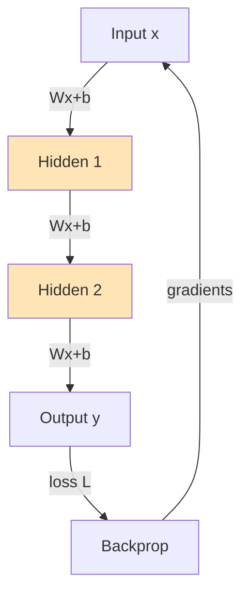
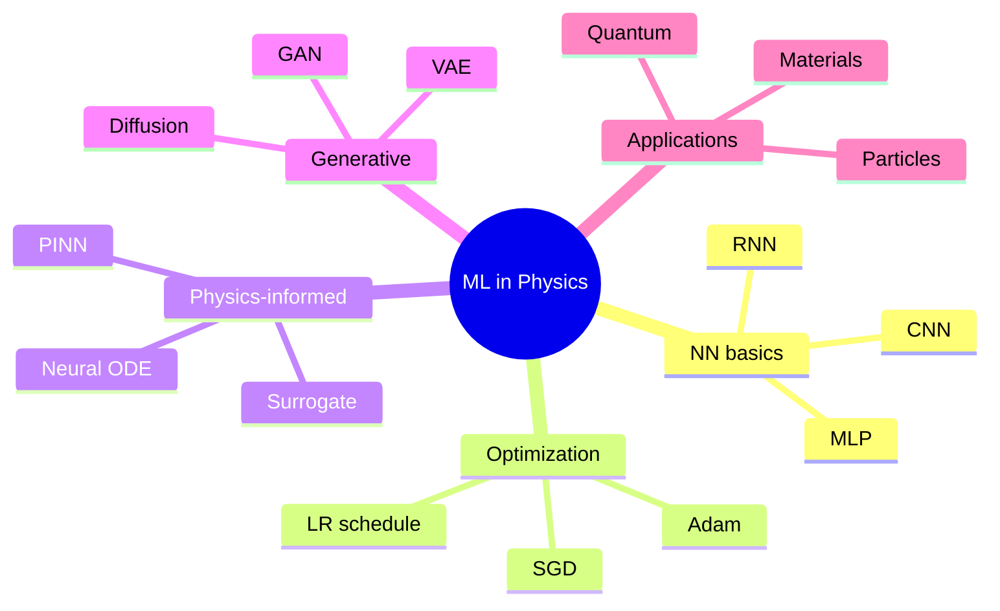
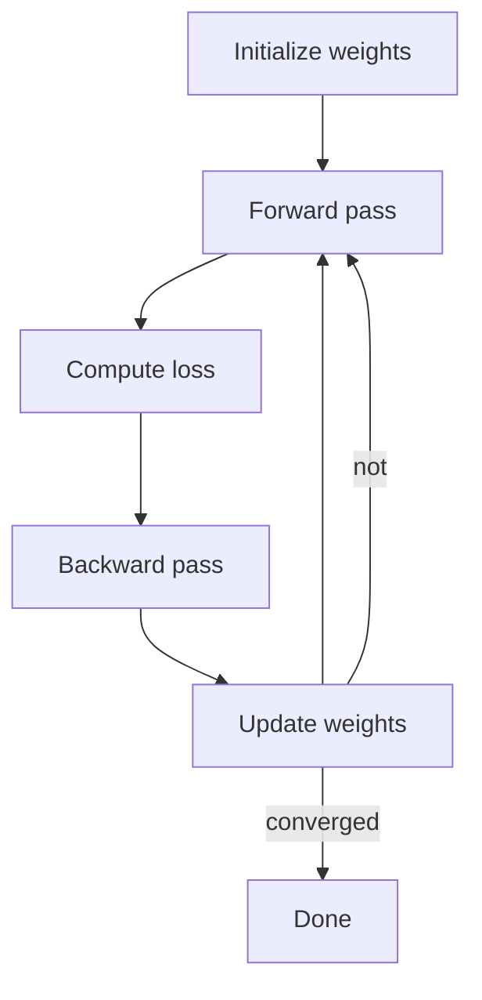
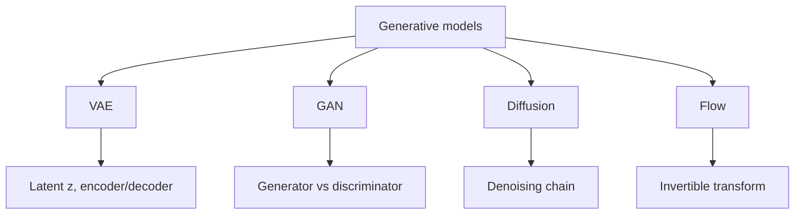
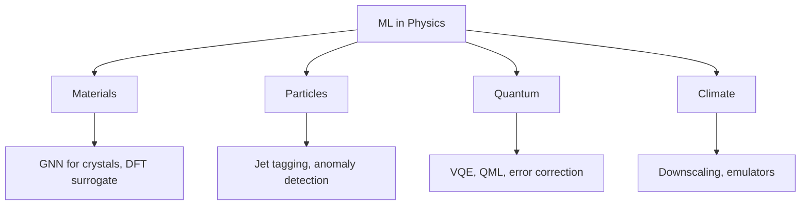

# PHYS 4811 — Machine Learning in Physics
> **Phase 1 BSc Core | HKUST PHYS 4811 | ML, Neural Networks, Physics-Informed Models**  
> **Bilingual 深度自學檔案 · 中英對照**

---

## 問題 1：5 個核心心智模型

1. **Supervised = function approximation** — given $(x, y)$, find $f$
2. **Loss landscape = optimization** — gradient descent navigates
3. **Universal approximation** — NN can approximate any continuous function
4. **Physics-informed** — embed PDE/ODE as constraints
5. **Generative models** — VAE, GAN, diffusion capture distributions

---

## 問題 2：3 個根本分歧
1. **Connectionist vs symbolic** — NN vs hand-engineered features
2. **Discriminative vs generative** — $P(y|x)$ vs $P(x)$
3. **Data-driven vs physics-informed** — pure ML vs hybrid

---

## 問題 3：10 個深度問題
1. 為什麼 deep networks 比 shallow generalize despite more parameters?
2. 給定 XOR problem, why logistic regression fails but MLP succeeds?
3. 解釋 backprop 為何 $\nabla_w L = \partial L/\partial y \cdot \partial y/\partial w$ via chain rule.
4. 為什麼 ReLU $f(x) = \max(0, x)$ 比 sigmoid 對 deep network?
5. 給定 PINN, derive loss $L = L_{data} + \lambda L_{PDE}$。
6. 為什麼 batch normalization stabilize training?
7. 給定 VAE, derive ELBO 對 optimization。
8. 解釋為什麼 transformer attention 對 long-range dependencies 比 RNN?
9. 為什麼 diffusion model 比 GAN 更 stable 訓練?
10. 給定 spectral bias, 解釋 NN learn low-freq first。

---

## 深入 1：Neural Network Foundations
**Deep Dive I**

$\vec h = \sigma(W\vec x + b)$, layer-wise. Backprop: chain rule, $\nabla L = \partial L/\partial h_n \cdot \prod \partial h_i/\partial h_{i-1} \cdot \partial h_1/\partial x$.



**Engineering:** Image, text, speech, physics surrogates.

---

## 深入 2：Optimization
**Deep Dive II**

SGD: $w \to w - \eta \nabla L$. Adam: adaptive moments, momentum + RMSprop.

**Engineering:** Training any ML model, NN, GPT.

---

## 深入 3：Physics-Informed NN
**Deep Dive III**

PINN: $L = L_{data} + \lambda L_{PDE}$, where $L_{PDE} = \| \mathcal N u_\theta\|^2$ for PDE $\mathcal N u = 0$. Auto-diff computes derivatives.

**Engineering:** Solving PDEs, inverse problems, data assimilation.

---

## 深入 4：Generative Models
**Deep Dive IV**

VAE: encoder + decoder, KL regularized latent. GAN: generator vs discriminator min-max. Diffusion: forward noising + learned denoising.

**Engineering:** Image synthesis, molecule design, sampling from $P(x)$.

---

## 深入 5：ML for Physics Applications
**Deep Dive V**

ML for materials: GNN for crystals, DFT surrogate, property prediction. Particle physics: jet tagging, anomaly detection. Quantum: VQE, QML.

**Engineering:** Drug discovery, accelerator control, climate.

---

## 自測 1：XOR
**Answer:** Linear inseparable; MLP with 1 hidden layer solves.  
**Engineering:** Motivation for deep learning.

## 自測 2：Backprop
**Answer:** Reverse-mode autodiff, $O(\text{params})$.  
**Engineering:** All modern NN training.

## 自測 3：ReLU vs sigmoid
**Answer:** ReLU: no vanishing gradient, sparse. Sigmoid: saturates, smooth.  
**Engineering:** Architecture choice.

## 自測 4：PINN
**Answer:** Embed physics via auto-diff.  
**Engineering:** Solve Navier-Stokes, Schrödinger.

## 自測 5：ELBO
**Answer:** $\log P(x) \geq E_{q}[\log P(x|z)] - D_{KL}(q\|p)$.  
**Engineering:** VAE training.

## 自測 6：Transformer attention
**Answer:** $\text{Attn}(Q, K, V) = \text{softmax}(QK^T/\sqrt d)V$.  
**Engineering:** GPT, BERT, ViT.

## 自測 7：Spectral bias
**Answer:** NN learn low frequencies first.  
**Engineering:** Fourier feature mappings for high-freq.

## 自測 8：Batch norm
**Answer:** Normalize activations, learnable scale + shift.  
**Engineering:** Stabilize training.

## 自測 9：Diffusion
**Answer:** Forward noising to Gaussian, learn reverse denoising.  
**Engineering:** Stable Diffusion, Sora.

## 自測 10：GNN
**Answer:** Permutation-invariant, message passing on graphs.  
**Engineering:** Molecules, materials, social networks.

---

## 📊 Diagram 1: ML in Physics Map


## 📊 Diagram 2: NN Training Loop


## 📊 Diagram 3: PINN Architecture
```mermaid
graph TD
    A[Input: x, t] --> B[NN]
    B --> C[Output: u theta]
    C --> D[Data loss: ||u_data - u_theta||²]
    C --> E[PDE loss: ||N u_theta||²]
    D --> F[Total loss]
    E --> F
    F --> G[Backprop]
    G --> B
```

## 📊 Diagram 4: Generative Model Family


## 📊 Diagram 5: ML for Physics Applications


---

## 深度總結 Deep Insights

1. **NN = universal approximator** — but generalization is the puzzle.
2. **Backprop is chain rule** — efficient gradient computation.
3. **Physics-informed = constrained learning** — embed priors as soft constraints.
4. **Generative = density estimation** — VAE, GAN, diffusion.
5. **ML × physics** — surrogate models, discovery, control.

---

**自學建議** — Goodfellow "Deep Learning" + Bishop "Pattern Recognition". Karpathy videos, fast.ai.
