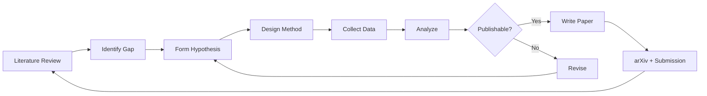
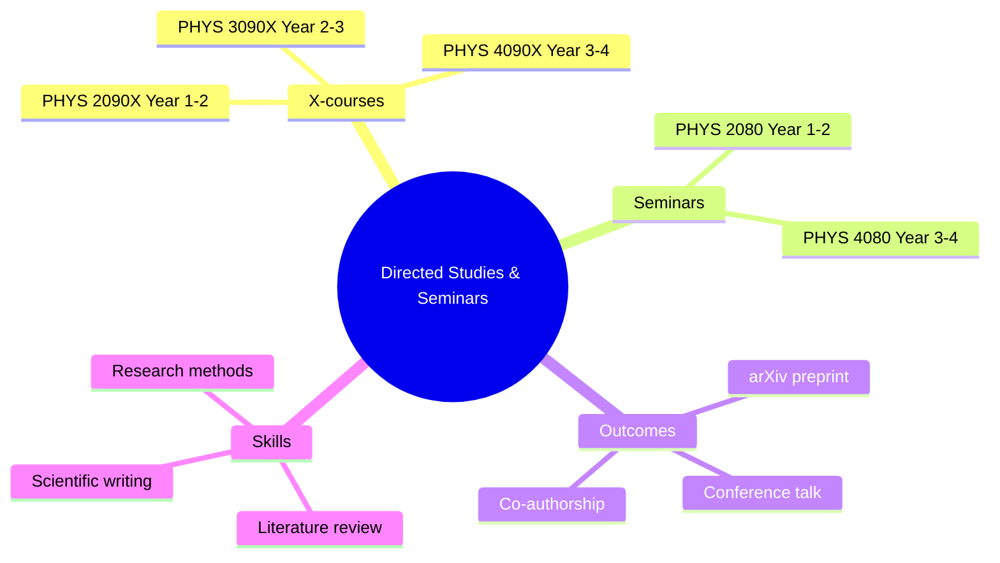
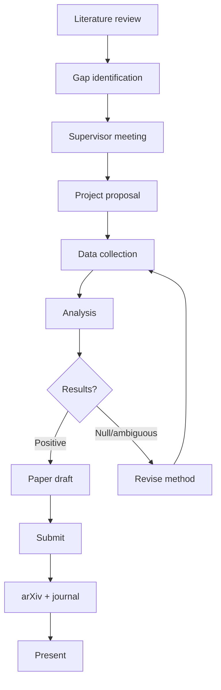
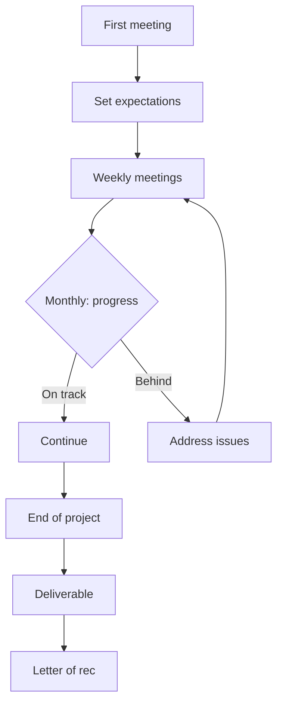

# Directed Studies & Seminars — HKUST Physics
> **Phase 1 BSc Electives | Self-directed research, seminars, professional development**  
> **Bilingual 深度自學檔案 · 中英對照**

---

## 問題 1：5 個核心心智模型

1. **Directed Studies = independent research apprenticeship** — faculty-supervised, 1-on-1 mentorship; you negotiate scope, method, and deliverables; the X-courses (2090X, 3090X, 4090X) build progressively from exploratory to publishable research (Medawar 1979, *Advice to a Young Scientist*)

2. **Seminars bridge coursework and research** — weekly exposure to frontier research develops scientific taste; attending seminars trains you to evaluate claims critically, not passively absorb (Knorr-Cetina 1999, *Epistemic Cultures*)

3. **Credits ≠ learning** — variable credit (1–3 credits) reflects variable workload; 1 credit = ~3 hours/week engagement; negotiate deliverables explicitly with supervisor (HKUST PHYS course guidelines)

4. **The seminar ecosystem** — PHYS 2080/4080 are学分-bearing seminars; attending 10+ seminars per semester builds a research network and exposes you to diverse physics subfields (Granovetter 1973, *Am. J. Sociology*)

5. **Publication is the gold standard of research** — directed studies projects should aim for arXiv preprint + peer-reviewed publication; the path is: directed study → preprint → paper (Lawrence 2008, *Nature*)

---

## 問題 2：3 個根本分歧

1. **Exploratory vs confirmatory directed studies**
   - Exploratory: survey a field, identify gaps, propose questions; lower risk, no expectation of novel results
   - Confirmatory: test a specific hypothesis, collect data, analyze; higher stakes, aims for publication

2. **Short-term (1-semester) vs long-term (multi-year) projects**
   - 1-semester: focused deliverable (literature review, data analysis pipeline, preliminary results)
   - Multi-year: sustained collaboration, typically leads to co-authorship

3. **Technical depth vs broad exposure**
   - Technical depth: master one technique (spectroscopy, computation, theory) → expertise
   - Broad exposure: survey multiple subfields → informed research taste

---

## 問題 3：10 個深度問題

1. 給定 faculty supervisor, 點樣 initiate productive collaboration? 討論 email etiquette, meeting preparation, milestone setting.

2. 解釋點樣 write a project proposal for directed studies — structure of aims, methods, timeline, deliverables。

3. 為什麼「向 advisor 請示之前先自己嘗試」係 graduate-level expectation?

4. 給定 negative result (hypothesis not confirmed), 點樣 present to advisor and decide whether to pivot or continue?

5. 解釋文獻綜述（literature review）點樣區分於複製粘貼 — 係 synthesis,唔係 summary。

6. 為什麼 directed studies 嘅最終目標係建立 research portfolio — 而唔只係分數?

7. 給定 research project, 點樣區分 scope creep (dangerous) 同 productive exploration (valuable)?

8. 解釋 academic integrity 喺 directed studies 嘅具體要求 — data ownership, authorship, attribution。

9. 為什麼「向 advisor 展示壞消息」比「只展示好消息」更 professional?

10. 給定 project 完成, 點樣 transfer knowledge 到下一個接手的人 — documentation, code, data management。

---

## 深入 1：X-Course System Explained
**Deep Dive I**

### The Three Levels

| Course | Year | Supervisor | Deliverable | Credits |
|--------|------|------------|------------|---------|
| PHYS 2090X | 1–2 | Faculty | Lit review + project plan | 1–3 |
| PHYS 3090X | 2–3 | Faculty | Research contribution | 1–3 |
| PHYS 4090X | 3–4 | Faculty | Near-publishable original work | 1–3 |

### PHYS 2090X vs 3090X vs 4090X

**2090X (Year 1–2):**
- Goal: Learn how research works
- Deliverable: Annotated bibliography + 5-page literature review
- Supervisor role: Training
- Typical outcome: Foundation for honours thesis

**3090X (Year 2–3):**
- Goal: Conduct original research
- Deliverable: Data collection, analysis, written report
- Supervisor role: Mentoring
- Typical outcome: Co-authorship if substantial

**4090X (Year 3–4):**
- Goal: Near-independent research
- Deliverable: arXiv preprint + paper draft
- Supervisor role: Collaborating
- Typical outcome: First-author publication

### The Research Cycle



---

## 深入 2：Finding & Approaching Supervisors
**Deep Dive II**

### Finding Research Groups

**Path 1: Faculty publications**
- Read 3 recent papers from each potential supervisor
- Identify specific research questions that excite you
- Note: supervisor quality matters more than topic

**Path 2: Course instructors**
- Your best course instructors are natural choices
- They know your abilities from coursework
- Build relationship before asking for research

**Path 3: Senior students**
- Ask PhD students/postdocs about their supervisors
- Learn culture, expectations, funding, success rate
- Identify red flags (never publish, high turnover)

### The Cold Email

**Template (300 words max):**

> Subject: Research Inquiry — [Specific Paper/Topic]
>
> Dear Prof. [Name],
>
> I am a Year [X] physics major at HKUST. I read your paper on [specific title, journal, year] and was particularly excited by [specific finding]. I am interested in [specific aspect of their work].
>
> I would like to explore whether I could contribute to this research direction. My relevant background includes [specific course or project]. I have attached my CV.
>
> Would you have time for a 20-minute meeting to discuss possible directions?
>
> Best regards,
> [Your name]

**Key principles:**
1. Reference a specific paper (shows genuine interest)
2. State your relevant background (shows preparation)
3. Be specific about what you want (meeting vs project)
4. Keep it brief (300 words max)

---

## 深入 3：Seminar Participation Framework
**Deep Dive III**

### Physics Seminars at HKUST

**Typical schedule:**
- Department seminars: Weekly, Friday 3pm
- Student seminars: Weekly or biweekly
- Invited speaker series: Monthly

**Attendance tracking (for PHYS 2080/4080):**
| Semester | Seminars Attended | Key Learnings |
|---------|----------------|--------------|
| Year 1 Fall | ~8 | Frontiers in [field] |
| Year 1 Spring | ~10 | Emerging techniques |
| Year 2+ | ~12/year | Breadth + depth |

### Critical Questions for Each Seminar

**Before seminar:**
1. What is the speaker's main claim?
2. What is their evidence?
3. Who else works in this area?

**During seminar:**
4. Is the method sound?
5. Are error bars realistic?
6. What are the limitations?

**After seminar:**
7. Has my understanding of this topic changed?
8. Could I apply their methods to my research?

---

## 深入 4：Project Management for Directed Studies
**Deep Dive IV**

### Milestone Framework (for a 3-month project)

| Week | Milestone | Deliverable |
|------|----------|-------------|
| 1–2 | Literature survey | 20 papers, Zotero library |
| 3–4 | Gap identification | 1-page gap statement |
| 5–6 | Method development | Draft analysis pipeline |
| 7–8 | Data collection | Dataset with QC report |
| 9–10 | Analysis | Results + figures |
| 11–12 | Writeup | Draft report |
| 13 | Presentation | Group meeting talk |

### Documentation Standards

**For code:**
```python
"""
Module: stellar_mass_estimator.py
Purpose: Estimate stellar mass from HR diagram position
Author: [Your Name]
Date: 2025-01-15
Input: log_L, log_T (solar units)
Output: M/M_sun, sigma_M
Dependencies: numpy>=1.20, astropy>=5.0
"""
```

**For data:**
```
# Data file: gaia_wd_catalog.csv
# Description: White dwarf candidates from Gaia DR3
# Columns: source_id, parallax, parallax_error, phot_g_mean_mag
# Quality cuts: parallax_over_error > 5
# Reference: Gentile Fusillo et al. 2021
```

---

## 深入 5：Professional Development Through X-Courses
**Deep Dive V**

### Research Skills Matrix

| Skill | 2090X | 3090X | 4090X |
|-------|--------|--------|--------|
| Literature review | ★★ | ★★★ | ★★★ |
| Experimental design | ★ | ★★ | ★★★ |
| Data analysis | ★★ | ★★★ | ★★★ |
| Scientific writing | ★ | ★★ | ★★★ |
| Presentation | ★★ | ★★★ | ★★★ |
| Research ethics | ★★ | ★★★ | ★★★ |
| Project management | ★ | ★★ | ★★★ |

### Career Alignment

**Academic path:**
2090X → 3090X → Honours thesis → MSc → PhD application

**Industry path:**
2090X → 3090X (data science focus) → Industry internship → MSc (professional)

**Key metric:** By end of 3090X, you should have at least one of:
- Co-authorship on a paper
- arXiv preprint
- Conference presentation
- Published dataset

---

## 自測 1：Supervisor Meeting
**Prepare for your first meeting with a potential supervisor.**

**Answer:**
**Send advance materials (48h before):**
- 1-page CV (GPA, relevant courses, any research experience)
- Paragraph explaining your specific interest in their work
- List of 3 questions you want to discuss

**Come prepared with:**
- 3 papers you've read from their group
- 2 potential project directions (yours, not theirs)
- Your timeline (which semester, how many hours/week)
- Your career goals (briefly)

**Meeting agenda (20 min):**
1. Their work (5 min): "I read your paper on X; I found Y interesting..."
2. Your interests (5 min): "I'm particularly interested in Z..."
3. Project ideas (5 min): "Could I contribute to..."
4. Logistics (5 min): "What would be expected of me?"

**After meeting:** Send thank-you email within 24h.

---

## 自測 2：Literature Review Assessment
**Evaluate whether your literature review is analytical or merely descriptive.**

**Answer:**
**Descriptive (weak):**
> "Smith et al. (2020) found X = 10.3. Jones et al. (2021) found X = 10.5. Chen et al. (2022) found X = 10.1."

**Analytical (strong):**
> "Three recent studies have measured parameter X (Smith 2020, Jones 2021, Chen 2022). The 4% spread suggests systematic uncertainty dominates: Jones used method A (spectroscopic), while Chen used method B (photometric). Method A consistently yields higher values, suggesting a calibration offset of $0.3 \pm 0.1$. This systematic difference explains the discrepancy and identifies the need for a joint analysis using both methods."

**Self-test:** Can you identify what each paper contributes to a single argument? If each paragraph just summarizes one paper, it's descriptive.

---

## 自測 3：Scope Management
**Your advisor suggests adding a new analysis to your project scope. How do you respond?**

**Answer:**
**Step 1: Assess impact:**
- Is this essential to the main question? → Yes: accept
- Is this valuable but secondary? → Negotiate timeline
- Will this derail the project? → Decline politely

**Template response:**
> "Thank you for suggesting this analysis. I think it could significantly strengthen the paper. However, given our current timeline [deadline], adding this would require [X additional weeks]. Could we: (a) make this a follow-up project, or (b) do a simplified version within the current scope?"

**Key principle:** Protect the core deliverable; treat additions as opportunities for future work.

---

## 自測 4：Negative Result Decision
**Your experiment showed no evidence for your hypothesis. What do you do?**

**Answer:**
**Step 1: Verify your result:**
- Check data quality, pipeline, systematics
- Reproduce with independent method
- Quantify sensitivity (what effect could you have detected?)

**Step 2: Discuss with advisor:**
- Present the negative result with full uncertainty analysis
- Ask: "Does this change our understanding?"
- Ask: "Should we pivot or extend?"

**Step 3: Decision tree:**
| Situation | Action |
|-----------|--------|
| Real null result + publication-worthy | Write as "Search for X: null result" |
| Insufficient sensitivity | Improve measurement |
| Method flawed | Restart with better method |
| Interesting unexpected result | Pivot to new question |

**Step 4: Publication decision:**
Negative results are valuable science. Publish with upper limit: $X < 10.3$ at 95% CL.

---

## 自測 5：Authorship Ethics
**Your advisor adds a co-author who did not contribute. What do you do?**

**Answer:**
**Step 1: Understand authorship criteria (ICMJE):**
1. Substantial contributions to conception, design, data, analysis
2. Drafting or revising the work
3. Final approval of the version to be published
4. Agreement to accountability

**Step 2: Gentle conversation with advisor:**
> "I noticed [Name] has been added to the author list. Could you help me understand their specific contribution to the [data/analysis/writing]?"

**Step 3: If unresolved:**
- Consult departmental guidelines
- Seek advice from another faculty member
- Contact ombudsperson

**Key principle:** Authorship must reflect intellectual contribution; "gift authorship" violates research integrity standards.

---

## 自測 6：Research Integrity Scenarios
**Scenario: Your lab partner's data shows an anomaly that you realize is a measurement error. They are on vacation. What do you do?**

**Answer:**
**Step 1: Document immediately:**
- Take screenshots of the anomalous data
- Record exactly what you observed and when
- Do not modify or delete anything

**Step 2: Replicate:**
- Can you reproduce the anomaly independently?
- Is it reproducible or transient?

**Step 3: Consult:**
- If genuine error: inform advisor immediately (phone/email)
- If genuine anomaly: discuss with advisor upon return
- If ambiguous: flag as "needs investigation"

**Step 4: Decision:**
| Type | Action |
|------|--------|
| Measurement error | Correct in dataset, document |
| Novel physics | Confirm, then publish |
| Instrument artifact | Report to instrument team |

**Key principle:** Always protect data integrity over personal relationships.

---

## 自測 7：Research Proposal Writing
**Write a 1-page research proposal for PHYS 3090X.**

**Answer:**
**Structure (1 page):**
1. **Title:** Specific and informative
2. **Background (3 paragraphs):** Gap in literature → specific question → why it matters
3. **Proposed method (1 paragraph):** What will you do, how, with what data?
4. **Timeline (bullet points):** Milestones with dates
5. **Expected outcomes (2–3 sentences):** What will you deliver?

**Strong proposal characteristics:**
- Specific question (not "I want to study X")
- Realistic scope (1-semester = feasible)
- Clear deliverables (data, analysis, draft)
- Evidence of preparation (literature reviewed)

---

## 自測 8：Conference Presentation
**You are selected to present your directed study at a student conference. How do you prepare?**

**Answer:**
**4 weeks before:**
1. Draft slides (20 slides max, 15 min)
2. Practice talk (record yourself)
3. Get feedback from advisor + peers

**2 weeks before:**
1. Refine slides based on feedback
2. Prepare for Q&A (anticipate 5 questions)
3. Check AV equipment

**Week of:**
1. Practice full talk 3 times
2. Prepare backup laptop, USB, clicker
3. Arrive early to test setup

**During:**
- Speak slowly (nerves make you fast)
- Point to key data, not technical details
- End with one clear takeaway

**Q&A strategy:**
- Repeat question for everyone to hear
- "I don't know, but here's my initial thought..." is acceptable
- Follow up via email with detailed answers

---

## 自測 9：Research Portfolio Building
**What should you include in a physics research portfolio?**

**Answer:**
**Components:**
1. **GitHub profile** with research code (MIT license)
2. **arXiv preprints** (even undergraduate work)
3. **Conference presentations** (poster or talk)
4. **Dataset DOIs** (Zenodo, figshare)
5. **Technical blog posts** (for communicating to non-specialists)
6. **Letter of recommendation** from supervisors
7. **Personal website** with research narrative

**Portfolio timeline:**
| Year | Content |
|------|--------|
| Year 1 | GitHub, course projects |
| Year 2 | Literature review, data analysis |
| Year 3 | arXiv preprint, conference |
| Year 4 | Full portfolio, PhD applications |

**Key metric:** Quality > quantity. 3 strong projects > 10 weak ones.

---

## 自測 10：Knowledge Transfer
**Your directed study ends and another student will continue the project. How do you ensure a smooth transition?**

**Answer:**
**Week before departure:**
1. Write a transition document (5–10 pages)
2. Organize all files in clear directory structure
3. Create a README.md in each project folder
4. Meet in person to walk through the pipeline

**Transition document should include:**
- Research motivation and goals
- Complete methodology (so someone competent can replicate)
- Data location and quality notes
- Key findings so far
- Open questions and suggested next steps
- Contact info for collaborators

**Code handover checklist:**
```markdown
## Project: [Title]
## Author: [Your name]
## Supervisor: [Supervisor name]
## Last updated: [Date]

## Setup
pip install -r requirements.txt

## Running
python main.py --input data/raw.csv --output results/

## Key outputs
- figures/fig1.png: Main result
- tables/table1.csv: Numerical results

## Open issues
- [ ] Sensitivity analysis pending
- [ ] Cross-check with alternative dataset
```

---

## 📊 Diagram 1: Directed Studies Map


## 📊 Diagram 2: Research Project Lifecycle


## 📊 Diagram 3: Supervisor Relationship


---

## 深度總結 Deep Insights Summary

1. **Directed studies are apprenticeship** — the X-courses (2090X, 3090X, 4090X) provide progressive research training; by 4090X you should produce near-publishable work. (Medawar 1979)

2. **Seminars build scientific taste** — weekly exposure to frontier research develops judgment about what questions are important and tractable; the 2080/4080 sequence trains you to evaluate claims critically. (Knorr-Cetina 1999)

3. **Publication is the gold standard** — arXiv preprints and peer-reviewed papers are tangible research outputs; every directed study should aim for this outcome. (Lawrence 2008)

4. **Professional skills are as important as technical skills** — project management, knowledge transfer, authorship ethics, and networking distinguish successful researchers. (Granovetter 1973)

5. **Documentation is research infrastructure** — well-documented code, data, and methods enable collaboration, reproducibility, and credit attribution. (Wilkinson et al. 2016)

---

**自學建議**
- 必讀: Medawar "Advice to a Young Scientist" (1979); HKUST PHYS department guidelines for X-courses
- 配對: PHYS 2080 (Seminar I); PHYS 3090X (Directed Studies II); PHYS 4050 (Thermodynamics)
- 工具: Zotero, Git + GitHub, Overleaf, arXiv, Zenodo
- 產出: Complete PHYS 2090X or 3090X project; submit to arXiv; present at student conference

**References**
- Medawar, P.B. (1979). *Advice to a Young Scientist*. Harper & Row.
- Knorr-Cetina, K. (1999). *Epistemic Cultures*. Harvard University Press.
- Granovetter, M.S. (1973). "The Strength of Weak Ties." *Am. J. Sociology*, 78(6), 1360–1380.
- Lawrence, P.A. (2008). "Shared authorship." *Nature*, 451, 244.
- Wilkinson, M.D. et al. (2016). "FAIR Guiding Principles." *Scientific Data*, 3, 160018.
