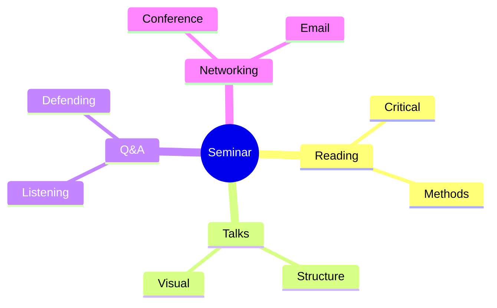
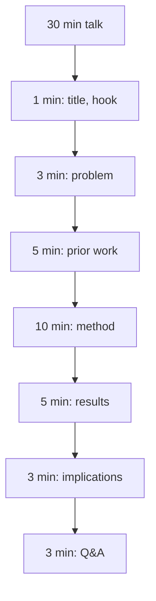
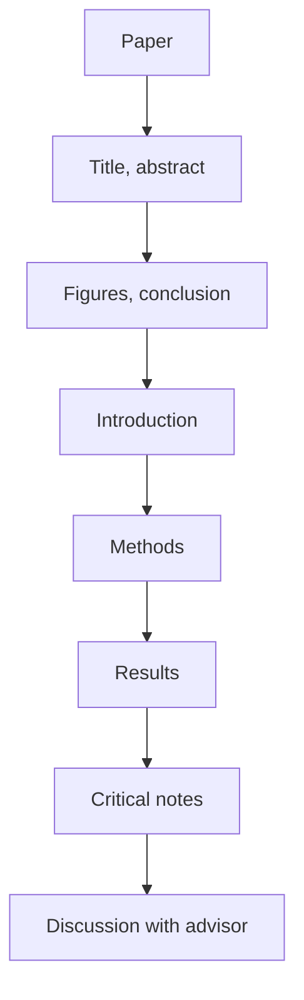
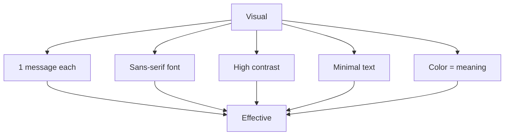
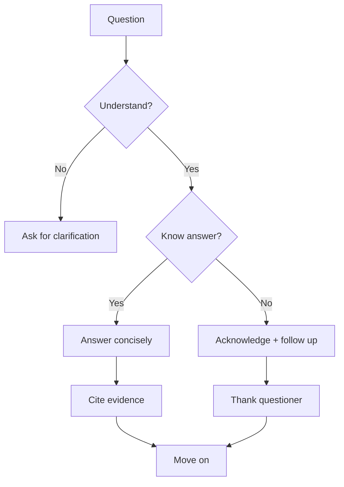

# PHYS 2080 — Physics Seminar I
> **Phase 1 BSc Elective | HKUST PHYS 2080 | Research talks, presentation skills**  
> **Bilingual 深度自學檔案 · 中英對照**

---

## 問題 1：5 個核心心智模型
1. **Literature review = map of field** — what's known, unknown
2. **Seminar = compressed research story** — motivation, method, result
3. **Critical reading** — claim vs evidence
4. **Q&A = thinking live** — defend your interpretation
5. **Networking** — community, collaboration

## 問題 2：3 個根本分歧
1. **Specialist vs generalist seminars** — depth vs breadth
2. **Pre-recorded vs live** — accessibility vs engagement
3. **Pure vs applied talks** — fundamental vs technology

## 問題 3：10 個深度問題
1. 為什麼 seminar 重要 for grad school applications?
2. 給定 research paper, identify 3 strengths, 3 weaknesses。
3. 解釋 why abstract 重要 過 detail。
4. 為什麼 visual > text in talks?
5. 給定 30-min talk, plan 5-slide structure。
6. 為什麼 Q&A reveals deep understanding?
7. 解釋 why peer review 重要 for science。
8. 給定 complex result, design analogy。
9. 為什麼 "elevator pitch" matters?
10. 解釋 why attending conferences builds network。

## 深入 1：Reading Papers
**Deep Dive I**

Title → abstract → figures → conclusion → introduction → methods → results. Identify main claim.

**Engineering:** Any research, literature review.

## 深入 2：Talk Design
**Deep Dive II**

Story arc: problem → approach → result → impact. ~1 slide/minute.

**Engineering:** Pitch, conference, defense.

## 深入 3：Visual Communication
**Deep Dive III**

Figure > table > text. Color, contrast, white space. One message per figure.

**Engineering:** Documentation, dashboard.

## 深入 4：Q&A Mastery
**Deep Dive IV**

Listen carefully, clarify, address. "I don't know" is OK.

**Engineering:** Defense, interview, presentation.

## 深入 5：Networking
**Deep Dive V**

Conferences, email etiquette, collaboration, follow-up.

**Engineering:** Career, partnerships.

## 自測 1：Grad school apps
**Answer:** Letters of rec + research + GPA + statement.  
**Engineering:** PhD application.

## 自測 2：Paper critique
**Answer:** 3+3, balanced assessment.  
**Engineering:** Peer review.

## 自測 3：Abstract
**Answer:** Hook + gap + method + key result + impact.  
**Engineering:** Paper structure.

## 自測 4：Visual > text
**Answer:** Audience attention, retention, sharing.  
**Engineering:** Communication.

## 自測 5：Talk structure
**Answer:** Title, hook, problem, method, result, implications.  
**Engineering:** Conference talk.

## 自測 6：Q&A depth
**Answer:** Probes for true understanding.  
**Engineering:** Defense prep.

## 自測 7：Peer review
**Answer:** Quality control, prior art, improves paper.  
**Engineering:** Publishing.

## 自測 8：Analogy
**Answer:** Connect to audience's prior knowledge.  
**Engineering:** Teaching.

## 自測 9：Elevator pitch
**Answer:** 30-60 sec, problem + solution + impact.  
**Engineering:** Startup, networking.

## 自測 10：Conferences
**Answer:** Build network, learn field, get hired.  
**Engineering:** Career.

## 📊 Diagram 1: Seminar Map

## 📊 Diagram 2: Talk Structure

## 📊 Diagram 3: Paper Reading

## 📊 Diagram 4: Visual Design

## 📊 Diagram 5: Q&A Strategy

## 深度總結

1. **Reading is active** — critique, not absorb
2. **Storytelling** — every talk has narrative
3. **Visual = universal** — across disciplines
4. **Q&A = test** — true understanding shown
5. **Network compounds** — over career

---

**自學建議** — Carnegie Mellon TED talk course, scientific writing texts.
