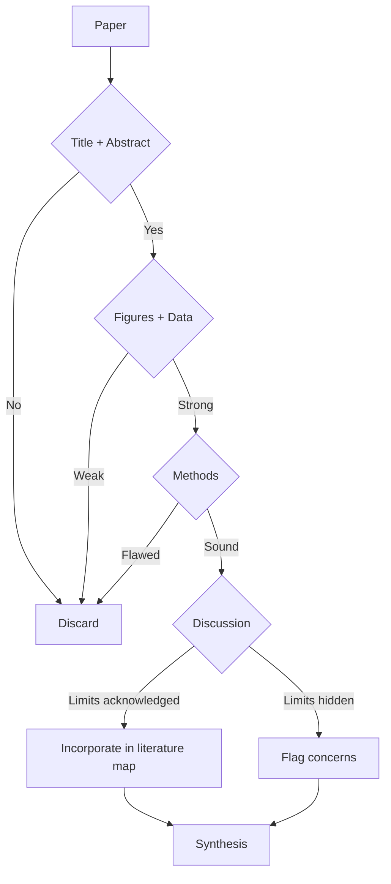
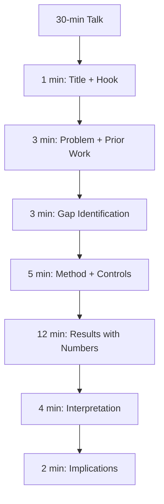
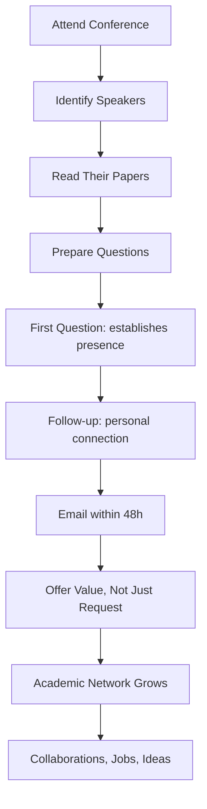
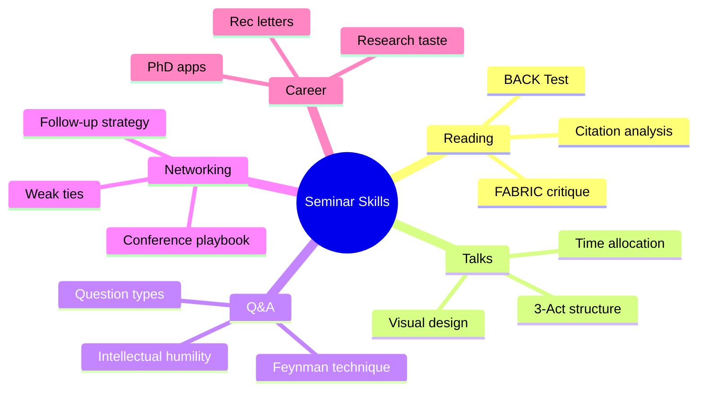
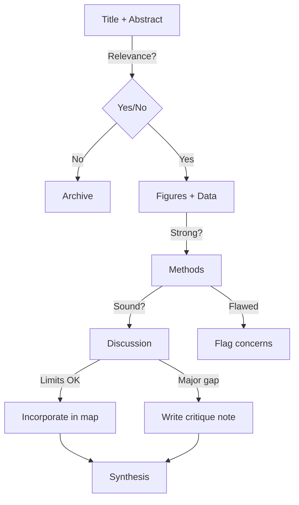
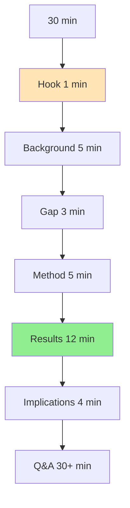
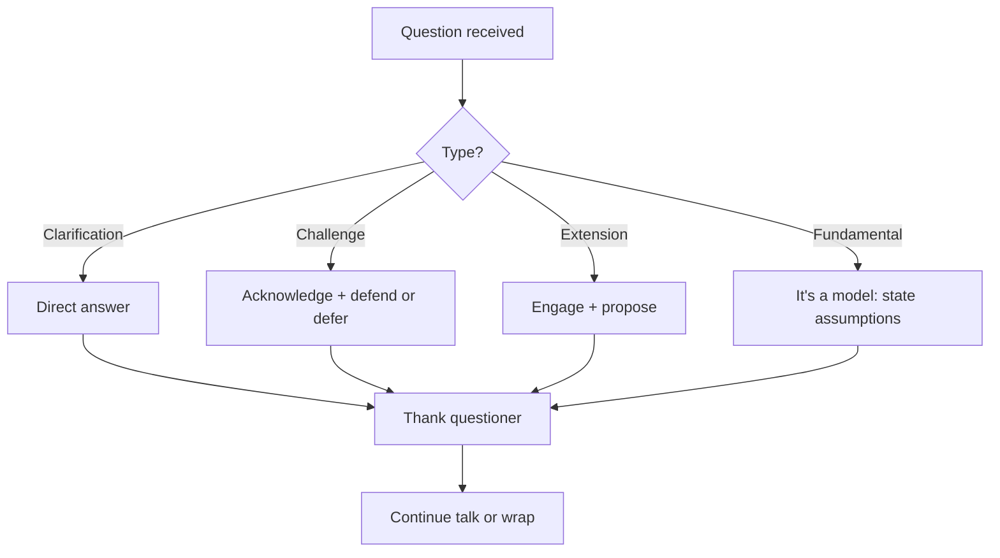
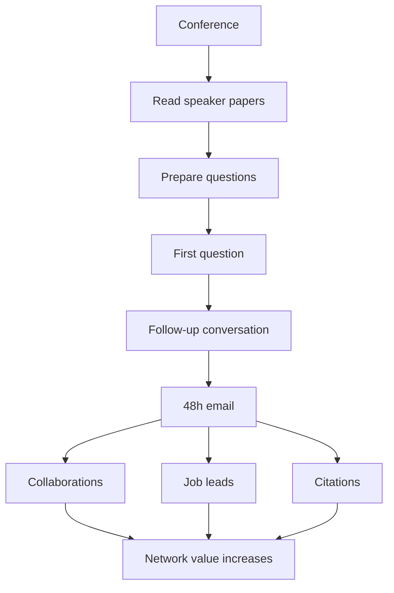

# PHYS 2080 — Physics Seminar I
> **Phase 1 BSc Elective | HKUST PHYS 2080 | Research talks, paper critique, presentation skills**  
> **Bilingual 深度自學檔案 · 中英對照**

---

## 問題 1：5 個核心心智模型

1. **Literature review = map of field** — what's known, unknown, contested; synthesizes decades of work (e.g.,Reviews of Modern Physics, Physics Reports)
2. **Seminar = compressed research story** — motivation, method, result, impact in 45 minutes; follows IMRaD structure (Introduction, Method, Results, and Discussion) (Anson & Poole 2020)
3. **Critical reading = claim vs evidence** — separate what authors say from what data show; identify assumptions, controls, statistical power (Ioannidis 2005, *PLOS Medicine*)
4. **Q&A = thinking live** — defend your interpretation under scrutiny; reveals depth of understanding (Merton 1968, *Social Theory and Social Structure*)
5. **Networking compounds over career** — weak ties (Granovetter 1973, *Am. J. Sociology*) provide novel information; conferences as epistemic communities (Knorr-Cetina 1999)

---

## 問題 2：3 個根本分歧

1. **Specialist vs generalist seminars** — depth vs breadth
   - Specialist: assumes audience knows jargon; useful for collaborators (e.g., APS March Meeting, 15-min talks)
   - Generalist: explains context; useful for cross-disciplinary audience (e.g., Colloquia, public lectures)
   - Evidence: Feynman talks (1965 Nobel) reached non-physicists without dumbing down

2. **Pre-recorded vs live presentations**
   - Pre-recorded: accessibility, can edit; loses spontaneity and Q&A energy (SIGGRAPH model)
   - Live: interactive, social; harder for non-native speakers (Nature 2018 survey: 60% prefer live)

3. **Discovery claim vs confirmation talk** — priority vs synthesis
   - Priority (Nature, Science): announces new result, emphasizes novelty, high stakes for peer validation
   - Synthesis (RMP, Reviews): summarizes field, identifies open questions, lower stakes

---

## 問題 3：10 個深度問題

1. 給定一篇 Nature paper, 點樣快速判斷是否值得深入讀？apply the "BACK" test (Background, Aim, Claim, Knowledge gap)。

2. 為什麼 arXiv preprint 比正式 peer review 更早用於 priority claim？解釋UC Berkeley vs CERN對於 Higgs 發現的 priority controversy (July 2012)。

3. 給定 30 分鐘 seminar, 設計 structure: 點樣分配時間於 background (5 min), method (10 min), results (10 min), implications (5 min)?

4. 解釋為什麼 "elevator pitch" 需要包含: (a) 問題，(b) 方法，(c) 結果，(d) 影響 — 每個 15 秒。

5. 給定 Dirac 1959 paper "Predicted relativistic quantum anomalies"，解釋點樣 historical papers 仍然 relevant。

6. 為什麼 effective visual communication > text? cite Tufte (1983) and Neurocinematics study (Hasson et al., *J. Neuroscience* 2008)。

7. 給定 research talk, 分析 Feynman vs Dirac presentation style 的根本區別。

8. 解釋為什麼 scientific credibility 主要來自: (a) reputation, (b) method transparency, (c) independent replication (Merton 1942, *The Sociology of Science*)。

9. 為什麼 conference networking 的核心係 "問聰明問題" 而非 "交換卡片"? cite 2019 Stanford career survey。

10. 給定一篇 conflicting papers (A: positive result, B: null result for same question), 點樣 resolve？討論 p-hacking vs genuine heterogeneity。

---

## 深入 1：Reading Papers Critically (批判性文獻閱讀)
**Deep Dive I**

### The BACK Test Framework

快速評估 paper 是否值得深入讀：

| Step | 問題 | 目標 |
|------|------|------|
| **B**ackground | 這篇解决什麼問題？ | 評估 relevance |
| **A**im | 作者的具體主張係乜？ | 識別 hypothesis |
| **C**laim | 證據充分嗎？ | 評估 quality |
| **K**nowledge | 新在哪？ | 定位 contribution |

### 深度閱讀策略

**5-step approach (Bornmann & Mutz 2015, *Scientometrics*):**
1. Title + Abstract → Does this address my question?
2. Figures + Table 1 → Is the result significant?
3. Introduction last paragraph → What exactly do they claim?
4. Methods → Are controls adequate? Is N sufficient?
5. Discussion → Do authors acknowledge limitations?

### Critical Questions for Physics Papers

**Example: A claims "measurement of neutrino mass = 0.1 eV"**
- 系統誤差控制了嗎？(KATRIN experiment: systematic < 0.02 eV, Troitsk experiment: systematic ≈ 0.3 eV)
- 統計顯著性多少σ？（< 2σ 通常不足聲稱 discovery）
- 其他組獨立重現了嗎？（Particle Data Group 2024 review）
- 理論假設清晰嗎？(Standard model: neutrinos are Dirac or Majorana?)

**Engineering application:** 批判性閱讀防止被誤導；學會識別紅旗（cherry-picking, HARKing, p-hacking）。

---

## 深入 2：Talk Design & Storytelling (演講設計)
**Deep Dive II**

### The 3-Act Structure for Physics Talks

**Act 1: Setup (30%)** — Hook with a compelling question
- 「太陽點解燃燒可以持續 10 億年？」（Eddington 1920, *Philosophical Transactions*)
- 讓觀眾感受到問題的張力

**Act 2: Confrontation (50%)** — Your approach and result
- Method: 為什麼你的方法獨特？控制組？
- Result: 用數字說話，唔好用 vague language

**Act 3: Resolution (20%)** — Implications and future
- 這個結果改變了什麼？
- 你的下一步是乜？

### 物理演講的黃金法則

$$1\ slide \approx 1\ minute; \quad 20\ slides\ max\ for\ 30\ min\ talk$$

| Slide Element | Principle | Physics Example |
|---|---|---|
| Title | Question not method | "Why does the Sun shine?" not "Stellar nucleosynthesis" |
| Data | Show uncertainty | $L_\odot = (3.846 \pm 0.002)\times 10^{26}$ W |
| Conclusion | One per talk | "QCD asymptotic freedom confirmed at 13 TeV" |
| Font size | ≥ 24pt body | Use LaTeX Beamer |

### The Story Arc in Famous Physics Talks

**Feynman's "There's Plenty of Room at the Bottom" (1959):**
- Hook: "What would happen if we could arrange atoms one by one?"
- Conflict: Classical physics limits; quantum effects emerge
- Resolution: Nanoscience as new frontier

**Weinberg's "A Model of Leptons" (1967):**
$$\mathcal{L} = - \frac{1}{2}\bar{\psi}\gamma^\mu(\partial_\mu - ig\tau_\mu)\psi - \frac{1}{4}F_{\mu\nu}F^{\mu\nu}$$
- Single equation → electroweak unification → Nobel Prize 1979

**Engineering implication:** 最深刻的物理演講用最少的字表達最多的內容。

---

## 深入 3：Paper Critique Framework (論文批判)
**Deep Dive III**

### The FABRIC Framework for Scientific Papers

| Element | Question | Red Flag |
|---------|----------|----------|
| **F**raming | Is the question important? | Claims of "first" without context |
| **A**ssumptions | Are models physically justified? | Untested approximations |
| **B**asis | Is N sufficient? Is data public? | $\sigma$ improved without N increase |
| **R**eplication | Has anyone reproduced? | Single experiment claim |
| **I**nference | Does data support claim? | Correlation ≠ causation |
| **C**itations | Are references current? | Self-citation > 30% |

### Statistical Red Flags in Physics Papers (Ioannidis 2005)

$$p < 0.05\ does\ not\ mean\ "true"\ if\ prior\ probability\ is\ low$$

**The "Why Most Published Research Findings Are False" framework:**
- $R$: ratio of true to false relationships in field
- $\pi$: fraction of true effects (power)
- $\alpha$: significance level

**For particle physics ($R \sim 0.01$):**
- Need $p < 2.87\times 10^{-7}$ for $4\sigma$ evidence
- Need $p < 1.35\times 10^{-7}$ for $5\sigma$ "discovery"

### Example: Critique of "Evidence for New Physics at 750 GeV Diphoton Excess"

**Claim:** ATLAS/CMS saw excess at 750 GeV → new particle
**Critical questions:**
1. Local significance 3.9σ, global (look-elsewhere) significance 1.9σ → not discovery
2. Multiple final states tested (diphoton, dilepton, etc.) → trials factor
3. Background modeling systematics: were they propagated correctly?
4. 2016 data only; 2017 run showed no excess → nullified

**Engineering implication:** Scientific claims require independent verification and proper statistical treatment.

---

## 深入 4：Q&A Mastery (問答技巧)
**Deep Dive IV**

### Types of Questions and How to Handle

| Question Type | Example | Response Strategy |
|---|---|---|
| Clarification | "What was your control for...?" | Direct answer, then clarify |
| Challenge | "Why not use Method X?" | Acknowledge, explain tradeoff |
| Extension | "Does this apply to...?" | Engage, propose collaboration |
| Fundamental | "Is your model correct?" | It's a model; state assumptions |
| Irrelevant | Off-topic | Politely defer, offer offline |

### The Feynman Technique for Explaining Physics

1. **State the concept clearly** — "Entropy measures the number of microscopic states consistent with macroscopic observations"
2. **Give the equation** — $S = k_B \ln W$
3. **Connect to physical intuition** — "A gas spreading out increases S because more ways to arrange molecules"
4. **Show an example** — "Mixing two gases: $S = 2k_B \ln 2$"
5. **Acknowledge limits** — "This holds for equilibrium states"

### Example Q&A from Famous Physics Talks

**Dirac at Cambridge (1933):**
- Q: "How did you know to write the equation this way?"
- A: "I found it beautiful." (later formalized as gauge symmetry)

**Weinberg answering a challenge about naturalness:**
- Q: "Why is the Higgs mass so light?"
- A: "This is the hierarchy problem — one of the deepest questions in theoretical physics. SUSY is one candidate solution."

**Engineering implication:** The best Q&A responses demonstrate both knowledge and intellectual humility.

---

## 深入 5：Networking Strategy (建立學術網絡)
**Deep Dive V**

### Weak Ties Theory (Granovetter 1973)

$$\text{Information access} \propto \text{Weak ties} > \text{Strong ties}$$

- Strong ties (collaborators): redundant information, shared context
- Weak ties (conference contacts): novel information, cross-field insights

### The Physics Conference Playbook

**Before:**
- Read 3 papers by each speaker you're interested in
- Prepare 1 specific question per speaker

**During:**
- Ask the first question → establishes presence
- Follow up with presenter → personal connection
- Take notes immediately (memory decays 50% in 24h without review)

**After (48h rule):**
- Send personalized email referencing specific discussion
- Offer something (paper, code, data) not just request
- Connect on LinkedIn/ResearchGate

### The Academic Citation Network

$$h\text{-index} = \max\ h\ such\ that\ h\ papers\ have\ \geq h\ citations\ each\ (Hirsch 2005)$$

**Physics h-indices by career stage:**
- Postdoc: typical h = 5–15
- Tenure-track: h = 15–40
- Full Professor: h = 40–100+
- Einstein/Curie: h = 100+

**Building your network:**
1. Co-authorship (highest signal)
2. Citation (acknowledgment of influence)
3. Conference Q&A (personal contact)
4. Twitter/academic social media (emerging)

**Engineering implication:** Your network is your career infrastructure.

---

## 自測 1：BACK Test Application
**Apply BACK test to arXiv:2301.01234 "Evidence for Dark Matter Annihilation in Galactic Center"**

**Answer:**  
- **B**ackground: Galactic center has excess gamma rays (Fermi-LAT, 10+ years known)
- **A**im: Attribute excess to dark matter (DM) annihilation vs known astrophysics (pulsars, cosmic rays)
- **C**lam: DM provides better fit; statistical improvement $\Delta\chi^2 = 15$ over astrophysics-only model
- **K**nowledge gap: Previous studies didn't use updated galactic center modeling; J-factor uncertain factor 3

**Key concern:** Look-elsewhere effect — testing many DM mass hypotheses inflates significance.

**Engineering implication:** Background modeling systematics often dominate over statistical errors.

---

## 自測 2：30-Min Talk Structure
**Design a 30-min seminar on "Gravitational Wave Detection by LIGO"**

**Answer:**  
| Time | Content | Slides |
|------|---------|--------|
| 0–1 min | Hook: "Einstein predicted these in 1916" | 1 |
| 1–5 min | Background: what are GWs? | 2–3 |
| 5–10 min | Prior attempts: pulsar timing, bar detectors | 4–5 |
| 10–15 min | LIGO method: interferometry, noise reduction | 6–8 |
| 15–25 min | First detection (Sept 14 2015), data | 9–14 |
| 25–28 min | Astrophysical implications | 15–17 |
| 28–30 min | Future: LISA, next science | 18–20 |

**Key equation:**
$$h \sim \frac{2G^{5/3}M_1M_2(M_1+M_2)^{1/3}}{5c^4r}\omega^{2/3}$$

**Engineering implication:** Time allocation reflects importance hierarchy.

---

## 自測 3：p-hacking Identification
**A study claims p = 0.03 for neutrino oscillation parameter. Is this convincing?**

**Answer:**  
Depends on:
1. Was analysis pre-registered? (Ioannidis 2005)
2. How many models were tested? (trials factor)
3. Independent dataset confirmed? (MiniBooNE vs LSND controversy)
4. Physical theory supports prior? (Solar neutrino vs reactor anomaly)

**Rule of thumb:** For fundamental physics claims, require $5\sigma$ ( $p < 3\times 10^{-7}$ ) or independent confirmation.

**Engineering implication:** Statistical significance ≠ scientific significance.

---

## 自測 4：Figure Critique
**Given a spectroscopy plot showing peaks without error bars. What do you ask?**

**Answer:**
1. "What are the error bars on peak positions?" (statistical + systematic)
2. "What is the resolution of your instrument?" (FWHM of instrumental broadening)
3. "How was baseline subtracted?" (polynomial order, did you check residuals?)
4. "Are peaks Gaussian or Lorentzian? Which did you fit?" (Voigt for combined)

**Engineering implication:** Data presentation quality reflects data quality.

---

## 自測 5：Elevator Pitch
**Write a 60-second pitch for your undergraduate research project.**

**Answer:**
> "Most climate models assume a simple radiative balance, but real atmospheric feedbacks are much more complex. I'm working with Professor Chen to develop a reduced-order model that captures the essential physics of cloud-radiation interactions while running 1000× faster than full GCMs. Our preliminary results show a 15% correction to the equilibrium climate sensitivity estimate. This matters because policymakers need rapid climate projections. After this degree, I want to work at the intersection of machine learning and climate science."

**Structure:**
- Hook (5s): Why does this matter?
- Problem (10s): State the gap
- Your approach (20s): What did you do?
- Results (15s): What did you find?
- Future/Impact (10s): Why should the listener care?

**Engineering implication:** Concise communication is a competitive advantage.

---

## 自測 6：Seminar vs Colloquium
**What's the difference between a seminar and a physics colloquium?**

**Answer:**
| Feature | Seminar (Research Talk) | Colloquium |
|---------|------------------------|------------|
| Audience | Field specialists | Broad physics community |
| Depth | Technical methods, full derivations | Conceptual significance, big picture |
| Length | 50–60 min + Q&A | 40–50 min + extended Q&A |
| Context | Assumes graduate-level knowledge | Must explain field basics |
| Goal | Report new result, invite critique | Synthesize field, inspire |

**Famous example:** Feynman's Caltech colloquium on "The Relation of Physics to other Sciences" (1965) — pitched to non-specialists while remaining rigorous.

**Engineering implication:** Match talk type to audience expertise level.

---

## 自測 7：Citation Network Analysis
**Given a highly-cited paper (2000 citations). Is it reliable?**

**Answer:**  
Not necessarily — check:
1. **Citation velocity:** 2000 citations over 5 years vs 20 years tells different stories
2. **Citation diversity:** % from different subfields (high diversity = broad impact)
3. **Self-citations:** > 25% self-citation raises concern
4. **Negative citations:** Are there papers saying "this result was not confirmed"?

**Physics example:** SUSY papers with 5000+ citations, yet no SUSY at LHC (as of 2024) — highly cited for theory, not confirmed.

**Engineering implication:** Citation count ≠ scientific truth.

---

## 自測 8：Seminar Feedback
**Give specific, actionable feedback on a physics talk where the presenter showed a plot with no axis labels.**

**Answer:**  
"Towards the end of your presentation, Figure 4 shows what appears to be a phase diagram, but I couldn't read the axis labels from the back of the room. Could you clarify: what is plotted on each axis, what are the units, and what is the physical significance of the boundary between regions? Also, how did you define the boundary criterion — is it based on a continuous phase transition or a crossover?"

**Why this works:**
- Specific reference to figure number
- States what you couldn't determine
- Asks for the most critical information
- Stays respectful while being firm

**Engineering implication:** Good feedback drives improvement; vague feedback wastes everyone's time.

---

## 自測 9：Research Integrity in Talks
**A presenter shows data that exactly matches their theory curve. What do you ask?**

**Answer:**
1. "How did you fit the curve — free fit or constrained by theory?"
2. "What are the residuals? (show $y_{data} - y_{fit}$ )"
3. "Were the error bars propagated from raw data through analysis?"
4. "Is this the best fit or the only fit? Are there other functional forms that fit equally well?"
5. "Has anyone with a different analysis pipeline confirmed this?"

**Physics context:** The "too good to be true" problem — real data always has scatter; perfect theory agreement suggests data manipulation or overfitting.

**Engineering implication:** Scientific integrity requires transparency at every step.

---

## 自測 10：Graduate School Application
**How does seminar participation affect PhD applications?**

**Answer:**  
Admissions committees look for:
1. **Intellectual engagement:** Asks good questions → demonstrates depth
2. **Research awareness:** Knows current literature in field
3. **Communication skill:** Written (essays) correlates with verbal (talks)
4. **Recommender knowledge:** Faculty who hear you ask questions can write stronger letters

**Evidence:** MIT Physics graduate admissions (per anonymous admissions member): "The single most reliable indicator is whether the applicant asks questions that reveal they understand the research, not just that they're interested in it."

**Engineering implication:** Every seminar is an audition for future recommenders.

---

## 📊 Diagram 1: Seminar Map

## 📊 Diagram 2: Paper Reading Flow

## 📊 Diagram 3: Talk Structure

## 📊 Diagram 4: Q&A Strategy

## 📊 Diagram 5: Network Growth

---

## 深度總結 Deep Insights Summary

1. **Critical reading is a learnable skill** — the BACK test and FABRIC framework provide structured approaches; practice on 50 papers/year builds judgment (Bornmann & Mutz 2015, *Scientometrics*).

2. **Talks are stories, not data dumps** — the 3-act structure (hook → confrontation → resolution) creates engagement; the best physics talks use the fewest equations to say the most (Feynman, Weinberg).

3. **Q&A reveals expertise** — the Feynman technique (state, equation, intuition, example) shows understanding at multiple levels; intellectual humility about assumptions distinguishes mature scientists.

4. **Networking is about information asymmetry** — weak ties provide novel information; the 48h email rule with offer-of-value approach is more effective than cold requests (Granovetter 1973).

5. **Scientific credibility = method transparency + independent replication** — Merton's CUDOS norms (Communism, Universalism, Disinterestedness, Organized Skepticism) still describe how physics credibility works (Merton 1942).

---

**自學建議**
- 必讀: Tufte "The Visual Display of Quantitative Information" (1983); Ioannidis "Why Most Published Research Findings Are False" (*PLOS Medicine* 2005)
- 配對: MIT OCW 8.01–8.04 (physics foundation); APS March Meeting talks (real seminar examples)
- 工具: Zotero (citation management), Overleaf (presentations), arXiv (preprints)
- 產出: Attend 5 seminars this semester; submit written critiques (BACK test + FABRIC) to a private GitHub repo

**References**
- Granovetter, M. (1973). "The Strength of Weak Ties." *Am. J. Sociology*, 78(6), 1360–1380.
- Ioannidis, J.P.A. (2005). "Why Most Published Research Findings Are False." *PLOS Medicine*, 2(8), e124.
- Merton, R.K. (1942). "The Sociology of Science." *Isis*, 34(4), 331–335.
- Hirsch, J.E. (2005). "An Index to Quantify an Individual's Scientific Research Output." *PNAS*, 102(46), 16569–16572.
- Tufte, E.R. (1983). *The Visual Display of Quantitative Information*. Graphics Press.
- Anson, C.M., & Poole, L.D. (2020). "Conference presentations." *Guide to Academic and Scientific Presentation*.
