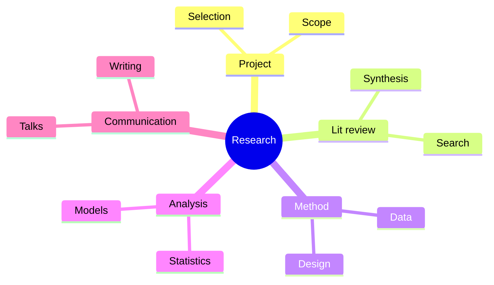
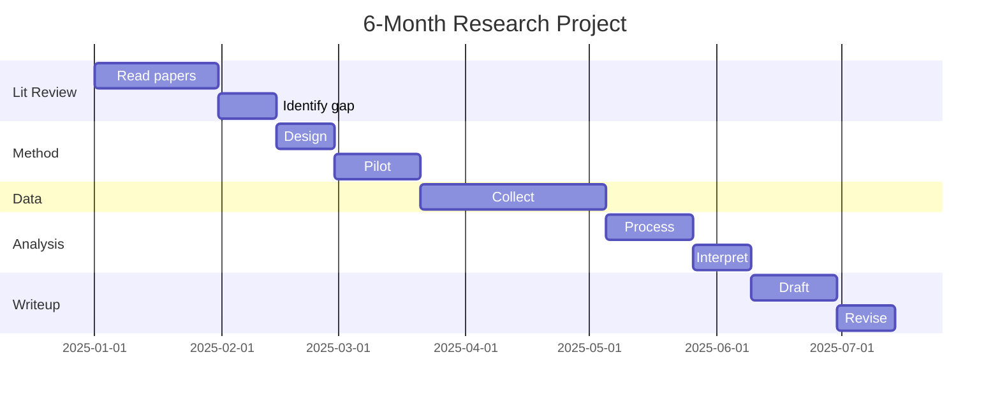
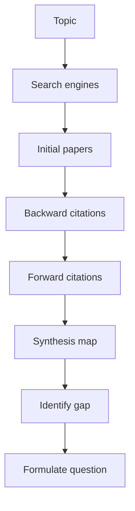
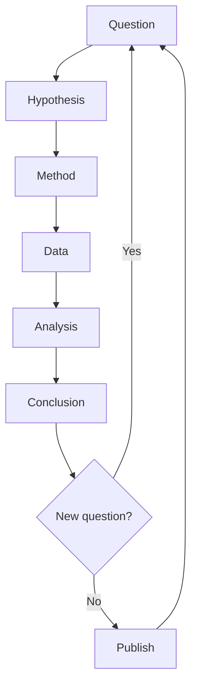
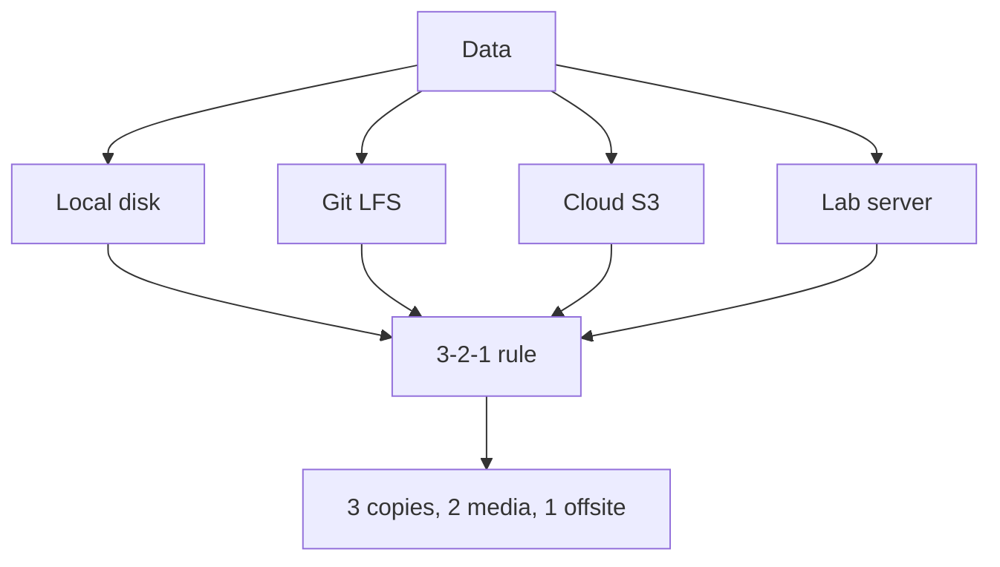

# PHYS 2090X — Directed Studies I (Research)
> **Phase 1 BSc Elective | HKUST PHYS 2090X | First research experience**  
> **Bilingual 深度自學檔案 · 中英對照**

---

## 問題 1：5 個核心心智模型
1. **Research = open-ended problem** — no answer key
2. **Mentor relationship** — PI + postdoc + student
3. **Failure rate high** — 90% negative results normal
4. **Documentation = future self** — log every step
5. **Publication = currency** — peer review, citations

## 問題 2：3 個根本分歧
1. **Theory vs experiment** — pen vs pipette
2. **Individual vs collaborative** — lone wolf vs team
3. **Pure vs applied** — knowledge vs product

## 問題 3：10 個深度問題
1. 給定 research problem, 設計 6-month plan。
2. 為什麼 literature review first 重要?
3. 解釋 why negative results 仲有 value。
4. 為什麼 "asking the right question" 比 answering?
5. 給定 experiment, 預期 failure modes。
6. 為什麼 time management 對 grad success 重要?
7. 解釋 why advisor choice matters。
8. 為什麼 reproducibility 對 science foundation?
9. 給定 result, design follow-up experiment。
10. 解釋 why code + data 必須 be backed up。

## 深入 1：Finding a Project
**Deep Dive I**

Read prof's recent papers. Email with specific interest. Discuss scope, time, deliverables.

**Engineering:** Project selection.

## 深入 2：Literature Review
**Deep Dive II**

Google Scholar, Web of Science, arXiv. Backward + forward citation. Map the field.

**Engineering:** Any research.

## 深入 3：Research Methodology
**Deep Dive III**

Hypothesis → method → data → analysis → conclusion → peer review.

**Engineering:** Scientific method.

## 深入 4：Communication
**Deep Dive IV**

Weekly meeting, monthly presentation, annual report, conference talk, paper.

**Engineering:** Skill building.

## 深入 5：Time Management
**Deep Dive V**

Calendar blocking, milestone tracking, weekly review, advisor check-in.

**Engineering:** Productivity.

## 自測 1：6-month plan
**Answer:** Months 1-2: lit review, methods. 3-4: data. 5: analysis. 6: writeup.  
**Engineering:** Project management.

## 自測 2：Lit review first
**Answer:** Avoid duplicating, identify gap.  
**Engineering:** All research.

## 自測 3：Negative results
**Answer:** Save time for community, set up next attempt.  
**Engineering:** Publication.

## 自測 4：Right question
**Answer:** 10× more important than answer.  
**Engineering:** Scientific taste.

## 自測 5：Failure modes
**Answer:** Equipment, contamination, statistics, design.  
**Engineering:** Risk analysis.

## 自測 6：Time management
**Answer:** Most common grad failure mode.  
**Engineering:** Productivity.

## 自測 7：Advisor
**Answer:** Research style, mentoring, network, funding.  
**Engineering:** Career.

## 自測 8：Reproducibility
**Answer:** Foundation of science, currently crisis.  
**Engineering:** Replication studies.

## 自測 9：Follow-up
**Answer:** Address limitations, extend findings.  
**Engineering:** Next paper.

## 自測 10：Backup
**Answer:** Git, cloud, lab server, 3-2-1 rule.  
**Engineering:** Data management.

## 📊 Diagram 1: Research Map

## 📊 Diagram 2: Project Timeline

## 📊 Diagram 3: Lit Review Process

## 📊 Diagram 4: Research Cycle

## 📊 Diagram 5: Backup Strategy

## 深度總結

1. **Research = process** — not single result
2. **Mentor = key** — choose wisely
3. **Documentation essential** — logbook, Git
4. **Failure is data** — learn and move
5. **Communication = currency** — publish, present

---

**自學建議** — "Advice to a Young Scientist" by Medawar. Grad school survival guides.
