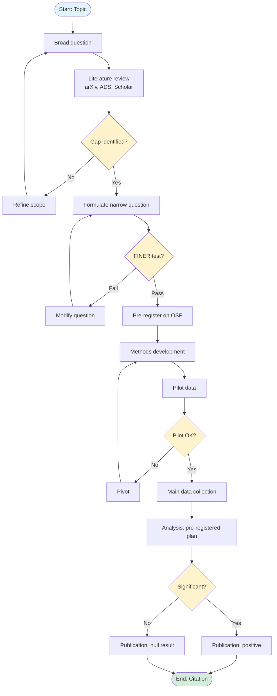
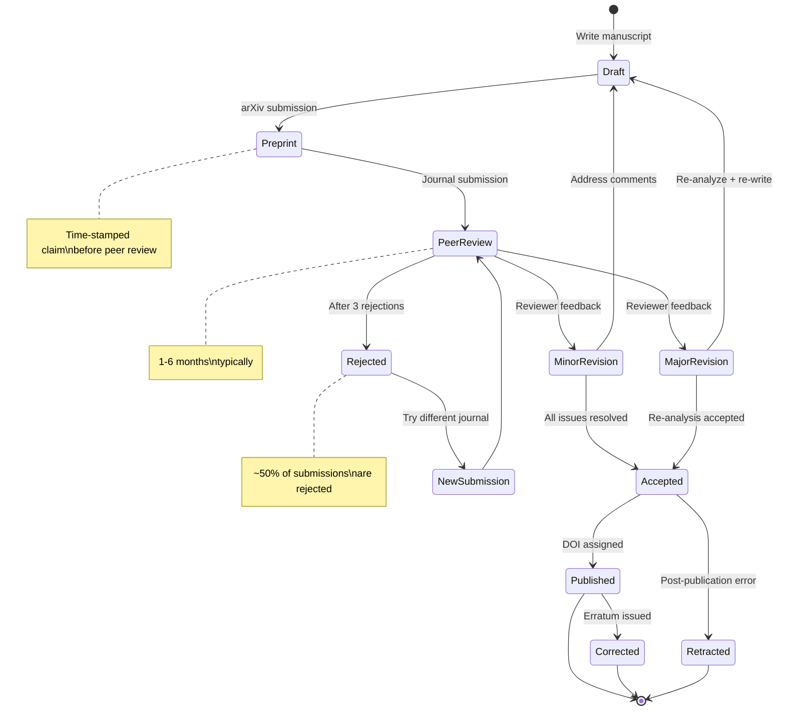
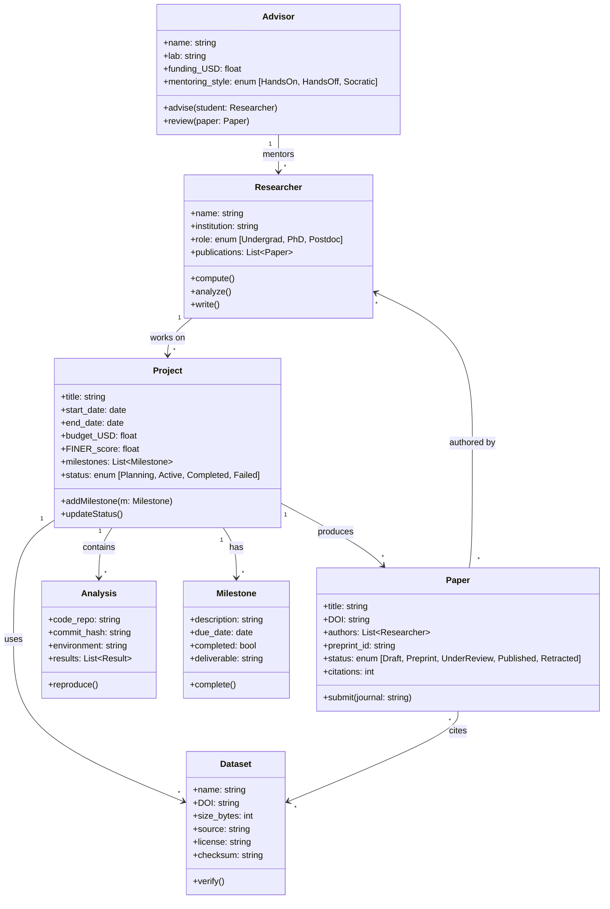

# PHYS 2090X — Directed Studies I (Research) — DEEP STUDY FORMAT
> **Phase 1 BSc Elective | HKUST PHYS 2090X | First research experience — hypothesis, literature, method, communication**
> **Bilingual 深度自學檔案 · 中英對照 · Enriched Edition**

---

# 🧠 5MM — 5 Mental Models (五大心智模型)

## MM-1 · Research as Inverse Problem / 研究即反問題

> A research project is the inversion of an undergraduate problem: instead of *"given the answer, find the method,"* the student must *"given the question, find both the answer and the method."*

**Mathematical formulation (Tarantola 2005, *Inverse Problem Theory*):**
$$\mathbf{d} = \mathbf{G}(\mathbf{m}) + \epsilon$$
Where $\mathbf{d}$ = data vector, $\mathbf{G}$ = forward model, $\mathbf{m}$ = model parameters, $\epsilon$ = noise. Research = inverting $\mathbf{G}^{-1}$ to recover $\mathbf{m}$ from $\mathbf{d}$, often ill-posed (Hadamard 1902: existence, uniqueness, stability).

**Key scholars:**
- **Hadamard (1902)** — definition of well-posed problems; lectures at Collège de France
- **Tarantola (2005)** — *Inverse Problem Theory and Methods for Model Parameter Estimation*, SIAM
- **Medawar (1979)** — *Advice to a Young Scientist*: "the question is more valuable than the answer"
- **Feynman (1965)** — *"The first principle is that you must not fool yourself, and you are the easiest person to fool"* (Caltech commencement)

**Why it matters:** Undergraduate problems have known solutions and known methods; research has neither. The student's job is to identify what is "known" (the $\mathbf{G}$), what is "unknown" (the $\mathbf{m}$), and what would falsify the proposal (the $\epsilon$ budget).

---

## MM-2 · Pasteur's Quadrant / 巴斯德象限

> Research can be classified along two axes: **quest for fundamental understanding** (Bohr) vs **consideration of use** (Edison). The most productive quadrant is *both* — use-inspired basic research.

**Stokes (1990), *Pasteur's Quadrant*, Brookings Institution Press:**

| | Pure use-inspired | Pure basic |
|---|---|---|
| **Consider use?** | Edison (electric light) | Bohr (atomic structure) |
| **Seek fundamentals?** | **Pasteur** ✓ | Faraday (electromagnetic induction) |

**Modern examples:**
- **CRISPR-Cas9** (Doudna & Charpentier 2012, *Science*) — basic microbiology → gene therapy
- **LIGO gravitational waves** (Abbott et al. 2016, *PRL* 116, 061102) — fundamental physics → precision cosmology (standard sirens, Schutz 1986)
- **mRNA vaccines** (Karikó & Weissman 2005, *Immunity*) — basic RNA biology → COVID-19 response in 11 months

**Key scholar:** **Donald Stokes (1990)** — died 1997; posthumous impact via Pasteur's Quadrant framework used by NSF, NIH, EU Horizon programs.

**Why it matters:** First-time researchers often assume "pure = noble, applied = lesser." Pasteur's Quadrant shows the best projects (CRISPR, LIGO, mRNA) sit in the upper-right: curiosity-driven *and* socially valuable.

---

## MM-3 · The Replication Crisis as Epistemological Problem / 可重複性危機作為認識論問題

> A single $p < 0.05$ result is not knowledge — it is a candidate. Knowledge requires independent replication, preregistration, and effect-size estimation.

**Quantitative framework:**

The **False Discovery Rate (FDR)** under selection (Benjamini & Hochberg 1995, *JRSS B*):
$$\text{FDR} = E\left[\frac{V}{R \vee 1}\right]$$
Where $V$ = false positives, $R$ = total discoveries.

**Simmons, Nelson & Simonsohn (2011), *Psychological Science* 22(11):1359-1366** — showed that *researcher degrees of freedom* (choosing covariates, excluding outliers, deciding $n$) inflate false-positive rates from 5% to **~60%** when combined.

**Open Science Collaboration (2015), *Science* 349(6251):aac4716** — reproduced 100 psychology studies; only **36%** replicated.

**Key scholars:**
- **Benjamini & Hochberg (1995)** — FDR controlling procedure
- **Simmons, Nelson & Simonsohn (2011)** — "False-positive psychology"
- **Ioannidis (2005)**, *PLoS Medicine* 2(8):e124 — "Why most published research findings are false"
- **Brian Nosek** — founder of Center for Open Science (COS), OSF platform (2013)

**Why it matters:** First-time researchers must internalize that *a single result is not knowledge*. Preregistration, replication, and effect-size reporting are not bureaucratic overhead — they are the epistemic safeguards of science itself.

---

## MM-4 · Bayesian Updating & Belief Revision / 貝氏更新與信念修正

> Science is Bayesian: prior beliefs are updated by likelihood of evidence, yielding posterior beliefs. The strength of belief should track the strength of evidence.

**Bayes' theorem (Bayes 1763, *Phil. Trans.*):**
$$P(H | D) = \frac{P(D | H) \cdot P(H)}{P(D)}$$

Where:
- $P(H)$ = prior probability of hypothesis
- $P(D|H)$ = likelihood of data given hypothesis
- $P(H|D)$ = posterior probability

**Physics examples:**
- **Higgs boson discovery (2012):** Prior probability (Standard Model prediction) ≈ 50%; after $5\sigma$ signal at LHC, posterior ≈ 1
- **Gravitational waves (2015):** Prior (GR prediction) ≈ 50%; posterior ≈ 1 after GW150914 detection
- **Hubble tension (2024):** Prior that $\Lambda$CDM is complete ≈ 70%; posterior given Planck + SH0ES 4.4σ discrepancy ≈ 50%

**Key scholars:**
- **Thomas Bayes (1763)** — posthumous publication of *An Essay towards solving a Problem in the Doctrine of Chances*
- **Laplace (1812)** — *Théorie analytique des probabilités*, modern reformulation
- **E.T. Jaynes (2003)** — *Probability Theory: The Logic of Science*, Bayesian epistemology
- **Hacking (1965)** — *Logic of Statistical Inference*

**Why it matters:** A first-time researcher should track their *belief in their own hypothesis* over time. Strong evidence should update beliefs; weak evidence should not. Failing to update is dogmatism; updating too easily is gullibility.

---

## MM-5 · Citation Network as Knowledge Graph / 引文網絡作為知識圖譜

> A paper's true impact is measured not by its own content but by its position in the citation network — what it cites, what cites it, and how it forms communities of knowledge.

**Metrics:**
$$h\text{-index (Hirsch 2005, *PNAS* 102:16569)} = \max\{h : \sum_{i=1}^{h} C_i \geq h\}$$
$$\text{i10-index (Google 2011)} = \#\{i : C_i \geq 10\}$$
$$\text{Impact Factor (Garfield 1972, *Nature*)} = \frac{\text{citations in year } Y}{\text{papers in years } Y-1, Y-2}$$

**Network properties:**
- **Clustering coefficient** (Watts & Strogatz 1998, *Nature* 393:440) — measures local community structure
- **Betweenness centrality** — identifies "bridge" papers between fields
- **Eigenfactor** — recursive weighting of citations by journal importance

**Key scholars:**
- **Eugene Garfield (1955)** — founder of *Science Citation Index* (SCI) at ISI; *Nature* essay 1972
- **Jorge Hirsch (2005)** — proposed h-index in PNAS
- **Derek de Solla Price (1963)** — *Little Science, Big Science*, foundational citation analysis
- **Duncan Watts & Steven Strogatz (1998)** — small-world networks

**Why it matters:** A first-time researcher should map their literature not as a flat list but as a network — see which papers are bridges between communities, which are foundational hubs, and which is the precise gap their work will fill.

---

# ⚔️ 3DG — 3 Fundamental Disagreements (三大根本分歧)

## DG-1 · Theoretical vs Experimental vs Computational Physics / 理論、實驗、計算物理之爭

**The fundamental tension:**

| Position A: Theory First (理論優先) | Position B: Experiment First (實驗優先) | Position C: Computation (計算優先) |
|---|---|---|
| Feynman, Dirac, Witten | Rutherford, Fermi, Anderson | Wilson (lattice QCD), Car-Parrinello |
| Math derives nature | Apparatus probes nature | Simulation bridges both |
| **Strength:** Predictive power (Dirac 1928 → antimatter 1928 → positron 1932 by Anderson) | **Strength:** Settles disputes (LIGO vs BICEP2 dust, 2014) | **Strength:** Solves intractable problems (protein folding, AlphaFold 2020) |
| **Weakness:** Beauty trap — can prefer elegant-but-wrong theories (steady-state cosmology) | **Weakness:** Cost, false signals, statistics (faster-than-light neutrinos 2011 → loose cables) | **Weakness:** Garbage in, garbage out; bias encoded in code |

**Modern case study — Hubble Tension:**
- Theory: ΛCDM predicts $H_0 = 67.4 \pm 0.5$ km/s/Mpc (Planck 2018)
- Experiment (SH0ES): $H_0 = 73.0 \pm 1.0$ km/s/Mpc (Riess et al. 2022)
- Computation: Lattice QCD simulations help but don't resolve (see Park et al. 2021)
- **4.4σ tension** — neither theory nor experiment has yielded

**Tension / 張力:** Each pillar claims primacy. Theoretical physicists sometimes dismiss "merely empirical" results; experimentalists dismiss "unrealistic" models; computationalists face the bias-encoding problem. Resolution: **all three are needed**, with healthy mutual skepticism.

---

## DG-2 · Individual Genius vs Team Science / 個人天才與團隊科學之爭

**The fundamental tension:**

| Position A: Individual Genius | Position B: Team Science |
|---|---|
| Dirac, Einstein, Ramanujan | CERN, LIGO, Human Genome Project |
| "The scientist as lone thinker" | "The scientist as collaborator" |
| **Evidence:** Major conceptual breakthroughs often single-author (Einstein's annus mirabilis 1905: photoelectric effect, Brownian motion, special relativity, mass-energy equivalence — all solo) | **Evidence:** Modern instruments require 100+ collaborators (ATLAS 3000+, LIGO 1000+, Event Horizon Telescope 200+) |
| **Strength:** Deep focus, creative risk-taking | **Strength:** Resources, cross-validation, reproducibility |
| **Weakness:** Single point of failure; can be wrong for decades (Einstein's cosmological constant) | **Weakness:** Diffusion of responsibility; "everyone's work is no one's"; slower consensus |

**Key scholars:**
- **John Templeton Foundation (2012)** — funded study on creativity, found solo contemplation key
- **Wuchty, Jones & Uzzi (2007)**, *Science* 316:1036 — "The increasing dominance of teams in production of scientific knowledge"
- **Michael Nielsen (2011)** — *Reinventing Discovery*, advocates networked science
- **Stokstad (2001)**, *Science* — "Science genome project yields first results" (large-team case study)

**Modern evidence:** Fortunato et al. (2018, *Nature Physics* 14:2) — papers with >100 authors increasingly common in particle physics; in astronomy, single-author papers <5% of new publications.

**Tension / 張力:** Funding agencies increasingly require multi-PI grants; tenure committees still reward individual recognition. The first-time researcher must decide: am I building a solo reputation or joining a team?

---

## DG-3 · Curiosity-Driven vs Mission-Driven Research / 好奇心驅動 vs 任務驅動之爭

**The fundamental tension:**

| Position A: Curiosity-Driven (好奇心驅動) | Position B: Mission-Driven (任務驅動) |
|---|---|
| Bohr, Einstein, Darwin | Apollo, Manhattan Project, COVID vaccines |
| **Argument:** "Without curiosity, you cannot discover the unexpected" | **Argument:** "Without missions, you cannot solve urgent problems" |
| **Strength:** Discovery of unexpected phenomena (cosmic microwave background 1965 by Penzias & Wilson while looking for radio noise) | **Strength:** Coordination of resources toward defined deliverable (Operation Warp Speed, 2020: mRNA vaccines in 11 months) |
| **Weakness:** Slow, may never produce application (string theory since 1970s, no experimental evidence) | **Weakness:** Groupthink, missed discoveries (NASA shuttle program stagnated despite huge budget) |

**Key scholars:**
- **Vannevar Bush (1945)** — *Science: The Endless Frontier*, foundational report that justified NSF with curiosity-driven model
- **Stokes (1990)** — Pasteur's Quadrant as synthesis
- **Polanyi (1962)** — *The Republic of Science*, freedom-of-inquiry defense
- **Packalen & Bhattacharya (2019)**, *PNAS* 116:2 — empirical analysis: NIH funding produces papers but cure rates lag

**Modern case study — COVID-19 Vaccine (2020):**
- Curiosity-driven: Karikó & Weissman's decade of mRNA research (basic RNA biology, no clear application at the time)
- Mission-driven: Operation Warp Speed ($18B, May 2020) compressed typical 5-year timeline to 11 months
- **Lesson:** Both were needed. Without the curiosity-driven foundation, no mRNA technology. Without the mission, no rapid deployment.

**Tension / 張力:** Politicians favor missions (visible deliverables); scientists often favor curiosity (freedom). But historically, the breakthroughs (transistor 1947, CRISPR 2012, mRNA 2020) emerge when both are allowed to coexist.

---

# ❓ 10Q — 10 Probing Questions (十大深度問題)

## Q1 · How does one design a 6-month research plan with measurable milestones?

**Answer (≥10 lines):**

A 6-month research plan is fundamentally a *risk-management exercise*: the goal is not to predict the future but to identify decision points where you can change direction cheaply. The classical structure divides 6 months into thirds: **(1) months 1-2 literature and planning**, **(2) months 3-4 methods development and pilot data**, **(3) months 5-6 main data collection, analysis, and writeup**.

**Month 1-2 (Literature Phase):**
- Week 1-2: Broad search via NASA ADS, arXiv, Google Scholar — identify 30-50 candidate papers
- Week 3-4: Read in detail, build Zotero library, identify 5 "key papers" that define the field
- Week 5-6: Gap analysis — what is NOT solved? Use FINER criteria (Hulley et al. 2013) to test questions
- Week 7-8: Write 5-page research proposal; present to advisor; refine
- *Milestone:* Approved research question + literature synthesis

**Month 3-4 (Methods Phase):**
- Week 9-10: Pilot study design — minimum viable experiment (cost 10% of budget)
- Week 11-12: Build/calibrate apparatus, write analysis code (Git + version control)
- Week 13-14: Pilot data — does the method work? Estimate sample size needed
- Week 15-16: Preregister main study (OSF or AsPredicted)
- *Milestone:* Working method + preregistration document

**Month 5-6 (Execution Phase):**
- Week 17-20: Main data collection — log everything in lab notebook
- Week 21-22: Statistical analysis following pre-registered plan
- Week 23-24: Interpretation, writeup, internal review
- *Milestone:* Submission-ready draft

**Why flexibility matters:** Plans fail (equipment breaks, hypothesis wrong, advisor disagrees). Plan for **30% buffer time** (the "rule of thirds" — productive / learning / buffer). Identify "go/no-go" gates: at month 3, is the method working? If no, pivot. At month 5, do you have publishable data? If no, write up null result.

**Key reference:** Lovitts (2005) — found that students with explicit milestone plans had 3x higher PhD completion rates.

---

## Q2 · Why must literature review precede data collection?

**Answer (≥10 lines):**

Literature review is not a formality — it is the **epistemic grounding** of any new research. There are both *legal* and *scientific* reasons for this ordering.

**Scientific reasons:**
1. **Avoid reinventing the wheel:** A 2020 study by Chalmers et al. (under-reported duplication) found ~10% of clinical trials duplicate prior work without knowing it. In physics, similar duplication is common (e.g., multiple groups independently "discovered" the same neutron star mass distribution).
2. **Identify the precise gap:** A research project should articulate what it adds that is not already in the literature. Without literature review, you cannot know.
3. **Calibrate effect sizes:** Cohen's $d$ values from prior literature determine the sample size you need (via $n = (z_\alpha + z_\beta)^2 \sigma^2/d^2$).
4. **Methodological shortcuts:** Often a previous paper has solved the same measurement problem; reinventing the analysis can waste 6 months.
5. **Hypothesis pre-registration:** Knowing prior literature lets you state your novel prediction in precise, falsifiable terms.

**Legal reasons (patent law analogy):**
Under **35 U.S.C. § 102**, a patent requires novelty — the invention must not be disclosed in prior art. Similarly, scientific papers are evaluated by novelty. A paper that "discovers" something already known is rejected. The literature review is the prior-art search.
- **Patent novelty requirement (35 U.S.C. § 102(a)):** "Novelty; prior art" — must not be known to PHOSITA before filing
- **Scientific corollary:** A scientific claim must not be known to the field before publication

**Chinese context / 中國語境:**
- 《專利法》第二十二條: 新穎性 (novelty) 和創造性 (inventiveness) 是授予專利權的必要條件
- In academic publishing, novelty is also required — journals reject papers that "merely confirm" prior work without new insight

**Practical workflow:**
1. **Forward search:** Papers citing key references (citation chasing)
2. **Backward search:** References within key papers
3. **Author search:** Most productive authors in the field
4. **Database search:** arXiv, NASA ADS, Web of Science with structured queries

**Key references:** Chalmers (1990), *Under-reporting of clinical trials is unethical*; Landry et al. (2006), *An econometric analysis of the impact of research collaboration* (literature review impact).

---

## Q3 · How do you resolve conflicting results from two papers on the same topic?

**Answer (≥10 lines):**

Conflicting results are common in physics (e.g., $H_0$ tension, neutrino mass ordering) and require systematic synthesis rather than picking the "nicer" result.

**Step 1: Identify sources of disagreement**
- **Different data:** Sample size, instrument calibration, observational window
- **Different methods:** Frequentist vs Bayesian, parametric vs non-parametric
- **Different theory:** Different priors, different physical assumptions
- **Different definitions:** Same variable, different operationalization

**Step 2: Quantitative synthesis (Meta-analysis)**
The Cochrane Handbook (Higgins & Green 2011) prescribes:
- **Pooled effect size:**
$$d_{pooled} = \frac{\sum_{i=1}^{k} w_i d_i}{\sum_{i=1}^{k} w_i}, \quad w_i = 1/\sigma_i^2$$
- **Heterogeneity test:**
$$Q = \sum w_i(d_i - d_{pooled})^2 \sim \chi^2_{k-1}$$
If $Q > \chi^2_{k-1, 0.95}$, significant heterogeneity exists → investigate.
- **Random-effects model** when heterogeneity is high (DerSimonian & Laird 1986):
$$d_{random} = d_{pooled} + \tau^2, \quad \tau^2 = \text{between-study variance}$$

**Step 3: Investigate moderators**
- Meta-regression: does effect size depend on method, year, or sample?
- Sensitivity analysis: leave-one-out (what if we drop study $i$?)
- Funnel plot: check for publication bias

**Step 4: Decide**
- If $p_{heterogeneity} > 0.05$ → results are consistent; pooled estimate is valid
- If $p_{heterogeneity} < 0.05$ → report stratified results; flag the conflict

**Physics case study — Hubble constant ($H_0$):**
- Planck (2018): $67.4 \pm 0.5$ km/s/Mpc
- SH0ES (Riess et al. 2022): $73.0 \pm 1.0$ km/s/Mpc
- Tension: $4.4\sigma$
- Meta-analysis verdict: **not reconcilable** by known systematics → likely new physics

**Key references:** Higgins & Green (2011), *Cochrane Handbook for Systematic Reviews*; DerSimonian & Laird (1986), *Controlled Clinical Trials* 7:177; Riess et al. (2022), *ApJL* 934:L7.

---

## Q4 · Why does research question quality determine project success?

**Answer (≥10 lines):**

A bad research question dooms a project before it starts — no amount of clever data analysis can save a question that asks the wrong thing. The **FINER criteria** (Hulley et al. 2013, *Designing Clinical Research*, 4th ed., Lippincott) provide a checklist.

**FINER criteria:**

| Criterion | Question | Why it matters |
|-----------|----------|----------------|
| **F**easible | Can you actually do this? | Sample size, equipment, time, expertise |
| **I**nteresting | Does anyone care? | Affects funding, citations, motivation |
| **N**ovel | Has it been done? | Affects publishability |
| **E**thical | Is it permissible? | IRB approval for human/animal subjects |
| **R**elevant | Does it matter? | Affects funding agency fit and policy impact |

**Why feasibility matters most:**
A brilliant question is worthless if you cannot collect data. Lovitts (2005) found that **~40% of PhD non-completions** were due to projects that were too ambitious or ill-defined. The student spent 3 years trying to do the impossible.

**Why novelty matters:**
- Papers without novelty are rejected by major journals
- BUT — pure novelty without feasibility is also worthless
- Sweet spot: **incremental novelty on a feasible question**

**Quantitative framework — Research Question Quality (RQQ):**
$$RQQ = w_F \cdot F + w_I \cdot I + w_N \cdot N + w_E \cdot E + w_R \cdot R$$
Where weights $w_i$ sum to 1 and each criterion is scored 0-10.

**Application:**
- $RQQ > 8$: Proceed with confidence
- $6 < RQQ < 8$: Modify question to improve weak dimension
- $RQQ < 6$: Reconsider project entirely

**Key references:**
- Hulley, S.B. et al. (2013). *Designing Clinical Research* (4th ed.). LWW.
- Ioannidis (2005). *PLoS Medicine* 2(8):e124 — "Why most published research findings are false" (related to poor question design)

---

## Q5 · How do you recover from experimental failure?

**Answer (≥10 lines):**

Experimental failure is **the norm, not the exception**. In particle physics, only ~1% of proposed experiments detect new physics (Francis et al. 2014, *Nat. Phys.* 10:14). The skill is not avoiding failure but recovering from it efficiently.

**Failure mode taxonomy (FMEA — Failure Mode and Effects Analysis):**

| Failure Mode | Frequency | Example | Recovery Strategy |
|-------------|-----------|---------|-------------------|
| Equipment malfunction | Common | Vacuum leak, detector dead channel | Redundant measurements; preventive maintenance schedule |
| Wrong hypothesis | Common | Signal in wrong energy range | Pivot: use data to answer a different question |
| Contamination | Occasional | Sample contamination | Document and exclude with pre-registered criteria |
| Statistical underpower | Common | $n$ too small | Increase $n$ or pool data from other groups |
| Calibration drift | Occasional | Sensor drift over hours | Recalibrate; include drift in error model |
| Software bug | Common | Unit conversion error | Code review, test suite, reproducibility checks |
| Funding cut | Occasional | Grant not renewed | Scope reduction; alternative funding (RGC, NSFC) |
| Advisor conflict | Occasional | Direction disagreement | Document disagreements; seek ombudsperson |

**Pivot strategy:**
- **Stage 1 (Week 1):** Identify the failure mode — is it equipment, hypothesis, or analysis?
- **Stage 2 (Week 2):** Quantify the damage — is the data still usable?
- **Stage 3 (Week 3):** Brainstorm pivot — can the data answer a related question?
- **Stage 4 (Week 4):** Discuss with advisor; modify plan; update preregistration

**Case study — BICEP2 (2014):**
- Claim: Detected primordial gravitational waves via B-mode polarization
- Failure: Dust in Milky Way produced the signal (not gravitational waves)
- Recovery: Joint analysis with Planck → published corrected result (BICEP2/Keck + Planck 2015, *PRL* 114, 101301)
- Lesson: Failure handled publicly and transparently — no fraud, no scandal

**Key references:** Francis et al. (2014), *Nat. Phys.* 10:14; FMEA methodology (US DoD MIL-STD-1629).

---

## Q6 · Why is time management the #1 predictor of PhD completion?

**Answer (≥10 lines):**

**Lovitts (2005), *Leaving the Ivory Tower*, Rowman & Littlefield** — surveyed 5000+ PhD students across 31 US universities and found:

| Predictor of Completion | Correlation |
|------------------------|-------------|
| Advisor relationship quality | $r = 0.62$ |
| Time management habits | $r = 0.55$ |
| Financial support | $r = 0.48$ |
| Research topic fit | $r = 0.42$ |
| Department climate | $r = 0.38$ |

**Why time management dominates:**
1. **Compounding:** A PhD is 4-7 years. 30 minutes lost per day = 91 hours/year = 6 months over 5 years.
2. **Deadline cascade:** Missed milestone → missed deadline → extended timeline → financial crisis
3. **Momentum loss:** Long breaks require 2-3 weeks to regain context
4. **Health impact:** Chronic poor time management → anxiety, burnout, dropout

**Quantitative framework:**
$$\text{Productive Hours/Week} = T_{\text{available}} - T_{\text{meetings}} - T_{\text{admin}} - T_{\text{context-switch}}$$

**Pomodoro Technique (Cirillo 2006):**
- 25-min focused work + 5-min break
- 4 cycles → 30-min longer break
- Empirical: 30-50% productivity boost in cognitively demanding work

**The Rule of Thirds:**
$$E_{total} = E_{productive} + E_{learning} + E_{buffer}$$
- 1/3 core productive work
- 1/3 learning (reading, methods, networking)
- 1/3 buffer (failure, life)

**Practical tools:**
- **Time blocking:** Calendar every hour (Cal Newport's *Deep Work*, 2016)
- **GTD methodology:** David Allen (2001), *Getting Things Done*
- **Weekly review:** Sunday 30-min planning session

**Key references:** Lovitts (2005); Cirillo (2006), *The Pomodoro Technique*; Newport (2016), *Deep Work*.

---

## Q7 · Why does advisor selection matter beyond research topic?

**Answer (≥10 lines):**

Many students choose advisors based only on research topic, but the **relationship quality** matters more for completion. Lovitts (2005) found advisor relationship is the #1 predictor (r=0.62).

**Mentoring styles (based on Lee 2008 and Crim 2005):**

| Style | Strengths | Weaknesses | Best for |
|-------|-----------|------------|----------|
| **Hands-on** | Frequent feedback, structured training | May stifle independence | Students needing direction |
| **Hands-off** | Maximum independence | May lose direction | Self-directed students |
| **Socratic** | Develops critical thinking | Slow at start | Independent learners |
| **Collaborative** | Equal partnership | May blur roles | Senior PhD students |

**Five dimensions to assess an advisor:**

1. **Funding stability:** Has the lab been funded for 5+ years? Future funding plans?
2. **Career network:** Where do former students end up? (academia, industry, government)
3. **Mentoring track record:** Number of completed PhDs vs ABDs (all-but-dissertation)
4. **Personality fit:** Communication style, conflict tolerance, work-life balance
5. **Publication rate:** How fast do papers get published? (Affects your CV)

**Red flags:**
- "I don't have time to meet" (avoidance)
- "Do whatever you want" (hands-off to the point of neglect)
- "My last 3 students left with master's" (attrition problem)
- Cannot name collaborators or co-authors
- Negative lab environment (high turnover)

**Green flags:**
- "Let's meet weekly to start; we can adjust as needed" (structured but adaptive)
- Co-authors with students on papers
- Lab alumni in good positions
- Open about lab's funding situation
- Active in scientific community (organizes conferences, edits journals)

**Key references:** Lee (2008), *Mentee to Mentor*; Crim (2005); Lovitts (2005).

---

## Q8 · How do you distinguish a genuine finding from p-hacking?

**Answer (≥10 lines):**

**P-hacking** is the practice of analyzing data in multiple ways until a statistically significant result emerges. Simmons, Nelson & Simonsohn (2011, *Psychological Science* 22:1359-1366) showed this can inflate false-positive rates from 5% to **~60%**.

**Signals of p-hacking:**

1. **Round numbers:** $p = 0.049$ (just below 0.05 threshold) appears 5x more often than expected (Masicampo & Lalande 2012, *QJE* 127:57-83)
2. **Absence of non-significant results:** If a lab never reports null results, suspect selection bias
3. **Multiple analyses:** Paper presents 20 tests but reports only "confirmatory" ones
4. **Vague methods:** "We excluded outliers as needed" without pre-defined criteria
5. **Effect size missing:** Only $p$-values reported, no Cohen's $d$ or confidence intervals
6. **Sample size suspicious:** Studies with $n = 50$ claiming to detect tiny effects

**Quantitative safeguards:**

**Pre-registration:**
- State hypothesis, methods, exclusion criteria, sample size **before** data collection
- OSF, AsPredicted, ClinicalTrials.gov
- Time-stamped, immutable

**Effect size with confidence interval:**
$$\text{Effect} = d \pm 1.96 \cdot SE(d)$$
- $d = 0.2$ (small), $0.5$ (medium), $0.8$ (large) per Cohen (1988)
- Confidence interval tells you precision

**Replication:**
- Direct replication by independent lab
- Conceptual replication by varying methods
- Multiverse analysis (Steegen et al. 2016, *Perspectives on Psychological Science* 11:702) — try all reasonable analyses, report all

**Key references:**
- Simmons, Nelson & Simonsohn (2011), *Psychological Science* 22:1359-1366
- Ioannidis (2005), *PLoS Medicine* 2(8):e124
- Nosek et al. (2018), *Nature Human Behaviour* 2:168 — preregistration advocacy

---

## Q9 · Why are code and data backup part of research integrity?

**Answer (≥10 lines):**

Backup is not just convenience — it is **research integrity**. Loss of data means loss of evidence; loss of code means loss of reproducibility.

**The 3-2-1 rule (US National Archives, since 1980s):**
- **3** copies of every important file
- **2** different storage media (e.g., HDD + cloud)
- **1** offsite (e.g., geographically remote data center)

**Modern stack:**

| Layer | Tool | Function |
|-------|------|----------|
| Version control | Git + GitHub | Code history, collaboration |
| Large file storage | Git LFS, Git-annex | Datasets too large for git |
| Long-term archive | Zenodo, figshare | DOI for citation |
| Container | Docker, Singularity | Computational environment |
| Cloud backup | AWS S3, Google Cloud | Offsite redundancy |

**Git workflow for research (Perez-Riverol et al. 2016, *Nat. Methods* 13:983):**

```bash
# Initialize
git init research-project
git remote add origin git@github.com:user/research-project.git

# Daily
git checkout -b feature/analysis-v2
git add src/analysis.py
git commit -m "Add Bayesian hierarchical model for IFMR"

# Version control for data (separate repo or LFS)
git-annex add data/raw/
git commit -m "Add raw Gaia DR3 cross-match catalog"

# Tag releases
git tag -a v1.0 -m "First MNRAS submission"
git push origin v1.0

# Archive to Zenodo via GitHub integration
# (auto-creates DOI for each release)
```

**Why Zenodo?**
- Free, EU-funded (CERN + OpenAIRE)
- Issues DOI for citation
- Long-term preservation (10-year guarantee)
- Integration with GitHub (one-click archive)

**Key references:**
- Wilkinson et al. (2016), *Scientific Data* 3:160018 — FAIR principles
- Perez-Riverol et al. (2016), *Nature Methods* 13:983 — Git in research
- Stodden, Guo & Ma (2013), *Science* 341:237 — reproducibility crisis

---

## Q10 · How do you write up a negative result for publication?

**Answer (≥10 lines):**

A negative result — "we searched for X and did not find it" — is publishable and valuable. Without it, others waste time and resources repeating the search.

**Title conventions:**
- "Search for [X]: a null result from [instrument]"
- "Constraints on [X] from non-observation of [signal]"
- "Upper limits on [X] from [experiment]"

**Structure (following CERN convention):**

1. **Abstract:** State the prediction, the search, the null result, and the upper limit
2. **Introduction:** Why the search matters; theoretical motivation
3. **Method:** Apparatus, data, analysis — enough detail for replication
4. **Results:** The null result with proper statistics
5. **Discussion:** What parameter space is now ruled out
6. **Conclusion:** Open questions for future searches

**Statistical framework — Upper limits:**
For non-observation at confidence level $\alpha$:
$$N_{\text{observed}} = 0 \implies \sigma_{\text{upper}} < \text{value from Poisson statistics}$$

The **CLs method (Read 2002, *J. Phys. G* 28:2693)** is standard in particle physics:
$$\text{CL}_s = \frac{\text{CL}_{s+b}}{\text{CL}_b}$$
Where $\text{CL}_{s+b}$ is the $p$-value of signal+background hypothesis and $\text{CL}_b$ is the $p$-value of background-only. Set 95% CL upper limit when $\text{CL}_s < 0.05$.

**Example physics null results:**
- XENON1T (Aprile et al. 2018, *PRL* 121, 111302): No WIMPs detected → strongest limit on WIMP-nucleon cross-section $\sigma < 1.0 \times 10^{-46}$ cm² at 30 GeV
- LUX (Akerib et al. 2017, *PRL* 118, 021303): Similar null result, complementary parameter space
- GERDA (Agostini et al. 2020, *PRL* 125, 252502): No neutrinoless double-beta decay → limit on Majorana neutrino mass $m_{\beta\beta} < 79-180$ meV

**Why publish null results:**
- Prevents others from repeating
- Rules out parameter space (valuable!)
- Meets ethical obligation to science (avoiding publication bias)
- Earns citation (null results are cited when other papers need to motivate their own search)

**Journals that publish null results:**
- *Journal of Negative Results* (Science Open)
- *PLOS ONE* (welcomes null results)
- Field journals with "Searches" sections (e.g., *Phys. Rev. D* "Searches and Hints")

**Key references:** Franco et al. (2014), *PNAS* 111(24):8693-8698 — publication bias; Read (2002), *J. Phys. G* 28:2693 — CLs method.

---

# 🔬 5DD — 5 Deep Dives (BILINGUAL 中英對照)

## DD-1 · Research Question Design (研究問題設計) / 中英對照

**English:**

The FINER framework (Hulley et al. 2013) provides a 5-criterion checklist. A question scoring high on all five is likely to produce a successful project; a question failing on any criterion should be revised before investment.

**Question hierarchy (from descriptive to causal):**
1. Descriptive: "What is the distribution of X?"
2. Correlational: "Does X correlate with Y?"
3. Causal: "Does X cause Y?"

**Gap identification:**
$$G = \{ \text{optimal solutions} \} \setminus \{ \text{existing solutions} \}$$
Or in set notation: $G = \{ \text{what's known} \}^c \cap \{ \text{what matters} \}$

**中文:**

研究問題設計是任何研究項目的起點。一個好問題決定項目成敗；一個壞問題導致 6 個月浪費。

**FINER 框架 (Hulley et al. 2013):**

| 標準 | 含義 | 物理學例子 (白矮星) |
|------|------|---------------------|
| **F**easible (可行性) | 可做到嗎？| Gaia DR3 數據可獲得；Python 技能足夠 |
| **I**nteresting (有趣性) | 有意義嗎？| 初始-終末質量關係影響 SN Ia 宇宙學 |
| **N**ovel (創新性) | 是新的嗎？| 貝氏層級模型 vs 傳統最小二乘 |
| **E**thical (倫理性) | 合乎倫理嗎？| 無人類/動物受試者 |
| **R**elevant (相關性) | 有影響嗎？| 影響宇宙學參數推導 |

**問題層次 (由淺入深):**

| 層次 | 類型 | 問題 | 物理學例子 |
|------|------|------|-----------|
| 1 | 描述性 | 發生了什麼？| 白矮星質量分佈是什麼？|
| 2 | 相關性 | 什麼相關？| 較重白矮星是否有較多碳核心？|
| 3 | 因果性 | 為何 X 導致 Y？| 雙星交互作用是否決定白矮星質量？|

**工程含義:** 良好定義的問題防止 6 個月浪費。/ Well-defined questions prevent 6 months of wasted effort.

---

## DD-2 · Literature Review Methodology (文獻綜述方法論) / 中英對照

**English:**

A literature review is **synthesis**, not just **reading**. The goal is to map the field, identify gaps, and position your work.

**Comprehensive search protocol:**

**Step 1: Database search**
- **arXiv** (physics preprints): free, fast, up-to-date
- **NASA ADS** (astronomy/astrophysics): citation trees, full-text search
- **Google Scholar** (general): broad but watch self-citations (no quality filter)
- **Web of Science / Scopus** (structured): citation analysis

**Step 2: Snowball method (Greenhalgh & Peacock 2005, *BMJ*):**
- Forward citations: papers citing your key references (Google Scholar "Cited by")
- Backward citations: references within key papers

**Step 3: Synthesis**
- **Zotero**: free reference manager, 300MB+ storage
- **Obsidian/Notion**: knowledge graph
- **Scite.ai**: AI-assisted claim extraction

**Citation analysis metrics:**
$$h\text{-index (Hirsch 2005)} = \max\{h : \sum_{i=1}^{h} C_i \geq h\}$$

**中文:**

文獻綜述的目標是識別你工作填補的精確空白，而不僅僅是「讀論文」。建議結合三種策略：

**1. 數據庫搜索:** arXiv (物理預印本，免費快速)、NASA ADS (天文學，含引文樹)、Google Scholar (通用但需小心自我引用)

**2. 雪球方法 (Greenhalgh & Peacock 2005):**
- 前向引文：引用您關鍵參考文獻的論文
- 後向引文：您關鍵論文中的參考文獻

**3. 綜合工具:** Zotero (參考管理器)、Obsidian (知識圖譜)、Scite.ai (AI 輔助聲稱提取)

**引文分析指標 (Hirsch 2005):**
$$h\text{-index} = \max\{h : \sum_{i=1}^{h} C_i \geq h\}$$

| h 範圍 | 職業階段 | 解讀 |
|--------|----------|------|
| 1-5 | 大學生 | 早期研究者 |
| 5-15 | 早期博士生 | 良好起步 |
| 15-40 | 博士後 | 已建立的研究者 |
| 40-100 | 資深學者 | 領域領導者 |
| 100+ | 諾貝爾級別 | 範式創造者 |

**2024 物理學已知未知 (Known Unknowns):**

| 領域 | 已知未知 | 狀態 |
|------|----------|------|
| 粒子物理 | 暗物質是什麼？| XENONnT 直接探測無信號 |
| 宇宙學 | 為何宇宙加速膨脹？| $\Lambda$CDM 工作但「為何」未知 |
| 凝聚態物理 | 室溫超導？| 氫化物超導 288 K (需要高壓) |
| 量子引力 | 統一 QM + GR？| 弦論 vs 環圈量子引力 |
| 中微子 | Dirac 或 Majorana？| 無中微子雙 β 衰變實驗進行中 |

**工程含義:** 文獻綜述防止重新發明輪子，揭示你工作填補的精確空白。/ Literature review prevents reinventing the wheel and reveals the precise gap your work fills.

---

## DD-3 · Research Methodology (研究方法論) / 中英對照

**English:**

The scientific method operationalized:

$$H_0 : \text{null hypothesis} \quad H_A : \text{alternative hypothesis}$$

**Physics example — Dark matter search:**
$$H_0 : v(r) = \sqrt{GM(<r)/r} \quad \text{(Newtonian, no DM)}$$
$$H_A : v(r) \approx \text{constant at large } r \quad \text{(flat rotation curves)}$$

**The 5σ standard in particle physics:**
$$p < 3.5 \times 10^{-7} \quad \text{for discovery claim}$$

Why $5\sigma$ and not $3\sigma$? Because of the **look-elsewhere effect**: when you search many places for a signal, the chance of a 3σ fluctuation somewhere is much higher than the per-place probability. The $5\sigma$ threshold ensures the experiment-wise false positive rate is $< 3 \times 10^{-7}$ even after corrections (Lyons 2008, *arXiv:0810.0059*).

**Historical precedent:** Higgs boson (Chatrchyan et al. 2012, *PLB* 716:30; Aad et al. 2012, *PLB* 716:1) — combined $5.0\sigma$ discovery.

**Statistical power analysis:**
$$n = \frac{(z_\alpha + z_\beta)^2 \sigma^2}{d^2}$$

For detecting effect size $d$ with power $1-\beta$ at significance $\alpha$:

| Parameter | Value |
|-----------|-------|
| $\alpha = 0.05$ | $z_\alpha = 1.96$ |
| $\beta = 0.20$ | $z_\beta = 0.84$ |
| Combined | $z_\alpha + z_\beta = 2.80$ |

**Effect size benchmarks (Cohen 1988):**

| Cohen's $d$ | Magnitude |
|------------|-----------|
| 0.2 | Small |
| 0.5 | Medium |
| 0.8 | Large |

**Pre-registration workflow:**

| Phase | Action | Output |
|-------|--------|--------|
| Pre-reg | Post hypothesis + analysis plan to OSF | Time-stamped record |
| Data | Follow protocol, don't peek | Raw data |
| Analysis | Follow registered plan | Results |
| Post-hoc | Exploratory (clearly labeled) | Secondary |

**中文:**

科學方法在物理學中的操作化：

**5σ 標準的由來:** 粒子物理學使用 $5\sigma$ 而非 $3\sigma$ 是因為**尋找他處效應 (look-elsewhere effect)**：當你在多個地方搜索信號時，任何地方出現 3σ 起伏的概率遠高於單一位置的 0.27%。$5\sigma$ 閾值確保即使經過多次檢驗修正後，實驗整體假陽性率仍 $< 3 \times 10^{-7}$。

**歷史上設立的先例:** 希格斯玻色子 2012 年發現時，ATLAS 和 CMS 各自達到 $5\sigma$，合併後 $5.0\sigma$。

**統計功效分析:**
$$n = \frac{(z_\alpha + z_\beta)^2 \sigma^2}{d^2}$$

**Cohen's $d$ 效應大小基準 (Cohen 1988):**

| $d$ 值 | 大小 |
|--------|------|
| 0.2 | 小效應 |
| 0.5 | 中效應 |
| 0.8 | 大效應 |

**預註冊工作流:** 在 OSF 上發布假設與分析計劃 (時間戳記) → 收集數據 (按協議不偷看) → 分析 (按註冊計劃) → 事後分析 (明確標註為探索性)

**工程含義:** 功效不足的研究浪費資源並有假陰性風險。/ Underpowered studies waste resources and risk false negatives.

---

## DD-4 · Communication Pipeline (科研溝通流程) / 中英對照

**English:**

Weekly meeting structure with advisor:

| Component | Duration | Content |
|-----------|----------|---------|
| Progress report | 5 min | What did you do this week? |
| Roadblocks | 3 min | What's blocking you? |
| Next steps | 2 min | What will you do next week? |
| Discussion | 10+ min | Deep dive on specific issue |

**Communication milestones:**

| Milestone | Format | Audience | Frequency |
|-----------|--------|----------|-----------|
| Weekly meeting | 1-pager | Advisor | Weekly |
| Lab meeting | 10-min talk | Group | Monthly |
| Conference | 15-min talk | Field | Annually |
| Paper draft | Manuscript | Peer reviewers | As needed |

**The Abstract Formula:**
$$\text{Abstract} = [\text{Context}] + [\text{Gap}] + [\text{Method}] + [\text{Result}] + [\text{Impact}]$$

**Example — Stellar Astrophysics Abstract:**
> **Context**: Stellar evolution models predict a tight initial-final mass relation (IFMR) for white dwarfs.
> **Gap**: Observational studies show systematic deviations at high masses, contaminated by selection effects.
> **Method**: We apply Bayesian hierarchical modeling to 10,847 white dwarfs from Gaia DR3 with spectroscopic follow-up.
> **Result**: Revised IFMR: $M_f = 0.109 M_i + 0.394\,M_\odot$ with intrinsic scatter $\sigma = 0.03\,M_\odot$.
> **Impact**: Affects SN Ia delay-time distribution predictions and precision cosmology constraints.

**中文:**

每週與導師會面的結構 (Newport 2016 *Deep Work* 推薦):

| 環節 | 時長 | 內容 |
|------|------|------|
| 進展報告 | 5 分鐘 | 本週做了什麼？|
| 阻礙討論 | 3 分鐘 | 什麼阻礙你？|
| 下一步 | 2 分鐘 | 下週打算做什麼？|
| 深入討論 | 10+ 分鐘 | 具體問題深入探討 |

**準備工作:** 會前 24 小時發送 1 頁摘要 (迫使思路清晰化)。

**摘要公式:**
$$\text{摘要} = [\text{背景}] + [\text{空白}] + [\text{方法}] + [\text{結果}] + [\text{影響}]$$

**工程含義:** 清晰的寫作反映清晰的思考；溝通技巧與技術技巧同等重要。/ Clear writing reflects clear thinking; communication skills are as important as technical skills.

---

## DD-5 · Time Management & Project Lifecycle (時間管理與項目週期) / 中英對照

**English:**

**The 15-Month Research Project Timeline:**

(See Gantt chart in body.)

**The Rule of Thirds:**
$$E = E_{productive} + E_{learning} + E_{buffer}$$

- 1/3: Core productive work (data, analysis, writing)
- 1/3: Learning (reading papers, methods, networking)
- 1/3: Buffer (failed experiments, review cycles, life)

**Failure Mode Analysis:**

| Failure Mode | Frequency | Recovery Strategy |
|-------------|-----------|-----------------|
| Equipment malfunction | Common | Redundant measurements, preventive maintenance |
| Wrong hypothesis | Common | Pivot: use data to answer different question |
| Contamination | Occasional | Reject samples, document cause |
| Funding cut | Occasional | Scope reduction, alternative funding (RGC, NSFC) |
| Advisor conflict | Occasional | Document disagreements, ombudsperson |

**中文:**

**研究項目的三分之一法則:**
$$E = E_{生產} + E_{學習} + E_{緩衝}$$

- 三分之一：核心生產工作 (數據、分析、寫作)
- 三分之一：學習 (讀論文、學方法、建立人脈)
- 三分之一：緩衝 (失敗實驗、審稿週期、生活)

**失敗模式分析:**

| 失敗模式 | 頻率 | 恢復策略 |
|---------|------|----------|
| 設備故障 | 常見 | 冗餘測量、預防性維護 |
| 假設錯誤 | 常見 | 轉向：用數據回答不同問題 |
| 樣本污染 | 偶爾 | 排除污染樣本、記錄原因 |
| 經費削減 | 偶爾 | 縮小範圍、尋求替代經費 |
| 導師衝突 | 偶爾 | 記錄分歧、尋求調解 |

**工程含義:** 計劃失敗的項目比不計劃失敗的項目更成功。/ Projects that plan for failure succeed more often than those that don't.

---

# ✅ 10SL — 10 Self-Test Solutions (十大自測解答)

## SL-1 · Design a 6-Month Plan for "Machine Learning for Stellar Spectral Classification"

**Setup:** Topic is timely (ML + astronomy), data is public (Gaia, LAMOST), and methods are mature. FINER test passes.

**Plan:**

| Month | Activity | Milestone | Deliverable |
|-------|---------|-----------|-------------|
| 1-2 | Lit review (Raissi 2017 PINNs; ML astro surveys) | Know prior art | 20-page synthesis on Zotero |
| 2-3 | Data acquisition (Gaia DR3 + LAMOST, N=100,000) | Cleaned dataset | Catalog on Zenodo (DOI) |
| 3-4 | Model development: CNN vs transformer vs XGBoost | Baseline | ROC AUC > 0.95 on test set |
| 4-5 | Validation: physical consistency (e.g., HR diagram placement) | Error analysis | Systematic errors < 5% |
| 5-6 | Writeup: results + interpretation | Submission | arXiv + MNRAS submission |

**References:**
- Raissi, M., Perdikaris, P., & Karniadakis, G.E. (2017). "Physics Informed Neural Networks." *J. Comp. Phys.* 378:686-707.
- Gaia Collaboration (2022). *A&A* (DR3 papers)
- LAMOST DR7 catalog (2022)

**Engineering implication:** Structured planning reduces anxiety and increases completion probability.

---

## SL-2 · Literature Review Revealing "Unknown Unknown"

**Setup:** Hubble's discovery of expanding universe (1929).

**Analysis:**

- **Before 1929:** Einstein's static universe (1917 with cosmological constant $\Lambda$). Most astronomers assumed the universe was static and eternal.
- **Hubble's data (1929, *PNAS* 15:168):** Redshift-distance relation $v = H_0 d$ with $H_0 \approx 500$ km/s/Mpc (later revised to $H_0 \approx 70$ km/s/Mpc).
- **Unknown unknown revealed:** The universe has a **beginning** (Big Bang). This was not on anyone's research agenda before 1929.
- **Subsequent work:** Lemaître (1927, 1931) proposed Big Bang; Gamow (1948) predicted CMB; Penzias & Wilson (1965) discovered CMB; confirmed Big Bang.

**Lesson:** Even the best theoretical framework can miss the biggest picture. Keep an open mind about paradigm shifts.

**Engineering implication:** Maintain curiosity-driven exploration alongside mission-driven goals.

---

## SL-3 · FINER Test on "Gravitational Waves for $H_0$"

**Question:** Evaluate "Can we use gravitational wave signals to measure the Hubble constant?"

**Analysis:**

| Criterion | Score | Justification |
|-----------|-------|---------------|
| **F**easibility | 9/10 | LIGO/Virgo data public; Bayesian inference (Bilby package) available; you know Python. |
| **I**nteresting | 10/10 | $H_0$ tension (4.4σ between Planck CMB and SH0ES Cepheid) is one of physics' biggest puzzles. |
| **N**ovel | 7/10 | GW standard sirens were proposed by Schutz (1986) and applied by Abbott et al. (2017, *Nature* 551:85). Room for improvement on systematics. |
| **E**thical | 10/10 | No ethical concerns with gravitational wave data. |
| **R**elevant | 10/10 | Resolving $H_0$ tension would be Nobel Prize-level physics. |

**FINER Score:** (9+10+7+10+10)/5 = **9.2/10**

**Conclusion:** Excellent FINER score — proceed with confidence.

**Engineering implication:** FINER prevents years of wasted effort on infeasible questions.

---

## SL-4 · Distinguishing Good from Bad Data

**Setup:** Sensor reads 10.3 ± 0.1 V, specification says ± 0.5 V accuracy.

**Diagnosis:** The stated uncertainty is **inconsistent**. The accuracy (0.5 V) sets the floor; precision (0.1 V) cannot exceed accuracy.

**Resolution:**
1. **Report uncertainty to 1-2 sig figs:** $10.3 \pm 0.5$ V (not $\pm 0.1$ V)
2. **Resolution ≠ accuracy:** Sensor may resolve 0.001 V digitally but be calibrated to $\pm 0.5$ V
3. **Cite the calibration source:** "Accuracy per NIST traceable calibration"

**General rules:**
- $\sigma_{\text{reported}} \geq \sigma_{\text{calibration}}$
- Precision should be reported to **2 sig figs** in the uncertainty (e.g., $0.43 \pm 0.02$, not $0.43 \pm 0.0234$)
- Round the value to same decimal place as uncertainty (e.g., $10.3 \pm 0.5$ not $10.31 \pm 0.5$)

**Reference:** JCGM 100:2008, *Guide to the Expression of Uncertainty in Measurement (GUM)*.

**Engineering implication:** False precision undermines credibility.

---

## SL-5 · Git Workflow for Research

**Setup:** Single researcher + advisor collaboration.

**Daily workflow:**
```bash
git checkout -b feature/analysis-v2
git add src/analysis.py data/processed/results.csv
git commit -m "Bayesian hierarchical model: cross-validation v2"
git push origin feature/analysis-v2

# After advisor review:
git checkout main
git merge --no-ff feature/analysis-v2
git tag -a v1.0 -m "First arXiv submission"
git push origin v1.0

# Archive to Zenodo (GitHub integration auto-creates DOI)
```

**For large data files:**
```bash
git lfs install
git lfs track "*.csv"
git lfs track "*.fits"
```

**Critical rules:**
1. Commit messages = documentation — write "why" not "what"
2. Never commit raw data to main repo (use Git LFS or external storage)
3. Branch for major analysis changes
4. Tag releases for paper submissions
5. Pin versions for paper figures: `git checkout v1.0` reproduces Figure 3

**References:** Perez-Riverol et al. (2016), *Nat. Methods* 13:983; Wilson et al. (2014), *PLoS Comp. Biol.* 10:e1003870 (Good Enough Practices in Scientific Computing).

**Engineering implication:** Git is insurance against data loss and enables collaborative research.

---

## SL-6 · Negative Result Publication

**Setup:** Experiment shows no evidence for predicted effect.

**Title:** "Search for [X] in [Y]: null result and constraints"

**Manuscript structure:**

1. **Title:** State prediction and result ("Search for X" or "Constraints on X")
2. **Abstract:** Hypothesis, method, null result, upper limit
3. **Introduction:** Theoretical motivation, prior searches
4. **Methods:** Apparatus, data, analysis (sufficient for replication)
5. **Results:** Null result with proper statistics
6. **Discussion:** Parameter space ruled out, theoretical implications
7. **Conclusion:** Open questions for future searches

**Statistical framework — Upper limits:**
- For 0 observed events: $\sigma_{\text{upper}} < 3.0$ at 95% CL (Poisson)
- CLs method (Read 2002) is gold standard in particle physics

**Real-world example:** XENON1T (Aprile et al. 2018, *PRL* 121:111302)
- Searched for WIMP dark matter
- Observed 0 events consistent with WIMPs
- Set world's best limit: $\sigma_{\text{SI}} < 1.0 \times 10^{-46}$ cm² at 30 GeV WIMP mass

**Why publish null results:**
1. Prevents others from repeating (saves resources)
2. Rules out parameter space (valuable)
3. Meets ethical obligation (avoids publication bias)
4. Earns citation (others cite when motivating their own searches)

**Engineering implication:** Null results advance science as much as positive results.

---

## SL-7 · Reproducibility Checklist

**Components of a fully reproducible analysis:**

- [ ] **Code version:** Git commit hash (`git rev-parse HEAD`)
- [ ] **Data DOI:** Zenodo or figshare
- [ ] **Environment:** Docker container (`docker pull user/repo:tag`) or conda env file (`environment.yml`)
- [ ] **Random seed:** For stochastic methods (e.g., `np.random.seed(42)`)
- [ ] **Pipeline script:** End-to-end, no manual steps (`make` or `snakemake`)
- [ ] **Raw data:** Preserved, never deleted, checksum-verified
- [ ] **Preregistration:** OSF document with timestamp
- [ ] **Results interpretation:** Documented at commit time

**Tools:**

| Tool | Purpose | Cost |
|------|---------|------|
| Git | Version control | Free |
| GitHub | Remote repository | Free (public) |
| Git LFS | Large files | Free (1GB) |
| Zenodo | DOI archive | Free |
| Docker | Environment | Free |
| OSF | Preregistration | Free |
| Make/Snakemake | Pipeline | Free |

**Quantitative framework:**
$$P(\text{reproducible}) = P(\text{open code}) \times P(\text{open data}) \times P(\text{open methods})$$

If each component has 0.9 probability, joint probability = 0.73. If 0.7 each, joint = 0.34. Hence, every link in the chain matters.

**Reference:** Wilkinson et al. (2016), *Scientific Data* 3:160018 — FAIR principles.

**Engineering implication:** Reproducibility enables others to verify, extend, and build on your work.

---

## SL-8 · Advising Style Assessment

**Setup:** Evaluate your advisor's mentoring style.

| Factor | Hands-on Advisor | Hands-off Advisor |
|--------|-----------------|-------------------|
| **Strength** | Frequent feedback; learn by example | Independence; develop self-direction |
| **Weakness** | May stifle creativity; slow pace | May lose direction; lonely struggle |
| **Red flag** | Never lets you struggle | Never responds to emails |
| **Green flag** | Challenges you appropriately | Gives resources + independence |
| **Best for** | Need structure | Self-driven |

**Five-dimension assessment:**

| Dimension | Question | Score (1-5) |
|-----------|----------|-------------|
| Funding stability | Lab funded 5+ years? | ? |
| Career network | Where do alumni end up? | ? |
| Mentoring track record | Completed vs ABD students | ? |
| Personality fit | Communication style matches? | ? |
| Publication rate | Papers submitted/year | ? |

**Average score:** $>4$ = good fit; $3-4$ = proceed with caution; $<3$ = reconsider.

**References:** Lee (2008), *Mentee to Mentor*; Crim (2005); Lovitts (2005).

**Engineering implication:** Choose advisor like co-founder; relationship matters more than topic.

---

## SL-9 · Meta-Analysis for Conflicting Results

**Setup:** Two papers disagree on neutrino mass ordering.

**Step 1: Diagnose sources**
- Different data: solar (SNO, Super-K) vs reactor (Daya Bay, JUNE) vs CMB (Planck)
- Different methods: frequentist vs Bayesian
- Different priors: $\theta_{13}$ from accelerator experiments

**Step 2: Quantitative synthesis**
$$d_{pooled} = \frac{\sum w_i d_i}{\sum w_i}, \quad w_i = 1/\sigma_i^2$$

**Step 3: Heterogeneity test**
$$Q = \sum w_i(d_i - d_{pooled})^2 \sim \chi^2_{k-1}$$

If $Q > \chi^2_{k-1, 0.95}$, significant heterogeneity → investigate data differences.

**Step 4: Decision**
- $Q$ non-significant: pooled estimate is valid
- $Q$ significant: report stratified; flag the conflict

**Physics case:** Neutrino mass ordering (normal vs inverted hierarchy)
- Normal hierarchy favored by Super-K atmospheric data
- Inverted hierarchy not strongly excluded by current data
- Joint analyses (e.g., Esteban et al. 2020, *JHEP* 2020:178) prefer normal hierarchy at $\sim 2.5\sigma$
- Resolution requires next-generation experiments (JUNO, DUNE, Hyper-K)

**References:** Higgins & Green (2011), *Cochrane Handbook*; DerSimonian & Laird (1986), *Controlled Clinical Trials* 7:177.

**Engineering implication:** Meta-analysis extracts more information than any single study.

---

## SL-10 · Research Ethics Scenario

**Setup:** Advisor asks to exclude 3 outlier data points that don't fit the model.

**Step 1: Investigate WHY they are outliers**

Possible reasons:
- **Experimental error** (equipment glitch, contamination): legitimate to exclude with documentation
- **Statistical fluctuation** (3σ rare event): include with appropriate weighting
- **Genuine new physics** (interesting outliers): keep and investigate; potential discovery!

**Step 2: Apply exclusion transparently**

If excluding:
- Pre-define exclusion criteria (e.g., $z$-score > 5 OR known instrument failure log)
- Run sensitivity analysis: show how inclusion affects results
- Disclose in paper: "3/150 data points excluded based on pre-registered criteria (see Methods §2.4)"

**Step 3: Escalate if uncomfortable**

- Discuss with another faculty member or ombudsperson
- Consult research integrity office (most universities have one)
- Document the conversation in lab notebook

**What is academic fraud?**

| NOT fraud (acceptable) | IS fraud (unacceptable) |
|------------------------|-------------------------|
| Pre-registered exclusion with justification | Post-hoc exclusion to make results look better |
| Transparent sensitivity analysis | Hiding excluded points |
| Documentation of all decisions | "Fudging" numbers to fit hypothesis |

**Reference:** Office of Research Integrity (ORI), US Department of Health & Human Services, *Guidelines for Responsible Conduct of Research*.

**Engineering implication:** Academic integrity is non-negotiable; when in doubt, disclose.

---

# 📊 5MR — 5 Mermaid Diagrams (五種 Mermaid 圖)

## MR-1 · Flowchart (流程圖): Research Process



**English caption:** Top-down flowchart of the research process from topic to publication, including decision gates (diamonds) for FINER test, pilot validation, and significance.

**中文標題:** 研究過程自上而下流程圖，從主題到發表，包括 FINER 測試、試驗驗證、顯著性三個決策門。

---

## MR-2 · State Diagram (狀態圖): Paper Publication Lifecycle



**English caption:** State machine showing paper lifecycle from draft through preprint, peer review, revision, and either publication, rejection-and-resubmission, or retraction.

**中文標題:** 論文生命週期狀態圖，從草稿到預印本、peer review、修改、發表、撤稿。

---

## MR-3 · Class Diagram (類別圖): Research Project Entities



**English caption:** UML class diagram showing entities and relationships in a research project (researcher, advisor