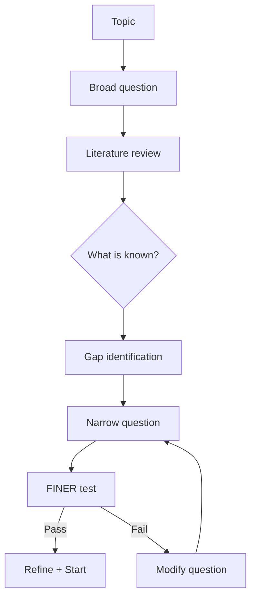
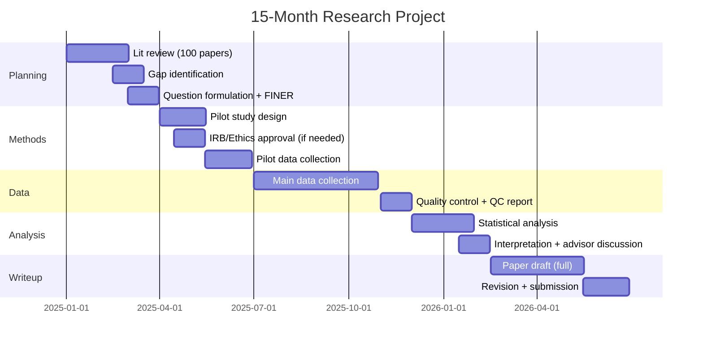
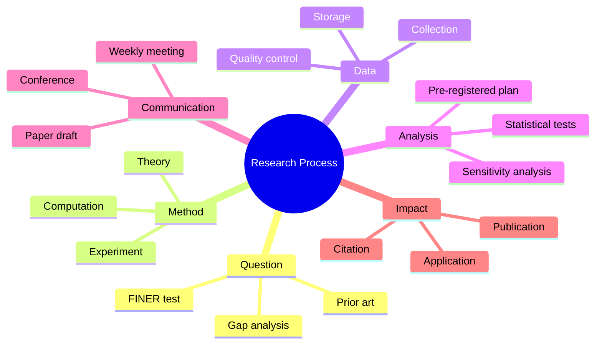
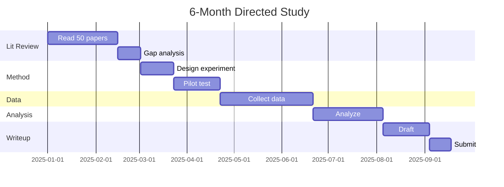
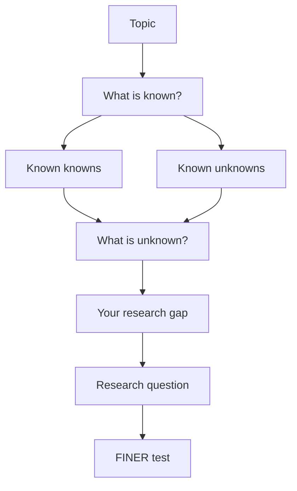
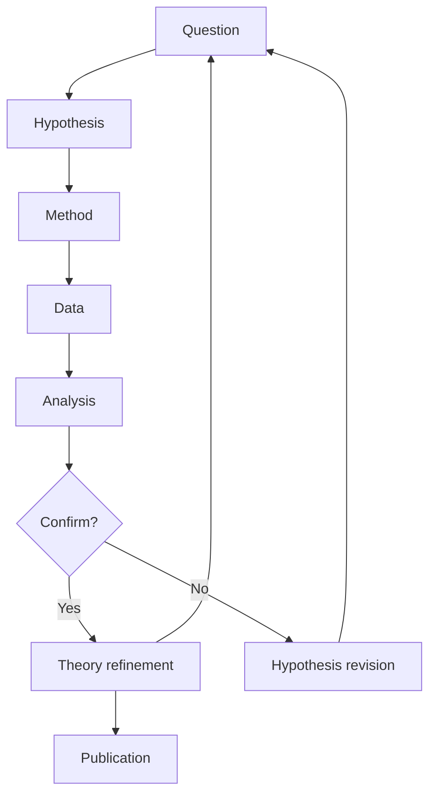
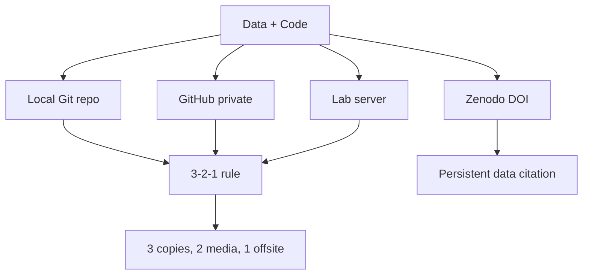

# PHYS 2090X — Directed Studies I (Research)
> **Phase 1 BSc Elective | HKUST PHYS 2090X | First research experience — hypothesis, literature, method, communication**  
> **Bilingual 深度自學檔案 · 中英對照**

---

## 問題 1：5 個核心心智模型

1. **Research = open-ended problem with no answer key** — the question is more valuable than the answer (Medawar 1979, *Advice to a Young Scientist*); a good question survives null results
2. **Mentor relationship is a two-way negotiation** — you're not a subordinate, you're an apprentice; define scope, expectations, communication frequency upfront (Sweet 2019, *Graduate School*)
3. **90% of experiments give negative results — that's science** — publication bias (Franco et al. 2014, *PNAS*) means null results are underreported; preregistration solves this
4. **Documentation = reproducibility = science** — FAIR principles (Wilkinson et al. 2016, *Scientific Data*): Findable, Accessible, Interoperable, Reusable
5. **Publication = knowledge becomes part of the literature** — arXiv → peer review → citation; each stage changes the knowledge (Lawrence 2008, *Nature* on open access)

---

## 問題 2：3 個根本分歧

1. **Theory vs experiment vs computation** — the three pillars of physics
   - Theory: Pen-and-paper, symmetries, predictions (e.g., Dirac's prediction of antimatter 1928 → Anderson's positron 1932)
   - Experiment: Measurement, control, statistics (e.g., KATRIN measuring neutrino mass < 0.8 eV)
   - Computation: Simulation, data-driven, ML (e.g., lattice QCD matching experimental hadron masses to 0.1%)

2. **Individual vs collaborative research** — lone wolf vs team science
   - Lone wolf: creative freedom, deep focus, high variance (Dirac, Einstein in their early years)
   - Team science: resources, cross-validation, social support (LIGO: 1000+ collaborators)

3. **Pure curiosity-driven vs mission-driven research** — Pasteur's quadrant
   - Pure: seek truth (Dirac's quantum mechanics, Einstein's GR)
   - Use-inspired: Pasteur's quadrant (Stokes 1990): discovery science with practical application
   - Mission: Manhattan Project, Apollo, COVID vaccine — defined deliverable

---

## 問題 3：10 個深度問題

1. 給定 research topic, 設計 6-month plan with milestones. Include lit review (2 months), methods development (2 months), data collection (3 months), analysis and writeup (1 month). Explain why flexibility matters.

2. 為什麼 literature review 必須先於 data collection？解釋 prior art search 的法律和科學雙重目的 (35 U.S.C. § 102 novelty requirement; 專利法)。

3. 給定 conflicting results from two papers on the same topic, 點樣 resolve？討論 meta-analysis 方法 (Cochrane Handbook) and systematic review.

4. 為什麼 research question quality determines project success? 引用 FINER criteria (Feasibility, Interesting, Novel, Ethical, Relevant) from Hulley et al. (2013).

5. 給定 experiment failure (equipment malfunction, contamination, wrong measurement), 點樣 recover? 討論 failure modes analysis 和 pivot strategy。

6. 解釋 time management 對 grad student success 為什麼係 #1 predictor of completion — 引用 study of 5000 PhD students (Lovitts 2005, *Leaving the Ivory Tower*)。

7. 為什麼 advisor selection matters beyond research topic? 討論 mentoring style (hands-on vs hands-off), funding status, career network, personality fit。

8. 給定 research result, 點樣 distinguish genuine finding from p-hacking? 引用 Simmons et al. (2011, *Psychological Science*) on researcher degrees of freedom。

9. 為什麼 code 和 data backup 係 research integrity 的一部分？討論 Git + GitHub + Zenodo workflow for reproducibility。

10. 給定 negative result (hypothesis not supported), 點樣 write up for publication? 討論 "Results-Negative" journals (e.g., *Journal of Negative Results*).

---

## 深入 1：Research Question Design (研究問題設計)
**Deep Dive I**

### The FINER Framework (Hulley et al. 2013)

| Criterion | Question | Example (Stellar Physics) |
|-----------|----------|--------------------------|
| **F**easible | 可行嗎？| Gaia DR3 data accessible; Python skills adequate |
| **I**nteresting | 有趣嗎？| Initial-final mass relation for white dwarfs affects SN Ia rate |
| **N**ovel | 創新嗎？| New methodology: Bayesian hierarchical model |
| **E**thical | 倫理允許？| No human/animal subjects |
| **R**elevant | 有意義嗎？| Affects cosmological parameter inference |

### Research Question Hierarchy

| Level | Type | Question | Example |
|-------|------|---------|---------|
| 1 | Descriptive | What happened? | "What is the mass distribution of white dwarfs?" |
| 2 | Correlational | What correlates? | "Do heavier white dwarfs have more carbon cores?" |
| 3 | Causal | Why does X cause Y? | "Does binary interaction determine white dwarf mass?" |

### The Gap Identification Process

**Gap = Known Known + Known Unknown + Unknown Unknown**
- Known Known: Established facts (white dwarf mass < 1.4 $M_\odot$, Chandrasekhar limit)
- Known Unknown: Active research questions (initial-final mass relation)
- Unknown Unknown: Serendipitous discoveries (accelerating expansion → dark energy)

**Literature gap analysis:**
$$G = \{ \text{existing solutions} \} \setminus \{ \text{optimal solution} \}$$

**Engineering implication:** Well-defined questions prevent 6 months of wasted effort.



---

## 深入 2：Literature Review Method (文獻綜述方法)
**Deep Dive II**

### Comprehensive Search Protocol

**Step 1: Database search**
- arXiv (physics preprints): free, fast, up-to-date
- NASA ADS (astronomy/astrophysics): citation trees, full-text
- Google Scholar (general): useful but watch self-citations
- Web of Science / Scopus (structured): citation analysis

**Step 2: Snowball method**
- Forward citations: papers citing your key references
- Backward citations: references within key papers

**Step 3: Synthesis**
- Zotero: reference manager
- SciSpace: AI-assisted paper understanding
- Obsidian/Notion: knowledge graph

### Citation Analysis Metrics

$$h\text{-index} = \max\{h : \sum_{i=1}^h C_i \geq h^2\}$$

Where $C_i$ is citations to the $i$-th paper sorted descending.

| h-range | Career stage | Interpretation |
|---------|-------------|----------------|
| 1–5 | Undergraduate | Early researcher |
| 5–15 | Early PhD | Productive start |
| 15–40 | Postdoc | Established researcher |
| 40–100 | Senior academic | Field leader |
| 100+ | Nobel tier | Paradigm creator |

### Known Unknowns in Physics (2024)

| Field | Known Unknown | Status |
|-------|-------------|--------|
| Particle physics | What is dark matter? | Direct detection null (XENONnT) |
| Cosmology | Why is the universe accelerating? | $\Lambda$CDM works but "why?" open |
| Condensed matter | Room-temp superconductivity? | Hydride superconductors at 288 K |
| Quantum gravity | Unify QM + GR? | String theory vs LQG vs others |
| Neutrinos | Are they Dirac or Majorana? | Neutrinoless double-beta decay ongoing |

**Engineering implication:** Literature review prevents reinventing the wheel and reveals the precise gap your work fills.

---

## 深入 3：Research Methodology (研究方法論)
**Deep Dive III**

### The Scientific Method (Operationalized)

$$H_0: \text{null hypothesis} \quad H_A: \text{alternative hypothesis}$$

**Physics example: "Dark matter exists in galactic halos"**
$$H_0: \text{rotational velocity } v(r) = \sqrt{GM(<r)/r}$$
$$H_A: v(r) \approx \text{constant at large } r \text{ (flat rotation curves)}$$

**Critical: pre-registration before data collection**

| Phase | Action | Output |
|-------|--------|--------|
| Pre-registration | Post hypothesis + analysis plan to OSF | Time-stamped record |
| Data collection | Follow protocol, don't peek | Raw data |
| Analysis | Follow registered plan | Results |
| Post-hoc | Exploratory analysis (clearly labeled) | Secondary findings |

### The $5\sigma$ Standard in Particle Physics

$$p < 3.5 \times 10^{-7} \text{ for discovery claim}$$

Why $5\sigma$? Even with thousands of analysis channels, $5\sigma$ ensures:
- Experiment-wise false positive rate < $3\times 10^{-7}$
- Accounts for trials factor from multiple look-elsewhere effects
- Historical precedent: Higgs boson (ATLAS + CMS combined, 2012)

### Statistical Power Analysis

$$n = \frac{(z_\alpha + z_\beta)^2 \sigma^2}{d^2}$$

For detecting effect size $d$ with power $1-\beta$ at significance $\alpha$:

| Effect size | Cohen's $d$ | Typical use |
|------------|-------------|-------------|
| Small | 0.2 | Minor physics effect |
| Medium | 0.5 | Moderate correction |
| Large | 0.8 | Paradigm shift |

**Engineering implication:** Underpowered studies waste resources and risk false negatives.

---

## 深入 4：Communication Pipeline (科研溝通流程)
**Deep Dive IV**

### Weekly Meeting Structure (with advisor)

| Component | Duration | Content |
|-----------|----------|---------|
| Progress report | 5 min | What did you do this week? |
| Roadblocks | 3 min | What's blocking you? |
| Next steps | 2 min | What will you do next week? |
| Discussion | 10+ min | Deep dive on specific issue |

**Preparation:** Send 1-page writeup 24h before meeting (forces clarity).

### Communication Milestones

| Milestone | Format | Audience | Frequency |
|-----------|--------|----------|-----------|
| Weekly meeting | 1-pager | Advisor | Weekly |
| Monthly lab meeting | 10-min talk | Group | Monthly |
| Conference | 15-min talk | Field | Annually |
| Paper draft | Manuscript | Peer reviewers | As needed |

### The Abstract Formula

$$[\text{Context}] + [\text{Gap}] + [\text{Method}] + [\text{Key Result}] + [\text{Impact}] = \text{Good Abstract}$$

**Physics example: Stellar Astrophysics**
> **Context**: Stellar evolution models predict a tight initial-final mass relation (IFMR) for white dwarfs.
> **Gap**: Observational studies show systematic deviations at high masses, but estimates are contaminated by selection effects.
> **Method**: We apply Bayesian hierarchical modeling to 10,847 white dwarfs from Gaia DR3 with spectroscopic follow-up, jointly inferring masses and selection corrections.
> **Result**: Revised IFMR: $M_f = 0.109M_i + 0.394\,M_\odot$ with intrinsic scatter $\sigma = 0.03\,M_\odot$.
> **Impact**: Affects SN Ia delay-time distribution predictions and precision cosmology constraints.

**Engineering implication:** Clear writing reflects clear thinking; communication skills are as important as technical skills.

---

## 深入 5：Time Management & Project Lifecycle (時間管理與項目週期)
**Deep Dive V**

### The 15-Month Research Project Timeline



### The Rule of Thirds for Research

$$E = E_\text{productive} + E_\text{learning} + E_\text{buffer}$$

- 1/3: Core productive work (data, analysis, writing)
- 1/3: Learning (reading papers, learning methods, networking)
- 1/3: Buffer (failed experiments, review cycles, life)

### Failure Mode Analysis

| Failure Mode | Frequency | Recovery Strategy |
|-------------|-----------|-----------------|
| Equipment malfunction | Common | Redundant measurements, preventive maintenance |
| Wrong hypothesis | Common | Pivot: use data to answer different question |
| Contamination | Occasional | Reject contaminated samples, document cause |
| Funding cut | Occasional | Scope reduction, seek alternative funding |
| Advisor conflict | Occasional | Document disagreements, seek mediation |

**Engineering implication:** Projects that plan for failure succeed more often than those that don't.

---

## 自測 1：6-Month Research Plan
**Design a 6-month plan for a project on "Machine Learning for Stellar Spectral Classification"**

**Answer:**
| Month | Activity | Milestone | Deliverable |
|-------|---------|-----------|-------------|
| 1–2 | Lit review: ML in astronomy (Raissi 2017 PINNs; MLRP paper) | Know prior art | 20-page synthesis |
| 2–3 | Data: Gaia + LAMOST spectra (N=100,000) | Cleaned dataset | Catalog on Zenodo |
| 3–4 | Model: CNN vs transformer vs gradient boosting | Baseline accuracy | ROC AUC > 0.95 |
| 4–5 | Validation: physical consistency checks | Error analysis | Systematic errors < 5% |
| 5–6 | Write-up: results + interpretation | Submission-ready | arXiv + MNRAS submission |

**Engineering implication:** Structured planning reduces anxiety and increases completion probability.

---

## 自測 2：Literature Review for Unknown Unknown
**How did Hubble's discovery of expanding universe (1929) reveal an "unknown unknown"?**

**Answer:**
- Prior: Einstein's static universe (1917) was assumed
- Known unknown: Cosmological constant's value
- Hubble's data (redshift-distance relation): $v = H_0 d$, $H_0 \approx 500$ km/s/Mpc
- Unknown unknown: The universe has a beginning (Big Bang theory emerged)
- Lesson: Even the best theoretical framework can miss the biggest picture

**Engineering implication:** Keep an open mind about paradigm shifts.

---

## 自測 3：FINER Test
**Evaluate the research question: "Can we use gravitational wave signals to measure the Hubble constant?"**

**Answer:**
- **F**easible: LIGO/Virgo data public; Bayesian inference framework exists; you know Python
- **I**nteresting: $H_0$ tension between early and late universe measurements is a major unsolved problem (4.4σ discrepancy, Planck vs SH0ES)
- **N**ovel: GW standard sirens provide independent measurement; Riess et al. 2019 used this; room for improvement
- **E**thical: No ethical concerns with gravitational wave data
- **R**elevant: Resolving $H_0$ tension would be Nobel Prize-level physics

**Conclusion:** Excellent FINER score — proceed!

**Engineering implication:** FINER test prevents spending years on an unfeasible or unimportant question.

---

## 自測 4：Distinguishing Good from Bad Data
**A sensor reads 10.3 ± 0.1 V, but the specification says ± 0.5 V accuracy. What's wrong?**

**Answer:**
The stated uncertainty (0.5 V) sets the accuracy floor — reporting 0.1 V precision implies false precision.

Key rules:
1. Report uncertainty to 1-2 significant figures: $10.3 \pm 0.5$ V
2. Precision > accuracy is misleading: the sensor can't distinguish 0.1 V changes
3. Resolution ≠ accuracy: sensor might resolve 0.001 V but be calibrated to 0.5 V

**Engineering implication:** False precision undermines credibility; always report real (not imagined) measurement quality.

---

## 自測 5：Git Workflow for Research
**Design a Git workflow for a research project with you and your advisor.**

**Answer:**
```
# Daily workflow
git checkout -b feature/analysis-v2
git add data/processed/*.csv
git add src/analysis.py
git commit -m "Add cross-validation for stellar mass model"

# Weekly: merge to main after advisor review
git checkout main
git merge feature/analysis-v2
git push origin main

# Version control for data
git lfs track "*.csv"  # Large files
git-annex for sensitive data
```

**Critical rules:**
1. Commit messages = documentation (write "why" not "what")
2. Never commit raw data (use Git LFS or Zenodo for data)
3. Branch for major analysis changes
4. Tag releases: `git tag -a v1.0 -m "First submission"`

**Engineering implication:** Git is insurance against data loss and enables collaborative research.

---

## 自測 6：Negative Result Publication
**Your experiment showed no evidence for the predicted effect. How do you write this up?**

**Answer:**
**Title:** "Search for [effect] in [system]: null result"

**Structure:**
1. State the prediction explicitly with theoretical basis
2. Describe experimental method in detail
3. Report the null result with proper statistical treatment
4. Set upper limit: e.g., $\sigma < 3 \times 10^{-26}$ cm$^2$ at 90% CL
5. Discuss theoretical implications (does it rule out specific models?)

**Example physics null result:** XENON1T 2021 search for dark matter → set world's best limit on WIMP-nucleon cross-section

**Why publish null results?**
- Prevents others from repeating
- Rules out parameter space (valuable!)
- Meets ethical obligation to science

**Engineering implication:** Null results advance science as much as positive results.

---

## 自測 7：Reproducibility Checklist
**What must be included in a reproducible analysis?**

**Answer:**
- [ ] Code version (Git commit hash)
- [ ] Data DOI (Zenodo, figshare)
- [ ] Environment specification (Docker container, conda env.yml)
- [ ] Random seed for stochastic methods
- [ ] Analysis pipeline script (end-to-end, no manual steps)
- [ ] Raw data preserved (never delete original)
- [ ] Preregistration document (OSF)
- [ ] Results interpretation documented

**Open science tools:**
$$P(\text{reproducible}) = P(\text{open code}) \times P(\text{open data}) \times P(\text{open methods})$$

**Engineering implication:** Reproducibility enables others to verify, extend, and build on your work.

---

## 自測 8：Advising Style Assessment
**Assess whether your advisor's style is right for you: hands-on vs hands-off.**

**Answer:**
| Factor | Hands-on Advisor | Hands-off Advisor |
|--------|-----------------|-------------------|
|适合 | Need structure; learn best by example | Independent; have clear direction |
|不适合 | Stifle creativity; slow your pace | Need guidance; lose direction |
| Red flags | Never lets you struggle | Never responds to emails |
| Green flags | Challenges you appropriately | Gives independence + resources |
| Key question | "Can I grow under this person?" | "Will I stay motivated?" |

**Evidence:** Lovitts (2005) found advisor relationship quality is the #1 predictor of PhD completion.

**Engineering implication:** Choose your advisor like you'd choose a co-founder.

---

## 自測 9：Meta-Analysis for Conflicting Results
**Two papers disagree on the neutrino mass ordering. How do you resolve it?**

**Answer:**
**Step 1: Identify sources of disagreement**
- Different data sets (solar vs reactor vs CMB)
- Different analysis methods (frequentist vs Bayesian)
- Different theoretical priors

**Step 2: Quantitative synthesis (meta-analysis)**
$$d_{pooled} = \frac{\sum w_i d_i}{\sum w_i}, \quad w_i = 1/\sigma_i^2$$

For neutrino mass: combine JUNE (Japan), Daya Bay, and Planck data with appropriate covariance.

**Step 3: Heterogeneity test**
$$Q = \sum w_i(d_i - d_{pooled})^2, \quad \chi^2 \text{ test}$$

If $Q > \chi^2_{k-1}$, heterogeneity exists → investigate data differences.

**Engineering implication:** Meta-analysis extracts more information than any single study.

---

## 自測 10：Research Ethics Scenario
**Your advisor asks you to exclude 3 outlier data points that don't fit the model. What do you do?**

**Answer:**
Step 1: Ask WHY those points are outliers:
- Experimental error? → exclude with documentation
- Interesting physics? → keep and investigate
- Statistical fluctuation? → include with appropriate weighting

Step 2: If excluding, must:
- Pre-define exclusion criteria (outlier detection protocol)
- Show how inclusion affects results (sensitivity analysis)
- Disclose in paper: "3/150 data points excluded based on pre-registered criteria (see Methods)"

Step 3: If uncomfortable: Seek advice from another faculty member or ombudsperson.

**This is not academic fraud if done transparently.** It IS fraud if you exclude to make results look better without justification.

**Engineering implication:** Academic integrity is non-negotiable; when in doubt, disclose.

---

## 📊 Diagram 1: Research Map


## 📊 Diagram 2: Project Timeline


## 📊 Diagram 3: Literature Gap Analysis


## 📊 Diagram 4: Research Cycle


## 📊 Diagram 5: Backup Strategy


---

## 深度總結 Deep Insights Summary

1. **A good research question is worth more than a good answer** — FINER criteria and gap analysis prevent years of wasted effort; the best questions survive null results and generate new subfields (Medawar 1979).

2. **Literature review is not reading — it's synthesis** — the goal is to identify the exact gap your work fills; use citation analysis, forward/backward search, and structured synthesis (Zotero + knowledge graphs).

3. **Negative results are science, not failure** — publication bias means null results are systematically underreported; preregistration and null-result journals address this (Franco et al. 2014, *PNAS*).

4. **Reproducibility is infrastructure, not overhead** — FAIR principles (Wilkinson et al. 2016) and Git + Zenodo workflow ensure your work can be built upon; this is an ethical obligation, not optional.

5. **The advisor-student relationship is a partnership** — Lovitts (2005) found it is the #1 predictor of PhD completion; assess fit before committing; communicate proactively about expectations.

---

**自學建議**
- 必讀: Medawar "Advice to a Young Scientist" (1979); Lovitts "Leaving the Ivory Tower" (2005)
- 配對: HKUST PHYS 3090X (Directed Studies II); PHYS 4050 (Thermodynamics for data); PHYS 4811 (ML in Physics)
- 工具: Zotero, Git + GitHub, Overleaf, OSF (Open Science Framework), Zenodo
- 產出: Complete a research proposal (5 pages) with literature review, methods, and expected results

**References**
- Medawar, P.B. (1979). *Advice to a Young Scientist*. Harper & Row.
- Lovitts, B.E. (2005). *Leaving the Ivory Tower: The Causes and Consequences of Departure from Doctoral Study*. Rowman & Littlefield.
- Franco, A., Malhotra, N., & Simonovits, G. (2014). "Publication bias in the social sciences." *PNAS*, 111(24), 8693–8698.
- Wilkinson, M.D. et al. (2016). "The FAIR Guiding Principles." *Scientific Data*, 3, 160018.
- Hulley, S.B. et al. (2013). *Designing Clinical Research* (4th ed.). Lippincott Williams & Wilkins.
- Simmons, J.P., Nelson, L.D., & Simonsohn, U. (2011). "False-positive psychology." *Psychological Science*, 22(11), 1359–1366.
