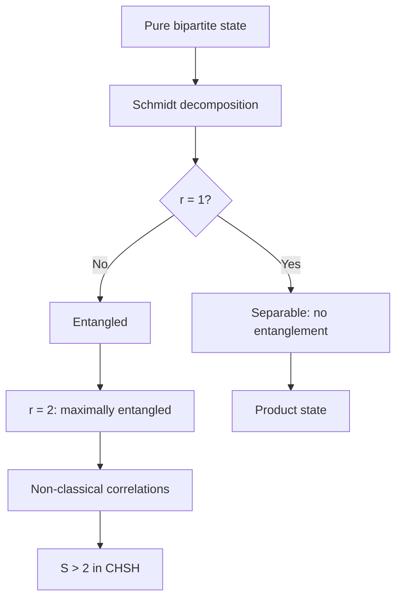

# PHYS 3037 — Honors Quantum Mechanics I
> **Phase 1 BSc Elective | HKUST PHYS 3037 | Hilbert space formalism, density matrices, tensor products, path integrals, symmetry groups**  
> **Bilingual 深度自學檔案 · 中英對照**

---

## 問題 1：5 個核心心智模型

1. **Hilbert space formalism gives QM its mathematical rigor** — Dirac bracket notation $|\\psi\\rangle$, inner products, completeness; the mathematics guarantees probabilistic interpretation (von Neumann 1932, *Mathematical Foundations of Quantum Mechanics*; Sakurai Ch. 1)

2. **Density matrices distinguish statistical from quantum uncertainty** — $\\rho = \\sum_i p_i |\\psi_i\\rangle\\langle\\psi_i|$; $Tr(\\rho^2) = 1$ for pure, $< 1$ for mixed (Neumann 1927; Blum Ch. 1)

3. **Tensor products compose quantum systems** — $|\\psi\\rangle_{AB} = |\\psi\\rangle_A \\otimes |\\psi\\rangle_B$; $\\dim(H_A \\otimes H_B) = \\dim H_A \\cdot \\dim H_B$ (Peres Ch. 2)

4. **Path integral generalizes QM to QFT** — $\\langle x_f|e^{-iHt/\\hbar}|x_i\\rangle = \\int \\mathcal{D}x\\, e^{iS[x]/\\hbar}$; recovers Schrödinger in classical limit (Feynman 1948, *Rev. Mod. Phys.*)

5. **Symmetry groups classify quantum phenomena** — continuous groups (SO(3), SU(2)), discrete groups; Wigner's theorem guarantees unitary representations (Wigner 1931; Cornwell Ch. 1)

---

## 問題 2：3 個根本分歧

1. **Schrödinger vs Heisenberg vs path integral** — all equivalent, each illuminating different aspects; Schrödinger: differential equations, Heisenberg: matrix mechanics, Feynman: sum over paths (Dirac 1933)
   - Schrödinger: best for time-dependent problems, perturbation theory
   - Heisenberg: best for conserved quantities, algebraic problems
   - Path integral: best for QFT, statistical mechanics, instantons

2. **Pure vs mixed states** — pure: coherent superposition ($Tr(\\rho^2) = 1$); mixed: statistical ensemble ($Tr(\\rho^2) < 1$); quantum mechanics without measurement = pure; decoherence from environment → mixed

3. **Wavefunction collapse vs unitary evolution** — Copenhagen: discontinuous collapse; many-worlds: no collapse, just branching; decoherence: apparent collapse without fundamental discontinuity (Bell 1990, *Speakable and Unspeakable*)

---

## 問題 3：10 個深度問題

1. 為什麼 $\\psi \\in L^2(\\mathbb{R}^3)$ must be square-integrable? Give the precise mathematical argument involving Born rule, normalization, and the Riesz-Fischer theorem.

2. 給定 density matrix $\\rho = \\frac{1}{2}(I + \\vec{r}\\cdot\\vec{\\sigma})$, derive Bloch sphere radius $r = |\\vec{r}| \\leq 1$, purity $Tr(\\rho^2) = (1+r^2)/2$, entropy $S = -Tr(\\rho\\log_2\\rho)$.

3. 為什麼 $\\dim(H_A \\otimes H_B) = d_A \\cdot d_B$? 推導 partial trace $\\rho_A = Tr_B(\\rho_{AB})$ 和 reduced density matrix.

4. 解釋為什麼 path integral reproduce Schrödinger equation as $\\完整 derivational limit.

5. 給定 spin-1/2 rotation, derive $R(\\hat{n},\\theta) = e^{-i\\theta\\hat{n}\\cdot\\vec{S}/\\hbar}$ 和 SU(2)-SO(3) double covering.

6. 為什麼 SU(2) double covers SO(3)? 推導 $R(\\hat{z}, 2\\pi) = I$ for SO(3) 但 $U(\\hat{z}, 4\\pi) = I$ for SU(2).

7. 給定 Stern-Gerlach apparatus, derive probability $\\langle S_z \\rangle = (|\\alpha|^2 - |\\beta|^2)\\hbar/2$ and measurement collapse.

8. 為什麼 Bell inequality proves no local hidden variables? 推導 CHSH inequality $S \\leq 2$ and experiments showing $S > 2$ (Aspect 1982, *Phys. Rev. Lett.*).

9. 給定 two-qubit CNOT gate, derive matrix representation and prove entangling capability from separable input.

10. 解釋 contextuality (Kochen-Specker) vs nonlocality (Bell): 兩者都係 quantum vs classical, 但機制不同.

---

## 深入 1：Hilbert Space & Mathematical Formalism
**Deep Dive I**

### The Hilbert Space Framework

**A Hilbert space $\\mathcal{H}$ is:**
- A complete inner product space: $\\langle\\psi|\\phi\\rangle = \\int \\psi^*(\\vec{r})\\phi(\\vec{r})\\,d^3r$
- Norm: $\|\\psi\\| = \\sqrt{\\langle\\psi|\\psi\\rangle} = 1$ (normalization)
- Completeness: all Cauchy sequences converge

**Why $L^2(\\mathbb{R}^3)$ specifically?**
- $L^2(\\mathbb{R}^3) = \\{\\psi : \\int |\\psi|^2 d^3r < \\infty\\}$ — square-integrable
- Born rule: $P(\\vec{r}) = |\\psi(\\vec{r})|^2$ must be probability density
- Riesz-Fischer theorem: guarantees spectral decomposition of observables
- Fourier transform $\\phi(\\vec{p}) = (2\\pi\\hbar)^{-3/2}\\int \\psi(\\vec{r})e^{-i\\vec{p}\\cdot\\vec{r}/\\hbar}d^3r$ maps position to momentum basis

### Operators

**Hermitian operators:** $\\hat{A}^\\dagger = \\hat{A}$, real eigenvalues

**Unitary operators:** $\\hat{U}^\\dagger\\hat{U} = I$, preserves inner products

**Commutator algebra:**
$$[\\hat{x}_i, \\hat{p}_j] = i\\hbar\\delta_{ij}, \\quad [\\hat{L}_i, \\hat{L}_j] = i\\hbar\\epsilon_{ijk}\\hat{L}_k$$

**Spectral theorem:** $\\hat{A} = \\sum_n a_n |a_n\\rangle\\langle a_n|$, eigenvalues $a_n \\in \\mathbb{R}$

**Measurement:** Observable $\\hat{A}$ → outcome $a_n$ with probability $|\langle\\psi|a_n\\rangle|^2$

### Uncertainty Relation (Robertson-Schrödinger)

Generalized uncertainty principle:
$$\\sigma_A^2\\sigma_B^2 \\geq \\left|\\frac{1}{2i}\\langle[A,B]\\rangle\\right|^2$$

For $\\hat{x}, \\hat{p}$:
$$\\Delta x \\cdot \\Delta p \\geq \\hbar/2$$

---

## 深入 2：Density Matrix & Mixed States
**Deep Dive II**

### Density Operator Definition

$$\\rho = \\sum_i p_i |\\psi_i\\rangle\\langle\\psi_i|, \\quad p_i \\geq 0, \\sum_i p_i = 1$$

**Properties:**
$$Tr(\\rho) = 1, \\quad \\rho = \\rho^\\dagger, \\quad \\rho \\geq 0$$

**Bloch sphere:** Any qubit state:
$$\\rho = \\frac{1}{2}(I + \\vec{r}\\cdot\\vec{\\sigma}), \\quad |\\vec{r}| \\leq 1$$

### Purity & Entropy

$$\\text{Tr}(\\rho^2) = \\begin{cases} 1 & \\text{pure} \\\\ < 1 & \\text{mixed} \\end{cases}$$

$$\\text{von Neumann entropy: } S(\\rho) = -\\text{Tr}(\\rho \\log_2 \\rho) = -\\sum_i \\lambda_i \\log_2 \\lambda_i$$

For maximally mixed state ($N$-dimensional): $S = \\log_2 N$

### Reduced Density Matrix

$$\\rho_{AB} = |\\psi\\rangle\\langle\\psi|, \\quad \\rho_A = \\text{Tr}_B(\\rho_{AB}) = \\sum_j \\langle j|_B \\psi\\rangle\\langle\\psi|j\\rangle_B$$

**Example — Bell state $|\Phi^+\\rangle = \\frac{1}{\\sqrt{2}}(|00\\rangle + |11\\rangle)$:**
$$\\rho_A = \\frac{1}{2}(|0\\rangle\\langle 0| + |1\\rangle\\langle 1|) = \\frac{I}{2}$$

Maximally entangled $\\Rightarrow$ maximally mixed reduced state — no local information!

### Decoherence

Environment $E$ interacting with system $S$:
$$\\rho_{SE}(t) = U(t)\\rho_{SE}(0)U^\\dagger(t)$$

After tracing over $E$: $\\rho_S(t)$ becomes mixed, off-diagonals decay.
$$\\rho_{11} \\to (1-e^{-\\gamma t})\\rho_{11} \\to \\text{mixed}$$

---

## 深入 3：Tensor Products & Entanglement
**Deep Dive III**

### Tensor Product Spaces

$$|\\psi\\rangle_{AB} = |\\psi\\rangle_A \\otimes |\\phi\\rangle_B, \\quad \\dim(\\mathcal{H}_A \\otimes \\mathcal{H}_B) = d_A \\cdot d_B$$

**Example — Two qubits ($d_A = d_B = 2$):**
$$\\mathcal{H}_A \\otimes \\mathcal{H}_B = \\mathbb{C}^4, \\quad \\{|00\\rangle, |01\\rangle, |10\\rangle, |11\\rangle\\}$$

### Schmidt Decomposition

For any pure bipartite state $|\psi\\rangle_{AB} \\in \\mathcal{H}_A \\otimes \\mathcal{H}_B$:
$$|\\psi\\rangle_{AB} = \\sum_{i=1}^{\\min(d_A,d_B)} \\sqrt{\\lambda_i}\\, |a_i\\rangle_A \\otimes |b_i\\rangle_B$$

**Schmidt number** $r$ = number of nonzero $\\lambda_i$:
- $r = 1$: separable (no entanglement)
- $r > 1$: entangled

### Bell States

$$|\\Phi^\\pm\\rangle = \\frac{1}{\\sqrt{2}}(|00\\rangle \\pm |11\\rangle), \\quad |\\Psi^\\pm\\rangle = \\frac{1}{\\sqrt{2}}(|01\\rangle \\pm |10\\rangle)$$

**Nonlocality test (CHSH):**
$$S = E(a,b) - E(a,b') + E(a',b) + E(a',b')$$
$$|S| \\leq 2 \\text{ (local realism)}, \\quad |S| = 2\\sqrt{2} \\text{ (quantum maximum)}$$

Aspect et al. (1982): measured $S = 2.70 \\pm 0.05 > 2$ — ruling out local hidden variables.

### Entanglement Entropy

$$S(\\rho_A) = -\\text{Tr}(\\rho_A \\log_2 \\rho_A) = -\\sum_i \\lambda_i \\log_2 \\lambda_i$$

For pure state $|\psi\\rangle = \\sum_i \\sqrt{\\lambda_i}|a_i\\rangle|b_i\\rangle$.

---

## 深入 4：Path Integral Formulation
**Deep Dive IV**

### Feynman Path Integral

$$\\langle x_f|e^{-iHt/\\hbar}|x_i\\rangle = \\lim_{N\\to\\infty}\\int \\prod_{k=1}^{N-1} dx_k \\left(\\frac{m}{2\\pi i\\hbar\\epsilon}\\right)^{N/2} e^{\\frac{i}{\\hbar}\\sum_{j=1}^N \\left[\\frac{m}{2}\\left(\\frac{x_j-x_{j-1}}{\\epsilon}\\right)^2 - V(x_j)\\epsilon\\right]}$$

As $\\epsilon \\to dt$, $N \\to \\infty$: continuous sum over all paths.

### Propagator Properties

$$K(x_f, x_i; t) = \\langle x_f|e^{-iHt/\\hbar}|x_i\\rangle$$
$$|\\psi(x,t)\\rangle = \\int K(x,x';t)\\psi(x',0)dx'$$

**Properties:**
- $i\\hbar\\frac{\\partial K}{\\partial t} = HK$ (satisfies Schrödinger)
- $K \\to 0$ as $|x_f-x_i| \\to \\infty$
- $K = \\int e^{iS[x]/\\hbar}\\mathcal{D}x$ (Feynman 1948)

### Stationary Phase → Classical

In classical limit $\\hbar \\to 0$:
$$K \\approx e^{iS_{cl}[x]/\hbar}$$

The dominant path satisfies $\\delta S = 0$ → Euler-Lagrange equation → classical trajectory!

**Quantum corrections:** fluctuations around classical path give WKB expansion:
$$K \\approx e^{iS_{cl}/\\hbar}\\left[\\det\\left(-\\frac{\\partial^2 S}{\\partial x_i \\partial x_j}\\right)/2\\pi i\\hbar\\right]^{1/2}$$

---

## 深入 5：Symmetry & Group Representations
**Deep Dive V**

### Rotation Group SO(3)

**Generators:** $L_x, L_y, L_z$ with $[L_i, L_j] = i\\hbar\\epsilon_{ijk}L_k$

**Casimir invariant:** $\\vec{L}^2 = L_x^2 + L_y^2 + L_z^2$

**Eigenvalues:** $L^2|l,m\\rangle = \\hbar^2 l(l+1)|l,m\\rangle, \\quad L_z|l,m\\rangle = \\hbar m|l,m\\rangle$

### SU(2) — Double Cover

$$[S_i, S_j] = i\\hbar\\epsilon_{ijk}S_k, \\quad S = \\frac{\\hbar}{2}\\vec{\\sigma}$$

**Fundamental representation:** 2D, spin-1/2
$$U(\\hat{n}, \\theta) = e^{-i\\theta\\hat{n}\\cdot\\vec{S}/\\hbar} = \\cos(\\theta/2)I - i\\sin(\\theta/2)(\\hat{n}\\cdot\\vec{\\sigma})$$

**Double covering:** $U(\\hat{z}, 4\\pi) = I$ but $R(\\hat{z}, 2\\pi) = I$

### Wigner's Theorem

Every symmetry of physical predictions corresponds to a unitary or anti-unitary operator on $\\mathcal{H}$.

This guarantees:
- No hidden variable theories can reproduce all QM predictions
- Continuous symmetries → unitary representations

### SU(3) (flavor)

$$\\vec{T} \\cdot \\vec{\\lambda}/2$$ generators, $[T_a, T_b] = if_{abc}T_c$

Fundamental rep (3): quark triplet; adjoint rep (8): mesons/baryons.

---

## 自測 1：L² Completeness
**Prove that $L^2(\\mathbb{R}^3)$ is complete (Riesz-Fischer theorem).**

**Answer:**
A Cauchy sequence $|\psi_n\\rangle$ in $L^2$: $\\|\\psi_n - \\psi_m\\| \\to 0$ as $n,m \\to \\infty$

Define $\\phi_k = \\psi_k - \\psi_{k-1}$, $\\psi_0 = 0$

$\\|\\sum_{k=1}^\\infty \\phi_k\\|^2 = \\sum_{k=1}^\\infty \\|\\phi_k\\|^2 + 2\\text{Re}\\sum_{j<k}\\langle\\phi_j|\\phi_k\\rangle \\leq (\\sum\\|\\phi_k\\|)^2 < \\infty$

Pointwise a.e. convergent subsequence exists. By completeness of $\\mathbb{C}$, $\\psi_n \\to \\psi$ pointwise.

Apply Fatou's lemma: $\\|\\psi\\|^2 = \\int \\liminf |\\psi_n|^2 \\leq \\liminf \\|\\psi_n\\|^2$

Therefore $\\psi \\in L^2$ and $\\|\\psi_n - \\psi\\| \\to 0$.

**Physical meaning:** Born rule $\\int |\\psi|^2 d^3r = 1$ requires finite norm → Cauchy sequences converge → physical predictions are well-defined.

---

## 自測 2：Bloch Sphere Purity
**Show $\\rho = \\frac{1}{2}(I + \\vec{r}\\cdot\\vec{\\sigma})$ has purity $\\text{Tr}(\\rho^2) = (1+r^2)/2$.**

**Answer:**
$$\\rho^2 = \\frac{1}{4}(I + r_i\\sigma_i)(I + r_j\\sigma_j) = \\frac{1}{4}(I + 2r_i\\sigma_i + r_i r_j\\sigma_i\\sigma_j)$$

Using $\\sigma_i\\sigma_j = \\delta_{ij}I + i\\epsilon_{ijk}\\sigma_k$:
$$r_i r_j\\sigma_i\\sigma_j = r^2 I + i\\epsilon_{ijk}r_ir_j\\sigma_k = r^2I$$

(Since $\\epsilon_{ijk}r_ir_j = 0$ by antisymmetry)

$$\\rho^2 = \\frac{1}{4}(I + 2\\vec{r}\\cdot\\vec{\\sigma} + r^2 I) = \\frac{1+r^2}{4}I + \\frac{\\vec{r}\\cdot\\vec{\\sigma}}{2}$$

Taking trace: $\\text{Tr}(\\rho^2) = \\frac{1+r^2}{2}\\text{Tr}(I) \\cdot \\frac{1}{4} + 0 = \\frac{1+r^2}{2}$

For pure state ($r=1$): $\\text{Tr}(\\rho^2) = 1$
For maximally mixed ($\\rho = I/2$, $r=0$): $\\text{Tr}(\\rho^2) = 1/2$

---

## 自測 3：CNOT Gate
**Derive the CNOT matrix and show it creates entanglement from a separable input.**

**Answer:**
CNOT (control: qubit 1, target: qubit 2):
$$|00\\rangle \\to |00\\rangle, \\quad |01\\rangle \\to |01\\rangle, \\quad |10\\rangle \\to |11\\rangle, \\quad |11\\rangle \\to |10\\rangle$$

Matrix in $\\{|00\\rangle, |01\\rangle, |10\\rangle, |11\\rangle\\}$ basis:
$$U_{CNOT} = \\begin{pmatrix} 1 & 0 & 0 & 0 \\\\ 0 & 1 & 0 & 0 \\\\ 0 & 0 & 0 & 1 \\\\ 0 & 0 & 1 & 0 \\end{pmatrix}$$

**Entanglement generation:**
Input: $|+\\rangle \\otimes |0\\rangle = \\frac{1}{\\sqrt{2}}(|00\\rangle + |10\\rangle)$

Applying CNOT:
$$\\frac{1}{\\sqrt{2}}(|00\\rangle + |11\\rangle) = |\\Phi^+\\rangle$$

Schmidt rank: 2 (both $\\lambda = 1/2$) → entangled!

---

## 自測 4：Bell Inequality Derivation
**Derive the CHSH inequality and show quantum mechanics violates it.**

**Answer:**
**CHSH (Clauser-Horne-Shimony-Holt, 1969):**

Define correlators: $E(a,b) = \\langle \\hat{A}(a)\\hat{B}(b)\\rangle$

Alice's measurements: $\\hat{A}(a) = \\vec{a}\\cdot\\vec{\\sigma}$
Bob's measurements: $\\hat{B}(b) = \\vec{b}\\cdot\\vec{\\sigma}$

For local hidden variables $\\lambda$ with distribution $\\rho(\\lambda)$:
$$E(a,b) = \\int \\rho(\\lambda)A_\\lambda(a)B_\\lambda(b)d\\lambda, \\quad |A|,|B| \\leq 1$$

CHSH combination:
$$S = E(a,b) - E(a,b') + E(a',b) + E(a',b')$$

Local bound: $|S| \\leq 2$

**Quantum prediction:**
$$E(a,b) = \\langle\\psi|\\hat{A}(a)\\hat{B}(b)|\\psi\\rangle = -\\cos\\theta_{ab}$$

For $|\Phi^+\\rangle$ with optimal angles $a=\\hat{z}$, $a'=\\hat{x}$, $b=\\hat{z}/\\sqrt{2}+\\hat{x}/\\sqrt{2}$, $b'=-\\hat{z}/\\sqrt{2}+\\hat{x}/\\sqrt{2}$:
$$S = 2\\sqrt{2}$$

**Experiment:** Aspect et al. (1982): measured $S = 2.70 \\pm 0.05$ → violates $S \\leq 2$ by 14 standard deviations.

---

## 自測 5：Partial Trace
**Compute $\\rho_A$ for the entangled state $|\Psi^-\\rangle = (|01\\rangle - |10\\rangle)/\\sqrt{2}$.**

**Answer:**
$$|\\Psi^-\\rangle = \\frac{1}{\\sqrt{2}}|0\\rangle_A|1\\rangle_B - \\frac{1}{\\sqrt{2}}|1\\rangle_A|0\\rangle_B$$

Partial trace over $B$:
$$\\rho_A = \\text{Tr}_B(|\\Psi^-\\rangle\\langle\\Psi^- |) = \\sum_{j=0}^1 \\langle j|_B |\\Psi^-\\rangle\\langle\\Psi^-|j\\rangle_B$$

$$= \\langle 0|_B|\\Psi^-\\rangle\\langle\\Psi^- |0\\rangle_B + \\langle 1|_B|\\Psi^-\\rangle\\langle\\Psi^- |1\\rangle_B$$

$$= \\frac{1}{2}|1\\rangle_A\\langle 1| + \\frac{1}{2}|0\\rangle_A\\langle 0| = \\frac{I}{2}$$

Maximally entangled state → maximally mixed reduced state. No local information accessible.

---

## 自測 6：Path Integral → Schrödinger
**Show that the path integral gives the correct propagator for the free particle.**

**Answer:**
Free particle: $H = \\hat{p}^2/2m$

Discretized action ($N$ slices, $\\epsilon = t/N$):
$$S_N = \\sum_{j=1}^N \\frac{m}{2\\epsilon}(x_j - x_{j-1})^2$$

Gaussian integrals give (Mardeen 2000):
$$K = \\left(\\frac{m}{2\\pi i\\hbar t}\\right)^{3/2} e^{im(x_f-x_i)^2/2\\hbar t}$$

**Check:** This satisfies Schrödinger:
$$i\\hbar\\frac{\\partial K}{\\partial t} = -\\frac{\\hbar^2}{2m}\\frac{\\partial^2 K}{\\partial x^2}$$

Differentiating the Gaussian: $\\frac{\\partial K}{\\partial t} = (-\\frac{3}{2t} + \\frac{im(x_f-x_i)^2}{2\\hbar t^2})K$

$$\\frac{\\partial^2 K}{\\partial x^2} = (-\\frac{m^2(x_f-x_i)^2}{\\hbar^2 t^2} + \\frac{im}{\\hbar t})K$$

Substituting: $i\\hbar\\frac{\\partial K}{\\partial t} = -\\frac{\\hbar^2}{2m}\\frac{\\partial^2 K}{\\partial x^2}$ ✓

---

## 自測 7：SU(2) Double Cover
**Prove SU(2) double covers SO(3) by computing $U(\\hat{z}, 2\\pi) \\neq I$ but $U(\\hat{z}, 4\\pi) = I$.**

**Answer:**
$$U(\\hat{z}, \\theta) = e^{-i\\theta S_z/\\hbar} = e^{-i\\theta\\sigma_z/2} = \\begin{pmatrix} e^{-i\\theta/2} & 0 \\\\ 0 & e^{i\\theta/2} \\end{pmatrix}$$

**At $\\theta = 2\\pi$:**
$$U(\\hat{z}, 2\\pi) = \\begin{pmatrix} e^{-i\\pi} & 0 \\\\ 0 & e^{i\\pi} \\end{pmatrix} = -I$$

**At $\\theta = 4\\pi$:**
$$U(\\hat{z}, 4\\pi) = \\begin{pmatrix} e^{-i2\\pi} & 0 \\\\ 0 & e^{i2\\pi} \\end{pmatrix} = I$$

Physical effect: rotating a spin-1/2 particle by $4\\pi$ returns to original state, but rotating by $2\\pi$ gives a minus sign (global phase) — not observable, but the topological distinction matters.

**Spinors** require $4\\pi$ rotation to return, vs $2\\pi$ for classical angular momentum vectors.

---

## 自測 8：Entanglement Entropy
**Calculate von Neumann entropy of $\\rho_A$ for $|\Phi^+\\rangle = (|00\\rangle + |11\\rangle)/\\sqrt{2}$.**

**Answer:**
From previous calculation: $\\rho_A = I/2$ for $|\Phi^+\\rangle$

$$\\rho_A = \\frac{1}{2}\\begin{pmatrix} 1 & 0 \\\\ 0 & 1 \\end{pmatrix}$$

Eigenvalues: $\\lambda_1 = \\lambda_2 = 1/2$

$$S(\\rho_A) = -\\sum_{i=1}^2 \\lambda_i \\log_2 \\lambda_i = -2 \\cdot \\frac{1}{2} \\log_2\\frac{1}{2} = \\log_2 2 = 1\\text{ bit}$$

Maximum entanglement entropy for a qubit: $S_{max} = \\log_2 d_A = 1$ for $d_A = 2$.

**Comparison:** $|00\\rangle$ (separable) → $\\rho_A = |0\\rangle\\langle 0|$, $S = 0$ bits.

---

## 自測 9：Symmetry → Conservation
**Apply Noether's theorem to time translation and prove energy conservation.**

**Answer:**
**Time translation symmetry:** Lagrangian $L(q, \\dot{q})$ unchanged under $t \\to t + \\epsilon$

Infinitesimal variation: $\\delta L = 0 = \\frac{\\partial L}{\\partial t} + \\frac{\\partial L}{\\partial q}\\delta q + \\frac{\\partial L}{\\partial \\dot{q}}\\delta\\dot{q}$

From Euler-Lagrange: $\\frac{d}{dt}\\left(\\frac{\\partial L}{\\partial\\dot{q}}\\dot{q} - L\\right) = 0$

**Conserved quantity:**
$$\\frac{dH}{dt} = 0, \\quad H = \\sum_i \\frac{\\partial L}{\\partial\\dot{q}_i}\\dot{q}_i - L = E$$

For QM: $[\hat{H}, \\hat{U}(t)] = 0$ → $H$ generates time translations, commutes with itself.

---

## 自測 10：Contextuality vs Nonlocality
**Distinguish quantum contextuality (Kochen-Specker) from nonlocality (Bell).**

**Answer:**
**Bell nonlocality:** Non-commuting measurements on entangled particles violate local realism. Alice and Bob make measurements on space-like separated systems. CHSH inequality: $S \\leq 2$ classically, $S = 2\\sqrt{2}$ quantumly.

**Kochen-Specker contextuality:** Non-commuting measurements on the SAME system cannot be assigned pre-existing outcomes independently of measurement context. No local realism but no separation required.

**Key difference:**
| Feature | Bell | Kochen-Specker |
|---------|------|----------------|
| Separation | Space-like separated | Same system |
| Shared entanglement | Required | Not required |
| Inequality | CHSH | Peres-Mermin square |
| Experimental test | Aspect 1982 | Hensen 2015 ( loophole-free) |

**Peres-Mermin square:**
$$\\begin{array}{c|c|c} \\sigma_x & \\sigma_y & \\sigma_x\\sigma_y \\\\ \\hline \\sigma_z & \\sigma_z & \\sigma_x\\sigma_y\\sigma_z = -I \\\\ \\sigma_x\\sigma_z & \\sigma_y\\sigma_z & \\sigma_y \\end{array}$$

Row products = $+I$, Column products = $-I$ → contradiction with non-contextual hidden variables.

---

## 📊 Diagram 1: Honors QM Concept Map
```mermaid
mindmap
  root((Honors QM I))
    Hilbert Space
      Dirac notation |ψ⟩
      Completeness
      Spectral theorem
      Bounded/unbounded ops
    Density Matrices
      Pure vs mixed
      Bloch sphere
      Decoherence
      Entropy
    Tensor Products
      Schmidt decomposition
      Entanglement
      Bell states
      CHSH inequality
    Path Integral
      Sum over paths
      Stationary phase
      Classical limit
      Propagator
    Symmetry Groups
      SO(3) SU(2)
      Wigner theorem
      SU(3) flavor
      Representations
```

## 📊 Diagram 2: Density Matrix States
```mermaid
graph TD
    A[State] --> B{Pure or Mixed?}
    B -->|Pure: Tr=1| C[ρ = |ψ⟩⟨ψ|]
    B -->|Mixed: Tr<1| D[ρ = Σpᵢ|ψᵢ⟩⟨ψᵢ|]
    C --> E[Coherent superposition]
    D --> F[Statistical ensemble]
    E --> G[Superposition effects]
    F --> H[Decoherence]
    G --> I[Interference patterns]
    H --> I
    F --> J[Bloch sphere: r≤1]
    J --> K[r=1: pure]
    J --> L[r<1: mixed]
```

## 📊 Diagram 3: Entanglement Spectrum


## 📊 Diagram 4: Path Integral
```mermaid
graph TD
    A[xᵢ] --> B[Path 1]
    A --> C[Path 2]
    A --> D[Path 3]
    A --> E[Path N]
    B --> F[Σ exp(iS/ℏ)]
    C --> F
    D --> F
    E --> F
    F --> G[Propagator K]
    G --> H[Schrödinger equation]
    H --> I[Wavefunction ψxt]
```

## 📊 Diagram 5: SU(2) vs SO(3)
```mermaid
graph TD
    A[Rotation 2π] --> B[SO(3): R = I]
    A --> C[SU(2): U = -I]
    A --> D[Spin-1/2]
    D --> E[Spinor needs 4π]
    B --> F[Classical vectors]
    C --> E
```

---

## 深度總結 Deep Insights Summary

1. **Hilbert space formalism gives QM its mathematical foundation** — von Neumann's rigorous formulation guarantees that all observables are Hermitian operators with real spectra; the spectral theorem connects operators to measurement outcomes. (von Neumann 1932, *Mathematical Foundations of Quantum Mechanics*)

2. **Density matrices separate quantum from statistical uncertainty** — pure states ($Tr(\\rho^2) = 1$) encode coherent superposition; mixed states ($Tr(\\rho^2) < 1$) encode statistical ignorance; decoherence drives the quantum-to-classical transition. (Neumann 1927; Zurek 2003)

3. **Entanglement is a non-classical correlation detected by Schmidt number** — $r > 1$ guarantees nonlocality; Bell inequality $S = 2\\sqrt{2}$ rules out all local hidden variable theories. (Aspect 1982, Bell 1964)

4. **Path integral extends QM beyond the Schrödinger picture** — Feynman's sum over histories recovers QM and naturally generalizes to QFT and statistical mechanics; the classical limit follows from stationary phase. (Feynman 1948)

5. **Symmetry groups organize quantum phenomena through representation theory** — Wigner's theorem guarantees unitary representations; SU(2) double-covers SO(3) (spinors need $4\\pi$ rotation); group theory classifies all fundamental particles. (Cornwell 1984)

---

**自學建議**
- 必讀: Sakurai & Napolitano "Modern Quantum Mechanics" (3rd ed.); Cohen-Tannoudji; Peres "Quantum Theory: Concepts and Methods"
- 配對: PHYS 3036 (Elementary QM I); MSPY 6110 (QFT I); PHYS 3037 (this course)
- 工具: Mathematica (angular momentum), QuTiP (quantum systems), Python (Bloch sphere visualization)
- 產出: Implement CNOT gate simulation; derive Bell inequality violation numerically; path integral for harmonic oscillator

**References**
- Sakurai, J.J. & Napolitano, J. (2017). *Modern Quantum Mechanics* (2nd ed.). Cambridge.
- von Neumann, J. (1932). *Mathematical Foundations of Quantum Mechanics*. Princeton.
- Feynman, R.P. (1948). "Space-time approach to non-relativistic quantum mechanics." *Rev. Mod. Phys.*, 20, 367–387.
- Aspect, A. et al. (1982). "Experimental test of Bell's inequalities." *Phys. Rev. Lett.*, 49, 91–94.
- Bell, J.S. (1964). "On the Einstein Podolsky Rosen paradox." *Physics*, 1, 195–200.
- Peres, A. (1993). *Quantum Theory: Concepts and Methods*. Kluwer.
