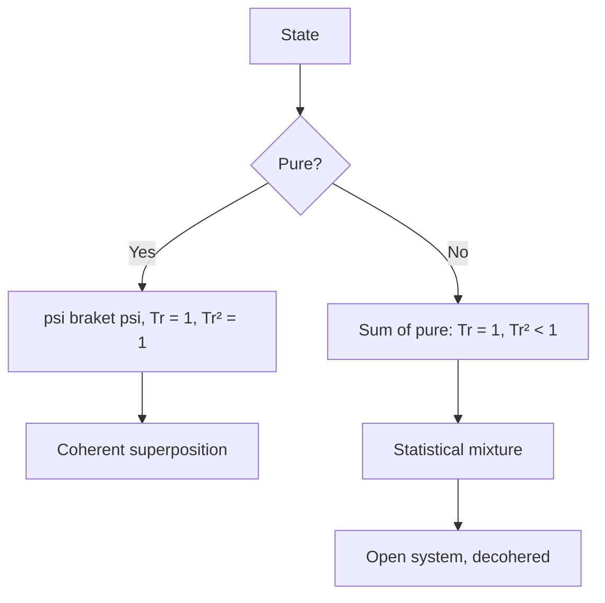
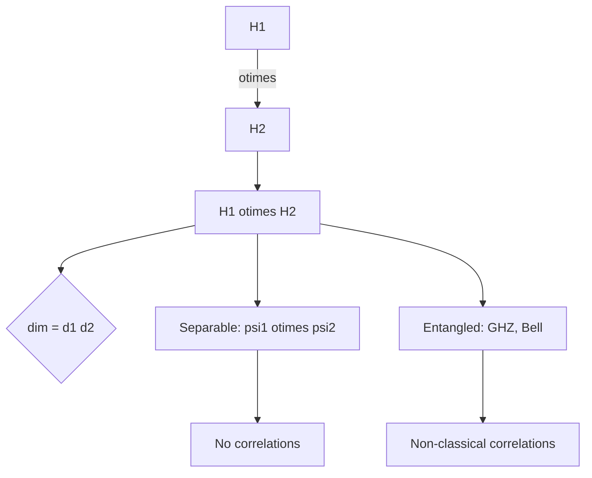
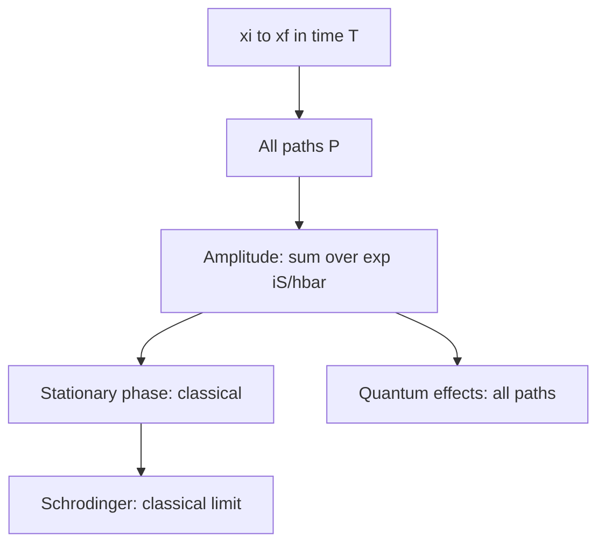
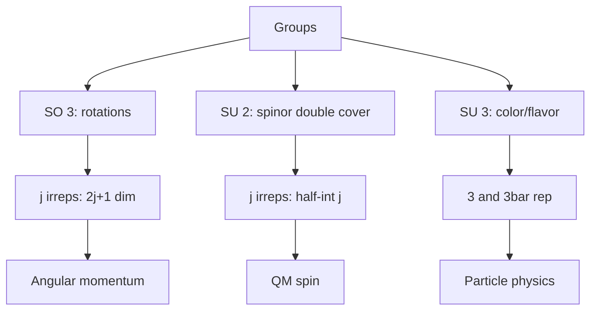

# PHYS 3037 — Honors Quantum Mechanics I
> **Phase 1 BSc Elective | HKUST PHYS 3037 | More rigorous than 3036, advanced topics**  
> **Bilingual 深度自學檔案 · 中英對照**

---

## 問題 1：5 個核心心智模型
1. **Hilbert space formalism** — rigorous inner product, completeness
2. **Density matrices** — mixed states
3. **Tensor products** — composite systems
4. **Path integral** — Feynman's formulation
5. **Symmetry groups** — representation theory

## 問題 2：3 個根本分歧
1. **Schrödinger vs path integral vs algebraic** — same physics
2. **Pure vs mixed states** — coherent vs statistical
3. **Wavefunction vs QFT** — particles vs fields

## 問題 3：10 個深度問題
1. 為什麼 $\psi$ 必須 be in $L^2$, not just any Hilbert space?
2. 給定 density matrix $\rho = \frac{1}{2}(I + \vec r \cdot \vec\sigma)$ on Bloch sphere, derive purity。
3. 為什麼 tensor product of two systems has dim = product?
4. 解釋 why path integral reproduce Schrödinger in stationary phase。
5. 給定 spin-1/2, derive rotation operator $U = e^{-i\vec\theta \cdot \vec S/\hbar}$。
6. 為什麼 SU(2) double covers SO(3) for half-integer spin?
7. 給定 Stern-Gerlach, derive $\langle S_z \rangle$ measurement。
8. 為什麼 EPR paradox resolved by Bell inequality, not by hidden variables?
9. 給定 two-qubit, derive CNOT matrix。
10. 解釋 why contextuality 係 quantum, not classical。

## 深入 1：Mathematical Formalism
**Deep Dive I**

Hilbert space, bounded/unbounded operators, spectral theorem, distributions.

**Engineering:** QM theory.

## 深入 2：Mixed States
**Deep Dive II**

Density matrix $\rho$, reduced density matrix, von Neumann entropy, decoherence.

**Engineering:** Quantum information, open systems.

## 深入 3：Composite Systems
**Deep Dive III**

Tensor product, entanglement entropy, partial trace, Bell states.

**Engineering:** Qubits, quantum computing.

## 深入 4：Path Integral
**Deep Dive IV**

$\langle x_f | e^{-iHt/\hbar} | x_i \rangle = \int \mathcal D x \, e^{iS/\hbar}$, sum over histories.

**Engineering:** QFT, statistical mechanics.

## 深入 5：Symmetry & Groups
**Deep Dive V**

Lie groups, Lie algebras, SU(2), SU(3), representations, Wigner theorem.

**Engineering:** Particle physics.

## 自測 1：L²
**Answer:** Probability interpretation requires normalization.  
**Engineering:** Wavefunction space.

## 自測 2：Purity
**Answer:** $\text{Tr}(\rho^2) = (1 + r^2)/2$, 1 pure, 1/2 max mixed.  
**Engineering:** Quantum state.

## 自測 3：Tensor product dim
**Answer:** $\dim(H_1 \otimes H_2) = \dim H_1 \cdot \dim H_2$.  
**Engineering:** Qubits.

## 自測 4：Path integral ↔ Schrödinger
**Answer:** Stationary phase of $\int e^{iS/\hbar}$ gives classical.  
**Engineering:** QFT.

## 自測 5：Rotation SU(2)
**Answer:** $\vec S = \hbar\vec\sigma/2$, $U$ for rotation $\vec\theta$.  
**Engineering:** Spin dynamics.

## 自測 6：SU(2) cover
**Answer:** $e^{i\pi\sigma_z} = -1$, double-valued rep.  
**Engineering:** Spinor.

## 自測 7：Stern-Gerlach
**Answer:** Project onto $S_z$ eigenstate.  
**Engineering:** Measurement.

## 自測 8：Bell vs hidden
**Answer:** Bell inequality violated, no local hidden vars.  
**Engineering:** QM foundations.

## 自測 9：CNOT
**Answer:** 4×4 matrix, $|00\rangle, |01\rangle$ unchanged, $|10\rangle \to |11\rangle, |11\rangle \to |10\rangle$.  
**Engineering:** Quantum gates.

## 自測 10：Contextuality
**Answer:** Outcome depends on measurement choice.  
**Engineering:** QM foundations.

## 📊 Diagram 1: Honors QM Map
```mermaid
mindmap
  root((Honors QM))
    Formalism
      Hilbert
      Operators
    Mixed states
      Density
      Entropy
    Composite
      Tensor
      Entangle
    Path integral
      Sum over paths
    Symmetry
      SU(2) SO(3)
      Reps
```

## 📊 Diagram 2: Density Matrix


## 📊 Diagram 3: Composite System


## 📊 Diagram 4: Path Integral


## 📊 Diagram 5: Group Hierarchy


## 深度總結

1. **Hilbert space = QM stage** — full formalism
2. **Mixed states = reality** — open systems
3. **Entanglement = quantum resource** — non-classical
4. **Path integral = alternative view** — Feynman's insight
5. **Symmetry = classification** — representation theory

---

**自學建議** — Sakurai "Modern Quantum Mechanics". Cohen-Tannoudji. Peres.
