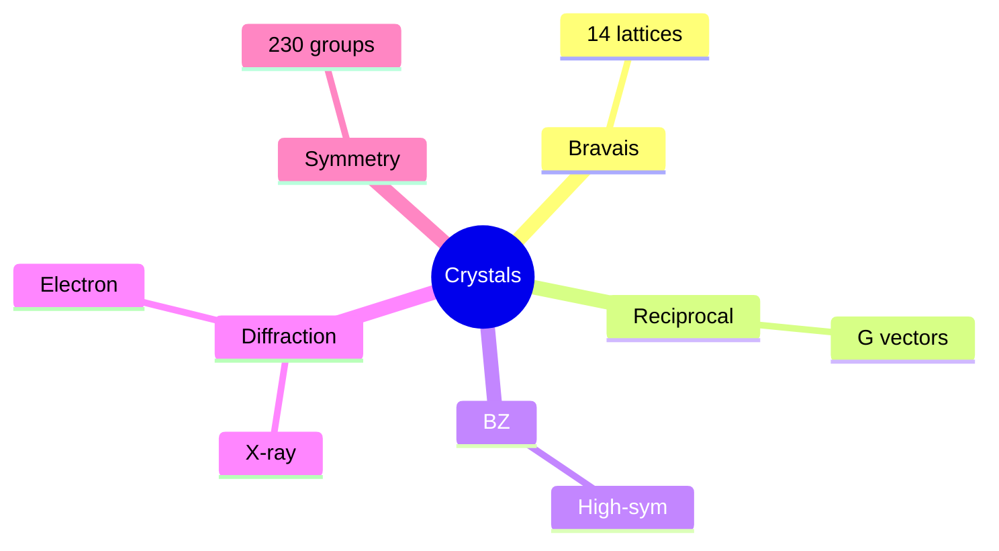
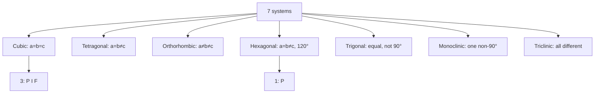
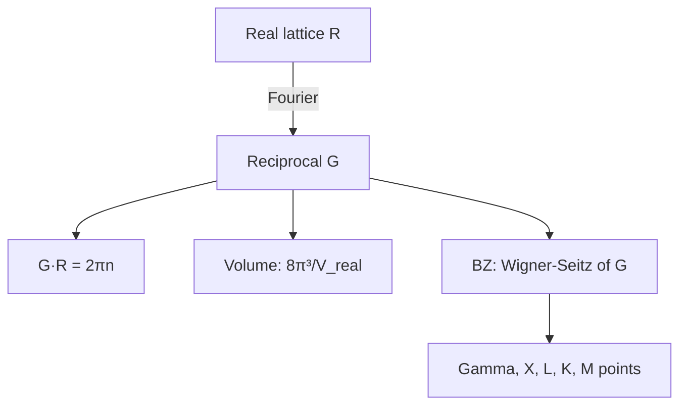
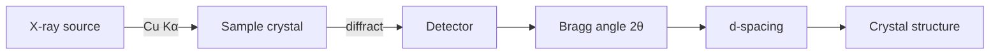
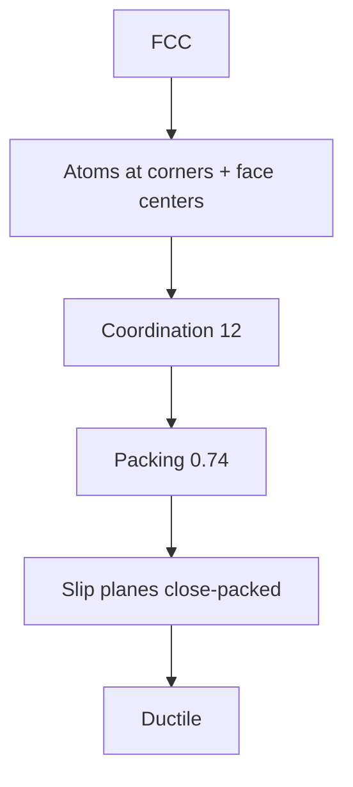

# PHYS 3042 — Crystalline Solids
> **Phase 1 BSc Elective | HKUST PHYS 3042 | Crystal structure, X-ray diffraction, lattices**  
> **Bilingual 深度自學檔案 · 中英對照**

---

## 問題 1：5 個核心心智模型
1. **Crystal = periodic lattice + basis** — Bravais lattices
2. **Reciprocal lattice** — Fourier dual of real lattice
3. **Brillouin zone** — Wigner-Seitz cell in reciprocal space
4. **X-ray diffraction** — Laue, Bragg conditions
5. **Symmetry groups** — 230 space groups

## 問題 2：3 個根本分歧
1. **Crystalline vs amorphous** — order vs disorder
2. **Real vs reciprocal space** — different physics
3. **Quasi vs aperiodic** — quasicrystals controversy

## 問題 3：10 個深度問題
1. 為什麼只有 14 Bravais lattices?
2. 給定 cubic lattice, derive reciprocal lattice。
3. 給定 Miller indices, derive plane spacing $d_{hkl}$。
4. 為什麼 Bragg condition $2d\sin\theta = n\lambda$?
5. 解釋 why structure factor $S = \sum f_j e^{i\vec G \cdot \vec r_j}$ determines peak intensity。
6. 給定 FCC, derive packing fraction $\pi/(3\sqrt 2)$。
7. 為什麼 reciprocal lattice 對 band theory 重要?
8. 解釋 why lattice vibrations (phonons) live in reciprocal space。
9. 給定 diffraction pattern, index the peaks。
10. 為什麼 X-ray 比 electron diffraction 對 thick samples?

## 深入 1：Bravais Lattices
**Deep Dive I**

14 lattices in 7 crystal systems. Primitive cell, conventional cell, Wigner-Seitz.

**Engineering:** Materials science.

## 深入 2：Reciprocal Lattice
**Deep Dive II**

$\vec G \cdot \vec R = 2\pi n$. $\vec G$ is a lattice in $k$-space.

**Engineering:** Band structure, diffraction.

## 深入 3：Brillouin Zone
**Deep Dive III**

First BZ: Wigner-Seitz of reciprocal lattice. High-symmetry points $\Gamma, X, L, K$.

**Engineering:** Solid-state physics.

## 深入 4：X-ray Diffraction
**Deep Dive IV**

Laue condition $\Delta \vec k = \vec G$. Bragg $2d\sin\theta = n\lambda$. Structure factor.

**Engineering:** XRD, crystallography.

## 深入 5：Symmetry
**Deep Dive V**

Point groups (32), space groups (230), Schoenflies + Hermann-Mauguin notation.

**Engineering:** Crystallography, materials ID.

## 自測 1：14 Bravais
**Answer:** 7 systems × (P, I, F, C as compatible) = 14.  
**Engineering:** Crystallography.

## 自測 2：Cubic reciprocal
**Answer:** Cubic, reciprocal of simple cubic is cubic.  
**Engineering:** Band structure.

## 自測 3：Plane spacing
**Answer:** $d_{hkl} = a/\sqrt{h^2 + k^2 + l^2}$ for cubic.  
**Engineering:** XRD.

## 自測 4：Bragg
**Answer:** Constructive interference from parallel planes.  
**Engineering:** X-ray.

## 自測 5：Structure factor
**Answer:** Sum of atomic scattering with phase.  
**Engineering:** Crystallography.

## 自測 6：FCC packing
**Answer:** $\pi/(3\sqrt 2) \approx 0.74$, densest.  
**Engineering:** Materials.

## 自測 7：Reciprocal for bands
**Answer:** $E(\vec k)$ in BZ, periodic.  
**Engineering:** Band structure.

## 自測 8：Phonons
**Answer:** $\omega(\vec q)$, dispersion in BZ.  
**Engineering:** Lattice dynamics.

## 自測 9：Indexing
**Answer:** Compare to known $d_{hkl}$.  
**Engineering:** Materials ID.

## 自測 10：X-ray vs electron
**Answer:** X-ray mass-thickness, electron strongly scattering.  
**Engineering:** Diffraction method.

## 📊 Diagram 1: Crystalline Solids Map

## 📊 Diagram 2: 7 Crystal Systems

## 📊 Diagram 3: Reciprocal Lattice

## 📊 Diagram 4: XRD Setup

## 📊 Diagram 5: FCC Structure

## 深度總結

1. **Crystal = lattice + basis** — minimal description
2. **Reciprocal = Fourier** — central to band theory
3. **BZ = fundamental domain** — k-space
4. **Diffraction probes structure** — XRD standard
5. **230 space groups** — complete classification

---

**自學建議** — Kittel "Introduction to Solid State Physics" Ch. 1-2. Ashcroft & Mermin.
