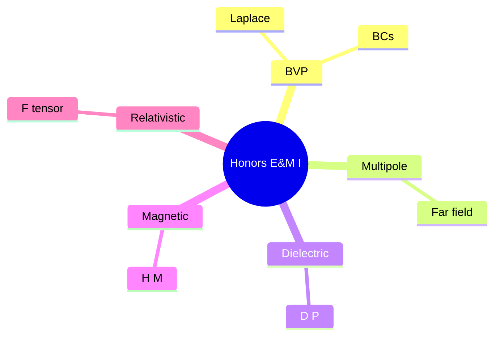
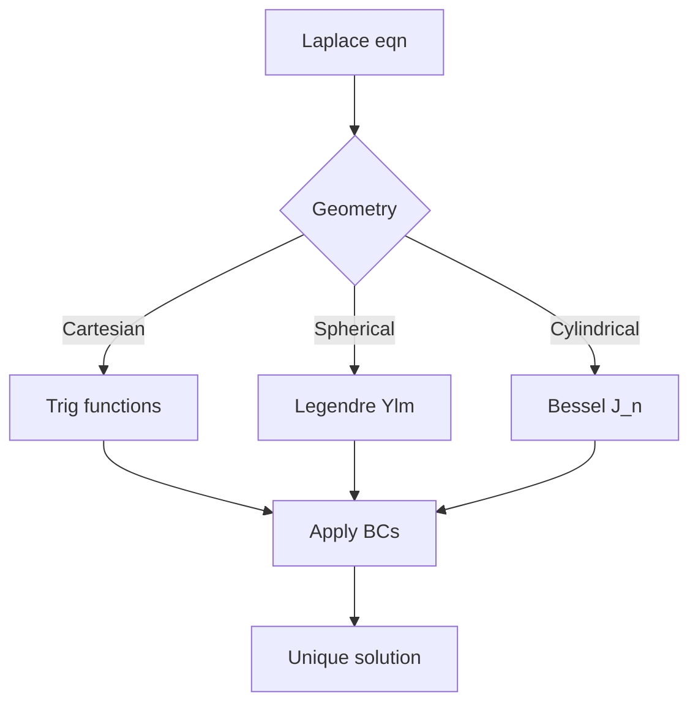
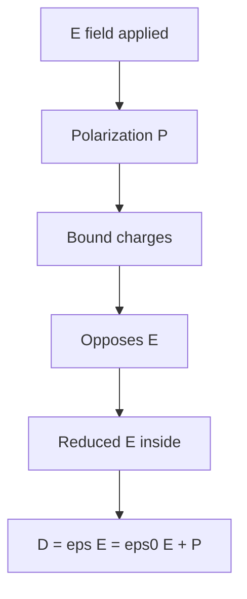
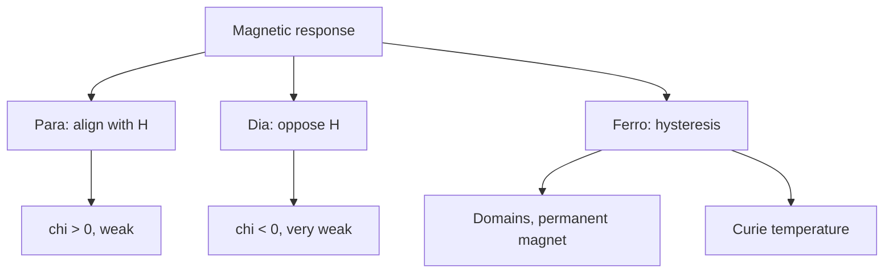

# PHYS 3053 — Honors Electricity & Magnetism I
> **Phase 1 BSc Elective | HKUST PHYS 3053 | Rigorous, smaller class, deeper than 3033**  
> **Bilingual 深度自學檔案 · 中英對照**

---

## 問題 1：5 個核心心智模型
1. **Boundary value problems** — uniqueness, separation of variables
2. **Multipole expansion** — far-field approximation
3. **Dielectric/magnetic materials** — $\vec D, \vec H$
4. **Maxwell stress tensor** — forces in fields
5. **Relativistic E&M** — 4-vectors, $F^{\mu\nu}$

## 問題 2：3 個根本分歧
1. **Microscopic vs macroscopic** — $\vec E$ vs $\vec D$
2. **Near vs far field** — multipole expansion
3. **Static vs dynamic** — quasi-static approximation

## 問題 3：10 個深度問題
1. 給定 spherical harmonics, derive general solution of Laplace。
2. 為什麼 uniqueness theorem 對 BVP 重要?
3. 給定 dipole, derive far field $V \sim p\cos\theta/(4\pi\epsilon_0 r^2)$。
4. 為什麼 $\vec D$ vs $\vec E$ 引入 for materials?
5. 給定 two charges in dielectric, derive bound charges。
6. 為什麼 magnetic materials have $\vec B = \mu_0(\vec H + \vec M)$?
7. 給定 E field, derive force on dielectric (Maxwell stress)。
8. 為什麼 Poynting theorem 需要 $\vec E \cdot \vec J$ term?
9. 給定 current loop, derive magnetic moment $\vec m = I \vec A$。
10. 為什麼 EM stress tensor 對 relativistic limit reduce to EM momentum?

## 深入 1：Boundary Value Problems
**Deep Dive I**

Laplace + BCs. Separation of variables in Cartesian, spherical, cylindrical.

**Engineering:** Electrostatics design.

## 深入 2：Multipole Expansion
**Deep Dive II**

$1/|\vec r - \vec r'| = \sum (r'^l/r^{l+1}) P_l(\cos\theta')$ for $r > r'$. Monopole, dipole, quadrupole.

**Engineering:** Antenna pattern, atomic.

## 深入 3：Dielectrics
**Deep Dive III**

Polarization $\vec P = \epsilon_0 \chi_e \vec E$. Bound charges $\rho_b = -\nabla \cdot \vec P$.

**Engineering:** Capacitor, insulator.

## 深入 4：Magnetic Materials
**Deep Dive IV**

$\vec M$, susceptibility, hysteresis. Para, dia, ferro. Domain structure.

**Engineering:** Transformer, motor, data storage.

## 深入 5：Relativistic E&M
**Deep Dive V**

$F^{\mu\nu}$ tensor. Lorentz transformation of $\vec E, \vec B$. 4-force.

**Engineering:** Accelerators, particle physics.

## 自測 1：Separation
**Answer:** $V = R(r)\Theta(\theta)\Phi(\phi)$, leads to Legendre, Bessel.  
**Engineering:** BVP.

## 自測 2：Uniqueness
**Answer:** Laplace + Dirichlet/Neumann = unique.  
**Engineering:** All BVPs.

## 自測 3：Dipole
**Answer:** $V = \vec p \cdot \hat r / (4\pi\epsilon_0 r^2)$ far field.  
**Engineering:** Molecule.

## 自測 4：D vs E
**Answer:** $\vec D$ includes polarization response.  
**Engineering:** Material.

## 自測 5：Bound charges
**Answer:** $\sigma_b = \vec P \cdot \hat n$ on surface.  
**Engineering:** Dielectric.

## 自測 6：Magnetic materials
**Answer:** $\vec H = \vec B/\mu_0 - \vec M$, $\vec B = \mu \vec H$ linear.  
**Engineering:** Transformer core.

## 自測 7：Maxwell stress
**Answer:** $T_{ij} = \epsilon_0(E_i E_j - \frac{1}{2}\delta_{ij} E^2) + \mu_0^{-1}(B_i B_j - \frac{1}{2}\delta_{ij} B^2)$.  
**Engineering:** Force on body.

## 自測 8：Poynting
**Answer:** Energy balance, $-\partial u/\partial t = \nabla \cdot \vec S + \vec J \cdot \vec E$.  
**Engineering:** Energy flow.

## 自測 9：Magnetic moment
**Answer:** $\vec m = \frac{1}{2}\int \vec r \times \vec J \, dV$, for loop = $IA$.  
**Engineering:** NMR, atomic.

## 自測 10：Relativistic F
**Answer:** $F^{\mu\nu}$ transforms as antisymmetric tensor.  
**Engineering:** Particle physics.

## 📊 Diagram 1: Honors E&M Map


## 📊 Diagram 2: Laplace Solutions


## 📊 Diagram 3: Multipole Expansion
```mermaid
graph TD
    A[1/|r-r'|] --> B[r > r']
    B --> C[Sum: r'^l/r^(l+1) P_l cos theta]
    C --> D[l=0: monopole]
    C --> E[l=1: dipole]
    C --> F[l=2: quadrupole]
    D --> G[Total charge]
    E --> H[p cos theta]
    F --> I[Tensor]
```

## 📊 Diagram 4: Dielectric Response


## 📊 Diagram 5: Magnetic Materials


## 深度總結

1. **BVP uniqueness** — Laplace + BCs = unique
2. **Multipole = far field** — hierarchical approximation
3. **Materials = response functions** — $\chi_e, \chi_m$
4. **Stress tensor = forces** — Maxwell synthesis
5. **Relativistic unification** — $F^{\mu\nu}$ combines E, B

---

**自學建議** — Griffiths Ch. 3-4. Jackson Ch. 3-4.
