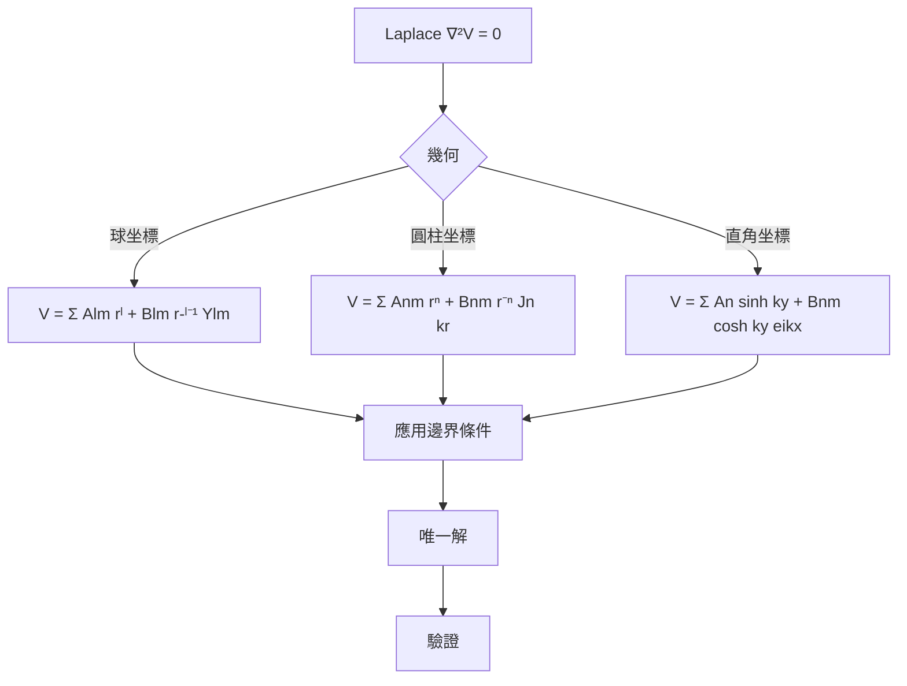
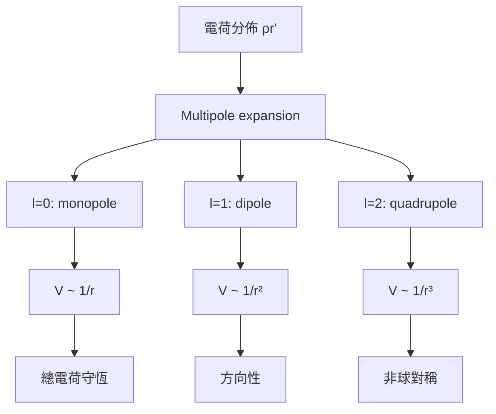
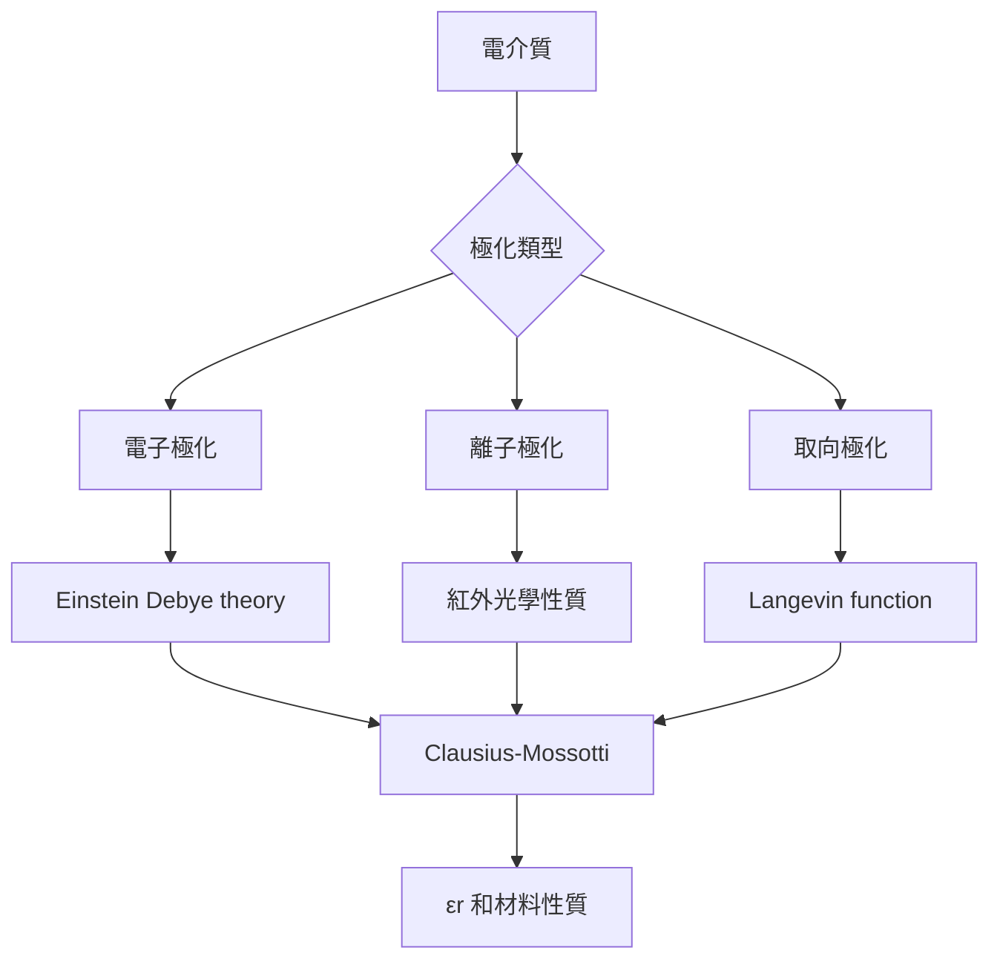
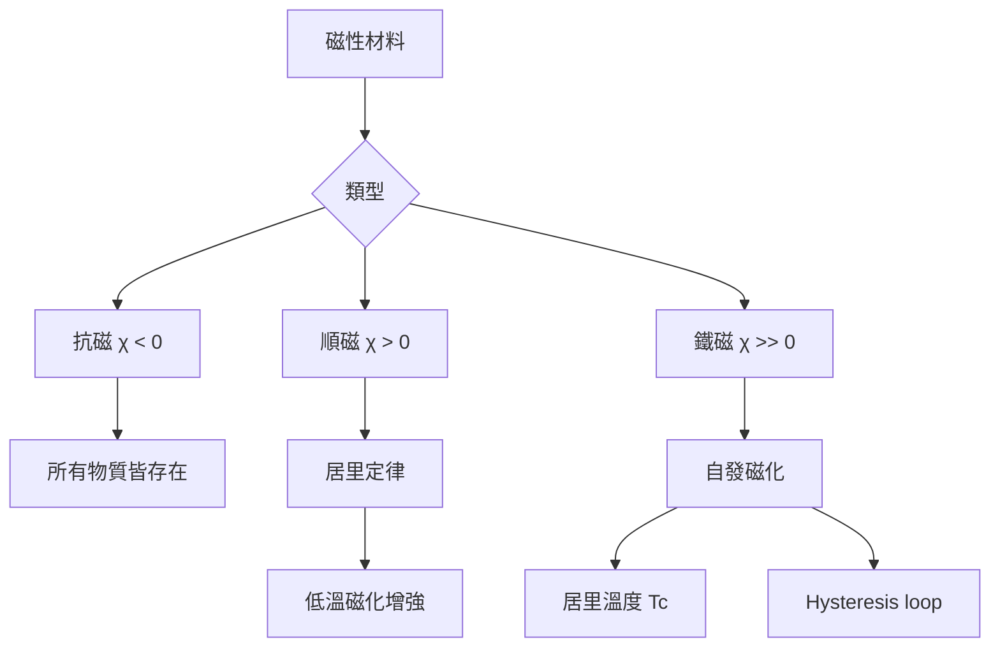
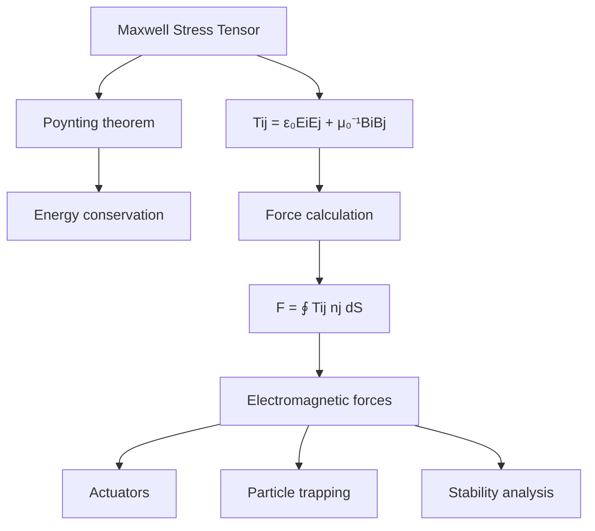
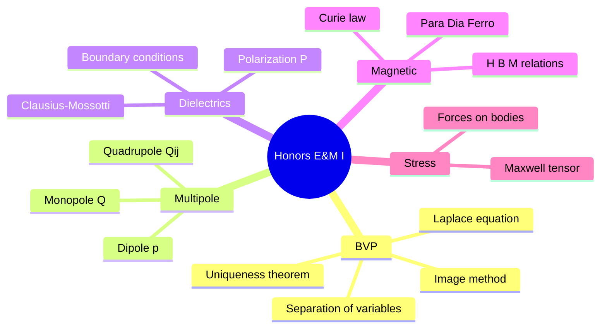
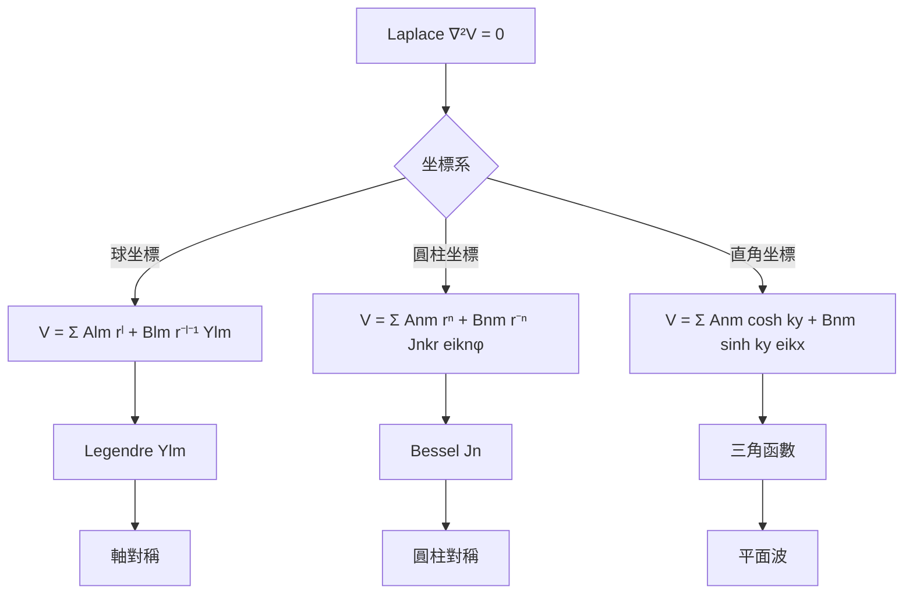
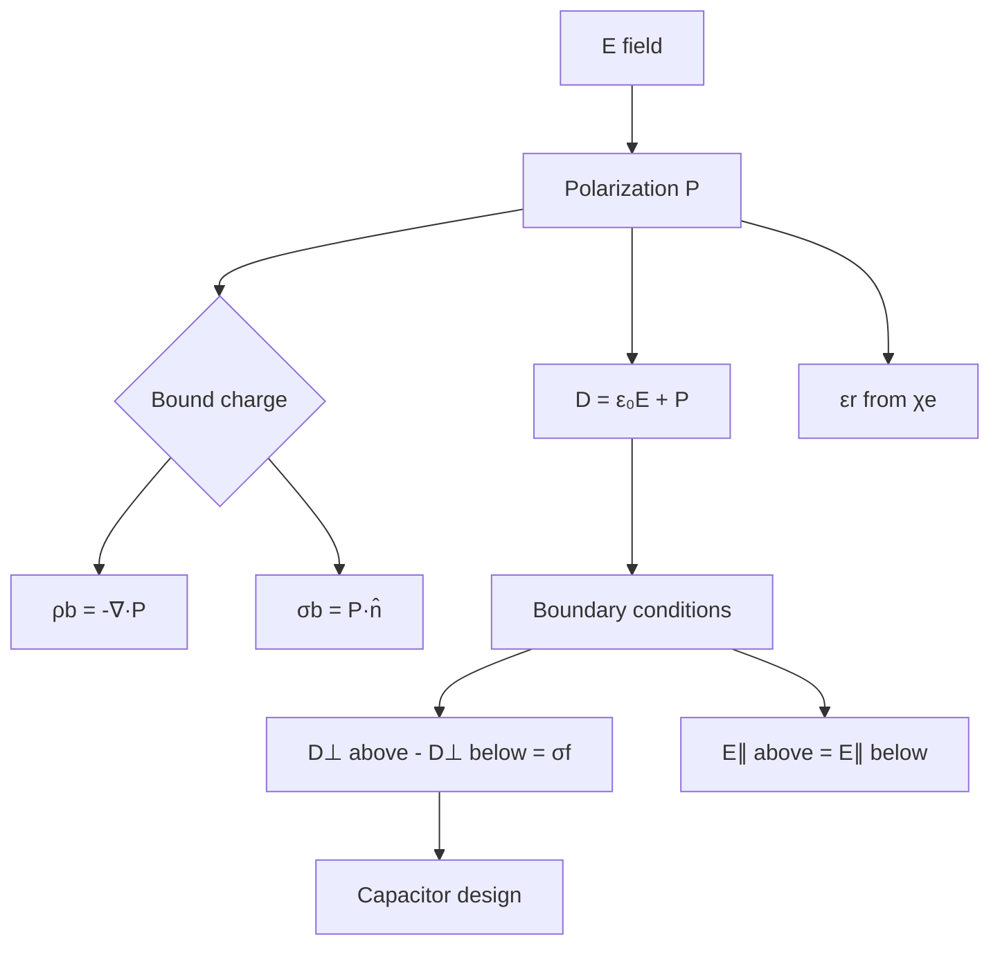
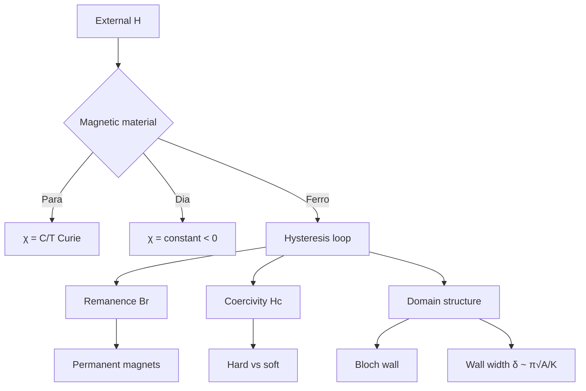

# PHYS 3053 — Honors Electricity & Magnetism I
> **Phase 1 BSc Elective | HKUST PHYS 3053 | Rigorous E&M: BVP, Multipole, Dielectrics, Magnetism**  
> **Bilingual 深度自學檔案 · 中英對照**

---

## 問題 1：5 個核心心智模型
**What are the 5 core mental models every expert shares?**

1. **Uniqueness theorems are the foundation of boundary value problems** — Laplace + Dirichlet/Neumann BC → unique solution (Griffiths Ch. 3; Jackson Ch. 2)
2. **Multipole expansion = far-field power series** — $1/|\mathbf{r}-\mathbf{r}'| = \sum_{l=0}^\infty (r'^l/r^{l+1})P_l(\cos\theta)$; monopole $\to$ dipole $\to$ quadrupole (Griffiths 3.4)
3. **D and H are the macroscopic fields** — $\mathbf{D} = \epsilon_0\mathbf{E}+\mathbf{P}$, $\mathbf{H} = \mathbf{B}/\mu_0 - \mathbf{M}$; Maxwell equations in materials (Griffiths 4.2)
4. **Maxwell stress tensor encodes all EM forces** — $T_{ij} = \epsilon_0(E_iE_j - \frac{1}{2}\delta_{ij}E^2) + \mu_0^{-1}(B_iB_j - \frac{1}{2}\delta_{ij}B^2)$ (Griffiths 8.2)
5. **Relativistic E&M unifies E and B** — electromagnetic field tensor $F^{\mu\nu}$, Lorentz covariance of Maxwell's equations (Jackson Ch. 11)

---

## 問題 2：3 個根本分歧
**Where do experts fundamentally disagree?**

1. **Microscopic vs macroscopic fields** — $\mathbf{E}_\text{micro}$ (atomistic, time-varying) vs $\mathbf{D}$ (continuum average)
   - Microscopic: Maxwell's equations in vacuum apply at all scales
   - Macroscopic: $\mathbf{D}, \mathbf{H}$ introduced for material response; boundary conditions at interfaces

2. **Near field vs far field multipole** — which order dominates and when to truncate
   - Near field ($kr < 1$): higher multipole terms can dominate
   - Far field ($kr \gg 1$): lowest non-vanishing term dominates

3. **Static vs quasi-static approximation** — when displacement current matters
   - Static ($\partial/\partial t = 0$): Coulomb's law exact, no EM waves
   - Quasi-static ($\omega \ll c/L$): ignore displacement current locally, still use static methods

---

## 問題 3：10 個深度問題
**Generate 10 questions that distinguish deep understanding from memorization**

1. 給定球諧函數 $Y_{lm}(\theta,\phi)$，完整推導 Laplace 方程的通解並證明正交性。

2. 證明唯一性定理：$\nabla^2 V = 0$ 在區域內，邊界上 $V$ 或 $\partial V/\partial n$ 指定 → 解唯一。

3. 給定電荷分佈 $\rho(\mathbf{r}')$，推導多極展開式並證明 monopole、dipole、quadrupole 項的分別意義。

4. 為什麼 $\mathbf{D}$ 和 $\mathbf{E}$ 需要區分？給定電介質證明邊界條件 $\mathbf{D}_\perp^\text{above} - \mathbf{D}_\perp^\text{below} = \sigma_f$。

5. 給定均匀電場中的球形電介質，計算內部電場 $\mathbf{E}_\text{in} = 3\epsilon_0\mathbf{E}_0/(\epsilon_r + 2)$ 並解釋極化效應。

6. 為什麼磁化 $\mathbf{M}$ 引入束縛電流 $\mathbf{J}_b = \nabla \times \mathbf{M}$ 而非磁荷？

7. 推導 Maxwell stress tensor 從 Poynting theorem 並證明對任意封閉表面的力 $\mathbf{F} = \oint T_{ij}\,n_j\,dS$。

8. 給定磁介質的磁化曲線，解釋抗磁、順磁、鉄磁的微觀起源（朗之萬函數、居里定律）。

9. 為什麼 $F^{\mu\nu}$ 是反對稱張量？推導 Lorentz transformation 下的變換規則並證明 $\partial_\mu F^{\mu\nu} = \mu_0 J^\nu$ 的協變性。

10. 給定球形電容器，證明電容 $C = 4\pi\epsilon_0 a b/(b-a)$ 並討論電介質填充的影響。

---

## 深入 1：邊界值問題與分離變量法 (Boundary Value Problems)
**Deep Dive I**

### 唯一性定理 (Uniqueness Theorem)

**Theorem:** 若區域 $V$ 內 $\nabla^2 V = 0$，且邊界 $S$ 上：
- Case 1: $V|_S = f$（Dirichlet 條件）
- Case 2: $\partial V/\partial n|_S = g$（Neumann 條件，$\int_S g\,dS = 0$）

則解唯一存在。

**Proof sketch:** 假設兩個解 $V_1, V_2$，則 $U = V_1 - V_2$ 滿足 $\nabla^2 U = 0$，邊界上 $U = 0$ 或 $\partial U/\partial n = 0$。由格林恆等式 $\oint U\frac{\partial U}{\partial n}\,dS = \int_V |\nabla U|^2\,dV = 0$，故 $\nabla U = 0$，$U = \text{const}$，由邊界條件得 $U = 0$。

### 分離變量：Laplace 方程

在球坐標 $(r,\theta,\phi)$：
$$V(r,\theta,\phi) = \sum_{l=0}^\infty\sum_{m=-l}^l \left[A_{lm}r^l + B_{lm}r^{-(l+1)}\right] Y_{lm}(\theta,\phi)$$

**Legendre 多項式（軸對稱）：**
$$V(r,\theta) = \sum_l \left[A_l r^l + B_l r^{-(l+1)}\right] P_l(\cos\theta)$$

### 常見邊界值問題

**接地導體平面附近的點電荷 $q$：**
方法：鏡像法
$$V = \frac{q}{4\pi\epsilon_0}\left[\frac{1}{\sqrt{(x-a)^2+y^2+z^2}} - \frac{1}{\sqrt{(x+a)^2+y^2+z^2}}\right]$$

**金屬球殼外的均匀電場 $E_0\hat{z}$：**
$$V = -E_0 r\cos\theta + \frac{q}{r}\cos\theta \quad \Rightarrow \quad V = -E_0\left(r - \frac{R^3}{r^2}\right)\cos\theta$$

**Engineering application:** 計算機殼屏蔽、感測器設計、微波腔體



---

## 深入 2：多極展開 (Multipole Expansion)
**Deep Dive II**

### 完整推導

電勢多極展開（$r \gg r'$）：
$$\frac{1}{|\mathbf{r}-\mathbf{r}'|} = \frac{1}{r}\sum_{l=0}^\infty \left(\frac{r'}{r}\right)^l P_l(\cos\theta)$$

**各階展開項：**

| 階數 $l$ | 名稱 | 電勢形式 | 物理意義 |
|---------|------|---------|---------|
| $l=0$ | Monopole | $\frac{Q}{4\pi\epsilon_0 r}$ | 總電荷 |
| $l=1$ | Dipole | $\frac{\mathbf{p}\cdot\hat{r}}{4\pi\epsilon_0 r^2}$ | 電偶極矩 $\mathbf{p}$ |
| $l=2$ | Quadrupole | $\frac{1}{8\pi\epsilon_0}\frac{Q_{ij}\hat{r}_i\hat{r}_j}{r^3}$ | 四極矩張量 |

**電偶極矩定義：**
$$\mathbf{p} = \int \mathbf{r}'\rho(\mathbf{r}')\,dV'$$

**電四極矩張量：**
$$Q_{ij} = \int \left(3x_i'x_j' - r'^2\delta_{ij}\right)\rho(\mathbf{r}')\,dV'$$

**例子：偏離中心的電荷分佈**
$$V \approx \frac{Q}{4\pi\epsilon_0 r} + \frac{\mathbf{p}\cdot\hat{r}}{4\pi\epsilon_0 r^2} + \frac{1}{4\pi\epsilon_0}\frac{1}{2r^3}\sum Q_{ij}\hat{r}_i\hat{r}_j$$

**電場：**
$$\mathbf{E} = -\nabla V \approx \frac{3(\mathbf{p}\cdot\hat{r})\hat{r} - \mathbf{p}}{4\pi\epsilon_0 r^3} \quad \text{(dipole)}$$

**Engineering application:** 天線輻射圖樣（far field pattern）、分子光譜（Raman selection rules）、核四極共振



---

## 深入 3：電介質物理 (Dielectric Physics)
**Deep Dive III**

### 微觀極化機制

| 機制 | 響應時間 | 典型極化率 |
|------|---------|-----------|
| 電子極化 | $10^{-15}$ s | $\sim 10^{-40}$ F·m² |
| 離子極化 | $10^{-13}$ s | $\sim 10^{-39}$ F·m² |
| 取向極化 | $10^{-12}$–$10^{-9}$ s | $\sim 10^{-38}$ F·m² |

**極化率與介電常數（Clausius-Mossotti）：**
$$\frac{\epsilon_r - 1}{\epsilon_r + 2} = \frac{n\alpha}{3\epsilon_0}$$

### 邊界條件

$$\mathbf{D}_\perp^\text{above} - \mathbf{D}_\perp^\text{below} = \sigma_f$$
$$\mathbf{E}_\parallel^\text{above} - \mathbf{E}_\parallel^\text{below} = 0$$

其中 $\mathbf{D} = \epsilon_0\mathbf{E} + \mathbf{P} = \epsilon\mathbf{E}$（線性介質）

### 均勻電場中的電介質球

外部電場 $\mathbf{E}_0 = E_0\hat{z}$：
- 球內電場：$\mathbf{E}_\text{in} = \frac{3\epsilon_0}{\epsilon_r + 2}\mathbf{E}_0$
- 球內電勢：$V_\text{in} = -\frac{3}{\epsilon_r + 2}E_0 r\cos\theta$
- 束縛電荷密度：$\sigma_b = \mathbf{P}\cdot\hat{n} = \epsilon_0\frac{\epsilon_r - 1}{\epsilon_r + 2}3E_0\cos\theta$

**特例：**
- $\epsilon_r \gg 1$（金屬導體）：$\mathbf{E}_\text{in} \to 0$（屏蔽）
- $\epsilon_r = 1$（真空）：$\mathbf{E}_\text{in} = \mathbf{E}_0$

### 電介質中的能量

$$U = \frac{1}{2}\int \mathbf{E}\cdot\mathbf{D}\,dV = \frac{1}{2}\int \epsilon E^2\,dV$$

電介質球在均匀電場中的能量：
$$U = -\frac{4\pi\epsilon_0}{3}\left(\frac{\epsilon_r - 1}{\epsilon_r + 2}\right)E_0^2 R^3$$

力：$F = -\partial U/\partial z > 0$（球被吸向電場增強區域）

**Engineering application:** 電容器設計、微波介質諧振器、光纖非線性光學



---

## 深入 4：磁性材料 (Magnetic Materials)
**Deep Dive IV**

### 磁化與磁場

$$\mathbf{B} = \mu_0(\mathbf{H} + \mathbf{M})$$

- $\mathbf{H}$：磁場強度（由自由電流產生）
- $\mathbf{M}$：磁化強度（由束縛電流產生）
- $\mu_0 = 4\pi \times 10^{-7}$ H/m

### 微觀分類

**抗磁性（所有物質）：**
$$\chi_m = \frac{\mu_0 NZe^2}{6m_e}\langle r^2\rangle < 0, \quad |\chi_m| \sim 10^{-5}$$
- 起源：外磁場改變軌道電子 Larmor precession
- 典型：金、銀、銅、惰性氣體

**順磁性（具有磁矩的原子）：**
$$\chi_m = \frac{\mu_0 N m^2}{3k_BT} \quad \text{（居里定律）}$$
- 起源：熱平衡下磁矩沿 $\mathbf{B}$ 排列
- 典型：氧、鐵磁雜質

**鐵磁性（自發磁化）：**
$$M_s(T) = M_0\left(1 - \frac{3T}{2T_c}\right)^{1/3} \quad (T \to T_c^-)$$

- 起源：電子交換作用（量子力學，Heisenberg model）
- 居里溫度：Fe ($T_c = 1043$ K), Co ($T_c = 1394$ K), Ni ($T_c = 627$ K)

### 磁疇與滯後

- **單疇顆粒**：當顆粒足夠小，整個顆粒為一個磁疇
- **磁疇壁**：Bloch wall（磁化方向在壁內連續旋轉）
- **滯後迴線**：$M(H)$ 非線性，由磁疇壁運動和磁疇旋轉主導

**Engineering application:** 變壓器鐵芯、硬磁盤存儲、永磁同步馬達



---

## 深入 5：Maxwell 應力張量與力 (Maxwell Stress Tensor & Forces)
**Deep Dive V**

### 從 Poynting 定理推導

Poynting 定理：
$$-\frac{\partial u}{\partial t} = \nabla\cdot\mathbf{S} + \mathbf{J}\cdot\mathbf{E}$$

能量密度：$u = \frac{1}{2}\epsilon_0E^2 + \frac{1}{2\mu_0}B^2$

Poynting 向量：$\mathbf{S} = \mathbf{E}\times\mathbf{H}$

### Maxwell 應力張量

$$\boxed{T_{ij} = \epsilon_0 E_i E_j + \mu_0^{-1}B_i B_j - \frac{1}{2}\delta_{ij}\left(\epsilon_0E^2 + \frac{1}{\mu_0}B^2\right)}$$

**物理意義：** $T_{ij}$ 是 $i$ 方向穿過垂直於 $j$ 方向的表面的動量流密度。

### 力與力矩

$$\mathbf{F} = \oint_S T_{ij}\,n_j\,dS$$

**例子：均匀電場中的電介質球（利用應力張量）**

球表面的電場（外部）：
$$E_r^\text{out} = E_0\cos\theta\left(1 + \frac{2R^3}{r^3}\right)$$

作用在球上的力：
$$F_z = \oint T_{zz}\,n_z\,R^2\sin\theta\,d\theta\,d\phi$$

結果：$F = 2\pi\epsilon_0 E_0^2 R^2\frac{\epsilon_r - 1}{\epsilon_r + 2}$（沿 $z$ 方向）

**Engineering application:** 電致動器設計、膠體懸浮穩定性、麥克斯韋應力在數值計算中的應用（COMSOL, ANSYS Maxwell）



---

## 自測 1：球殼內的 Laplace 方程
**接地導體球殼（內半徑 $b$，外半徑 $c$）內有一點電荷 $q$ 距球心 $a$ ($a < b$）。求電勢分佈。**

**Answer / 解答:**
區域 I ($r < b$)：包含真實電荷 + 鏡像電荷
區域 II ($b < r < c$)：$\nabla^2 V = 0$，邊界條件 $V(b) = 0$
區域 III ($r > c$)：$V(c) = 0$

鏡像法（區域 I）：
在 $r' = b^2/a$ 處放置鏡像 $q' = -qb/a$，同時在 $r'' = c^2/b$ 處再加鏡像

$$V_\text{I}(r,\theta) = \frac{1}{4\pi\epsilon_0}\left[\frac{q}{\sqrt{r^2+a^2-2ar\cos\theta}} - \frac{qb}{a}\frac{1}{\sqrt{r^2+(b^2/a)^2-2r(b^2/a)\cos\theta}}\right]$$

**Engineering implication:** 屏蔽腔設計、微波腔體

---

## 自測 2：電偶極子的勢能
**證明電偶極子 $\mathbf{p}$ 在外電場 $\mathbf{E}$ 中的勢能 $U = -\mathbf{p}\cdot\mathbf{E}$。**

**Answer / 解答:**
功定理：把偶極子從無場位置移到外場中
$$U = \int_0^{\mathbf{p}} \mathbf{E}\cdot d\mathbf{p}' = \int_0^p E\cos\alpha\,dp' = Ep\cos\alpha = -\mathbf{p}\cdot\mathbf{E}$$

另一方法：$U = \mathbf{F}\cdot\mathbf{r}$，力 $\mathbf{F} = \nabla(\mathbf{p}\cdot\mathbf{E}) = \mathbf{p}\cdot\nabla\mathbf{E}$，對均匀場 $\mathbf{E}$：
$$U = -\mathbf{p}\cdot\mathbf{E}$$

力矩：$\boldsymbol{\tau} = \mathbf{p}\times\mathbf{E}$，使偶極子轉向與場對齊。

**Engineering implication:** 電場感測器、核磁共振（NMR）

---

## 自測 3：球形電容器的電容
**證明球形電容器（內半徑 $a$，外半徑 $b$）的電容 $C = 4\pi\epsilon_0 ab/(b-a)$。**

**Answer / 解答:**
假設內球帶電 $+Q$，外球帶電 $-Q$。

由高斯定理，$a < r < b$ 時：
$$E_r = \frac{Q}{4\pi\epsilon_0 r^2}$$

電壓：
$$V = -\int_a^b E_r\,dr = \frac{Q}{4\pi\epsilon_0}\left(\frac{1}{a} - \frac{1}{b}\right)$$

電容：
$$C = \frac{Q}{V} = \frac{4\pi\epsilon_0 ab}{b-a}$$

特例：$b \to \infty$（孤立球）：$C = 4\pi\epsilon_0 a$

**Engineering implication:** 標準電容器的原理、球形電壓測量

---

## 自測 4：電介質球內的電場
**計算均匀電場 $\mathbf{E}_0$ 中電介質球（$\epsilon_r$）的內部電場，驗證 $\mathbf{E}_\text{in} = 3\epsilon_0\mathbf{E}_0/(\epsilon_r+2)$。**

**Answer / 解答:**
假設球內電勢形式：$V_\text{in} = -E_\text{in}\,r\cos\theta + A\frac{\cos\theta}{r^2}$（軸對稱）

球外：$V_\text{out} = -E_0\,r\cos\theta + B\frac{\cos\theta}{r^2}$

邊界條件 ($r=R$)：
1. $V_\text{in} = V_\text{out}$
2. $\epsilon_\text{in}\frac{\partial V_\text{in}}{\partial r} = \epsilon_0\frac{\partial V_\text{out}}{\partial r}$

由邊界條件解得：
$$E_\text{in} = \frac{3\epsilon_0}{\epsilon_r + 2}E_0$$

**物理意義：**
- $\epsilon_r > 1$ → $E_\text{in} < E_0$（電場被削弱）
- $\epsilon_r \gg 1$ → $E_\text{in} \to 0$（金屬導體完全屏蔽）

**Engineering implication:** 電場聚焦（光纖）、複合材料設計

---

## 自測 5：抗磁性的量子力學起源
**解釋為什麼所有物質都有抗磁性，並計算典型磁化率數量級。**

**Answer / 解答:**
抗磁性起源於外加磁場改變電子軌道運動（Larmor precession）。

外加磁場：$\mathbf{B} = B\hat{z}$，電子受到 Lorentz 力 $m\dot{\mathbf{v}} = -e(\mathbf{v}\times\mathbf{B})$，引入附加角速度 $\Delta\omega = \frac{eB}{2m_e}$（Larmor 頻率）。

附加電流產生的磁矩：
$$\Delta\mu = -\frac{e^2 B}{6m_e}\langle r_\perp^2\rangle$$

對每個電子，磁化率：
$$\chi_\text{Larmor} = \frac{\mu_0 NZe^2\langle r_\perp^2\rangle}{6m_e}$$

典型值：$\chi \sim -10^{-5}$（與溫度無關）

**Engineering implication:** 核磁共振中的反向磁場、磁懸浮（Pyrolytic graphite）

---

## 自測 6：磁疇壁的能量
**估算 Bloch 壁寬度並證明為什麼鐵磁材料形成多疇結構。**

**Answer / 解答:**
Bloch 壁：磁化方向在壁內連續旋轉

交換能密度：$w_\text{ex} = A\left(\frac{d\theta}{dz}\right)^2$（相鄰自旋平行傾向）
磁晶各向異性能密度：$w_K = K\sin^2\theta$

總能量最小化：
$$\int \left[A\left(\frac{d\theta}{dz}\right)^2 + K\sin^2\theta\right]dz = \text{minimum}$$

解：$\theta(z)$ 從 $0$ 到 $\pi$，壁寬度：
$$\delta = \pi\sqrt{\frac{A}{K}}$$

典型值（Fe）：
- $A \sim 10^{-11}$ J/m（交換作用）
- $K \sim 5\times 10^4$ J/m³（磁晶各向異性）
- $\delta \sim \pi\sqrt{10^{-11}/5\times 10^4} \approx 25$ nm

多疇結構減少靜磁能：單疇顆粒的靜磁能 $\propto M_s^2 V$，多疇結構可降低。

**Engineering implication:** 磁性存儲介質設計（Gibbs free energy minimization）

---

## 自測 7：Maxwell 應力計算
**用 Maxwell stress tensor 計算均匀磁場中細導線圈的受力，驗證 $F = I(\partial L/\partial z)B$。**

**Answer / 解答:**
細導線圈在磁場 $\mathbf{B} = B\hat{z}$ 中：
$$\mathbf{F} = \oint I\,d\mathbf{l}\times\mathbf{B} = I\int d\mathbf{l}\times\mathbf{B}$$

用 Maxwell stress：
$$T_{ij} = \frac{1}{\mu_0}B_i B_j - \frac{1}{2\mu_0}B^2\delta_{ij}$$

對 $\mathbf{B}$ 沿 $z$：
$$T_{zz} = \frac{B^2}{2\mu_0}$$

對封閉表面：
$$\mathbf{F} = \oint_S T_{ij}\,n_j\,dS$$

結果與 $F = I(\partial L/\partial z)B$ 一致（虚功原理）。

**Engineering implication:** 馬達力矩計算、磁懸浮列車受力分析

---

## 自測 8：鐵磁居里定律
**用 Mean-field theory 推導居里定律 $\chi = C/(T - T_c)$ 並解釋自發磁化的起源。**

**Answer / 解答:**
平均場近似：每個自旋受到的有效場 $B_\text{eff} = B + \lambda M$

自旋磁矩的朗之萬函數：
$$\frac{M}{M_s} = \mathcal{L}\left(\frac{\mu B_\text{eff}}{k_BT}\right) = \coth\left(\frac{\mu B_\text{eff}}{k_BT}\right) - \frac{k_BT}{\mu B_\text{eff}}$$

設 $B = 0$，在居里溫度附近 $M$ 很小：
$$M \approx \frac{N\mu^2}{3k_B(T - \theta)}\frac{B}{k_B} \quad \Rightarrow \quad \chi = \frac{C}{T - T_c}$$

其中居里常數 $C = N\mu^2\mu_0/3k_B$，居里溫度 $T_c = \theta$。

物理意義：$T > T_c$，熱擾動超過交換作用，自發磁化消失。

**Engineering implication:** 磁熱效應（磁冰箱）、自旋電子學

---

## 自測 9：Lorentz 變換中的電場與磁場
**證明 Lorentz 變換下 $\mathbf{E}'_\parallel = \mathbf{E}_\parallel$, $\mathbf{E}'_\perp = \gamma(\mathbf{E}_\perp + \mathbf{v}\times\mathbf{B})$。**

**Answer / 解答:**
$F^{\mu\nu}$ 是反對稱張量：
$$F^{\mu\nu} = \begin{pmatrix} 0 & -E_x/c & -E_y/c & -E_z/c \\ E_x/c & 0 & -B_z & B_y \\ E_y/c & B_z & 0 & -B_x \\ E_z/c & -B_y & B_x & 0 \end{pmatrix}$$

Lorentz 變換（boost 沿 $x$）：
$$F'^{0i} = \Lambda^\mu_0\Lambda^i_\nu F^{\nu i}$$

結果：
$$\mathbf{E}'_\parallel = \mathbf{E}_\parallel, \quad \mathbf{E}'_\perp = \gamma(\mathbf{E}_\perp + \mathbf{v}\times\mathbf{B})$$
$$\mathbf{B}'_\parallel = \mathbf{B}_\parallel, \quad \mathbf{B}'_\perp = \gamma\left(\mathbf{B}_\perp - \frac{\mathbf{v}\times\mathbf{E}}{c^2}\right)$$

**關鍵含義：** 純電場在運動觀察者看來包含磁場；純磁場在運動觀察者看來包含電場——這證明了 E 和 B 的統一性。

**Engineering implication:** 粒子加速器磁鐵、磁約束等離子體

---

## 自測 10：電四極矩計算
**計算均匀带電橢球 ($a = b \neq c$) 的電四極矩並給出電勢。**

**Answer / 解答:**
電四極矩張量：
$$Q_{ij} = \int \left(3x_i x_j - r^2\delta_{ij}\right)\rho\,dV$$

對均匀带電橢球（總電荷 $Q$，體積 $V = \frac{4}{3}\pi abc$）：
- $Q_{xx} = Q_{yy} = \frac{2Q}{5}(c^2 - a^2)$
- $Q_{zz} = \frac{2Q}{5}(a^2 - c^2) = -Q_{xx} - Q_{yy}$

當 $c > a$（延伸橢球）：
- $Q_{zz} > 0$，沿 $z$ 方向的四極矩為正
- $V_\text{quad} \approx \frac{1}{4\pi\epsilon_0}\frac{Q_{zz}}{2r^3}(3\cos^2\theta - 1)$

例子：原子核四極矩 $Q$ 表徵核形狀偏離球形的程度（核物理中的電四極共振）

**Engineering implication:** 核四極共振光譜、天線四極輻射

---

## 📊 Diagram 1: Honors E&M I Concept Map


## 📊 Diagram 2: Laplace Solutions by Geometry


## 📊 Diagram 3: Multipole Hierarchy
```mermaid
graph TD
    A[1/|r-r'|] --> B[l=0: 1/r monopole]
    B --> C[Total charge]
    A --> D[l=1: 1/r² dipole]
    D --> E[Dipole moment p]
    D --> F[p = ∫r' ρdV]
    A --> G[l=2: 1/r³ quadrupole]
    G --> H[Q tensor 3×3]
    H --> I[Traceless Qij]
    C --> J[Far field]
    E --> J
    I --> J
```

## 📊 Diagram 4: Dielectric Polarization


## 📊 Diagram 5: Magnetic Hysteresis


---

## 深度總結 Deep Insights Summary

1. **Uniqueness theorem is the logical foundation** — 邊界值問題的唯一性保証了解的存在性和數值方法的收斂性。 (Griffiths Ch. 3, Jackson Ch. 2)

2. **Multipole expansion is a far-field power series** — 從總電荷到偶極矩到四極矩，每一項都有清晰的物理意義。電偶極矩 $\mathbf{p} = \int \mathbf{r}'\rho\,dV'$ 決定原子分子光譜。 (Griffiths 3.4)

3. **D and H encode material response** — $\mathbf{D} = \epsilon_0\mathbf{E}+\mathbf{P}$, $\mathbf{H} = \mathbf{B}/\mu_0-\mathbf{M}$；Clausius-Mossotti 連接微觀極化率與宏觀介電常數。 (Griffiths 4.2)

4. **Maxwell stress tensor unifies force calculation** — 任意電場磁場構型中，作用在物體上的力等於對封閉表面的積分 $\mathbf{F} = \oint T_{ij}n_j\,dS$。 (Griffiths 8.2, Jackson 6.2)

5. **Relativistic covariance reveals E-B unity** — Lorentz 變換証明 E 和 B 是同一四維張量的分量；E&M 從一開始就是相對論性的。 (Jackson Ch. 11)

---

**自學建議**  
- 必讀: Griffiths "Introduction to Electrodynamics" (4th ed.) Ch. 3–4; Jackson "Classical Electrodynamics" Ch. 1–4  
- 配對: MIT OCW 8.07 (Intermediate E&M); HKUST PHYS 3034 (E&M II for waves)  
- 工具: Python (FEM: FENICS, COMSOL), Mathematica for Legendre functions  
- 產出: Solve a non-trivial BVP (e.g., conducting sphere in non-uniform field) analytically and numerically; compare results
