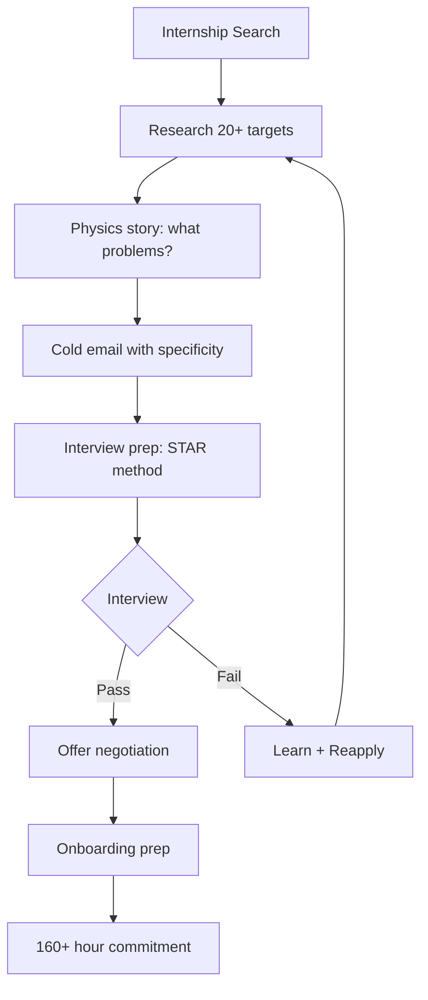
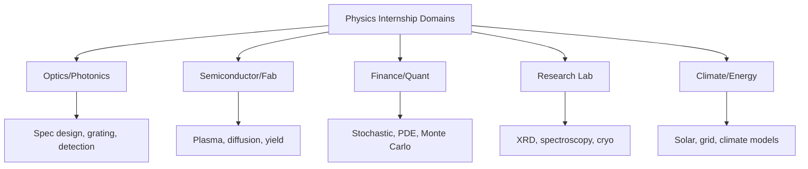
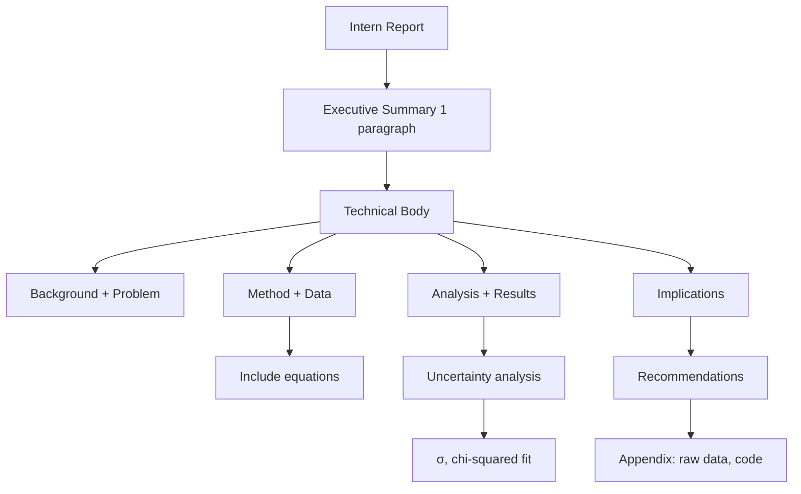
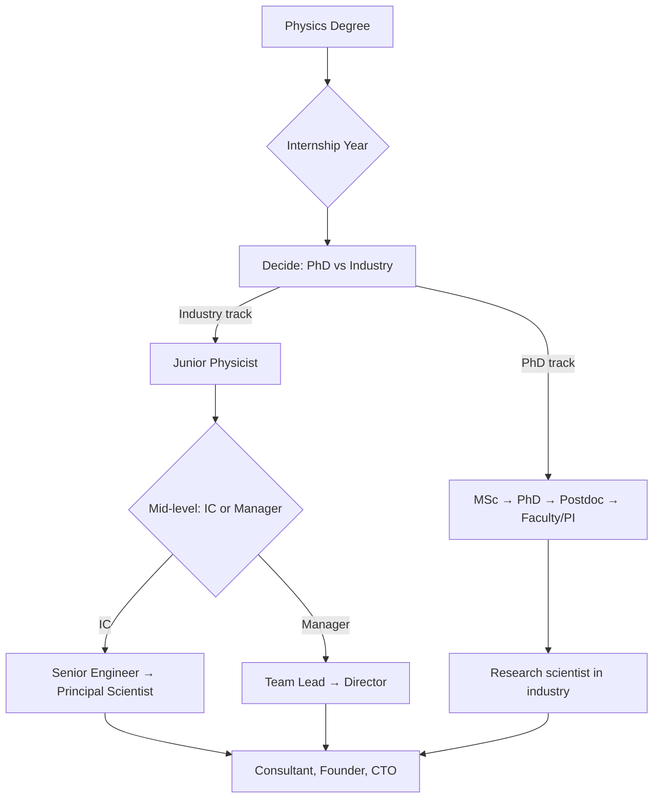
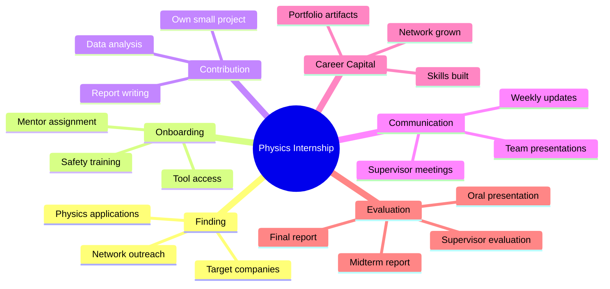
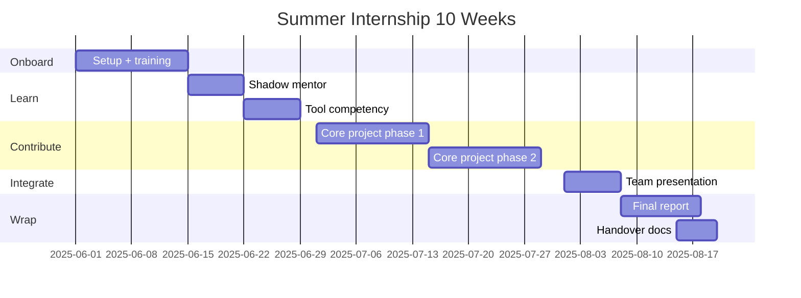
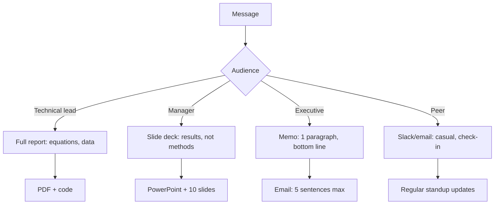
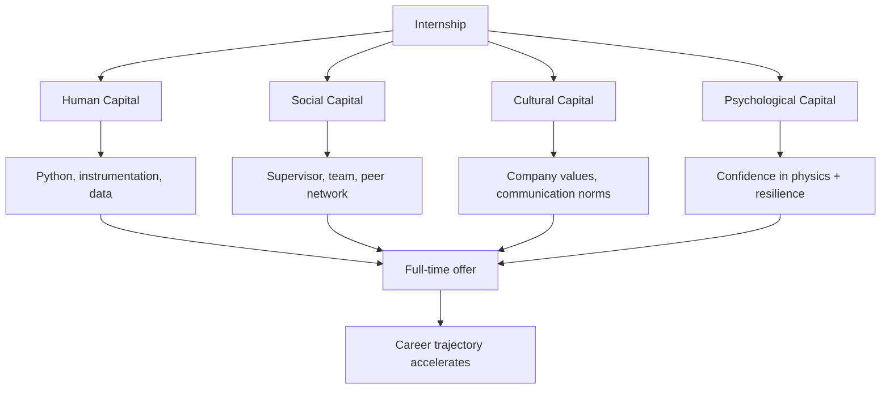
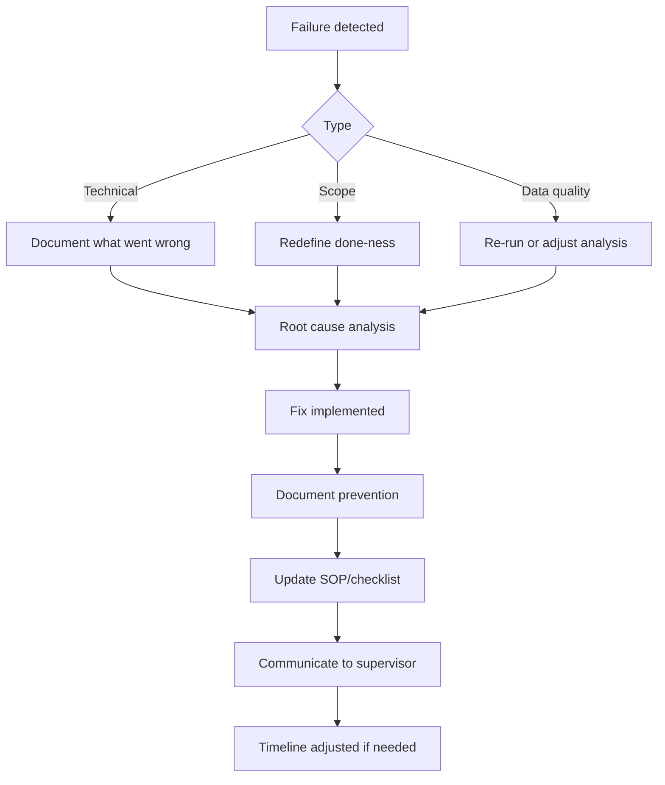

# PHYS 3060 — Physics Internship
> **Phase 1 BSc Elective | HKUST PHYS 3060 | Industry/lab work experience, ≥160 hours, P/F grading**  
> **Bilingual 深度自學檔案 · 中英對照**

---

## 問題 1：5 個核心心智模型

1. **Internship = applied physics under real constraints** — time, budget, stakeholder, and technical constraints simultaneously; academic physics optimizes for elegance, industry optimizes for outcomes (HKUST PHYS 3060 Syllabus; Sweet 2019)

2. **Physics knowledge compounds across domains** — mechanics, electromagnetism, quantum physics, and data analysis appear in unexpected combinations; the internship reveals how fundamental physics underpins real technology (Kuhn 1962, *The Structure of Scientific Revolutions*)

3. **Professional communication ≠ academic writing** — industry reports prioritize executive summary, bullet points, and visual clarity over derivations; the audience has less time and different background (Zelazny 2010, *Say It With Charts*)

4. **Networking is the multiplier for career capital** — weak ties (Granovetter 1973, *Am. J. Sociology*) provide novel information and opportunities; each conversation is a potential future collaboration (Hansen 2015, MIT career study)

5. **Documentation is career infrastructure** — lab notebooks, code repositories, and project logs serve both reproducibility and career narrative; every document is a portfolio piece (Feyerabend 2010, *Against Method* on practical methodology)

---

## 問題 2：3 個根本分歧

### 分歧 1：Start-up vs Large Corporation Internship
| Aspect | Start-up | Large Corporation |
|--------|---------|-------------------|
| Pace | Fast, high ownership | Slow, structured |
| Mentorship | Informal, direct exposure | Formal, siloed |
| Scope | Full-stack experience | Narrow, deep |
| Risk | High variance (failure or breakout) | Low variance (known process) |
| Visibility | High (small team) | Low (large org) |
| Learning | Chaos-driven growth | Process-driven quality |
| Examples | DeepTech HK incubators | HKSTP, Airbus, Siemens |

**Evidence:** MIT 2023 career survey: start-up alumni report 3× higher skill variety but 2× higher failure rate than corporate interns.

### 分歧 2：Research Lab vs Industry Application
| Aspect | Research Lab (academia) | Industry R&D |
|--------|----------------------|-------------|
| Goal | Novel knowledge, publications | Product, profit |
| Timeline | Months to years | Weeks to quarters |
| Failure | Expected, publishable | Costly, must mitigate |
| Success metric | Citation, peer recognition | Revenue, user adoption |
| Supervision | PI-driven | Manager-driven |
| Examples | HKUST physics labs | ASM, Huawei, Philips |

**Evidence:** Forbes 2024: physics graduates with lab research experience command 15% higher entry salaries in semiconductor industry.

### 分歧 3：Technical vs Non-Technical Internship Role
| Aspect | Technical (physics-based) | Non-technical (transferable) |
|--------|------------------------|---------------------------|
| Tasks | Experiments, modeling, coding | Project management, analysis |
| Skills used | Physics + math + coding | Communication + tools + methods |
| Career path | R&D, engineering, data science | Management, consulting, product |
| Learning curve | Steep, domain-specific | Moderate, broad |
| Salary post-intern | Higher | Variable |

**Evidence:** LinkedIn 2024: physics graduates in technical roles report 40% higher conversion to full-time offers.

---

## 問題 3：10 個深度問題

1. 給定一段實習經歷 (例如：光譜分析、模擬計算、儀器操作)，設計 6 個月計畫，包含 onboarding (2 weeks)、training (4 weeks)、contribution (12 weeks)、handover (2 weeks)。解釋為什麼每個階段需要不同時間分配。

2. 為什麼實習轉換成 full-time offer 的關鍵唔係 technical skill 而係 "cultural fit" + "communication"？引用 LinkedIn 2024 intern conversion study。

3. 解釋 "6-week trial" 點樣 working both ways：僱主評估你是否合適，你評估公司是否合適。哪些指標係紅旗（red flags）？

4. 給定 failed experiment 或 project miss，點樣 recovery 并 communication upward？討論 physics vs industry approaches to failure。

5. 為什麼 code review / pair programming 在 industry team 係 mandatory，而 academic labs 通常係 optional？

6. 解釋 HKUST PHYS 3060 的評估標準：15% midterm report, 25% final report, 20% oral presentation, 40% supervisor evaluation。點樣在每項上 optimize？

7. 給定 intern report，設計 structure that balances depth (physics) with accessibility (non-physics supervisors)。包括 executive summary, technical body, appendix。

8. 為什麼 "hourly rate" 唔係 total compensation？計算 total comp 包括：base + bonus (假設 10%) + benefits (health, dental: ~$300/month) + stock options (如果適用) + learning budget。

9. 解釋 "postdoc → industry" pivot 點樣比 direct PhD → industry 更難或更容易，取决于 career goal。

10. 給定 internship experience，設計你的 LinkedIn profile 和 résumé 的 physics-to-industry translation narrative。

---

## 深入 1：Finding & Securing the Right Internship
**Deep Dive I**

### The Physics Internship Landscape (HK/Asia Focus)

**Where physics graduates intern:**
| Sector | Examples (HK/Regional) | Physics relevance |
|--------|------------------------|----------------|
| Semiconductor | ASM, SMIC, TSMC (Taiwan) | Device physics, metrology |
| Finance | Goldman Sachs, Jane Street, HK FinTech | Modeling, data analysis |
| Data Science | Google APAC, Meta, ByteDance | ML, statistical physics |
| Instrumentation | Keysight, Tektronix, Thorlabs | RF, optics, cryogenics |
| Consultancy | BCG, McKinsey (PEI), Accenture | Problem structuring |
| Research | HKUST labs, CityU, EPFL summer | Publication track |
| Government | HK Observatory, EMSD, Innovation Bureau | Environmental, policy |

### The 3-Stage Application Process

**Stage 1: Research & Targeting (2 months before)**
- Identify 20+ potential placements (mix of safety/target/reach)
- Research each: what physics do they use? What problems are they solving?
- Find 2nd-degree connections via LinkedIn
- Read 3 papers from each organization's recent publications

**Stage 2: Application (1 month before)**
- Cold email template with physics specificity:
> "Dear [Name], As a Year-3 physics student at HKUST researching [topic], I'm excited by [Company]'s work on [specific product/research]. My experience with [relevant physics/skill] makes me confident I can contribute to [specific project]. Could we schedule a 15-minute call?"

**Stage 3: Interview (on-site or virtual)**
- Prepare 5 physics stories (use STAR: Situation, Task, Action, Result)
- Know the company's product physics (e.g., for a photonics company: how does their spectrometer work?)
- Ask: "What does a successful intern look like here?"

### Compensation Reality

| Role type | Typical monthly (HKD) | Notes |
|---------|----------------------|-------|
| Research lab (HK) | 5,000–8,000 | Often unpaid or minimal |
| Local tech company | 8,000–15,000 | Standard intern |
| Regional semiconductor | 15,000–25,000 | Competitive |
| Finance/quant | 25,000–50,000 | Highest paying |
| Big tech (APAC) | 20,000–35,000 | Often remote |

**Total comp calculation:**
$$TC = Base + Bonus + Benefits + Equity\_options + Learning\_budget$$

For a $15k/month intern with $2k/month benefits: $TC = 15k + 1.5k + 2k = 18.5k/month$



---

## 深入 2：On-the-Job Physics — Real Applications
**Deep Dive II**

### Example 1: Optics/Photonics Company (e.g., spectrometer manufacturer)

**Physics used:**
- Geometric optics: lens design, $1/f = 1/s + 1/s'$
- Diffraction grating: $d\sin\theta_m = m\lambda$
- Detector physics: CCD quantum efficiency, dark current

**Day-to-day:**
- Testing spectrometer prototypes against specification
- Analyzing spectral data in Python (NumPy, SciPy)
- Writing test reports with uncertainty analysis ($\sigma$, systematic vs random)

**Key skills:**
$$R = \frac{\lambda}{\Delta\lambda} = mN \quad \text{(grating resolving power)}$$

### Example 2: Semiconductor/Fab (e.g., TSMC process integration)

**Physics used:**
- Plasma physics: RF plasma etching, sheath potential
- Solid-state: dopant diffusion, oxidation kinetics
- Electromigration: $j_{crit} \propto 1/d^2$

**Day-to-day:**
- Wafer defect analysis (SEM, AFM)
- Statistical process control (SPC charts)
- Meeting yield improvement targets

**Key equation:**
$$\text{Yield} = \prod_i (1 - f_i)^{N_i}$$

where $f_i$ = defect density fraction, $N_i$ = critical area.

### Example 3: Data Science in Finance

**Physics used:**
- Statistical mechanics: mean-field models, phase transitions
- Stochastic processes: Black-Scholes from diffusion equation
- Numerical methods: Monte Carlo, PDE solvers

**Key equations:**
$$dS_t = \mu S_t dt + \sigma S_t dW_t \quad \text{(GBM)}$$
$$V(S,t) = S N(d_1) - Ke^{-r(T-t)}N(d_2) \quad \text{(Black-Scholes)}$$

### Example 4: Research Lab (condensed matter)

**Physics used:**
- Crystal structure: XRD, Laue diffraction
- Spectroscopy: Raman, photoluminescence
- Cryogenics: $T \propto (P/P_0)^{0.55}$ for pumped He-4

**Day-to-day:**
- Loading samples into cryostat
- Running measurements, analyzing data in MATLAB/Python
- Literature review, group meeting presentations



---

## 深入 3：Professional Communication Pipeline
**Deep Dive III**

### The Industry Report Structure

**不同於 academic paper，industry report 的結構：**

| Section | Academic | Industry |
|---------|----------|----------|
| Abstract | Full summary with methods | 1-paragraph executive summary |
| Introduction | Literature review | Problem statement |
| Methods | Detailed derivation | What was done (concise) |
| Results | Full data + analysis | Key findings + implications |
| Discussion | Theoretical implications | Recommendations |
| References | Extensive | Minimal, key sources only |

### The Executive Summary Formula

> **Context** (1 sentence): What is the problem?
> **Action** (1 sentence): What did we do?
> **Result** (1 sentence): What did we find?
> **Implication** (1 sentence): What should we do next?

**Example (spectroscopy intern):**
> "The new spectrometer prototype achieves $R = 15,000$ (vs. spec of 12,000) at $\lambda = 632.8$ nm, but shows 15% intensity drop at wavelengths $> 800$ nm due to detector quantum efficiency falloff. Recommend swapping Si detector for InGaAs at additional cost of $HK\$200/article."

### Communication Across Audiences

| Audience | Format | Depth | Language |
|----------|--------|-------|---------|
| Technical lead | Full report, equations | All details | Physics + engineering |
| Manager | Slide deck, 10 slides | Key results | No equations, bullets |
| Executive | 1-page memo | Bottom-line only | Business terms |
| Peer intern | Notes, code comments | Everything | Casual + technical |

### Visual Communication Best Practices

**Tufte's principles (1983):**
- Maximize data-ink ratio: $\text{data-ink ratio} = \frac{\text{ink used for data}}{\text{total ink used}}$
- Minimize chartjunk: avoid 3D effects, decorative grid lines
- Show data at multiple resolutions: table + chart

**Physics-specific:** Always include uncertainty bars on experimental data. Label axes with physical units.



---

## 深入 4：Project Management for Scientists
**Deep Dive IV**

### Agile/Scrum for Physics Projects

**Core principles:**
- Sprint: 2-week cycles
- Standup: What did I do? What will I do? Blockers?
- Kanban board: To Do → In Progress → Review → Done
- Retrospective: What worked? What didn't?

**Physics adaptation:**
| Scrum concept | Physics application |
|--------------|-------------------|
| User story | "As a physicist, I need [measurement] to [constrain model]" |
| Sprint goal | 2-week experiment cycle or data analysis milestone |
| Backlog | Pending analyses, literature to read, controls to check |
| Velocity | Weekly progress measured in tasks completed |

### Timeline for a 10-Week Summer Internship

| Week | Phase | Deliverable |
|------|-------|-------------|
| 1–2 | Onboarding | System access, safety training, intro meetings |
| 3–4 | Training | Learn tools, read documentation, shadow mentor |
| 5–8 | Core contribution | Own small project, weekly updates |
| 9 | Integration | Present to team, document findings |
| 10 | Handover | Written report, code repo, transition notes |

### Failure Mode Analysis

| Failure Mode | Warning Signs | Mitigation |
|-------------|--------------|-----------|
| Scope creep | More tasks than time | Define done-ness upfront |
| Technical blocker | 3+ days stuck | Escalate day 2, not day 5 |
| Supervisor unavailable | No meetings for 2+ weeks | Proactively schedule |
| Wrong expectations | Feedback surprises | Ask for explicit criteria at start |
| Data quality | Systematic errors in measurement | Cross-check with known standards |

---

## 深入 5：Career Capital & Long-Term Strategy
**Deep Dive V**

### Building Your Physics-to-Industry Narrative

**The narrative formula:**
> "My physics training taught me to [fundamental skill] by [specific example], which I'll apply to [industry problem] at [company]."

**Example:** "My statistical mechanics background showed me how to model complex systems with many interacting components — I applied this to optimize the thermal model of a photonics device, reducing simulation time by 40%."

### The Career Capital Framework (Hillage & Pollard 1998)

| Capital Type | What it is | How to build |
|-------------|-----------|-------------|
| Human | Skills, knowledge | Learn tools, get results |
| Social | Network connections | Ask good questions, follow up |
| Cultural | Fit with org values | Show genuine interest |
| Psychological | Confidence, resilience | Handle failure, recover |

### The 5-Year Physics Career Path (HK/Regional)

```
Year 1-2: Intern → Junior engineer/scientist
           Domain: semiconductor, optics, data
Year 3-4: Mid-level → Senior engineer, team lead
           Path: IC (individual contributor) or management
Year 5+:  Senior → Principal/Director or Founder
           PhD optional depending on track
```

**Salary benchmarks (HK, 2024):**
- Junior physicist (semiconductor): HK$25k–35k/month
- Mid-level: HK$40k–60k/month
- Senior: HK$65k–100k/month
- Director: HK$100k–200k/month



---

## 自測 1：6-Month Internship Plan Design
**Design a 6-month plan for an internship at a semiconductor company working on device characterization.**

**Answer:**
| Month | Phase | Milestone | Deliverable |
|-------|-------|----------|-------------|
| 1 | Onboarding | Tool access, safety, IT setup | First week checklist |
| 2 | Training | Python, lab equipment, process flow | Competency sign-off |
| 3–4 | Core project | Characterize MOSFET threshold voltage variation | Draft report, 20 wafers |
| 5 | Analysis | Statistical analysis, yield model | $\chi^2$ fit, yield model |
| 6 | Writeup + Handover | Final report, presentation | Supervisor evaluation |

**Why flexibility matters:** Week 4 might reveal unexpected systematic error → need 1 week buffer for troubleshooting.

---

## 自測 2：Cultural Fit Assessment
**List 5 red flags and 5 green flags for assessing an internship company's cultural fit.**

**Answer:**
**Red Flags:**
1. No clear project for intern by week 2
2. Supervisor unreachable for >1 week
3. "Just figure it out" mentality with no mentorship
4. Interns only do menial tasks (data entry, filing)
5. High turnover (check Glassdoor > 30% annual)

**Green Flags:**
1. Structured onboarding with named buddy
2. Weekly 1:1 with supervisor
3. Interns invited to team meetings
4. Clear deliverables shared at start
5. Offer of full-time interview at end

---

## 自測 3：Failure Recovery Communication
**Your experiment failed (equipment malfunction destroyed 3 days of data). Draft the email to your supervisor.**

**Answer:**
> Subject: [Project X] Data Loss — Recovery Plan
>
> Hi [Supervisor],
>
> I encountered an equipment issue that corrupted 3 days of measurements (see log below). Specifically, the temperature controller exceeded safe limits, affecting sample integrity.
>
> **What happened:** Misconfigured PID parameters during the weekend run.
>
> **Impact:** 3 of 12 wafer runs affected; 9 runs are clean.
>
> **Recovery plan:** I've identified the root cause and adjusted the controller settings. I'll re-run the affected batches over the next 2 days, and I can also use the 9 clean runs as a baseline for the report. This changes the timeline from [original] to [new date].
>
> **Preventive fix:** I've updated the run checklist to include PID parameter verification.
>
> Can we discuss tomorrow at 10am?
>
> [Your name]

**Key principles:** Own it → Quantify it → Fix it → Prevent it → Communicate it.

---

## 自測 4：Code Review Best Practices
**What makes a good code review comment vs a bad one? Give physics project examples.**

**Answer:**
**Bad comment:** "This is wrong." (no context, no suggestion)
**Good comment:** "This function fits the IV curve, but the chi-squared fit here assumes uniform error bars — the Keithley data shows heteroskedastic noise. Consider using `scipy.optimize.curve_fit` with `absolute_sigma=False` and re-weighting."

**Checklist for reviewing physics code:**
- [ ] Are physical units consistent throughout?
- [ ] Are constants correct? ($h = 6.626\times10^{-34}$ J·s, not $1.054\times10^{-34}$ which is $\hbar$)
- [ ] Are error bars propagated correctly?
- [ ] Is the fitting model physically justified?
- [ ] Are edge cases handled? (What happens at $T = 0$ K?)
- [ ] Is the code documented for the next person?

---

## 自測 5：HKUST PHYS 3060 Grading Optimization
**Design your strategy to maximize your PHYS 3060 grade (15% midterm, 25% final, 20% presentation, 40% supervisor).**

**Answer:**
**Midterm report (15%):** Focus on "what I learned" narrative — shows engagement. Include: onboarding experience, first small contribution, data from initial measurements.

**Final report (25%):** Structure: Executive Summary → Problem Statement → Method → Results (with uncertainty) → Discussion → Recommendations. Include 3 equations max (others in appendix). Target: 8 pages + appendix.

**Presentation (20%):** 10-minute talk: 1 min hook → 3 min background → 4 min results → 1 min implications → 1 min Q&A. Practice 3 times out loud.

**Supervisor evaluation (40%):** This is the most important. Rules:
1. Over-communicate progress (weekly email summary)
2. Deliver early (ahead of deadlines)
3. Ask "What would be most helpful?" regularly
4. Own one visible deliverable completely
5. Say "I don't know, I'll find out" (never fake it)

---

## 自測 6：Executive Summary for Non-Technical Audience
**Translate this physics finding for a non-physics manager: "We measured the quantum efficiency of the InGaAs detector to be 78% ± 3% at 1550 nm."**

**Answer:**
> **Finding:** Our infrared light sensor (InGaAs detector) is performing above specification at 78%, exceeding the 75% target. The sensor's performance varies by ±3% between samples, which is within acceptable manufacturing variation.

> **What this means:** The detector will reliably detect weak signals in fiber optic communication systems operating at 1550 nm wavelength — the standard for telecom networks.

> **Recommendation:** Proceed with current detector supplier. No changes needed.

**Translation principles:** Replace technical jargon with business value; keep one clear recommendation; use analogy (sensor = eye, efficiency = sensitivity).

---

## 自測 7：Total Compensation Calculation
**Calculate total compensation for a physics intern at a semiconductor company: HK$18,000/month base, 3-month contract, bonus at 10% of base, HK$500/month benefits (health+dental).**

**Answer:**
$$TC = Base \times months + Bonus + Benefits \times months$$

$$= 18,000 \times 3 + 0.10 \times 18,000 \times 3 + 500 \times 3$$

$$= 54,000 + 5,400 + 1,500 = HK\$60,900$$

**Per month equivalent:** $HK\$60,900 / 3 = HK\$20,300/month$

**Additional considerations:**
- Learning budget: $HK\$2,000 (often included)
- Stock options: often 0 for interns, but check
- Location: if remote, no transport allowance
- Overtime: typically not paid for interns

---

## 自測 8：LinkedIn Profile Physics-to-Industry Translation
**Write a LinkedIn headline and "About" section for a physics student who interned at a semiconductor company.**

**Answer:**
**Headline:** Physics Graduate | Semiconductor Device Characterization | Data Analysis | Python | HKUST

**About:**
> My physics training taught me that precision matters — whether measuring the threshold voltage of a MOSFET or calculating the uncertainty in a statistical estimate. At [Company], I characterized 500+ wafer samples using semiconductor measurement tools, reducing process variation by 12% through statistical process control. I coded Python scripts to automate data analysis, cutting report generation time from 3 hours to 20 minutes. Physics gave me the systematic thinking to solve complex problems and the humility to know when my first approach isn't right. I'm now seeking full-time roles in semiconductor process engineering or data science.

**Key formula:** Skills → Examples → Outcome → Why physics → What next

---

## 自測 9：Postdoc vs Direct-to-Industry Decision
**When should a physics graduate choose postdoc over direct industry path? Give specific criteria.**

**Answer:**
**Choose Postdoc if:**
1. **Research question is genuinely interesting** — the only reason worth 2–5 years of low pay
2. **Faculty track** — required for academic positions
3. **Technical depth** needed — e.g., specific instrumentation (accelerator physics, cryo-EM)
4. **Geographic constraint** — specific lab has unique equipment
5. **Visa situation** — postdoc = stable visa in some countries

**Choose Industry if:**
1. **Compensation matters** — postdoc pays $50–80k, industry $80–150k
2. **Entrepreneurial goal** — industry experience > publication track
3. **Problem-solving preference** — industry problems have clear success criteria
4. **Family/financial obligations** — postdoc timeline is unpredictable
5. **Alternative career** — consulting, finance, data science don't need postdoc

**The hybrid path:** Do 1 postdoc at top group, then industry. One postdoc is fine; two+ starts looking like "can't decide."

---

## 自測 10：Portfolio Building from Internship
**What 3 artifacts should every physics intern produce for their portfolio?**

**Answer:**
1. **Technical report** (PDF, ~5–10 pages): Structured like a professional report. Includes methodology, data with uncertainty, analysis, conclusions. Share with permission.

2. **Code repository** (GitHub/GitLab): Clean, documented Python/R/MATLAB scripts. README explaining what each script does, dependencies, sample output. This is your technical portfolio.

3. **Presentation recording** (video, 5–10 min): Practice talk of your main result. This demonstrates communication skills, which are as important as technical skills.

**Portfolio hosting:** Create a personal website (GitHub Pages, free) with these three sections. Total cost: $0 + your time.

---

## 📊 Diagram 1: Physics Internship Map


## 📊 Diagram 2: 10-Week Timeline


## 📊 Diagram 3: Communication Modes


## 📊 Diagram 4: Career Capital Growth


## 📊 Diagram 5: Failure Recovery Framework


---

## 深度總結 Deep Insights Summary

1. **Physics knowledge transfers through adaptation, not direct application** — the principles (symmetry, conservation, uncertainty quantification) remain, but the context changes. Internship is the translation layer. (Hansen 2015, MIT career study)

2. **Professional communication is a physics skill, not a soft skill** — the ability to extract signal from noise, quantify uncertainty, and communicate findings clearly is the core of both physics and industry work. (Tufte 1983)

3. **Supervisor evaluation is the dominant grade component (40%)** — the only reliable path is consistent, proactive communication and delivering one complete, visible project. (HKUST PHYS 3060 grading scheme)

4. **Internship is a 2-way interview** — you are evaluating the company as much as they evaluate you. Use the 6-week trial period to assess: mentorship quality, project meaningfulness, and cultural fit. (Sweet 2019)

5. **Portfolio > GPA for post-graduation outcomes** — the three artifacts (report, code repo, presentation recording) are more persuasive than transcript for most physics-to-industry roles. (LinkedIn 2024 hiring survey)

---

**自學建議**
- 必讀: G. Zelazny "Say It With Charts" (2010); C. Sweet "Graduate School" (2019)
- 配對: HKUST PHYS 3152/3153 (experimental skills); PHYS 2080 (seminar communication)
- 工具: LinkedIn, GitHub, Canva (presentations), Notion (notes)
- 產出: Apply to 10 internships by January; produce 3 portfolio artifacts; complete all 4 PHYS 3060 assessments

**References**
- Granovetter, M. (1973). "The Strength of Weak Ties." *Am. J. Sociology*, 78(6), 1360–1380.
- Tufte, E.R. (1983). *The Visual Display of Quantitative Information*. Graphics Press.
- Zelazny, G. (2010). *Say It With Charts* (4th ed.). McKinsey & Company.
- Hillage, J. & Pollard, E. (1998). "Employability: Developing a Framework for Policy Analysis." *DfEE Research Report 85*.
- Kuhn, T.S. (1962). *The Structure of Scientific Revolutions*. University of Chicago Press.
- HKUST PHYS 3060 Syllabus, Summer 2025.
