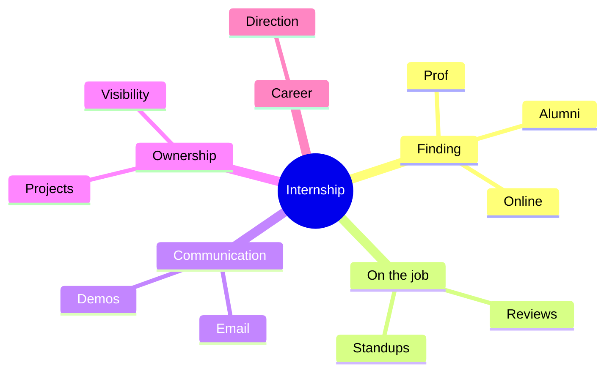
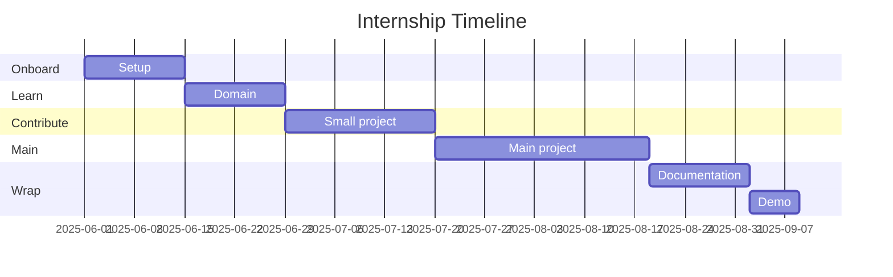
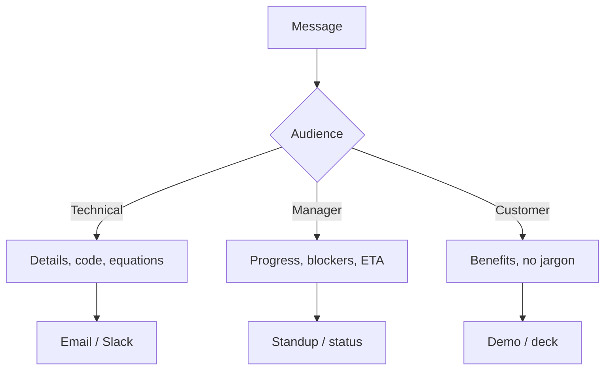
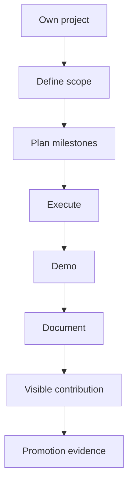
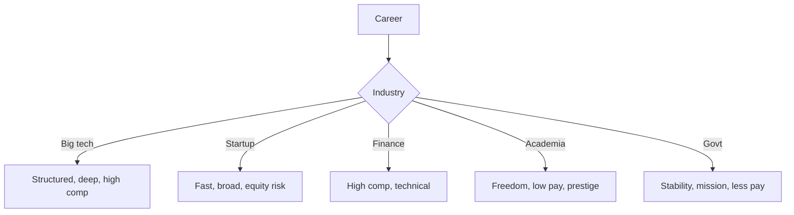

# PHYS 3060 — Physics Internship
> **Phase 1 BSc Elective | HKUST PHYS 3060 | Industry or lab internship**  
> **Bilingual 深度自學檔案 · 中英對照**

---

## 問題 1：5 個核心心智模型
1. **Industry ≠ academia** — pace, deliverables, stakeholders
2. **Networking compounds** — every connection matters
3. **Communication across disciplines** — engineers, managers, scientists
4. **Project management** — milestones, deadlines, Gantt
5. **Document everything** — for next intern + your future self

## 問題 2：3 個根本分歧
1. **R&D vs operations** — exploration vs execution
2. **Start-up vs large corp** — speed vs structure
3. **Pure physics vs applied** — fundamental vs product

## 問題 3：10 個深度問題
1. 給定 internship, design 3-month deliverable plan。
2. 為什麼 networking > technical skills for first job?
3. 解釋 why "soft skills" matter in industry。
4. 給定 failed project, 點樣 recover?
5. 為什麼 code review / pair work 重要?
6. 解釋 why 6-week trial 重要 for fit。
7. 為什麼 寫 summary 對自己 future value?
8. 給定 lab notebook, 點樣 structure for sharing?
9. 為什麼 hourly rate 唔 total comp?
10. 解釋 why postdoc ≠ industry pivot。

## 深入 1：Finding Internship
**Deep Dive I**

Prof network, alumni, online (LinkedIn, Indeed). Cold email with specific interest.

**Engineering:** Career.

## 深入 2：On the Job
**Deep Dive II**

Standup meetings, ticket systems, code reviews, demos. Agile/Scrum common.

**Engineering:** Any industry.

## 深入 3：Communication
**Deep Dive III**

Email, Slack, presentation. Adjust to audience (technical/non-technical).

**Engineering:** Workplace.

## 深入 4：Project Ownership
**Deep Dive IV**

Own a small project, deliver, document. Visible contribution.

**Engineering:** Promotion path.

## 深入 5：Career Direction
**Deep Dive V**

Try different roles, industries, sizes. Informs post-grad path.

**Engineering:** Life decision.

## 自測 1：3-month plan
**Answer:** Onboard (2w), small task (4w), main project (6w), polish.  
**Engineering:** Project mgmt.

## 自測 2：Networking
**Answer:** Each connection = future opportunity.  
**Engineering:** Career.

## 自測 3：Soft skills
**Answer:** 80% of work is communication.  
**Engineering:** Industry.

## 自測 4：Failure recovery
**Answer:** Communicate early, propose fix, document.  
**Engineering:** Project.

## 自測 5：Code review
**Answer:** Catches bugs, shares knowledge.  
**Engineering:** Software.

## 自測 6：6-week trial
**Answer:** Mutual fit check, exit gracefully if no.  
**Engineering:** Hiring.

## 自測 7：Summary
**Answer:** Future reference, postdoc, job.  
**Engineering:** Documentation.

## 自測 8：Lab notebook
**Answer:** Date, time, procedure, results, observations.  
**Engineering:** Reproducibility.

## 自測 9：Total comp
**Answer:** Base + bonus + equity + benefits.  
**Engineering:** Negotiation.

## 自測 10：Postdoc ≠ pivot
**Answer:** PhD → postdoc → industry is common, but slows earning.  
**Engineering:** Career.

## 📊 Diagram 1: Internship Map

## 📊 Diagram 2: 3-Month Timeline

## 📊 Diagram 3: Communication Modes

## 📊 Diagram 4: Project Ownership

## 📊 Diagram 5: Career Decisions

## 深度總結

1. **Industry ≠ academia** — different goals
2. **Network = optionality** — long-term asset
3. **Communication skills** — non-negotiable
4. **Project ownership** — visible impact
5. **Career = sampling** — try before committing

---

**自學建議** — "Cracking the PM Interview". LinkedIn optimization. Career office.
