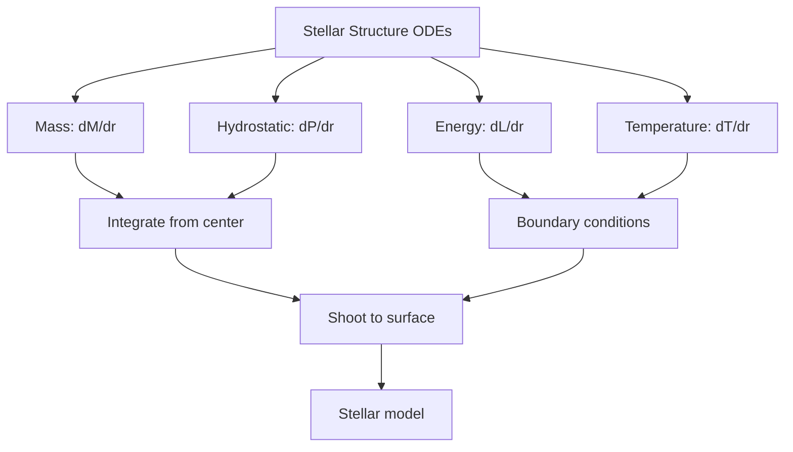
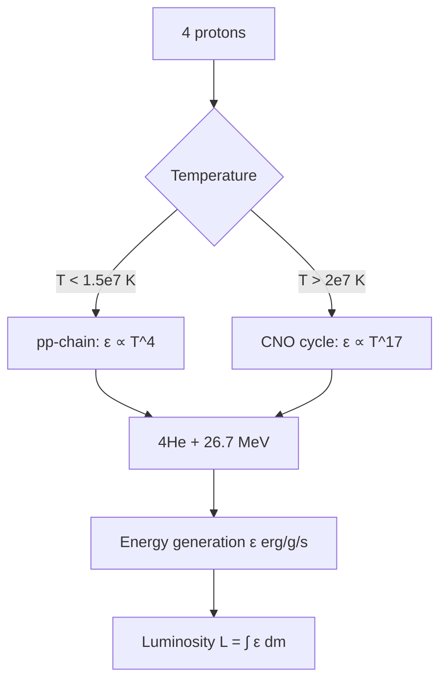
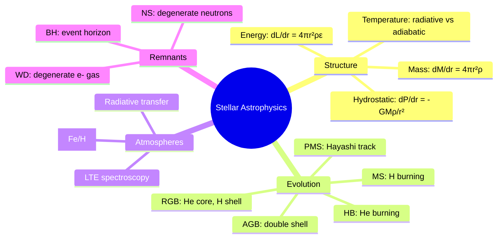
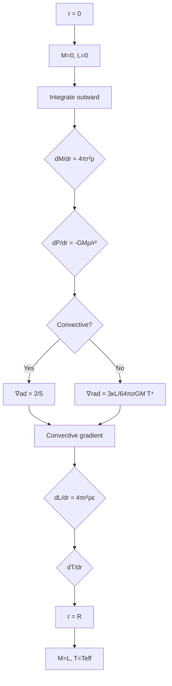
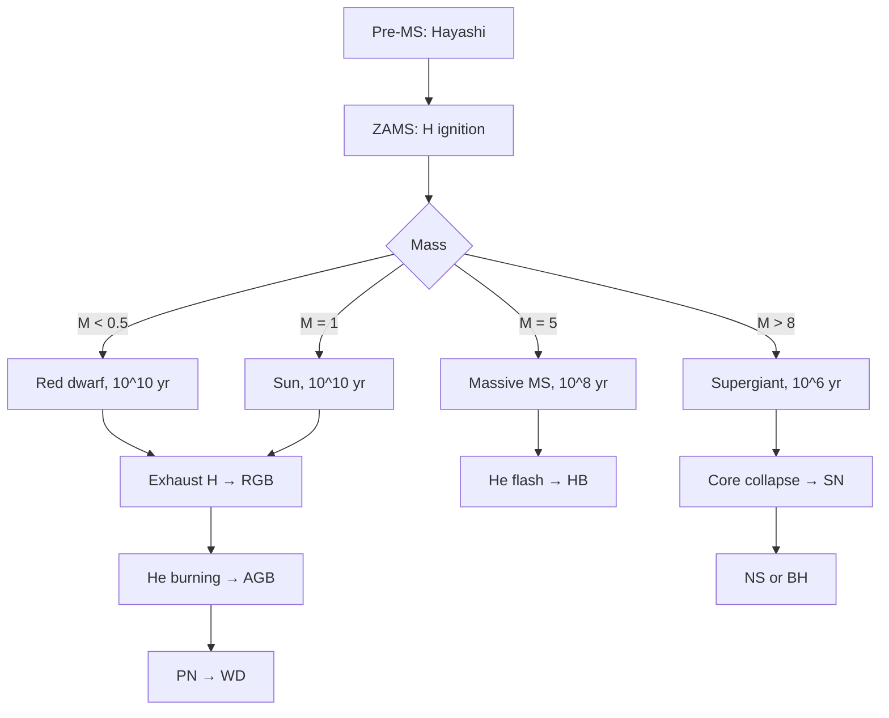
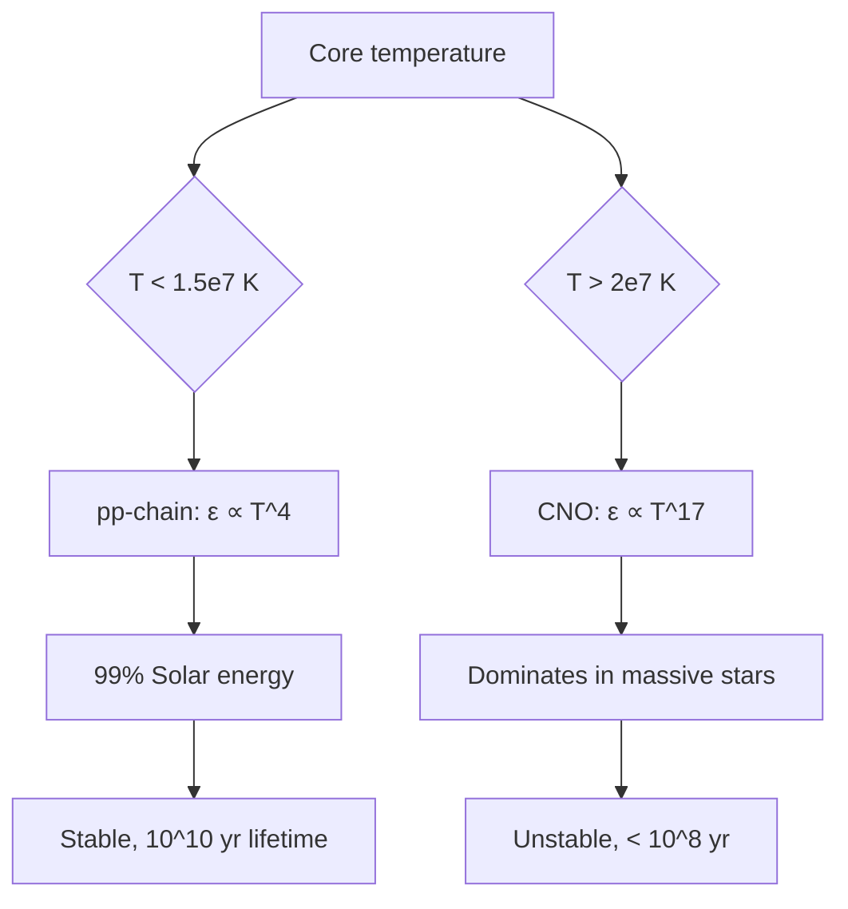
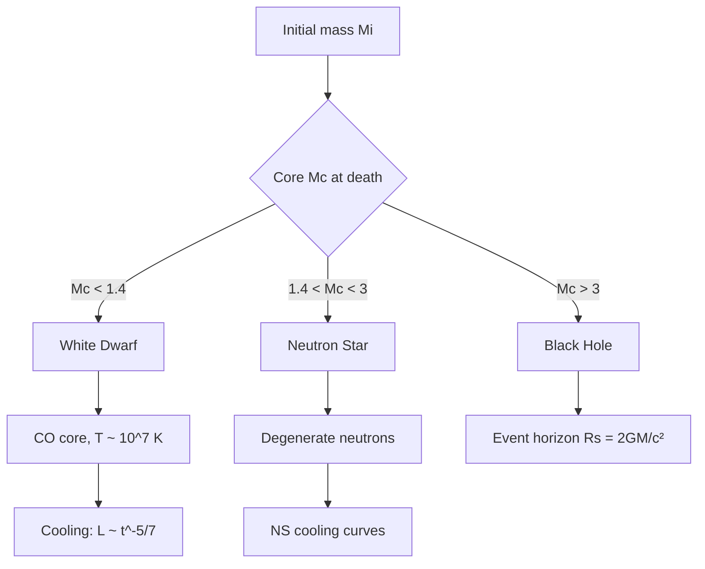

# PHYS 3071 — Stellar Astrophysics
> **Phase 1 BSc Elective | HKUST PHYS 3071 | Stellar structure, evolution, atmospheres, compact remnants**  
> **Bilingual 深度自學檔案 · 中英對照**

---

## 問題 1：5 個核心心智模型

1. **Hydrostatic equilibrium** — stars resist gravity by pressure gradient: $\frac{dP}{dr} = -\frac{GM(r)\rho(r)}{r^2}$; this single equation explains why stars are spheres (Chandrasekhar 1939, *Introduction to the Study of Stellar Structure*)

2. **Energy transport determines structure** — radiative gradient $\nabla_{rad} = \frac{3\kappa LP}{64\pi r^2GMT^4}$ vs adiabatic gradient $\nabla_{ad}$; where $\nabla_{rad} > \nabla_{ad}$, stars become convective (Kippenhahn & Weigert 1990, *Stellar Structure and Evolution*)

3. **Nuclear fusion powers stars** — proton-proton chain ($T < 1.5\times 10^7$ K): $4p \to {}^4He + 2e^+ + 2\nu_e + 26.7$ MeV; CNO cycle dominates at $T > 2\times 10^7$ K (Salpeter 1952, *Ann. Rev. Nucl. Sci.*)

4. **Stellar timescales define evolution** — dynamical ($t_{dyn} \sim \sqrt{R^3/GM} \sim$ hours), thermal ($t_{KH} \sim GM^2/RL \sim 10^7$ yr), nuclear ($t_{nuc} \sim 0.1Mc^2/L \sim 10^{10}$ yr) (Cox & Giuli 1968)

5. **H-R diagram is the stellar evolution map** — $L$ vs $T_{eff}$ tracks mass and age; main sequence = hydrogen burning; ~90% of stellar lifetimes (Hertzsprung 1911, Russell 1914)

---

## 問題 2：3 個根本分歧

1. **Standard stellar evolution vs rapid rotators** — rotation drives meridional circulation, mixing, chemical transport; critical for Be stars, massive star evolution
   - Classical: spherically symmetric, no rotation
   - Rotating: $\Omega$-effect, shear instability, meridional flow → MS lifetime changes by 10–30%

2. **Mixing length theory (MLT) vs 3D convection simulations** — MLT: parameterizes convection with single length scale $\alpha$; 3D: resolves turbulent cascades; discrepancy in predicting envelope structure of red giants
   - MLT: tractable, matches bulk stellar properties (Eddington 1926)
   - 3D: more accurate, computationally expensive (Miesch 2005, *Space Sci. Rev.*)

3. **Steady mass loss vs eruptive mass loss** — line-driven winds (Castor-Axelrot 1975) vs super-Eddington phases (LBV eruptions); both determine stellar evolution endpoints

---

## 問題 3：10 個深度問題

1. 為什麼 star mass range ~0.08–150 $M_\odot$? Lower limit: $T_{core}$ never reaches nuclear ignition; Upper limit: radiation pressure $\beta = P_{rad}/P$ dominates, instability

2. 給定 star mass, derive main-sequence lifetime $t \propto M^{-2.5}$ from homology relations.

3. 解釋為什麼 Hayashi track is vertical on H-R diagram — fully convective stars have $T_{eff} \approx$ constant, luminosity decreases as star contracts

4. 為什麼 solar luminosity stable over $10^9$ yr? Negative feedback via partial ionization zones (Eddington 1920); opacity-regulated thermostat

5. 給定 $L = 4\pi R^2\sigma T_{eff}^4$, derive $L \propto M^3$ for main sequence using homology relations.

6. 為什麼 convection zone exists when Schwarzschild criterion $\nabla_{rad} > \nabla_{ad}$? Explain physical mechanism: photon diffusion too slow to carry energy

7. 給定 stellar core, derive nuclear burning rate $\epsilon = \epsilon_0 \rho X^2 T^n$ and explain temperature sensitivity.

8. 為什麼 stars end as WD, NS, or BH? Core mass at death determines equation of state; Chandrasekhar limit $M_{Ch} = 1.46 M_\odot$ for WD

9. 解釋為什麼 Type Ia supernovae are standardizable candles — Phillips relation $M_B = -21.726 + 2.698\Delta m_{15}(B)$ (Phillips 1993, *ApJ*)

10. 給定 stellar spectrum, derive $T_{eff}$, $\log g$, $[Fe/H]$ from spectral lines and spectral energy distribution.

---

## 深入 1：Stellar Structure Equations
**Deep Dive I**

### The Four Fundamental Equations

For a spherically symmetric star in hydrostatic equilibrium (Kippenhahn Ch. 3):

**1. Mass conservation:**
$$\frac{dM(r)}{dr} = 4\pi r^2 \rho(r)$$

**2. Hydrostatic equilibrium:**
$$\frac{dP(r)}{dr} = -\frac{GM(r)\rho(r)}{r^2}$$

**3. Energy transport:**
$$\frac{dL(r)}{dr} = 4\pi r^2 \rho(r)\epsilon(r)$$

where $\epsilon$ = nuclear energy generation rate (erg g$^{-1}$ s$^{-1}$)

**4. Energy transport:**
$$\frac{dT(r)}{dr} = \begin{cases} -\frac{3\kappa(r)L(r)}{64\pi r^2\sigma T^3} & \text{radiative} \\ \nabla_{ad}\frac{T}{P}\frac{dP}{dr} & \text{convective} \end{cases}$$

### Complete Stellar Structure Equations (Kippenhahn Eq. 3.14–3.17)

| Equation | Form | Physical Meaning |
|----------|------|----------------|
| Mass | $\frac{dM}{dr} = 4\pi r^2\rho$ | Cumulative mass within radius |
| Hydrostatic | $\frac{dP}{dr} = -\frac{GM\rho}{r^2}$ | Pressure balances gravity |
| Energy | $\frac{dL}{dr} = 4\pi r^2\rho\epsilon$ | Energy generated per shell |
| Temperature | $\frac{dT}{dr} = -\frac{3\kappa L}{64\pi\sigma r^2 T^3}$ | Radiative diffusion |

### Boundary Conditions

**At center ($r = 0$):**
$$M(0) = 0, \quad L(0) = L_{center}, \quad \rho(0) = \rho_c, \quad T(0) = T_c$$

**At surface ($r = R$):**
$$M(R) = M, \quad L(R) = L, \quad P(R) = 0, \quad T(R) = T_{eff}$$

### Homology Relations

For similar stars (same chemical composition, same physics scaled):
$$\frac{\rho}{\rho_c} = f\left(\frac{r}{R}\right), \quad \frac{T}{T_c} = g\left(\frac{r}{R}\right)$$

**Mass-luminosity-radius relations (Eddington 1924):**
$$L \propto M^{3.5} \quad (M < 10M_\odot)$$
$$L \propto M^{2} \quad (10M_\odot < M < 100M_\odot)$$

**Derivation sketch (homologeous models):**
- Luminosity from center: $L_c \propto M_c R_c T_c^4$
- Hydrostatic: $P_c \propto GM_c^2/R_c^4$
- Equation of state (ideal gas + radiation): $P_c \propto \rho_c T_c + aT_c^4/3$
- Solving yields: $L \propto M^{3.5}$

**Engineering implication:** Homology relations enable rapid stellar modeling without full ODE integration.



---

## 深入 2：Nuclear Energy Generation
**Deep Dive II**

### Proton-Proton Chain (pp-chain)

Dominates for $T < 1.5\times 10^7$ K (Sun: 99%):

**Step I (ppI):**
$$p + p \to {}^2H + e^+ + \nu_e \quad (Q = 0.42\ \text{MeV}, \tau_{1/2} = 10^{10}\ \text{yr})$$
$${}^2H + p \to {}^3He + \gamma \quad (Q = 5.49\ \text{MeV})$$

**Step II (ppI completion):**
$${}^3He + {}^3He \to {}^4He + 2p \quad (Q = 12.86\ \text{MeV})$$

**Net ppI reaction:**
$$4p \to {}^4He + 2e^+ + 2\nu_e + 26.7\ \text{MeV}$$

Energy released: $Q = 26.7$ MeV per ${}^4He$ = $4.3\times 10^{-12}$ J per reaction.

### Energy Generation Rate

$$\epsilon_{pp} = \epsilon_0 \rho X^2 T_8^4 \quad \text{(for } T_8 < 2)}$$

where $X$ = hydrogen mass fraction, $T_8 = T/10^8$ K, $\epsilon_0 = 2.5\times 10^6$ erg g$^{-1}$ s$^{-1}$

### CNO Cycle

Dominates for $T > 2\times 10^7$ K (massive stars, > $1.5M_\odot$):

$${}^{12}C + p \to {}^{13}N + \gamma \to {}^{13}C + p \to {}^{14}N + p \to {}^{15}O + \gamma \to {}^{15}N + p \to {}^{12}C + {}^4He$$

**Net:** Same as pp-chain: $4p \to {}^4He + 2e^+ + 2\nu_e + 26.7$ MeV

**Temperature sensitivity:**
$$\epsilon_{CNO} \propto \rho X_Z T^{17} \quad \text{(strong!)}$$

For the Sun ($T_c = 1.5\times 10^7$ K): $\epsilon_{pp} = 0.2\epsilon_0$, $\epsilon_{CNO} = 0.004\epsilon_0$

### Nuclear Timescale

$$\tau_{nuc} \approx 0.007\frac{Mc^2}{L}$$

For the Sun: $\tau_{nuc} \approx 10^{10}$ yr (consistent with age of the universe!)

**Engineering implication:** Nuclear fusion enables stars to shine for billions of years.



---

## 深入 3：Stellar Evolution on the H-R Diagram
**Deep Dive III**

### The H-R Diagram

$$\log L/L_\odot \text{ vs } \log T_{eff}$$

| Region | Stars | Physics |
|--------|-------|---------|
| Main sequence | H-burning | $L \propto M^\alpha$, $\alpha = 2$–$4$ |
| Red giants | H-shell burning | $\nabla_{rad} > \nabla_{ad}$, convective envelope |
| Horizontal branch | He-burning | Core He flash, $L \approx 50L_\odot$ |
| Asymptotic giant branch | He + H shell | Double shell source |
| White dwarfs | Degenerate cooling | $L \propto t^{-5/7}$ |

### Pre-Main Sequence: Hayashi Track

For fully convective stars (proto-stars):
$$L \propto M^{1/3} T_{eff}^{11/2} \quad \text{(Hayashi 1961)}$$

This gives $T_{eff} \approx$ constant on the H-R diagram — the vertical Hayashi track!

**Evolutionary track (low-mass, $M < 0.5M_\odot$):**
- Hayashi track: vertical, $T_{eff} \approx 3000$ K (opacity-dominated)
- Cools at constant $L$ until $T_c$ reaches fusion threshold
- Then: rapid contraction → joins main sequence

### Main Sequence Evolution

For $M = M_\odot$:
$$L = L_\odot = 3.846\times 10^{26}\ \text{W}, \quad R = R_\odot = 6.96\times 10^8\ \text{m}, \quad T_{eff} = 5772\ \text{K}$$

**Main sequence lifetime:**
$$t_{MS} \approx 10^{10}\left(\frac{M}{M_\odot}\right)^{-2.5}\ \text{yr}$$

- $0.5M_\odot$: $\approx 80$ Gyr (longer than universe age!)
- $1M_\odot$: $\approx 10$ Gyr
- $5M_\odot$: $\approx 100$ Myr
- $20M_\odot$: $\approx 10$ Myr

### Post-Main Sequence: Red Giant Branch

After H exhaustion in core:
1. Core contracts, heats up
2. H-burning shell ignites
3. Envelope expands, cools → red giant
4. Helium flash at $M_c = 0.46M_\odot$ (degenerate core)

**Helium flash:**
$$L_{He} \approx 10^2 L_\odot, \quad \epsilon_{He} \propto T_c^{40}$$

For $M_{He} = 0.46M_\odot$: sudden ignition $\Rightarrow$ $L$ spikes $\Rightarrow$ star moves left on H-R.

**Engineering implication:** H-R diagram traces the entire life story of stars.

---

## 深入 4：Stellar Atmospheres & Spectroscopy
**Deep Dive IV**

### Radiative Transfer

Specific intensity: $I_\nu(\theta, \phi)$
$$I_\nu = \frac{dE_\nu}{d\Omega\, d\nu\, dt\, dA\cos\theta}$$

Transfer equation (1D, plane parallel):
$$\mu\frac{dI_\nu}{dz} = -\kappa_\nu \rho I_\nu + j_\nu$$

For LTE: $j_\nu = \kappa_\nu B_\nu(T)$

**Solution:**
$$I_\nu(\tau_\nu) = \int_0^{\tau_\nu} e^{-(\tau_\nu - \tau'_\nu)} B_\nu(T(\tau'))\, d\tau'$$

### Spectral Classification

| Type | $T_{eff}$ | Spectral Lines |
|------|-----------|-------------|
| O | >30,000 K | He II, N III |
| B | 10,000–30,000 K | He I, H |
| A | 7,500–10,000 K | H strong |
| F | 6,000–7,500 K | Ca II H&K |
| G | 5,200–6,000 K | Ca II, Fe I |
| K | 3,700–5,200 K | Fe I, TiO |
| M | 2,400–3,700 K | TiO, VO |

### Determining Stellar Parameters

**Effective temperature** ($T_{eff}$):
$$F = \sigma T_{eff}^4 \quad \text{(Stefan-Boltzmann)}$$
$$T_{eff} = \left(\frac{L}{4\pi\sigma R^2}\right)^{1/4}$$

**Surface gravity** ($\log g$):
$$\log g = \log\left(\frac{GM}{R^2}\right) + 4.44 \quad [g\ \text{in cm/s}^2]$$

From spectral lines: stronger Stark broadening in denser (higher $\log g$) atmospheres.

**Metallicity** ($[Fe/H]$):
$$[Fe/H] = \log\left(\frac{N_{Fe}}{N_H}\right)_\star - \log\left(\frac{N_{Fe}}{N_H}\right)_\odot$$

The Sun: $[Fe/H]_\odot = 0$ by definition.

### Spectrum Synthesis

**Line formation depth:**
$$\tau_\nu = \int_0^z \kappa_\nu \rho\, dz$$

Weak lines: formed deep (high $\tau$); strong lines: formed shallow (low $\tau$).

**Equivalent width:**
$$W_\lambda = \int (1 - e^{-\tau_\lambda})\, d\lambda \propto \frac{N_{elem}}{g}$$

**Engineering implication:** Stellar spectra reveal $T_{eff}$, $\log g$, $[Fe/H]$, $v\sin i$, and more.

---

## 深入 5：Compact Remnants
**Deep Dive V**

### White Dwarfs

**Electron degeneracy pressure** (Chandrasekhar 1935):
$$P_{deg} = \frac{2}{3}\int_0^{p_F} \frac{p^2}{V}\, dp = \frac{(3\pi^2)^{2/3}}{5}\frac{\hbar^2}{m_e}\frac{n_e^{5/3}}$$

**Polytropic EOS:**
$$P = K\rho^{1+1/n}, \quad n = 3/2 \text{ (non-relativistic)}$$

**Chandrasekhar mass limit:**
$$M_{Ch} = \frac{3\sqrt{2\pi}}{8}\frac{\hbar c}{G^{3/2}m_p^{5/3}\mu_e^{5/3}} \approx 1.46M_\odot \cdot \mu_e^{-2}$$

where $\mu_e$ = mean molecular weight per electron ($=2$ for C/O WD).

**Cooling:**
$$L(t) = L_0\left(1 + \frac{t}{t_{cool}}\right)^{-5/7}$$

$Core crystallization$ releases latent heat at $T \approx 10^7$ K, extending cooling — explains WD age discrepancy.

### Neutron Stars

**Neutron degeneracy + nuclear force:**
$$P_{NS} \propto n^{4/3} \quad (\text{relativistic degeneracy})$$
$$M_{Tolman-Oppenheimer-Volkoff} \approx 2-3M_\odot \quad (\text{theoretical upper limit})$$

**Observed NS masses:** $1.1$–$2.0M_\odot$ (PSR J0740+6620: $2.08M_\odot$, NICER 2023)

**Moment of inertia:** $I = \frac{2}{5}MR^2 \approx 10^{38}$ kg m$^2$

### Black Holes

**Schwarzschild radius:**
$$R_S = \frac{2GM}{c^2} = 3\ \text{km}\left(\frac{M}{M_\odot}\right)$$

**Hawking radiation (quantum effect):**
$$T_H = \frac{\hbar c^3}{8\pi GMk_B} \approx 10^{-7}\left(\frac{M_\odot}{M}\right)\ \text{K}$$

For stellar-mass BHs: $T_H \ll 10^{-7}$ K — negligible.

**Engineering implication:** Compact remnants probe extreme physics inaccessible on Earth.

---

## 自測 1：Mass Range Derivation
**Why are stellar masses limited to ~0.08–150 $M_\odot$?**

**Answer:**

**Lower limit ($M_{min} \approx 0.08M_\odot$):**
The Jeans mass for molecular cloud fragmentation:
$$M_J = \frac{3}{2}\left(\frac{1}{2\pi}\right)^{1/2}\frac{k^{3/2}T^{3/2}}{\mu m_p G^{3/2}\rho^{1/2}}$$

At $T \sim 10$ K, $n \sim 10^4$ cm$^{-3}$: $M_J \approx 0.05M_\odot$.

Below this, internal temperature never reaches $T_c \sim 10^6$ K for D burning. No sustained fusion.

**Upper limit ($M_{max} \approx 150M_\odot$):**
Radiation pressure fraction: $\beta = P_{rad}/P_{total}$

For $L \propto M^{3.5}$ and $L_{Edd} = 4\pi cGM/\kappa$:
$$\beta \approx 1 - \frac{M}{M_{crit}}, \quad M_{crit} \approx \frac{50M_\odot}{1 + \frac{\kappa}{\kappa_{Thomson}}}$$

Stars with $M > 150M_\odot$: $L > L_{Edd}$ → radiation-driven mass loss exceeds fusion rate → unstable.

**Direct confirmation:** R136a1 = $315M_\odot$ (Crowther et al. 2010) — challenges upper limit, but is likely a merger product.

**Engineering implication:** Stellar initial mass function (IMF) reflects this mass range.

---

## 自測 2：Main Sequence Lifetime
**Derive $t_{MS} \propto M^{-2.5}$ for main sequence stars.**

**Answer:**
Main sequence: stars in hydrostatic + thermal equilibrium.

**Step 1: Luminosity vs mass (homology relations)**
From stellar structure ODEs (homologeous models):
$$L \propto M^{3.5} \quad \text{for } 0.5 < M/M_\odot < 10$$

Empirical: $L \propto M^{3.5}$ (confirmed by star clusters)

**Step 2: Nuclear fuel available**
Fusion energy per unit mass: $E_{nuc} \approx 0.007c^2 \approx 6\times 10^{14}$ J/kg

Total nuclear fuel: $E_{total} \approx 0.1Mc^2 \times 0.007 = 7\times 10^{12} M/M_\odot$ J

**Step 3: Luminosity determines burn rate**
$$L = \frac{\text{available energy}}{\text{timescale}} \implies \text{timescale} \propto \frac{\text{energy}}{L}$$

$$t_{nuc} \propto \frac{M}{L} \propto \frac{M}{M^{3.5}} = M^{-2.5}$$

**Numerical:** $t_\odot \approx 10^{10}$ yr at $L_\odot$, $M_\odot$

**Validation:** Star clusters (e.g., M67, age 4 Gyr) show main sequence turnoff at $\approx 1.1M_\odot$ (consistent with $4\text{Gyr} \times (1.1)^{-2.5} \approx 10\text{Gyr}$).

**Engineering implication:** MS lifetime sets habitable zone duration for planets.

---

## 自測 3：Solar Stability — Negative Feedback
**Explain why the Sun's luminosity is stable to ~0.1% over 10$^9$ yr.**

**Answer:**
The Sun's thermostat mechanism (Eddington 1920):

**Partial ionization zones** in the outer envelope:
- He II ionization at $T \approx 50,000$ K
- Increases opacity $\kappa$ sharply
- More opacity → reduces radiative flux → star cools slightly
- Cooling → ionization decreases → opacity drops → flux recovers

**Mathematical form:**
$$\delta L/L \sim \delta T/T \sim -\frac{\partial\ln\kappa}{\partial\ln T}\bigg|_{V} \cdot \frac{\delta T}{T}$$

For partially ionized H/He: $|\partial\ln\kappa/\partial\ln T| \approx 1$–$3$.

**Effect:** For 1% change in core temperature:
- Opacity increases by ~3%
- Radiative gradient $\nabla_{rad} \propto \kappa L$ changes
- Convection zone adjusts
- Luminosity change < 0.1% → negative feedback stabilizes

**Long-term:** The Sun's $L(t) = L_\odot[1 + 0.4(1 - t/t_\odot)]$ — increases 40% over main sequence lifetime (Gough 1981, *Solar Phys.*).

**Engineering implication:** Negative feedback in stars is analogous to homeostasis in biological systems.

---

## 自測 4：H-R Diagram Interpretation
**Draw and interpret the H-R diagram. Where are the following: Sun, Sirius, Betelgeuse, Proxima Centauri?**

**Answer:**
```
log L/L☉
   ^
 10^6 |                     *
   |                  *           *
 10^3 |            *                    *
   |       *      (Supergiants)  Betelgeuse  (R136a1)
 10^0 |  *                                          ← Sun (1 L☉)
   |Proxima                          Sirius
 10^-3|  (Red dwarfs)         *
   |
 10^-6 |
   +------------------------------------------------→ log Teff
   40000   10000    5000    3000
   O        B        G       M
```

**Sun:** $L = 1L_\odot$, $T_{eff} = 5772$ K → G2V (middle of MS)

**Sirius:** $L = 25L_\odot$, $T_{eff} = 9640$ K → A1V (above MS, slightly evolved)

**Betelgeuse:** $L \approx 100,000L_\odot$, $T_{eff} \approx 3500$ K → M1-2 Iab (red supergiant)

**Proxima Centauri:** $L = 0.0017L_\odot$, $T_{eff} = 3050$ K → M5.5Ve (red dwarf, near bottom of MS)

**Key insight:** H-R diagram shows mass determines position; evolution traces paths across it.

**Engineering implication:** H-R diagram is the fundamental observational tool of stellar astrophysics.

---

## 自測 5：Schwarzschild Criterion for Convection
**Derive the Schwarzschild criterion and explain why stars develop convection zones.**

**Answer:**
**Radiative temperature gradient:**
$$\nabla_{rad} = \left(\frac{d\ln T}{d\ln P}\right)_{rad} = \frac{3\kappa L}{64\pi\sigma GM T^4}$$

**Adiabatic temperature gradient:**
$$\nabla_{ad} = \left(\frac{d\ln T}{d\ln P}\right)_{S} \approx \frac{\gamma-1}{\gamma}$$

For ideal gas with radiation: $\nabla_{ad} \approx 2/5 = 0.4$ (monatomic)

**Schwarzschild criterion (1906):**
$$\nabla_{rad} > \nabla_{ad} \implies \text{unstable} \implies \text{convection}$$

**Physical interpretation:**
- If $\nabla_{rad} > \nabla_{ad}$: a rising fluid element remains hotter than its surroundings
- Buoyancy accelerates it upward → convective instability
- If $\nabla_{rad} < \nabla_{ad}$: element cools adiabatically, sinks back → stable

**Sun's structure:**
- Core: $T_c = 1.5\times 10^7$ K, $\kappa$ low → radiative
- Outer envelope: $T \approx 10^6$ K, H/He ionization → high $\kappa$ → convective

**Engineering implication:** Convection transports energy far more efficiently than radiation in the Sun's outer envelope.

---

## 自測 6：Type Ia Supernovae as Standard Candles
**Why are Type Ia supernovae standardizable candles, and what is the Phillips relation?**

**Answer:**
**What Type Ia SNe are:** Thermonuclear explosion of a white dwarf in a binary system when it reaches $M_{Ch} \approx 1.4M_\odot$ (CO WD + companion donation or merger).

**Standardization problem:** Not all SNe Ia have the same peak luminosity.

**The Phillips relation (Phillips 1993, *ApJ*):**
$$M_B(\max) = -21.726 + 2.698\,\Delta m_{15}(B)$$

where $\Delta m_{15}(B)$ = decline in B-magnitude from maximum to 15 days later.

**Physical basis of standardization:**
- Brighter SNe Ia decline slower (deeper Ni-56 distribution → more heating → slower decline)
- Calibration by $\Delta m_{15}(B)$ reduces scatter from $\sigma \approx 0.4$ mag to $\sigma \approx 0.12$ mag

**Cosmic applications:**
- Peak luminosity $\approx 10^{43}$ erg/s (1 LMC at 50 kpc = $3\times 10^{32}$ erg/s → SNe Ia are $10^{10}$ times brighter)
- Used as standard candles up to $z \sim 1$ for measuring cosmic expansion
- 1998 discovery: $H_0$ tension arose from SNe Ia + $\Lambda$CDM measurements

**Engineering implication:** Type Ia SNe Ia enabled the discovery of dark energy (2011 Nobel Prize: Perlmutter, Riess, Schmidt).

---

## 自測 7：Boltzmann Equation for Spectral Lines
**Given a stellar spectrum, how do you measure $T_{eff}$, $\log g$, and $[Fe/H]$?**

**Answer:**

**$T_{eff}$ — from SED fitting:**
- Fit observed broadband magnitudes to model atmospheres
- Use Stefan-Boltzmann: $F = \sigma T_{eff}^4$
- Balmer jump at 3646 Å: sensitive to $T_{eff}$ (H ionization)
$$B_\lambda(T) \propto \frac{2hc^2}{\lambda^5}\frac{1}{e^{hc/(\lambda k_BT)}-1$$

**$\log g$ — from line broadening:**
- Stark broadening (linear for H lines, quadratic for metals): $\Delta\lambda_{Stark} \propto n_e \propto P \propto g$
- Balmer lines (H$\alpha$, H$\beta$, etc.): wings sensitive to $\log g$
- Granulation velocity fields add ~0.1 dex uncertainty

**$[Fe/H]$ — from line equivalent widths:**
$$W_\lambda = \int (1 - e^{-\tau_\lambda})\, d\lambda \approx \frac{\pi e^2}{m_e c^2}\lambda^2 N_{elem}\, gf\, \frac{1}{\kappa}$$

For weak lines ($W_\lambda \ll \lambda$): $W_\lambda \propto N_{elem}$ (line strength proportional to abundance).

Compare $W_\lambda$ of Fe I, Fe II lines to model atmospheres.

**Typical uncertainties:**
- $T_{eff}$: $\pm 50$–100 K
- $\log g$: $\pm 0.1$ dex
- $[Fe/H]$: $\pm 0.05$ dex (for FGK stars)

**Engineering implication:** Stellar parameters enable galactic archaeology, age-dating, and chemical evolution studies.

---

## 自測 8：End States of Stellar Evolution
**How do you determine whether a star ends as a white dwarf, neutron star, or black hole?**

**Answer:**

**Step 1: Core mass at death**

The mass of the degenerate core when fusion stops:
$$M_{core} \approx 0.46M_\odot + 0.063M_\odot \times \ln\left(\frac{M_{initial}}{M_\odot}\right) \quad \text{(Habets & Heintz 1981)}$$

**Step 2: Classification by core mass**

| Final core mass | Outcome | Mechanism |
|---------------|---------|-----------|
| $M_c < 1.4M_\odot$ (CO WD) | White dwarf | e$^-$ degeneracy supports against gravity |
| $1.4 < M_c < 2-3M_\odot$ (ONeMg WD) | Neutron star | Neutron degeneracy + nuclear force |
| $M_c > 2-3M_\odot$ | Black hole | No known force resists gravity |

**Step 3: Neutron star equation of state**

Idealization: $P \propto n^{4/3}$ (relativistic degeneracy)

More realistic: $P_{NS}(n)$ from nuclear physics experiments + QCD

Observed masses: PSR J0348+0432 = $2.01M_\odot$ (Antoniadis et al. 2013, *Science*) → rules out soft EOS

**Step 4: Black hole formation**

Direct collapse vs fallback:
- Direct: $M_{remnant} \approx M_{core}$ for $M > 40M_\odot$
- Fallback: $M_{remnant} = f(M_{initial})$ where $f \approx 0.1$–$1$

**Engineering implication:** The endpoint of stellar evolution probes fundamental physics.

---

## 自測 9：Nuclear Burning Rate Scaling
**Derive the temperature sensitivity of nuclear reaction rates and explain the pp-chain vs CNO cycle dominance.**

**Answer:**
**Non-resonant reaction rate:**
$$\langle\sigma v\rangle \propto T^{n} \quad \text{where } n = \frac{1}{3}\frac{d\ln\langle\sigma v\rangle}{d\ln T}$$

For Coulomb barrier penetration ($\sigma \propto e^{-2\pi Z_1Z_2/\hbar v}$), quantum tunneling gives:
$$n \approx \frac{Z_1Z_2}{\sqrt{k_BT/E_0}} \quad \text{(Gamow peak)}$$

**Gamow peak (Gamow 1928):**
$$E_0 = 1.22\,(Z_1^2Z_2^2\mu A)^{1/3}T_6^{2/3}\ \text{keV}$$

where $\mu$ = reduced mass in atomic mass units, $T_6 = T/10^6$ K.

**Reaction rate temperature exponents:**

| Reaction | $n$ | Dominates at |
|---------|------|------------|
| $p + p \to {}^2H$ | 4–5 | $T < 1.5\times 10^7$ K |
| $p + e^- + p \to {}^2H + \nu$ | 3 | $T < 10^7$ K |
| ${}^{12}C + p \to {}^{13}N + \gamma$ | 17–20 | $T > 2\times 10^7$ K |
| ${}^{14}N + p \to {}^{15}O + \gamma$ | 17–20 | $T > 2\times 10^7$ K |

**Sun's CNO contribution:** Only ~1% of solar energy, but $\epsilon_{CNO} \propto T^{17}$ explains why more massive stars are dominated by CNO.

**Engineering implication:** The steep $T$-sensitivity of nuclear reactions explains why stars have well-defined ignition thresholds.

---

## 自測 10：Eddington Luminosity Limit
**Derive the Eddington luminosity limit and explain its physical significance.**

**Answer:**
**Radiation pressure on free electrons:**
$$P_{rad} = \frac{4\sigma}{3c}T^4, \quad F_{rad} = \frac{\kappa\rho L}{4\pi r^2}$$

**Eddington balance:** At the surface of a spherically symmetric star:
$$\frac{dP_{rad}}{dr} = \frac{\kappa\rho}{c}F_{rad} = \frac{\kappa\rho L}{4\pi cr^2}$$

**Total pressure gradient (radiation + gas):**
$$\frac{dP}{dr} = -\frac{GM\rho}{r^2}$$

Setting $P_{rad} = L_{Edd}$ where radiation pressure gradient exactly balances gravity:
$$L_{Edd} = \frac{4\pi cGM}{\kappa}$$

**For electron scattering opacity** ($\kappa = \kappa_{es} = 0.2(1+X)$ cm$^2$/g):
$$L_{Edd} = 3.3\times 10^4\,L_\odot\left(\frac{M}{M_\odot}\right) \approx 1.3\times 10^{38}\left(\frac{M}{M_\odot}\right)\ \text{erg/s}$$

**Physical meaning:** At $L > L_{Edd}$, radiation pressure on electrons exceeds gravitational pull → star loses mass catastrophically.

**Applications:**
- Wolf-Rayet stars: $L > L_{Edd}$, strong mass loss
- AGN accretion disks: $L \sim L_{Edd}$
- Star formation limit: $M \lesssim 100M_\odot$

**Engineering implication:** $L_{Edd}$ determines the maximum mass of luminous stars.

---

## 📊 Diagram 1: Stellar Evolution Map


## 📊 Diagram 2: Stellar Structure ODEs


## 📊 Diagram 3: H-R Diagram Evolution


## 📊 Diagram 4: pp-Chain vs CNO


## 📊 Diagram 5: Compact Remnants


---

## 深度總結 Deep Insights Summary

1. **Stellar structure = 4 coupled ODEs** — hydrostatic equilibrium, mass conservation, energy transport, and energy generation are the complete description of stars; numerical integration yields detailed stellar models (Kippenhahn & Weigert 1990, *Stellar Structure and Evolution*).

2. **Nuclear fusion powers stars for ~10 Gyr** — the pp-chain ($T^4$ sensitivity) powers Sun-like stars; the CNO cycle ($T^{17}$ sensitivity) dominates massive stars; the fuel lasts because $\epsilon_{nuc}/\epsilon_{grav} \sim 10^5$ (Salpeter 1952).

3. **H-R diagram = stellar evolution roadmap** — tracks $L$ and $T_{eff}$ reveal stellar mass, age, and evolutionary stage; main sequence turnoff age-dates star clusters (Eddington 1924, *The Internal Constitution of Stars*).

4. **Convection is controlled by opacity** — Schwarzschild criterion $\nabla_{rad} > \nabla_{ad}$ identifies convective zones; ionization zones (H, He) regulate solar thermostat; MLT (1 free parameter $\alpha$) enables stellar modeling.

5. **Compact remnants probe extreme physics** — Chandrasekhar limit $M_{Ch} = 1.46M_\odot$ distinguishes WDs from NSs; NS EOS constraints from pulsar timing and gravitational waves; BHs from stellar collapse at $M > 25M_\odot$ (Chandrasekhar 1935).

---

**自學建議**
- 必讀: Kippenhahn, Weigert & Weiss "Stellar Structure and Evolution" (3rd ed., 2012); Carroll & Ostlie "Modern Astrophysics"; Hansen, Kawaler & Trimble "Stellar Interiors"
- 配對: PHYS 3032 (Classical Mechanics for stellar dynamics); MSPY 5110 (Data Analysis for spectroscopy)
- 工具: MESA (Modules for Experiments in Stellar Astrophysics), Python (isochrones), TOPCAT (catalogs)
- 產出: Model a 1$M_\odot$ star using MESA; plot H-R track; compare with observations

**References**
- Kippenhahn, R., Weigert, A. & Weiss, A. (2012). *Stellar Structure and Evolution* (3rd ed.). Springer.
- Carroll, B.W. & Ostlie, D.A. (2007). *An Introduction to Modern Astrophysics* (2nd ed.). Pearson.
- Salpeter, E.E. (1952). "Nuclear Reactions in Stars Without Hydrogen." *ApJ*, 115, 326.
- Chandrasekhar, S. (1935). "The Density of White Dwarf Stars." *Phil. Mag.*, 11, 592.
- Phillips, M.M. (1993). "The Absolute Magnitudes of Type IA Supernovae." *ApJ*, 413, L105.
- Gough, D.O. (1981). "Solar Luminosity and the Sunspot Cycle." *Nature*, 288, 541–544.
