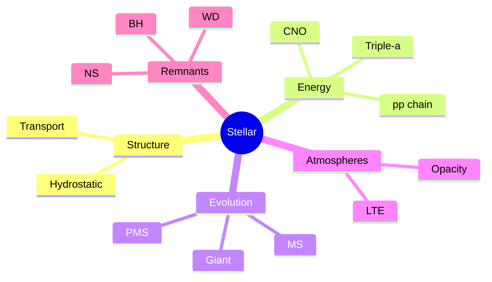
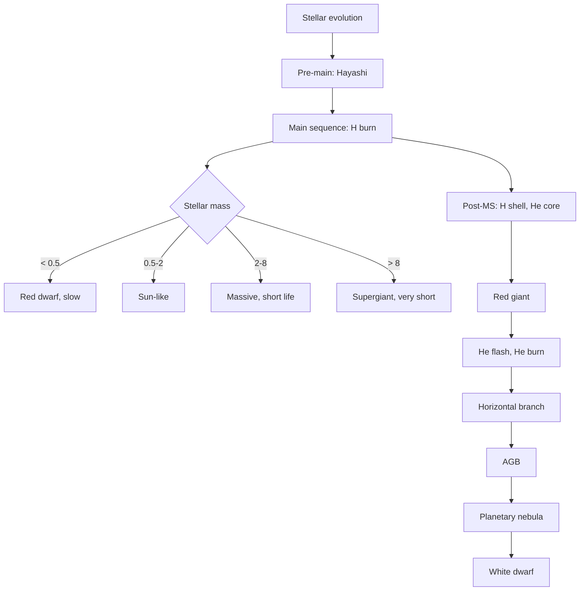
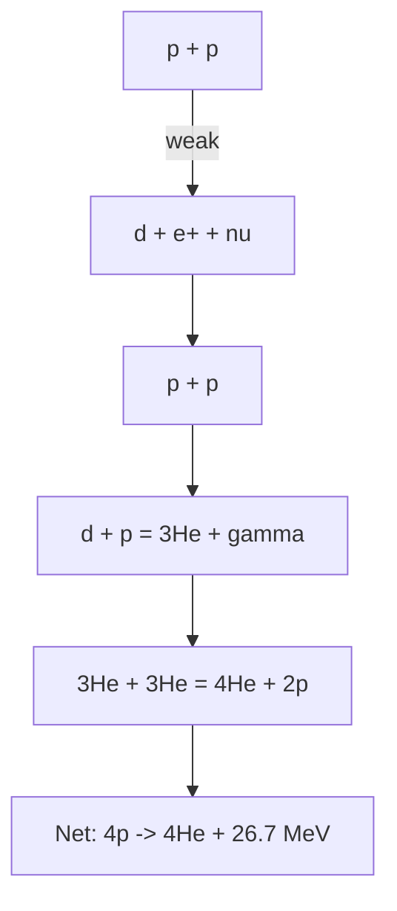
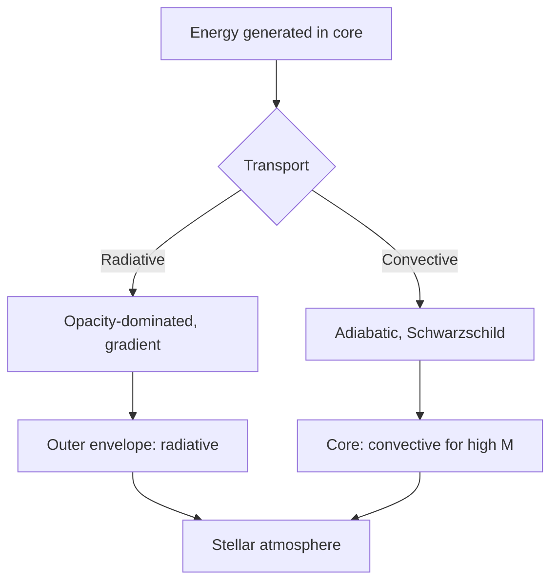
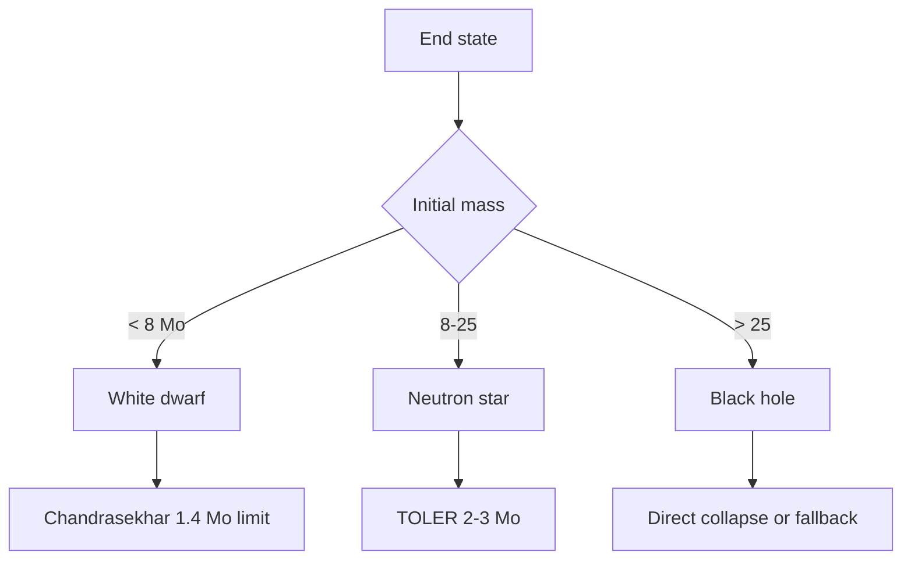

# PHYS 3071 — Stellar Astrophysics
> **Phase 1 BSc Elective | HKUST PHYS 3071 | Stellar structure, evolution, atmospheres**  
> **Bilingual 深度自學檔案 · 中英對照**

---

## 問題 1：5 個核心心智模型
1. **Hydrostatic equilibrium** — $dP/dr = -G M(r) \rho / r^2$
2. **Energy transport** — radiative vs convective
3. **Nuclear fusion** — pp chain, CNO cycle, triple-α
4. **Stellar timescales** — Kelvin-Helmholtz, nuclear
5. **H-R diagram** — observation + theory

## 問題 2：3 個根本分歧
1. **Standard model vs rapid rotators** — Be stars
2. **Convection theory** — MLT vs 3D simulation
3. **Mass loss** — steady wind vs eruptions

## 問題 3：10 個深度問題
1. 為什麼 star mass range ~0.08-100 $M_\odot$?
2. 給定 star mass, derive main-sequence lifetime $t \propto M^{-2.5}$。
3. 解釋 why Hayashi track vertical on H-R。
4. 為什麼太陽 luminosity 對 $T$ stable over $10^9$ yr?
5. 給定 $L = 4\pi R^2 \sigma T^4$, derive $L \propto M^3$ for main sequence。
6. 為什麼 convection zone exists (Schwarzschild criterion)?
7. 給定恒星 core, derive nuclear burning rate。
8. 為什麼恒星 end as WD, NS, or BH?
9. 解釋 why type Ia supernovae are standardizable。
10. 給定 stellar spectrum, derive $T_{eff}$, $\log g$, $[Fe/H]$。

## 深入 1：Stellar Structure Equations
**Deep Dive I**

4 ODEs: mass, hydrostatic, energy generation, transport. Boundary conditions.

**Engineering:** Stellar models.

## 深入 2：Energy Generation
**Deep Dive II**

pp chain: $4p \to {}^4He + 2e^+ + 2\nu$, $\epsilon \propto \rho X^2 T^4$ at low T, CNO at high T.

**Engineering:** Nuclear astrophysics.

## 深入 3：Stellar Evolution
**Deep Dive III**

Pre-main → main → giant → AGB → planetary nebula or supernova. Tracks on H-R.

**Engineering:** Stellar populations.

## 深入 4：Stellar Atmospheres
**Deep Dive IV**

Radiative transfer, LTE, spectral lines, opacity.

**Engineering:** Spectroscopy.

## 深入 5：Compact Remnants
**Deep Dive V**

White dwarf (electron degeneracy), neutron star (neutron degeneracy), black hole (GR).

**Engineering:** High-energy astrophysics.

## 自測 1：Mass range
**Answer:** <0.08: not hot enough for H burn. >100: radiation pressure dominates.  
**Engineering:** IMF.

## 自測 2：MS lifetime
**Answer:** $t \propto M/L \propto M \cdot M^{-3} = M^{-2.5}$.  
**Engineering:** Stellar ages.

## 自測 3：Hayashi track
**Answer:** Fully convective, vertical.  
**Engineering:** Pre-MS evolution.

## 自測 4：Solar stability
**Answer:** Negative feedback from partial ionization zones.  
**Engineering:** Habitability.

## 自測 5：$L \propto M^3$
**Answer:** From homology relations.  
**Engineering:** MS fitting.

## 自測 6：Schwarzschild
**Answer:** $\nabla_{rad} > \nabla_{ad}$ → convective.  
**Engineering:** Stellar structure.

## 自測 7：Burning rate
**Answer:** $\epsilon \propto \rho X^2 T^n$, $n$ = 4-6 pp, ~17 CNO.  
**Engineering:** Stellar energy.

## 自測 8：End states
**Answer:** Mass < 8 $M_\odot$: WD; 8-25: NS; >25: BH.  
**Engineering:** Stellar death.

## 自測 9：Standardizable candle
**Answer:** Phillips relation, $M_{max} - M_{15}$ correlation.  
**Engineering:** Cosmology.

## 自測 10：Stellar params
**Answer:** $T_{eff}$ from color, $\log g$ from lines, $[Fe/H]$ from Fe lines.  
**Engineering:** Stellar ID.

## 📊 Diagram 1: Stellar Map

## 📊 Diagram 2: H-R Diagram

## 📊 Diagram 3: pp Chain

## 📊 Diagram 4: Energy Transport

## 📊 Diagram 5: Compact Remnants

## 深度總結

1. **Stellar physics = coupled ODEs** — 4 equations
2. **Main sequence is fusion** — H to He
3. **Mass determines fate** — WD/NS/BH
4. **Atmosphere = observable** — spectroscopy
5. **Stellar evolution is well-tested** — H-R tracks

---

**自學建議** — Kippenhahn "Stellar Structure and Evolution". Carroll & Ostlie.
