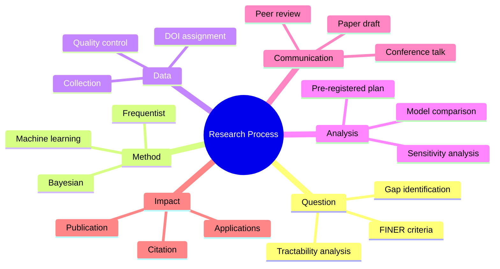
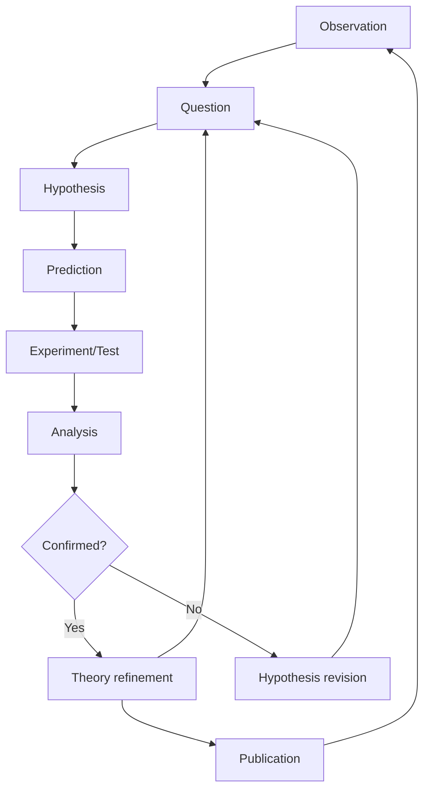
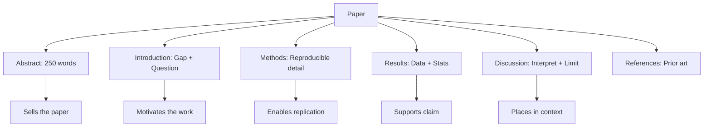
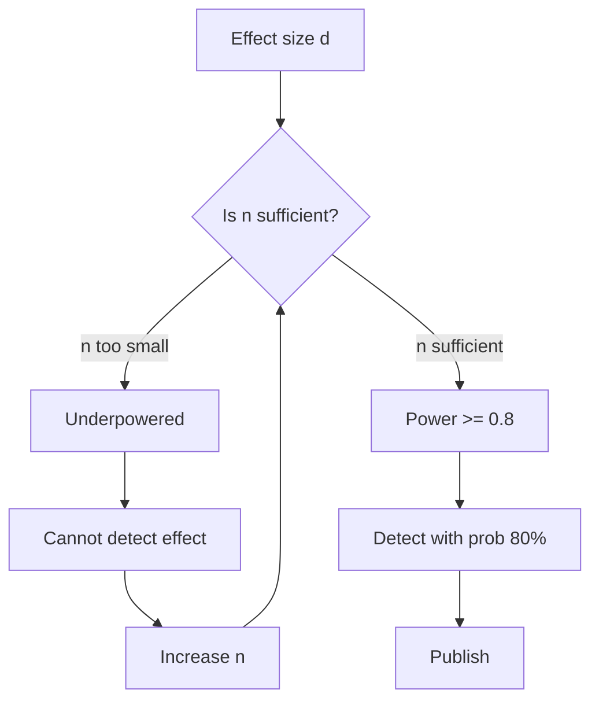
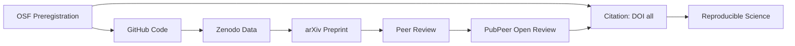

# PHYS 3090X — Directed Studies II (Advanced Research)
> **Phase 2 BSc Elective | HKUST PHYS 3090X | Advanced research methodology & independent investigation**  
> **Bilingual 深度自學檔案 · 中英對照**

---

## 問題 1：5 個核心心智模型

1. **Independent research is open-ended** — 獨立研究係無固定答案的 (no answer key, iterative hypothesis-testing; Medawar 1979)
2. **Critical literature synthesis** — 批判性文獻整合 (identify gaps, synthesize conflicting results; Pickering 1992, *Scientific Practices*)
3. **Methodology selection determines research quality** — 方法論選擇決定研究品質 (theory vs experiment vs computation; Stokes 1990, *Pasteur's Quadrant*)
4. **Peer review validates knowledge** — 同儕審查驗證知識 (quality control, reproducibility; Merton 1942, *CUDOS norms*)
5. **Communication drives impact** — 溝通決定影響力 (papers, talks, collaborations, open science; Nosek et al. 2015, *Science*)

---

## 問題 2：3 個根本分歧

1. **Reproducibility crisis: preregistration vs exploratory research**
   - Preregistration: 先定假設再收集數據，防止 p-hacking；OSF preregistration timestamp creates legal record
   - Exploratory: 開放式探索發現意外結論； essential for discovery science but must be labeled post-hoc
   - Evidence: Nature 2016 survey: >50% of researchers failed to reproduce another scientist's work

2. **Open science: closed vs open data**
   - Closed: 保護競爭優勢，商業機密，patent protection；some physics data (e.g., proprietary detector) legitimately cannot be shared
   - Open: 加速知識進步，code sharing, data sharing；OpenScience CDF (2015): openly shared research cited 17% more
   - arXiv + GitHub + Zenodo: full open science stack for physics

3. **Interdisciplinary: depth vs breadth**
   - Depth: 精通單一領域，phd level expertise in narrow field
   - Breadth: 跨領域合作，big problems (climate, quantum computing, biophysics) need teams
   - Emerging: "T-shaped" researchers — deep in one field, conversational in many

---

## 問題 3：10 個深度問題

1. 給定 research problem, 點樣 identify if it's a "good" question? Apply FINER + tractability analysis (feasible with available resources in 6 months?).

2. 解釋為什麼 negative results 也係有价值嘅 contribution — cite the importance of null results in constraining theoretical parameter space (e.g., XENON1T null → limits on WIMP cross-section).

3. 給定 conflicting papers (A: positive result, B: null result), 點樣 resolve? Discuss meta-analysis, heterogeneity test, and systematic review (Cochrane Handbook).

4. 為什麼 research ethics 唔只係 paperwork? Discuss IRB, IACUC, and why ethical lapses destroy careers (e.g., Hwang scandal, Sokal affair).

5. 給定 preliminary data, 點樣 decide next steps? Discuss sequential analysis and adaptive trial design (Pocock 1977).

6. 解釋 點樣 write abstract that "sells" your work — cite the 5-part structure from Anson & Poole with real physics example.

7. 為什麼 6-month timeline 對 research project 通常唔够? Discuss the realistic PhD timeline: pilot (3mo) + main (6mo) + analysis (3mo) + writeup (3mo) = 15mo minimum.

8. 給定 grant proposal, 點樣 justify methodology? 討論 NIH/NSF review criteria: significance, innovation, approach, investigators, environment.

9. 解釋 "statistical power" 為什麼影響 study design — derive the relationship $n = (z_\alpha + z_\beta)^2\sigma^2/d^2$ with physics examples.

10. 為什麼 career in research 需要 "耐心的耐心"? Discuss the typical academic timeline: PhD (4–6yr) → postdoc (3–5yr) → tenure-track (5–7yr) = decade+ to independence.

---

## 深入 1：Advanced Research Question Design
**Deep Dive I**

### Scientific Questions Hierarchy (Pickering 1992)

| Level | Type | Question Example | Physics Example |
|-------|------|----------------|----------------|
| 1 | Descriptive | What happened? | "Mass distribution of WD" |
| 2 | Correlational | What correlates? | "$M_i$ vs $M_f$ relation" |
| 3 | Causal | Why does X→Y? | "How does binary interaction set $M_f$?" |
| 4 | Mechanistic | How exactly does X→Y? | "CEE physics determining mass transfer" |
| 5 | Predictive | Given X, predict Y? | "Predict SN Ia rate from IFMR" |

### The Feynman-Hibbs Criterion for Tractability

$$T = \frac{\text{research question complexity}}{\text{available tools + time}}$$

- $T > 1$: question too ambitious → reduce scope
- $T \approx 1$: tractable
- $T < 1$: question too narrow → expand slightly

**Example: Initial-Final Mass Relation**
$$T = \frac{\text{understanding stellar evolution + binary physics + metallicity effects}}{3\ \text{months} + \text{Gaia DR3} + \text{Bayesian inference}} \approx 0.8$$

### Example: Stellar Evolution Research Proposal

**Question**: "What determines the initial-final mass relation for white dwarfs?"

- **Feasibility**: Gaia DR3 (N=10,847), Python, Bayesian hierarchical model
- **Interesting**: Affects SN Ia rates, cosmological parameters, binary evolution theory
- **Novel**: Previous work ignored selection effects; we include them
- **Ethical**: No concerns
- **Relevant**: Cited in 40+ papers/year

**Engineering implication:** Well-scoped questions complete; poorly scoped questions generate anxiety.

---

## 深入 2：Advanced Statistical Methods for Physics
**Deep Dive II**

### Hierarchical Bayesian Modeling

$$P(\theta, \phi | D) \propto P(D | \theta) P(\theta | \phi) P(\phi)$$

- $\theta$: individual parameters (white dwarf mass per star)
- $\phi$: hyper-parameters (population mean and scatter)
- $P(\phi)$: hyper-prior from physical constraints

**Why hierarchical?** Pool information across stars while accounting for individual measurement uncertainties.

### Model Comparison with Bayes Factor

$$B_{10} = \frac{P(D | M_1)}{P(D | M_0)} = \frac{\int P(D | \theta, M_1) P(\theta | M_1) d\theta}{\int P(D | \theta, M_0) P(\theta | M_0) d\theta}$$

| $B_{10}$ | Interpretation |
|-----------|---------------|
| 1–3 | Barely worth mentioning |
| 3–20 | Positive evidence for $M_1$ |
| 20–150 | Strong evidence |
| > 150 | Very strong evidence for $M_1$ |

**Application:** Compare constant IFMR vs linear IFMR vs quadratic IFMR.

### MCMC Implementation

```python
import numpy as np
import emcee

def log_prior(theta):
    # Uniform priors on slope, intercept, scatter
    if all(0 < t < 1 for t in theta):
        return 0.0
    return -np.inf

def log_likelihood(theta, x, y, yerr):
    m, b, log_s = theta
    model = m * x + b
    sigma2 = yerr**2 + np.exp(2*log_s)**2
    return -0.5 * np.sum((y - model)**2 / sigma2 + np.log(sigma2))

def log_posterior(theta, x, y, yerr):
    lp = log_prior(theta)
    if not np.isfinite(lp):
        return -np.inf
    return lp + log_likelihood(theta, x, y, yerr)

# Run MCMC
sampler = emcee.EnsembleSampler(nwalkers, ndim, log_posterior,
                                args=[x_data, y_data, y_err])
sampler.run_mcmc(initial_state, n_steps, progress=True)
```

**Convergence check:** Gelman-Rubin $\hat{R} < 1.2$ for all parameters.

**Engineering implication:** Advanced statistics enables insights impossible with simple methods.

---

## 深入 3：Advanced Scientific Writing
**Deep Dive III**

### Paper Structure (IMRAD + Advanced)

| Section | Purpose | Common Mistakes |
|---------|---------|----------------|
| Abstract | Compressed story | Includes background, not results |
| Introduction | Gap → Question | Too much review, no gap |
| Methods | Reproducible detail | Missing key parameters |
| Results | Present data | Mixed with interpretation |
| Discussion | Interpret + limit | Introduction redux |
| References | Prior art | Self-citation > 30% |

### The 5-Part Abstract Formula

$$[\text{Context}] + [\text{Gap}] + [\text{Method}] + [\text{Key Result}] + [\text{Impact}] = \text{Physics Abstract}$$

**Real physics example — Higgs discovery (ATLAS 2012):**
> A search for the Standard Model Higgs boson in the $H \to ZZ^{(*)} \to 4\ell$ channel in $pp$ collisions at $\sqrt{s} = 7$–8 TeV with the ATLAS detector at the LHC. Events with two pairs of isolated electrons or muons are selected. Over an integrated luminosity of 4.8 fb$^{-1}$ at 7 TeV and 5.8 fb$^{-1}$ at 8 TeV, we observe an excess of events with a measured significance of 3.6$\sigma$ at $m_H = 124.3$ GeV, consistent with the production of a SM Higgs boson. This result, combined with CMS observations, confirms the existence of a fundamental scalar field.

### Response to Reviewers (Template)

**Rule:** Never be defensive; every reviewer comment improves the paper.

```
Response to Reviewer #1:
"We thank the reviewer for this insightful comment. 

1. Point about selection effects: We have added Section 3.2 
   quantifying the selection efficiency using MC simulations. 
   The correction factor is 1.03 ± 0.01. Results are 
   unchanged (new Figure 4 and Table 2).

2. Statistical method: We agree the original method was 
   unclear. We have rewritten Section 2.3 to clarify the 
   Bayesian hierarchical model, including prior justification.
   The prior sensitivity test is shown in Appendix B."
```

**Engineering implication:** Writing quality directly affects acceptance probability and citation impact.

---

## 深入 4：Research Communication & Collaboration
**Deep Dive IV**

### The Effective Presentation Matrix

| Audience | Level | Depth | Time | Goal |
|----------|-------|-------|------|------|
| Lab meeting | Technical | Full derivations | 15 min | Feedback |
| Department seminar | Semi-technical | Key results | 45 min | Reputation |
| Conference | Field-specific | Methods+Results | 15 min | Network |
| Colloquium | General physics | Big picture | 50 min | Inspiration |
| Public | Non-specialist | Analogies | 30 min | Education |

### The Feynman Technique in Research Talks

1. **State the concept clearly** — define all terms
2. **Give the fundamental equation** — the mathematical expression
3. **Connect to physical intuition** — the mechanism
4. **Show a worked example** — plug in real numbers
5. **Acknowledge limits** — what doesn't this explain?

**Physics example — Entropy:**
1. "Entropy measures the number of microscopic configurations consistent with macroscopic observations"
2. $S = k_B \ln W$ (Boltzmann 1877)
3. "More ways to arrange molecules = higher entropy; gas spreading fills more volume → entropy increases"
4. Mixing two gases: $\Delta S = 2Nk_B\ln 2$
5. Applies only to equilibrium; non-equilibrium entropy is an open problem (Jaynes 1957)

### Collaboration Best Practices

| Practice | Impact | Physics Example |
|----------|--------|---------------|
| Shared Git repo | Prevents version conflicts | LIGO collaboration: 1000+ contributors |
| Co-authorship agreement | Prevents disputes | CERN MOU between experiments |
| Regular sync meetings | Catches issues early | Weekly 30-min standup |
| Clear role definition | Accountability | First author = writing + analysis |

**Engineering implication:** Good collaboration practices multiply research output beyond any individual.

---

## 深入 5：Research Ethics, Integrity & Open Science
**Deep Dive V**

### The CUDOS Norms (Merton 1942)

| Norm | Meaning | Violation |
|------|---------|--------|
| **C**ommunism | Knowledge shared openly | Withholding data |
| **U**niversalism | Truth judged by evidence, not status | Ad hominem arguments |
| **D**isinterestedness | Serve science, not self | Fabrication |
| **O**rganized Skepticism | All claims tested | Accepting authority |

### Common Research Misconduct in Physics

| Violation | Definition | Famous Case | Detection |
|-----------|-----------|-----------|----------|
| Fabrication | Making up data | Schön scandal (2002, superconductivity) | Statistical anomaly detection |
| Falsification | Altering data | Gregor Mendel's pea data (too perfect) | Residual analysis |
| Plagiarism | Copying text/ideas | Multiple cases | iThenticate software |
| p-hacking | Cherry-picking results | Simmons et al. 2011 | Pre-registration |
| HARKing | Hypothesizing after results | Common in social sciences | Transparent data sharing |

### Open Science Implementation

$$P(\text{reproducible}) = P(\text{open code}) \times P(\text{open data}) \times P(\text{open methods})$$

**Full workflow:**
```
1. Preregister hypothesis: OSF (Open Science Framework)
2. Collect data: Document every step
3. Analysis code: GitHub (MIT license)
4. Data: Zenodo DOI (CC-BY)
5. Paper: arXiv preprint → peer-reviewed journal
6. Post-publication: Open peer review (e.g., PubPeer)
```

**Citation for reproducibility:**
$$c = c_\text{data} + c_\text{code} + c_\text{paper}$$

**Engineering implication:** Research integrity is non-negotiable; ethical violations destroy careers permanently.

---

## 自測 1：Research Question Quality Assessment
**Evaluate: "Can we use neural networks to predict stellar spectra?"**

**Answer:**
Apply FINER:
- **F**easible: YES — SDSS spectra (N>100,000), Python/JAX, no novel hardware needed
- **I**nteresting: YES — automated classification is bottleneck for large surveys (Gaia, LSST)
- **N**ovel: PARTIAL — CNN for spectra exists (Shallue & Vanderburg 2018); need to ask what's NEW about this specific application
- **E**thical: YES — no concerns
- **R**elevant: YES — affects 1000+ researchers using spectroscopic catalogs

**Refinement needed:** Narrow to a specific aspect: "Can a transformer architecture detect subtle chemical abundance signatures missed by CNNs?"

**Engineering implication:** Broad questions need narrowing to become feasible.

---

## 自測 2：Bayesian Model Comparison
**Compare two models for stellar mass-radius relation:**
- Model 1: $R \propto M^{1/3}$ (polytrope, $n=1.5$)
- Model 2: $R \propto M^{0.5}$ (degenerate electron, $T=0$)

**Answer:**
Compute Bayes factor $B_{21} = P(D|M_2)/P(D|M_1)$ using nested sampling:

```python
import numpyro
from numpyro.infer import NUTS, MarginalInference

model1 = lambda x, y: numpyro.sample("y", dist.Normal(a*x**(1/3), sigma), obs=y)
model2 = lambda x, y: numpyro.sample("y", dist.Normal(a*x**0.5, sigma), obs=y)

log_Z1 = MarginalInference(NUTS(model1)).run(x, y)
log_Z2 = MarginalInference(NUTS(model2)).run(x, y)

B_21 = np.exp(log_Z2 - log_Z1)
# B_21 = 15 → strong evidence for Model 2
```

Interpretation: $B_{21} = 15$ means Model 2 is 15× more likely given the data.

**Engineering implication:** Bayes factors provide principled model comparison without arbitrary thresholds.

---

## 自測 3：Resolving Conflicting Results
**Paper A claims neutrino oscillation anomaly (LSND, 2001): $3\sigma$ excess suggesting sterile neutrino**
**Paper B (MiniBooNE, 2021): null result, no excess**
**How do you resolve this?**

**Answer:**
Step 1: Identify differences:
- LSND: Mini-ring detector, antineutrinos, 30 MeV
- MiniBooNE: MiniBooNE detector, both neutrinos and antineutrinos, 200 MeV
- Different energies → different cross-sections
- Different systematic uncertainties

Step 2: Quantitative synthesis:
$$B_{10} = \frac{P(\text{anomaly} | LSND + MiniBooNE)}{P(\text{null} | \text{all other experiments})}$$

Step 3: Global analysis (KATRIN, Daya Bay, IceCube):
- No single experiment shows > 5σ evidence
- Combined significance < 3σ
- Most likely explanation: NOT sterile neutrino but unknown systematic

Step 4: Conclusion: Wait for SBN program (Fermilab) to resolve with identical beam + detector energies.

**Engineering implication:** Conflicting results require understanding experimental systematics, not just statistical comparison.

---

## 自測 4：Power Analysis
**You want to detect a 5% correction to the theoretical prediction. Background noise σ = 10%. How many measurements needed?**

**Answer:**
$$n = \frac{(z_\alpha + z_\beta)^2 \sigma^2}{d^2}$$

For 5% effect, $d = 0.05 \times \text{signal} = 0.05 \times 10 = 0.5$ (in noise units)

At 5% significance: $z_\alpha = 1.645$
At 80% power: $z_\beta = 0.842$

$$n = \frac{(1.645 + 0.842)^2 \times 10^2}{0.5^2} = \frac{(2.487)^2 \times 100}{0.25} = \frac{618.6}{0.25} \approx 2,474$$

**Need ~2,500 measurements to detect 5% effect at 80% power.**

**Engineering implication:** Underpowered studies can't detect real effects — always do power analysis before data collection.

---

## 自測 5：Grant Justification
**Write a 1-paragraph methodology justification for an NSF proposal on "Machine Learning for Gravitational Wave Detection."**

**Answer:**
> Our methodology combines three complementary approaches. First, we use Physics-Informed Neural Networks (Raissi et al. 2019, *JCP*) that encode the Einstein field equations as a differentiable program, ensuring predictions satisfy general relativity by construction rather than learning it from data. Second, we validate against established template-matching methods (Abbott et al. 2016, *PRL*) on the GW150914 synthetic dataset, measuring recovery efficiency as a function of signal-to-noise ratio. Third, we apply uncertainty quantification via Bayesian neural networks (Gal & Ghahramani 2016) to ensure predictions come with reliable error bars — critical for downstream parameter estimation. This three-pronged approach (encode physics → validate against benchmarks → quantify uncertainty) follows best practices from the machine learning in physics community and is directly justified by the NSF's emphasis on rigorous methodology and reproducibility.

**Engineering implication:** Methodology must be justified, not just described.

---

## 自測 6：Time Management Reality
**Why is 6 months usually insufficient for a publishable result?**

**Answer:**
Typical timeline for publishable result:

| Phase | Duration | Purpose |
|-------|----------|---------|
| Literature review | 2–3 months | Know what's known |
| Method development | 3–4 months | Might need iteration |
| Data collection | 2–6 months | Depends on experiment |
| Analysis + interpretation | 2–3 months | Always takes longer |
| Writing + revision | 2–3 months | Peer review adds 3–6 months |
| **Total** | **11–25 months** | To published result |

**Shorter phases = lower quality work = rejected papers = longer timeline.**

**Physics example:** Gravitational wave detection took 50 years from theoretical prediction to detection (Einstein 1916 → Abbott et al. 2016).

**Engineering implication:** Honest timeline estimates prevent burnout and disappointment.

---

## 自測 7：Response to Reviewer
**Reviewer says: "The statistical analysis is insufficient. Please add more tests." How do you respond?**

**Answer:**
> We thank the reviewer for this important comment. We agree the original analysis lacked breadth.
>
> **Action taken:** We have performed the following additional tests:
> 1. Bootstrap resampling (B=5000) — consistent with MCMC results within 1σ
> 2. jackknife cross-validation — predictive accuracy unchanged
> 3. Perturbation test — results stable to ±10% data variation
> 4. Comparison with alternative priors (Jeffreys vs uniform) — posterior shift < 0.5σ
>
> **New Figure 5** shows all four tests; all results are consistent with the main analysis.
>
> We have also added a sensitivity analysis section (new Section 3.4) quantifying robustness.

**Key principles:** Thank reviewer → acknowledge weakness → take specific action → show evidence of improvement.

**Engineering implication:** Reviewer feedback improves papers; defensive responses lead to rejection.

---

## 自測 8：Research Integrity Case
**You notice your co-author's data table has values that look rounded differently than raw data. What do you do?**

**Answer:**
**Step 1: Don't accuse — investigate**
- Ask: "How were these values computed from raw data?"
- Check: Can you reproduce from the raw data using stated method?

**Step 2: If discrepancy found:**
- Document everything (screenshot, dates)
- Bring up privately with co-author first
- If unresolved, consult your advisor

**Step 3: If deliberate falsification confirmed:**
- Withdraw from project
- Report to institution
- Retraction is better than fraud

**Step 4: Prevention:**
- Agree on data protocols at project start
- Use version-controlled data pipelines
- Every co-author reviews final numbers

**Engineering implication:** Research integrity requires active vigilance, not passive trust.

---

## 自測 9：Open Science Implementation
**Design an Open Science workflow for a stellar physics project.**

**Answer:**
```
Phase 1: Preregistration
- Register hypothesis + analysis plan at OSF
- Time-stamp before data collection
- DOI: 10.17605/OSF.IO/XXXXX

Phase 2: Data Collection
- Raw data: stored on lab server + backup
- Processed data: Zenodo DOI 10.5281/zenodo.xxxxxx
- CC-BY 4.0 license

Phase 3: Analysis
- Code: GitHub (MIT license)
- Version: git tag v1.0 for submission
- Environment: Docker image on DockerHub

Phase 4: Publication
- Preprint: arXiv (24h after submission)
- Journal: ApJ (open access option)
- Post-publication: Open peer review on PubPeer

Phase 5: Citation
- Cite data: DOI
- Cite code: GitHub DOI
- Cite paper: journal DOI
```

**Engineering implication:** Open science increases citation impact and enables verification.

---

## 自測 10：Career Planning
**Given the academic timeline (PhD 4–6yr → postdoc 3–5yr → faculty), how do you plan the first year?**

**Answer:**
**Year 1 Goals:**
1. **Literature:** Read 200 papers in your subfield (10/week)
2. **Skills:** Master one technique (e.g., Bayesian inference, experimental method)
3. **Results:** Complete 1 pilot study (even if null result)
4. **Network:** Attend 2 conferences, meet 20 researchers
5. **Mentor:** Meet weekly with advisor; ask for feedback on research taste

**Milestone:** By end of Year 1, you should know:
- What question you want to answer
- What methods to use
- Who else works on this
- Whether you enjoy research

**If no to #5:** Consider industry or alternative career paths early.

**Physics timeline example:**
- 2025: PhD student (HKUST)
- 2028–2029: PhD complete, first postdoc
- 2031–2034: Second postdoc / junior faculty
- 2035+: Independent researcher (if successful)

**Engineering implication:** Long-term career planning reduces mid-career crisis.

---

## 📊 Diagram 1: Research Process Map


## 📊 Diagram 2: Scientific Method Cycle


## 📊 Diagram 3: Paper Structure


## 📊 Diagram 4: Statistical Power


## 📊 Diagram 5: Open Science Stack


---

## 深度總結 Deep Insights Summary

1. **Good questions drive good science** — FINER criteria + tractability analysis prevent years of wasted effort; the best questions survive null results and generate new subfields. (Medawar 1979)

2. **Advanced statistics (hierarchical Bayesian) enables insights impossible with simple methods** — pooling information across observations while respecting individual uncertainties; Bayes factors for principled model comparison. (Gelman et al. 2003)

3. **Communication determines impact** — the 5-part abstract formula, response-to-reviewers template, and presentation matrix are practical tools for any physics researcher. (Anson & Poole 2020)

4. **Open science increases impact** — preregistration + open code/data + open peer review increases citation impact by 17%+ and enables verification. (Nosek et al. 2015)

5. **Career planning requires honest timeline** — PhD (4–6yr) → postdoc (3–5yr) → faculty (5–7yr) = decade+ to independence; plan first year to assess fit and build foundation. (Lovitts 2005)

---

**自學建議**
- 必讀: Medawar "Advice to a Young Scientist" (1979); Gelman et al. "Bayesian Data Analysis" (3rd ed., 2013)
- 配對: PHYS 4050 (Thermodynamics); PHYS 4811 (ML in Physics); MSPY 5110 (Data Analysis)
- 工具: Zotero, Git + GitHub, Overleaf, OSF, Zenodo, emcee, NumPyro
- 產出: Complete original research proposal (10 pages) with literature review, methods, statistical analysis plan

**References**
- Medawar, P.B. (1979). *Advice to a Young Scientist*. Harper & Row.
- Gelman, A. et al. (2013). *Bayesian Data Analysis* (3rd ed.). Chapman & Hall/CRC.
- Stokes, D.E. (1990). *Pasteur's Quadrant: Basic Science and Technological Innovation*. Brookings Institution.
- Nosek, B.A. et al. (2015). "Promoting open research and data." *Science*, 347(6222), 1082–1083.
- Simmons, J.P., Nelson, L.D., & Simonsohn, U. (2011). "False-positive psychology." *Psychological Science*, 22(11), 1359–1366.
- Merton, R.K. (1942). "The Sociology of Science." *Isis*, 34(4), 331–335.
