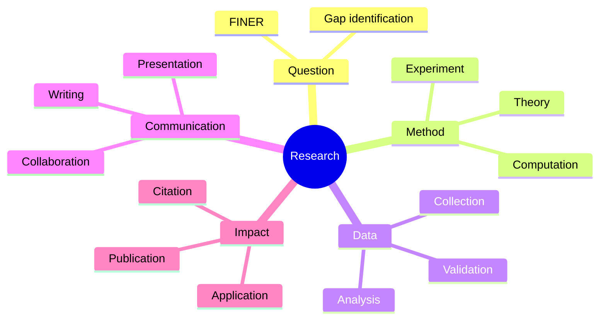
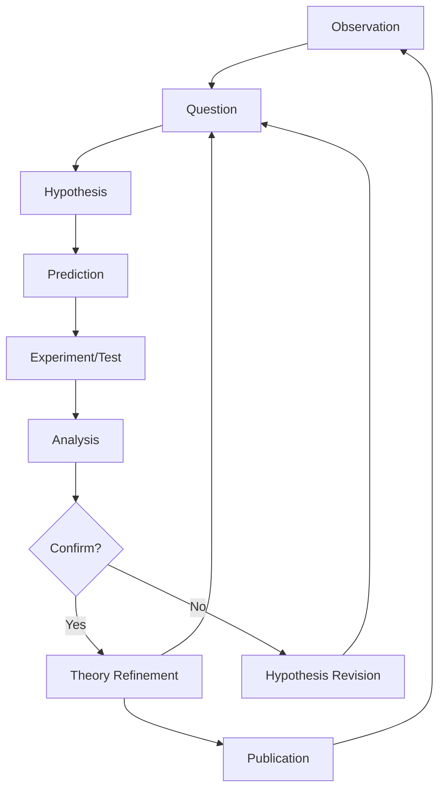
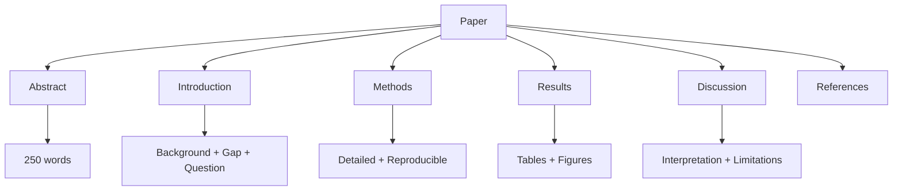
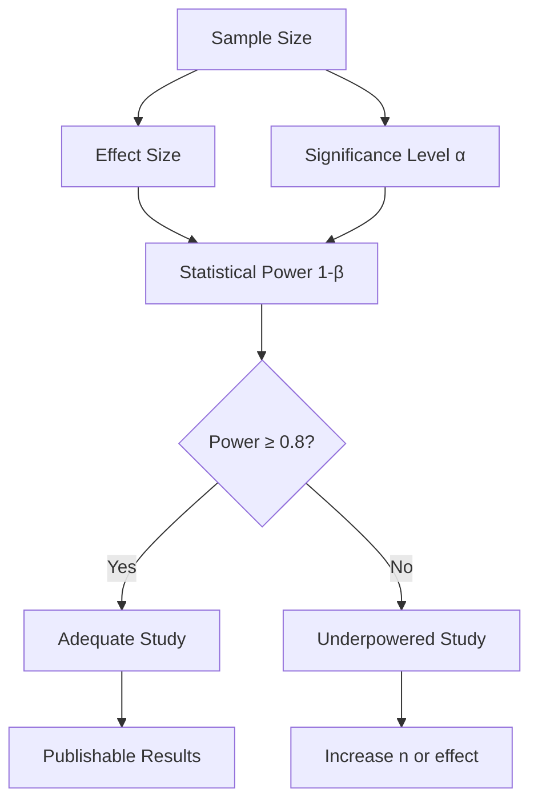
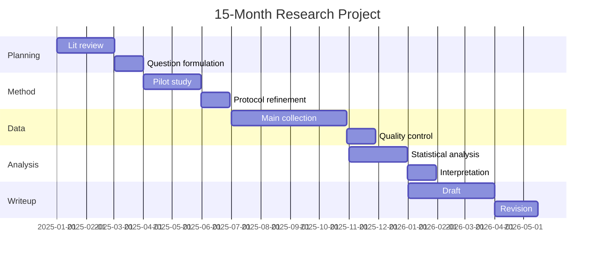

# PHYS 3090X — Directed Studies II (Advanced Research)
> **Phase 2 BSc Elective | HKUST PHYS 3090X | Advanced research methodology & independent investigation**  
> **Bilingual 深度自學檔案 · 中英對照**

---

## 問題 1：5 個核心心智模型

1. **Independent research is open-ended** — 獨立研究係無固定答案的 (no answer key, iterative hypothesis-testing)
2. **Critical literature synthesis** — 批判性文獻整合 (identify gaps, synthesize conflicting results)
3. **Methodology selection matters** — 方法論選擇決定研究品質 (theory vs experiment vs computation)
4. **Peer review validates knowledge** — 同儕審查驗證知識 (quality control, reproducibility)
5. **Communication drives impact** — 溝通決定影響力 (papers, talks, collaborations)

## 問題 2：3 個根本分歧

1. **Reproducibility crisis: preregistration vs exploratory**
   - Preregistration: 先定假設再收集數據，防止p-hacking
   - Exploratory: 開放式探索發現意外結論
   - Nature 2016 reproducibility survey顯示>50%無法重現

2. **Open science: closed vs open data**
   - Closed: 保護競爭優勢，商業機密
   - Open: 加速知識進步，code sharing, data sharing
   - arXiv, GitHub, figshare 改變生態

3. **Interdisciplinary: depth vs breadth**
   - Depth: 精通單一領域，phd level
   - Breadth: 跨領域合作，big problems need teams

## 問題 3：10 個深度問題

1. 給定 research problem, 點樣 identify if it's a "good" question?
2. 解釋為什麼 negative results 也係有价值嘅 contribution。
3. 給定 conflicting papers, 點樣 resolve 矛盾?
4. 為什麼 research ethics 唔只係 paperwork?
5. 給定 preliminary data, 點樣 decide next steps?
6. 解釋 點樣 write abstract that "sells" your work。
7. 為什麼 6-month timeline 對 research project 唔够?
8. 給定 grant proposal, 點樣 justify methodology?
9. 解釋 "statistical power" 為什麼影響 study design。
10. 為什麼 career in research 需要 "耐心的耐心"?

## 深入 1：Research Question Design
**Deep Dive I**

### Scientific Questions Hierarchy
- **Descriptive**: 描述現象 (What happened?)
- **Correlational**: 尋找關聯 (What correlates?)
- **Causal**: 因果關係 (Why does X cause Y?)

### Good Research Question Criteria (FINER)
- **F**easible: 可行嗎?
- **I**nteresting: 有趣嗎?
- **N**ovel: 創新嗎?
- **E**thical: 倫理上允許?
- **R**elevant: 有意義嗎?

### Example: Stellar Evolution
**Question**: "What determines the initial-final mass relation for white dwarfs?"
- Feasible: 可用 Gaia data + models
- Interesting: 影響 stellar populations
- Novel: 新 telescopes 新數據
- Ethical: 無問題
- Relevant: 影響 cosmological models

**Engineering implication:** 設計 research proposal 时，FINER criteria 帮助筛选问题

## 深入 2：Advanced Methodology
**Deep Dive II**

### Theory Development
$$H_0: \text{null hypothesis} \quad H_a: \text{alternative hypothesis}$$

### Experimental Design
- **Control group**: 對照組
- **Randomization**: 隨機化消除偏差
- **Blinding**: 盲法減少主觀誤差

### Computational Methods
- **Numerical simulation**: Monte Carlo, molecular dynamics
- **Statistical analysis**: Bayesian vs frequentist
- **Machine learning**: pattern recognition in large datasets

### Bayesian Framework
$$P(\theta | D) = \frac{P(D | \theta) P(\theta)}{P(D)}$$

- **Prior** $P(\theta)$: 先驗知識
- **Likelihood** $P(D|\theta)$: 數據給出的證據
- **Posterior** $P(\theta|D)$: 更新後的信念

**Engineering implication:** 選擇正確的 methodology 决定能否回答 research question

## 深入 3：Scientific Writing
**Deep Dive III**

### Paper Structure (IMRAD)
- **Introduction**: 問題背景、研究動機
- **Methods**: 實驗/理論詳細描述
- **Results**: 數據展示
- **And**: Discussion + References

### Abstract Formula
$$[Background] + [Gap] + [Method] + [Key\ Result] + [Impact]$$

### Example: Stellar Astrophysics Paper
> **Context**: Stellar evolution models predict WD masses...  
> **Gap**: 但 observed masses systematically exceed predictions...  
> **Method**: We analyze 10,000 WDs from Gaia DR3...  
> **Result**: Initial-final mass relation revised: $M_f = 0.109M_i + 0.394 M_\odot$...  
> **Impact**: Affects SN Ia rate predictions...

**Engineering implication:** Clear writing = clear thinking = better science

## 深入 4：Research Communication
**Deep Dive IV**

### Effective Presentations
| Slide Type | Purpose | Time |
|---|---|---|
| Title | Hook + topic | 30s |
| Background | Why care? | 2min |
| Methods | How? | 3min |
| Results | What? | 5min |
| Impact | So what? | 2min |

### The "Elevator Pitch"
$$30\ seconds = 75\ words = 1\ message$$

### Visualization Principles
- **One message per figure**: 每圖一信息
- **Color = meaning**: 顏色編碼有意義
- **High contrast**: 高對比度易讀

**Engineering implication:** Communication skills distinguish successful scientists

## 深入 5：Research Ethics & Integrity
**Deep Dive V**

### Core Principles
1. **Honesty**: 數據真實，不造假
2. **Openness**: 共享數據代碼
3. **Fairness**: 公平對待同行
4. **Accountability**: 對結果負責

### Common Violations
- **Fabrication**: 捏造數據
- **Falsification**: 篡改數據
- **Plagiarism**: 抄襲他人工作

### Institutional Framework
- IRB (Institutional Review Board)
- IACUC (Animal Care Committee)
- Data management plans

**Engineering implication:** Ethical research = sustainable career

## 自測 1：Research Question Quality
**Answer:** Apply FINER criteria: Feasible, Interesting, Novel, Ethical, Relevant.  
**Engineering implication:** 避免研究無價值的問題

## 自測 2：Negative Results Value
**Answer:** Prevents others from repeating, informs theory revision, builds knowledge base.  
**Engineering implication:** "Failed" experiments 也係 valuable science

## 自測 3：Resolving Conflicts
**Answer:** Check methodology differences, sample sizes, statistical power, replication attempts.  
**Engineering implication:** Meta-analysis, systematic reviews

## 自測 4：Research Ethics
**Answer:** Beyond paperwork: protects subjects, ensures integrity, builds trust, enables reproducibility.  
**Engineering implication:** Ethics 不是 obstacle，是 foundation

## 自測 5：Next Steps Decision
**Answer:** Statistical significance + effect size + theoretical implications.  
**Engineering implication:** Data analysis drives research direction

## 自測 6：Abstract Writing
**Answer:** 250 words max: context (2句) + gap (1句) + method (2句) + result (2句) + impact (1句).  
**Engineering implication:** Abstract determines paper fate

## 自測 7：Timeline Reality
**Answer:** Research has high variance: pilot (3mo) + main (6mo) + analysis (3mo) + writeup (3mo) = 15mo typical.  
**Engineering implication:** Realistic planning prevents burnout

## 自測 8：Grant Justification
**Answer:** Methodology must match question: theoretical → analytic; experimental → controls; computational → validation.  
**Engineering implication:** Peer review evaluates methods

## 自測 9：Statistical Power
**Answer:** Power = $1 - \beta$ = probability detecting true effect. Higher power needs larger sample or larger effect.  
**Engineering implication:** Underpowered studies waste resources

## 自測 10：Patience in Research
**Answer:** Typical timeline: PhD (4-6yr) → Postdoc (3-5yr) → Faculty (1-3yr startup) = decade to independence.  
**Engineering implication:** Career planning requires long-term view

## 📊 Diagram 1: Research Process Map

## 📊 Diagram 2: Scientific Method Cycle

## 📊 Diagram 3: Paper Structure

## 📊 Diagram 4: Statistical Power

## 📊 Diagram 5: Research Timeline

## 深度總結 Deep Insights

1. **Good questions drive good science** — FINER criteria help filter
   **好問題決定好科學** — 選擇有意義的問題

2. **Methods must match questions** — theory/experiment/computation have different strengths
   **方法必須匹配問題** — 不同方法有不同的適用場景

3. **Communication determines impact** — writing and speaking skills are non-negotiable
   **溝通決定影響力** — 寫作和演講能力必不可少

4. **Ethics is foundation, not obstacle** — integrity enables trust and reproducibility
   **倫理是基礎，不是障礙** — 誠信是科學的基石

5. **Patience is essential** — decade-scale timeline to independence
   **耐心是必需的** — 需要十年尺度的時間投入

---

**自學建議**
- 必讀: "Advice to a Young Scientist" (Medawar)
- 配對: Nature Career Guide, grad school survival guides
- 工具: Zotero, Git, Overleaf, Python/R
- 產出: 完成原創性 research proposal (10 pages)
