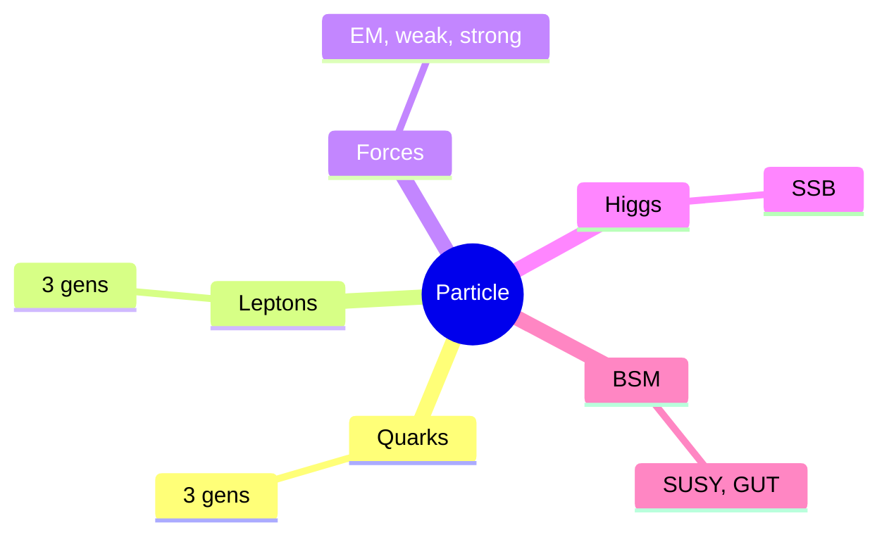
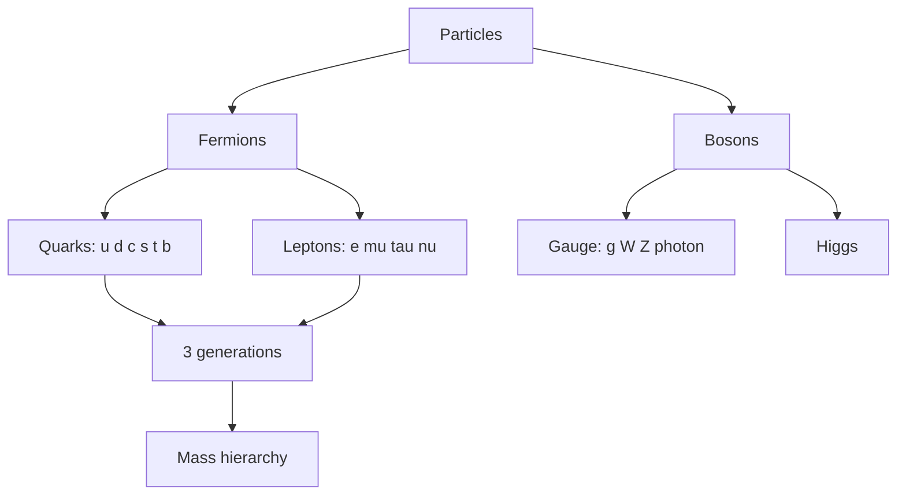
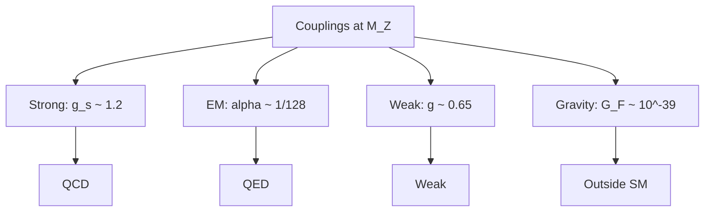
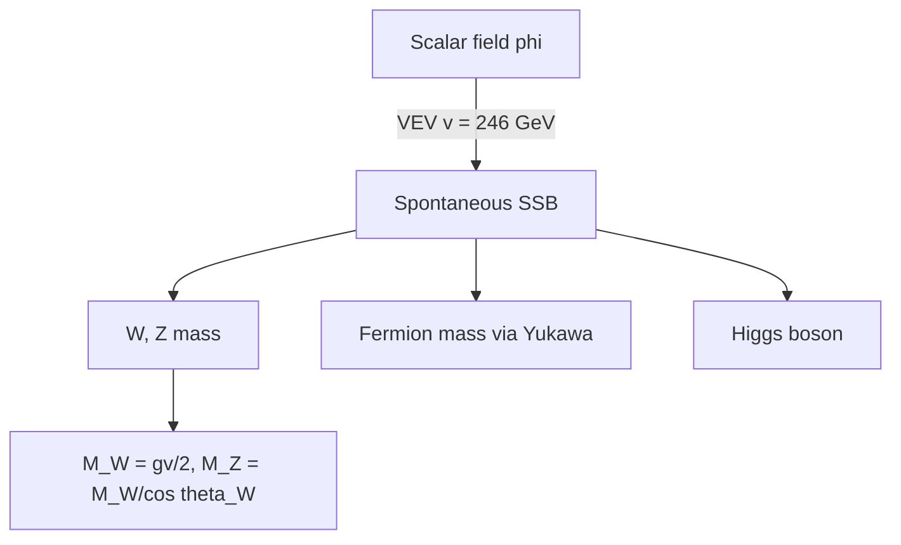
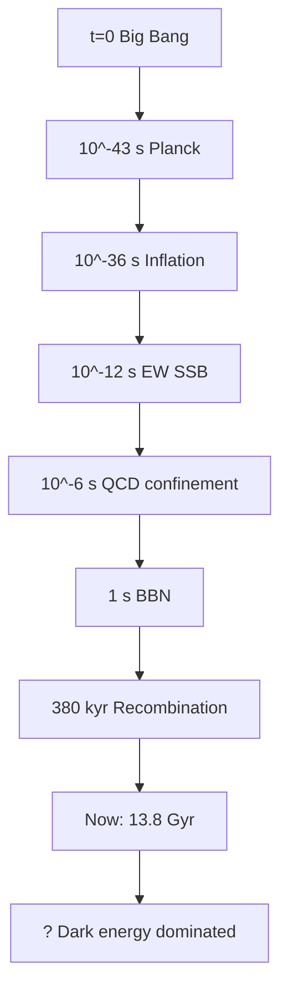

# PHYS 4055 — Particle Physics and the Universe
> **Phase 1 BSc Elective | HKUST PHYS 4055 | Standard model, cosmology, deep connections**  
> **Bilingual 深度自學檔案 · 中英對照**

---

## 問題 1：5 個核心心智模型
1. **Standard model** — SU(3)×SU(2)×U(1) gauge symmetry
2. **Quarks & leptons** — 3 generations, fundamental
3. **Forces as exchange** — gauge bosons
4. **Symmetry breaking** — Higgs mechanism
5. **Cosmology** — early universe, matter-antimatter

## 問題 2：3 個根本分歧
1. **Standard model complete? BSM needed?**
2. **String theory vs loop quantum gravity**
3. **Inflation eternal or not**

## 問題 3：10 個深度問題
1. 為什麼 3 generations of fermions?
2. 給定 QED vertex, derive cross section for Bhabha scattering。
3. 為什麼 weak force violates parity?
4. 給定 Higgs VEV $v = 246$ GeV, derive W mass。
5. 為什麼 matter > antimatter in universe (baryogenesis)?
6. 解釋 why asymptotic freedom in QCD。
7. 給定 Hubble constant, derive age of universe。
8. 為什麼 CMB 係 universe 380,000 yr old snapshot?
9. 給定 neutrino mass, derive seesaw mechanism。
10. 解釋 why dark matter 唔 in standard model。

## 深入 1：Quarks & Leptons
**Deep Dive I**

3 generations: (u,d), (c,s), (t,b) quarks, (e, $\nu_e$), ($\mu, \nu_\mu$), ($\tau, \nu_\tau$) leptons. Charges, masses.

**Engineering:** Particle ID, accelerators.

## 深入 2：Gauge Forces
**Deep Dive II**

SU(3) strong (gluon), SU(2) weak (W, Z), U(1) EM (photon). Coupling constants.

**Engineering:** Accelerator design.

## 深入 3：Higgs Mechanism
**Deep Dive III**

Spontaneous symmetry breaking gives mass to W, Z. Fermion masses from Yukawa.

**Engineering:** LHC physics.

## 深入 4：Cosmological Connections
**Deep Dive IV**

BBN, CMB, dark matter, dark energy, inflation, baryogenesis.

**Engineering:** Cosmology.

## 深入 5：Beyond Standard Model
**Deep Dive V**

SUSY, GUTs, string, extra dims. Dark matter candidates, hierarchy problem.

**Engineering:** Theoretical research.

## 自測 1：3 generations
**Answer:** Anomaly cancellation, possibly anthropic.  
**Engineering:** Particle physics.

## 自測 2：Bhabha
**Answer:** $e^+e^- \to e^+e^-$ via photon exchange.  
**Engineering:** Collider physics.

## 自測 3：Parity violation
**Answer:** Weak force couples only to left-handed.  
**Engineering:** Wu experiment 1957.

## 自測 4：W mass
**Answer:** $M_W = gv/2$, $v = 246$ GeV.  
**Engineering:** Higgs.

## 自測 5：Baryogenesis
**Answer:** Sakharov: B violation, CP, out of equilibrium.  
**Engineering:** Cosmology.

## 自測 6：Asymptotic freedom
**Answer:** QCD $\beta < 0$, strong at low E, weak at high.  
**Engineering:** Quark confinement.

## 自測 7：Universe age
**Answer:** $t = 1/H_0 \approx 13.8$ Gyr.  
**Engineering:** Cosmology.

## 自測 8：CMB
**Answer:** Recombination at $z \approx 1100$, 380 kyr.  
**Engineering:** CMB observation.

## 自測 9：Seesaw
**Answer:** $m_\nu \sim v^2/M_R$, $M_R$ grand unification.  
**Engineering:** BSM physics.

## 自測 10：DM not SM
**Answer:** SM particles either charged or too light, ruled out.  
**Engineering:** Dark matter detection.

## 📊 Diagram 1: Particle Physics Map

## 📊 Diagram 2: Standard Model Particles

## 📊 Diagram 3: Coupling Constants

## 📊 Diagram 4: Higgs Mechanism

## 📊 Diagram 5: Cosmological Timeline

## 深度總結

1. **SM = 3 forces unified** — gauge symmetry
2. **Higgs = mass origin** — SSB
3. **Cosmology tests SM** — early universe
4. **Dark matter = BSM** — unknown physics
5. **Open questions** — gravity, hierarchy, flavor

---

**自學建議** — Griffiths "Introduction to Elementary Particles". Schwartz "Quantum Field Theory".
