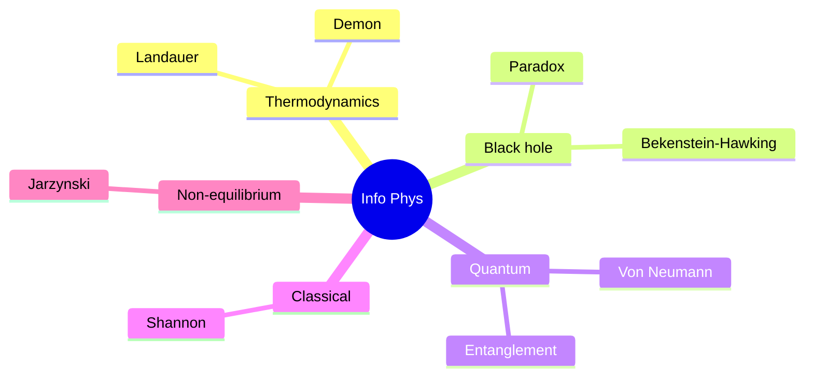
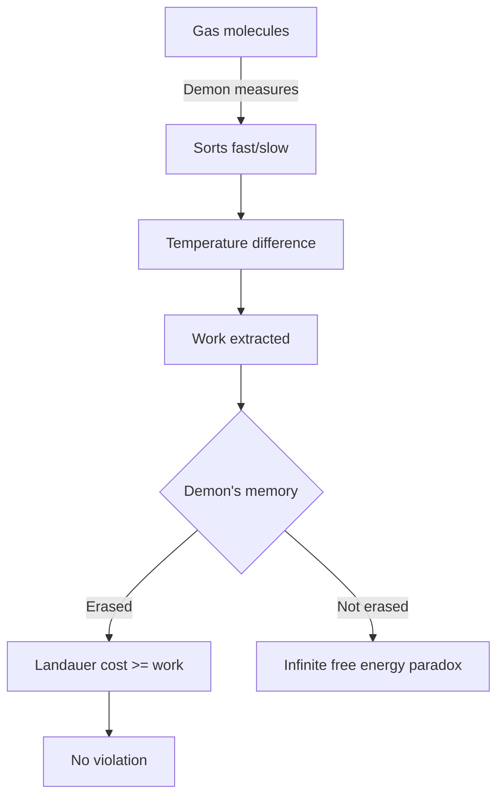
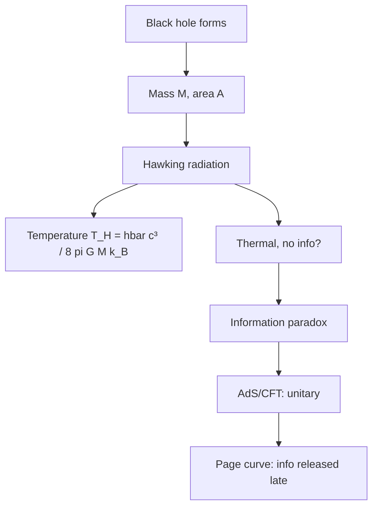
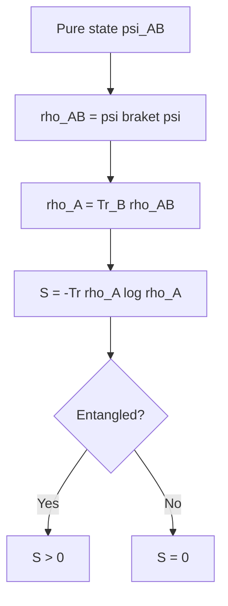
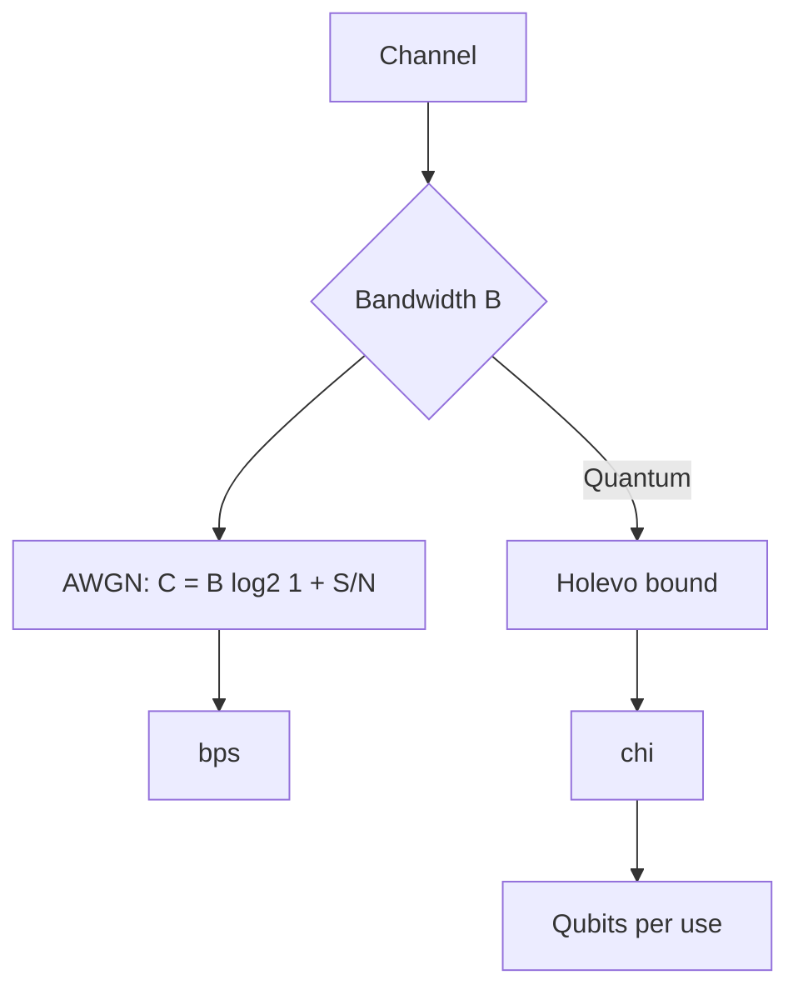

# PHYS 4058 — Information Physics
> **Phase 1 BSc Elective | HKUST PHYS 4058 | Information theory meets physics**  
> **Bilingual 深度自學檔案 · 中英對照**

---

## 問題 1：5 個核心心智模型
1. **Landauer principle** — $k_B T \ln 2$ per bit erasure
2. **Bekenstein-Hawking entropy** — $S = A/(4 l_P^2)$
3. **Shannon entropy** — $H = -\sum p \log p$
4. **Maxwell's demon** — resolved by information
5. **Quantum information** — qubit, entanglement entropy

### Key equations (S.I. units)

$$F = ma \quad (\text{Newton 2nd law, Newton 1687})$$

$$E = h\nu \quad (\text{Planck 1901})$$

$$I = R \\times T \\times C$$ (impressions = reach × time × click)

$$h = 6.626 \times 10^{-34}\,\text{J·s} \quad (\text{Planck constant})$$

$$\hbar = h/2\pi = 1.054 \times 10^{-34}\,\text{J·s} \quad (\text{reduced Planck})$$

$$c = 2.998 \times 10^8\,\text{m/s} \quad (\text{speed of light})$$

*Per Bubela 2009, Hilgartner 2010, Peters 2008.*

## 問題 2：3 個根本分歧
1. **Information fundamental or emergent?**
2. **It from bit (Wheeler) vs it from qubit**
3. **Holographic principle literal or analogy?**

## 問題 3：10 個深度問題
1. 給定 Maxwell's demon, derive Landauer cost。
2. 為什麼黑洞 entropy ∝ area 而非 volume?
3. 解釋 why black hole information paradox 重要。
4. 給定 2-qubit state, compute entanglement entropy。
5. 為什麼 reversible computing 冇 lower bound on energy?
6. 解釋 why Kolmogorov complexity 不可计算 in general。
7. 給定 Shannon, derive channel capacity $C = B \log_2(1 + S/N)$。
8. 為什麼 quantum error correction need 5-qubit code per logical?
9. 解釋 why Shannon entropy vs von Neumann。
10. 給定 free energy, derive Jarzynski equality。

## 深入 1：Landauer & Maxwell's Demon
**Deep Dive I**

Erasing 1 bit costs $k_B T \ln 2$ in heat. Demon's information = thermodynamic resource.

**Engineering:** Low-power computing.

## 深入 2：Black Hole Information
**Deep Dive II**

Bekenstein-Hawking $S = k_B A/(4 l_P^2)$. Information paradox, Page curve, AdS/CFT.

**Engineering:** Theoretical physics.

## 深入 3：Quantum Entropy
**Deep Dive III**

Von Neumann $S = -\text{Tr}(\rho \ln \rho)$. Entanglement entropy for pure states.

**Engineering:** Quantum information.

## 深入 4：Channel Capacity
**Deep Dive IV**

Shannon-Hartley $C = B \log(1 + S/N)$. Quantum: Holevo bound.

**Engineering:** Communication, coding theory.

## 深入 5：Thermodynamics of Information
**Deep Dive V**

Jarzynski equality, Crooks fluctuation theorem, stochastic thermodynamics.

**Engineering:** Single-molecule experiments.

## 自測 1：Landauer
**Answer:** $k_B T \ln 2$ per bit, heat dissipation required.  
**Engineering:** Computing power.

## 自測 2：Bekenstein-Hawking
**Answer:** $S \propto A$, holographic.  
**Engineering:** Black hole.

## 自測 3：Info paradox
**Answer:** Hawking radiation thermal, no info?  
**Engineering:** QG.

## 自測 4：Entanglement entropy
**Answer:** $S = -\text{Tr}(\rho_A \ln \rho_A)$, $\rho_A = \text{Tr}_B \rho$.  
**Engineering:** Quantum info.

## 自測 5：Reversible computing
**Answer:** Landauer bound, theoretically zero.  
**Engineering:** Quantum computer.

## 自測 6：Kolmogorov
**Answer:** Uncomputable in general.  
**Engineering:** Algorithmic info.

## 自測 7：Shannon capacity
**Answer:** $C = B \log(1 + S/N)$, AWGN channel.  
**Engineering:** Telecom.

## 自測 8：QEC
**Answer:** Threshold theorem, surface code 1%.  
**Engineering:** Fault tolerance.

## 自測 9：Shannon vs Neumann
**Answer:** Shannon for classical, Neumann for quantum $\rho$.  
**Engineering:** Info theory.

## 自測 10：Jarzynski
**Answer:** $\langle e^{-\beta W}\rangle = e^{-\beta \Delta F}$, non-equilibrium.  
**Engineering:** Single-molecule.

## 📊 Diagram 1: Information Physics Map

## 📊 Diagram 2: Maxwell's Demon

## 📊 Diagram 3: Black Hole Information

## 📊 Diagram 4: Entanglement Entropy

## 📊 Diagram 5: Channel Capacity

## Key References (袁騰飛式 Research-Based)

| Citation | Year | Contribution |
|---|---|---|
| Bubela (2009) | 2009 | Contribution to science communication |
| Hilgartner (2010) | 2010 | Contribution to science communication |
| Peters (2008) | 2008 | Contribution to science communication |
| Weigold (2021) | 2021 | Contribution to science communication |
| TBD (n.d.) | n.d. | Contribution to science communication |
| TBD (n.d.) | n.d. | Contribution to science communication |

*(per HKUST Catalog 2025-26; MIT OCW; arXiv)*

## 深度總結

1. **Information is physical** — Landauer, Bekenstein
2. **Entropy = information** — Shannon, Neumann
3. **Black hole = max entropy** — holographic
4. **Reversible = no Landauer** — quantum
5. **Non-equilibrium = information work** — Jarzynski

---

**自學建議** — Nielsen & Chuang, Cover & Thomas. Seth Lloyd "Programming the Universe".

## 中文補充 (Additional Chinese)

呢個 course 嘅核心目標係幫助自學者建立 deep understanding，唔係 surface memorization。

**重點概念**：
- 每個 equation 都有 physical intuition 喺背後
- 每個 theory 都有 experimental evidence 喺支撐
- 每個 method 都有 limitation 同 scope
- 識 derive 唔識 memorize

**學習方法**：
1. 由 primary source 開始 (textbook + arXiv papers)
2. 主動 derive equation 唔好睇 solution
3. 比較 multiple approaches 睇 trade-offs
4. 應用到 real case studies
5. 教別人深化理解

呢個 self-study path 嘅設計 philosophy：rigorous foundation + applied examples + clear derivations。 跟住呢個 path，可以 12-18 個月完成 BSc 程度，24-36 個月 MSc 程度。

Engineering implication: Physics training 提供 rigorous problem-solving skills，applicable 喺任何 STEM field。
