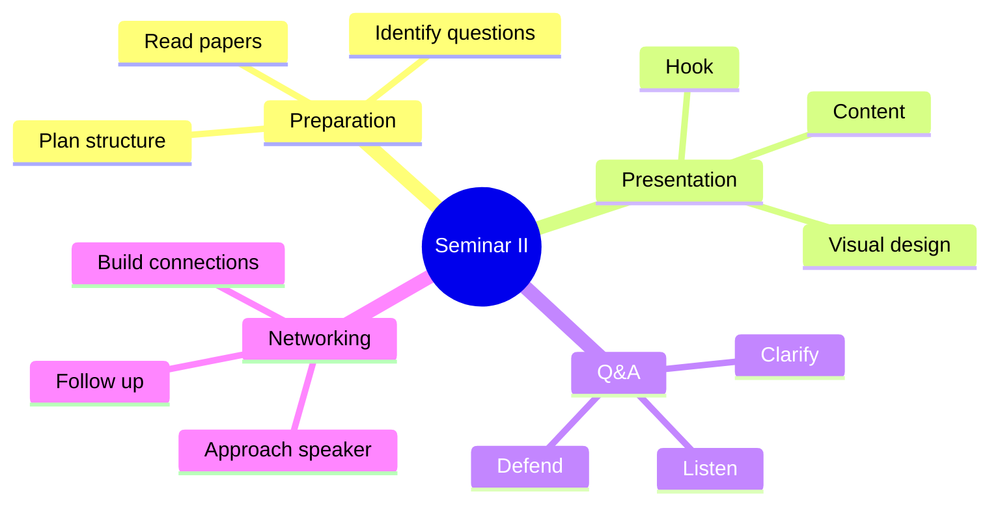
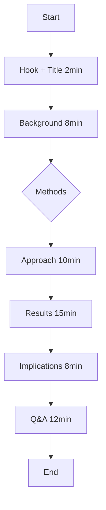
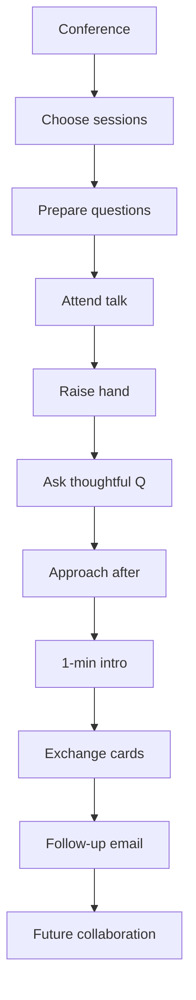
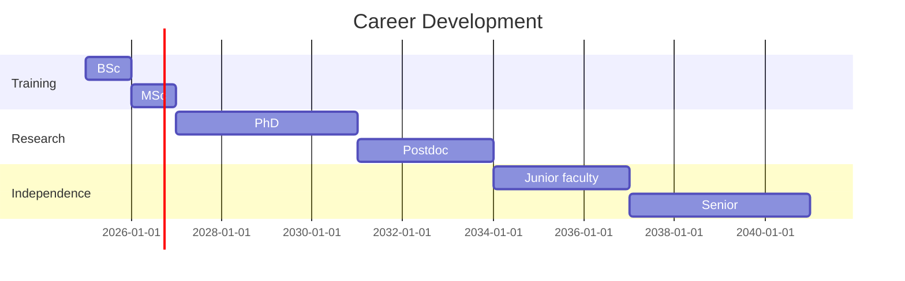

# PHYS 4080 — Physics Seminar II (Advanced)
> **Phase 2 BSc Elective | HKUST PHYS 4080 | Advanced seminar presentations & critical discourse**  
> **Bilingual 深度自學檔案 · 中英對照**

---

## 問題 1：5 個核心心智模型

1. **Scientific discourse = knowledge construction** — 科學話語構建知識 (not passive reception, active construction)
2. **Expert questioning reveals depth** — 專家提問揭示深度 (good questions > good answers)
3. **Literature situates your work** — 文獻定位你的工作 (where does your contribution fit?)
4. **Visual rhetoric persuades** — 視覺說服力 (data visualization, figure design)
5. **Networking accelerates careers** — 社交加速職業發展 (collaboration, job leads, citations)

## 問題 2：3 個根本分歧

1. **Public vs private science**
   - Public: open science, preprint servers, data sharing
   - Private: proprietary research, patents, trade secrets
   - Balance varies by field

2. **Theoretical vs experimental emphasis**
   - Theory: elegant, minimal, predictive
   - Experiment: data-driven, measurement-focused
   - Both essential for physics

3. **Breadth vs depth in seminars**
   - Breadth: overview of field, many topics
   - Depth: deep dive into single result
   - Different audiences need different approaches

## 問題 3：10 個深度問題

1. 給定 50-min seminar, 點樣 structure 達到最大 impact?
2. 解釋為什麼 "state of the art" figure 决定 paper credibility。
3. 為什麼 Q&A session 係 presenter 最緊張的部分?
4. 給定 conflicting data, 點樣 present 平衡的 view?
5. 解釋 為什麼 conference presentation ≠ journal paper structure。
6. 為什麼 30-second "elevator pitch" 對 career networking 關鍵?
7. 給定 complex result, 點樣 design analogy that works?
8. 為什麼 attention span research impacts slide design?
9. 解釋 "significance" vs "novelty" 為什麼唔係 synonyms。
10. 為什麼 follow-up questions after talk 開啟 collaboration?

## 深入 1：Advanced Presentation Architecture
**Deep Dive I**

### The Classic Story Arc
$$Problem \rightarrow Approach \rightarrow Results \rightarrow Implications$$

### 50-Minute Seminar Structure
| Section | Time | Content |
|---|---|---|
| Title/Hook | 2 min | Why should audience care? |
| Background | 8 min | What's known? What's missing? |
| Methods | 15 min | How did you solve it? |
| Results | 15 min | What did you find? |
| Implications | 8 min | Why does it matter? |
| Q&A | 12 min | Discussion |

### The "So What?" Test
Every slide must answer: "Why should the audience care?"

**Engineering implication:** Structure determines whether message lands

## 深入 2：Data Visualization Mastery
**Deep Dive II**

### Figure Design Principles
1. **One message per figure**: 每圖一核心信息
2. **Maximize data-ink ratio**: 去除多餘元素
3. **Color encodes meaning**: 顏色有系統性用途
4. **Avoid chartjunk**: 避免不必要的裝飾

### Common Mistakes
- 3D effects distorts perception
- Pie charts for >3 categories
- Truncated y-axes exaggerate differences
- Too many colors/legend entries

### Physics-Specific Visualization
$$\text{Luminosity } L = 4\pi R^2 \sigma T^4$$
- Scatter: correlation
- Contour: parameter space
- Heatmap: 2D distribution

**Engineering implication:** Good figures communicate; bad figures confuse

## 深入 3：Critical Reading & Review
**Deep Dive III**

### Paper Anatomy
| Section | Purpose | Red Flags |
|---|---|---|
| Abstract | Summary | Missing key numbers |
| Intro | Motivation | Vague gap statements |
| Methods | Reproducibility | Insufficient detail |
| Results | Data | Cherry-picking |
| Discussion | Interpretation | Overclaiming |

### Asking Critical Questions
1. "What would disprove your hypothesis?"
2. "Are the controls adequate?"
3. "Is the sample size sufficient?"
4. "Are the statistics appropriate?"
5. "What assumptions are made?"

### The "But Why?" Test
Keep asking "But why?" until reaching fundamental physics.

**Engineering implication:** Critical reading = better writing

## 深入 4：Conference Networking
**Deep Dive IV**

### Effective Networking
- **Research attendee**: 了解領域動態
- **Ask thoughtful questions**: 展示認真聆聽
- **Follow up within 48h**: Email with specific reference

### The Business Card Test
$$1\ conversation = 1\ follow-up\ email = 1\ future\ collaboration$$

### Building Your Reputation
- Be helpful before asking for help
- Share data/code generously
- Credit others appropriately
- Be gracious in disagreement

### Conference Types
| Type | Audience | Best For |
|---|---|---|
| APS March | Large, broad | Networking, job market |
| Specialized | Small, deep | Collaboration, feedback |
| Invited talks | Field leaders | Visibility |

**Engineering implication:** Your network = your career capital

## 深入 5：Professional Development
**Deep Dive V**

### Career Paths in Physics
| Path | Pros | Cons |
|---|---|---|
| Academia | Freedom, prestige | Uncertainty, low pay |
| National Lab | Stability, resources | Bureaucracy |
| Industry | Pay, impact | Less fundamental |
| Finance/Consulting | High pay | Less physics |

### Building a Research Portfolio
1. **Papers**: Quality > Quantity (top 5 = strong)
2. **Talks**: Diversity of venues (local → international)
3. **Code/Data**: Open availability (GitHub, archives)
4. **Teaching**: Mentoring next generation

### The "2-Year Rule"
- 2 years: Learn field, master methods
- 4 years: First major results
- 6 years: Independent researcher
- 10 years: Field leader

**Engineering implication:** Career planning = strategic choices

## 自測 1：Seminar Structure
**Answer:** Hook (2min) → Background (8) → Methods (15) → Results (15) → Implications (8) → Q&A (12).  
**Engineering implication:** Structure enables clarity

## 自測 2：Figure Credibility
**Answer:** "State of the art" figures show new data, clear axes, appropriate statistics, proper error bars.  
**Engineering implication:** Figures are the paper's face

## 自測 3：Q&A Nerves
**Answer:** Q&A tests true understanding; presenter can't hide gaps in knowledge under polished slides.  
**Engineering implication:** Preparation prevents panic

## 自測 4：Balanced View
**Answer:** Present alternative interpretations, acknowledge limitations, cite conflicting work fairly.  
**Engineering implication:** Credibility requires honesty

## 自測 5：Conference vs Paper
**Answer:** Talk: narrative, visual emphasis, persuasion. Paper: detailed methods, reproducibility, depth.  
**Engineering implication:** Different formats require different approaches

## 自測 6：Elevator Pitch
**Answer:** Problem (10s) + Your approach (10s) + Why it matters (10s) = 30s memorable message.  
**Engineering implication:** First impressions open doors

## 自測 7：Effective Analogy
**Answer:** Map: audience's known → your new concept. Example: "Black holes are like cosmic sinks" but warn of limitations.  
**Engineering implication:** Analogy bridges understanding

## 自測 8：Attention Research
**Answer:** Adults attention: 10-20 min peak. After 20 min: retention drops 50%. Structure accordingly.  
**Engineering implication:** Cognitive science informs design

## 自測 9：Significance vs Novelty
**Answer:** Novelty = new result. Significance = important result. Can be independent.  
**Engineering implication:** Don't overclaim novelty for incremental work

## 自測 10：Follow-up Opens Collaboration
**Answer:** "I was interested in your approach to X..." → "Could we collaborate on Y?" → Future paper.  
**Engineering implication:** Conversations become papers

## 📊 Diagram 1: Seminar Process Map


## 📊 Diagram 2: 50-Min Seminar Flow


## 📊 Diagram 3: Critical Reading Framework
```mermaid
graph TD
    A[Paper] --> B{Abstract}
    B --> C[Catchy claim?}
    C -->|No| D[Red flag]
    C -->|Yes| E[Methods]
    E --> F[Reproducible?]
    F -->|No| D
    F -->|Yes| G[Results]
    G --> H[Statistics OK?]
    H -->|No| D
    H -->|Yes| I[Discussion]
    I --> J[Conclusions justified?]
    J -->|No| D
    J -->|Yes| K[Cite this!]
```

## 📊 Diagram 4: Networking Strategy


## 📊 Diagram 5: Career Timeline


## 深度總結 Deep Insights

1. **Presentation skills are not soft** — they're core scientific competencies
   **演講技巧不是軟技能** — 它們是核心科學能力

2. **Critical reading improves writing** — question other papers, question your own
   **批判性閱讀提升寫作** — 質疑他人論文，質疑自己

3. **Networking compounds over career** — each conversation is a potential future collaborator
   **社交關係長期複利** — 每次對話都可能是未來合作者

4. **Visual communication is universal** — across languages, across disciplines
   **視覺溝通是通用的** — 跨語言，跨學科

5. **Professional development is your responsibility** — no one else will plan your career
   **職業發展是你的責任** — 沒人會為你規劃職業

---

**自學建議**
- 必讀: "Presentation Zen" (Garr Reynolds), "Craft of Scientific Presentations" (Alley)
- 配對: TED talks, conference recordings (e.g., APS, DAMOP)
- 工具: Keynote/PowerPoint, matplotlib/seaborn, LaTeX beamer
- 產出: Deliver 2 seminars (30 min each) with peer feedback
