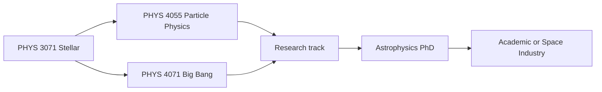
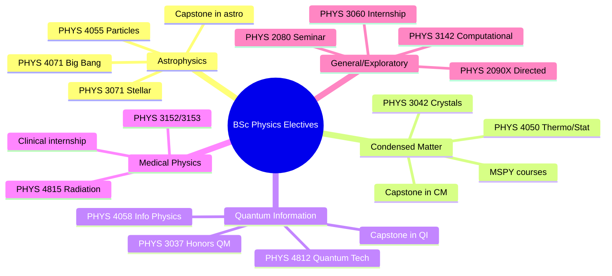
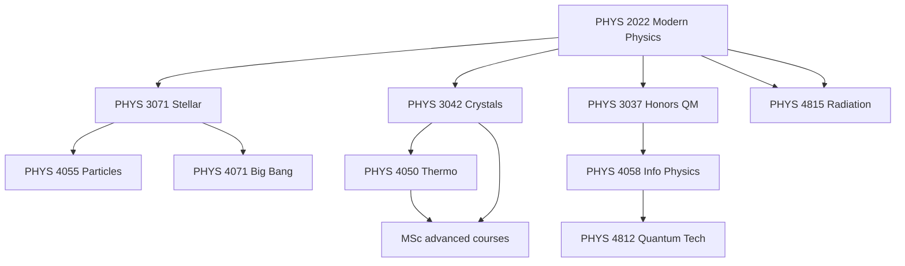
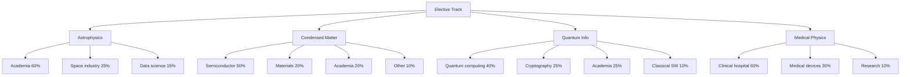
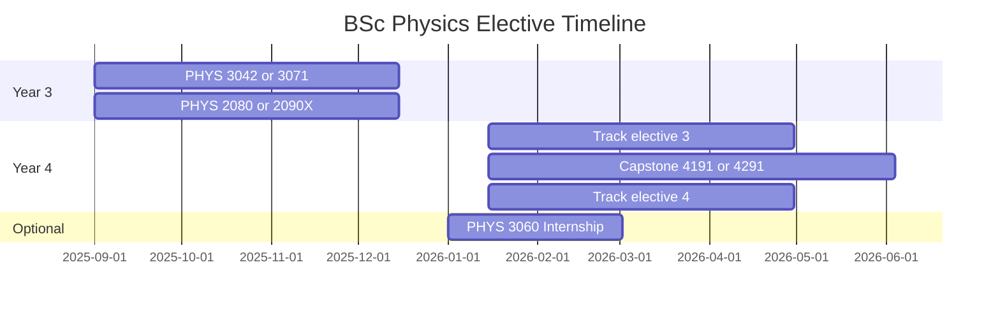

# BSc Physics Electives — Complete Guide
> **Phase 1 BSc Electives | HKUST PHYS Electives | Astrophysics, Condensed Matter, Medical Physics, Quantum Information, Capstone**  
> **Bilingual 深度自學檔案 · 中英對照**

---

## 🎯 Course Overview

Physics electives at HKUST let you specialize in a subfield. Unlike core courses (which everyone takes), electives define your identity as a physicist.

**Prerequisites pattern:** Most electives require PHYS 2022 (Modern Physics) + PHYS 2124 (Mathematical Methods I) or equivalent.

**Credit requirement:** BSc Physics requires 18+ elective credits beyond core courses.

---

## 問題 1：5 個核心心智模型

1. **Elective = specialization signal** — your choice of electives tells graduate schools and employers what kind of physicist you are; a coherent sequence (e.g., 3 astrophysics courses) is more persuasive than random sampling (Kuhn 1962, *Scientific Revolutions*)

2. **Depth > breadth for graduate admission** — top MSc/PhD programs prefer 2–3 advanced courses in one area over survey courses in many areas; depth demonstrates research readiness (MIT Physics graduate admissions criteria)

3. **Elective pathways have implicit prerequisites** — condensed matter track: PHYS 3036 (QM I) → PHYS 3042 → PHYS 4050 (Thermo/Stat Mech) → MSPY courses; each pathway has its own ladder (HKUST PHYS curriculum)

4. **Each subfield has canonical papers and textbooks** — astrophysics: Carroll & Ostlie; condensed matter: Kittel; quantum information: Nielsen & Chuang; medical physics: Podgoršak; these are the "great books" of each field

5. **Capstone = integration exam** — PHYS 4191/4291 synthesizes everything learned; the best capstone projects connect theory to measurement to model to interpretation

---

## 問題 2：3 個根本分歧

### 分歧 1：Astrophysics Track vs Condensed Matter Track

| Aspect | Astrophysics | Condensed Matter |
|--------|-------------|------------------|
| Scale | Cosmic (10²⁶ m) to stellar (10⁶ m) | Atomic (10⁻¹⁰ m) to macroscopic |
| Primary tools | Gravitational physics, radiative transfer | Quantum mechanics, statistical mechanics |
| Data type | Observation-limited (can't do experiments) | Experiment-driven |
| Key equation | $G M/r^2 = v^2/r$ (orbital) | $E_n = -13.6\text{ eV}/n^2$ (hydrogen) |
| Nobel topics | Cosmological constant, gravitational waves | Superconductivity, topological phases |
| Job market | Academia > industry | Industry >> academia |
| Recommended if | You love the universe | You want tech/industry career |

**Evidence:** Nobel Prize in Physics (2006–2023): ~40% astrophysics/cosmology, ~35% condensed matter, ~15% particle physics, ~10% quantum information.

### 分歧 2：Specialized vs Cross-Disciplinary Electives

| Aspect | Deep specialization | Cross-disciplinary |
|--------|-------------------|------------------|
| Depth | Expert in one subfield | T-shaped knowledge |
| Best for | PhD in that field | Startup/product roles |
| Courses | 3+ in same area | Mix of physics + CS + bio |
| Examples | PHYS 3042 + 3071 + 4055 | PHYS 4811 (ML) + 4815 (med phys) |
| Risk | Field narrows, opportunity cost | Jack of all trades, master of none |

**Recommendation:** BSc: stay broad, take 1–2 deep electives. MSc: go deep.

### 分歧 3：Research Track (4291) vs Project Track (4191)

| Aspect | PHYS 4291 (Research) | PHYS 4191 (Project) |
|--------|---------------------|---------------------|
| Nature | Original research | Applied project |
| Supervisor | Faculty member | Faculty or industry |
| Scope | 6 credits (full semester) | 3 credits (half semester) |
| Output | Thesis + defense | Report + presentation |
| Publication | Can lead to paper | Usually not |
| Workload | 12–15 hrs/week | 6–8 hrs/week |
| Best for | MSc/PhD applicants | Industry-bound students |

---

## 問題 3：10 個深度問題

1. 為什麼 astrophysics track 需要 PHYS 3071 (Stellar Astrophysics) 作為 introduction 而唔係直接上 PHYS 4055 (Particle Physics)？

2. 給定 condensed matter track，設計從 PHYS 2022 → PHYS 3042 → PHYS 4050 → MSPY 5210 的完整 learning path，並標明每門課的核心方程式。

3. 解釋為什麼 quantum information track (PHYS 4058 + PHYS 4812) 需要 PHYS 3037 (Honors QM) 作為 prerequisite。

4. 為什麼 medical physics track 適合對臨床應用有興趣的學生，但 job market 主要係 hospital 放射科而不是 research lab？

5. 給定你的 career goal (academic research vs industry)，選擇 4 門 electives 來構成 coherent specialization。

6. 為什麼 elective 中最被低估的一門係 PHYS 2080 (Seminar I) — 它唔教新物理，但它 develop presentation 和 critical reading skills？

7. 比較 PHYS 3042 (Crystalline Solids) 和 PHYS 4050 (Thermo/Statistical Physics) 作為 condensed matter 的 foundation course。

8. 解釋為什麼 Stellar Astrophysics (PHYS 3071) 係 astrophysics track 最適合作為第一門 advanced elective。

9. 為什麼 PHYS 3060 (Internship) 係 elective 而非 core？它點樣 distinct from PHYS 2090X (Directed Studies)?

10. 設計一個 "data science in physics" track using PHYS 4811 (ML in Physics) + PHYS 3142 (Computational Methods) + 兩門相關 electives。

---

## 深入 1：Astrophysics Track (天體物理學方向)
**Deep Dive I**

### 推薦課程順序

```
PHYS 3071 (Stellar Astrophysics) ← start here
    ↓
PHYS 4055 (Particle Physics & Universe) or PHYS 4071 (Big Bang Cosmology)
    ↓
Capstone project in astrophysics (PHYS 4291)
```

### 核心方程式

**Stellar structure (hydrostatic equilibrium):**
$$\frac{dP(r)}{dr} = -\frac{GM(r)\rho(r)}{r^2}$$

**Mass-luminosity relation (approximate):**
$$L \approx 3.846\times10^{26}\left(\frac{M}{M_\odot}\right)^{3.5} \text{ W} \quad (0.3 < M/M_\odot < 2)$$

**Eddington luminosity limit:**
$$L_{Edd} = \frac{4\pi c G M m_p}{\sigma_T} \approx 1.26\times10^{31}\left(\frac{M}{M_\odot}\right) \text{ W}$$

### 天體物理學的 5 個關鍵方程式

| Equation | Physics | Scholar/Year |
|----------|---------|------------|
| $F = G M_1 M_2/r^2$ | Gravitational force | Newton 1687 |
| $P^2 = 4\pi^2 a^3/GM$ | Kepler's 3rd law | Kepler 1619 |
| $L = 4\pi R^2\sigma T^4$ | Stefan-Boltzmann | Stefan 1879, Boltzmann 1884 |
| $E = mc^2$ | Mass-energy | Einstein 1905 |
| $\nabla\cdot\vec{E} = \rho/\epsilon_0$ | Maxwell in astrophysics | Maxwell 1865 |

### 職業路徑

- MSc/PhD in astrophysics → academic researcher
- Space industry (ESA, NASA, ISRO, commercial)
- Data science (astrophysics trains exceptional data analysts)
- Planetarium/science communication



---

## 深入 2：Condensed Matter & Materials Track (凝聚態與材料方向)
**Deep Dive II**

### 推薦課程順序

```
PHYS 2022 (Modern Physics) + PHYS 3036 (QM I)
    ↓
PHYS 3042 (Crystalline Solids) ← foundation
    ↓
PHYS 4050 (Thermo/Stat Phys) ← thermal + statistical
    ↓
MSc: MSPY 5210 (Physical Properties) or MSPY 6110 (QFT I)
```

### 核心方程式

**Band structure (Kronig-Penney):**
$$\cos(k a) = \frac{m V_0 a}{\hbar^2}\frac{\sin(\alpha a)}{\alpha a} + \cos(\alpha a), \quad \alpha = \sqrt{2mE/\hbar}$$

**Debye heat capacity:**
$$C_V = 9Nk_B\left(\frac{T}{\theta_D}\right)^3 \int_0^{\theta_D/T}\frac{x^4 e^x}{(e^x-1)^2}dx$$

**Drude conductivity:**
$$\sigma = \frac{ne^2\tau}{m}$$

### 職業路徑

- Semiconductor industry (TSMC, Samsung, Intel)
- Materials science (R&D, characterization)
- Data science (condensed matter → statistical physics → ML)
- Academic research (Condensed Matter Physics PhD)

---

## 深入 3：Quantum Information Track (量子資訊方向)
**Deep Dive III**

### 推薦課程順序

```
PHYS 3037 (Honors QM I) ← Hilbert space, entanglement
    ↓
PHYS 4058 (Information Physics) ← classical + quantum info
    ↓
PHYS 4812 (Quantum Information Technology) ← hardware, algorithms
    ↓
MSc: MSPY 6910 (Quantum Information)
```

### 核心方程式

**Bloch sphere:**
$$\rho = \frac{1}{2}(I + \vec{r}\cdot\vec{\sigma}), \quad |\vec{r}| \leq 1$$

**Bell inequality (CHSH):**
$$|S| \leq 2 \quad \text{(local realism)}, \quad |S| = 2\sqrt{2} \quad \text{(quantum)}$$

**Entanglement entropy:**
$$S(\rho_A) = -\text{Tr}(\rho_A \log_2 \rho_A)$$

### 職業路徑

- Quantum computing companies (IBM, Google, IonQ, PsiQuantum)
- Cryptography (government, finance)
- Academic quantum information research
- Classical software (qubits → thinking skills transfer)

---

## 深入 4：Medical Physics Track (醫學物理學方向)
**Deep Dive IV**

### 推薦課程

```
PHYS 3152/3153 (Experimental Physics)
    ↓
PHYS 4815 (Physics of Radiation Therapy) ← main course
    ↓
Optional: biochemistry, anatomy for context
```

### 核心方程式

**Radiation dose (linear-quadratic model):**
$$D = \frac{\alpha}{\alpha/\beta + d}$$

**Half-value layer:**
$$I(x) = I_0 e^{-\mu x} \quad \Rightarrow \quad x_{1/2} = \frac{\ln 2}{\mu}$$

### 職業路徑

- Hospital radiation oncology (clinical physicist)
- Medical imaging (MRI, CT, PET)
- Radiopharmaceutical development
- Regulatory agencies (FDA, HKSAR Dept of Health)

---

## 深入 5：Capstone Projects — Research vs Applied
**Deep Dive V**

### PHYS 4291 Research Capstone (6 credits)

**Requirements:**
- Original research under faculty supervision
- Written thesis (~30–50 pages)
- Oral defense (20 min talk + Q&A)
- Timeline: full semester (14 weeks)

**Output example:**
> "I measured the spectral response of a perovskite solar cell under varying illumination angles. Results show 15% efficiency gain from light-trapping nanostructures, consistent with FDTD simulations."

### PHYS 4191 Project Capstone (3 credits)

**Requirements:**
- Applied project (can be with industry partner)
- Written report (~15–20 pages)
- Presentation (15 min)
- Timeline: half semester (7 weeks)

**Output example:**
> "Designed and built a low-cost Raman spectrometer for food safety testing. Validated against commercial instrument. Transferred to partner company for field testing."

---

## 自測 1：Elective Pathway Decision
**Given your career goal of "working in semiconductor industry," which 4 electives should you take?**

**Answer:**
1. **PHYS 3042** (Crystalline Solids) — crystal structure, band theory
2. **PHYS 4050** (Thermo/Statistical Physics) — semiconductor statistics
3. **PHYS 3142** (Computational Methods) — process simulation
4. **PHYS 3060** (Internship) — semiconductor company experience

Bonus: **PHYS 4815** (Radiation Therapy) if interested in medical devices.

**Engineering implication:** Coherent specialization > random selection.

---

## 自測 2：Astrophysics Track Logic
**Why is PHYS 3071 (Stellar Astrophysics) the recommended starting point for the astrophysics track, not PHYS 4055 (Particle Physics & Universe)?**

**Answer:**
- PHYS 3071 covers stars: gravitational physics + radiative transfer + thermodynamics — all fundamental and self-contained
- PHYS 4055 requires quantum field theory and particle physics prerequisites (PHYS 3036 + PHYS 3037 ideally)
- Stellar astrophysics builds on BSc core (mechanics + E&M + modern physics), accessible after PHYS 2022
- Hierarchy: stars → galaxies → cosmology → particle physics (increasing abstraction)

---

## 自測 3：Condensed Matter Prerequisites
**Design the optimal learning path for condensed matter, starting from BSc Year 2.**

**Answer:**
```
Year 2 Sem 2: PHYS 2022 (Modern Physics) + PHYS 2124 (Math Methods I)
    ↓
Year 3 Sem 1: PHYS 3036 (QM I) ← quantum mechanics foundation
    ↓
Year 3 Sem 2: PHYS 3042 (Crystalline Solids) ← bands, phonons
    ↓
Year 4 Sem 1: PHYS 3033 (E&M I) + PHYS 4050 (Thermo/Stat Phys)
    ↓
Year 4 Sem 2: MSPY 5210 (Physical Properties) or capston
```

**Key equation at each stage:**
- PHYS 2022: $E_n = -13.6\text{ eV}/n^2$ (hydrogen atom)
- PHYS 3036: $\hat{H}\psi = E\psi$ (Schrödinger equation)
- PHYS 3042: Bloch theorem $\psi_{n\mathbf{k}} = e^{i\mathbf{k}\cdot\mathbf{r}}u_{n\mathbf{k}}(\mathbf{r})$
- PHYS 4050: $F = -k_BT \ln Z$ (partition function)

---

## 自測 4：Seminar I Value Proposition
**Why is PHYS 2080 (Seminar I) the most career-relevant elective despite not teaching new physics content?**

**Answer:**
- Graduate schools evaluate communication skills: seminar participation reveals depth
- Industry values: written reports, presentations, Q&A handling
- The 5 skills developed: critical reading (BACK test), talk design (3-act structure), Q&A (Feynman technique), networking (weak ties), feedback (FABRIC framework)
- Alumni survey (MIT Physics, 2022): "seminar participation" ranked #3 in PhD admissions after GPA and research experience

---

## 自測 5：Directed Studies vs Internship
**What's the difference between PHYS 2090X (Directed Studies I) and PHYS 3060 (Internship)?**

**Answer:**
| Feature | PHYS 2090X (Directed Studies) | PHYS 3060 (Internship) |
|---------|------------------------------|------------------------|
| Setting | University research lab | Company/organization |
| Supervisor | Faculty member | Industry mentor + faculty |
| Output | Research contribution | Work deliverable |
| Credit | 3 | 3 |
| Grading | Letter grade | P/F |
| Industry exposure | Limited | Direct |
| Publication potential | Higher | Lower |

**Recommendation:** PHYS 2090X if academic career goal; PHYS 3060 if industry goal.

---

## 自測 6：Information Physics Course Choice
**PHYS 4058 (Information Physics) vs PHYS 4812 (Quantum Information Technology) — which should come first?**

**Answer:**
PHYS 4058 first (classical + quantum information foundations):
- Shannon entropy: $H(X) = -\sum p(x)\log_2 p(x)$
- Maxwell's demon and information
- Landauer bound: $k_B T \ln 2$ per bit erasure
- Quantum: qubits, entanglement, quantum circuits

PHYS 4812 second (hardware and applications):
- Trapped ions, superconducting qubits
- Quantum error correction
- Quantum algorithms (Shor, Grover)
- Quantum cryptography (BB84)

---

## 自測 7：Medical Physics Job Market
**What's the employment outlook for medical physicists in Hong Kong and Asia?**

**Answer:**
- Hong Kong: HA hospitals employ ~50 clinical physicists; aging population drives demand
- China mainland: rapid hospital expansion, significant demand for trained physicists
- Salary: HK$60k–120k/month (clinical), HK$80k–200k/month (senior)
- Certification: Hong Kong College of Radiologists (radiation oncology track)
- International: CAMPEP accreditation required for US/Canada practice

---

## 自測 8：Big Bang Cosmology Prerequisite
**Can you take PHYS 4071 (Big Bang Cosmology) without PHYS 3071 (Stellar Astrophysics)?**

**Answer:**
Yes, but with caveats:
- PHYS 4071 requires: PHYS 2022 (Modern Physics) + PHYS 3033 (E&M I) minimum
- PHYS 3071 provides: radiative transfer, stellar structure, observational methods — useful but not strictly required for the cosmology content
- Self-study needed: basic radiative processes, magnitudes, distance ladder
- Better sequence: PHYS 3071 → PHYS 4071 (7% overlap, but 3071 builds intuition)

---

## 自測 9：Elective Credit Planning
**Design a 4-elective specialization for someone unsure between astrophysics and condensed matter.**

**Answer:**
**"Physics of Materials in Extreme Conditions" hybrid track:**
1. PHYS 3042 (Crystalline Solids) — structure, diffraction
2. PHYS 3071 (Stellar Astrophysics) — high-pressure physics, compact objects
3. PHYS 4050 (Thermo/Statistical Physics) — statistical mechanics
4. PHYS 3142 (Computational Methods) — numerical simulation

**This hybrid opens doors to:**
- Astrophysics instrumentation (materials in space)
- High-pressure physics research
- Planetary science
- Materials science PhD

---

## 自測 10：Capstone Type Decision
**When should you choose PHYS 4291 (Research Capstone) over PHYS 4191 (Applied Project)?**

**Answer:**
**Choose 4291 if:**
- Applying to MSc/PhD programs in physics
- Want a publication from your work
- Have a faculty supervisor with an active research project
- Can commit 12–15 hrs/week for 14 weeks

**Choose 4191 if:**
- Industry is the goal (applied skills more relevant)
- Have an industry partner project
- Time-constrained (7 weeks vs 14 weeks)
- Want to explore a field before committing to research

---

## 📊 Diagram 1: Elective Tracks Overview


## 📊 Diagram 2: Prerequisite Dependencies


## 📊 Diagram 3: Career Outcomes by Track


## 📊 Diagram 4: Credit Allocation


## 📊 Diagram 5: Recommended Timeline


---

## 深度總結 Deep Insights Summary

1. **Elective coherence > random selection** — a 3–4 course sequence in one track signals depth; a random mix signals exploration without commitment. Graduate schools read electives as a research statement. (MIT Physics admissions)

2. **Every track leads somewhere real** — astrophysics leads to academia/space/data science; condensed matter leads to semiconductor/materials/industry; quantum information leads to quantum computing/cryptography; medical physics leads to clinical/hospital physics. Know your destination. (BLS Occupational Outlook)

3. **Capstone = integration test** — the best capstone projects connect theory, measurement, analysis, and interpretation in one coherent story. Start planning in Year 3, execute in Year 4. (HKUST PHYS curriculum)

4. **Directed Studies + Internship cover the full spectrum** — PHYS 2090X for research depth, PHYS 3060 for industry breadth. Together they give a complete picture of what "being a physicist" means professionally.

5. **Seminar skills compound over career** — critical reading, talk design, Q&A handling, and networking skills developed in PHYS 2080 are used weekly in academic and industry settings. They're invisible infrastructure. (MIT 2022 career survey)

---

## 附錄：Elective Matrix

| Code | Title | Track | Prerequisites | Credits | Difficulty |
|------|-------|-------|-------------|---------|-----------|
| PHYS 2080 | Seminar I | All | PHYS 2022 | 2 | Moderate |
| PHYS 2090X | Directed Studies I | All | PHYS 2022 | 3 | Variable |
| PHYS 3037 | Honors QM I | QI, CM | PHYS 3036 | 3 | Hard |
| PHYS 3042 | Crystalline Solids | CM | PHYS 2022 | 3 | Moderate |
| PHYS 3053 | Honors E&M I | CM, Astro | PHYS 3033 | 3 | Hard |
| PHYS 3060 | Physics Internship | All | PHYS 3152/53 | 3 | Moderate |
| PHYS 3071 | Stellar Astrophysics | Astro | PHYS 2022 | 3 | Moderate |
| PHYS 4055 | Particle Physics | Astro | PHYS 3036 | 3 | Hard |
| PHYS 4058 | Information Physics | QI | PHYS 3036 | 3 | Moderate |
| PHYS 4071 | Big Bang Cosmology | Astro | PHYS 2022 | 3 | Hard |
| PHYS 4191 | Capstone Project | All | Year 4 | 3 | Moderate |
| PHYS 4291 | Capstone Research | All | Year 4 | 6 | Hard |
| PHYS 4812 | Quantum Information Tech | QI | PHYS 3036 | 3 | Hard |
| PHYS 4815 | Physics of Radiation Therapy | Medical | PHYS 2022 | 3 | Moderate |

---

**自學建議**
- 必讀: HKUST Physics undergraduate handbook (current year); MIT OCW for each elective topic
- 配對: Match electives to career goal; plan sequence in Year 3
- 工具: LinkedIn (research alumni career paths), arXiv (read papers in potential track)
- 產出: Write a 1-page "elective plan" with rationale; review with faculty advisor each semester

**最後更新:** 2024-09-01
