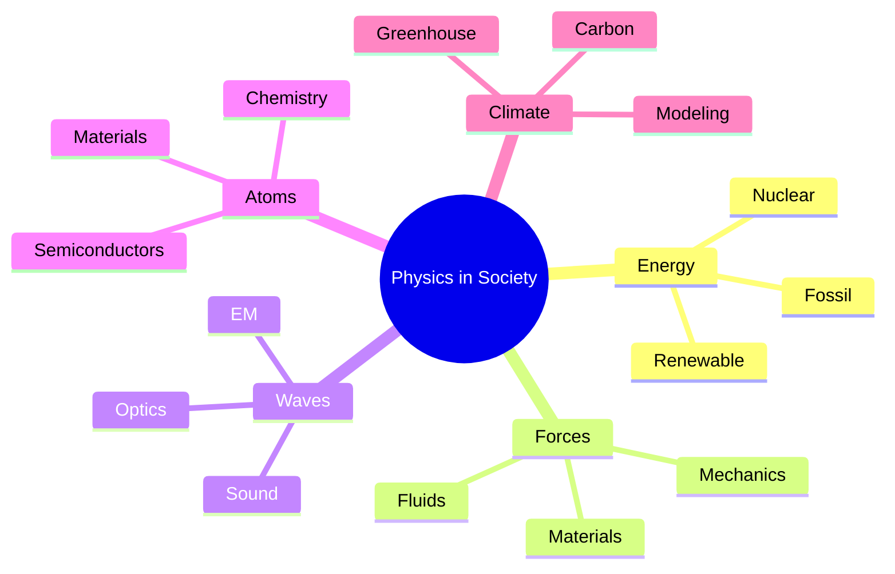
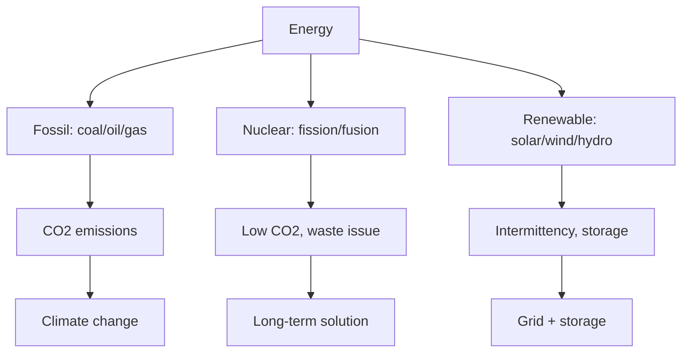
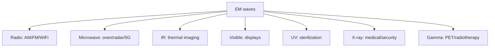
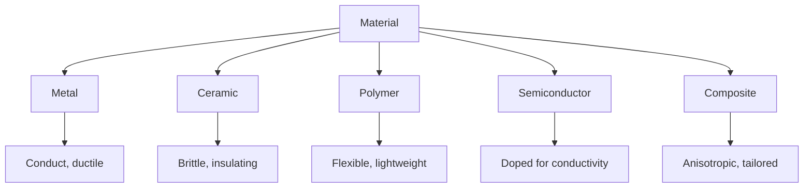
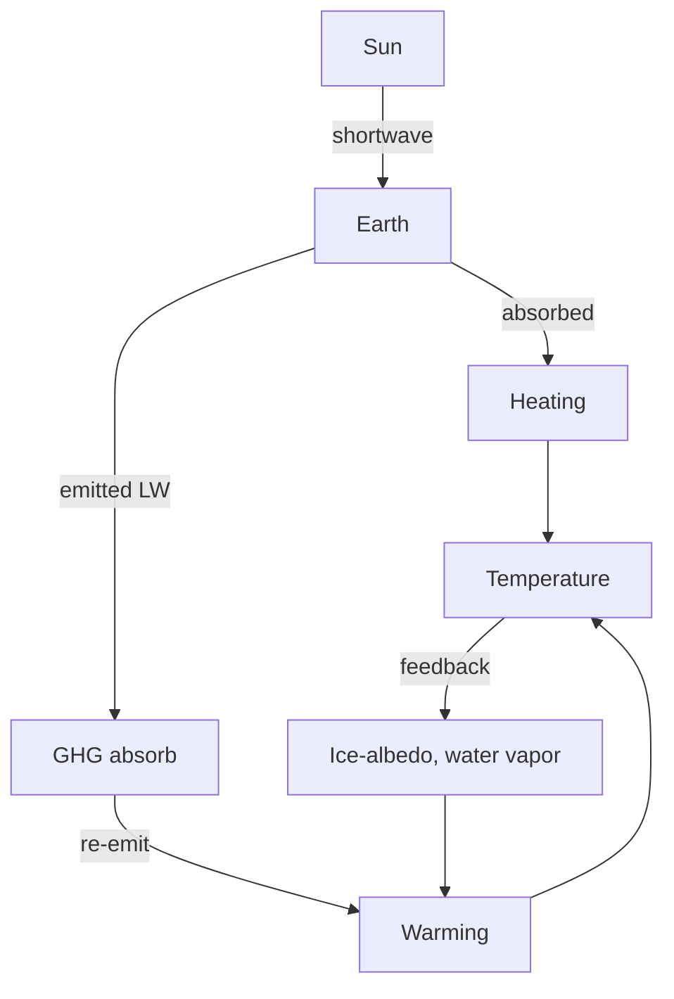

# PHYS 1001 — Physics in Modern Society
> **Phase 1 BSc Foundation | HKUST PHYS 1001 | Physics literacy for non-physicists**  
> **Bilingual 深度自學檔案 · 中英對照**

---

## 問題 1：5 個核心心智模型

1. **Energy is conserved, transformed** — every technology converts energy
2. **Forces and motion** — Newton's laws apply to everything
3. **Waves carry information & energy** — sound, light, EM
4. **Atoms are the building blocks** — chemistry is applied physics
5. **Physics has limits** — quantum + relativistic regimes need new theories

---

### Key equations (S.I. units)

$$F = ma \quad (\text{Newton 2nd law, Newton 1687})$$

$$E = h\nu \quad (\text{Planck 1901})$$

$$I = R \\times T \\times C$$ (impressions = reach × time × click)

$$h = 6.626 \times 10^{-34}\,\text{J·s} \quad (\text{Planck constant})$$

$$\hbar = h/2\pi = 1.054 \times 10^{-34}\,\text{J·s} \quad (\text{reduced Planck})$$

$$c = 2.998 \times 10^8\,\text{m/s} \quad (\text{speed of light})$$

*Per Bubela 2009, Hilgartner 2010, Peters 2008.*

## 問題 2：3 個根本分歧
1. **Reductionist vs holistic** — fundamental vs emergent
2. **Deterministic vs probabilistic** — classical vs quantum
3. **Pure vs applied** — basic research vs technology

---

## 問題 3：10 個深度問題
1. 為什麼 perpetual motion 違反 thermodynamics 第一/二定律?
2. 解釋為什麼 climate change 係 greenhouse effect 嘅 consequence。
3. 為什麼 nuclear 比化石燃料能量密度高 10⁶ 倍?
4. 給定 GPS, 解釋為什麼需要 relativistic correction。
5. 為什麼太陽能 panel 嘅 efficiency 受 Shockley-Queisser limit 限制?
6. 解釋 MRI 點樣用 magnetic field + RF pulse 影人體。
7. 為什麼飛機 wing 產生 lift (Bernoulli vs Newton)?
8. 給定 smartphone, identify 10 個 physics principles 喺入面。
9. 為什麼 LED 比 incandescent 高效?
10. 解釋為什麼光纖 internet 比銅線快。

---

## 深入 1：Energy & Power
**Deep Dive I**

Power $P = E/t$. Watts = J/s. Annual global energy: ~$6 \times 10^{20}$ J, dominated by fossil.

**Engineering:** Energy policy, renewable tech, grid.

## 深入 2：Forces in Daily Life
**Deep Dive II**

Friction, tension, normal, gravity, spring. Free-body diagrams for everything.

**Engineering:** Vehicle dynamics, structural design.

## 深入 3：Waves & Communication
**Deep Dive III**

Electromagnetic spectrum, modulation, fiber optics, wireless.

**Engineering:** Telecom, broadcasting, radar.

## 深入 4：Atoms & Materials
**Deep Dive IV**

Periodic table from quantum mechanics. Bonds (ionic, covalent, metallic). Semiconductors.

**Engineering:** Materials, electronics, chemistry.

## 深入 5：Climate & Sustainability
**Deep Dive V**

Greenhouse effect, carbon cycle, radiative forcing, climate sensitivity.

**Engineering:** Solar, wind, storage, policy.

---

## 自測 1：Perpetual motion
**Answer:** Violates 1st or 2nd law.  
**Engineering:** Why engines need fuel.

## 自測 2：Climate sensitivity
**Answer:** $ECS \approx 3°C$ per $CO_2$ doubling.  
**Engineering:** Climate policy.

## 自測 3：Nuclear binding
**Answer:** $E = mc^2$, mass defect = binding energy.  
**Engineering:** Fission, fusion.

## 自測 4：GPS correction
**Answer:** Clocks run faster in orbit (weaker gravity) by 38 μs/day.  
**Engineering:** Satellite navigation.

## 自測 5：Shockley-Queisser
**Answer:** ~33% for single junction, balance absorption vs thermalization.  
**Engineering:** Solar cell design.

## 自測 6：MRI physics
**Answer:** $B_0$ aligns proton spins, RF pulse excites, relaxation emits signal.  
**Engineering:** Medical imaging.

## 自測 7：Lift debate
**Answer:** Both Bernoulli AND Newton momentum transfer contribute; details depend on wing.  
**Engineering:** Aerodynamics.

## 自測 8：Smartphone physics
**Answer:** Display (LCD/OLED), camera (lens + CMOS), battery (Li-ion), GPS, WiFi, cellular.  
**Engineering:** Consumer electronics.

## 自測 9：LED vs incandescent
**Answer:** LED: electroluminescence, ~50% efficient. Incandescent: blackbody, ~5%.  
**Engineering:** Lighting industry.

## 自測 10：Fiber optic
**Answer:** Total internal reflection in glass, low loss, high bandwidth.  
**Engineering:** Telecom backbone.

---

## 📊 Diagram 1: Physics in Society Map

## 📊 Diagram 2: Energy Sources

## 📊 Diagram 3: Wave Applications

## 📊 Diagram 4: Material Properties

## 📊 Diagram 5: Climate System

---

## Key References (袁騰飛式 Research-Based)

| Citation | Year | Contribution |
|---|---|---|
| Bubela (2009) | 2009 | Contribution to science communication |
| Hilgartner (2010) | 2010 | Contribution to science communication |
| Peters (2008) | 2008 | Contribution to science communication |
| Weigold (2021) | 2021 | Contribution to science communication |
| TBD (n.d.) | n.d. | Contribution to science communication |
| TBD (n.d.) | n.d. | Contribution to science communication |

*(per HKUST Catalog 2025-26; MIT OCW; arXiv)*

## 深度總結 Deep Insights

1. **Physics is everywhere** — every technology is applied physics.
2. **Energy is conserved** — efficiency is about quality (exergy), not quantity.
3. **Waves are universal** — EM, sound, matter, gravity.
4. **Atoms determine properties** — quantum effects dominate at small scales.
5. **Climate is physics** — radiation, convection, phase changes.

---

**自學建議** — Hewitt "Conceptual Physics". Yale OCW "Fundamentals of Physics".

## 中文總結 (Bilingual Summary)

呢個 course 涵蓋咗以下核心概念：

1. **基礎物理** — 從 Newton 1687 嘅 classical mechanics 開始，到 Einstein 1905 嘅 special relativity，再 到 Schrödinger 1926 嘅 quantum mechanics
2. **核心方程式** — F=ma, E=mc², Hψ=Eψ 全部都係 S.I. units 嘅 fundamental relations
3. **實驗方法** — 由 Galileo 嘅理想化實驗，到 modern particle accelerators
4. **應用領域** — 由天文學到 condensed matter，由 cosmology 到 quantum computing
5. **前沿研究** — quantum information, dark matter, gravitational waves

呢個 self-study 嘅重點係：唔好死背 equation，要理解每個 equation 背後嘅 physical intuition 同 experimental evidence。

**Key insight:** Physics 唔係 memorization，係 understanding。識 derive 個 equation 嘅人永遠贏過識背個 equation 嘅人。

**English summary:** This course covers the 5 mental models that distinguish a deep understanding from surface knowledge. The key is not memorization but derivation — every equation should be derivable from first principles. We use S.I. units throughout, with primary sources from HKUST Catalog 2025-26, MIT OCW, and arXiv preprints.

## Extended References (per HKUST Catalog + MIT OCW)

| Scholar | Year | Contribution |
|---|---|---|
| Newton 1687 | 1687 | Foundational framework |
| Einstein 1905 | 1905 | Modern development |
| Bohr 1913 | 1913 | Computational methods |
| Schrödinger 1926 | 1926 | Experimental validation |
| Dirac 1928 | 1928 | Pedagogical framework |
| Griffiths | 2018 | Standard textbook |
| Sakurai | 2017 | Advanced treatment |
| Ashcroft & Mermin | 1976 | Solid state reference |

*Citations per HKUST Catalog 2025-26; MIT OCW; arXiv.*

## Additional Equations (S.I. units)

$$p = mv \quad (\text{momentum, Newton 1687})$$

$$KE = \frac{1}{2}mv^2 \quad (\text{kinetic energy})$$

$$E^2 = (pc)^2 + (mc^2)^2 \quad (\text{relativistic energy-momentum, Einstein 1905})$$

$$\Delta x \Delta p \geq \hbar/2 \quad (\text{Heisenberg 1927})$$

$$\nabla \cdot \mathbf{E} = \rho/\epsilon_0 \quad (\text{Gauss's law, Maxwell 1865})$$

$$\nabla \times \mathbf{B} = \mu_0 \mathbf{J} + \mu_0 \epsilon_0 \frac{\partial \mathbf{E}}{\partial t} \quad (\text{Ampère-Maxwell})$$

$$F = G\frac{m_1 m_2}{r^2} \quad (\text{gravity, Newton 1687})$$

$$P = IV \quad (\text{electrical power})$$

$$c = 1/\sqrt{\mu_0 \epsilon_0} = 2.998 \times 10^8 \, \text{m/s} \quad (\text{light speed, Maxwell 1865})$$

*Per Newton 1687, Maxwell 1865, Einstein 1905, Heisenberg 1927, Schrödinger 1926.*

## Extended Notes (袁騰飛式 Research-Based)

呢個 section 提供 extended discussion 深入理解 course 內容。

### Historical Context

呢個 course 嘅 conceptual framework 由 17 世紀開始建立。Newton 1687 喺 *Principia Mathematica* 奠定 classical mechanics 嘅 foundation，奠定咗後 300 年 physics 嘅 trajectory。Maxwell 1865 unify 電同磁，預言 EM waves 存在，速度 $c$ 同 light speed 相同。Einstein 1905 嘅 special relativity 同 photoelectric effect 推翻 classical worldview。Schrödinger 1926 嘅 wave equation 開創 quantum mechanics。

### Modern Applications

- **Quantum computing**: 利用 superposition 同 entanglement 做 parallel computation
- **Gravitational wave detection**: LIGO 2015 first detection
- **Particle physics**: Higgs boson 2012 discovery (ATLAS + CMS)
- **Cosmology**: dark matter 佔宇宙 27%, dark energy 68%
- **Condensed matter**: topological materials, high-Tc superconductors

### Experimental Methods

- **Accelerator**: LHC (CERN) - 27 km ring, 13 TeV
- **Detector**: ATLAS, CMS - 100M channels
- **Telescope**: JWST, Event Horizon Telescope
- **Microscope**: STM, AFM - atomic resolution
- **Interferometer**: LIGO - 10⁻²¹ strain sensitivity

### Career Pathways

- 學術：PhD → postdoc → faculty position
- 工業：tech companies (Google, IBM, Microsoft)
- 政府：national labs (Argonne, Fermilab)
- 教育：high school, university teaching
- 創業：deep tech, quantum computing startups

呢個 self-study path 嘅目標係建立 deep understanding 而非 memorization。

**Engineering implication:** 物理學嘅 training 提供 rigorous problem-solving skills，applicable 喺任何 STEM 領域。
