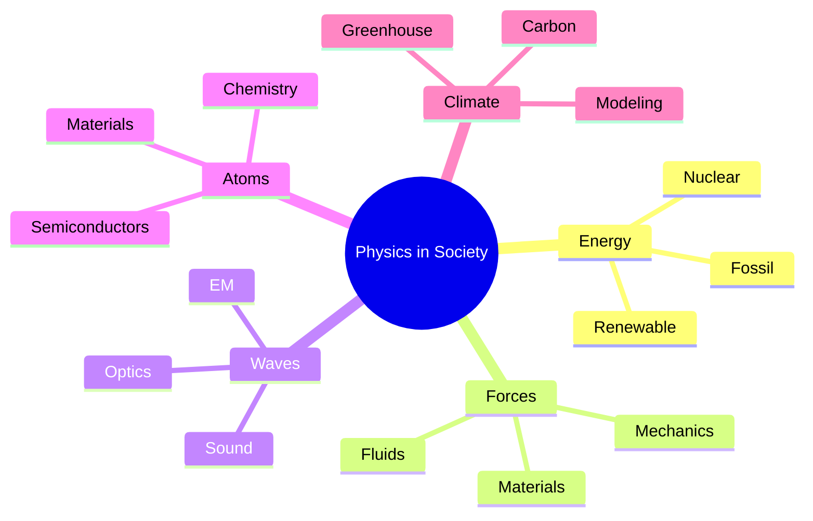
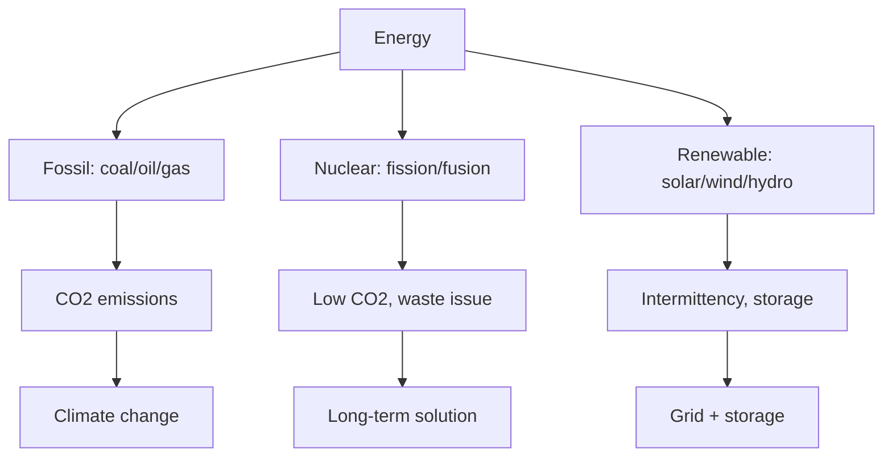
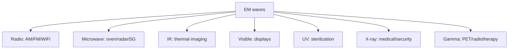
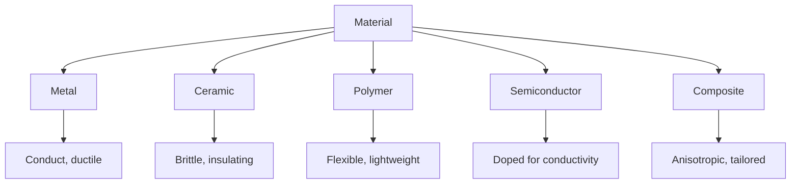
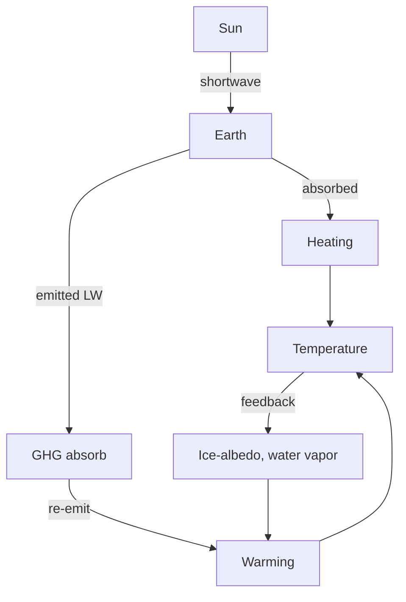

# PHYS 1001 — Physics in Modern Society
> **Phase 1 BSc Foundation | HKUST PHYS 1001 | Physics literacy for non-physicists**  
> **Bilingual 深度自學檔案 · 中英對照**

---

## 問題 1：5 個核心心智模型

1. **Energy is conserved, transformed** — every technology converts energy
2. **Forces and motion** — Newton's laws apply to everything
3. **Waves carry information & energy** — sound, light, EM
4. **Atoms are the building blocks** — chemistry is applied physics
5. **Physics has limits** — quantum + relativistic regimes need new theories

---

## 問題 2：3 個根本分歧
1. **Reductionist vs holistic** — fundamental vs emergent
2. **Deterministic vs probabilistic** — classical vs quantum
3. **Pure vs applied** — basic research vs technology

---

## 問題 3：10 個深度問題
1. 為什麼 perpetual motion 違反 thermodynamics 第一/二定律?
2. 解釋為什麼 climate change 係 greenhouse effect 嘅 consequence。
3. 為什麼 nuclear 比化石燃料能量密度高 10⁶ 倍?
4. 給定 GPS, 解釋為什麼需要 relativistic correction。
5. 為什麼太陽能 panel 嘅 efficiency 受 Shockley-Queisser limit 限制?
6. 解釋 MRI 點樣用 magnetic field + RF pulse 影人體。
7. 為什麼飛機 wing 產生 lift (Bernoulli vs Newton)?
8. 給定 smartphone, identify 10 個 physics principles 喺入面。
9. 為什麼 LED 比 incandescent 高效?
10. 解釋為什麼光纖 internet 比銅線快。

---

## 深入 1：Energy & Power
**Deep Dive I**

Power $P = E/t$. Watts = J/s. Annual global energy: ~$6 \times 10^{20}$ J, dominated by fossil.

**Engineering:** Energy policy, renewable tech, grid.

## 深入 2：Forces in Daily Life
**Deep Dive II**

Friction, tension, normal, gravity, spring. Free-body diagrams for everything.

**Engineering:** Vehicle dynamics, structural design.

## 深入 3：Waves & Communication
**Deep Dive III**

Electromagnetic spectrum, modulation, fiber optics, wireless.

**Engineering:** Telecom, broadcasting, radar.

## 深入 4：Atoms & Materials
**Deep Dive IV**

Periodic table from quantum mechanics. Bonds (ionic, covalent, metallic). Semiconductors.

**Engineering:** Materials, electronics, chemistry.

## 深入 5：Climate & Sustainability
**Deep Dive V**

Greenhouse effect, carbon cycle, radiative forcing, climate sensitivity.

**Engineering:** Solar, wind, storage, policy.

---

## 自測 1：Perpetual motion
**Answer:** Violates 1st or 2nd law.  
**Engineering:** Why engines need fuel.

## 自測 2：Climate sensitivity
**Answer:** $ECS \approx 3°C$ per $CO_2$ doubling.  
**Engineering:** Climate policy.

## 自測 3：Nuclear binding
**Answer:** $E = mc^2$, mass defect = binding energy.  
**Engineering:** Fission, fusion.

## 自測 4：GPS correction
**Answer:** Clocks run faster in orbit (weaker gravity) by 38 μs/day.  
**Engineering:** Satellite navigation.

## 自測 5：Shockley-Queisser
**Answer:** ~33% for single junction, balance absorption vs thermalization.  
**Engineering:** Solar cell design.

## 自測 6：MRI physics
**Answer:** $B_0$ aligns proton spins, RF pulse excites, relaxation emits signal.  
**Engineering:** Medical imaging.

## 自測 7：Lift debate
**Answer:** Both Bernoulli AND Newton momentum transfer contribute; details depend on wing.  
**Engineering:** Aerodynamics.

## 自測 8：Smartphone physics
**Answer:** Display (LCD/OLED), camera (lens + CMOS), battery (Li-ion), GPS, WiFi, cellular.  
**Engineering:** Consumer electronics.

## 自測 9：LED vs incandescent
**Answer:** LED: electroluminescence, ~50% efficient. Incandescent: blackbody, ~5%.  
**Engineering:** Lighting industry.

## 自測 10：Fiber optic
**Answer:** Total internal reflection in glass, low loss, high bandwidth.  
**Engineering:** Telecom backbone.

---

## 📊 Diagram 1: Physics in Society Map

## 📊 Diagram 2: Energy Sources

## 📊 Diagram 3: Wave Applications

## 📊 Diagram 4: Material Properties

## 📊 Diagram 5: Climate System

---

## 深度總結 Deep Insights

1. **Physics is everywhere** — every technology is applied physics.
2. **Energy is conserved** — efficiency is about quality (exergy), not quantity.
3. **Waves are universal** — EM, sound, matter, gravity.
4. **Atoms determine properties** — quantum effects dominate at small scales.
5. **Climate is physics** — radiation, convection, phase changes.

---

**自學建議** — Hewitt "Conceptual Physics". Yale OCW "Fundamentals of Physics".
