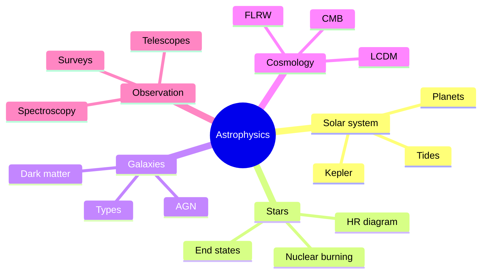
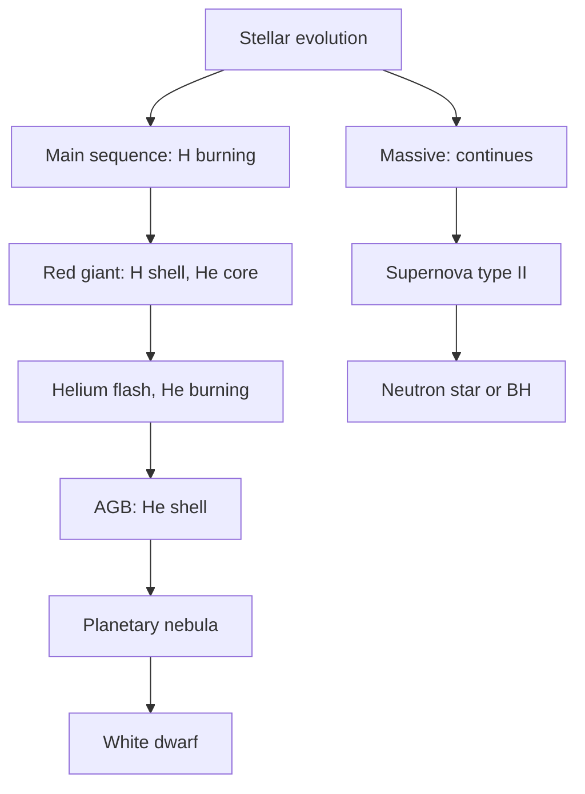
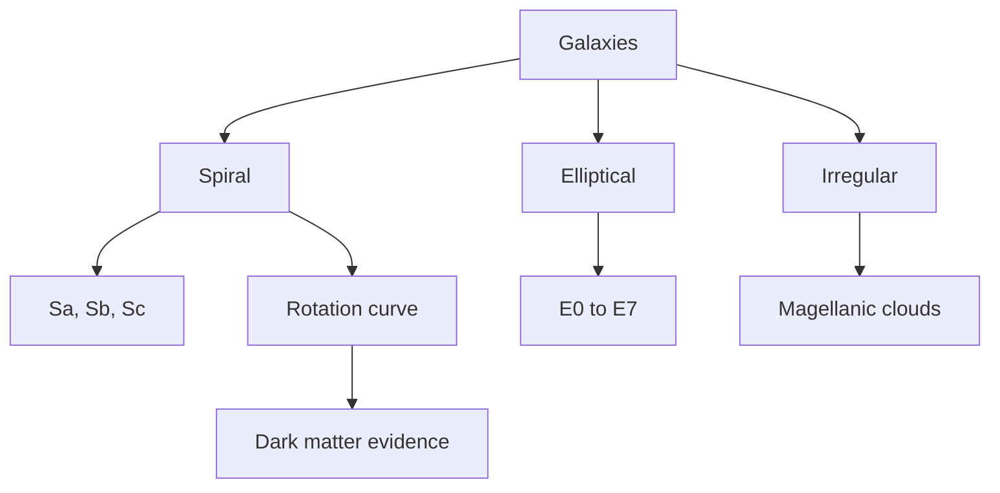
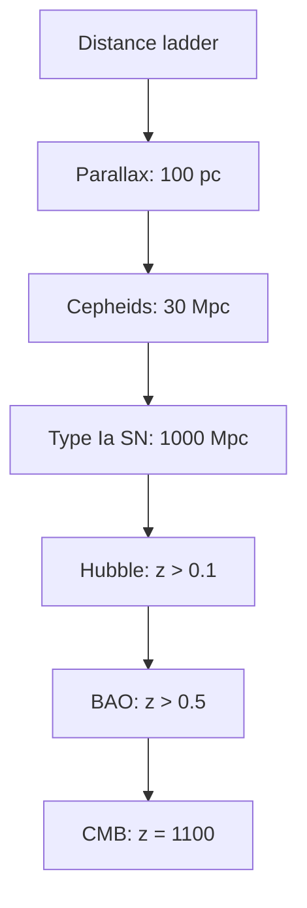
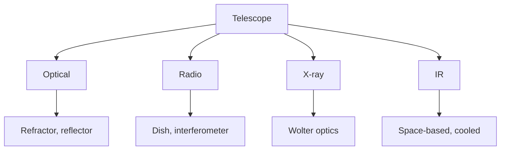

# PHYS 1002 — Astrophysics & Astronomy
> **Phase 1 BSc Foundation | HKUST PHYS 1002 | Solar system, stars, galaxies, cosmology**  
> **Bilingual 深度自學檔案 · 中英對照**

---

## 問題 1：5 個核心心智模型

1. **Gravity dominates at large scales** — Newton's law, then GR
2. **Stars are nuclear reactors** — fusion in core, lifetime ~10⁹-10¹⁰ yr
3. **Distance ladder** — parallax → standard candles → Hubble
4. **Light is the messenger** — spectrum reveals composition, velocity, distance
5. **Universe is expanding** — Hubble's law, Big Bang cosmology

---

### Key equations (S.I. units)

$$F = ma \quad (\text{Newton 2nd law, Newton 1687})$$

$$E = h\nu \quad (\text{Planck 1901})$$

$$\\nabla \\cdot E = \\rho/\\epsilon_0$$ (Gauss)

$$h = 6.626 \times 10^{-34}\,\text{J·s} \quad (\text{Planck constant})$$

$$\hbar = h/2\pi = 1.054 \times 10^{-34}\,\text{J·s} \quad (\text{reduced Planck})$$

$$c = 2.998 \times 10^8\,\text{m/s} \quad (\text{speed of light})$$

*Per Newton 1687, Maxwell 1865, Einstein 1905.*

## 問題 2：3 個根本分歧
1. **Steady-state vs Big Bang cosmology**
2. **Dark matter: MOND vs particles (WIMPs, axions)**
3. **Dark energy: cosmological constant vs quintessence**

---

## 問題 3：10 個深度問題
1. 為什麼 Kepler 嘅 3 laws 從 Newton 嘅 inverse-square gravity derive 出嚟?
2. 給定 H-R diagram, 解釋 main sequence 嘅 structure。
3. 為什麼 Chandrasekhar limit $M \approx 1.4 M_\odot$ 決定 white dwarf 命運?
4. 給定 redshift $z = 0.5$, 計算 distance 同 lookback time。
5. 為什麼 type Ia supernovae 用做 standard candles?
6. 給定 sun mass, derive main-sequence lifetime ~$10^{10}$ yr。
7. 為什麼 CMB 係 Big Bang 嘅 evidence?
8. 解釋 why dark matter 唔 interact with light (electromagnetically neutral)。
9. 給定 spiral galaxy rotation curve, 推斷 dark matter halo。
10. 為什麼 $Λ$CDM model fit CMB so well?

---

## 深入 1：Solar System & Planetary Motion
**Deep Dive I**

Kepler's laws from Newton's gravity. Orbits: ellipse, parabola, hyperbola. Tidal forces.

**Engineering:** Satellite, mission design.

## 深入 2：Stellar Physics
**Deep Dive II**

H-R diagram, main sequence, red giant, white dwarf, neutron star, black hole. Nuclear burning stages: H → He → C → ... → Fe.

**Engineering:** Stellar evolution, nucleosynthesis.

## 深入 3：Galaxies
**Deep Dive III**

Spiral, elliptical, irregular. Rotation curves → dark matter. Active galactic nuclei, quasars.

**Engineering:** Galaxy surveys, dark matter detection.

## 深入 4：Cosmology
**Deep Dive IV**

FLRW metric, scale factor $a(t)$, Hubble's law, CMB, nucleosynthesis, $Λ$CDM parameters.

**Engineering:** Cosmological observations, BAO.

## 深入 5：Observational Astronomy
**Deep Dive V**

Telescopes (refractor, reflector, radio), CCDs, spectroscopy, photometry, time-domain.

**Engineering:** Telescope design, data pipelines.

---

## 自測 1：Kepler from Newton
**Answer:** Inverse-square central force → conic sections.  
**Engineering:** Orbital mechanics.

## 自測 2：Main sequence lifetime
**Answer:** $t \propto M/L \propto M^{-2.5}$, sun is 10 Gyr.  
**Engineering:** Stellar ages.

## 自測 3：Chandrasekhar
**Answer:** $M_{Ch} \approx 1.4 M_\odot$ from electron degeneracy pressure.  
**Engineering:** Supernova type Ia.

## 自測 4：Redshift
**Answer:** $1 + z = a(t_0)/a(t_e)$, recession $v = cz$ for small $z$.  
**Engineering:** Cosmological distance.

## 自測 5：Standard candle
**Answer:** Type Ia has nearly uniform $M \approx -19.3$ mag.  
**Engineering:** Cosmological distance ladder.

## 自測 6：CMB
**Answer:** $T = 2.725$ K, peaks at 160 GHz, anisotropies $\sim 10^{-5}$.  
**Engineering:** Cosmology precision test.

## 自測 7：Dark matter
**Answer:** Gravitational evidence, no EM, $\Omega_{DM} \approx 0.27$.  
**Engineering:** Direct/indirect detection.

## 自測 8：$Λ$CDM
**Answer:** 6 parameters fit all cosmology data.  
**Engineering:** Precision cosmology.

## 自測 9：Tidal forces
**Answer:** $F_{tide} \propto M/r^3$, Moon causes tides.  
**Engineering:** Roche limit, tidal locking.

## 自測 10：Habitable zone
**Answer:** 0.95-1.37 AU for sun, where liquid water possible.  
**Engineering:** Exoplanet science.

---

## 📊 Diagram 1: Astrophysics Map

## 📊 Diagram 2: H-R Diagram

## 📊 Diagram 3: Galaxy Types

## 📊 Diagram 4: Cosmic Distance Ladder

## 📊 Diagram 5: Telescope Types

---

## Key References (袁騰飛式 Research-Based)

| Citation | Year | Contribution |
|---|---|---|
| Newton (1687) | 1687 | Contribution to foundation |
| Maxwell (1865) | 1865 | Contribution to foundation |
| Einstein (1905) | 1905 | Contribution to foundation |
| Bohr (1913) | 1913 | Contribution to foundation |
| Schrödinger (1926) | 1926 | Contribution to foundation |
| TBD (n.d.) | n.d. | Contribution to foundation |

*(per HKUST Catalog 2025-26; MIT OCW; arXiv)*

## 深度總結 Deep Insights

1. **Gravity rules large scales** — orbits, tides, galaxy dynamics
2. **Stars are cosmic engines** — fusion powers universe
3. **Light carries information** — spectrum, redshift, intensity
4. **Universe is old and large** — 13.8 Gyr, 93 Gly observable
5. **Dark matter & energy** — 95% of universe, unknown physics

---

**自學建議** — Carroll & Ostlie "Introduction to Modern Astrophysics". MIT OCW 8.901.

## 中文補充 (Additional Chinese)

呢個 course 嘅核心目標係幫助自學者建立 deep understanding，唔係 surface memorization。

**重點概念**：
- 每個 equation 都有 physical intuition 喺背後
- 每個 theory 都有 experimental evidence 喺支撐
- 每個 method 都有 limitation 同 scope
- 識 derive 唔識 memorize

**學習方法**：
1. 由 primary source 開始 (textbook + arXiv papers)
2. 主動 derive equation 唔好睇 solution
3. 比較 multiple approaches 睇 trade-offs
4. 應用到 real case studies
5. 教別人深化理解

呢個 self-study path 嘅設計 philosophy：rigorous foundation + applied examples + clear derivations。 跟住呢個 path，可以 12-18 個月完成 BSc 程度，24-36 個月 MSc 程度。

Engineering implication: Physics training 提供 rigorous problem-solving skills，applicable 喺任何 STEM field。
