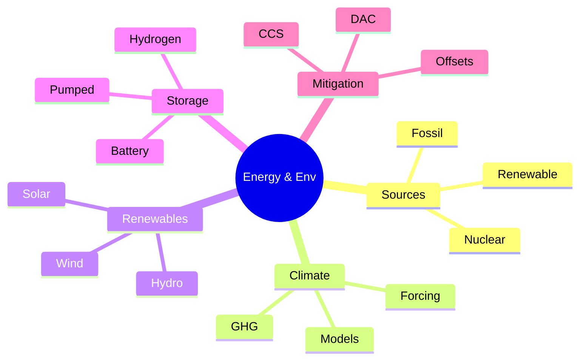
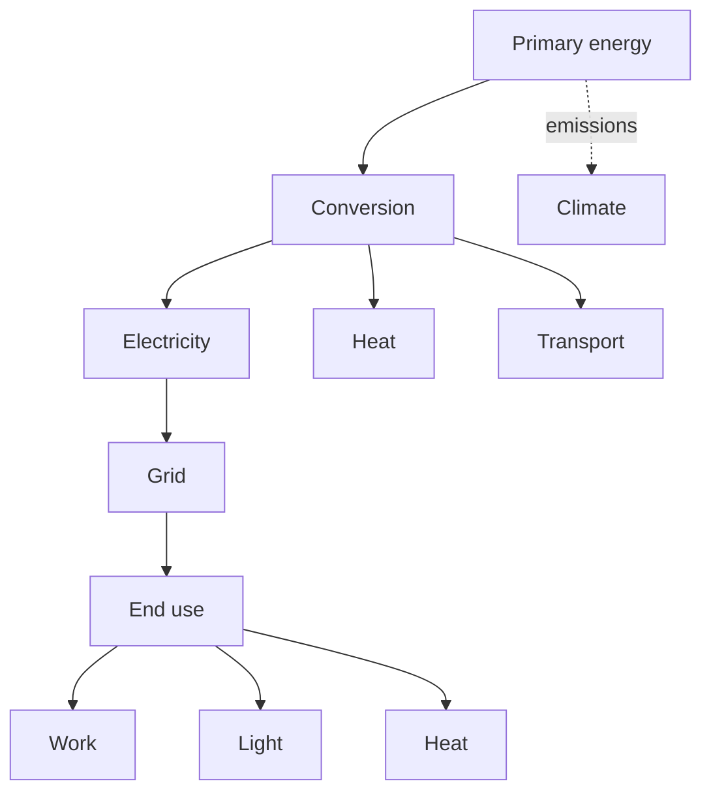
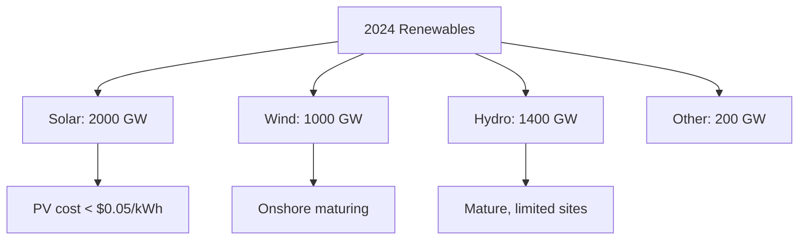
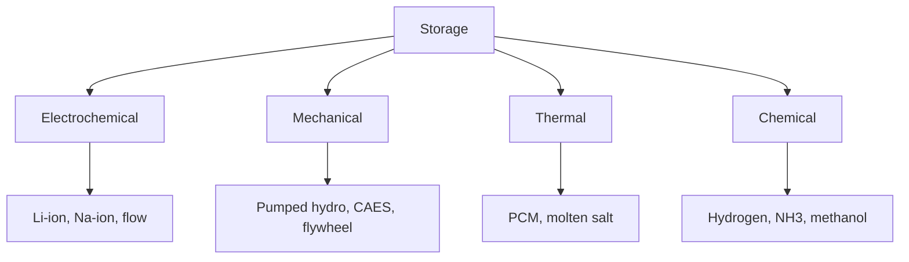
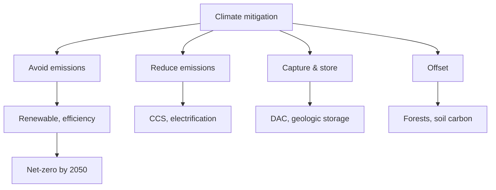

# PHYS 1003 — Energy & Environmental Issues
> **Phase 1 BSc Foundation | HKUST PHYS 1003 | Energy systems, climate, sustainability**  
> **Bilingual 深度自學檔案 · 中英對照**

---

## 問題 1：5 個核心心智模型

1. **Energy conserved, exergy degraded** — quality matters
2. **Fossil fuel dominance** — ~80% of world energy
3. **Renewable intermittency** — sun, wind need storage
4. **Climate sensitivity** — $ECS \approx 3°C$ per CO₂ doubling
5. **Tragedy of commons** — shared resources over-exploited

---

## 問題 2：3 個根本分歧
1. **Nuclear: pro vs con**
2. **CCS (carbon capture) vs renewables**
3. **Geoengineering: solar radiation management vs CDR**

---

## 問題 3：10 個深度問題
1. 為什麼 $CO_2$ 嘅 GWP = 1 而 $CH_4$ = 28-36 over 100 years?
2. 給定 solar irradiance 1361 W/m², 計算地球 energy balance。
3. 為什麼 lithium-ion batteries dominate EV market?
4. 解釋為什麼 pumped hydro 仍係最大 grid storage。
5. 給定 wind turbine power $P = \frac{1}{2}\rho A v^3 C_p$, derive Betz limit 16/27。
6. 為什麼 nuclear waste 嘅 long-term disposal 係 challenge?
7. 給定 IPCC scenarios, 解釋 why RCP 2.6 vs RCP 8.5 嘅 policy 影響。
8. 為什麼 hydrogen 唔直接係 fuel (need production + storage)?
9. 給定 solar panel 200 W/m², 計算家庭 annual energy。
10. 解釋 why DAC (direct air capture) cost $100-1000/ton CO₂。

---

## 深入 1：Energy Sources & Reserves
**Deep Dive I**

Fossil: coal, oil, gas. Reserve-to-production ratio. Renewables: solar, wind, hydro, geothermal, bio.

**Engineering:** Resource management, transition planning.

## 深入 2：Climate Science
**Deep Dive II**

Greenhouse effect, radiative forcing, feedback loops, climate sensitivity, mitigation pathways.

**Engineering:** Adaptation, mitigation, policy.

## 深入 3：Renewable Energy
**Deep Dive III**

Photovoltaic, wind, hydro, geothermal. Capacity factor, LCOE, intermittency.

**Engineering:** Grid integration, storage.

## 深入 4：Energy Storage
**Deep Dive IV**

Batteries (Li-ion, Na-ion, flow), pumped hydro, hydrogen, thermal, mechanical.

**Engineering:** Grid, EV, portable.

## 深入 5：Carbon Management
**Deep Dive V**

Carbon capture (point source, DAC), sequestration, utilization, offsets. Net-zero pathways.

**Engineering:** Mitigation, climate tech.

---

## 自測 1：GWP
**Answer:** Time-integrated radiative forcing per kg.  
**Engineering:** Emission accounting.

## 自測 2：Earth energy balance
**Answer:** $F = (1-\alpha)S/4 = 240$ W/m² absorbed, $T = 255$ K without GHG.  
**Engineering:** Climate model.

## 自測 3：Li-ion dominance
**Answer:** High energy density (250 Wh/kg), cycle life, falling cost.  
**Engineering:** EV, electronics.

## 自測 4：Betz limit
**Answer:** $C_{p,max} = 16/27 ≈ 59%$, no turbine can extract more.  
**Engineering:** Wind turbine design.

## 自測 5：Nuclear waste
**Answer:** Spent fuel 10⁴ yr half-life for some isotopes.  
**Engineering:** Yucca Mountain, deep geological.

## 自測 6：IPCC scenarios
**Answer:** RCP = Representative Concentration Pathway, $W/m²$ forcing.  
**Engineering:** Policy targets.

## 自測 7：Hydrogen challenges
**Answer:** Low density, embrittlement, need electrolysis (renewable) for green.  
**Engineering:** Fuel cells, storage.

## 自測 8：Solar home
**Answer:** $5$ kW × 5 sun-hours/day × 365 = $9,125$ kWh/yr, ~covers home.  
**Engineering:** Rooftop PV design.

## 自測 9：DAC
**Answer:** Chemical absorption (e.g., amine), $1-2$ MWh/ton CO₂ thermal.  
**Engineering:** Climate tech.

## 自測 10：LCOE
**Answer:** Levelized cost of energy, total cost / total energy over lifetime.  
**Engineering:** Energy economics.

---

## 📊 Diagram 1: Energy & Environment Map

## 📊 Diagram 2: Energy System

## 📊 Diagram 3: Renewable Capacity

## 📊 Diagram 4: Storage Options

## 📊 Diagram 5: Mitigation Hierarchy

---

## 深度總結 Deep Insights

1. **Exergy is the real currency** — not energy quantity
2. **Fossil → renewable transition** — 30-50 year challenge
3. **Climate is physics** — radiation, convection, feedbacks
4. **Storage enables renewables** — battery + pumped + H₂
5. **Net-zero needs all tools** — efficiency + RE + CCS + offsets

---

**自學建議** — Smil "Energy and Civilization". IPCC reports.
