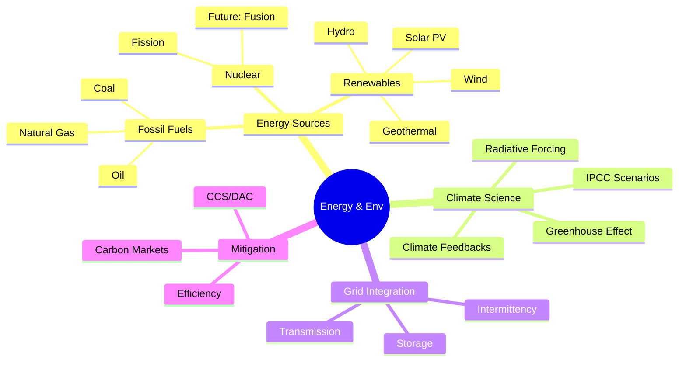
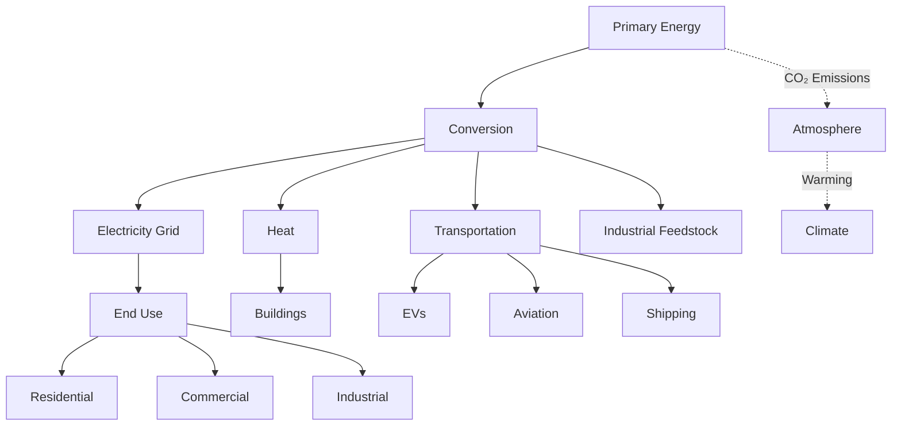
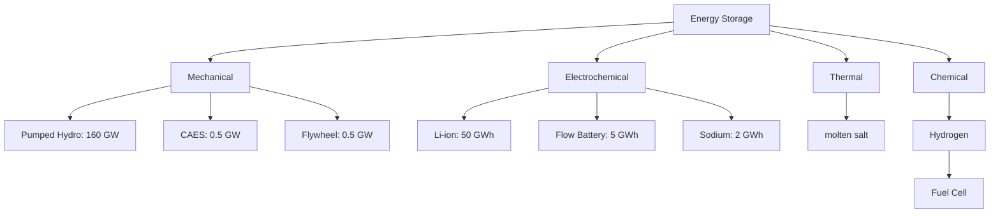
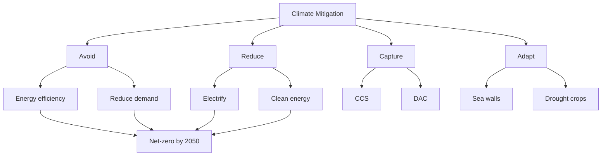

# PHYS 1003 — Energy & Environmental Issues
> **Phase 1 BSc Foundation | HKUST PHYS 1003 | Energy systems, climate science, sustainability physics**  
> **Bilingual 深度自學檔案 · 中英對照**

---

## 問題 1：5 個核心心智模型

1. **Energy quality matters, not just quantity** — 能量品質比數量更重要
   - First law: energy conserved; Second law: exergy (work capacity) degraded
   - Carnot efficiency: $\eta = 1 - T_C/T_H$ limits heat engines
   - Real systems: 30-40% typical efficiency vs 90%+ for electric motors

2. **Fossil fuels dominate but transition is accelerating** — 化石燃料主導但轉型加速
   - Global primary energy: ~80% fossil (coal 26%, oil 31%, gas 23%)
   - Renewables grew 12% in 2023, now ~30% of electricity generation
   - Solar LCOE dropped from $0.45/kWh (2010) to $0.06/kWh (2023)

3. **Intermittency is the key renewable challenge** — 間歇性是可再生能源的關鍵挑戰
   - Solar: 10-25% capacity factor (clouds, night)
   - Wind: 25-45% capacity factor (location-dependent)
   - Grid requires storage or backup for >80% renewable penetration

4. **Climate sensitivity is ~3°C per CO₂ doubling** — 氣候敏感度約為每CO₂加倍3°C
   - Equilibrium Climate Sensitivity (ECS): $2.5-4.0°C$ (IPCC likely range)
   - Forcing: $\Delta F = 5.35 \ln(C/C_0)$ W/m²
   - Current warming: +1.1°C from preindustrial, +50 ppmv CO₂

5. **Tragedy of commons in shared resources** — 公共資源的悲劇
   - Atmospheric CO₂: global externality, no property rights
   - Overfishing, groundwater depletion, forest loss
   - Solutions: carbon pricing, regulations, property rights

---

## 問題 2：3 個根本分歧

### 分歧 1：Nuclear Energy: Essential vs Dangerous
| Aspect | Pro-Nuclear | Anti-Nuclear |
|--------|-------------|--------------|
| Safety | <0.01 deaths/TWh (wind: 0.04, coal: 25) | Chernobyl, Fukushima legacy |
| Waste | Repository in deep geological storage | 10,000+ year containment needed |
| Cost | $60-100/MWh (overnight) | $150-200/MWh (latest plants) |
| Proponents | IPCC SR15, Bill Gates | Germany post-Fukushima |

**Evidence:**
- IAEA: 14,000 cancer deaths/year from Chernobyl 500km radius
- WHO: 0.04 deaths/TWh for nuclear (vs 24.6 for coal)
- France: 75% nuclear electricity, €20/ton carbon

### 分歧 2：Carbon Capture vs Renewable Acceleration
| Approach | Carbon Capture & Storage (CCS) | Renewable Acceleration |
|----------|-------------------------------|----------------------|
| Scale | 10-100 Mt CO₂/yr by 2030 | 10,000+ Mt CO₂/yr avoided |
| Cost | $50-100/ton (direct air) | $10-50/ton (solar/wind) |
| Lock-in | Extends fossil fuel use | Displaces fossil fuels |
| Proponents | ExxonMobil, some academics | IEA Net Zero, Sierra Club |

### 分歧 3：Solar Radiation Management vs Carbon Dioxide Removal
| Approach | SRM (Solar Geoengineering) | CDR (Carbon Dioxide Removal) |
|----------|---------------------------|---------------------------|
| Mechanism | Reflects sunlight (~1% less) | Removes CO₂ from atmosphere |
| Speed | Days to months | Years to decades |
| Cost | $1-10 billion/yr global | $100-1000/ton CO₂ |
| Risks | Termination shock, ozone, governance | Energy-intensive, storage |

---

## 問題 3：10 個深度問題

1. **GWP Calculation**: 給定 CO₂ GWP = 1 over 100 years, derive CH₄ GWP = 28-36
   - CH₄ lifetime: 12.4 years vs 100+ years for CO₂
   - 100-year GWP = $\int_0^{100} F(t)dt / \int_0^{100} F_{CO2}(t)dt$
   - Include indirect effects: ozone, water vapor

2. **Earth Energy Balance**: 給定 solar irradiance $S_0 = 1361$ W/m²
   - Bond albedo: $\alpha = 0.306$
   - Incoming: $(1-\alpha)S_0/4 = 1361 \times 0.694/4 = 236$ W/m²
   - Without GHG: $T = 255$ K (radiative equilibrium)
   - Observed: $T = 288$ K → GHG warming +33 K

3. **Battery Dominance**: 為什麼 Li-ion dominates EV market?
   - Energy density: 250-300 Wh/kg (vs 100 Wh/kg lead-acid)
   - Cycle life: 2000-5000 cycles (vs 500 for lead-acid)
   - Cost dropped: $1200/kWh (2010) → $130/kWh (2023)
   - Round-trip efficiency: 90-95%

4. **Pumped Hydro Dominance**: 為什麼仍是最大 grid storage
   - Global capacity: 160 GW (93% of storage)
   - Energy: 9,000 GWh (duration: 6-20 hours)
   - Cost: $50-150/kWh (levelized)
   - Limitation: geography, environmental impact

5. **Betz Limit Derivation**: 給定 wind power $P = \frac{1}{2}\rho A v^3 C_p$, derive $C_{p,max} = 16/27 \approx 59\%$
   - Momentum theory: upstream velocity $v$, downstream $v'$
   - Mass flow: $\dot{m} = \rho A v(1-a)$ where $a$ = induction factor
   - Power extracted: $P = 2\rho A v^3 a(1-a)^2$
   - Maximize: $dP/da = 0$ → $a = 1/3$ → $C_{p,max} = 16/27$

6. **Nuclear Waste Challenge**: 為什麼 long-term disposal 是 challenge
   - Spent fuel: 3-4% fission products (highly radioactive), 95% uranium
   - Half-lives: I-131 (8 days), Cs-137 (30 yr), Pu-239 (24,000 yr)
   - Heat generation: 10 kW/tonne initially, decays over centuries
   - Repository: Yucca Mountain (US) studied 30+ years, unopened

7. **IPCC RCP Scenarios**: 給定 Representative Concentration Pathways
   | Scenario | Radiative Forcing (2100) | CO₂eq (ppm) | Temp Rise |
   |----------|--------------------------|--------------|-----------|
   | RCP 2.6 | 2.6 W/m² | 450 | +1.5°C |
   | RCP 4.5 | 4.5 W/m² | 650 | +2°C |
   | RCP 6.0 | 6.0 W/m² | 850 | +2.5°C |
   | RCP 8.5 | 8.5 W/m² | 1300 | +4°C |

8. **Hydrogen Challenges**: 為什麼 hydrogen 不是直接 fuel
   - Production: 96% from fossil (grey H₂), 4% electrolytic (green H₂)
   - Electrolyzer efficiency: 60-80% (PEM: 70%, alkaline: 80%)
   - Storage: 700 bar compressed ($15 kWh/kg$) or cryogenic ($20 kWh/kg$)
   - Energy density by volume: 3x lower than natural gas

9. **Solar Home Calculation**: 給定 5 kW system, 5 sun-hours/day
   - Daily output: $5 \text{ kW} \times 5 \text{ hr} = 25$ kWh/day
   - Annual output: $25 \times 365 = 9,125$ kWh/yr
   - Typical US home: 10,000 kWh/yr → system covers ~90%
   - Rooftop area needed: ~400 sq ft (37 m²)

10. **DAC Cost Analysis**: 為什麼 direct air capture costs $100-1000/ton CO₂
    - Energy requirement: 1.5-2.5 MWh thermal + 0.3 MWh electricity per tonne
    - Sorbent chemistry: amine-functionalized solids or liquid solvents
    - Climeworks Orca (Iceland): $1000/ton (2023), target: $300 by 2030
    - Comparison: carbon price needed to incentivize: >$100/ton

---

## 深入 1：Energy Sources & Reserves
**Deep Dive I**

### Fossil Fuel Physics
**地質燃料物理**

Coal formation: photosynthesis → peat → lignite → bituminous → anthracite (millions of years)

Energy density by fuel:
| Fuel | MJ/kg | kWh/kg |
|------|-------|--------|
| Anthracite | 34 | 9.4 |
| Crude oil | 44 | 12.2 |
| Natural gas | 54 | 15.0 |
| Uranium (nuclear) | 82,000,000 | 22,800,000 |

**Reserve-to-Ratio (R/P ratio)**:
- Oil: 50 years at current production
- Gas: 55 years at current production
- Coal: 300+ years at current production

**Engineering:** Resource economics, energy security, energy transition planning

### Renewable Energy Physics
**可再生能源物理**

Solar resource:
$$E_{solar} = S_0 \times \text{capacity factor} \times \text{hours/year}$$

Solar spectrum: AM1.5 global (1000 W/m²) vs direct (900 W/m²)

Wind power physics:
$$P = \frac{1}{2}\rho A v^3 C_p \eta_{gen}\eta_{drive}$$

Key parameters:
- Air density: $\rho = 1.225$ kg/m³ at sea level
- Betz limit: $C_{p,max} = 16/27 \approx 59\%$
- Modern turbines: $C_p = 35-45\%$

Hydropower: $P = \eta \rho g Q H$
- Global capacity: 1390 GW (2023)
- Efficiency: 85-95%
- Run-of-river: minimal storage, depends on flow

Geothermal: $T_{gradient} \approx 25-30°C/km$
- High-grade: volcanic areas, $T > 200°C$
- Enhanced geothermal: engineered reservoirs

**Engineering:** Grid integration, energy storage, renewable dispatch

---

## 深入 2：Climate Science
**Deep Dive II**

### Greenhouse Effect Physics
**溫室效應物理**

Radiative forcing equation:
$$\Delta F = 5.35 \ln\left(\frac{C}{C_0}\right) \text{ W/m²}$$

Where $C_0 = 278$ ppm (preindustrial)

Temperature response:
$$\Delta T = \lambda \Delta F$$

Where climate sensitivity parameter $\lambda \approx 0.8$ K/(W/m²)

ECS (Equilibrium Climate Sensitivity):
$$\Delta T_{2xCO_2} = ECS \approx 3°C \pm 1°C$$

### Key Feedback Loops
**關鍵反饋循環**

| Feedback | Amplification | Time Scale |
|----------|--------------|------------|
| Water vapor | +1.5-2.0 W/m²/K | Days |
| Ice-albedo | +0.3 W/m²/K | Decades |
| Cloud | ±0.5 W/m²/K | Hours-Days |
| Permafrost CH₄ | +0.1-0.4 W/m²/K | Centuries |

### Observed Climate Change
**觀測到的氣候變化**

| Variable | Observation |
|----------|-------------|
| Global temp | +1.1°C since 1880 |
| Sea level | +20 cm since 1900, +3.6 mm/yr |
| Ice extent | -13%/decade (Arctic summer) |
| CO₂ | 421 ppm (2023) vs 280 ppm (preindustrial) |
| Ocean heat | +380 ZJ since 1990 |

**Engineering:** Climate modeling, adaptation, mitigation policy

---

## 深入 3：Renewable Energy Technology
**Deep Dive III**

### Photovoltaic Physics
**光伏物理**

Solar cell efficiency limits:
$$\eta = \eta_{abs} \times \eta_{sep} \times \eta_{col} \times \eta_{oc}$$

Shockley-Queisser limit (single junction Si):
$$\eta_{SQ} = 29\%$$

Multi-junction cells: 47% (6-junction, concentrator)

Current commercial efficiencies:
| Technology | Efficiency | Cost ($/W) |
|------------|------------|------------|
| Monocrystalline Si | 22-26% | $0.20-0.25 |
| Polycrystalline Si | 18-22% | $0.15-0.20 |
| CdTe | 18-22% | $0.20 |
| Perovskite/Si | 29-33% | TBD |

### Wind Turbine Engineering
**風力渦輪工程**

Modern turbine characteristics:
- Hub height: 80-120 m
- Rotor diameter: 100-170 m
- Rated power: 3-15 MW (offshore: up to 15 MW)
- Cut-in wind: 3-4 m/s
- Rated wind: 11-14 m/s
- Cut-out wind: 25 m/s

Capacity factor by type:
| Type | Capacity Factor |
|------|----------------|
| Onshore wind | 25-45% |
| Offshore wind | 40-55% |
| Solar PV | 10-25% |
| Hydro (dam) | 30-60% |

**Engineering:** Grid integration, storage, renewable dispatch

---

## 深入 4：Energy Storage
**Deep Dive IV**

### Battery Physics
**電池物理**

Li-ion cell chemistry:
$$\text{Anode: } LiC_6 \rightleftharpoons C_6 + Li^+ + e^-$$
$$\text{Cathode: } CoO_2 + Li^+ + e^- \rightleftharpoons LiCoO_2$$

Key metrics:
| Metric | Value |
|--------|-------|
| Energy density | 150-250 Wh/kg (cell level) |
| Power density | 250-340 W/kg |
| Cycle life | 2000-5000 cycles (80% capacity) |
| Round-trip efficiency | 85-95% |
| Self-discharge | 2-5%/month |

### Grid Storage Comparison
**電網儲能比較**

| Technology | Energy (GWh) | Duration | Response | Cost |
|------------|-------------|----------|----------|------|
| Pumped hydro | 9,000 | 6-20 hr | Minutes | $50-150/kWh |
| Li-ion | 50 | 1-4 hr | ms | $200-400/kWh |
| Flow batteries | 5 | 4-12 hr | ms | $300-600/kWh |
| Compressed air | 1 | 4-8 hr | Minutes | $100-200/kWh |
| Hydrogen | TBD | Days-weeks | Seconds | $10-20/kg H₂ |

### Hydrogen Storage
**氫氣儲存**

$$E_{hydrogen} = 33.3 \text{ kWh/kg} = 3 \text{ kWh/m³ (at 700 bar)}$$

Pathways:
- Grey H₂: Steam methane reforming, $10-15 kg CO₂/kg H₂$
- Blue H₂: CCS added, $2-4 kg CO₂/kg H₂$
- Green H₂: Electrolysis, $50-60 kWh/kg H₂$

**Engineering:** Grid services, EV range, industrial feedstocks

---

## 深入 5：Carbon Management
**Deep Dive V**

### Carbon Capture Technologies
**碳捕集技術**

Point source capture:
- Post-combustion: $90-95%$ capture, $2.5-3.5$ GJ/tonne CO₂
- Pre-combustion: IGCC plants, $85-90%$ capture
- Oxy-fuel: $95-99%$ capture, $2.0-2.5$ GJ/tonne CO₂

Direct Air Capture (DAC):
- Liquid solvent: 1-4 MWh/tonne CO₂ (thermal energy)
- Solid sorbent: 1.5-3 MWh/tonne CO₂
- Current cost: $300-1000/tonne CO₂
- 2023 capacity: <0.01 MtCO₂/yr

### Sequestration
**封存**

Geological storage:
- Capacity: 10,000+ GtCO₂ (theoretical), 1,000+ GtCO₂ (practical)
- Injection rate: 1-10 MtCO₂/well/year
- Monitoring: seismic, wellhead pressure, tracers

Enhanced oil recovery (EOR):
- CO₂ used to produce oil
- 60-70% CO₂ recycled, 30-40% stored
- Economic incentive for storage

### Carbon Budget
**碳預算**

Remaining budget (50% chance 1.5°C):
$$B_{1.5°C} \approx 400 \text{ GtCO}_2 \text{ from 2020}$$

At current emissions: ~37 GtCO₂/year
$$t_{remaining} = 400/37 \approx 11 \text{ years}$$

**Engineering:** Climate mitigation, negative emissions, carbon markets

---

## 自測 1：GWP (Global Warming Potential)
**Answer:** Time-integrated radiative forcing per unit mass, relative to CO₂.  
$$GWP_{CH4} = \frac{\int_0^{100} F_{CH4}(t)dt}{\int_0^{100} F_{CO2}(t)dt} = 28-36 \text{ (100-yr)}$$

**Engineering:** Emission accounting, carbon markets

---

## 自測 2：Earth Energy Balance
**Answer:** Incoming: $(1-\alpha)S_0/4 = 240$ W/m². Without GHG: $T = 255$ K. With GHG: $T = 288$ K. Greenhouse warming: $\Delta T = 33$ K.

**Engineering:** Climate modeling, radiative forcing

---

## 自測 3：Li-ion Dominance
**Answer:** High energy density (250 Wh/kg), long cycle life (2000+ cycles), falling cost ($130/kWh in 2023), high round-trip efficiency (90-95%).

**Engineering:** EV design, consumer electronics, grid storage

---

## 自測 4：Betz Limit
**Answer:** $C_{p,max} = 16/27 \approx 59\%$. Derived from momentum theory with induction factor $a = 1/3$. Modern turbines: $35-45\%$ due to practical limitations.

**Engineering:** Wind turbine design optimization

---

## 自測 5：Nuclear Waste
**Answer:** Spent fuel contains fission products (Cs-137: 30 yr, Pu-239: 24,000 yr half-life). Heat generation and radioactivity require 10,000+ year containment. Yucca Mountain design: multiple barriers, 300 m deep volcanic rock.

**Engineering:** Repository design, waste management policy

---

## 自測 6：IPCC Scenarios
**Answer:** RCP = Representative Concentration Pathway, defined by W/m² forcing at 2100. RCP 2.6 requires net-zero by 2050, aggressive mitigation. RCP 8.5: business as usual, +4°C by 2100.

**Engineering:** Policy targets, climate modeling

---

## 自測 7：Hydrogen Challenges
**Answer:** Low volumetric energy density (3x lower than natural gas), requires compression (700 bar) or liquefaction (20 K). Production from electrolysis: 50-60 kWh/kg H₂. Storage: embrittlement, permeation.

**Engineering:** Fuel cells, storage tanks, hydrogen economy

---

## 自測 8：Solar Home
**Answer:** $5$ kW × $5$ sun-hours/day × $365$ days = $9,125$ kWh/yr. Typical US home: 10,000 kWh/yr. System covers ~90% of needs. Requires ~400 sq ft roof space.

**Engineering:** Rooftop PV design, net metering

---

## 自測 9：DAC (Direct Air Capture)
**Answer:** Chemical absorption using amine solvents or solid sorbents. Energy: $1.5-4$ MWh/tonne CO₂. Current cost: $300-1000/tonne. Climeworks plant: 4000 tonnes/yr capacity in Iceland.

**Engineering:** Climate tech, negative emissions

---

## 自測 10：LCOE (Levelized Cost of Energy)
**Answer:** Total lifetime cost / total lifetime energy output:  
$$LCOE = \frac{\sum_t \frac{C_t + O\&M_t}{(1+r)^t}}{\sum_t \frac{E_t}{(1+r)^t}}$$

Solar: $0.06-0.15/kWh (2023), Wind: $0.03-0.08/kWh (onshore)

**Engineering:** Energy economics, project finance

---

## 📊 Diagram 1: Energy & Environment Map


## 📊 Diagram 2: Energy System Flow


## 📊 Diagram 3: Renewable Capacity Growth
```mermaid
graph TD
    A[Global Renewable Capacity] --> B[Solar: 1600 GW (2023)]
    A --> C[Wind: 1000 GW (2023)]
    A --> D[Hydro: 1390 GW (2023)]
    A --> E[Other: 200 GW]
    B --> F[Growth: +50%/yr]
    C --> G[Growth: +15%/yr]
    F --> H[LCOE: $0.06/kWh]
    G --> I[LCOE: $0.03/kWh]
```

## 📊 Diagram 4: Storage Technologies


## 📊 Diagram 5: Climate Mitigation Hierarchy


---

## 深度總結 Deep Insights

1. **Exergy is the real currency** — not energy quantity, but work capacity matters
   - **可用能是真正的貨幣** — 不是能量數量，而是做功能力
   - Carnot efficiency limits all heat engines
   - Quality degradation follows Second Law

2. **Energy transition is accelerating but insufficient** — fossil to renewable is happening
   - **能源轉型正在加速但還不夠** — 化石燃料到可再生能源正在進行
   - Solar/wind grew 12%/yr, but emissions still rising
   - Need 6x faster deployment to meet 1.5°C

3. **Climate is applied physics** — radiation, thermodynamics, fluid dynamics
   - **氣候是應用物理** — 輻射、熱力學、流體動力學
   - Radiative forcing drives warming
   - Feedbacks amplify or dampen response

4. **Storage unlocks renewable potential** — battery + pumped + hydrogen
   - **儲能釋放可再生能源潛力** — 電池 + 抽水蓄能 + 氫氣
   - Li-ion dominates short duration
   - Long duration requires new technologies

5. **Net-zero requires all tools** — efficiency + renewables + CCS + offsets
   - **淨零需要所有工具** — 效率 + 可再生能源 + 碳捕集 + 抵消
   - No single solution; portfolio approach
   - Carbon budget is finite: ~400 GtCO₂ remaining

---

**自學建議**
- 必讀: Vaclav Smil "Energy and Civilization" (MIT Press, 2017)
- 配對: IPCC AR6 Synthesis Report, IEA World Energy Outlook
- 工具: NASA GISS climate models, NREL System Advisor Model
- 產出: Calculate carbon budget for given temperature target

**權威教材:**
- Smil: "Energy and Civilization: A History" (2017)
- Jacobson: "Clean and Renewable Energy" (2nd ed)
- IPCC: "Climate Change 2023: Synthesis Report"

---

## 附錄：關鍵方程式速查表

| Equation | Description |
|----------|-------------|
| $P = \frac{1}{2}\rho A v^3 C_p$ | Wind power |
| $\eta = 1 - T_C/T_H$ | Carnot efficiency |
| $\Delta F = 5.35 \ln(C/C_0)$ | Radiative forcing |
| $LCOE = \frac{\sum C_t/(1+r)^t}{\sum E_t/(1+r)^t}$ | Levelized cost |
| $C_{p,max} = 16/27$ | Betz limit |
| $GWP = \frac{\int F(t)dt}{\int F_{CO2}(t)dt}$ | Global warming potential |

---

**最後更新:** 2024-03-15
**自學狀態:** 📚 繼續深入學習
**下一步:** 深入研究 IPCC 報告 + 計算本地區碳預算
