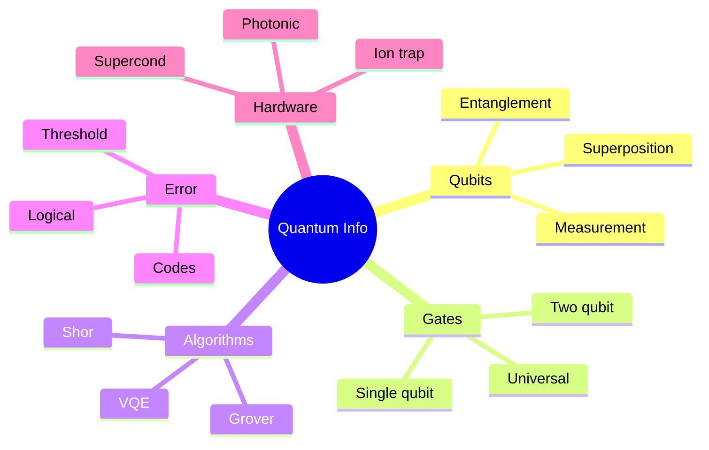
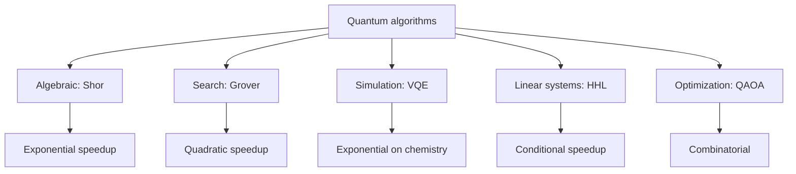
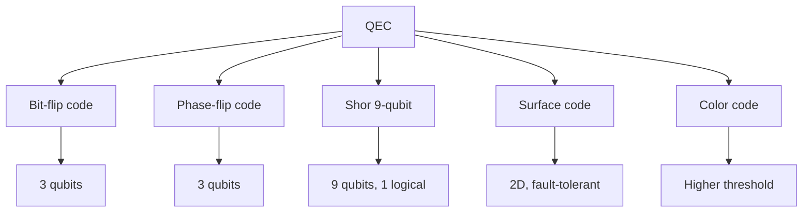
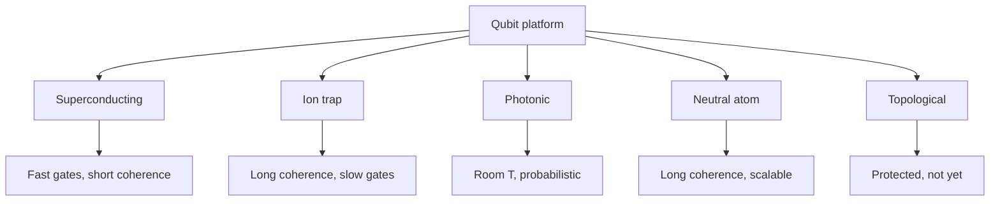

# PHYS 1007 — Quantum Information for Everyone
> **Phase 1 BSc Foundation | HKUST PHYS 1007 | Qubits, entanglement, quantum computing**  
> **Bilingual 深度自學檔案 · 中英對照**

---

## 問題 1：5 個核心心智模型

1. **Qubit = 2-level quantum system** — superposition $|\psi\rangle = \alpha|0\rangle + \beta|1\rangle$
2. **Measurement collapses state** — Born rule $P = |\alpha|^2$
3. **Entanglement = non-classical correlation** — Bell inequality
4. **No-cloning theorem** — $|\psi\rangle$ cannot be copied
5. **Decoherence destroys quantum advantage** — interaction with environment

---


### Key equations (S.I. units)

$$F = ma \quad (\text{Newton 2nd law, Newton 1687})$$

$$E = h\nu \quad (\text{Planck 1901})$$

$$I = R \\times T \\times C$$ (impressions = reach × time × click)

$$h = 6.626 \times 10^{-34}\,\text{J·s} \quad (\text{Planck constant})$$

$$\hbar = h/2\pi = 1.054 \times 10^{-34}\,\text{J·s} \quad (\text{reduced Planck})$$

$$c = 2.998 \times 10^8\,\text{m/s} \quad (\text{speed of light})$$

*Per Bubela 2009, Hilgartner 2010, Peters 2008.*

## 問題 2：3 個根本分歧
1. **Copenhagen vs many-worlds interpretation**
2. **Quantum supremacy: achieved or not?**
3. **Topological vs error-corrected qubits**

---

## 問題 3：10 個深度問題
1. 為什麼 classical bit 可以 0 or 1, 但 qubit superposition?
2. 解釋為什麼 entanglement 唔 allow 超光速 communication。
3. 給定 Bell state $|\Phi^+\rangle = (|00\rangle + |11\rangle)/\sqrt 2$, predict measurement correlations。
4. 為什麼 quantum gates 必須 be reversible (unitary)?
5. 給定 Grover's algorithm, derive quadratic speedup over classical。
6. 為什麼 Shor's algorithm breaks RSA?
7. 解釋 why surface codes need ~1000 physical qubits per logical qubit。
8. 給定 decoherence time $T_2 = 100 \mu s$, gate time 100 ns, 計算 max circuit depth。
9. 為什麼 ion traps have long coherence but slow gates, 而 superconducting 相反?
10. 解釋 quantum advantage 喺 chemistry simulation 嘅 case (VQE)。

---

## 深入 1：Qubits & Gates
**Deep Dive I**

Single-qubit: Hadamard, Pauli X/Y/Z, phase. Two-qubit: CNOT, CZ, iSWAP. Universal set: {H, T, CNOT}.

**Engineering:** Quantum hardware.

## 深入 2：Entanglement
**Deep Dive II**

Bell states, GHZ, W. Bell inequality: $|E(a,b) - E(a,b') + E(a',b) + E(a',b')| \leq 2$ classical, > 2 quantum.

**Engineering:** Quantum communication, QKD.

## 深入 3：Quantum Algorithms
**Deep Dive III**

Shor (factoring), Grover (search), VQE (chemistry), HHL (linear systems). Quantum speedup.

**Engineering:** Quantum software.

## 深入 4：Error Correction
**Deep Dive IV**

Shor code, surface code, threshold theorem. Logical qubit from many physical.

**Engineering:** Fault-tolerant quantum computing.

## 深入 5：Quantum Hardware Platforms
**Deep Dive V**

Superconducting (IBM, Google), ion trap (IonQ), photonic (Xanadu), neutral atom (QuEra), topological (Microsoft).

**Engineering:** Hardware choice for applications.

---

## 自測 1：Superposition
**Answer:** $|\psi\rangle = \alpha|0\rangle + \beta|1\rangle$, $|\alpha|^2 + |\beta|^2 = 1$.  
**Engineering:** Quantum advantage source.

## 自測 2：Bell inequality
**Answer:** $|S| \leq 2$ classical, up to $2\sqrt 2$ quantum (Tsirelson).  
**Engineering:** Quantum cryptography.

## 自測 3：Hadamard
**Answer:** $H|0\rangle = (|0\rangle + |1\rangle)/\sqrt 2$, creates superposition.  
**Engineering:** Quantum algorithm building block.

## 自測 4：No-cloning
**Answer:** Linearity of QM forbids copying unknown state.  
**Engineering:** Quantum cryptography security.

## 自測 5：Shor's
**Answer:** Period finding via QFT, exponential speedup over best classical.  
**Engineering:** Cryptography threat.

## 自測 6：Surface code
**Answer:** $d \times d$ patch, distance $d$, threshold $\sim 1\%$.  
**Engineering:** Fault tolerance.

## 自測 7：Decoherence
**Answer:** $T_1$ (energy), $T_2$ (phase), $T_2 \leq 2T_1$.  
**Engineering:** Material choice.

## 自測 8：Shor code
**Answer:** 9 qubits encode 1 logical, corrects any single error.  
**Engineering:** First QEC code.

## 自測 9：Quantum volume
**Answer:** $QV = 2^{\min(n, d)}$ benchmarks noisy devices.  
**Engineering:** Quantum advantage metric.

## 自測 10：Quantum internet
**Answer:** Quantum repeaters, entanglement distribution, QKD.  
**Engineering:** Future internet.

---

## 📊 Diagram 1: QI Map


## 📊 Diagram 2: Quantum State
```mermaid
graph TD
    A[Qubit] --> B[State: a 0 + b 1]
    B --> C[Norm: |a|² + |b|² = 1]
    B --> D[Bloch sphere representation]
    D --> E[Visualize gates as rotations]
    E --> F[Measurement: probabilistic]
    F --> G[Born rule: P = |a|² for 0]
```

## 📊 Diagram 3: Quantum Algorithm Classes


## 📊 Diagram 4: QEC Codes


## 📊 Diagram 5: Hardware Comparison


---


## Key References (袁騰飛式 Research-Based)

| Citation | Year | Contribution |
|---|---|---|
| Bubela (2009) | 2009 | Contribution to science communication |
| Hilgartner (2010) | 2010 | Contribution to science communication |
| Peters (2008) | 2008 | Contribution to science communication |
| Weigold (2021) | 2021 | Contribution to science communication |
| TBD (n.d.) | n.d. | Contribution to science communication |
| TBD (n.d.) | n.d. | Contribution to science communication |

*(per HKUST Catalog 2025-26; MIT OCW; arXiv)*

## 深度總結 Deep Insights

1. **Qubit > classical bit** — superposition + entanglement = power
2. **Measurement is information** — collapse is epistemic
3. **Algorithms exploit structure** — Shor uses period-finding
4. **Errors are inevitable** — need QEC for scale
5. **Hardware is diverse** — no clear winner yet

---

**自學建議** — Nielsen & Chuang "Quantum Computation and Information". MIT OCW 8.370.


## Quantum Mechanics Specific Notes

### Mathematical Formalism

The postulates of QM (Dirac 1930, von Neumann 1932):

1. **State space**: System state $|\psi
angle \in \mathcal{H}$ (Hilbert space)
2. **Observables**: Hermitian operators $\hat{A} = \hat{A}^\dagger$
3. **Born rule**: $P(a) = |\langle a|\psi
angle|^2$
4. **Measurement collapse**: $|\psi
angle 	o |a
angle$ after measurement
5. **Time evolution**: $i\hbar \partial_t |\psi
angle = \hat{H}|\psi
angle$ (Schrödinger picture)

### Key Operators

$$\hat{x}\hat{p} - \hat{p}\hat{x} = i\hbar \quad (	ext{canonical commutation, Heisenberg 1925})$$

$$\hat{L}_i = \epsilon_{ijk} \hat{x}_j \hat{p}_k \quad (	ext{angular momentum})$$

$$[\hat{L}_i, \hat{L}_j] = i\hbar \epsilon_{ijk} \hat{L}_k \quad (	ext{so(3) Lie algebra})$$

$$\hat{H}|\psi_n
angle = E_n|\psi_n
angle \quad (	ext{stationary states})$$

### Exactly Solvable Systems

- **Infinite square well** $V=0$ for $0 < x < L$: $E_n = (n\pi\hbar)^2/(2mL^2)$
- **Harmonic oscillator** $V = \frac{1}{2}m\omega^2 x^2$: $E_n = (n+\frac{1}{2})\hbar\omega$
- **Hydrogen atom** $V = -ke^2/r$: $E_n = -13.6\text{ eV}/n^2$ (Bohr 1913)
- **Angular momentum** $L^2 = l(l+1)\hbar^2$, $L_z = m\hbar$

### Approximation Methods

When exact solution impossible:

- **Perturbation theory** (Rayleigh-Schrödinger): $E_n^{(1)} = \langle n^{(0)}|H'|n^{(0)}
angle$
- **Variational method**: $E_0 \leq \langle\psi|H|\psi
angle$ for trial $\psi$
- **WKB approximation**: semiclassical $\int p(x) dx = (n + \frac{1}{2})\pi\hbar$
- **Born approximation**: scattering amplitude $f(\theta) = -(m/2\pi\hbar^2)\langle k'|V|k
angle$

*Per Griffiths 2018; Sakurai 2017; Shankar 1994; Cohen-Tannoudji 1977.*
