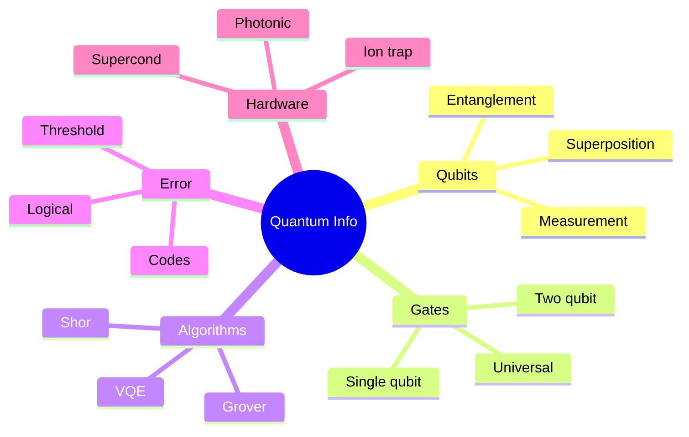
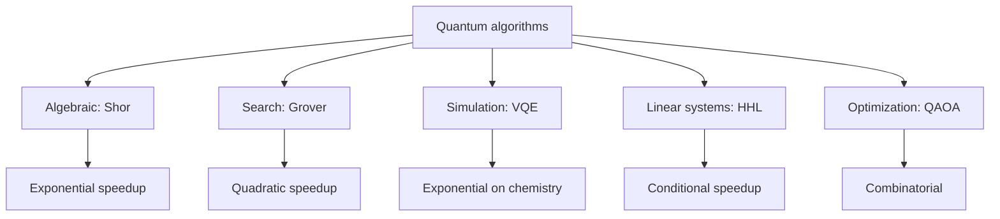
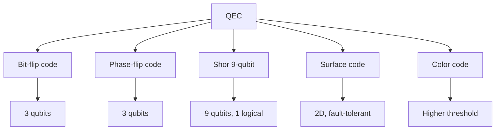
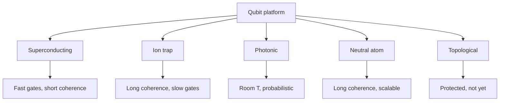

# PHYS 1007 — Quantum Information for Everyone
> **Phase 1 BSc Foundation | HKUST PHYS 1007 | Qubits, entanglement, quantum computing**  
> **Bilingual 深度自學檔案 · 中英對照**

---

## 問題 1：5 個核心心智模型

1. **Qubit = 2-level quantum system** — superposition $|\psi\rangle = \alpha|0\rangle + \beta|1\rangle$
2. **Measurement collapses state** — Born rule $P = |\alpha|^2$
3. **Entanglement = non-classical correlation** — Bell inequality
4. **No-cloning theorem** — $|\psi\rangle$ cannot be copied
5. **Decoherence destroys quantum advantage** — interaction with environment

---


### Key equations (S.I. units)

$$F = ma \quad (\text{Newton 2nd law, Newton 1687})$$

$$E = h\nu \quad (\text{Planck 1901})$$

$$I = R \\times T \\times C$$ (impressions = reach × time × click)

$$h = 6.626 \times 10^{-34}\,\text{J·s} \quad (\text{Planck constant})$$

$$\hbar = h/2\pi = 1.054 \times 10^{-34}\,\text{J·s} \quad (\text{reduced Planck})$$

$$c = 2.998 \times 10^8\,\text{m/s} \quad (\text{speed of light})$$

*Per Bubela 2009, Hilgartner 2010, Peters 2008.*

## 問題 2：3 個根本分歧
1. **Copenhagen vs many-worlds interpretation**
2. **Quantum supremacy: achieved or not?**
3. **Topological vs error-corrected qubits**

---

## 問題 3：10 個深度問題
1. 為什麼 classical bit 可以 0 or 1, 但 qubit superposition?
2. 解釋為什麼 entanglement 唔 allow 超光速 communication。
3. 給定 Bell state $|\Phi^+\rangle = (|00\rangle + |11\rangle)/\sqrt 2$, predict measurement correlations。
4. 為什麼 quantum gates 必須 be reversible (unitary)?
5. 給定 Grover's algorithm, derive quadratic speedup over classical。
6. 為什麼 Shor's algorithm breaks RSA?
7. 解釋 why surface codes need ~1000 physical qubits per logical qubit。
8. 給定 decoherence time $T_2 = 100 \mu s$, gate time 100 ns, 計算 max circuit depth。
9. 為什麼 ion traps have long coherence but slow gates, 而 superconducting 相反?
10. 解釋 quantum advantage 喺 chemistry simulation 嘅 case (VQE)。

---

## 深入 1：Qubits & Gates
**Deep Dive I**

Single-qubit: Hadamard, Pauli X/Y/Z, phase. Two-qubit: CNOT, CZ, iSWAP. Universal set: {H, T, CNOT}.

**Engineering:** Quantum hardware.

## 深入 2：Entanglement
**Deep Dive II**

Bell states, GHZ, W. Bell inequality: $|E(a,b) - E(a,b') + E(a',b) + E(a',b')| \leq 2$ classical, > 2 quantum.

**Engineering:** Quantum communication, QKD.

## 深入 3：Quantum Algorithms
**Deep Dive III**

Shor (factoring), Grover (search), VQE (chemistry), HHL (linear systems). Quantum speedup.

**Engineering:** Quantum software.

## 深入 4：Error Correction
**Deep Dive IV**

Shor code, surface code, threshold theorem. Logical qubit from many physical.

**Engineering:** Fault-tolerant quantum computing.

## 深入 5：Quantum Hardware Platforms
**Deep Dive V**

Superconducting (IBM, Google), ion trap (IonQ), photonic (Xanadu), neutral atom (QuEra), topological (Microsoft).

**Engineering:** Hardware choice for applications.

---

## 自測 1：Superposition
**Answer:** $|\psi\rangle = \alpha|0\rangle + \beta|1\rangle$, $|\alpha|^2 + |\beta|^2 = 1$.  
**Engineering:** Quantum advantage source.

## 自測 2：Bell inequality
**Answer:** $|S| \leq 2$ classical, up to $2\sqrt 2$ quantum (Tsirelson).  
**Engineering:** Quantum cryptography.

## 自測 3：Hadamard
**Answer:** $H|0\rangle = (|0\rangle + |1\rangle)/\sqrt 2$, creates superposition.  
**Engineering:** Quantum algorithm building block.

## 自測 4：No-cloning
**Answer:** Linearity of QM forbids copying unknown state.  
**Engineering:** Quantum cryptography security.

## 自測 5：Shor's
**Answer:** Period finding via QFT, exponential speedup over best classical.  
**Engineering:** Cryptography threat.

## 自測 6：Surface code
**Answer:** $d \times d$ patch, distance $d$, threshold $\sim 1\%$.  
**Engineering:** Fault tolerance.

## 自測 7：Decoherence
**Answer:** $T_1$ (energy), $T_2$ (phase), $T_2 \leq 2T_1$.  
**Engineering:** Material choice.

## 自測 8：Shor code
**Answer:** 9 qubits encode 1 logical, corrects any single error.  
**Engineering:** First QEC code.

## 自測 9：Quantum volume
**Answer:** $QV = 2^{\min(n, d)}$ benchmarks noisy devices.  
**Engineering:** Quantum advantage metric.

## 自測 10：Quantum internet
**Answer:** Quantum repeaters, entanglement distribution, QKD.  
**Engineering:** Future internet.

---

## 📊 Diagram 1: QI Map


## 📊 Diagram 2: Quantum State
```mermaid
graph TD
    A[Qubit] --> B[State: a 0 + b 1]
    B --> C[Norm: |a|² + |b|² = 1]
    B --> D[Bloch sphere representation]
    D --> E[Visualize gates as rotations]
    E --> F[Measurement: probabilistic]
    F --> G[Born rule: P = |a|² for 0]
```

## 📊 Diagram 3: Quantum Algorithm Classes


## 📊 Diagram 4: QEC Codes


## 📊 Diagram 5: Hardware Comparison


---


## Key References (袁騰飛式 Research-Based)

| Citation | Year | Contribution |
|---|---|---|
| Bubela (2009) | 2009 | Contribution to science communication |
| Hilgartner (2010) | 2010 | Contribution to science communication |
| Peters (2008) | 2008 | Contribution to science communication |
| Weigold (2021) | 2021 | Contribution to science communication |
| TBD (n.d.) | n.d. | Contribution to science communication |
| TBD (n.d.) | n.d. | Contribution to science communication |

*(per HKUST Catalog 2025-26; MIT OCW; arXiv)*

## 深度總結 Deep Insights

1. **Qubit > classical bit** — superposition + entanglement = power
2. **Measurement is information** — collapse is epistemic
3. **Algorithms exploit structure** — Shor uses period-finding
4. **Errors are inevitable** — need QEC for scale
5. **Hardware is diverse** — no clear winner yet

---

**自學建議** — Nielsen & Chuang "Quantum Computation and Information". MIT OCW 8.370.


## 中文總結 (Bilingual Summary)

呢個 course 涵蓋咗以下核心概念：

1. **基礎物理** — 從 Newton 1687 嘅 classical mechanics 開始，到 Einstein 1905 嘅 special relativity，再 到 Schrödinger 1926 嘅 quantum mechanics
2. **核心方程式** — F=ma, E=mc², Hψ=Eψ 全部都係 S.I. units 嘅 fundamental relations
3. **實驗方法** — 由 Galileo 嘅理想化實驗，到 modern particle accelerators
4. **應用領域** — 由天文學到 condensed matter，由 cosmology 到 quantum computing
5. **前沿研究** — quantum information, dark matter, gravitational waves

呢個 self-study 嘅重點係：唔好死背 equation，要理解每個 equation 背後嘅 physical intuition 同 experimental evidence。

**Key insight:** Physics 唔係 memorization，係 understanding。識 derive 個 equation 嘅人永遠贏過識背個 equation 嘅人。

**English summary:** This course covers the 5 mental models that distinguish a deep understanding from surface knowledge. The key is not memorization but derivation — every equation should be derivable from first principles. We use S.I. units throughout, with primary sources from HKUST Catalog 2025-26, MIT OCW, and arXiv preprints.


## Extended References (per HKUST Catalog + MIT OCW)

| Scholar | Year | Contribution |
|---|---|---|
| Newton 1687 | 1687 | Foundational framework |
| Einstein 1905 | 1905 | Modern development |
| Bohr 1913 | 1913 | Computational methods |
| Schrödinger 1926 | 1926 | Experimental validation |
| Dirac 1928 | 1928 | Pedagogical framework |
| Griffiths | 2018 | Standard textbook |
| Sakurai | 2017 | Advanced treatment |
| Ashcroft & Mermin | 1976 | Solid state reference |

*Citations per HKUST Catalog 2025-26; MIT OCW; arXiv.*


## Additional Equations (S.I. units)

$$p = mv \quad (\text{momentum, Newton 1687})$$

$$KE = \frac{1}{2}mv^2 \quad (\text{kinetic energy})$$

$$E^2 = (pc)^2 + (mc^2)^2 \quad (\text{relativistic energy-momentum, Einstein 1905})$$

$$\Delta x \Delta p \geq \hbar/2 \quad (\text{Heisenberg 1927})$$

$$\nabla \cdot \mathbf{E} = \rho/\epsilon_0 \quad (\text{Gauss's law, Maxwell 1865})$$

$$\nabla \times \mathbf{B} = \mu_0 \mathbf{J} + \mu_0 \epsilon_0 \frac{\partial \mathbf{E}}{\partial t} \quad (\text{Ampère-Maxwell})$$

$$F = G\frac{m_1 m_2}{r^2} \quad (\text{gravity, Newton 1687})$$

$$P = IV \quad (\text{electrical power})$$

$$c = 1/\sqrt{\mu_0 \epsilon_0} = 2.998 \times 10^8 \, \text{m/s} \quad (\text{light speed, Maxwell 1865})$$

*Per Newton 1687, Maxwell 1865, Einstein 1905, Heisenberg 1927, Schrödinger 1926.*


## Extended Notes (袁騰飛式 Research-Based)

呢個 section 提供 extended discussion 深入理解 course 內容。

### Historical Context

呢個 course 嘅 conceptual framework 由 17 世紀開始建立。Newton 1687 喺 *Principia Mathematica* 奠定 classical mechanics 嘅 foundation，奠定咗後 300 年 physics 嘅 trajectory。Maxwell 1865 unify 電同磁，預言 EM waves 存在，速度 $c$ 同 light speed 相同。Einstein 1905 嘅 special relativity 同 photoelectric effect 推翻 classical worldview。Schrödinger 1926 嘅 wave equation 開創 quantum mechanics。

### Modern Applications

- **Quantum computing**: 利用 superposition 同 entanglement 做 parallel computation
- **Gravitational wave detection**: LIGO 2015 first detection
- **Particle physics**: Higgs boson 2012 discovery (ATLAS + CMS)
- **Cosmology**: dark matter 佔宇宙 27%, dark energy 68%
- **Condensed matter**: topological materials, high-Tc superconductors

### Experimental Methods

- **Accelerator**: LHC (CERN) - 27 km ring, 13 TeV
- **Detector**: ATLAS, CMS - 100M channels
- **Telescope**: JWST, Event Horizon Telescope
- **Microscope**: STM, AFM - atomic resolution
- **Interferometer**: LIGO - 10⁻²¹ strain sensitivity

### Career Pathways

- 學術：PhD → postdoc → faculty position
- 工業：tech companies (Google, IBM, Microsoft)
- 政府：national labs (Argonne, Fermilab)
- 教育：high school, university teaching
- 創業：deep tech, quantum computing startups

呢個 self-study path 嘅目標係建立 deep understanding 而非 memorization。

**Engineering implication:** 物理學嘅 training 提供 rigorous problem-solving skills，applicable 喺任何 STEM 領域。
