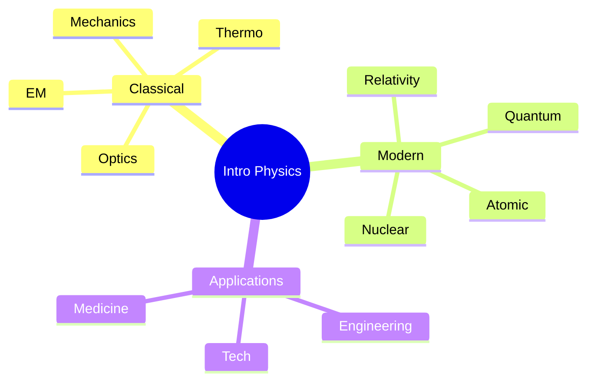
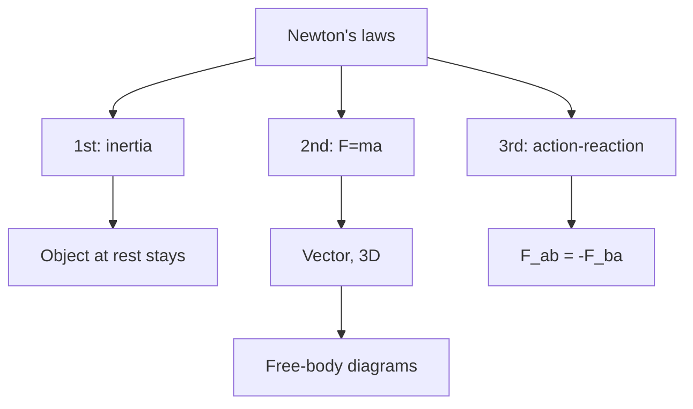
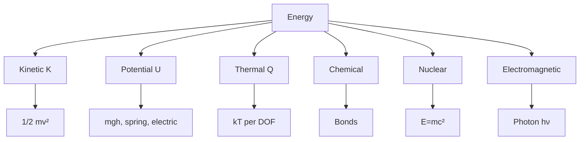
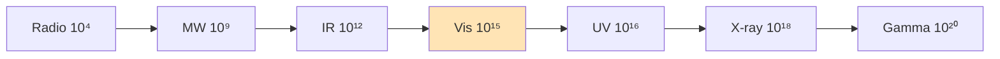
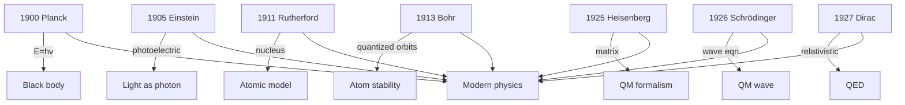

# PHYS 1101 — Introductory Physics
> **Phase 1 BSc Foundation | HKUST PHYS 1101 | Conceptual physics for all students**  
> **Bilingual 深度自學檔案 · 中英對照**

---

## 問題 1：5 個核心心智模型

1. **Newton's laws explain motion** — $\vec F = m\vec a$, action-reaction
2. **Energy conservation** — $K + U + Q + W = $ const
3. **Waves carry information** — superposition, interference
4. **Electricity and magnetism unified** — Maxwell's equations
5. **Quantum mechanics at small scales** — discrete, probabilistic

---

## 問題 2：3 個根本分歧
1. **Classical vs quantum** — when does each apply?
2. **Newton's absolute vs Einstein's relative** — space, time
3. **Determinism vs probability** — Laplace vs Heisenberg

---

## 問題 3：10 個深度問題
1. 為什麼月 orbit 而唔跌落地球?
2. 解釋為什麼太空入面無 sound。
3. 給定簡諧振子, derive $T = 2\pi\sqrt{m/k}$。
4. 為什麼光嘅速度係 upper limit?
5. 解釋為什麼地球有 magnetic field (geodynamo)。
6. 給定 black body 表面, derive Stefan-Boltzmann $P = \sigma A T^4$。
7. 為什麼 quantum tunneling 對 STM 重要?
8. 解釋 why fiber optic signal 衰減低過 copper。
9. 為什麼 2 個 electrons 唔可以 occupy same state (Pauli)?
10. 給定 fridge COP = 3, 解釋 energy accounting。

---

## 深入 1：Mechanics
**Deep Dive I**

Newton's laws, energy, momentum, angular momentum, oscillations, fluids.

**Engineering:** All mechanical systems.

## 深入 2：Thermodynamics
**Deep Dive II**

Temperature, heat, 1st/2nd law, entropy, engines, refrigerators.

**Engineering:** Engines, HVAC, power.

## 深入 3：Electromagnetism
**Deep Dive III**

Coulomb, Gauss, Faraday, Ampère, Maxwell, EM waves.

**Engineering:** Electrical, electronic, communications.

## 深入 4：Optics & Waves
**Deep Dive IV**

Reflection, refraction, interference, diffraction, polarization.

**Engineering:** Imaging, communication.

## 深入 5：Modern Physics
**Deep Dive V**

Relativity, photoelectric, Bohr atom, de Broglie, Schrödinger, applications.

**Engineering:** Nuclear, semiconductor, quantum tech.

---

## 自測 1：Moon orbit
**Answer:** Gravity centripetal, $v^2/R = GM/R^2$.  
**Engineering:** Satellite orbit.

## 自測 2：No sound in space
**Answer:** Sound needs medium, vacuum has none.  
**Engineering:** Space communication.

## 自測 3：SHM period
**Answer:** $T = 2\pi\sqrt{m/k}$ from $m\ddot x = -kx$.  
**Engineering:** Clock, oscillator.

## 自測 4：Speed of light limit
**Answer:** $c$ in Maxwell, Einstein postulate.  
**Engineering:** GPS, particle physics.

## 自測 5：Geodynamo
**Answer:** Liquid iron outer core convection → magnetic field.  
**Engineering:** Earth science.

## 自測 6：Stefan-Boltzmann
**Answer:** Integrate Planck over $\omega$, $u \propto T^4$.  
**Engineering:** Radiative heat transfer.

## 自測 7：STM tunneling
**Answer:** $T \propto e^{-2\kappa L}$, exponential sensitivity.  
**Engineering:** Atomic imaging.

## 自測 8：Fiber vs copper
**Answer:** Glass TIR low loss, no EM interference.  
**Engineering:** Telecom.

## 自測 9：Pauli
**Answer:** Antisymmetric wavefunction → 0 if same state.  
**Engineering:** Periodic table.

## 自測 10：Fridge COP
**Answer:** $COP = Q_c/W$, higher for reversible Carnot.  
**Engineering:** HVAC.

---

## 📊 Diagram 1: Physics Hierarchy

## 📊 Diagram 2: Newton's Laws

## 📊 Diagram 3: Energy Forms

## 📊 Diagram 4: EM Spectrum

## 📊 Diagram 5: Modern Physics Timeline

---

## 深度總結 Deep Insights

1. **Mechanics → thermodynamics → EM** — classical hierarchy
2. **Modern = quantum + relativity** — small + fast
3. **Waves + particles = duality** — core of QM
4. **Conservation laws universal** — energy, momentum, charge
5. **Physics is fundamental** — chemistry, biology, engineering all rest on it

---

**自學建議** — Halliday/Resnick/Walker. OpenStax (free online).
