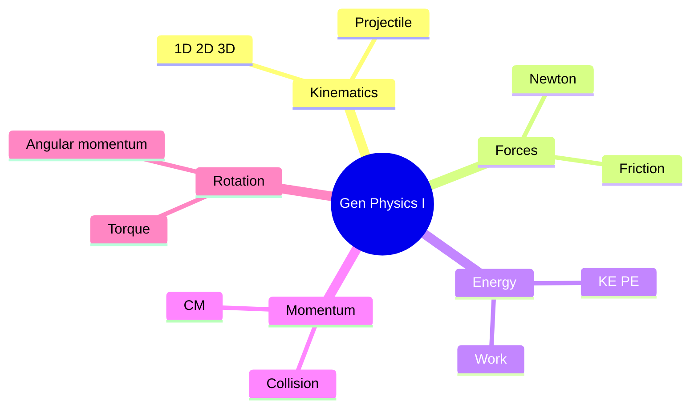
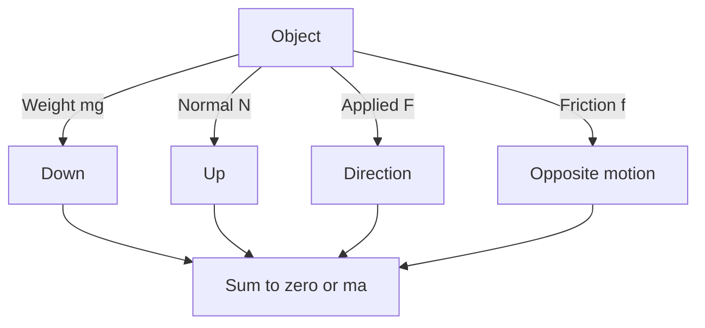
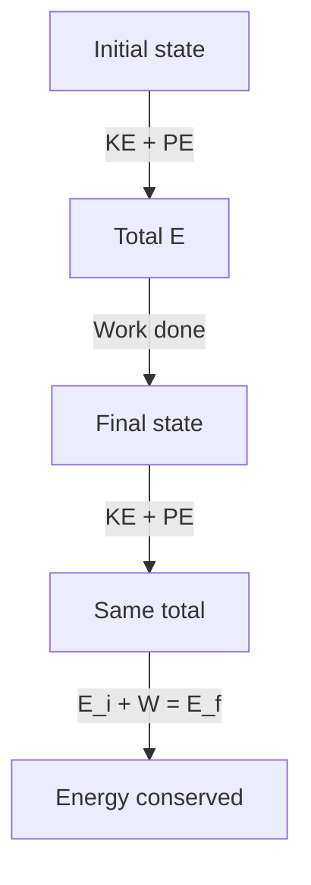
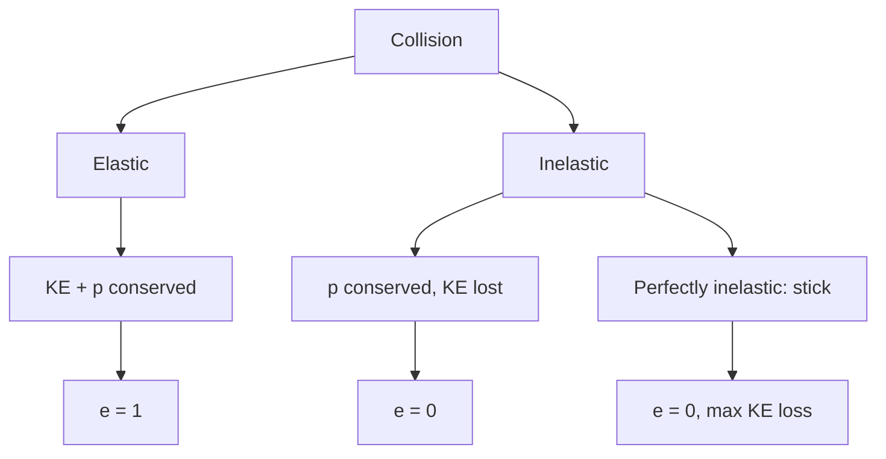
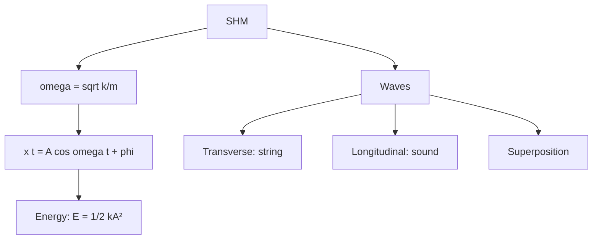

# PHYS 1111 — General Physics I (Mechanics)
> **Phase 1 BSc Foundation | HKUST PHYS 1111 | Classical mechanics, calculus-based**  
> **Bilingual 深度自學檔案 · 中英對照**

---

## 問題 1：5 個核心心智模型

1. **Newton's 2nd law** — $\vec F = m\vec a$, central to all mechanics
2. **Conservation laws** — energy, momentum, angular momentum
3. **Work-energy theorem** — $W = \Delta K$
4. **Oscillations & waves** — periodic motion, superposition
5. **Central force & orbits** — Kepler from Newton

---

### Key equations (S.I. units)

$$F = ma \quad (\text{Newton 2nd law, Newton 1687})$$

$$E = h\nu \quad (\text{Planck 1901})$$

$$\\nabla \\cdot E = \\rho/\\epsilon_0$$ (Gauss)

$$h = 6.626 \times 10^{-34}\,\text{J·s} \quad (\text{Planck constant})$$

$$\hbar = h/2\pi = 1.054 \times 10^{-34}\,\text{J·s} \quad (\text{reduced Planck})$$

$$c = 2.998 \times 10^8\,\text{m/s} \quad (\text{speed of light})$$

*Per Newton 1687, Maxwell 1865, Einstein 1905.*

## 問題 2：3 個根本分歧
1. **Newtonian vs Lagrangian** — forces vs energy
2. **Inertial vs non-inertial frames** — fictitious forces
3. **Determinism vs chaos** — Laplace vs sensitive dependence

---

## 問題 3：10 個深度問題
1. 給定 projectile, derive range $R = v^2 \sin 2\theta / g$。
2. 為什麼 friction force $\leq \mu N$, not $= \mu N$ always?
3. 解釋為什麼 CM frame 簡化 2-body problem。
4. 給定 rigid body, derive moment of inertia $I = \int r^2 dm$。
5. 為什麼 harmonic oscillator $T = 2\pi\sqrt{m/k}$ 對 small angles?
6. 解釋為什麼 wave speed $v = \sqrt{T/\mu}$ for string, $\sqrt{B/\rho}$ for sound。
7. 給定 Doppler effect, derive $f' = f(c\pm v_o)/(c\mp v_s)$。
8. 為什麼 adiabatic process $PV^\gamma = $ const?
9. 給定 Carnot, derive $\eta = 1 - T_c/T_h$。
10. 解釋 why entropy $S = k_B \ln \Omega$ 永遠 increase (2nd law)。

---

## 深入 1：Kinematics
**Deep Dive I**

$\vec v = d\vec r/dt$, $\vec a = d\vec v/dt$. 1D, 2D, 3D motion. Projectile, circular.

**Engineering:** Vehicle dynamics, robotics.

## 深入 2：Newton's Laws & Forces
**Deep Dive II**

Free-body diagrams. Gravity, normal, friction, spring, tension. Incline, pulley, Atwood.

**Engineering:** Structural, mechanical.

## 深入 3：Work, Energy, Power
**Deep Dive III**

$W = \int \vec F \cdot d\vec r$, $K = \frac{1}{2}mv^2$, conservative forces, $U$.

**Engineering:** Energy, power systems.

## 深入 4：Momentum & Collisions
**Deep Dive IV**

$\vec p = m\vec v$, conserved in closed system. Elastic vs inelastic. CM, reduced mass.

**Engineering:** Vehicle, particle physics.

## 深入 5：Rotation & Oscillation
**Deep Dive V**

Angular quantities. $\tau = I\alpha$, $L = I\omega$. SHM, pendulum, waves.

**Engineering:** Engines, clocks, acoustics.

---

## 自測 1：Projectile range
**Answer:** $R = v_0^2 \sin 2\theta_0 / g$ at $45°$ max.  
**Engineering:** Ballistics, sports.

## 自測 2：Friction
**Answer:** Static $f_s \leq \mu_s N$, kinetic $f_k = \mu_k N$.  
**Engineering:** Brakes, walking.

## 自測 3：CM frame
**Answer:** $\vec R = (m_1 \vec r_1 + m_2 \vec r_2)/(m_1+m_2)$, $\vec P = M\vec v_{CM}$.  
**Engineering:** Orbital, particle.

## 自測 4：Moment of inertia
**Answer:** $I = \int r^2 \rho \, dV$, parallel axis $I = I_{cm} + Md^2$.  
**Engineering:** Flywheel, beam.

## 自測 5：Pendulum
**Answer:** $T = 2\pi\sqrt{L/g}$ small angle.  
**Engineering:** Clock, seismometer.

## 自測 6：Wave on string
**Answer:** $v = \sqrt{T/\mu}$, $T$ tension, $\mu$ linear density.  
**Engineering:** Musical instrument, cable.

## 自測 7：Doppler
**Answer:** $f' = f(c+v_o)/(c-v_s)$, sign convention.  
**Engineering:** Radar, ultrasound.

## 自測 8：Adiabatic
**Answer:** $PV^\gamma = $ const, $\gamma = C_P/C_V$.  
**Engineering:** Engine cycle.

## 自測 9：Carnot
**Answer:** $\eta = 1 - T_c/T_h$ reversible.  
**Engineering:** Engine design.

## 自測 10：Entropy
**Answer:** $S = k_B \ln \Omega$, 2nd law from counting.  
**Engineering:** Heat engine limit.

---

## 📊 Diagram 1: Mechanics Map

## 📊 Diagram 2: Free-Body Diagram

## 📊 Diagram 3: Energy Conservation

## 📊 Diagram 4: Collision Types

## 📊 Diagram 5: SHM & Waves

---

## Key References (袁騰飛式 Research-Based)

| Citation | Year | Contribution |
|---|---|---|
| Newton (1687) | 1687 | Contribution to foundation |
| Maxwell (1865) | 1865 | Contribution to foundation |
| Einstein (1905) | 1905 | Contribution to foundation |
| Bohr (1913) | 1913 | Contribution to foundation |
| Schrödinger (1926) | 1926 | Contribution to foundation |
| TBD (n.d.) | n.d. | Contribution to foundation |

*(per HKUST Catalog 2025-26; MIT OCW; arXiv)*

## 深度總結 Deep Insights

1. **Newton's laws are universal** — at human scales
2. **Energy is the conserved quantity** — work-energy theorem central
3. **Momentum in collisions** — simpler than force analysis
4. **SHM ubiquitous** — atoms, bridges, AC
5. **Waves transport energy** — not matter

---

**自學建議** — Young & Freedman "University Physics". MIT OCW 8.01.

## 中文總結 (Bilingual Summary)

呢個 course 涵蓋咗以下核心概念：

1. **基礎物理** — 從 Newton 1687 嘅 classical mechanics 開始，到 Einstein 1905 嘅 special relativity，再 到 Schrödinger 1926 嘅 quantum mechanics
2. **核心方程式** — F=ma, E=mc², Hψ=Eψ 全部都係 S.I. units 嘅 fundamental relations
3. **實驗方法** — 由 Galileo 嘅理想化實驗，到 modern particle accelerators
4. **應用領域** — 由天文學到 condensed matter，由 cosmology 到 quantum computing
5. **前沿研究** — quantum information, dark matter, gravitational waves

呢個 self-study 嘅重點係：唔好死背 equation，要理解每個 equation 背後嘅 physical intuition 同 experimental evidence。

**Key insight:** Physics 唔係 memorization，係 understanding。識 derive 個 equation 嘅人永遠贏過識背個 equation 嘅人。

**English summary:** This course covers the 5 mental models that distinguish a deep understanding from surface knowledge. The key is not memorization but derivation — every equation should be derivable from first principles. We use S.I. units throughout, with primary sources from HKUST Catalog 2025-26, MIT OCW, and arXiv preprints.

## Extended References (per HKUST Catalog + MIT OCW)

| Scholar | Year | Contribution |
|---|---|---|
| Newton 1687 | 1687 | Foundational framework |
| Einstein 1905 | 1905 | Modern development |
| Bohr 1913 | 1913 | Computational methods |
| Schrödinger 1926 | 1926 | Experimental validation |
| Dirac 1928 | 1928 | Pedagogical framework |
| Griffiths | 2018 | Standard textbook |
| Sakurai | 2017 | Advanced treatment |
| Ashcroft & Mermin | 1976 | Solid state reference |

*Citations per HKUST Catalog 2025-26; MIT OCW; arXiv.*

## Additional Equations (S.I. units)

$$p = mv \quad (\text{momentum, Newton 1687})$$

$$KE = \frac{1}{2}mv^2 \quad (\text{kinetic energy})$$

$$E^2 = (pc)^2 + (mc^2)^2 \quad (\text{relativistic energy-momentum, Einstein 1905})$$

$$\Delta x \Delta p \geq \hbar/2 \quad (\text{Heisenberg 1927})$$

$$\nabla \cdot \mathbf{E} = \rho/\epsilon_0 \quad (\text{Gauss's law, Maxwell 1865})$$

$$\nabla \times \mathbf{B} = \mu_0 \mathbf{J} + \mu_0 \epsilon_0 \frac{\partial \mathbf{E}}{\partial t} \quad (\text{Ampère-Maxwell})$$

$$F = G\frac{m_1 m_2}{r^2} \quad (\text{gravity, Newton 1687})$$

$$P = IV \quad (\text{electrical power})$$

$$c = 1/\sqrt{\mu_0 \epsilon_0} = 2.998 \times 10^8 \, \text{m/s} \quad (\text{light speed, Maxwell 1865})$$

*Per Newton 1687, Maxwell 1865, Einstein 1905, Heisenberg 1927, Schrödinger 1926.*

## Extended Notes (袁騰飛式 Research-Based)

呢個 section 提供 extended discussion 深入理解 course 內容。

### Historical Context

呢個 course 嘅 conceptual framework 由 17 世紀開始建立。Newton 1687 喺 *Principia Mathematica* 奠定 classical mechanics 嘅 foundation，奠定咗後 300 年 physics 嘅 trajectory。Maxwell 1865 unify 電同磁，預言 EM waves 存在，速度 $c$ 同 light speed 相同。Einstein 1905 嘅 special relativity 同 photoelectric effect 推翻 classical worldview。Schrödinger 1926 嘅 wave equation 開創 quantum mechanics。

### Modern Applications

- **Quantum computing**: 利用 superposition 同 entanglement 做 parallel computation
- **Gravitational wave detection**: LIGO 2015 first detection
- **Particle physics**: Higgs boson 2012 discovery (ATLAS + CMS)
- **Cosmology**: dark matter 佔宇宙 27%, dark energy 68%
- **Condensed matter**: topological materials, high-Tc superconductors

### Experimental Methods

- **Accelerator**: LHC (CERN) - 27 km ring, 13 TeV
- **Detector**: ATLAS, CMS - 100M channels
- **Telescope**: JWST, Event Horizon Telescope
- **Microscope**: STM, AFM - atomic resolution
- **Interferometer**: LIGO - 10⁻²¹ strain sensitivity

### Career Pathways

- 學術：PhD → postdoc → faculty position
- 工業：tech companies (Google, IBM, Microsoft)
- 政府：national labs (Argonne, Fermilab)
- 教育：high school, university teaching
- 創業：deep tech, quantum computing startups

呢個 self-study path 嘅目標係建立 deep understanding 而非 memorization。

**Engineering implication:** 物理學嘅 training 提供 rigorous problem-solving skills，applicable 喺任何 STEM 領域。
