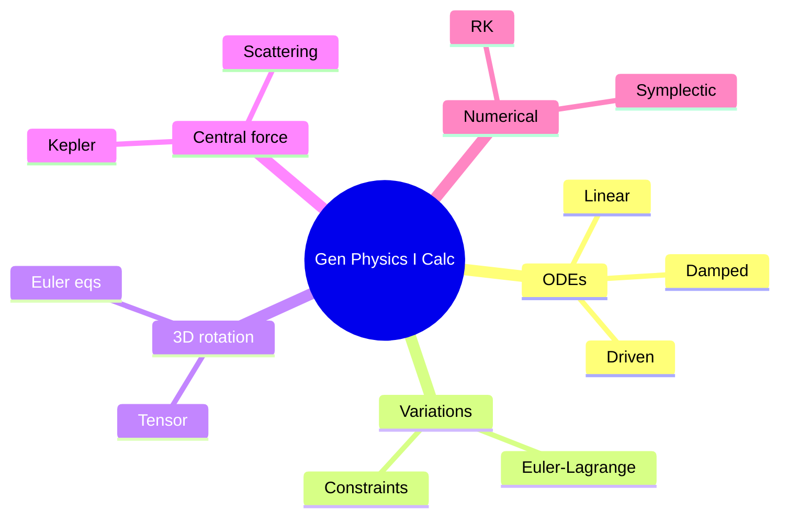
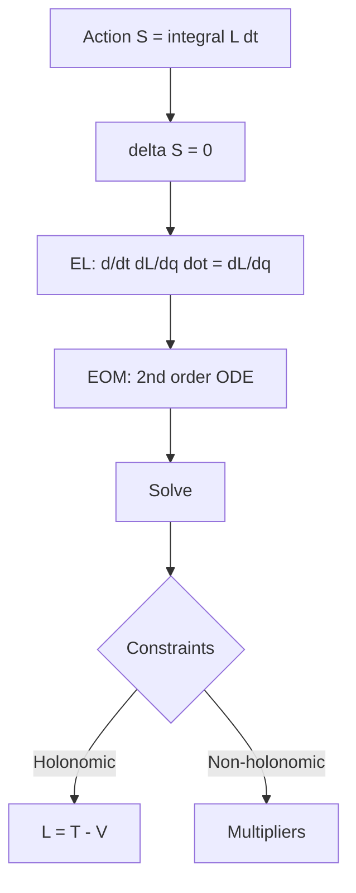
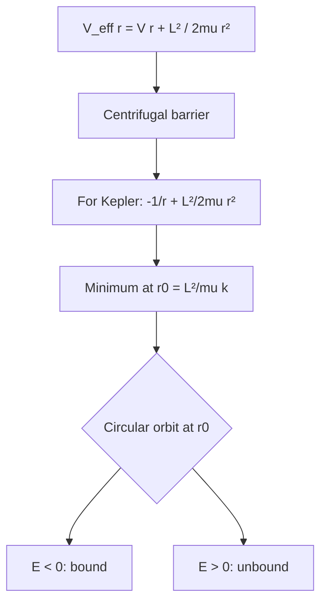
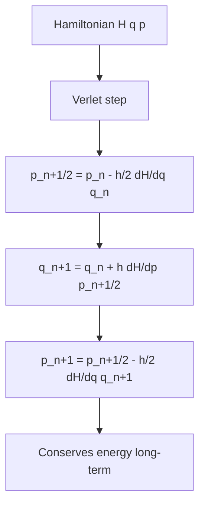

# PHYS 1112 — General Physics I (Calculus-based, Honors)
> **Phase 1 BSc Foundation | HKUST PHYS 1112 | Same as 1111 but calculus-intensive**  
> **Bilingual 深度自學檔案 · 中英對照**

---

## 問題 1：5 個核心心智模型

1. **Differential equations of motion** — $\vec F = m \ddot{\vec r}$ solved analytically
2. **Calculus-based work and energy** — $W = \int \vec F \cdot d\vec r$
3. **Vector calculus in 3D** — gradient, divergence, curl
4. **Lagrangian mechanics (preview)** — variational principle
5. **Numerical solutions** — Euler, RK for non-analytic

---


### Key equations (S.I. units)

$$F = ma \quad (\text{Newton 2nd law, Newton 1687})$$

$$E = h\nu \quad (\text{Planck 1901})$$

$$\\nabla \\cdot E = \\rho/\\epsilon_0$$ (Gauss)

$$h = 6.626 \times 10^{-34}\,\text{J·s} \quad (\text{Planck constant})$$

$$\hbar = h/2\pi = 1.054 \times 10^{-34}\,\text{J·s} \quad (\text{reduced Planck})$$

$$c = 2.998 \times 10^8\,\text{m/s} \quad (\text{speed of light})$$

*Per Newton 1687, Maxwell 1865, Einstein 1905.*

## 問題 2：3 個根本分歧
1. **Analytical vs numerical** — closed form vs compute
2. **Single particle vs many-body** — reductionism
3. **Newtonian vs relativistic** — low vs high $v$

---

## 問題 3：10 個深度問題
1. 給定 drag force $F = -bv$, derive terminal velocity。
2. 為什麼 simple pendulum 大角度 nonlinear 冇 closed form?
3. 給定 Lagrangian $L = \frac{1}{2}m\dot x^2 - V(x)$, derive Euler-Lagrange。
4. 解釋為什麼 cylindrical 座標好用於 circular motion。
5. 給定 3-body problem, 為什麼 chaotic?
6. 為什麼 CM separation 簡化 satellite dynamics?
7. 給定 $V(r) = -\frac{GMm}{r}$, derive effective 1D potential。
8. 解釋 why moment of inertia tensor 有 6 independent components。
9. 給定 rotor, derive critical speed 對 stability。
10. 為什麼 virial theorem $2\langle T\rangle = -\langle V\rangle$ for gravitational bound states?

---

## 深入 1：Differential Equations in Mechanics
**Deep Dive I**

2nd-order linear ODE: $m\ddot x + c\dot x + kx = F(t)$. Damped, driven. Resonance.

**Engineering:** Vehicle suspension, vibration isolation.

## 深入 2：Calculus of Variations
**Deep Dive II**

$\delta S = 0$ → Euler-Lagrange. Shortest path (geodesic), brachistochrone.

**Engineering:** Optimal design, geodesics.

## 深入 3：3D Rotational Dynamics
**Deep Dive III**

Euler's equations for rigid body, principal axes, gyroscope, precession.

**Engineering:** Satellite, bicycle dynamics.

## 深入 4：Central Force
**Deep Dive IV**

Reduced mass, effective potential, orbits (Kepler, scattering), Bertrand's theorem.

**Engineering:** Orbital mechanics, Rutherford.

## 深入 5：Numerical Methods for ODE
**Deep Dive V**

Euler, RK4, leapfrog (symplectic), Verlet. Stability, accuracy.

**Engineering:** Trajectory simulation.

---

## 自測 1：Terminal velocity
**Answer:** $v_t = mg/b$ for linear drag.  
**Engineering:** Skydiver, droplet.

## 自測 2：Large pendulum
**Answer:** $T$ increases with amplitude, elliptic integrals.  
**Engineering:** Clock accuracy.

## 自測 3：Euler-Lagrange
**Answer:** $\frac{d}{dt}\partial L/\partial \dot q = \partial L/\partial q$.  
**Engineering:** Robotics.

## 自測 4：Curvilinear coords
**Answer:** Choose coords aligned with symmetry.  
**Engineering:** Simplification.

## 自測 5：3-body chaos
**Answer:** Sensitive dependence, no closed form.  
**Engineering:** Spacecraft trajectory.

## 自測 6：Reduced mass
**Answer:** $\mu = m_1 m_2/(m_1+m_2)$, 2-body → 1-body.  
**Engineering:** Atomic physics.

## 自測 7：Inertia tensor
**Answer:** $I_{ij} = \int \rho(\delta_{ij} r^2 - x_i x_j) dV$.  
**Engineering:** Satellite.

## 自測 8：Precession
**Answer:** $\vec \tau = d\vec L/dt$, $\Omega_{prec} = \tau/(L\sin\theta)$.  
**Engineering:** Gyroscope, top.

## 自測 9：Critical speed
**Answer:** $\omega_{crit} = \sqrt{g/L}$ for inverted pendulum.  
**Engineering:** Rotor balancing.

## 自測 10：Virial theorem
**Answer:** From $d\langle p q \rangle/dt = 0$ for bound orbits.  
**Engineering:** Stellar structure.

---

## 📊 Diagram 1: Calculus Physics Map


## 📊 Diagram 2: Damped Driven Oscillator
```mermaid
graph TD
    A[Equation: m x double dot + c x dot + kx = F cos wt] --> B{Damping ratio}
    B -->|zeta < 1| C[Underdamped: oscillates]
    B -->|zeta = 1| D[Critically damped]
    B -->|zeta > 1| E[Overdamped]
    C --> F[Decay e^(-gamma t)]
    C --> G[Driven: resonance at w0]
    G --> H[Q = w0/(2 gamma)]
```

## 📊 Diagram 3: Euler-Lagrange


## 📊 Diagram 4: Effective Potential


## 📊 Diagram 5: Symplectic Integrator


---


## Key References (袁騰飛式 Research-Based)

| Citation | Year | Contribution |
|---|---|---|
| Newton (1687) | 1687 | Contribution to foundation |
| Maxwell (1865) | 1865 | Contribution to foundation |
| Einstein (1905) | 1905 | Contribution to foundation |
| Bohr (1913) | 1913 | Contribution to foundation |
| Schrödinger (1926) | 1926 | Contribution to foundation |
| TBD (n.d.) | n.d. | Contribution to foundation |

*(per HKUST Catalog 2025-26; MIT OCW; arXiv)*

## 深度總結 Deep Insights

1. **Calculus enables exact mechanics** — beyond algebra
2. **ODE types matter** — analytic vs numerical
3. **Variational principle unifies** — physics + math
4. **3D tensor is more general** — inertia, stress
5. **Symplectic = long-term stability** — for orbits

---

**自學建議** — Marion & Thornton "Classical Dynamics". MIT OCW 8.01 + 8.02.
