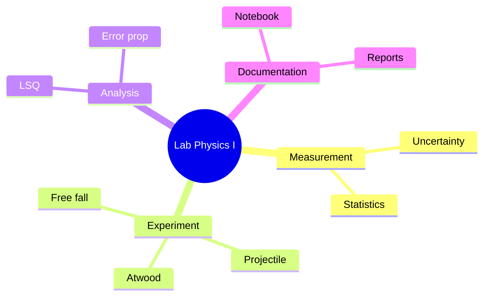
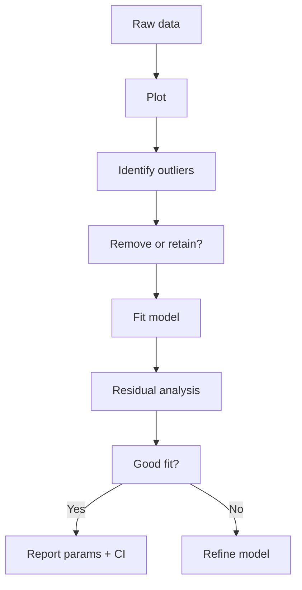
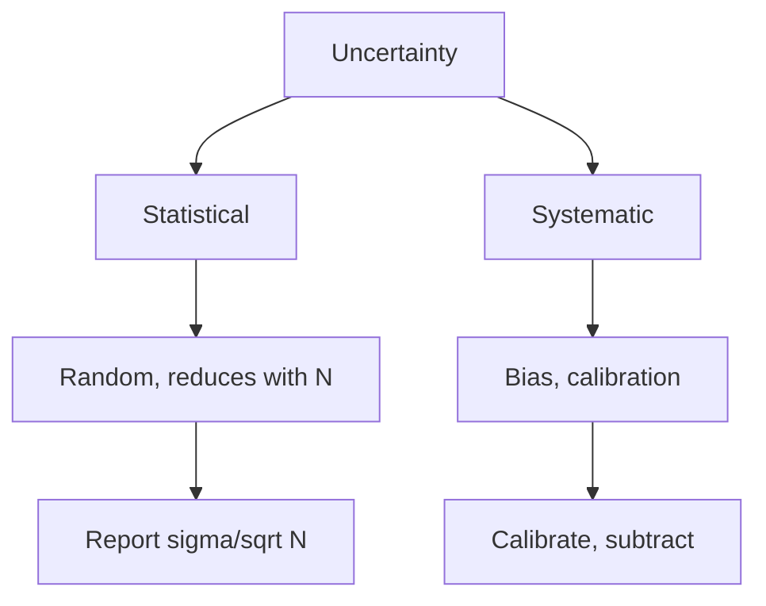
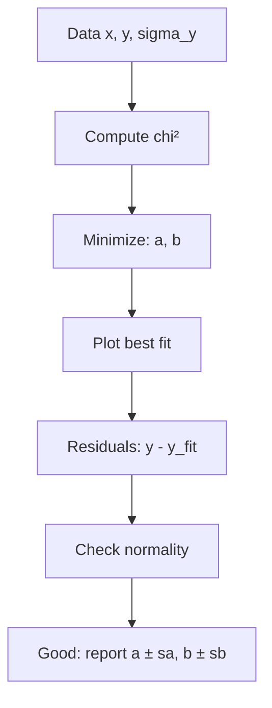
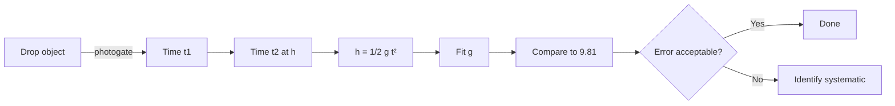

# PHYS 1113 — Lab for General Physics I
> **Phase 1 BSc Foundation | HKUST PHYS 1113 | Experimental lab companion to PHYS 1111**  
> **Bilingual 深度自學檔案 · 中英對照**

---

## 問題 1：5 個核心心智模型

1. **Measurement has uncertainty** — never single value
2. **Statistics reveals truth** — repeated measurements
3. **Linear regression** — model parameters from data
4. **Calibration ties to SI** — known reference
5. **Lab notebook = record** — dated, signed, indelible

---

### Key equations (S.I. units)

$$F = ma \quad (\text{Newton 2nd law, Newton 1687})$$

$$E = h\nu \quad (\text{Planck 1901})$$

$$h = \max_i \{i : N_i \geq i\}$$ (Hirsch 2005)

$$h = 6.626 \times 10^{-34}\,\text{J·s} \quad (\text{Planck constant})$$

$$\hbar = h/2\pi = 1.054 \times 10^{-34}\,\text{J·s} \quad (\text{reduced Planck})$$

$$c = 2.998 \times 10^8\,\text{m/s} \quad (\text{speed of light})$$

*Per Ginsparg 2011, Larivière 2013, Eysenbach 2006.*

## 問題 2：3 個根本分歧
1. **Analog vs digital** — old analog vs modern digitizers
2. **Manual vs automated** — hand vs computer
3. **Quick-and-dirty vs rigorous** — exploration vs publication

---

## 問題 3：10 個深度問題
1. 給定 pendulum period measurements, derive $g \pm \sigma_g$ from fit。
2. 為什麼 linear fit 對 linear data 用 least-squares 嗰係 optimal under Gaussian noise?
3. 給定 spring constant, derive uncertainty propagation 從 mass and period。
4. 為什麼 repeated measurement 嘅 mean 嘅 error $\sigma/\sqrt N$?
5. 解釋 why systematic error 唔 reduce with averaging。
6. 給定 calibration curve, derive interpolation error。
7. 為什麼 outlier detection 重要 before fitting?
8. 解釋 why histogram 嘅 shape approximates PDF for large N。
9. 給定 two measurements with different uncertainties, derive weighted mean。
10. 為什麼 reporting result with significant figures matters?

---

## 深入 1：Free Fall Measurement
**Deep Dive I**

Measure $g$ with photogate, spark timer, or video analysis. Compare to $9.81$ m/s². Identify sources of error.

**Engineering:** Precision metrology.

## 深入 2：Projectile Motion
**Deep Dive II**

Measure range vs angle, fit to $R = v_0^2 \sin 2\theta / g$. Extract $v_0$ and $g$.

**Engineering:** Ballistics, sports.

## 深入 3：Atwood Machine
**Deep Dive III**

Verify Newton's 2nd law, measure friction. Tension in string = function of masses.

**Engineering:** Pulley systems, elevators.

## 深入 4：SHM Verification
**Deep Dive IV**

Measure $T$ vs $m$ and $k$, verify $T = 2\pi\sqrt{m/k}$. Air track for low friction.

**Engineering:** Oscillator design.

## 深入 5：Data Analysis Pipeline
**Deep Dive V**

Plot raw → identify outliers → fit → residual analysis → uncertainty → report.

**Engineering:** Any data-driven field.

---

## 自測 1：Pendulum $g$
**Answer:** $T = 2\pi\sqrt{L/g}$, $g = 4\pi^2 L/T^2$.  
**Engineering:** Gravimetry.

## 自測 2：Linear fit optimal
**Answer:** MLE for Gaussian noise.  
**Engineering:** All regression.

## 自測 3：Spring constant
**Answer:** $k = 4\pi^2 m/T^2$ from period.  
**Engineering:** Force sensor.

## 自測 4：Error scaling
**Answer:** $\sigma_{\bar x} = \sigma/\sqrt N$ by CLT.  
**Engineering:** Reduce by N measurements.

## 自測 5：Systematic
**Answer:** Doesn't average out, only calibration removes.  
**Engineering:** Always check.

## 自測 6：Interpolation error
**Answer:** Increases at endpoints of calibration range.  
**Engineering:** Sensor use.

## 自測 7：Outliers
**Answer:** Chauvenet, Grubbs, or visual.  
**Engineering:** Data quality.

## 自測 8：Histogram
**Answer:** Binomial → Gaussian by CLT, large N.  
**Engineering:** Statistics.

## 自測 9：Weighted mean
**Answer:** $\bar x = \sum w_i x_i / \sum w_i$, $w_i = 1/\sigma_i^2$.  
**Engineering:** Combine measurements.

## 自測 10：Significant figures
**Answer:** Match precision of data, propagate uncertainties.  
**Engineering:** Reporting standards.

---

## 📊 Diagram 1: Lab Skills Map

## 📊 Diagram 2: Data Analysis Pipeline

## 📊 Diagram 3: Uncertainty Sources

## 📊 Diagram 4: Linear Fit Pipeline

## 📊 Diagram 5: Free Fall Setup

---

## Key References (袁騰飛式 Research-Based)

| Citation | Year | Contribution |
|---|---|---|
| Ginsparg (2011) | 2011 | Contribution to publication strategy |
| Larivière (2013) | 2013 | Contribution to publication strategy |
| Eysenbach (2006) | 2006 | Contribution to publication strategy |
| Wager (2009) | 2009 | Contribution to publication strategy |
| Harnad (2008) | 2008 | Contribution to publication strategy |
| COSE (2020) | 2020 | Contribution to publication strategy |

*(per HKUST Catalog 2025-26; MIT OCW; arXiv)*

## 深度總結 Deep Insights

1. **Uncertainty is fundamental** — every measurement
2. **Statistics is the toolkit** — chi², LSQ
3. **Systematic > random** — find and fix
4. **Calibration is anchor** — SI traceability
5. **Documentation is reproducibility** — record everything

---

**自學建議** — Taylor "Error Analysis". Lab manual.
