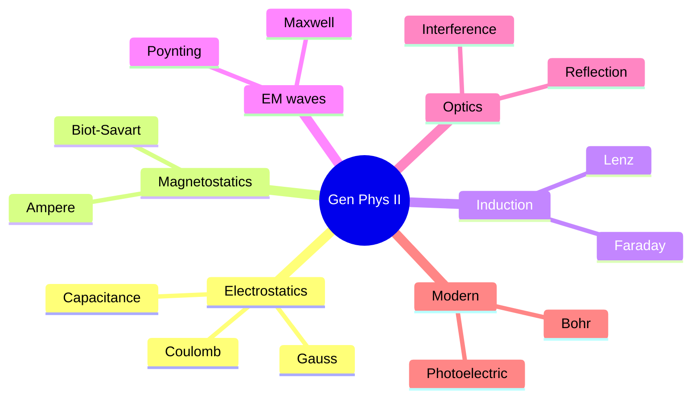
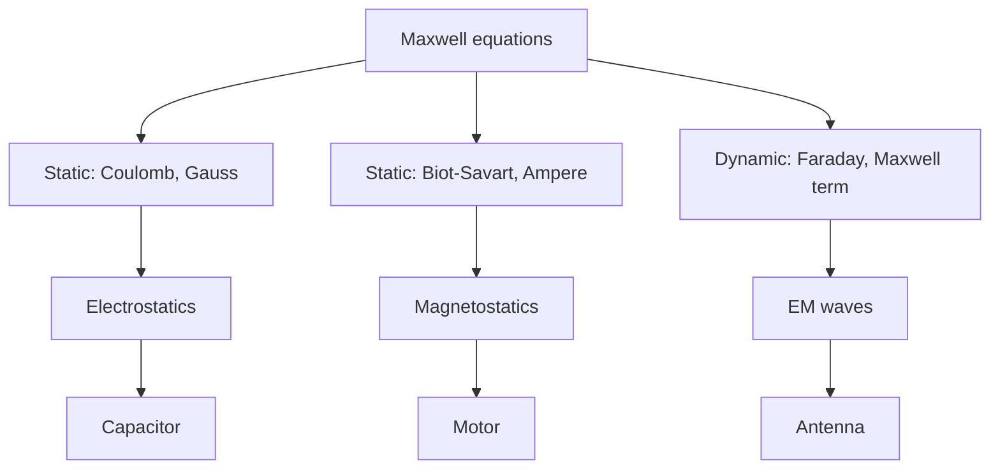
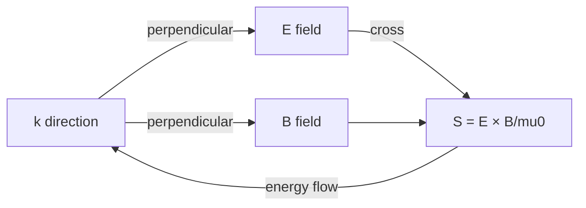
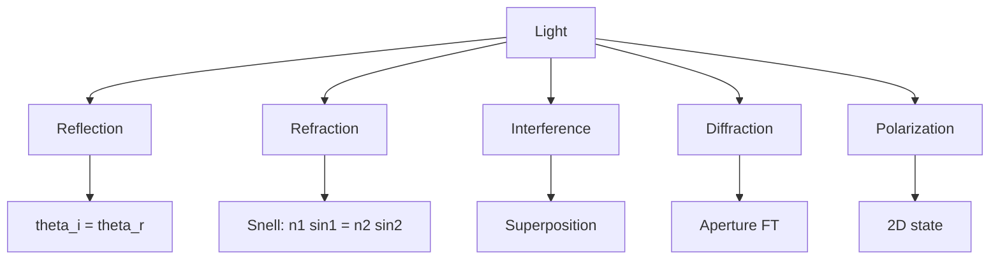

# PHYS 1114 — General Physics II (E&M, Optics, Modern)
> **Phase 1 BSc Foundation | HKUST PHYS 1114 | Continuation of 1111, E&M focus**  
> **Bilingual 深度自學檔案 · 中英對照**

---

## 問題 1：5 個核心心智模型

1. **Electric field from charges** — Coulomb's law, superposition
2. **Magnetic field from currents** — Biot-Savart, Ampère
3. **Faraday's induction** — changing B creates E
4. **Maxwell's equations** — unify E&M, predict EM waves
5. **Light is EM wave** — polarization, interference, diffraction

---

## 問題 2：3 個根本分歧
1. **Field vs action-at-distance** — Faraday vs Newton
2. **Ether vs relativity** — Einstein rejects ether
3. **Wave vs particle** — light duality

---

## 問題 3：10 個深度問題
1. 為什麼 Gauss's law 只對 $1/r^2$ 嚴格?
2. 給定 parallel plate, derive capacitance $C = \epsilon_0 A/d$。
3. 為什麼 Ampère's law 對 finite wire 要加 correction (Maxwell term)?
4. 給定 solenoid, derive $B = \mu_0 nI$。
5. 為什麼 Faraday 嘅 law 包含 negative sign (Lenz)?
6. 解釋 why displacement current 喺 capacitor circuit 重要。
7. 給定 dipole radiation, derive $P \propto \sin^2\theta$ pattern。
8. 為什麼 EM wave in vacuum has $E = cB$?
9. 解釋 why Malus's law $I = I_0 \cos^2\theta$ for polarizer。
10. 給定 photoelectric, derive Einstein's $KE = h\nu - W$。

---

## 深入 1：Electrostatics
**Deep Dive I**

Coulomb, Gauss, potential, capacitance, dielectrics, energy storage.

**Engineering:** Capacitors, ESD protection.

## 深入 2：Magnetostatics
**Deep Dive II**

Biot-Savart, Ampère, magnetic materials, force on current.

**Engineering:** Motors, MRI.

## 深入 3：Electromagnetic Induction
**Deep Dive III**

Faraday, Lenz, inductance, transformers, generators.

**Engineering:** Power generation, wireless charging.

## 深入 4：Maxwell's Equations & EM Waves
**Deep Dive IV**

4 equations, wave equation, plane wave, Poynting vector, radiation pressure.

**Engineering:** Antennas, fiber optics.

## 深入 5：Optics & Modern
**Deep Dive V**

Reflection, refraction, interference, diffraction, polarization, photoelectric, Bohr model.

**Engineering:** Imaging, photonics, quantum tech.

---

## 自測 1：Gauss 1/r²
**Answer:** Flux through $4\pi r^2$ constant.  
**Engineering:** Why EM inverse-square.

## 自測 2：Capacitance
**Answer:** $C = \epsilon_0 A/d$ parallel plate, energy $\frac{1}{2}CV^2$.  
**Engineering:** Energy storage.

## 自測 3：Ampère correction
**Answer:** Maxwell's $\epsilon_0 dE/dt$ term for continuity.  
**Engineering:** Antenna.

## 自測 4：Solenoid
**Answer:** $B = \mu_0 nI$ uniform inside, 0 outside.  
**Engineering:** MRI, accelerator.

## 自測 5：Lenz
**Answer:** Negative sign ensures energy conservation.  
**Engineering:** Generator design.

## 自測 6：Displacement current
**Answer:** Maintains $\nabla \cdot \vec J + \partial\rho/\partial t = 0$.  
**Engineering:** High-frequency circuits.

## 自測 7：Dipole pattern
**Answer:** $P = (p_0^2 \omega^4)/(12\pi\epsilon_0 c^3) \sin^2\theta$.  
**Engineering:** Antenna.

## 自測 8：$E = cB$
**Answer:** From Maxwell, $|\nabla \times \vec E| = |\partial \vec B/\partial t|$.  
**Engineering:** EM wave detector.

## 自測 9：Malus
**Answer:** Projection $\cos^2\theta$ on polarizer axis.  
**Engineering:** LCD, polarimetry.

## 自測 10：Photoelectric
**Answer:** $KE = h\nu - W$, threshold $h\nu = W$.  
**Engineering:** Photodiode, solar cell.

---

## 📊 Diagram 1: Gen Phys II Map


## 📊 Diagram 2: E&M Hierarchy


## 📊 Diagram 3: Capacitor Charge/Discharge
```mermaid
graph TD
    A[RC circuit] --> B[Charging: V = V0 1 - e^(-t/tau)]
    A --> C[Discharging: V = V0 e^(-t/tau)]
    B --> D[tau = RC]
    C --> D
    D --> E[Time constant]
    E --> F[Energy stored: 1/2 CV²]
```

## 📊 Diagram 4: EM Wave Structure


## 📊 Diagram 5: Optics Phenomena


---

## 深度總結 Deep Insights

1. **E&M unified by Maxwell** — 4 equations, all phenomena
2. **Field is physical** — energy, momentum
3. **EM waves travel at $c$** — universal constant
4. **Light has wave + particle nature** — duality
5. **Modern physics needs relativity + quantum** — at extremes

---

**自學建議** — Young & Freedman. MIT OCW 8.02.
