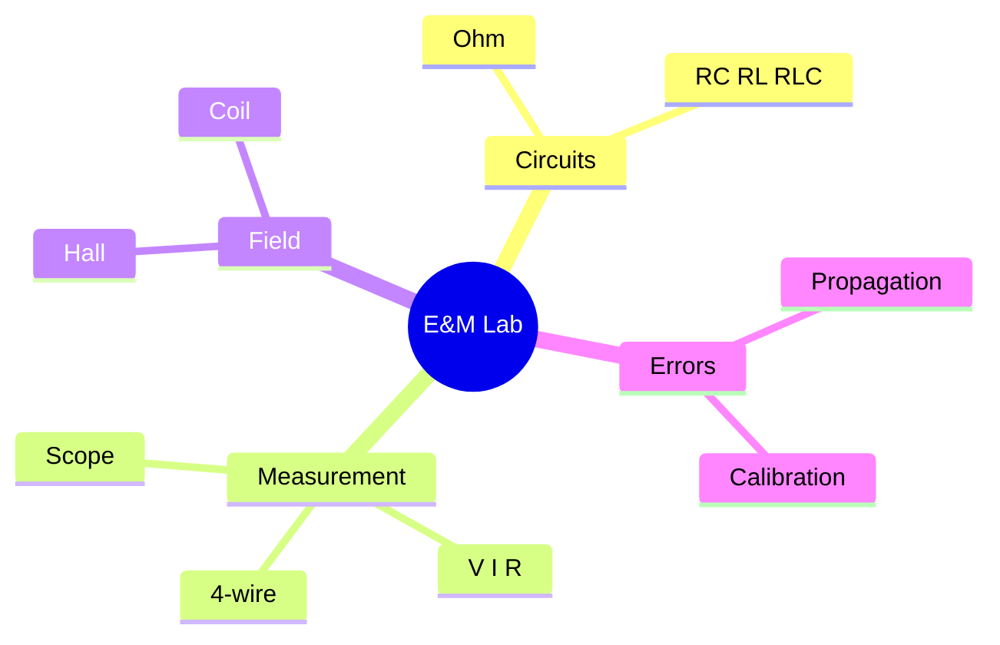
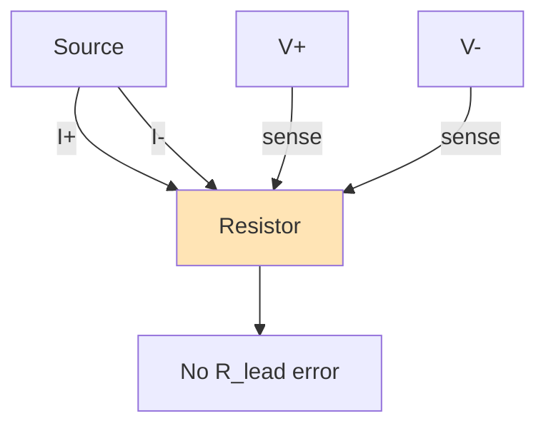
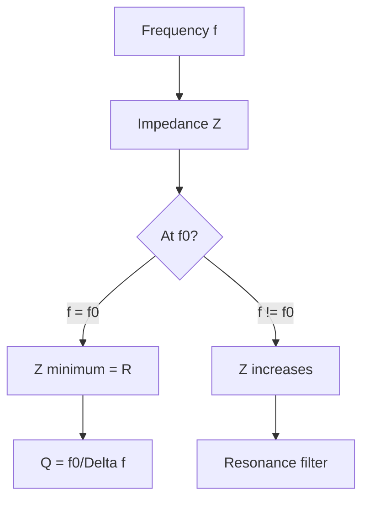
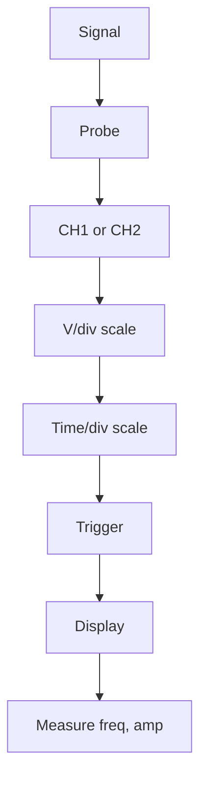

# PHYS 1115 — Lab for General Physics II
> **Phase 1 BSc Foundation | HKUST PHYS 1115 | E&M lab companion**  
> **Bilingual 深度自學檔案 · 中英對照**

---

## 問題 1：5 個核心心智模型

1. **Circuit measurement** — V, I, R, oscilloscope
2. **Calibration** — standard reference
3. **Error propagation** — $\sigma_f$ from $\sigma_x$, $\sigma_y$
4. **Fitting to physics** — linear, exponential, power law
5. **Reporting standards** — units, sig figs, uncertainties

---

## 問題 2：3 個根本分歧
1. **Analog vs digital meters** — accuracy, precision
2. **2-wire vs 4-wire** — for low resistance
3. **Quick check vs rigorous** — exploratory vs final

---

## 問題 3：10 個深度問題
1. 給定 voltmeter + ammeter, derive power $P = VI \pm \sigma_P$ with error propagation。
2. 為什麼 4-wire measurement 對 low R 重要?
3. 給定 oscilloscope trace, derive frequency and amplitude with uncertainty。
4. 解釋 why RL circuit 嘅 time constant $\tau = L/R$。
5. 為什麼 capacitor 喺 DC steady state = open circuit?
6. 給定 RLC circuit, derive resonance frequency $f_0 = 1/(2\pi\sqrt{LC})$。
7. 解釋 why grounding 重要 for low-noise measurement。
8. 給定 magnetic field probe, derive $B$ from Hall voltage。
9. 為什麼 power supply 嘅 current limit 設定 重要?
10. 解釋 why shielded cable 對 high-frequency 重要。

---

## 深入 1：Ohm's Law Verification
**Deep Dive I**

Measure V across R at various I, plot V vs I, slope = R. Compare to nominal.

**Engineering:** Resistor characterization.

## 深入 2：RC Circuit
**Deep Dive II**

Measure $\tau$ from charging curve. Compare to $RC$ predicted.

**Engineering:** Filter, integrator.

## 深入 3：RLC Resonance
**Deep Dive III**

Sweep frequency, find peak. $Q = f_0/\Delta f$ bandwidth.

**Engineering:** Filter, oscillator.

## 深入 4：Magnetic Field Measurement
**Deep Dive IV**

Hall probe: $V_H = IB/(qnd)$, calibrate with known field.

**Engineering:** Magnetometer.

## 深入 5：Oscilloscope Proficiency
**Deep Dive V**

Trigger, AC/DC coupling, time base, voltage scale, math channels.

**Engineering:** Any electrical work.

---

## 自測 1：Power with error
**Answer:** $\sigma_P = \sqrt{(V\sigma_I)^2 + (I\sigma_V)^2}$.  
**Engineering:** Power meter.

## 自測 2：4-wire
**Answer:** Separate I and V leads, no $R_{lead}$ error.  
**Engineering:** Precision $R$ measurement.

## 自測 3：Scope
**Answer:** Time/div × divisions, V/div × divisions.  
**Engineering:** Signal analysis.

## 自測 4：RL tau
**Answer:** $V(t) = V_0 e^{-Rt/L}$.  
**Engineering:** Solenoid, inductor.

## 自測 5：DC capacitor
**Answer:** No current flows at steady state.  
**Engineering:** DC blocking.

## 自測 6：RLC resonance
**Answer:** Impedance minimum at $f_0 = 1/(2\pi\sqrt{LC})$.  
**Engineering:** Tuned circuits.

## 自測 7：Grounding
**Answer:** Single-point ground avoids loops.  
**Engineering:** Low-noise design.

## 自測 8：Hall
**Answer:** $V_H = IB/(nqd)$, calibrate.  
**Engineering:** Magnetic sensor.

## 自測 9：Current limit
**Answer:** Protects circuit, prevents damage.  
**Engineering:** Power supply design.

## 自測 10：Shielding
**Answer:** Coaxial braid, Faraday cage.  
**Engineering:** RF, audio.

---

## 📊 Diagram 1: E&M Lab Map


## 📊 Diagram 2: 4-Wire Measurement


## 📊 Diagram 3: RC Circuit Response
```mermaid
graph TD
    A[Step input V0] --> B[Charging]
    B --> C[V t = V0 1 - e^(-t/tau)]
    A --> D[Discharging]
    D --> E[V t = V0 e^(-t/tau)]
    C --> F[tau = RC]
    E --> F
    F --> G[Time constant]
```

## 📊 Diagram 4: RLC Resonance


## 📊 Diagram 5: Oscilloscope Setup


---

## 深度總結 Deep Insights

1. **Circuits are physics** — Ohm, Maxwell in practice
2. **Measurement tools matter** — 4-wire, scope
3. **Time constants characterize** — RC, RL, RLC
4. **Resonance is selective** — filter, oscillator
5. **Calibration + shielding = clean measurement**

---

**自學建議** — Horowitz & Hill "Art of Electronics". Lab manual.
