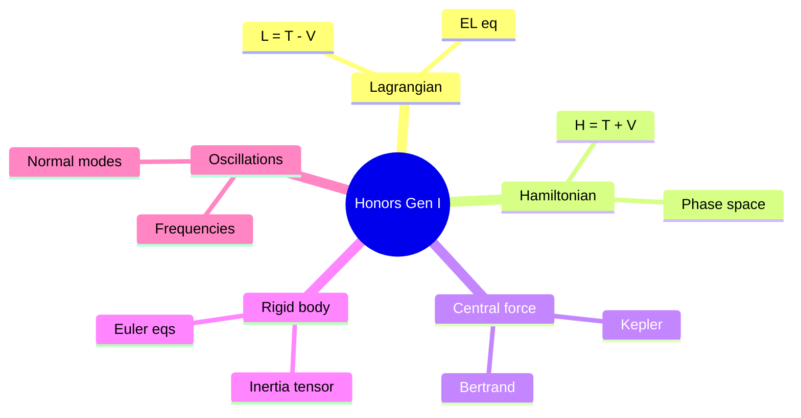
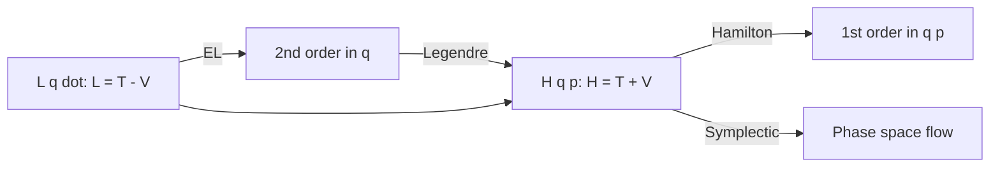
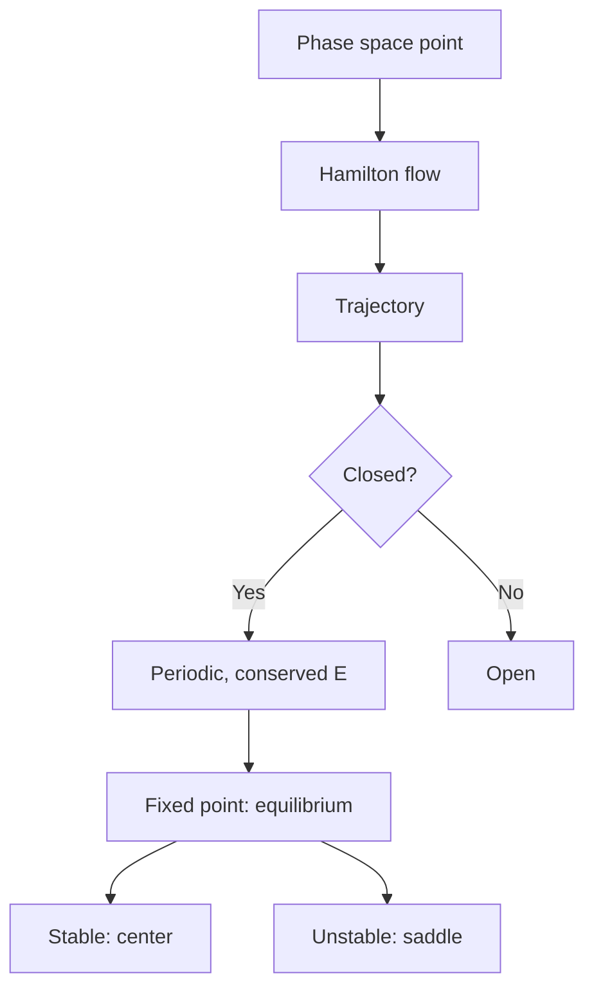
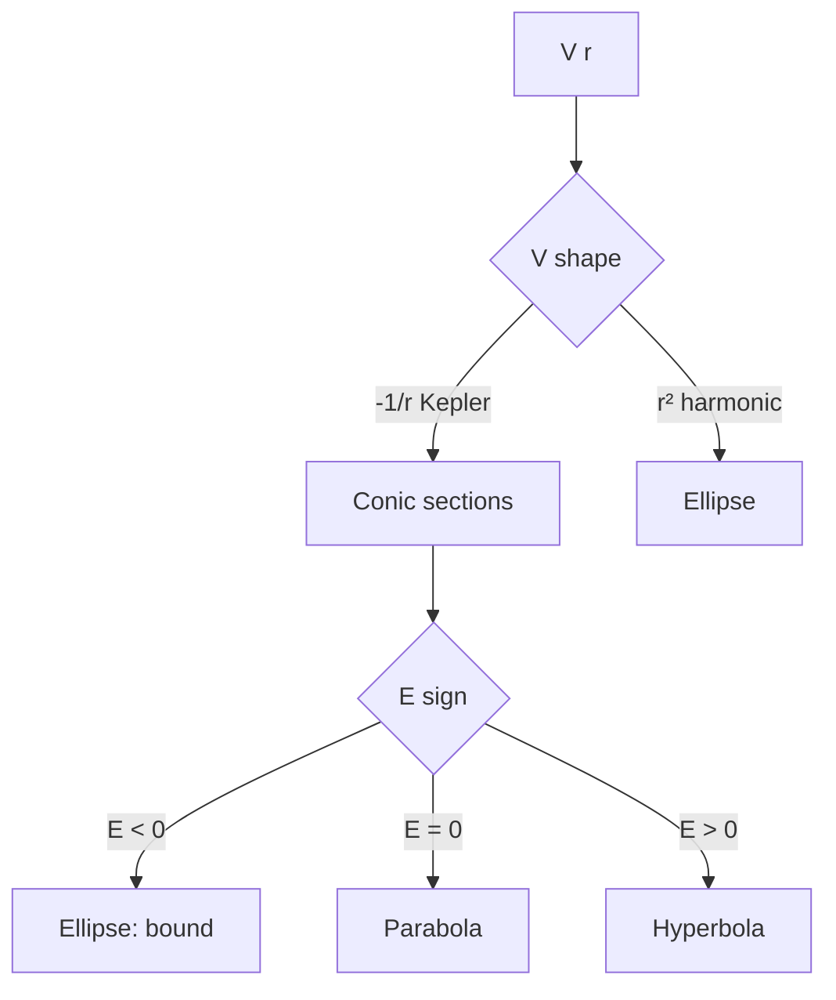
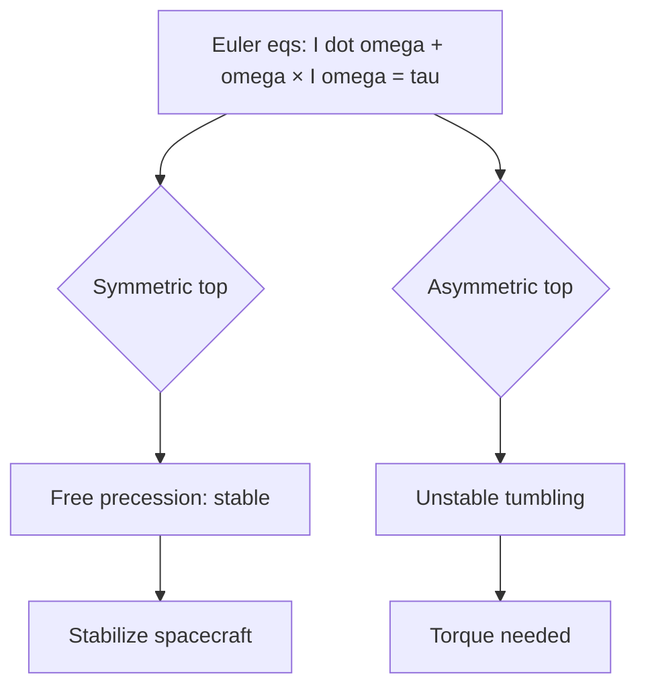

# PHYS 1312 — Honors General Physics I
> **Phase 1 BSc Foundation | HKUST PHYS 1312 | Rigorous calculus-based mechanics, smaller class**  
> **Bilingual 深度自學檔案 · 中英對照**

---

## 問題 1：5 個核心心智模型

1. **Newton's laws in 3D** — vector differential equations
2. **Conservation from symmetry** — Noether's theorem
3. **Lagrangian & Hamiltonian** — energy-based formulation
4. **Phase space** — $(q, p)$ representation
5. **Central force & orbits** — Kepler problem

---

## 問題 2：3 個根本分歧
1. **Newtonian vs Lagrangian vs Hamiltonian** — same physics, different formalism
2. **Determinism vs chaos** — sensitive dependence on ICs
3. **Classical vs relativistic** — $v \ll c$ limit

---

## 問題 3：10 個深度問題
1. 給定 Lagrangian $L = T - V$, derive Hamilton's equations。
2. 為什麼 phase space volume conserved (Liouville)?
3. 給定 double pendulum, derive small-angle EOMs, find normal modes。
4. 為什麼 Bertrand's theorem 只有 1/r² and r² have closed orbits?
5. 解釋 why Euler's equations predict free precession for symmetric top。
6. 給定 $L = \frac{1}{2}I\omega^2$, derive Euler-Lagrange for rotation。
7. 為什麼 Poisson brackets form a Lie algebra?
8. 給定 $V(r) = -k/r^2$ (interesting potential), find orbits。
9. 解釋 why action-angle variables useful for periodic orbits。
10. 給定 forced Duffing oscillator, derive amplitude response。

---

## 深入 1：Lagrangian Mechanics
**Deep Dive I**

$L = T - V$, generalized coords, constraints, Euler-Lagrange.

**Engineering:** Robotics, optimal control.

## 深入 2：Hamiltonian & Phase Space
**Deep Dive II**

$H = T + V$, canonical eqs, Liouville, action-angle.

**Engineering:** Statistical mechanics, accelerator.

## 深入 3：Central Force
**Deep Dive III**

Reduced mass, effective potential, Bertrand, Kepler orbits.

**Engineering:** Orbital, atomic.

## 深入 4：Rigid Body
**Deep Dive IV**

Inertia tensor, principal axes, Euler's equations, precession, nutation.

**Engineering:** Satellite, drone.

## 深入 5：Small Oscillations
**Deep Dive V**

Normal modes, eigenvalues, eigenvectors, modal analysis.

**Engineering:** Vibration, FEA.

---

## 自測 1：Hamilton's eqs
**Answer:** $\dot q = \partial H/\partial p$, $\dot p = -\partial H/\partial q$.  
**Engineering:** Symplectic integrators.

## 自測 2：Liouville
**Answer:** Phase space divergence-free, $\nabla \cdot \vec v = 0$.  
**Engineering:** Statistical mechanics.

## 自測 3：Double pendulum
**Answer:** 2 normal modes: symmetric, antisymmetric.  
**Engineering:** Crane.

## 自測 4：Bertrand
**Answer:** Only $V \propto r^2$ (harmonic) and $V \propto 1/r$ (Kepler) have all bound orbits closed.  
**Engineering:** Why these two potentials are special.

## 自測 5：Free precession
**Answer:** $\omega$ precesses around symmetry axis.  
**Engineering:** Gyroscope.

## 自測 6：Rotation Lagrangian
**Answer:** $L = \frac{1}{2}\vec\omega \cdot \mathbf I \cdot \vec\omega - V$.  
**Engineering:** Spinning spacecraft.

## 自測 7：Poisson Lie algebra
**Answer:** $\{A, B\}$ antisymmetric, Jacobi identity.  
**Engineering:** QM bridge.

## 自測 8：Inverse square
**Answer:** Orbits conic, eccentricity $e = \sqrt{1 + 2EL^2/(mk)^2}$.  
**Engineering:** Kepler.

## 自測 9：Action-angle
**Answer:** $J = \oint p \, dq$, angle $w = \partial S/\partial J$.  
**Engineering:** EBK quantization.

## 自測 10：Duffing
**Answer:** $\ddot x + 2\gamma \dot x + \alpha x + \beta x^3 = F\cos\omega t$, hysteresis.  
**Engineering:** MEMS, nonlinear vibration.

---

## 📊 Diagram 1: Honors Map

## 📊 Diagram 2: Lagrangian vs Hamiltonian

## 📊 Diagram 3: Phase Space Orbits

## 📊 Diagram 4: Central Force Orbits

## 📊 Diagram 5: Rigid Body Dynamics

---

## 深度總結 Deep Insights

1. **Symmetry → conservation** — Noether unifies
2. **Phase space geometry** — symplectic, Liouville
3. **Bertrand's theorem** — only 2 closed-orbit potentials
4. **Euler's equations** — rigid body general
5. **Small oscillations bridge** — to QM, FEA, vibration

---

**自學建議** — Goldstein "Classical Mechanics" + Taylor. MIT OCW 8.01 + 8.02.
