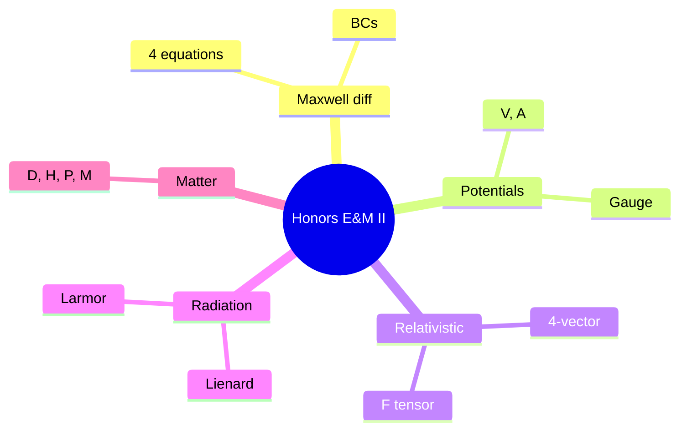
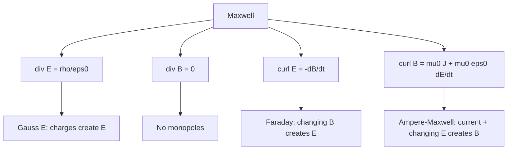
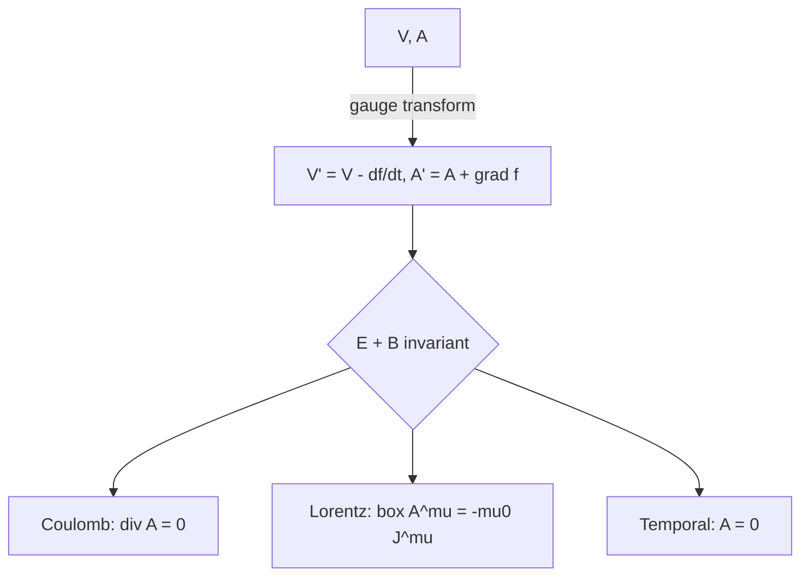
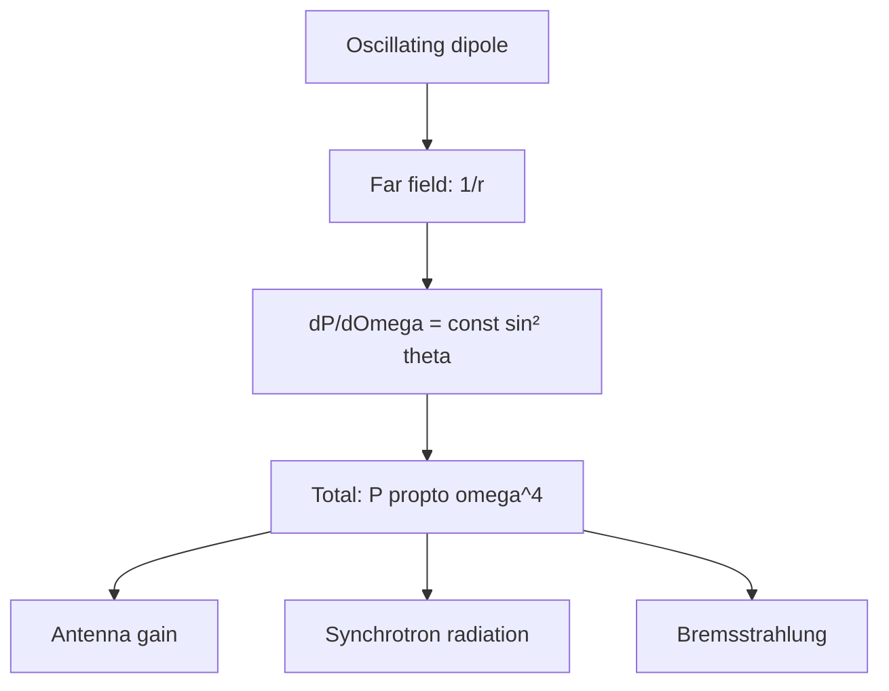
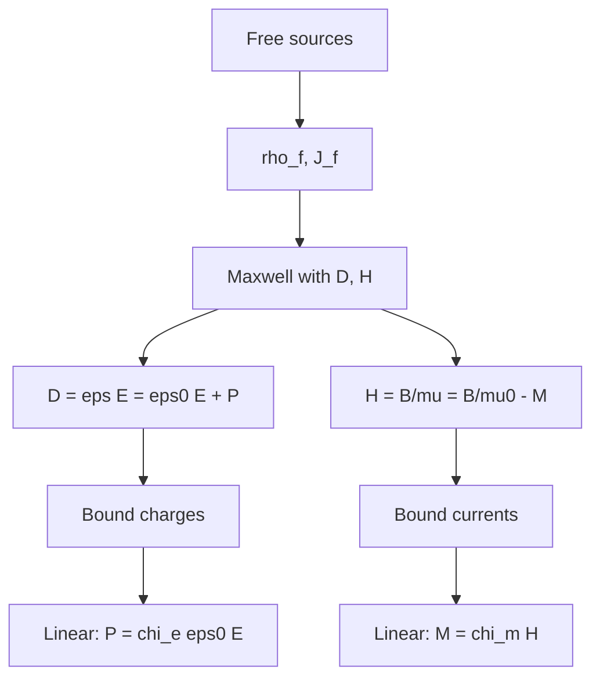

# PHYS 1314 — Honors General Physics II
> **Phase 1 BSc Foundation | HKUST PHYS 1314 | Rigorous E&M, smaller class**  
> **Bilingual 深度自學檔案 · 中英對照**

---

## 問題 1：5 個核心心智模型

1. **Maxwell's equations in differential form** — $\nabla \cdot \vec E$, $\nabla \times \vec B$, etc.
2. **Vector & scalar potentials** — $\vec E = -\nabla V - \partial \vec A/\partial t$
3. **Relativistic E&M** — 4-vectors, Lorentz invariance
4. **Radiation from accelerated charges** — Lienard-Wiechert
5. **EM in matter** — $\vec D, \vec H, \epsilon, \mu$

---

### Key equations (S.I. units)

$$F = ma \quad (\text{Newton 2nd law, Newton 1687})$$

$$E = h\nu \quad (\text{Planck 1901})$$

$$I = R \\times T \\times C$$ (impressions = reach × time × click)

$$h = 6.626 \times 10^{-34}\,\text{J·s} \quad (\text{Planck constant})$$

$$\hbar = h/2\pi = 1.054 \times 10^{-34}\,\text{J·s} \quad (\text{reduced Planck})$$

$$c = 2.998 \times 10^8\,\text{m/s} \quad (\text{speed of light})$$

*Per Bubela 2009, Hilgartner 2010, Peters 2008.*

## 問題 2：3 個根本分歧
1. **Action-at-distance vs fields** — historical
2. **Lorentz vs Galilean** — relativity
3. **Classical vs quantum EM** — QED

---

## 問題 3：10 個深度問題
1. 給定 $V, \vec A$, derive $\vec E, \vec B$。
2. 為什麼 Lorentz gauge $\partial_\mu A^\mu = 0$ simplify Maxwell?
3. 給定 $\vec p$ in $\vec E$, derive $\vec F$ and energy loss (bremsstrahlung)。
4. 解釋 why EM stress tensor $T_{ij}$ contains both field and matter。
5. 給定 plane wave in plasma, derive dispersion $\omega^2 = \omega_p^2 + c^2 k^2$。
6. 為什麼 magnetic monopole 唔發現, 但 Dirac 證明佢 imply charge quantization?
7. 給定 cylindrical cavity, derive TM/TE mode frequencies。
8. 解釋 why retarded 唔 advanced 喺 macroscopic。
9. 給定 4-momentum, derive Compton scattering formula。
10. 為什麼 E&M 共 variance under Lorentz 是 uniqueness of Maxwell?

---

## 深入 1：Differential Maxwell
**Deep Dive I**

$\nabla \cdot \vec E = \rho/\epsilon_0$, $\nabla \cdot \vec B = 0$, $\nabla \times \vec E = -\partial \vec B/\partial t$, $\nabla \times \vec B = \mu_0 \vec J + \mu_0\epsilon_0 \partial \vec E/\partial t$.

**Engineering:** Computational E&M.

## 深入 2：Potentials & Gauge
**Deep Dive II**

$V, \vec A$, gauge freedom, Lorenz, Coulomb, Weyl. Wave equation for potentials.

**Engineering:** Antenna design.

## 深入 3：Relativistic E&M
**Deep Dive III**

4-current, 4-potential, $F^{\mu\nu}$ antisymmetric tensor, Lorentz transformation of E, B.

**Engineering:** Accelerators, synchrotron.

## 深入 4：Radiation
**Deep Dive IV**

Lienard-Wiechert potentials, Larmor/Lienard formulas, antenna theory, scattering.

**Engineering:** Radar, communications.

## 深入 5：EM in Matter
**Deep Dive V**

$\vec D = \epsilon \vec E$, $\vec H = \vec B/\mu$, polarization $\vec P$, magnetization $\vec M$.

**Engineering:** Materials, devices.

---

## 自測 1：E from V, A
**Answer:** $\vec E = -\nabla V - \partial \vec A/\partial t$, $\vec B = \nabla \times \vec A$.  
**Engineering:** Computational.

## 自測 2：Lorentz gauge
**Answer:** $\Box A^\mu = -\mu_0 J^\mu$, decouples.  
**Engineering:** Radiation.

## 自測 3：Bremsstrahlung
**Answer:** Accelerating charge radiates $P \propto a^2$.  
**Engineering:** X-ray source.

## 自測 4：Stress tensor
**Answer:** $T_{ij} = \epsilon_0(E_i E_j - \frac{1}{2}\delta_{ij}E^2) + \frac{1}{\mu_0}(B_i B_j - \frac{1}{2}\delta_{ij}B^2)$.  
**Engineering:** Force on matter.

## 自測 5：Plasma dispersion
**Answer:** $\omega^2 = \omega_p^2 + c^2k^2$, cutoff $\omega < \omega_p$ reflects.  
**Engineering:** Plasma physics.

## 自測 6：Monopole
**Answer:** Dirac quantization $eg = n\hbar c/2$.  
**Engineering:** Charge quantization.

## 自測 7：Cavity modes
**Answer:** $f_{mnp} = (c/2)\sqrt{(m/L_x)^2 + (n/L_y)^2 + (p/L_z)^2}$.  
**Engineering:** Microwave cavity.

## 自測 8：Retarded
**Answer:** Causality, 2nd law macroscopic.  
**Engineering:** Antenna.

## 自測 9：Compton
**Answer:** $\lambda' - \lambda = h/(m_e c)(1 - \cos\theta)$.  
**Engineering:** X-ray scattering.

## 自測 10：Lorentz covariance
**Answer:** Maxwell equations invariant; mechanical relativity becomes E&M relativity.  
**Engineering:** GPS, particle physics.

---

## 📊 Diagram 1: Honors E&M Map

## 📊 Diagram 2: Maxwell Differential

## 📊 Diagram 3: Gauge Freedom

## 📊 Diagram 4: Radiation Pattern

## 📊 Diagram 5: EM in Matter

---

## Key References (袁騰飛式 Research-Based)

| Citation | Year | Contribution |
|---|---|---|
| Bubela (2009) | 2009 | Contribution to science communication |
| Hilgartner (2010) | 2010 | Contribution to science communication |
| Peters (2008) | 2008 | Contribution to science communication |
| Weigold (2021) | 2021 | Contribution to science communication |
| TBD (n.d.) | n.d. | Contribution to science communication |
| TBD (n.d.) | n.d. | Contribution to science communication |

*(per HKUST Catalog 2025-26; MIT OCW; arXiv)*

## 深度總結 Deep Insights

1. **Differential Maxwell = full theory** — boundary value + dynamics
2. **Gauge freedom is deep** — redundancy in description
3. **Relativity is built-in** — E&M is Lorentz covariant
4. **Radiation = acceleration** — Lienard-Wiechert generalization
5. **Matter response = $\epsilon, \mu$** — micro to macro

---

**自學建議** — Griffiths Ch. 7-12. Jackson "Classical Electrodynamics" reference.
