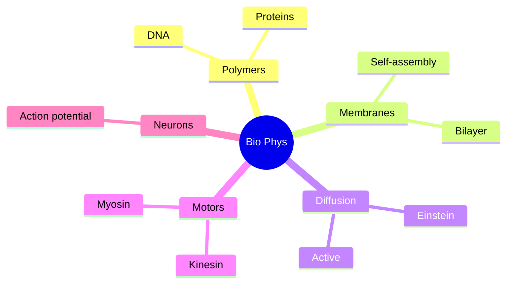
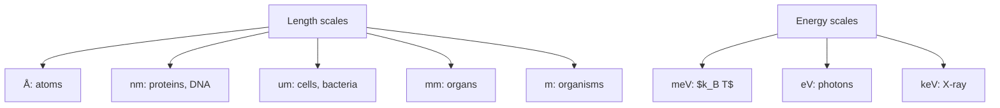
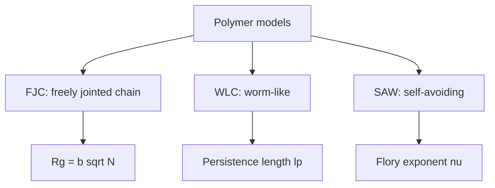
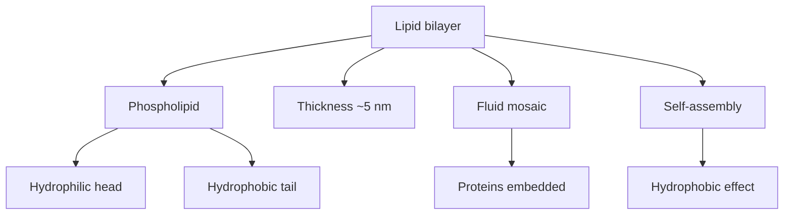
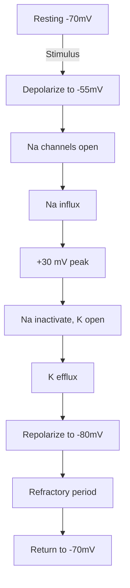

# PHYS 2010 — Intro to Biological Physics
> **Phase 1 BSc Foundation | HKUST PHYS 2010 | Physics of life, soft matter, biophysics**  
> **Bilingual 深度自學檔案 · 中英對照**

---

## 問題 1：5 個核心心智模型

1. **Soft matter** — polymers, membranes, colloids
2. **Diffusion = random walk** — Einstein 1905
3. **Self-assembly** — entropy-driven order
4. **Energy scales** — $k_B T$ vs $eV$ vs bond
5. **Length scales** — nm to μm, different physics

---

## 問題 2：3 個根本分歧
1. **Reductionist vs holistic** — molecular vs systems biology
2. **Equilibrium vs active matter** — passive vs driven
3. **Continuum vs discrete** — macroscopic vs molecular

---

## 問題 3：10 個深度問題
1. 為什麼 DNA persistence length ~50 nm, much longer than its diameter?
2. 給定 protein, derive folding free energy landscape。
3. 為什麼 lipid bilayer self-assembles?
4. 解釋 why bacterial swimming low Reynolds number (no inertia)。
5. 給定 channel protein, derive ion current $I = g(V - V_{rev})$。
6. 為什麼 muscle contraction uses ATP hydrolysis cycle?
7. 解釋 why blood is shear-thinning fluid。
8. 給定 axon, derive action potential from Hodgkin-Huxley。
9. 為什麼 protein folding problem is NP-hard computationally?
10. 解釋 why $k_B T \approx 4$ pN·nm sets biological force scale。

---

## 深入 1：Polymers & DNA
**Deep Dive I**

Freely-jointed chain, persistence length, WLC model. Worm-like chain for DNA.

**Engineering:** Single-molecule experiments, sequencing.

## 深入 2：Membranes & Self-Assembly
**Deep Dive II**

Lipid bilayers, amphiphilicity, $k_B T$ energy, line tension, curvature.

**Engineering:** Drug delivery, vesicles.

## 深入 3：Diffusion & Transport
**Deep Dive III**

Einstein: $D = k_B T/(6\pi\eta r)$. Fick's laws, MSD $\langle r^2 \rangle = 2dDt$. Active transport.

**Engineering:** Drug delivery, cellular signaling.

## 深入 4：Motor Proteins & Active Matter
**Deep Dive IV**

Kinesin, myosin, ATPase. Force generation, stepping. Cytoskeletal dynamics.

**Engineering:** Molecular machines, synthetic biology.

## 深入 5：Neurons & Action Potentials
**Deep Dive V**

Hodgkin-Huxley: Na, K channels, voltage-clamp, propagation.

**Engineering:** Neuroscience, neural prosthetics.

---

## 自測 1：DNA persistence
**Answer:** $l_p \approx 50$ nm, WLC model.  
**Engineering:** Single-molecule.

## 自測 2：Folding landscape
**Answer:** Funnel to native state, $k_B T$ noise.  
**Engineering:** Folding prediction.

## 自測 3：Bilayer
**Answer:** Hydrophobic effect drives self-assembly.  
**Engineering:** Liposomes.

## 自測 4：Low Re
**Answer:** $Re \ll 1$, viscous dominant, scallop theorem.  
**Engineering:** Microfluidics.

## 自測 5：Channel current
**Answer:** $I = g(V - V_{rev})$, ohmic.  
**Engineering:** Electrophysiology.

## 自測 6：ATP cycle
**Answer:** Cross-bridge cycle, ~5 pN per myosin head.  
**Engineering:** Muscle modeling.

## 自測 7：Shear-thinning
**Answer:** RBC aggregation breaks under shear.  
**Engineering:** Blood flow.

## 自測 8：Hodgkin-Huxley
**Answer:** Coupled ODEs for Na, K activation/inactivation.  
**Engineering:** Neuro simulations.

## 自測 9：NP-hard folding
**Answer:** Conformational space exponential, Levinthal's paradox.  
**Engineering:** AlphaFold.

## 自測 10：$k_B T$ scale
**Answer:** $4$ pN·nm at room T, sets biological forces.  
**Engineering:** Why biology is $k_B T$-driven.

---

## 📊 Diagram 1: Biological Physics Map

## 📊 Diagram 2: Length & Energy Scales

## 📊 Diagram 3: Polymer Models

## 📊 Diagram 4: Membrane Structure

## 📊 Diagram 5: Action Potential

---

## 深度總結 Deep Insights

1. **$k_B T$ dominates biology** — at room T, all forces
2. **Self-assembly = entropy + energy** — not just minimization
3. **Soft matter ≠ hard matter** — different physics
4. **Active matter breaks equilibrium** — non-equilibrium steady state
5. **Biophysics = physics + chemistry + biology** — interdisciplinary

---

**自學建議** — Phillips et al. "Physical Biology of the Cell". Alberts "Molecular Biology".
